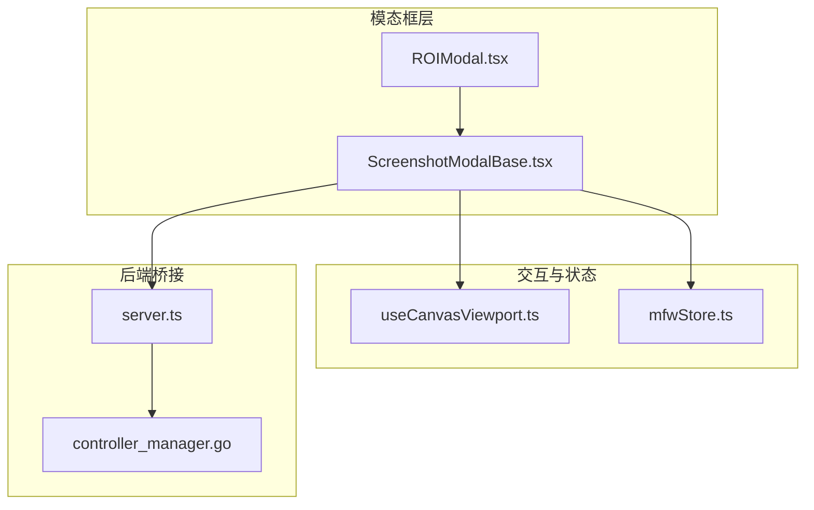
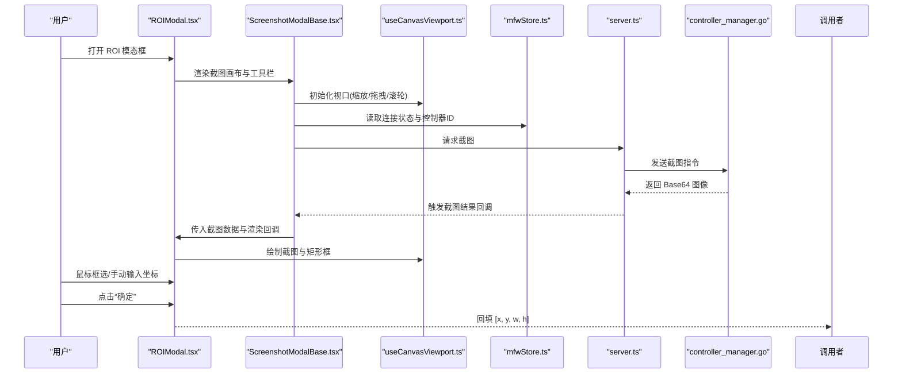
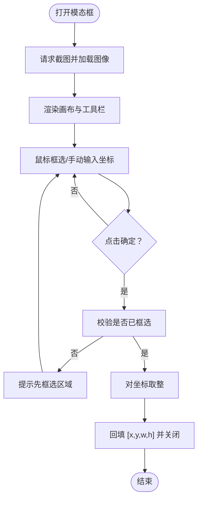
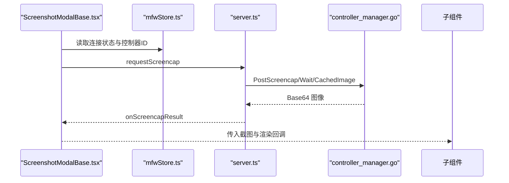
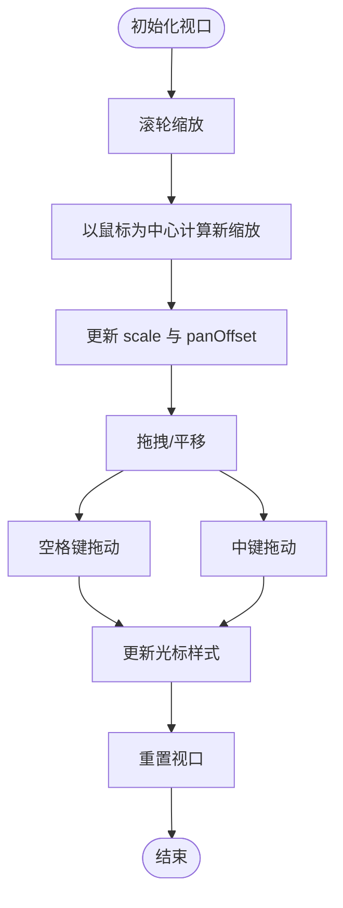
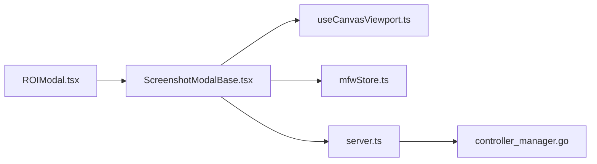

# 区域选择模态框

<cite>
**本文引用的文件列表**
- [ROIModal.tsx](file://src/components/modals/ROIModal.tsx)
- [ScreenshotModalBase.tsx](file://src/components/modals/ScreenshotModalBase.tsx)
- [useCanvasViewport.ts](file://src/hooks/useCanvasViewport.ts)
- [mfwStore.ts](file://src/stores/mfwStore.ts)
- [server.ts](file://src/services/server.ts)
- [controller_manager.go](file://LocalBridge/internal/mfw/controller_manager.go)
- [1.2-术语解释.md](file://instructions/maafw-pipeline/1.2-术语解释.md)
- [3.1-任务流水线协议.md](file://instructions/maafw-pipeline/3.1-任务流水线协议.md)
- [模板匹配识别.md](file://instructions/maafw-golang/高级功能/流水线配置/节点结构详解/识别配置详解/模板匹配识别.md)
</cite>

## 目录
1. [简介](#简介)
2. [项目结构](#项目结构)
3. [核心组件](#核心组件)
4. [架构总览](#架构总览)
5. [详细组件分析](#详细组件分析)
6. [依赖分析](#依赖分析)
7. [性能考虑](#性能考虑)
8. [故障排查指南](#故障排查指南)
9. [结论](#结论)

## 简介
本篇文档聚焦“区域选择模态框”（ROI 模态框），系统性说明其交互流程、技术实现与在流水线识别中的作用。该模态框允许用户通过截图画布进行矩形框选，或手动输入 ROI 坐标，最终输出 [x, y, w, h] 四元组，用于后续识别配置（如模板匹配、特征匹配、颜色匹配等）。文档还解释了 ROI 的术语背景、协议规范与在不同识别类型中的使用方式。

## 项目结构
- 区域选择模态框由一个通用截图模态基座与具体的 ROI 选择组件构成：
  - 通用截图模态基座负责截图请求、加载、缩放与拖拽、工具栏与底部按钮等通用能力。
  - ROI 选择组件在基座之上扩展了画布绘制、鼠标拖拽框选、坐标输入与确认回填逻辑。
- 两者通过统一的 Canvas 渲染接口协作，形成可复用的“截图 + 工具”组合。

图表来源
- [ScreenshotModalBase.tsx](file://src/components/modals/ScreenshotModalBase.tsx#L1-L293)
- [ROIModal.tsx](file://src/components/modals/ROIModal.tsx#L1-L300)
- [useCanvasViewport.ts](file://src/hooks/useCanvasViewport.ts#L1-L307)
- [mfwStore.ts](file://src/stores/mfwStore.ts#L1-L134)
- [server.ts](file://src/services/server.ts#L1-L298)
- [controller_manager.go](file://LocalBridge/internal/mfw/controller_manager.go#L394-L446)

章节来源
- [ScreenshotModalBase.tsx](file://src/components/modals/ScreenshotModalBase.tsx#L1-L293)
- [ROIModal.tsx](file://src/components/modals/ROIModal.tsx#L1-L300)

## 核心组件
- ScreenshotModalBase：提供截图请求、加载、缩放、拖拽、工具栏与底部按钮的通用容器，支持自定义渲染 Canvas 与子内容区。
- ROIModal：在截图画布上实现矩形框选、坐标输入与确认回填，输出 [x, y, w, h]。
- useCanvasViewport：封装缩放、拖拽、空格键与中键拖动、滚轮缩放、初始适配等视口控制逻辑。
- mfwStore：维护连接状态、控制器类型与 ID 等全局状态，供截图请求使用。
- server：封装本地 WebSocket 服务与协议注册，负责截图请求与结果监听。
- LocalBridge 控制器管理：负责向底层设备请求截图、编码并返回 Base64 图像。

章节来源
- [ScreenshotModalBase.tsx](file://src/components/modals/ScreenshotModalBase.tsx#L1-L293)
- [ROIModal.tsx](file://src/components/modals/ROIModal.tsx#L1-L300)
- [useCanvasViewport.ts](file://src/hooks/useCanvasViewport.ts#L1-L307)
- [mfwStore.ts](file://src/stores/mfwStore.ts#L1-L134)
- [server.ts](file://src/services/server.ts#L1-L298)
- [controller_manager.go](file://LocalBridge/internal/mfw/controller_manager.go#L394-L446)

## 架构总览
下面的时序图展示了从打开 ROI 模态框到确认回填的完整流程，包括截图请求、图像加载、画布渲染与用户交互。

图表来源
- [ROIModal.tsx](file://src/components/modals/ROIModal.tsx#L1-L300)
- [ScreenshotModalBase.tsx](file://src/components/modals/ScreenshotModalBase.tsx#L1-L293)
- [useCanvasViewport.ts](file://src/hooks/useCanvasViewport.ts#L1-L307)
- [mfwStore.ts](file://src/stores/mfwStore.ts#L1-L134)
- [server.ts](file://src/services/server.ts#L1-L298)
- [controller_manager.go](file://LocalBridge/internal/mfw/controller_manager.go#L394-L446)

## 详细组件分析

### ROI 模态框（ROIModal）
- 功能职责
  - 通过截图画布展示设备屏幕，支持滚轮缩放、空格键或中键拖动平移。
  - 用户可拖拽鼠标绘制矩形区域，实时预览 ROI；也可手动输入 X/Y/W/H。
  - 确认后将四元组 [x, y, w, h] 回填给调用方。
- 关键交互
  - 鼠标按下：记录起点，进入绘制状态。
  - 鼠标移动：根据起点与当前位置计算矩形宽高，支持反向拖拽。
  - 鼠标抬起：结束绘制，保留最终矩形。
  - 坐标输入：InputNumber 精确到整数，禁用状态随截图加载而启用。
- 数据流
  - 截图加载完成后，将图像绘制到 Canvas，并叠加 ROI 矩形填充与描边。
  - 确认时对坐标取整并回传，关闭模态框。

图表来源
- [ROIModal.tsx](file://src/components/modals/ROIModal.tsx#L1-L300)
- [ScreenshotModalBase.tsx](file://src/components/modals/ScreenshotModalBase.tsx#L1-L293)

章节来源
- [ROIModal.tsx](file://src/components/modals/ROIModal.tsx#L1-L300)

### 截图模态基座（ScreenshotModalBase）
- 功能职责
  - 统一管理截图请求、结果监听与状态重置。
  - 提供工具栏（缩放/重置）、提示信息与底部按钮（重新截图/取消/确定）。
  - 通过 renderCanvas 回调注入自定义画布渲染逻辑。
- 关键机制
  - 打开时自动请求截图并重置视口；关闭时清理状态。
  - 监听截图结果事件，成功后将 Base64 图像传给子组件。
  - 通过 useCanvasViewport 提供缩放、拖拽、滚轮缩放与初始适配。

图表来源
- [ScreenshotModalBase.tsx](file://src/components/modals/ScreenshotModalBase.tsx#L1-L293)
- [mfwStore.ts](file://src/stores/mfwStore.ts#L1-L134)
- [server.ts](file://src/services/server.ts#L1-L298)
- [controller_manager.go](file://LocalBridge/internal/mfw/controller_manager.go#L394-L446)

章节来源
- [ScreenshotModalBase.tsx](file://src/components/modals/ScreenshotModalBase.tsx#L1-L293)

### 视口控制 Hook（useCanvasViewport）
- 功能职责
  - 管理缩放级别与平移偏移，限制最小/最大缩放范围。
  - 处理滚轮缩放、空格键拖拽、中键拖拽与初始适配。
  - 提供光标样式反馈与重置状态的能力。
- 交互细节
  - 滚轮事件计算鼠标在图像坐标系下的位置，以鼠标为中心进行缩放。
  - 空格键与中键拖动切换为抓取/抓取中光标样式，拖动时更新平移偏移。
  - 初始适配根据容器与图像尺寸计算 fit-scale 并居中。

图表来源
- [useCanvasViewport.ts](file://src/hooks/useCanvasViewport.ts#L1-L307)

章节来源
- [useCanvasViewport.ts](file://src/hooks/useCanvasViewport.ts#L1-L307)

### ROI 的术语与协议规范
- 术语解释
  - ROI（感兴趣区域）：定义图像识别边界，仅在该区域内进行相关图像处理。
- 协议规范
  - 识别区域 roi 支持数组 [x, y, w, h] 或节点名引用，缺省为全屏。
  - roi_offset 可在 roi 基础上额外移动再作为范围。
- 在识别类型中的使用
  - 模板匹配、特征匹配、颜色匹配等识别类型均可通过 ROI 精准限定搜索范围，提升性能与准确性。

章节来源
- [1.2-术语解释.md](file://instructions/maafw-pipeline/1.2-术语解释.md#L38-L53)
- [3.1-任务流水线协议.md](file://instructions/maafw-pipeline/3.1-任务流水线协议.md#L289-L334)
- [模板匹配识别.md](file://instructions/maafw-golang/高级功能/流水线配置/节点结构详解/识别配置详解/模板匹配识别.md#L1-L27)

## 依赖分析
- 组件耦合
  - ROIModal 依赖 ScreenshotModalBase 的通用截图与画布渲染能力。
  - ScreenshotModalBase 依赖 useCanvasViewport 提供的视口控制与缩放拖拽。
  - ScreenshotModalBase 依赖 mfwStore 获取连接状态与控制器 ID，用于截图请求。
  - server.ts 作为协议层，负责与 LocalBridge 通信，后者执行实际截图。
- 外部依赖
  - WebSocket 通信与协议版本握手。
  - 图像编码为 Base64，便于前端渲染与传输。

图表来源
- [ROIModal.tsx](file://src/components/modals/ROIModal.tsx#L1-L300)
- [ScreenshotModalBase.tsx](file://src/components/modals/ScreenshotModalBase.tsx#L1-L293)
- [useCanvasViewport.ts](file://src/hooks/useCanvasViewport.ts#L1-L307)
- [mfwStore.ts](file://src/stores/mfwStore.ts#L1-L134)
- [server.ts](file://src/services/server.ts#L1-L298)
- [controller_manager.go](file://LocalBridge/internal/mfw/controller_manager.go#L394-L446)

章节来源
- [ROIModal.tsx](file://src/components/modals/ROIModal.tsx#L1-L300)
- [ScreenshotModalBase.tsx](file://src/components/modals/ScreenshotModalBase.tsx#L1-L293)
- [useCanvasViewport.ts](file://src/hooks/useCanvasViewport.ts#L1-L307)
- [mfwStore.ts](file://src/stores/mfwStore.ts#L1-L134)
- [server.ts](file://src/services/server.ts#L1-L298)
- [controller_manager.go](file://LocalBridge/internal/mfw/controller_manager.go#L394-L446)

## 性能考虑
- ROI 精准定位
  - 通过缩小 ROI，减少无关区域的计算开销，提升识别吞吐与稳定性。
- 缩放与拖拽
  - 合理的缩放步进与范围限制，避免过度放大导致渲染压力。
  - 初始适配时根据容器尺寸计算 fit-scale，保证首屏观感与性能平衡。
- 截图请求
  - 仅在打开模态框时请求截图，避免频繁刷新；必要时提供“重新截图”按钮。
- 图像编码
  - 后端将图像编码为 PNG 并 Base64 返回，前端直接渲染，避免额外解码成本。

章节来源
- [ScreenshotModalBase.tsx](file://src/components/modals/ScreenshotModalBase.tsx#L1-L293)
- [useCanvasViewport.ts](file://src/hooks/useCanvasViewport.ts#L1-L307)
- [controller_manager.go](file://LocalBridge/internal/mfw/controller_manager.go#L394-L446)

## 故障排查指南
- 无法获取截图
  - 检查连接状态与控制器 ID 是否有效；只有在连接状态下才会发起截图请求。
  - 确认本地服务已启动且端口可用，WebSocket 握手成功。
- 截图空白或加载失败
  - 确认设备端截图方法可用；必要时切换截图方法或使用缓存策略。
  - 检查截图结果回调是否触发，确认 Base64 图像有效。
- 画布无响应
  - 确认容器存在且可接收滚轮事件；检查缩放与拖拽逻辑是否被禁用。
  - 空格键与中键拖动需在容器内生效，避免焦点不在容器上。
- ROI 无效
  - 确保已框选区域后再点击“确定”；否则会提示先框选区域。
  - 手动输入坐标时需为整数，且在截图加载后方可编辑。

章节来源
- [ScreenshotModalBase.tsx](file://src/components/modals/ScreenshotModalBase.tsx#L1-L293)
- [ROIModal.tsx](file://src/components/modals/ROIModal.tsx#L1-L300)
- [server.ts](file://src/services/server.ts#L1-L298)
- [mfwStore.ts](file://src/stores/mfwStore.ts#L1-L134)

## 结论
ROI 模态框通过“截图 + 画布 + 交互”的组合，为识别配置提供了直观、高效的区域选择体验。其核心在于：
- 通用截图基座与可插拔画布渲染，便于扩展其他识别工具（如取色、模板选择等）。
- 完整的视口控制与用户交互，兼顾易用性与性能。
- 与流水线协议中的 ROI 字段无缝衔接，支持多种识别类型精准定位目标区域。