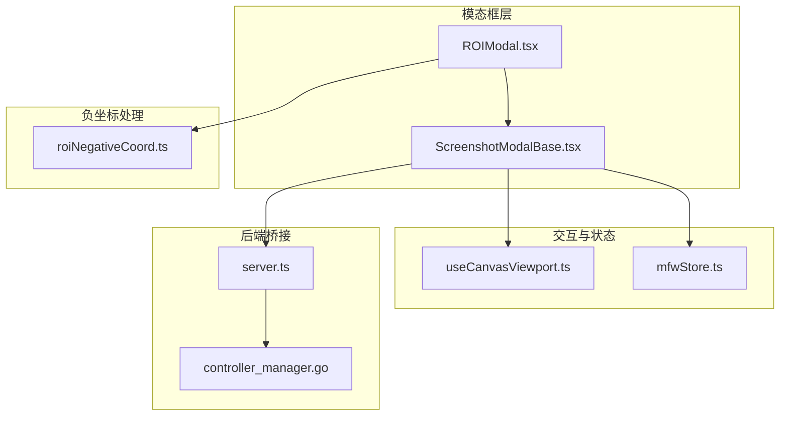
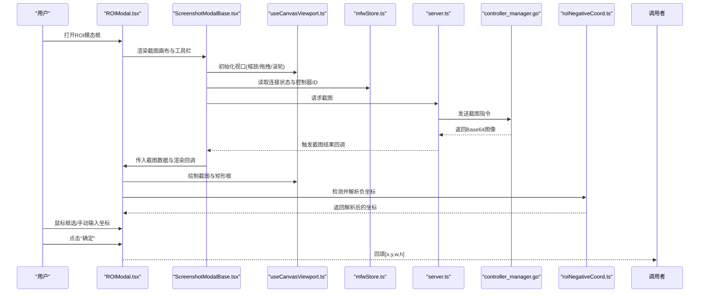
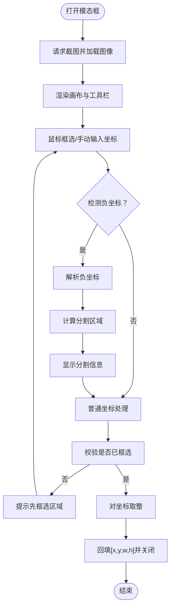
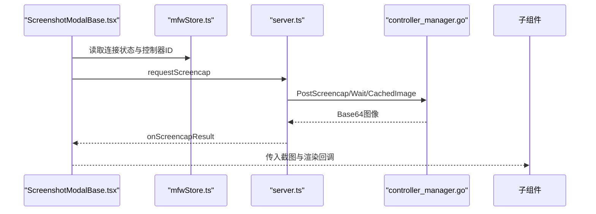
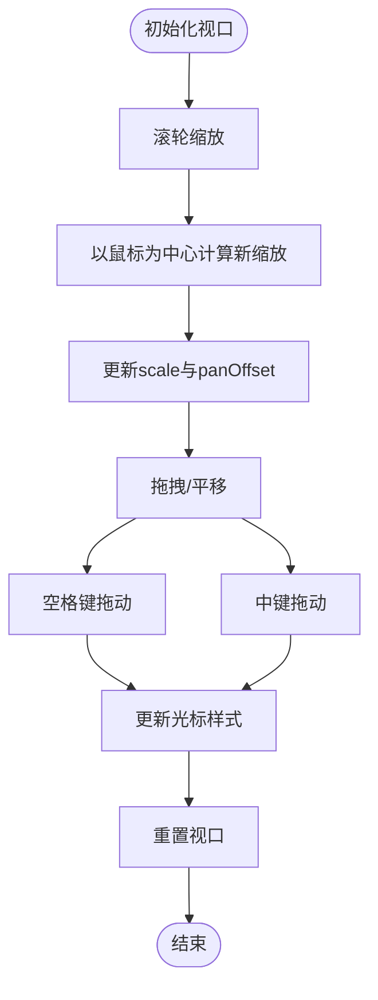
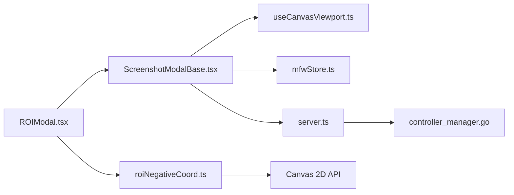

# 区域选择模态框

<cite>
**本文引用的文件列表**
- [ROIModal.tsx](file://src/components/modals/ROIModal.tsx)
- [ScreenshotModalBase.tsx](file://src/components/modals/ScreenshotModalBase.tsx)
- [useCanvasViewport.ts](file://src/hooks/useCanvasViewport.ts)
- [mfwStore.ts](file://src/stores/mfwStore.ts)
- [server.ts](file://src/services/server.ts)
- [controller_manager.go](file://LocalBridge/internal/mfw/controller_manager.go)
- [roiNegativeCoord.ts](file://src/utils/roiNegativeCoord.ts)
- [1.2-术语解释.md](file://instructions/maafw-guide/1.2-术语解释.md)
- [3.1-任务流水线协议.md](file://instructions/maafw-guide/3.1-任务流水线协议.md)
- [模板匹配识别.md](file://instructions/maafw-golang-binding/高级功能/流水线配置/节点结构详解/识别配置详解/模板匹配识别.md)
</cite>

## 更新摘要
**所做更改**
- 新增ROI负坐标渲染功能章节，详细介绍负坐标处理机制
- 更新ROI模态框组件分析，增加负坐标支持说明
- 新增负坐标可视化显示功能说明
- 更新架构总览图，包含负坐标处理流程
- 新增负坐标场景示例和使用指南

## 目录
1. [简介](#简介)
2. [项目结构](#项目结构)
3. [核心组件](#核心组件)
4. [架构总览](#架构总览)
5. [详细组件分析](#详细组件分析)
6. [ROI负坐标渲染功能](#roi负坐标渲染功能)
7. [依赖分析](#依赖分析)
8. [性能考虑](#性能考虑)
9. [故障排查指南](#故障排查指南)
10. [结论](#结论)

## 简介
本篇文档聚焦"区域选择模态框"（ROI模态框），系统性说明其交互流程、技术实现与在流水线识别中的作用。该模态框允许用户通过截图画布进行矩形框选，或手动输入ROI坐标，最终输出[x, y, w, h]四元组，用于后续识别配置（如模板匹配、特征匹配、颜色匹配等）。文档还解释了ROI的术语背景、协议规范与在不同识别类型中的使用方式。

**更新** 新增ROI负坐标渲染功能，用户现在可以使用负坐标定义区域，系统支持四种负坐标场景并提供实时坐标转换可视化。

## 项目结构
- 区域选择模态框由一个通用截图模态基座与具体的ROI选择组件构成：
  - 通用截图模态基座负责截图请求、加载、缩放与拖拽、工具栏与底部按钮等通用能力。
  - ROI选择组件在基座之上扩展了画布绘制、鼠标拖拽框选、坐标输入与确认回填逻辑。
  - **新增** 负坐标处理工具提供坐标解析、分割和可视化功能。
- 两者通过统一的Canvas渲染接口协作，形成可复用的"截图 + 工具"组合。

```mermaid
graph TB
subgraph "模态框层"
Base["ScreenshotModalBase.tsx"]
ROI["ROIModal.tsx"]
end
subgraph "交互与状态"
Hook["useCanvasViewport.ts"]
Store["mfwStore.ts"]
end
subgraph "后端桥接"
WS["server.ts"]
CtrlMgr["controller_manager.go"]
end
subgraph "负坐标处理"
Utils["roiNegativeCoord.ts"]
end
ROI --> Base
ROI --> Utils
Base --> Hook
Base --> Store
Base --> WS
WS --> CtrlMgr
```

**图表来源**
- [ScreenshotModalBase.tsx](file://src/components/modals/ScreenshotModalBase.tsx#L1-L293)
- [ROIModal.tsx](file://src/components/modals/ROIModal.tsx#L1-L564)
- [useCanvasViewport.ts](file://src/hooks/useCanvasViewport.ts#L1-L307)
- [mfwStore.ts](file://src/stores/mfwStore.ts#L1-L134)
- [server.ts](file://src/services/server.ts#L1-L298)
- [controller_manager.go](file://LocalBridge/internal/mfw/controller_manager.go#L394-L446)
- [roiNegativeCoord.ts](file://src/utils/roiNegativeCoord.ts#L1-L313)

**章节来源**
- [ScreenshotModalBase.tsx](file://src/components/modals/ScreenshotModalBase.tsx#L1-L293)
- [ROIModal.tsx](file://src/components/modals/ROIModal.tsx#L1-L564)
- [roiNegativeCoord.ts](file://src/utils/roiNegativeCoord.ts#L1-L313)

## 核心组件
- **ScreenshotModalBase**：提供截图请求、加载、缩放、拖拽、工具栏与底部按钮的通用容器，支持自定义渲染Canvas与子内容区。
- **ROIModal**：在截图画布上实现矩形框选、坐标输入与确认回填，输出[x, y, w, h]，**新增**支持负坐标渲染和实时可视化。
- **useCanvasViewport**：封装缩放、拖拽、空格键与中键拖动、滚轮缩放、初始适配等视口控制逻辑。
- **mfwStore**：维护连接状态、控制器类型与ID等全局状态，供截图请求使用。
- **server**：封装本地WebSocket服务与协议注册，负责截图请求与结果监听。
- **LocalBridge控制器管理**：负责向底层设备请求截图、编码并返回Base64图像。
- **roiNegativeCoord工具**：提供ROI负坐标解析、分割和可视化功能。

**章节来源**
- [ScreenshotModalBase.tsx](file://src/components/modals/ScreenshotModalBase.tsx#L1-L293)
- [ROIModal.tsx](file://src/components/modals/ROIModal.tsx#L1-L564)
- [useCanvasViewport.ts](file://src/hooks/useCanvasViewport.ts#L1-L307)
- [mfwStore.ts](file://src/stores/mfwStore.ts#L1-L134)
- [server.ts](file://src/services/server.ts#L1-L298)
- [controller_manager.go](file://LocalBridge/internal/mfw/controller_manager.go#L394-L446)
- [roiNegativeCoord.ts](file://src/utils/roiNegativeCoord.ts#L1-L313)

## 架构总览
下面的时序图展示了从打开ROI模态框到确认回填的完整流程，包括截图请求、图像加载、画布渲染与用户交互，**新增**负坐标处理流程。

```mermaid
sequenceDiagram
participant User as "用户"
participant ROI as "ROIModal.tsx"
participant Base as "ScreenshotModalBase.tsx"
participant Hook as "useCanvasViewport.ts"
participant Store as "mfwStore.ts"
participant WS as "server.ts"
participant Ctrl as "controller_manager.go"
participant Utils as "roiNegativeCoord.ts"
User->>ROI : 打开ROI模态框
ROI->>Base : 渲染截图画布与工具栏
Base->>Hook : 初始化视口(缩放/拖拽/滚轮)
Base->>Store : 读取连接状态与控制器ID
Base->>WS : 请求截图
WS->>Ctrl : 发送截图指令
Ctrl-->>WS : 返回Base64图像
WS-->>Base : 触发截图结果回调
Base->>ROI : 传入截图数据与渲染回调
ROI->>Hook : 绘制截图与矩形框
ROI->>Utils : 检测并解析负坐标
Utils-->>ROI : 返回解析后的坐标
User->>ROI : 鼠标框选/手动输入坐标
User->>ROI : 点击"确定"
ROI-->>调用者 : 回填[x,y,w,h]
```

**图表来源**
- [ROIModal.tsx](file://src/components/modals/ROIModal.tsx#L1-L564)
- [ScreenshotModalBase.tsx](file://src/components/modals/ScreenshotModalBase.tsx#L1-L293)
- [useCanvasViewport.ts](file://src/hooks/useCanvasViewport.ts#L1-L307)
- [mfwStore.ts](file://src/stores/mfwStore.ts#L1-L134)
- [server.ts](file://src/services/server.ts#L1-L298)
- [controller_manager.go](file://LocalBridge/internal/mfw/controller_manager.go#L394-L446)
- [roiNegativeCoord.ts](file://src/utils/roiNegativeCoord.ts#L1-L313)

## 详细组件分析

### ROI模态框（ROIModal）
- **功能职责**
  - 通过截图画布展示设备屏幕，支持滚轮缩放、空格键或中键拖动平移。
  - 用户可拖拽鼠标绘制矩形区域，实时预览ROI；也可手动输入X/Y/W/H。
  - **新增** 支持负坐标定义，自动解析并显示实际坐标。
  - **新增** 实时显示分割后的ROI区域信息。
  - 确认后将四元组[x, y, w, h]回填给调用方。
- **关键交互**
  - 鼠标按下：记录起点，进入绘制状态。
  - 鼠标移动：根据起点与当前位置计算矩形宽高，支持反向拖拽。
  - 鼠标抬起：结束绘制，保留最终矩形。
  - 坐标输入：InputNumber精确到整数，禁用状态随截图加载而启用。
  - **新增** 负坐标检测：当检测到负坐标时，自动解析并显示分割区域。
- **数据流**
  - 截图加载完成后，将图像绘制到Canvas，并叠加ROI矩形填充与描边。
  - **新增** 负坐标处理：解析负坐标为实际坐标，绘制分割后的区域。
  - 确认时对坐标取整并回传，关闭模态框。

```mermaid
flowchart TD
Start(["打开模态框"]) --> Load["请求截图并加载图像"]
Load --> Render["渲染画布与工具栏"]
Render --> Draw["鼠标框选/手动输入坐标"]
Draw --> Check{"检测负坐标？"}
Check --> |否| Confirm["普通坐标处理"]
Check --> |是| Parse["解析负坐标"]
Parse --> Split["计算分割区域"]
Split --> Show["显示分割信息"]
Show --> Confirm
Confirm --> Validate["校验是否已框选"]
Validate --> |否| Warn["提示先框选区域"]
Warn --> Draw
Validate --> |是| Round["对坐标取整"]
Round --> Backfill["回填[x,y,w,h]并关闭"]
Backfill --> End(["结束"])
```

**图表来源**
- [ROIModal.tsx](file://src/components/modals/ROIModal.tsx#L1-L564)
- [ScreenshotModalBase.tsx](file://src/components/modals/ScreenshotModalBase.tsx#L1-L293)
- [roiNegativeCoord.ts](file://src/utils/roiNegativeCoord.ts#L1-L313)

**章节来源**
- [ROIModal.tsx](file://src/components/modals/ROIModal.tsx#L1-L564)

### 截图模态基座（ScreenshotModalBase）
- **功能职责**
  - 统一管理截图请求、结果监听与状态重置。
  - 提供工具栏（缩放/重置）、提示信息与底部按钮（重新截图/取消/确定）。
  - 通过renderCanvas回调注入自定义画布渲染逻辑。
- **关键机制**
  - 打开时自动请求截图并重置视口；关闭时清理状态。
  - 监听截图结果事件，成功后将Base64图像传给子组件。
  - 通过useCanvasViewport提供缩放、拖拽、滚轮缩放与初始适配。

```mermaid
sequenceDiagram
participant Base as "ScreenshotModalBase.tsx"
participant Store as "mfwStore.ts"
participant WS as "server.ts"
participant Ctrl as "controller_manager.go"
Base->>Store : 读取连接状态与控制器ID
Base->>WS : requestScreencap
WS->>Ctrl : PostScreencap/Wait/CachedImage
Ctrl-->>WS : Base64图像
WS-->>Base : onScreencapResult
Base-->>子组件 : 传入截图与渲染回调
```

**图表来源**
- [ScreenshotModalBase.tsx](file://src/components/modals/ScreenshotModalBase.tsx#L1-L293)
- [mfwStore.ts](file://src/stores/mfwStore.ts#L1-L134)
- [server.ts](file://src/services/server.ts#L1-L298)
- [controller_manager.go](file://LocalBridge/internal/mfw/controller_manager.go#L394-L446)

**章节来源**
- [ScreenshotModalBase.tsx](file://src/components/modals/ScreenshotModalBase.tsx#L1-L293)

### 视口控制Hook（useCanvasViewport）
- **功能职责**
  - 管理缩放级别与平移偏移，限制最小/最大缩放范围。
  - 处理滚轮缩放、空格键拖拽、中键拖动与初始适配。
  - 提供光标样式反馈与重置状态的能力。
- **交互细节**
  - 滚轮事件计算鼠标在图像坐标系下的位置，以鼠标为中心进行缩放。
  - 空格键与中键拖动切换为抓取/抓取中光标样式，拖动时更新平移偏移。
  - 初始适配根据容器与图像尺寸计算fit-scale并居中。

```mermaid
flowchart TD
Init(["初始化视口"]) --> Wheel["滚轮缩放"]
Wheel --> Center["以鼠标为中心计算新缩放"]
Center --> UpdateScale["更新scale与panOffset"]
UpdateScale --> Drag["拖拽/平移"]
Drag --> Space["空格键拖动"]
Drag --> Middle["中键拖动"]
Space --> Cursor["更新光标样式"]
Middle --> Cursor
Cursor --> Reset["重置视口"]
Reset --> End(["结束"])
```

**图表来源**
- [useCanvasViewport.ts](file://src/hooks/useCanvasViewport.ts#L1-L307)

**章节来源**
- [useCanvasViewport.ts](file://src/hooks/useCanvasViewport.ts#L1-L307)

## ROI负坐标渲染功能

### 负坐标处理机制
MaaFramework v5.6+支持负数坐标定义，提供更灵活的区域选择方式：

- **x负数**：从右边缘计算，`actualX = imageWidth + rawX`
- **y负数**：从下边缘计算，`actualY = imageHeight + rawY`
- **w为0**：延伸至右边缘，`actualW = imageWidth - actualX`
- **w为负数**：取绝对值，(x,y)视为右下角，`actualW = |rawW|`，`actualX = actualX - actualW`
- **h为0**：延伸至下边缘，`actualH = imageHeight - actualY`
- **h为负数**：取绝对值，(x,y)视为右下角，`actualH = |rawH|`，`actualY = actualY - actualH`

### 负坐标可视化功能
系统提供完整的负坐标可视化支持：

- **实时坐标解析**：用户输入负坐标时，系统立即解析为实际坐标
- **分割区域显示**：当ROI超出屏幕边界时，自动分割为可见和不可见区域
- **扩展边距标注**：显示需要扩展的边距大小和方向
- **双区域渲染**：同时显示原始负坐标区域和解析后的实际区域

### 四种负坐标场景
1. **左上角负坐标**：x<0, y<0，从右下角开始计算
2. **仅x负坐标**：x<0, y≥0，从右边缘向左计算
3. **仅y负坐标**：x≥0, y<0，从下边缘向上计算
4. **负宽高**：w<0, h<0，将(x,y)视为右下角

### 实时坐标转换可视化
- **坐标信息面板**：显示分割后的左上角和右下角坐标
- **扩展边距指示**：通过虚线边框和标签显示需要扩展的区域
- **颜色编码**：使用红色高亮显示负坐标区域
- **动态更新**：坐标变化时实时更新所有可视化元素

**章节来源**
- [roiNegativeCoord.ts](file://src/utils/roiNegativeCoord.ts#L1-L313)
- [ROIModal.tsx](file://src/components/modals/ROIModal.tsx#L53-L118)
- [ROIModal.tsx](file://src/components/modals/ROIModal.tsx#L500-L557)

## 依赖分析
- **组件耦合**
  - ROIModal依赖ScreenshotModalBase的通用截图与画布渲染能力。
  - **新增** ROIModal依赖roiNegativeCoord工具进行负坐标解析。
  - ScreenshotModalBase依赖useCanvasViewport提供的视口控制与缩放拖拽。
  - ScreenshotModalBase依赖mfwStore获取连接状态与控制器ID，用于截图请求。
  - server.ts作为协议层，负责与LocalBridge通信，后者执行实际截图。
- **外部依赖**
  - WebSocket通信与协议版本握手。
  - 图像编码为Base64，便于前端渲染与传输。
  - **新增** Canvas 2D渲染API用于负坐标可视化。

```mermaid
graph LR
ROIModal["ROIModal.tsx"] --> Base["ScreenshotModalBase.tsx"]
ROIModal --> Utils["roiNegativeCoord.ts"]
Base --> Hook["useCanvasViewport.ts"]
Base --> Store["mfwStore.ts"]
Base --> WS["server.ts"]
WS --> CtrlMgr["controller_manager.go"]
Utils --> Canvas["Canvas 2D API"]
```

**图表来源**
- [ROIModal.tsx](file://src/components/modals/ROIModal.tsx#L1-L564)
- [ScreenshotModalBase.tsx](file://src/components/modals/ScreenshotModalBase.tsx#L1-L293)
- [useCanvasViewport.ts](file://src/hooks/useCanvasViewport.ts#L1-L307)
- [mfwStore.ts](file://src/stores/mfwStore.ts#L1-L134)
- [server.ts](file://src/services/server.ts#L1-L298)
- [controller_manager.go](file://LocalBridge/internal/mfw/controller_manager.go#L394-L446)
- [roiNegativeCoord.ts](file://src/utils/roiNegativeCoord.ts#L1-L313)

**章节来源**
- [ROIModal.tsx](file://src/components/modals/ROIModal.tsx#L1-L564)
- [ScreenshotModalBase.tsx](file://src/components/modals/ScreenshotModalBase.tsx#L1-L293)
- [useCanvasViewport.ts](file://src/hooks/useCanvasViewport.ts#L1-L307)
- [mfwStore.ts](file://src/stores/mfwStore.ts#L1-L134)
- [server.ts](file://src/services/server.ts#L1-L298)
- [controller_manager.go](file://LocalBridge/internal/mfw/controller_manager.go#L394-L446)
- [roiNegativeCoord.ts](file://src/utils/roiNegativeCoord.ts#L1-L313)

## 性能考虑
- **ROI精准定位**
  - 通过缩小ROI，减少无关区域的计算开销，提升识别吞吐与稳定性。
  - **新增** 负坐标解析采用高效的数学运算，避免复杂的循环判断。
- **缩放与拖拽**
  - 合理的缩放步进与范围限制，避免过度放大导致渲染压力。
  - 初始适配时根据容器尺寸计算fit-scale，保证首屏观感与性能平衡。
- **截图请求**
  - 仅在打开模态框时请求截图，避免频繁刷新；必要时提供"重新截图"按钮。
- **图像编码**
  - 后端将图像编码为PNG并Base64返回，前端直接渲染，避免额外解码成本。
- **负坐标渲染优化**
  - **新增** 使用Canvas 2D API进行高效渲染，避免DOM操作带来的性能损耗。
  - **新增** 实时坐标解析仅在坐标变化时触发，减少不必要的计算。

**章节来源**
- [ScreenshotModalBase.tsx](file://src/components/modals/ScreenshotModalBase.tsx#L1-L293)
- [useCanvasViewport.ts](file://src/hooks/useCanvasViewport.ts#L1-L307)
- [controller_manager.go](file://LocalBridge/internal/mfw/controller_manager.go#L394-L446)
- [roiNegativeCoord.ts](file://src/utils/roiNegativeCoord.ts#L1-L313)

## 故障排查指南
- **无法获取截图**
  - 检查连接状态与控制器ID是否有效；只有在连接状态下才会发起截图请求。
  - 确认本地服务已启动且端口可用，WebSocket握手成功。
- **截图空白或加载失败**
  - 确认设备端截图方法可用；必要时切换截图方法或使用缓存策略。
  - 检查截图结果回调是否触发，确认Base64图像有效。
- **画布无响应**
  - 确认容器存在且可接收滚轮事件；检查缩放与拖拽逻辑是否被禁用。
  - 空格键与中键拖动需在容器内生效，避免焦点不在容器上。
- **ROI无效**
  - 确保已框选区域后再点击"确定"；否则会提示先框选区域。
  - 手动输入坐标时需为整数，且在截图加载后方可编辑。
- **负坐标显示异常**
  - **新增** 检查Canvas上下文是否正确初始化。
  - **新增** 确认负坐标解析函数正常工作，检查图像尺寸参数。
  - **新增** 验证坐标信息面板的渲染逻辑，确保分割区域正确显示。

**章节来源**
- [ScreenshotModalBase.tsx](file://src/components/modals/ScreenshotModalBase.tsx#L1-L293)
- [ROIModal.tsx](file://src/components/modals/ROIModal.tsx#L1-L564)
- [server.ts](file://src/services/server.ts#L1-L298)
- [mfwStore.ts](file://src/stores/mfwStore.ts#L1-L134)
- [roiNegativeCoord.ts](file://src/utils/roiNegativeCoord.ts#L1-L313)

## 结论
ROI模态框通过"截图 + 画布 + 交互"的组合，为识别配置提供了直观、高效的区域选择体验。其核心在于：
- 通用截图基座与可插拔画布渲染，便于扩展其他识别工具（如取色、模板选择等）。
- 完整的视口控制与用户交互，兼顾易用性与性能。
- 与流水线协议中的ROI字段无缝衔接，支持多种识别类型精准定位目标区域。

**更新** 新增的ROI负坐标渲染功能进一步提升了系统的灵活性和易用性：
- 支持四种负坐标场景，满足复杂的区域定义需求
- 实时坐标转换可视化，帮助用户理解负坐标的含义
- 分割区域显示功能，清晰展示超出边界的区域部分
- 完整的扩展边距标注，指导用户进行屏幕扩展设置

这一功能使用户能够更精确地定义ROI区域，特别是在需要基于屏幕边缘定位的场景中，大大提高了工作效率和准确性。