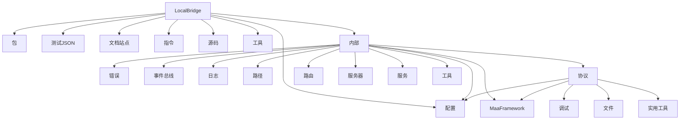
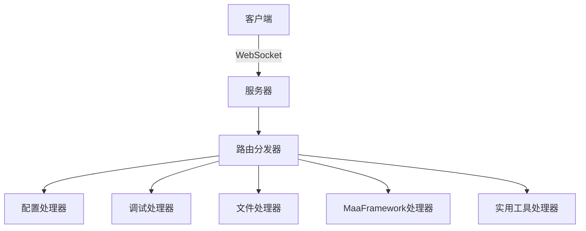
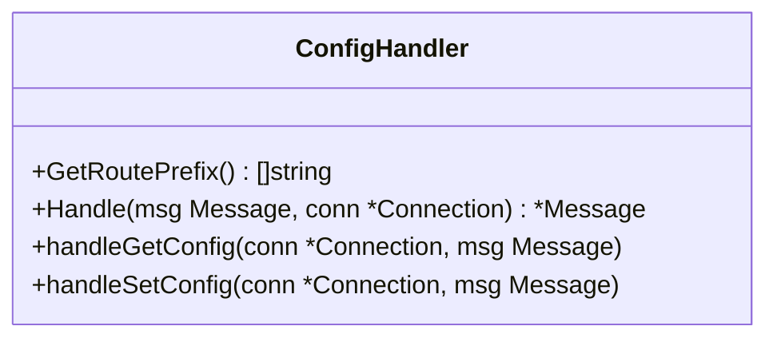
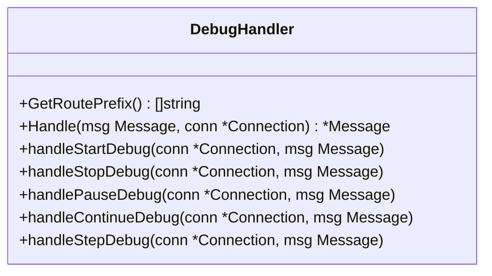
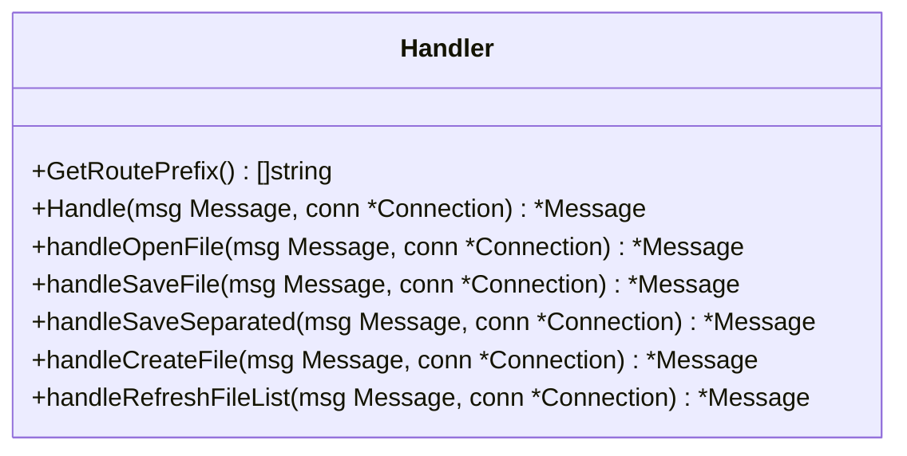
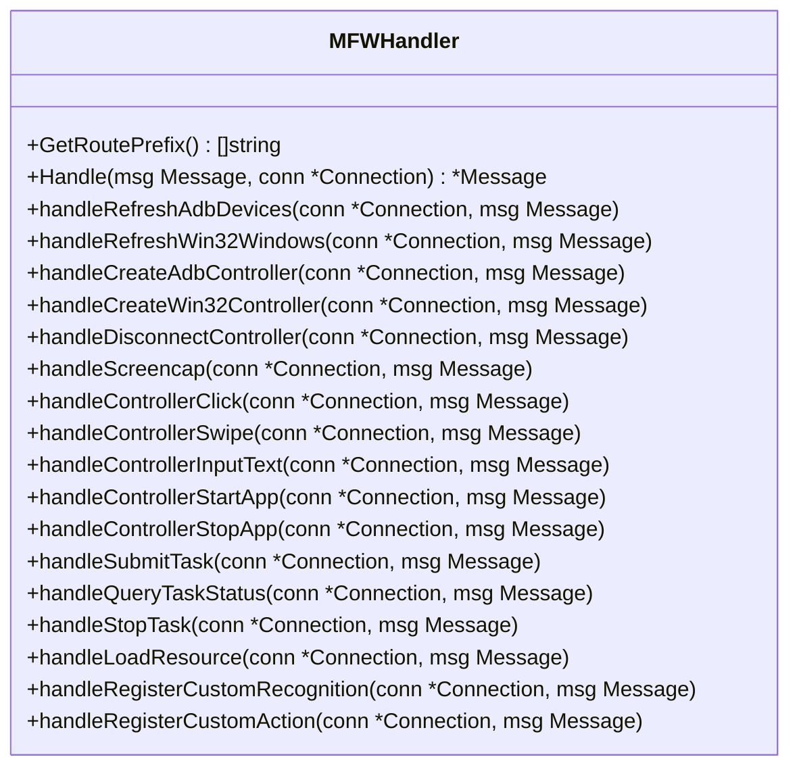
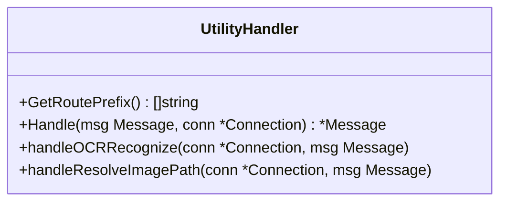
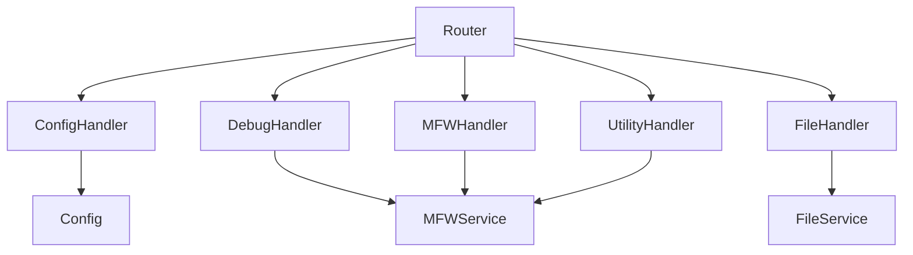

# 协议兼容性

<cite>
**本文档引用的文件**   
- [config.go](file://LocalBridge/internal/config/config.go)
- [handler.go](file://LocalBridge/internal/protocol/config/handler.go)
- [handler.go](file://LocalBridge/internal/protocol/debug/handler.go)
- [file_handler.go](file://LocalBridge/internal/protocol/file/file_handler.go)
- [handler.go](file://LocalBridge/internal/protocol/mfw/handler.go)
- [handler.go](file://LocalBridge/internal/protocol/utility/handler.go)
- [router.go](file://LocalBridge/internal/router/router.go)
- [message.go](file://LocalBridge/pkg/models/message.go)
- [3.1-任务流水线协议.md](file://instructions/maafw-pipeline/3.1-任务流水线协议.md)
</cite>

## 目录
1. [引言](#引言)
2. [项目结构](#项目结构)
3. [核心组件](#核心组件)
4. [架构概述](#架构概述)
5. [详细组件分析](#详细组件分析)
6. [依赖分析](#依赖分析)
7. [性能考虑](#性能考虑)
8. [故障排除指南](#故障排除指南)
9. [结论](#结论)

## 引言
本项目是一个本地桥接服务，旨在为 MaaFramework 提供本地服务支持，通过 WebSocket 协议与前端进行通信。该服务实现了多种协议处理器，包括配置、调试、文件管理、MaaFramework 控制和实用工具等，以支持复杂的自动化任务。协议兼容性是确保前端与后端无缝交互的关键，本文档将深入分析各协议的实现细节及其兼容性。

## 项目结构
该项目采用模块化设计，主要分为以下几个部分：
- **LocalBridge**: 核心服务模块，包含配置、错误处理、事件总线、日志记录、MaaFramework 集成、路径处理、协议处理、路由、服务器、服务和工具等子模块。
- **pkg/models**: 定义了消息模型，用于前后端通信。
- **test-json**: 包含测试用的 JSON 文件。
- **config**: 配置文件。
- **docsite**: 文档站点。
- **instructions**: 指令文档。
- **src**: 前端源码。
- **tools**: 工具脚本。

**图源**
- [config.go](file://LocalBridge/internal/config/config.go)
- [handler.go](file://LocalBridge/internal/protocol/config/handler.go)
- [handler.go](file://LocalBridge/internal/protocol/debug/handler.go)
- [file_handler.go](file://LocalBridge/internal/protocol/file/file_handler.go)
- [handler.go](file://LocalBridge/internal/protocol/mfw/handler.go)
- [handler.go](file://LocalBridge/internal/protocol/utility/handler.go)

## 核心组件

### 配置管理
配置管理模块负责加载和保存配置文件，支持从命令行参数覆盖配置。配置文件采用 JSON 格式，包含服务器、文件、日志和 MaaFramework 相关设置。

**组件源**
- [config.go](file://LocalBridge/internal/config/config.go)

### 协议处理器
协议处理器模块实现了多种协议，包括配置、调试、文件管理、MaaFramework 控制和实用工具等。每个协议处理器都实现了 `Handler` 接口，通过路由分发器进行消息处理。

**组件源**
- [handler.go](file://LocalBridge/internal/protocol/config/handler.go)
- [handler.go](file://LocalBridge/internal/protocol/debug/handler.go)
- [file_handler.go](file://LocalBridge/internal/protocol/file/file_handler.go)
- [handler.go](file://LocalBridge/internal/protocol/mfw/handler.go)
- [handler.go](file://LocalBridge/internal/protocol/utility/handler.go)

### 路由分发器
路由分发器负责将接收到的消息分发给相应的协议处理器。它通过前缀匹配来确定目标处理器，并支持版本握手以确保协议兼容性。

**组件源**
- [router.go](file://LocalBridge/internal/router/router.go)

### 消息模型
消息模型定义了前后端通信的数据结构，包括消息路径和数据内容。此外，还定义了错误消息、文件信息、文件列表、文件内容、文件变化通知、打开文件请求、保存文件请求、分离保存文件请求、创建文件请求、保存文件确认数据、分离保存文件确认数据、日志数据、版本握手请求、版本握手响应、解析图片路径请求和解析图片路径响应等。

**组件源**
- [message.go](file://LocalBridge/pkg/models/message.go)

## 架构概述

### 系统架构
系统架构采用客户端-服务器模式，前端通过 WebSocket 连接到后端服务。后端服务通过路由分发器将消息分发给相应的协议处理器，每个处理器负责处理特定类型的请求。

**图源**
- [router.go](file://LocalBridge/internal/router/router.go)
- [handler.go](file://LocalBridge/internal/protocol/config/handler.go)
- [handler.go](file://LocalBridge/internal/protocol/debug/handler.go)
- [file_handler.go](file://LocalBridge/internal/protocol/file/file_handler.go)
- [handler.go](file://LocalBridge/internal/protocol/mfw/handler.go)
- [handler.go](file://LocalBridge/internal/protocol/utility/handler.go)

## 详细组件分析

### 配置处理器
配置处理器负责处理与配置相关的请求，如获取和设置配置。它通过 `/etl/config/` 前缀进行路由匹配，并支持 `get` 和 `set` 操作。

#### 类图

**图源**
- [handler.go](file://LocalBridge/internal/protocol/config/handler.go)

### 调试处理器
调试处理器负责处理与调试相关的请求，如启动、停止、暂停和继续调试。它通过 `/mpe/debug/` 前缀进行路由匹配，并支持多种调试操作。

#### 类图

**图源**
- [handler.go](file://LocalBridge/internal/protocol/debug/handler.go)

### 文件处理器
文件处理器负责处理与文件管理相关的请求，如打开、保存、创建和刷新文件列表。它通过 `/etl/open_file`、`/etl/save_file`、`/etl/save_separated`、`/etl/create_file` 和 `/etl/refresh_file_list` 前缀进行路由匹配。

#### 类图

**图源**
- [file_handler.go](file://LocalBridge/internal/protocol/file/file_handler.go)

### MaaFramework 处理器
MaaFramework 处理器负责处理与 MaaFramework 相关的请求，如设备管理、控制器管理、任务管理和资源管理。它通过 `/etl/mfw/` 前缀进行路由匹配，并支持多种操作。

#### 类图

**图源**
- [handler.go](file://LocalBridge/internal/protocol/mfw/handler.go)

### 实用工具处理器
实用工具处理器负责处理与实用工具相关的请求，如 OCR 识别和解析图片路径。它通过 `/etl/utility/` 前缀进行路由匹配，并支持多种操作。

#### 类图

**图源**
- [handler.go](file://LocalBridge/internal/protocol/utility/handler.go)

## 依赖分析

### 依赖关系图

**图源**
- [config.go](file://LocalBridge/internal/config/config.go)
- [handler.go](file://LocalBridge/internal/protocol/config/handler.go)
- [handler.go](file://LocalBridge/internal/protocol/debug/handler.go)
- [file_handler.go](file://LocalBridge/internal/protocol/file/file_handler.go)
- [handler.go](file://LocalBridge/internal/protocol/mfw/handler.go)
- [handler.go](file://LocalBridge/internal/protocol/utility/handler.go)
- [router.go](file://LocalBridge/internal/router/router.go)

## 性能考虑
为了提高性能，建议在配置中合理设置日志级别和文件扩展名，避免不必要的日志记录和文件扫描。此外，使用高效的算法和数据结构可以减少处理时间和内存占用。

## 故障排除指南
### 常见问题
- **配置文件未加载**: 确保配置文件存在且路径正确。
- **WebSocket 连接失败**: 检查服务器地址和端口是否正确。
- **文件操作失败**: 确认文件路径和权限是否正确。
- **MaaFramework 初始化失败**: 确认 MaaFramework 库路径和资源目录是否正确配置。

### 日志分析
查看日志文件可以帮助定位问题。日志文件位于配置中指定的目录，通常包含详细的错误信息和调试信息。

**组件源**
- [logger.go](file://LocalBridge/internal/logger/logger.go)

## 结论
本文档详细分析了 MaaPipelineEditor 项目的协议兼容性，涵盖了配置管理、协议处理器、路由分发器和消息模型等核心组件。通过合理的架构设计和模块化实现，该项目能够高效地支持多种协议，确保前端与后端的无缝交互。未来可以通过优化算法和数据结构进一步提升性能，并通过增强日志记录和错误处理提高系统的稳定性和可维护性。