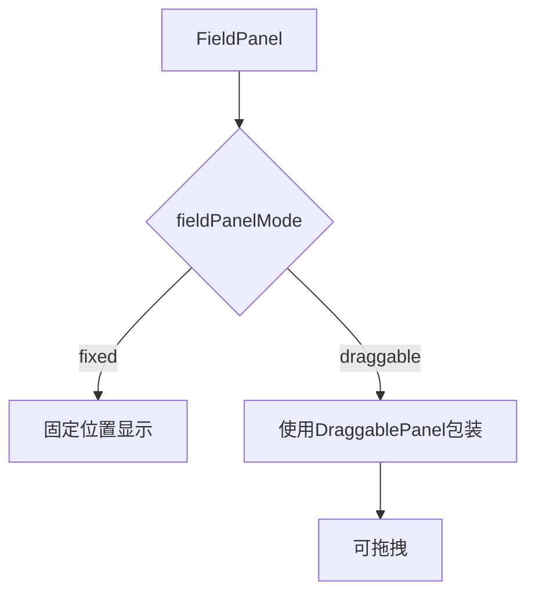
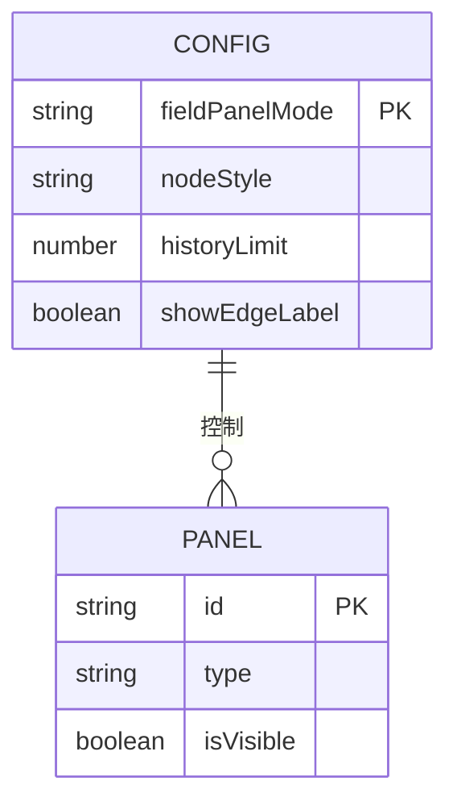
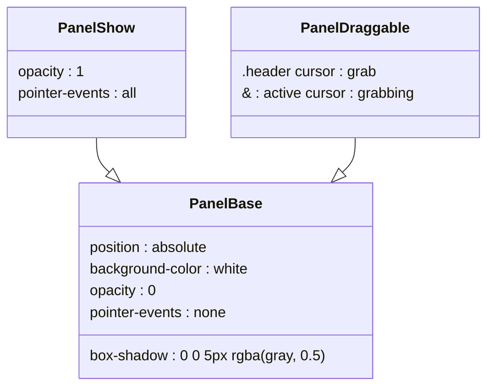

# 可拖拽面板

<cite>
**本文档引用的文件**
- [DraggablePanel.tsx](file://src/components/panels/common/DraggablePanel.tsx)
- [FieldPanel.tsx](file://src/components/panels/main/FieldPanel.tsx)
- [ConnectionPanel.tsx](file://src/components/panels/main/ConnectionPanel.tsx)
- [panelPosition.ts](file://src/utils/panelPosition.ts)
- [configStore.ts](file://src/stores/configStore.ts)
- [viewSlice.ts](file://src/stores/flow/slices/viewSlice.ts)
- [types.ts](file://src/stores/flow/types.ts)
- [Flow.module.less](file://src/styles/Flow.module.less)
- [FieldPanel.module.less](file://src/styles/FieldPanel.module.less)
- [global.less](file://src/styles/global.less)
- [PanelConfigSection.tsx](file://src/components/panels/config/PanelConfigSection.tsx)
</cite>

## 目录
1. [简介](#简介)
2. [核心组件](#核心组件)
3. [配置与状态管理](#配置与状态管理)
4. [样式与布局](#样式与布局)
5. [交互逻辑](#交互逻辑)
6. [总结](#总结)

## 简介
可拖拽面板是 MaaPipelineEditor 应用中的一个核心 UI 功能，允许用户将特定的配置面板（如字段面板、连接面板）从固定位置拖动到画布上的任意位置。该功能提升了用户界面的灵活性和可定制性，使用户能够根据工作流需求自由调整面板布局。

**Section sources**
- [DraggablePanel.tsx](file://src/components/panels/common/DraggablePanel.tsx)
- [FieldPanel.tsx](file://src/components/panels/main/FieldPanel.tsx)

## 核心组件

### 可拖拽面板组件 (DraggablePanel)
`DraggablePanel` 是实现面板拖拽功能的核心组件。它是一个通用的高阶组件，用于包装其他面板组件，使其具备拖拽能力。

该组件通过监听鼠标事件（`onMouseDown`、`onMouseMove`、`onMouseUp`）来实现拖拽逻辑。用户只能通过面板的标题栏（`.header`）来触发拖拽，以避免与面板内部的其他交互元素（如按钮）发生冲突。

面板的位置状态由 `zustand` 状态库中的 `usePanelPositionStore` 统一管理，确保了位置信息在应用中的全局一致性和持久性。

```mermaid
classDiagram
class DraggablePanel {
+panelRef : RefObject<HTMLDivElement>
+isDragging : boolean
+dragStartRef : Ref<{x, y}>
+positionStartRef : Ref<{x, y}>
+position : {x, y} | null
+setPosition : (pos) => void
+getDefaultPosition() : {x, y}
+handleMouseDown(e : MouseEvent) : void
+handleMouseMove(e : MouseEvent) : void
+handleMouseUp() : void
}
DraggablePanel --> usePanelPositionStore : "使用"
usePanelPositionStore : { panelPosition, setPanelPosition }
```

**Diagram sources**
- [DraggablePanel.tsx](file://src/components/panels/common/DraggablePanel.tsx)
- [configStore.ts](file://src/stores/configStore.ts)

### 字段面板 (FieldPanel)
`FieldPanel` 是 `DraggablePanel` 的一个主要使用者。它用于显示和编辑当前选中节点的详细配置信息。

当用户选中一个节点时，`FieldPanel` 会根据节点类型（Pipeline、External、Anchor）动态渲染相应的编辑器组件。其显示模式（固定或可拖拽）由全局配置 `fieldPanelMode` 决定。



**Diagram sources**
- [FieldPanel.tsx](file://src/components/panels/main/FieldPanel.tsx)
- [DraggablePanel.tsx](file://src/components/panels/common/DraggablePanel.tsx)

## 配置与状态管理

### 全局配置 (configStore)
面板的可拖拽行为由一个全局配置项 `fieldPanelMode` 控制。该配置存储在 `useConfigStore` 中，用户可以在设置面板中进行切换。



**Diagram sources**
- [configStore.ts](file://src/stores/configStore.ts)
- [PanelConfigSection.tsx](file://src/components/panels/config/PanelConfigSection.tsx)

### 位置状态存储 (usePanelPositionStore)
`usePanelPositionStore` 是一个使用 `zustand` 创建的全局状态存储，专门用于管理可拖拽面板的位置。

```typescript
interface PanelPositionState {
  panelPosition: { x: number; y: number } | null;
  setPanelPosition: (pos: { x: number; y: number } | null) => void;
}
```

**Section sources**
- [DraggablePanel.tsx](file://src/components/panels/common/DraggablePanel.tsx)

## 样式与布局

### 样式类 (CSS Classes)
可拖拽面板的样式由多个 LESS 文件共同定义，包括 `FieldPanel.module.less` 和 `global.less`。

- `.panel-base`: 所有面板的基础样式，定义了位置、背景、阴影等。
- `.panel-show`: 控制面板的显示与隐藏（通过 `opacity` 和 `pointer-events`）。
- `.panel-draggable`: 为可拖拽面板添加特定样式，如光标样式 `grab` 和 `grabbing`。



**Diagram sources**
- [global.less](file://src/styles/global.less)
- [FieldPanel.module.less](file://src/styles/FieldPanel.module.less)

## 交互逻辑

### 拖拽流程
1.  **初始化**: 当面板首次显示且没有存储位置时，`DraggablePanel` 会调用 `getDefaultPosition()` 计算一个默认位置（通常在右上角）。
2.  **开始拖拽**: 用户点击面板标题栏，触发 `handleMouseDown` 事件，记录鼠标起始位置和面板当前位置。
3.  **持续拖拽**: `mousemove` 事件持续更新面板位置，并通过 `setPosition` 更新状态。
4.  **边界限制**: 在移动过程中，会检查面板是否超出视口边界，并进行限制。
5.  **结束拖拽**: `mouseup` 事件触发后，停止监听鼠标事件，拖拽结束。

**Section sources**
- [DraggablePanel.tsx](file://src/components/panels/common/DraggablePanel.tsx)

## 总结
可拖拽面板功能通过 `DraggablePanel` 组件、`usePanelPositionStore` 状态管理和 `fieldPanelMode` 配置项的协同工作，为用户提供了一个灵活、可定制的界面体验。其设计遵循了组件化和状态分离的原则，代码结构清晰，易于维护和扩展。