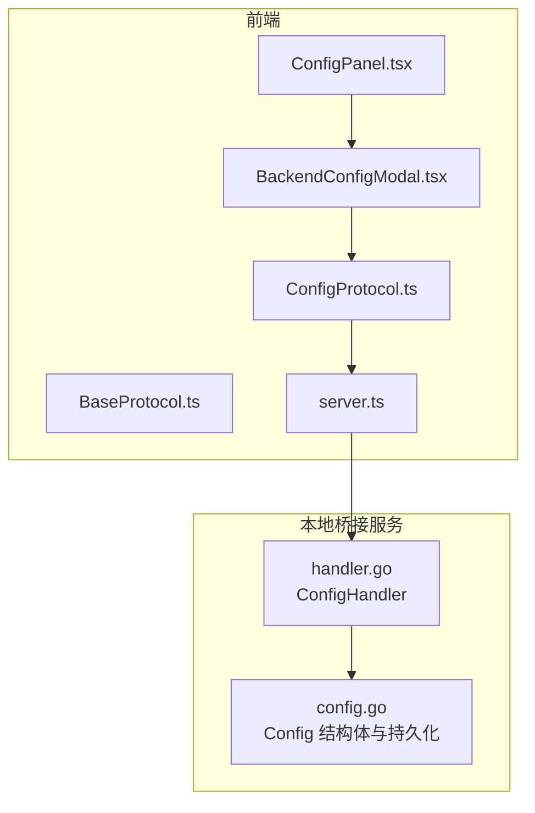
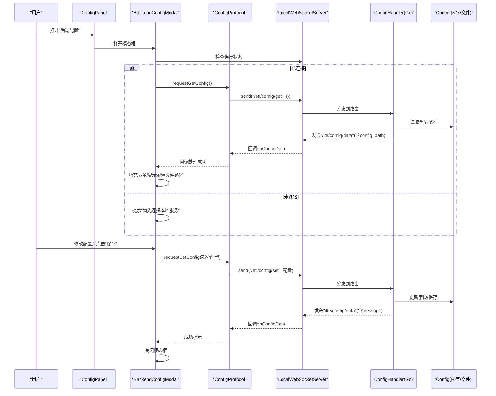
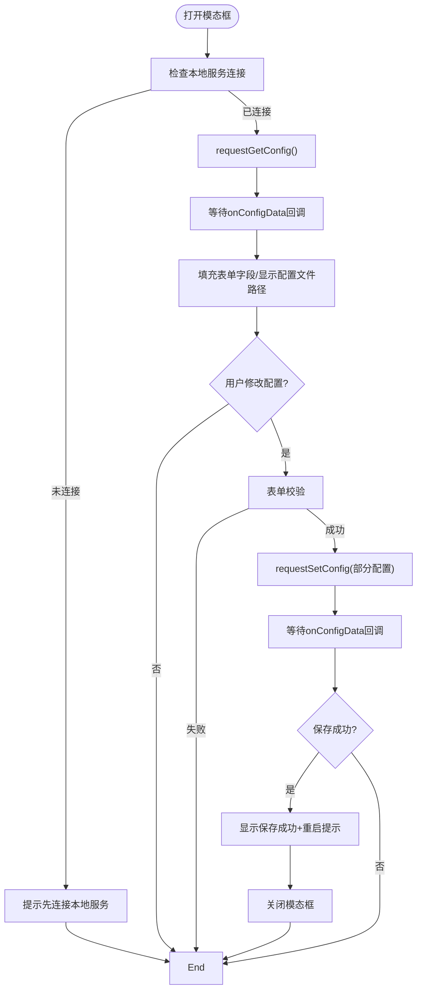
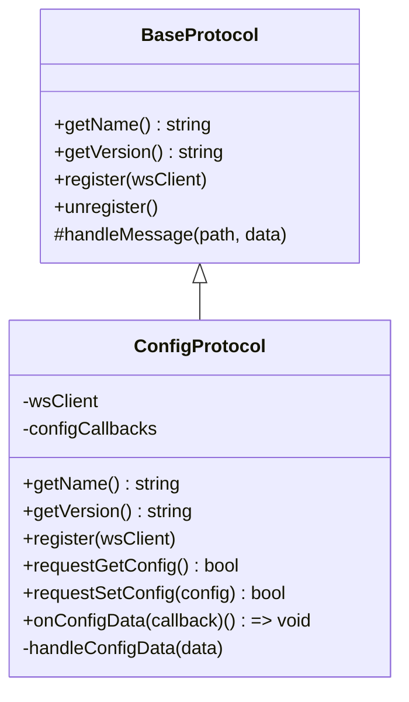
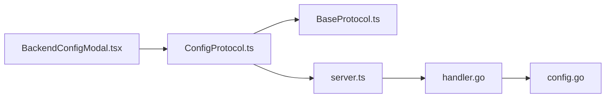

# 后端配置模态框

<cite>
**本文引用的文件**
- [BackendConfigModal.tsx](file://src/components/modals/BackendConfigModal.tsx)
- [ConfigProtocol.ts](file://src/services/protocols/ConfigProtocol.ts)
- [server.ts](file://src/services/server.ts)
- [BaseProtocol.ts](file://src/services/protocols/BaseProtocol.ts)
- [ConfigPanel.tsx](file://src/components/panels/ConfigPanel.tsx)
- [handler.go](file://LocalBridge/internal/protocol/config/handler.go)
- [config.go](file://LocalBridge/internal/config/config.go)
</cite>

## 目录
1. [简介](#简介)
2. [项目结构](#项目结构)
3. [核心组件](#核心组件)
4. [架构总览](#架构总览)
5. [详细组件分析](#详细组件分析)
6. [依赖关系分析](#依赖关系分析)
7. [性能考量](#性能考量)
8. [故障排查指南](#故障排查指南)
9. [结论](#结论)

## 简介
本文件围绕“后端配置模态框”进行系统化技术文档整理，目标读者包括前端开发者与非技术用户。文档从系统架构、组件职责、数据流、处理逻辑、集成点、错误处理与性能特征等维度展开，并提供可视化图示帮助理解。后端配置模态框允许用户通过图形界面查看与编辑本地服务的后端配置（如服务器监听、文件扫描、日志、MaaFramework），并通过 WebSocket 与本地桥接服务通信，实现配置的读取与保存。

## 项目结构
后端配置模态框位于前端组件层，通过协议层与本地桥接服务交互；本地桥接服务负责实际配置的读取、更新与持久化。

图表来源
- [BackendConfigModal.tsx](file://src/components/modals/BackendConfigModal.tsx#L1-L371)
- [ConfigProtocol.ts](file://src/services/protocols/ConfigProtocol.ts#L1-L136)
- [server.ts](file://src/services/server.ts#L1-L295)
- [BaseProtocol.ts](file://src/services/protocols/BaseProtocol.ts#L1-L40)
- [ConfigPanel.tsx](file://src/components/panels/ConfigPanel.tsx#L600-L624)
- [handler.go](file://LocalBridge/internal/protocol/config/handler.go#L1-L200)
- [config.go](file://LocalBridge/internal/config/config.go#L1-L200)

章节来源
- [BackendConfigModal.tsx](file://src/components/modals/BackendConfigModal.tsx#L1-L371)
- [ConfigProtocol.ts](file://src/services/protocols/ConfigProtocol.ts#L1-L136)
- [server.ts](file://src/services/server.ts#L1-L295)
- [BaseProtocol.ts](file://src/services/protocols/BaseProtocol.ts#L1-L40)
- [ConfigPanel.tsx](file://src/components/panels/ConfigPanel.tsx#L600-L624)
- [handler.go](file://LocalBridge/internal/protocol/config/handler.go#L1-L200)
- [config.go](file://LocalBridge/internal/config/config.go#L1-L200)

## 核心组件
- 后端配置模态框组件：提供表单展示与交互，负责加载/保存配置。
- 配置协议模块：封装与本地桥接服务的配置读写消息协议。
- 本地 WebSocket 服务：统一管理 WebSocket 连接、握手、路由分发。
- 本地桥接服务配置处理器：对接收到的配置消息进行解析、更新与持久化。
- 前端配置面板：承载并触发后端配置模态框的打开。

章节来源
- [BackendConfigModal.tsx](file://src/components/modals/BackendConfigModal.tsx#L1-L371)
- [ConfigProtocol.ts](file://src/services/protocols/ConfigProtocol.ts#L1-L136)
- [server.ts](file://src/services/server.ts#L1-L295)
- [handler.go](file://LocalBridge/internal/protocol/config/handler.go#L1-L200)
- [ConfigPanel.tsx](file://src/components/panels/ConfigPanel.tsx#L600-L624)

## 架构总览
后端配置模态框通过前端协议模块向本地桥接服务发送“获取配置/设置配置”请求，本地桥接服务解析消息并更新内存中的配置对象，随后持久化到配置文件，最后将最新配置推送给前端。

图表来源
- [BackendConfigModal.tsx](file://src/components/modals/BackendConfigModal.tsx#L1-L371)
- [ConfigProtocol.ts](file://src/services/protocols/ConfigProtocol.ts#L1-L136)
- [server.ts](file://src/services/server.ts#L1-L295)
- [handler.go](file://LocalBridge/internal/protocol/config/handler.go#L1-L200)
- [config.go](file://LocalBridge/internal/config/config.go#L1-L200)

## 详细组件分析

### 后端配置模态框组件（BackendConfigModal）
- 职责
  - 展示服务器、文件、日志、MaaFramework 四大类配置项。
  - 在打开时自动加载配置；支持手动刷新。
  - 表单校验通过后，将部分配置通过协议模块发送至本地桥接服务。
  - 对保存结果进行反馈（成功消息与重启提示）。
- 关键交互
  - 加载配置：依赖本地 WebSocket 连接状态；通过配置协议请求获取。
  - 保存配置：表单校验后构造部分配置对象，通过协议模块请求设置。
  - 反馈提示：根据后端返回的消息显示信息对话框，提示重启以使某些配置生效。
- 数据绑定
  - 表单项与配置结构一一对应，字符串数组以逗号分隔输入，保存时拆分为数组。
- 错误与边界
  - 未连接时禁止加载/保存，给出提示。
  - 表单验证失败时捕获异常并记录日志。

图表来源
- [BackendConfigModal.tsx](file://src/components/modals/BackendConfigModal.tsx#L1-L371)

章节来源
- [BackendConfigModal.tsx](file://src/components/modals/BackendConfigModal.tsx#L1-L371)

### 配置协议模块（ConfigProtocol）
- 职责
  - 定义后端配置的数据结构与响应结构。
  - 注册接收路由“/lte/config/data”，处理配置数据推送。
  - 提供请求获取配置与请求设置配置的方法。
  - 提供订阅回调接口，便于组件接收配置变更。
- 关键点
  - 发送路由：/etl/config/get（获取）、/etl/config/set（设置）。
  - 接收路由：/lte/config/data（推送最新配置与可选消息）。
  - 回调管理：内部维护回调列表，提供注销函数。

图表来源
- [ConfigProtocol.ts](file://src/services/protocols/ConfigProtocol.ts#L1-L136)
- [BaseProtocol.ts](file://src/services/protocols/BaseProtocol.ts#L1-L40)

章节来源
- [ConfigProtocol.ts](file://src/services/protocols/ConfigProtocol.ts#L1-L136)
- [BaseProtocol.ts](file://src/services/protocols/BaseProtocol.ts#L1-L40)

### 本地 WebSocket 服务（LocalWebSocketServer）
- 职责
  - 统一管理 WebSocket 连接生命周期（连接、超时、错误、断开）。
  - 注册系统级路由（如握手响应）与业务路由。
  - 发送消息时进行安全检查与错误兜底。
- 关键点
  - 握手：发送协议版本，校验前后端协议版本一致性。
  - 路由：根据 path 分发到对应处理器。
  - 状态：对外暴露连接状态与连接中状态回调。

章节来源
- [server.ts](file://src/services/server.ts#L1-L295)

### 本地桥接服务配置处理器（ConfigHandler）
- 职责
  - 处理“/etl/config/get”与“/etl/config/set”两类请求。
  - 获取配置：返回当前内存配置与配置文件路径。
  - 设置配置：解析传入的配置字段，更新内存配置并持久化，再推送最新配置。
- 关键点
  - 字段映射：server、file、log、maafw 各自字段逐一更新。
  - 类型转换：JSON 数组与布尔值的解析与校验。
  - 错误处理：当配置未加载、数据格式错误、保存失败时返回错误消息。

章节来源
- [handler.go](file://LocalBridge/internal/protocol/config/handler.go#L1-L200)
- [config.go](file://LocalBridge/internal/config/config.go#L1-L200)

### 前端配置面板（ConfigPanel）
- 职责
  - 承载后端配置模态框的触发入口，管理模态框的打开/关闭状态。
- 关键点
  - 通过 props 将 open 与 onClose 传递给模态框组件。

章节来源
- [ConfigPanel.tsx](file://src/components/panels/ConfigPanel.tsx#L600-L624)

## 依赖关系分析
- 组件耦合
  - BackendConfigModal 依赖 ConfigProtocol 与 LocalWebSocketServer。
  - ConfigProtocol 继承 BaseProtocol 并依赖 LocalWebSocketServer。
  - 本地桥接服务的 ConfigHandler 依赖 Config 内存结构与持久化能力。
- 外部依赖
  - 前端使用 Ant Design 组件库与 React Hooks。
  - 后端使用 Viper 进行配置读取与默认值设置。
- 循环依赖
  - 前端协议模块与本地服务之间为单向依赖，无循环。
  - 后端处理器与配置模块为单向依赖，无循环。

图表来源
- [BackendConfigModal.tsx](file://src/components/modals/BackendConfigModal.tsx#L1-L371)
- [ConfigProtocol.ts](file://src/services/protocols/ConfigProtocol.ts#L1-L136)
- [server.ts](file://src/services/server.ts#L1-L295)
- [handler.go](file://LocalBridge/internal/protocol/config/handler.go#L1-L200)
- [config.go](file://LocalBridge/internal/config/config.go#L1-L200)

章节来源
- [BackendConfigModal.tsx](file://src/components/modals/BackendConfigModal.tsx#L1-L371)
- [ConfigProtocol.ts](file://src/services/protocols/ConfigProtocol.ts#L1-L136)
- [server.ts](file://src/services/server.ts#L1-L295)
- [handler.go](file://LocalBridge/internal/protocol/config/handler.go#L1-L200)
- [config.go](file://LocalBridge/internal/config/config.go#L1-L200)

## 性能考量
- 前端
  - 表单渲染与回调：仅在打开时注册回调，关闭时及时注销，避免内存泄漏。
  - 加载/保存并发：同一时间仅允许一种状态（加载/保存），避免重复请求。
- 后端
  - 配置读取：从内存读取，复杂度 O(1)。
  - 配置写入：字段逐个更新并保存，复杂度近似 O(n)，n 为更新字段数。
  - 路由分发：基于 map 查找，平均 O(1)。

[本节为通用性能讨论，无需列出具体文件来源]

## 故障排查指南
- 无法加载配置
  - 现象：打开模态框提示“请先连接本地服务”。
  - 排查：确认本地 WebSocket 已连接且握手成功；检查端口与协议版本。
  - 参考
    - [BackendConfigModal.tsx](file://src/components/modals/BackendConfigModal.tsx#L40-L48)
    - [server.ts](file://src/services/server.ts#L123-L173)
- 保存后未生效
  - 现象：保存成功但提示需重启后端服务。
  - 排查：确认后端已收到设置请求并完成保存；重启本地服务。
  - 参考
    - [handler.go](file://LocalBridge/internal/protocol/config/handler.go#L143-L167)
    - [BackendConfigModal.tsx](file://src/components/modals/BackendConfigModal.tsx#L76-L93)
- 配置文件路径显示为空
  - 现象：未显示配置文件路径。
  - 排查：确认本地桥接服务已正确返回配置文件路径。
  - 参考
    - [handler.go](file://LocalBridge/internal/protocol/config/handler.go#L56-L63)
    - [BackendConfigModal.tsx](file://src/components/modals/BackendConfigModal.tsx#L73-L74)
- 表单校验失败
  - 现象：保存时报错或无响应。
  - 排查：检查必填项与数据类型；查看控制台错误日志。
  - 参考
    - [BackendConfigModal.tsx](file://src/components/modals/BackendConfigModal.tsx#L103-L140)

章节来源
- [BackendConfigModal.tsx](file://src/components/modals/BackendConfigModal.tsx#L40-L93)
- [server.ts](file://src/services/server.ts#L123-L173)
- [handler.go](file://LocalBridge/internal/protocol/config/handler.go#L56-L63)
- [handler.go](file://LocalBridge/internal/protocol/config/handler.go#L143-L167)

## 结论
后端配置模态框通过清晰的协议与状态管理，实现了从前端到本地桥接服务的配置读取与保存闭环。其设计遵循“协议抽象—消息路由—业务处理—持久化”的分层思想，具备良好的可维护性与扩展性。对于用户而言，该模态框提供了直观的配置入口，并在关键配置变更时给出明确的提示，有助于降低使用门槛与风险。