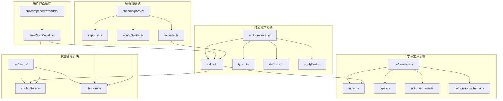
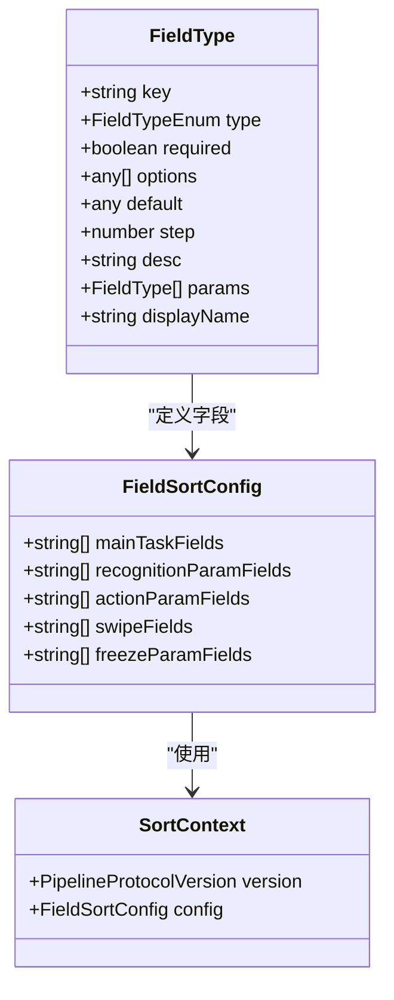
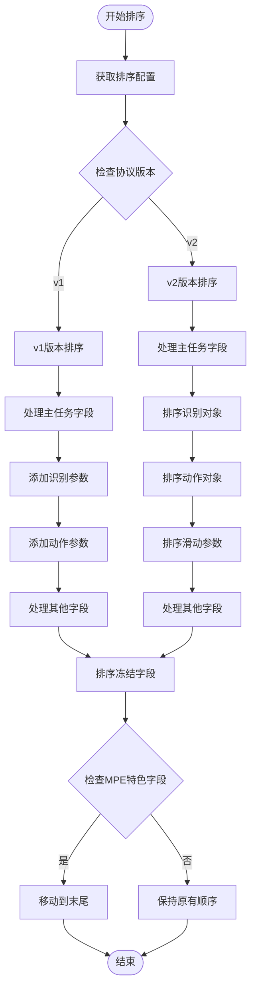
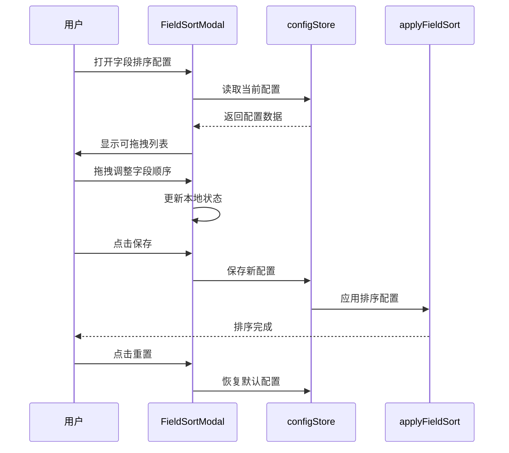
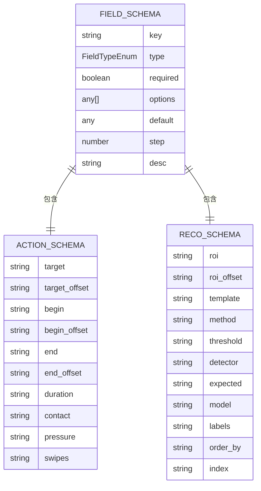
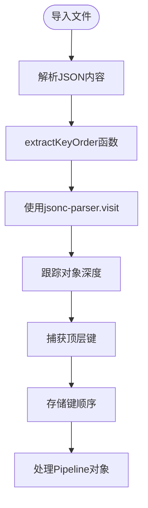
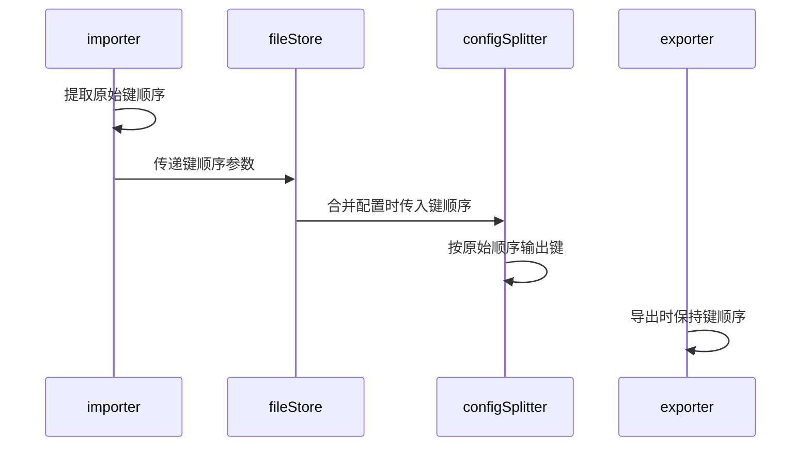

# 字段排序系统

<cite>
**本文档引用的文件**
- [src/core/sorting/index.ts](file://src/core/sorting/index.ts)
- [src/core/sorting/types.ts](file://src/core/sorting/types.ts)
- [src/core/sorting/defaults.ts](file://src/core/sorting/defaults.ts)
- [src/core/sorting/applySort.ts](file://src/core/sorting/applySort.ts)
- [src/components/modals/FieldSortModal.tsx](file://src/components/modals/FieldSortModal.tsx)
- [src/core/fields/index.ts](file://src/core/fields/index.ts)
- [src/core/fields/types.ts](file://src/core/fields/types.ts)
- [src/core/fields/action/schema.ts](file://src/core/fields/action/schema.ts)
- [src/core/fields/recognition/schema.ts](file://src/core/fields/recognition/schema.ts)
- [src/stores/configStore.ts](file://src/stores/configStore.ts)
- [src/core/parser/exporter.ts](file://src/core/parser/exporter.ts)
- [src/stores/fileStore.ts](file://src/stores/fileStore.ts)
- [src/core/parser/importer.ts](file://src/core/parser/importer.ts)
- [src/core/parser/configSplitter.ts](file://src/core/parser/configSplitter.ts)
</cite>

## 更新摘要
**变更内容**
- 新增键顺序保持机制，解决本地文件保存时字段顺序被忽略的问题
- 增强导入导出流程中的字段排序稳定性
- 优化字段排序配置的持久化和恢复机制

## 目录
1. [简介](#简介)
2. [项目结构](#项目结构)
3. [核心组件](#核心组件)
4. [架构概览](#架构概览)
5. [详细组件分析](#详细组件分析)
6. [键顺序保持机制](#键顺序保持机制)
7. [依赖关系分析](#依赖关系分析)
8. [性能考虑](#性能考虑)
9. [故障排除指南](#故障排除指南)
10. [结论](#结论)

## 简介

字段排序系统是 MAA Pipeline Editor 的核心功能模块，负责对管道节点的字段进行有序排列，确保导出的 JSON 文件具有统一、可读性强的结构。该系统支持多种字段类型的排序，包括主任务字段、识别参数字段、动作参数字段、滑动参数字段和冻结参数字段，并提供了用户友好的配置界面。

**更新** 系统现已集成键顺序保持机制，确保本地文件保存时字段顺序得到稳定保持，解决了之前字段顺序被忽略的问题。

系统采用模块化设计，将排序逻辑与用户界面分离，既保证了功能的灵活性，又提供了直观的配置体验。通过拖拽排序的方式，用户可以根据自己的需求定制字段的显示顺序。

## 项目结构

字段排序系统主要分布在以下目录结构中：



**图表来源**
- [src/core/sorting/index.ts:1-22](file://src/core/sorting/index.ts#L1-L22)
- [src/core/fields/index.ts:1-46](file://src/core/fields/index.ts#L1-L46)
- [src/components/modals/FieldSortModal.tsx:1-360](file://src/components/modals/FieldSortModal.tsx#L1-L360)
- [src/stores/fileStore.ts:126-152](file://src/stores/fileStore.ts#L126-L152)

**章节来源**
- [src/core/sorting/index.ts:1-22](file://src/core/sorting/index.ts#L1-L22)
- [src/core/fields/index.ts:1-46](file://src/core/fields/index.ts#L1-L46)

## 核心组件

字段排序系统由五个核心组件构成，每个组件都有明确的职责分工：

### 1. 类型定义组件
提供完整的 TypeScript 类型定义，确保系统的类型安全性和开发体验。

### 2. 默认配置组件  
定义各种字段类型的默认排序顺序，包括主任务字段、识别参数、动作参数等。

### 3. 排序应用组件
实现具体的排序逻辑，支持 v1 和 v2 两种协议版本的处理。

### 4. 用户界面组件
提供拖拽式的可视化配置界面，让用户能够直观地调整字段排序。

### 5. 键顺序保持组件
**新增** 实现键顺序提取和保持机制，确保字段顺序在导入导出过程中得到稳定保持。

**章节来源**
- [src/core/sorting/types.ts:1-28](file://src/core/sorting/types.ts#L1-L28)
- [src/core/sorting/defaults.ts:1-152](file://src/core/sorting/defaults.ts#L1-L152)
- [src/core/sorting/applySort.ts:1-341](file://src/core/sorting/applySort.ts#L1-L341)
- [src/stores/fileStore.ts:126-152](file://src/stores/fileStore.ts#L126-L152)

## 架构概览

字段排序系统采用分层架构设计，各层之间职责清晰，耦合度低：

```mermaid
graph TB
subgraph "表示层"
UI[FieldSortModal.tsx]
end
subgraph "业务逻辑层"
CFG[FieldSortConfig]
CTX[SortContext]
SORT[applyFieldSort]
KEYORDER[extractKeyOrder]
END
subgraph "数据定义层"
TYPES[FieldSortConfig Type]
DEFAULTS[默认排序配置]
SCHEMAS[字段Schema定义]
END
subgraph "状态管理层"
STORE[configStore]
FILESTORE[fileStore]
END
subgraph "解析器层"
IMPORT[importer]
EXPORT[exporter]
MERGE[configSplitter]
END
UI --> CFG
CFG --> SORT
CTX --> SORT
TYPES --> CFG
DEFAULTS --> CFG
SCHEMAS --> DEFAULTS
STORE --> UI
STORE --> SORT
FILESTORE --> KEYORDER
IMPORT --> KEYORDER
EXPORT --> SORT
MERGE --> KEYORDER
```

**图表来源**
- [src/components/modals/FieldSortModal.tsx:108-189](file://src/components/modals/FieldSortModal.tsx#L108-L189)
- [src/core/sorting/applySort.ts:314-340](file://src/core/sorting/applySort.ts#L314-L340)
- [src/stores/configStore.ts:156-173](file://src/stores/configStore.ts#L156-L173)
- [src/stores/fileStore.ts:126-152](file://src/stores/fileStore.ts#L126-L152)

系统的核心流程遵循以下模式：

1. **配置阶段**：用户通过界面调整字段排序
2. **存储阶段**：配置信息存储在全局状态管理中
3. **应用阶段**：导出时根据配置对节点字段进行排序
4. **键顺序保持**：**新增** 在导入时提取原始键顺序并在导出时保持
5. **验证阶段**：确保排序结果符合预期

## 详细组件分析

### 类型定义系统

字段排序系统使用严格的 TypeScript 类型定义来确保类型安全：



**图表来源**
- [src/core/sorting/types.ts:6-27](file://src/core/sorting/types.ts#L6-L27)
- [src/core/fields/types.ts:6-33](file://src/core/fields/types.ts#L6-L33)

**章节来源**
- [src/core/sorting/types.ts:1-28](file://src/core/sorting/types.ts#L1-L28)
- [src/core/fields/types.ts:1-34](file://src/core/fields/types.ts#L1-L34)

### 默认配置管理

默认配置组件提供了各种字段类型的预定义排序顺序：

| 字段类型 | 默认顺序项 | 数量 |
|---------|-----------|------|
| 主任务字段 | desc, doc, enabled, max_hit, sub_name, recognition, inverse, pre_wait_freezes, pre_delay, action, anchor, repeat, repeat_wait_freezes, repeat_delay, post_wait_freezes, post_delay, timeout, rate_limit, next, on_error, focus, attach | 22项 |
| 识别参数字段 | custom_recognition, custom_recognition_param, roi, roi_offset, template, green_mask, method, detector, ratio, lower, upper, connected, expected, replace, only_rec, model, color_filter, labels, threshold, count, all_of, any_of, box_index, order_by, index | 25项 |
| 动作参数字段 | custom_action, custom_action_param, target, target_offset, begin, begin_offset, end, end_offset, end_hold, only_hover, duration, contact, pressure, swipes, dx, dy, key, input_text, package, exec, args, detach, cmd, shell_timeout, filename, format, quality | 27项 |
| 滑动参数字段 | starting, begin, begin_offset, end, end_offset, duration, end_hold, only_hover, contact, pressure | 10项 |
| 冻结参数字段 | time, target, target_offset, threshold, method, rate_limit, timeout | 7项 |

**章节来源**
- [src/core/sorting/defaults.ts:16-117](file://src/core/sorting/defaults.ts#L16-L117)

### 排序算法实现

排序算法采用"优先级+追加"的策略，确保重要字段优先显示：



**图表来源**
- [src/core/sorting/applySort.ts:183-305](file://src/core/sorting/applySort.ts#L183-L305)

**章节来源**
- [src/core/sorting/applySort.ts:23-341](file://src/core/sorting/applySort.ts#L23-L341)

### 用户界面交互

FieldSortModal 提供了直观的拖拽排序界面：



**图表来源**
- [src/components/modals/FieldSortModal.tsx:108-189](file://src/components/modals/FieldSortModal.tsx#L108-L189)
- [src/stores/configStore.ts:156-173](file://src/stores/configStore.ts#L156-L173)

**章节来源**
- [src/components/modals/FieldSortModal.tsx:1-360](file://src/components/modals/FieldSortModal.tsx#L1-L360)

### 字段Schema定义

系统通过 Schema 定义确保字段的完整性和正确性：



**图表来源**
- [src/core/fields/action/schema.ts:7-291](file://src/core/fields/action/schema.ts#L7-L291)
- [src/core/fields/recognition/schema.ts:7-268](file://src/core/fields/recognition/schema.ts#L7-L268)

**章节来源**
- [src/core/fields/action/schema.ts:1-316](file://src/core/fields/action/schema.ts#L1-L316)
- [src/core/fields/recognition/schema.ts:1-276](file://src/core/fields/recognition/schema.ts#L1-L276)

## 键顺序保持机制

**新增** 键顺序保持机制是本次更新的核心功能，解决了本地文件保存时字段顺序被忽略的问题：

### 键顺序提取

系统在导入文件时自动提取原始键的顺序：



**图表来源**
- [src/stores/fileStore.ts:126-152](file://src/stores/fileStore.ts#L126-L152)
- [src/core/parser/importer.ts:169-195](file://src/core/parser/importer.ts#L169-L195)

### 键顺序保持流程



**图表来源**
- [src/stores/fileStore.ts:518-604](file://src/stores/fileStore.ts#L518-L604)
- [src/core/parser/configSplitter.ts:233-325](file://src/core/parser/configSplitter.ts#L233-L325)

### 键顺序保持的实现细节

1. **导入阶段**：使用 `jsonc-parser.visit` 函数遍历 JSON 对象，提取顶层键的出现顺序
2. **传递机制**：将提取的键顺序传递给配置合并函数
3. **输出控制**：在合并过程中按照原始键顺序输出，确保导出的 JSON 保持原有的字段顺序
4. **兼容性**：对于没有键顺序信息的文件，系统会回退到默认行为

**章节来源**
- [src/stores/fileStore.ts:126-152](file://src/stores/fileStore.ts#L126-L152)
- [src/core/parser/importer.ts:169-211](file://src/core/parser/importer.ts#L169-L211)
- [src/core/parser/configSplitter.ts:233-325](file://src/core/parser/configSplitter.ts#L233-L325)

## 依赖关系分析

字段排序系统与其他模块的依赖关系如下：

```mermaid
graph TB
subgraph "外部依赖"
ZUSTAND[zustand状态管理]
DNDKIT[dnd-kit拖拽库]
ANTD[antd组件库]
JSONC[jsonc-parser]
END
subgraph "内部模块"
SORT[sorting模块]
FIELDS[fields模块]
MODAL[FieldSortModal]
STORE[configStore]
FILESTORE[fileStore]
EXPORTER[exporter]
IMPORTER[importer]
SPLITTER[configSplitter]
END
ZUSTAND --> STORE
ZUSTAND --> FILESTORE
DNDKIT --> MODAL
ANTD --> MODAL
JSONC --> IMPORTER
JSONC --> FILESTORE
SORT --> FIELDS
SORT --> STORE
MODAL --> STORE
MODAL --> SORT
EXPORTER --> SORT
EXPORTER --> STORE
IMPORTER --> FILESTORE
IMPORTER --> SPLITTER
SPLITTER --> FILESTORE
```

**图表来源**
- [src/components/modals/FieldSortModal.tsx:1-30](file://src/components/modals/FieldSortModal.tsx#L1-L30)
- [src/core/parser/exporter.ts:36-36](file://src/core/parser/exporter.ts#L36-L36)
- [src/stores/fileStore.ts:5-5](file://src/stores/fileStore.ts#L5-L5)

**章节来源**
- [src/stores/configStore.ts:1-287](file://src/stores/configStore.ts#L1-L287)
- [src/core/parser/exporter.ts:1-262](file://src/core/parser/exporter.ts#L1-L262)

## 性能考虑

字段排序系统在设计时充分考虑了性能优化：

### 时间复杂度分析
- **排序操作**：O(n + m)，其中 n 为字段数量，m 为配置项数量
- **合并配置**：O(k)，k 为配置项数量
- **拖拽更新**：O(n)，n 为列表长度
- **键顺序提取**：O(m)，m 为JSON对象的总键数

### 内存使用优化
- 使用 Set 数据结构提高查找效率
- 避免不必要的对象复制
- 智能缓存配置状态
- **新增** 键顺序提取时使用流式解析，避免一次性加载整个文件

### 用户体验优化
- 实时拖拽反馈
- 平滑的动画过渡
- 即时的状态同步
- **新增** 导入导出过程中的键顺序保持，提升文件稳定性

## 故障排除指南

### 常见问题及解决方案

| 问题类型 | 症状 | 解决方案 |
|---------|------|----------|
| 排序配置丢失 | 页面刷新后配置重置 | 检查浏览器存储权限 |
| 拖拽功能失效 | 无法拖拽字段 | 确认 dnd-kit 库正常加载 |
| 排序结果异常 | 字段顺序不符合预期 | 验证字段 Schema 定义 |
| 性能问题 | 操作响应缓慢 | 检查大数据集的处理逻辑 |
| **新增** 键顺序丢失 | 导出文件字段顺序改变 | 检查JSON解析器版本和配置 |

### 调试技巧
1. **开发者工具**：使用浏览器开发者工具监控状态变化
2. **日志记录**：在关键节点添加日志输出
3. **单元测试**：编写针对排序逻辑的测试用例
4. **性能分析**：使用性能分析工具识别瓶颈
5. ****新增** 键顺序调试**：检查 `extractKeyOrder` 函数的执行情况

**章节来源**
- [src/components/modals/FieldSortModal.tsx:141-155](file://src/components/modals/FieldSortModal.tsx#L141-L155)
- [src/core/sorting/applySort.ts:314-341](file://src/core/sorting/applySort.ts#L314-L341)

## 结论

字段排序系统通过模块化的设计和清晰的职责分工，成功实现了灵活而强大的字段排序功能。**本次更新**特别增强了系统的稳定性，通过键顺序保持机制确保了本地文件保存时字段顺序不会被忽略，为用户提供了更加可靠的开发体验。

该系统的主要优势包括：
- **类型安全**：完整的 TypeScript 类型定义确保代码质量
- **用户友好**：拖拽式界面提升用户体验
- **扩展性强**：模块化设计便于功能扩展
- **性能优化**：高效的算法和内存管理
- **稳定性增强**：**新增** 键顺序保持机制确保文件结构稳定

未来可以考虑的功能增强：
- 支持更多协议版本的排序规则
- 提供批量配置导入导出功能
- 增强排序规则的条件判断能力
- 优化大数据集的处理性能
- **新增** 键顺序保持机制的进一步优化

通过持续的优化和改进，字段排序系统将继续为用户提供优秀的开发体验，特别是在文件导入导出的稳定性方面有了显著提升。