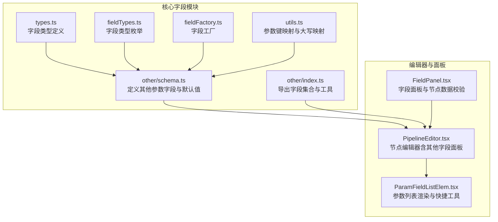
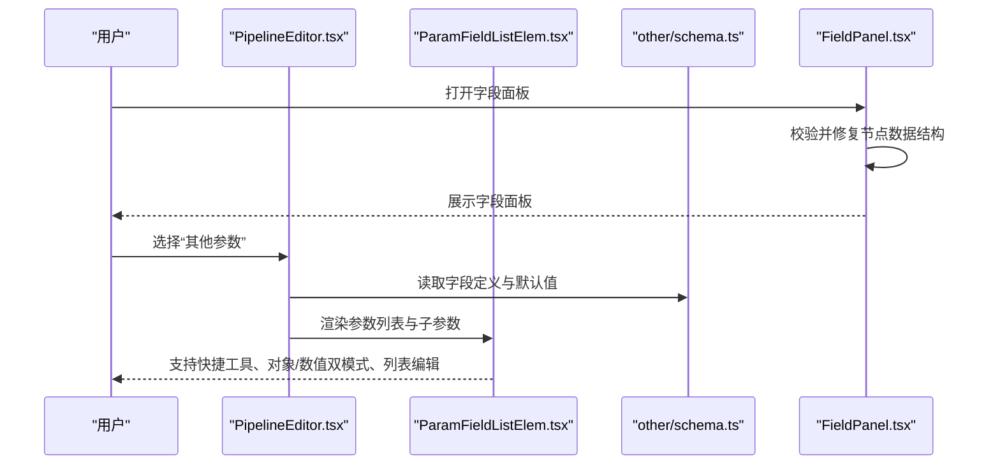
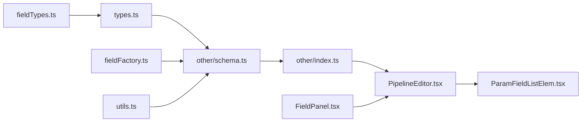

# 其他参数字段

<cite>
**本文引用的文件**
- [schema.ts](file://src/core/fields/other/schema.ts)
- [index.ts](file://src/core/fields/other/index.ts)
- [types.ts](file://src/core/fields/types.ts)
- [fieldTypes.ts](file://src/core/fields/fieldTypes.ts)
- [fieldFactory.ts](file://src/core/fields/fieldFactory.ts)
- [utils.ts](file://src/core/fields/utils.ts)
- [PipelineEditor.tsx](file://src/components/panels/node-editors/PipelineEditor.tsx)
- [ParamFieldListElem.tsx](file://src/components/panels/field/items/ParamFieldListElem.tsx)
- [FieldPanel.tsx](file://src/components/panels/main/FieldPanel.tsx)
- [default_pipeline.json](file://LocalBridge/test-json/base/default_pipeline.json)
</cite>

## 目录
1. [简介](#简介)
2. [项目结构](#项目结构)
3. [核心组件](#核心组件)
4. [架构总览](#架构总览)
5. [详细组件分析](#详细组件分析)
6. [依赖分析](#依赖分析)
7. [性能考量](#性能考量)
8. [故障排查指南](#故障排查指南)
9. [结论](#结论)
10. [附录](#附录)

## 简介
本章节面向“其他参数字段”系统，系统性梳理延迟设置、条件判断、循环控制、错误处理与关注消息等配置项的定义、类型、默认值、作用与使用场景，并阐明它们在工作流中的相互关系与依赖。文档同时提供最佳实践与常见问题排查建议，帮助开发者与使用者高效、稳定地构建自动化工作流。

## 项目结构
“其他参数字段”属于前端字段定义与编辑体系的一部分，位于核心字段模块中，配合 UI 编辑器与校验修复机制共同构成完整的参数配置体验。

图表来源
- [schema.ts:1-363](file://src/core/fields/other/schema.ts#L1-L363)
- [index.ts:1-8](file://src/core/fields/other/index.ts#L1-L8)
- [types.ts:1-34](file://src/core/fields/types.ts#L1-L34)
- [fieldTypes.ts:1-27](file://src/core/fields/fieldTypes.ts#L1-L27)
- [fieldFactory.ts:1-16](file://src/core/fields/fieldFactory.ts#L1-L16)
- [utils.ts:1-41](file://src/core/fields/utils.ts#L1-L41)
- [PipelineEditor.tsx:1-200](file://src/components/panels/node-editors/PipelineEditor.tsx#L1-L200)
- [ParamFieldListElem.tsx:1-200](file://src/components/panels/field/items/ParamFieldListElem.tsx#L1-L200)
- [FieldPanel.tsx:54-267](file://src/components/panels/main/FieldPanel.tsx#L54-L267)

章节来源
- [schema.ts:1-363](file://src/core/fields/other/schema.ts#L1-L363)
- [index.ts:1-8](file://src/core/fields/other/index.ts#L1-L8)
- [types.ts:1-34](file://src/core/fields/types.ts#L1-L34)
- [fieldTypes.ts:1-27](file://src/core/fields/fieldTypes.ts#L1-L27)
- [fieldFactory.ts:1-16](file://src/core/fields/fieldFactory.ts#L1-L16)
- [utils.ts:1-41](file://src/core/fields/utils.ts#L1-L41)
- [PipelineEditor.tsx:1-200](file://src/components/panels/node-editors/PipelineEditor.tsx#L1-L200)
- [ParamFieldListElem.tsx:1-200](file://src/components/panels/field/items/ParamFieldListElem.tsx#L1-L200)
- [FieldPanel.tsx:54-267](file://src/components/panels/main/FieldPanel.tsx#L54-L267)

## 核心组件
- 字段定义与默认值：集中于“其他参数字段”的 schema，涵盖延迟、等待画面静止、重复执行、锚点、启用/禁用、反转识别、超时、速率限制、关注消息、附加配置等。
- 字段类型系统：通过 FieldType 与 FieldTypeEnum 描述字段类型、步进、可选项、默认值、描述与子参数等。
- 字段集合导出：提供其他字段参数列表、键列表、等待静止相关字段集合等，便于 UI 与业务逻辑复用。
- 编辑器集成：PipelineEditor 与 ParamFieldListElem 将字段定义映射为可视化的参数面板，支持快捷工具、对象模式与列表模式。

章节来源
- [schema.ts:7-308](file://src/core/fields/other/schema.ts#L7-L308)
- [types.ts:6-16](file://src/core/fields/types.ts#L6-L16)
- [fieldTypes.ts:4-26](file://src/core/fields/fieldTypes.ts#L4-L26)
- [index.ts:1-8](file://src/core/fields/other/index.ts#L1-L8)
- [PipelineEditor.tsx:467-562](file://src/components/panels/node-editors/PipelineEditor.tsx#L467-L562)
- [ParamFieldListElem.tsx:38-64](file://src/components/panels/field/items/ParamFieldListElem.tsx#L38-L64)

## 架构总览
“其他参数字段”在前端的职责链路如下：
- 字段定义层：schema.ts 提供字段元数据与默认值。
- 类型系统层：types.ts 与 fieldTypes.ts 提供统一的类型约束与枚举。
- 导出与工具层：index.ts 暴露集合；utils.ts 提供参数键映射与大写映射。
- 编辑器层：PipelineEditor.tsx 与 ParamFieldListElem.tsx 将字段渲染为 UI，支持对象/数值双模式、快捷工具、列表编辑等。
- 校验与修复：FieldPanel.tsx 在面板打开时对节点数据进行校验与修复，确保 others 结构完整。

图表来源
- [PipelineEditor.tsx:467-562](file://src/components/panels/node-editors/PipelineEditor.tsx#L467-L562)
- [ParamFieldListElem.tsx:72-200](file://src/components/panels/field/items/ParamFieldListElem.tsx#L72-L200)
- [schema.ts:7-308](file://src/core/fields/other/schema.ts#L7-L308)
- [FieldPanel.tsx:54-267](file://src/components/panels/main/FieldPanel.tsx#L54-L267)

## 详细组件分析

### 字段类型与默认值总览
- 延迟设置
  - pre_delay：执行前延迟，单位毫秒，默认值参见 schema。
  - post_delay：执行后延迟，单位毫秒，默认值参见 schema。
  - repeat_delay：重复动作之间的延迟，单位毫秒，默认值参见 schema。
- 等待画面静止（WaitFreezes）
  - pre_wait_freezes：识别到到执行动作前等待画面静止，支持整数毫秒或对象模式（含 time、target、target_offset、threshold、method、rate_limit、timeout 等子参数）。
  - post_wait_freezes：动作后到识别 next 前等待画面静止，支持整数毫秒或对象模式。
  - repeat_wait_freezes：重复动作之间等待画面静止，支持整数毫秒或对象模式。
- 循环与控制
  - repeat：动作重复执行次数，默认值参见 schema。
  - timeout：next 列表循环识别的超时时间，单位毫秒，默认值参见 schema。
  - rate_limit：识别速率限制，单位毫秒，默认值参见 schema。
- 条件与状态
  - enabled：是否启用该节点，默认值参见 schema。
  - inverse：反转识别结果，默认值参见 schema。
  - max_hit：节点最多可被识别成功的次数，默认值参见 schema。
  - anchor：锚点名称，支持字符串、字符串数组、对象三格式，默认值参见 schema。
- 关注消息（focus）
  - focus：关注节点，产生多种回调消息模板，支持结构化配置（如 Reco.Start、Reco.OK、Reco.Fail、Action.Start、Action.OK、Action.Fail 等键）。
- 附加配置
  - attach：附加 JSON 对象，用于保存自定义配置，与默认值进行字典合并。

章节来源
- [schema.ts:8-308](file://src/core/fields/other/schema.ts#L8-L308)
- [fieldTypes.ts:4-26](file://src/core/fields/fieldTypes.ts#L4-L26)

### 字段在工作流中的作用与使用场景
- 延迟设置
  - 适用场景：动作前后留白，避免过快导致状态未刷新或不稳定。
  - 注意事项：优先采用中间过程节点，减少对全局延迟的依赖。
- 等待画面静止
  - 适用场景：动作执行后画面可能仍在抖动，需要等待稳定后再继续识别。
  - 参数组合：time、threshold、method、rate_limit、timeout 等共同决定等待策略。
- 循环与控制
  - repeat/repeat_delay：多次执行同一动作，适合重复点击、滑动等。
  - timeout/rate_limit：控制整体识别节奏与超时，避免无限等待。
- 条件与状态
  - enabled/inverse/max_hit：灵活控制节点的启用、识别结果反转与命中上限。
  - anchor：跨节点引用，形成稳定的“锚点”定位。
- 关注消息（focus）
  - 适用场景：需要在识别/动作生命周期中输出结构化消息，便于 UI 展示与国际化。
- 附加配置（attach）
  - 适用场景：保存与执行无关的自定义配置，便于扩展与回溯。

章节来源
- [schema.ts:13-308](file://src/core/fields/other/schema.ts#L13-L308)

### 参数字段之间的相互关系与依赖
- 等待静止与延迟的顺序
  - 执行顺序：pre_wait_freezes → pre_delay → action → post_wait_freezes → post_delay。
  - repeat_wait_freezes 仅在 repeat > 1 时生效。
- 超时与速率限制
  - timeout 控制整体循环超时；rate_limit 控制每次识别的最小耗时，二者共同决定识别节奏与稳定性。
- 启用与命中上限
  - enabled=false 时，其他节点的 next 列表中该节点会被跳过；max_hit 达到上限后也会被跳过。
- 锚点与 next/on_error
  - anchor 可在 next 或 on_error 中通过 [Anchor] 引用，未设置或清除的锚点会导致节点跳过。
- 关注消息与 attach
  - focus 为结构化消息模板，attach 为附加配置，两者均不影响执行逻辑，但可被外部系统消费。

章节来源
- [schema.ts:13-308](file://src/core/fields/other/schema.ts#L13-L308)

### 字段在 UI 中的呈现与交互
- 对象/数值双模式
  - 对于支持对象模式的字段（如 waitFreezes 系列、focus），UI 会根据当前值类型动态切换数值输入或子参数表单。
- 快捷工具
  - ROI、目标偏移、OCR、模板、颜色、位移差值等快捷工具可在相应字段处一键打开，提升配置效率。
- 列表与增删改
  - 支持列表字段的增删改与联动变更，保证复杂参数的可维护性。

章节来源
- [PipelineEditor.tsx:467-562](file://src/components/panels/node-editors/PipelineEditor.tsx#L467-L562)
- [PipelineEditor.tsx:747-840](file://src/components/panels/node-editors/PipelineEditor.tsx#L747-L840)
- [ParamFieldListElem.tsx:38-64](file://src/components/panels/field/items/ParamFieldListElem.tsx#L38-L64)
- [ParamFieldListElem.tsx:114-200](file://src/components/panels/field/items/ParamFieldListElem.tsx#L114-L200)

### 字段定义与类型系统
- FieldType
  - key：字段键名
  - type：字段类型（可为单一类型或联合类型）
  - required：是否必填
  - options：可选值列表
  - default：默认值
  - step：步进（用于数值型）
  - desc：描述
  - params：子参数列表（用于结构化字段）
  - displayName：显示名
- FieldTypeEnum
  - 覆盖整数、浮点、布尔、字符串、列表、XYWH、位置、任意类型、图片路径等基础与复合类型。

章节来源
- [types.ts:6-16](file://src/core/fields/types.ts#L6-L16)
- [fieldTypes.ts:4-26](file://src/core/fields/fieldTypes.ts#L4-L26)

### 字段集合与工具
- otherFieldParams / otherFieldParamsWithoutFocus：导出其他字段参数列表，后者排除 focus。
- otherFieldSchemaKeyList：导出键列表，便于 UI 构建字段选择器。
- waitFreezesFields：导出等待静止相关字段集合，便于统一处理。
- utils：generateParamKeys 与 generateUpperValues 提供参数键映射与大写映射，便于配置与解析。

章节来源
- [index.ts:1-8](file://src/core/fields/other/index.ts#L1-L8)
- [utils.ts:6-25](file://src/core/fields/utils.ts#L6-L25)
- [utils.ts:30-40](file://src/core/fields/utils.ts#L30-L40)

### 数据校验与修复
- 字段面板在打开时会对节点数据进行校验，确保 recognition/action/others 结构完整，必要时自动修复。
- 修复后会提示用户应用修复，保障编辑器稳定运行。

章节来源
- [FieldPanel.tsx:54-267](file://src/components/panels/main/FieldPanel.tsx#L54-L267)

## 依赖分析
- 字段定义依赖类型系统（FieldType、FieldTypeEnum），并通过工厂与工具函数进行组织与导出。
- 编辑器依赖字段定义与工具函数，将字段元数据转化为可视化的参数面板。
- 校验修复依赖字段定义与默认值，确保节点数据结构一致性。

图表来源
- [fieldTypes.ts:1-27](file://src/core/fields/fieldTypes.ts#L1-L27)
- [types.ts:1-34](file://src/core/fields/types.ts#L1-L34)
- [fieldFactory.ts:1-16](file://src/core/fields/fieldFactory.ts#L1-L16)
- [utils.ts:1-41](file://src/core/fields/utils.ts#L1-L41)
- [schema.ts:1-363](file://src/core/fields/other/schema.ts#L1-L363)
- [index.ts:1-8](file://src/core/fields/other/index.ts#L1-L8)
- [PipelineEditor.tsx:1-200](file://src/components/panels/node-editors/PipelineEditor.tsx#L1-L200)
- [ParamFieldListElem.tsx:1-200](file://src/components/panels/field/items/ParamFieldListElem.tsx#L1-L200)
- [FieldPanel.tsx:54-267](file://src/components/panels/main/FieldPanel.tsx#L54-L267)

章节来源
- [fieldTypes.ts:1-27](file://src/core/fields/fieldTypes.ts#L1-L27)
- [types.ts:1-34](file://src/core/fields/types.ts#L1-L34)
- [fieldFactory.ts:1-16](file://src/core/fields/fieldFactory.ts#L1-L16)
- [utils.ts:1-41](file://src/core/fields/utils.ts#L1-L41)
- [schema.ts:1-363](file://src/core/fields/other/schema.ts#L1-L363)
- [index.ts:1-8](file://src/core/fields/other/index.ts#L1-L8)
- [PipelineEditor.tsx:1-200](file://src/components/panels/node-editors/PipelineEditor.tsx#L1-L200)
- [ParamFieldListElem.tsx:1-200](file://src/components/panels/field/items/ParamFieldListElem.tsx#L1-L200)
- [FieldPanel.tsx:54-267](file://src/components/panels/main/FieldPanel.tsx#L54-L267)

## 性能考量
- 速率限制与超时
  - 合理设置 rate_limit 与 timeout，避免频繁 sleep 或无限等待，提升整体识别吞吐。
- 等待画面静止
  - 适当提高 threshold 与调整 method，减少误判；合理设置 time，避免过度等待。
- 延迟与重复
  - 减少全局延迟，优先使用中间过程节点；repeat 与 repeat_delay 应按需设置，避免冗余动作。
- 锚点与命中上限
  - 合理使用 anchor 与 max_hit，避免不必要的 next 跳过与重复识别。

## 故障排查指南
- 节点被跳过
  - 检查 enabled 是否为 false；检查 max_hit 是否已达上限；检查 anchor 是否被 next/on_error 正确引用。
- 识别/动作无响应
  - 检查 timeout 是否过小；检查 rate_limit 是否过高；确认 waitFreezes 参数是否阻塞。
- 等待静止不生效
  - 确认字段处于对象模式并正确设置了 time、threshold、method、rate_limit、timeout。
- focus 消息未出现
  - 确认 focus 字段为非空结构化对象；检查消息模板键是否完整。
- attach 配置未生效
  - 确认 attach 为对象模式；注意与默认值进行字典合并的行为。

章节来源
- [schema.ts:13-308](file://src/core/fields/other/schema.ts#L13-L308)
- [FieldPanel.tsx:54-267](file://src/components/panels/main/FieldPanel.tsx#L54-L267)

## 结论
“其他参数字段”提供了对工作流执行节奏、稳定性与可观测性的精细控制。通过明确的字段定义、类型系统与 UI 编辑器集成，开发者可以在保证可维护性的同时，灵活配置延迟、等待、重复、条件与关注消息等关键参数，从而构建稳定高效的自动化流程。

## 附录
- 默认配置示例
  - 全局默认配置示例展示了 timeout 与 pre_delay 的默认值设置方式，便于在项目层面统一规范。

章节来源
- [default_pipeline.json:1-6](file://LocalBridge/test-json/base/default_pipeline.json#L1-L6)