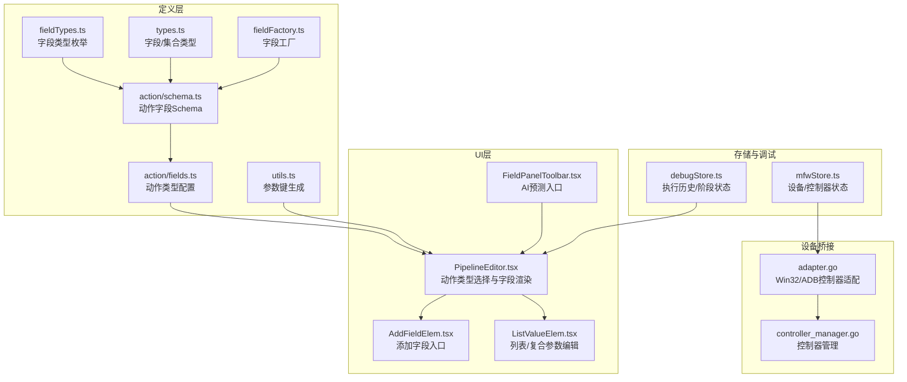
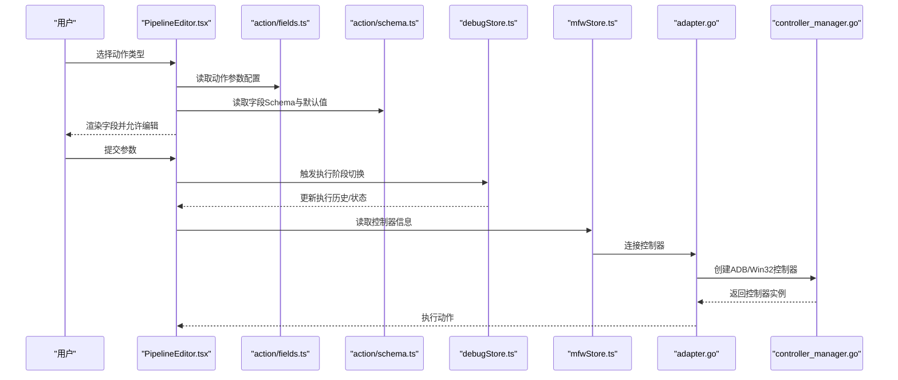
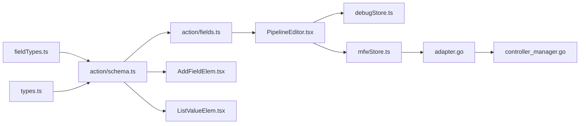

# 动作字段

<cite>
**本文引用的文件**
- [schema.ts](file://src/core/fields/action/schema.ts)
- [fields.ts](file://src/core/fields/action/fields.ts)
- [index.ts](file://src/core/fields/action/index.ts)
- [fieldTypes.ts](file://src/core/fields/fieldTypes.ts)
- [types.ts](file://src/core/fields/types.ts)
- [utils.ts](file://src/core/fields/utils.ts)
- [fieldFactory.ts](file://src/core/fields/fieldFactory.ts)
- [PipelineEditor.tsx](file://src/components/panels/node-editors/PipelineEditor.tsx)
- [AddFieldElem.tsx](file://src/components/panels/field/items/AddFieldElem.tsx)
- [ListValueElem.tsx](file://src/components/panels/field/items/ListValueElem.tsx)
- [FieldPanelToolbar.tsx](file://src/components/panels/field/tools/FieldPanelToolbar.tsx)
- [mfwStore.ts](file://src/stores/mfwStore.ts)
- [debugStore.ts](file://src/stores/debugStore.ts)
- [adapter.go](file://LocalBridge/internal/mfw/adapter.go)
- [controller_manager.go](file://LocalBridge/internal/mfw/controller_manager.go)
- [aiPredictor.ts](file://src/utils/aiPredictor.ts)
</cite>

## 目录
1. [简介](#简介)
2. [项目结构](#项目结构)
3. [核心组件](#核心组件)
4. [架构总览](#架构总览)
5. [详细组件分析](#详细组件分析)
6. [依赖关系分析](#依赖关系分析)
7. [性能考量](#性能考量)
8. [故障排查指南](#故障排查指南)
9. [结论](#结论)
10. [附录](#附录)

## 简介
本文件系统性地阐述“动作字段”体系的设计与实现，覆盖以下方面：
- 动作类型的定义与差异：点击、滑动、长按、输入、应用启停、命令/Shell、截图、按键、多指滑动、触控点系列、自定义动作等
- 每类动作的参数设置、坐标计算规则、时间控制策略
- 动作字段与设备控制的集成方式（ADB/Win32/PlayCover/Gamepad）
- 动作字段的组合与序列执行机制
- 调试技巧与性能优化建议

## 项目结构
动作字段系统由“定义层 + UI层 + 存储与调试层 + 设备桥接层”构成，关键文件分布如下：
- 定义层：动作字段的类型、键、默认值、校验规则
- UI层：动作类型选择、字段增删改、列表/复杂参数编辑
- 存储与调试层：执行历史、阶段切换、错误上报
- 设备桥接层：控制器创建、连接、输入方法映射

图表来源
- [schema.ts:1-299](file://src/core/fields/action/schema.ts#L1-L299)
- [fields.ts:1-149](file://src/core/fields/action/fields.ts#L1-L149)
- [fieldTypes.ts:1-27](file://src/core/fields/fieldTypes.ts#L1-L27)
- [types.ts:1-34](file://src/core/fields/types.ts#L1-L34)
- [utils.ts:1-41](file://src/core/fields/utils.ts#L1-L41)
- [fieldFactory.ts:1-16](file://src/core/fields/fieldFactory.ts#L1-L16)
- [PipelineEditor.tsx:399-490](file://src/components/panels/node-editors/PipelineEditor.tsx#L399-L490)
- [AddFieldElem.tsx:1-62](file://src/components/panels/field/items/AddFieldElem.tsx#L1-L62)
- [ListValueElem.tsx:1-149](file://src/components/panels/field/items/ListValueElem.tsx#L1-L149)
- [FieldPanelToolbar.tsx:1-238](file://src/components/panels/field/tools/FieldPanelToolbar.tsx#L1-L238)
- [mfwStore.ts:1-158](file://src/stores/mfwStore.ts#L1-L158)
- [debugStore.ts:449-733](file://src/stores/debugStore.ts#L449-L733)
- [adapter.go:104-156](file://LocalBridge/internal/mfw/adapter.go#L104-L156)
- [controller_manager.go:47-89](file://LocalBridge/internal/mfw/controller_manager.go#L47-L89)

章节来源
- [schema.ts:1-299](file://src/core/fields/action/schema.ts#L1-L299)
- [fields.ts:1-149](file://src/core/fields/action/fields.ts#L1-L149)
- [fieldTypes.ts:1-27](file://src/core/fields/fieldTypes.ts#L1-L27)
- [types.ts:1-34](file://src/core/fields/types.ts#L1-L34)
- [utils.ts:1-41](file://src/core/fields/utils.ts#L1-L41)
- [fieldFactory.ts:1-16](file://src/core/fields/fieldFactory.ts#L1-L16)
- [PipelineEditor.tsx:399-490](file://src/components/panels/node-editors/PipelineEditor.tsx#L399-L490)
- [AddFieldElem.tsx:1-62](file://src/components/panels/field/items/AddFieldElem.tsx#L1-L62)
- [ListValueElem.tsx:1-149](file://src/components/panels/field/items/ListValueElem.tsx#L1-L149)
- [FieldPanelToolbar.tsx:1-238](file://src/components/panels/field/tools/FieldPanelToolbar.tsx#L1-L238)
- [mfwStore.ts:1-158](file://src/stores/mfwStore.ts#L1-L158)
- [debugStore.ts:449-733](file://src/stores/debugStore.ts#L449-L733)
- [adapter.go:104-156](file://LocalBridge/internal/mfw/adapter.go#L104-L156)
- [controller_manager.go:47-89](file://LocalBridge/internal/mfw/controller_manager.go#L47-L89)

## 核心组件
- 动作字段Schema：统一定义每个动作的参数键、类型、默认值、步进、可选项与描述
- 动作类型配置：将动作名映射到其参数集合，形成“动作类型 → 参数列表”的配置表
- 字段类型枚举：抽象出整数、布尔、字符串、列表、坐标四元组、对象列表等类型
- 参数键生成：从配置生成“全部键/必填键/默认值”三元组，供AI预测与校验使用
- UI渲染与编辑：提供“添加字段”“列表编辑”“复杂参数编辑”等交互能力
- 设备与控制器：根据设备类型选择合适的输入/截图方法，建立连接并执行动作

章节来源
- [schema.ts:1-299](file://src/core/fields/action/schema.ts#L1-L299)
- [fields.ts:1-149](file://src/core/fields/action/fields.ts#L1-L149)
- [fieldTypes.ts:1-27](file://src/core/fields/fieldTypes.ts#L1-L27)
- [utils.ts:1-41](file://src/core/fields/utils.ts#L1-L41)
- [PipelineEditor.tsx:399-490](file://src/components/panels/node-editors/PipelineEditor.tsx#L399-L490)
- [AddFieldElem.tsx:1-62](file://src/components/panels/field/items/AddFieldElem.tsx#L1-L62)
- [ListValueElem.tsx:1-149](file://src/components/panels/field/items/ListValueElem.tsx#L1-L149)
- [mfwStore.ts:1-158](file://src/stores/mfwStore.ts#L1-L158)
- [adapter.go:104-156](file://LocalBridge/internal/mfw/adapter.go#L104-L156)

## 架构总览
动作字段的端到端流程：
- 用户在节点编辑器中选择动作类型
- UI根据动作类型加载参数Schema并渲染字段
- 用户填写参数（含列表/对象/坐标等）
- 执行阶段由调试存储维护阶段状态与历史
- 本地桥接层根据设备类型创建控制器并执行动作

图表来源
- [PipelineEditor.tsx:399-490](file://src/components/panels/node-editors/PipelineEditor.tsx#L399-L490)
- [fields.ts:1-149](file://src/core/fields/action/fields.ts#L1-L149)
- [schema.ts:1-299](file://src/core/fields/action/schema.ts#L1-L299)
- [debugStore.ts:449-733](file://src/stores/debugStore.ts#L449-L733)
- [mfwStore.ts:1-158](file://src/stores/mfwStore.ts#L1-L158)
- [adapter.go:104-156](file://LocalBridge/internal/mfw/adapter.go#L104-L156)
- [controller_manager.go:47-89](file://LocalBridge/internal/mfw/controller_manager.go#L47-L89)

## 详细组件分析

### 动作类型与参数总览
- DoNothing：无动作，仅识别
- Click/LongPress：点击/长按，支持目标定位、偏移、触点编号、压力
- Swipe/MultiSwipe：线性滑动/多指滑动，支持起点/终点、偏移、时长、终点停留、悬停模式、触点与压力
- Scroll：鼠标滚轮滚动（Win32），dx/dy为滚动增量
- TouchDown/TouchMove/TouchUp：触控点系列，支持触点编号、目标、偏移、压力
- ClickKey/LongPressKey/KeyDown/KeyUp：按键系列，支持键码与时长
- InputText：输入文本
- StartApp/StopApp：启动/关闭应用（包名/Activity）
- Command/Shell：执行外部命令（分离/附加）、ADB Shell命令
- Screencap：截图保存（文件名、格式、质量）
- Key：废弃（兼容性）
- Custom：自定义动作（动作名、参数、目标）

章节来源
- [fields.ts:7-148](file://src/core/fields/action/fields.ts#L7-L148)
- [schema.ts:7-291](file://src/core/fields/action/schema.ts#L7-L291)

### 参数键与默认值生成
- 自动生成“全部键/必填键/默认值”三元组，便于：
  - AI预测时进行字段合法性校验
  - UI渲染时提供默认值
  - 导入/迁移时进行字段清洗

章节来源
- [utils.ts:6-25](file://src/core/fields/utils.ts#L6-L25)
- [aiPredictor.ts:685-713](file://src/utils/aiPredictor.ts#L685-L713)

### 字段类型与复杂参数
- 字段类型枚举涵盖整数、浮点、布尔、字符串、列表、坐标四元组、对象列表等
- 列表/对象参数通过专用编辑器渲染，支持增删改与批量复制
- 复杂参数（如MultiSwipe）通过对象列表与嵌套键组合表达

章节来源
- [fieldTypes.ts:4-26](file://src/core/fields/fieldTypes.ts#L4-L26)
- [ListValueElem.tsx:60-149](file://src/components/panels/field/items/ListValueElem.tsx#L60-L149)

### UI渲染与交互
- 动作类型选择：下拉菜单展示所有动作类型
- 添加字段：弹出提示说明字段含义，点击自动注入默认值
- 参数编辑：根据字段类型渲染输入控件（数字、文本、JSON编辑器等）
- AI预测：在满足连接与OCR配置前提下，自动填充动作参数

章节来源
- [PipelineEditor.tsx:399-490](file://src/components/panels/node-editors/PipelineEditor.tsx#L399-L490)
- [AddFieldElem.tsx:12-61](file://src/components/panels/field/items/AddFieldElem.tsx#L12-L61)
- [FieldPanelToolbar.tsx:119-183](file://src/components/panels/field/tools/FieldPanelToolbar.tsx#L119-L183)

### 设备控制集成
- ADB控制器：通过地址与输入方法创建控制器，支持ADB设备的输入/截图
- Win32控制器：通过窗口句柄与输入方法创建控制器，支持Win32平台的输入/截图
- 控制器映射：输入方法名称存在文档显示名与内部API名映射，需正确映射

章节来源
- [controller_manager.go:47-89](file://LocalBridge/internal/mfw/controller_manager.go#L47-L89)
- [adapter.go:120-156](file://LocalBridge/internal/mfw/adapter.go#L120-L156)
- [mfwStore.ts:1-158](file://src/stores/mfwStore.ts#L1-L158)

### 执行历史与调试
- 节点阶段：识别阶段/动作阶段/调试暂停
- 执行历史：记录节点运行次数、起止时间、状态与错误
- 动作事件：动作成功/失败时更新历史与状态

章节来源
- [debugStore.ts:449-733](file://src/stores/debugStore.ts#L449-L733)

### 组合使用与序列执行
- 动作字段可与其他节点（识别、焦点等）组合，形成序列执行
- 执行历史按节点顺序维护，便于回溯与定位问题
- AI预测可一次性填充多个字段，减少手工配置成本

章节来源
- [PipelineEditor.tsx:399-490](file://src/components/panels/node-editors/PipelineEditor.tsx#L399-L490)
- [FieldPanelToolbar.tsx:119-183](file://src/components/panels/field/tools/FieldPanelToolbar.tsx#L119-L183)
- [aiPredictor.ts:685-713](file://src/utils/aiPredictor.ts#L685-L713)

## 依赖关系分析
- 动作字段定义依赖字段类型枚举与类型定义
- UI层依赖动作字段配置与字段Schema
- 调试层依赖执行历史与阶段状态
- 设备层依赖控制器管理与适配器

图表来源
- [fieldTypes.ts:1-27](file://src/core/fields/fieldTypes.ts#L1-L27)
- [types.ts:1-34](file://src/core/fields/types.ts#L1-L34)
- [schema.ts:1-299](file://src/core/fields/action/schema.ts#L1-L299)
- [fields.ts:1-149](file://src/core/fields/action/fields.ts#L1-L149)
- [PipelineEditor.tsx:399-490](file://src/components/panels/node-editors/PipelineEditor.tsx#L399-L490)
- [AddFieldElem.tsx:1-62](file://src/components/panels/field/items/AddFieldElem.tsx#L1-L62)
- [ListValueElem.tsx:1-149](file://src/components/panels/field/items/ListValueElem.tsx#L1-L149)
- [debugStore.ts:449-733](file://src/stores/debugStore.ts#L449-L733)
- [mfwStore.ts:1-158](file://src/stores/mfwStore.ts#L1-L158)
- [adapter.go:104-156](file://LocalBridge/internal/mfw/adapter.go#L104-L156)
- [controller_manager.go:47-89](file://LocalBridge/internal/mfw/controller_manager.go#L47-L89)

## 性能考量
- 列表/对象参数的渲染与变更应避免频繁重渲染，优先使用受控组件与局部状态
- 复杂动作（如MultiSwipe）参数较多，建议分步配置并利用默认值
- ADB/Win32控制器的输入方法选择直接影响延迟与稳定性，建议在设备能力范围内选择最优方案
- 截图与命令执行可能阻塞，建议合理设置超时与分离执行策略

## 故障排查指南
- 连接失败
  - 检查设备连接状态与控制器类型
  - 确认输入方法映射正确
- 动作失败
  - 查看执行历史中的错误标记与时间戳
  - 核对目标坐标/区域是否为空或越界
- 参数异常
  - 使用AI预测校验字段合法性
  - 检查列表/对象参数的JSON格式与类型匹配
- 性能问题
  - 减少不必要的动作序列
  - 合理设置滑动时长与终点停留时间

章节来源
- [mfwStore.ts:112-157](file://src/stores/mfwStore.ts#L112-L157)
- [debugStore.ts:687-733](file://src/stores/debugStore.ts#L687-L733)
- [aiPredictor.ts:685-713](file://src/utils/aiPredictor.ts#L685-L713)

## 结论
动作字段系统通过清晰的Schema定义、灵活的UI编辑与完善的设备桥接，实现了从参数配置到设备执行的完整闭环。配合AI预测与调试历史，能够显著提升配置效率与问题定位能力。

## 附录

### 常用动作与参数要点
- 点击/长按
  - 目标定位：支持“自身识别结果”“前置节点名”“固定坐标点/区域”
  - 偏移：在目标基础上叠加
  - 触点与压力：多指/鼠标按键区分
- 滑动
  - 支持多途径点（折线滑动），终点停留可避免抬起过早
  - 时长与速度需结合设备刷新率与目标区域大小
- 滚轮
  - Win32支持，增量建议为标准滚轮步进的整数倍
- 触控点
  - TouchDown/Move/Up成对使用，注意触点编号一致性
- 按键
  - KeyDown/KeyUp可组合实现复杂时序
- 输入/应用/命令/Shell/截图/自定义
  - 注意平台兼容性与超时设置

章节来源
- [schema.ts:7-291](file://src/core/fields/action/schema.ts#L7-L291)
- [fields.ts:7-148](file://src/core/fields/action/fields.ts#L7-L148)