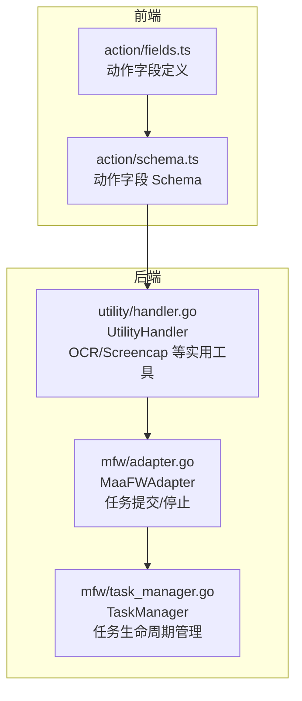
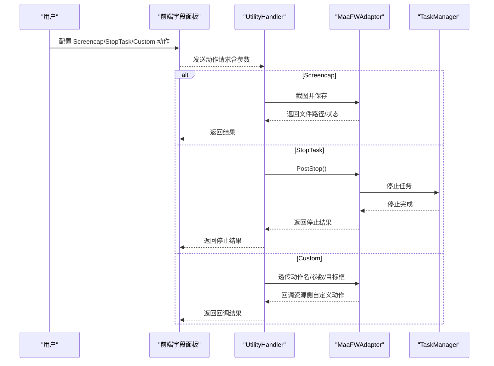
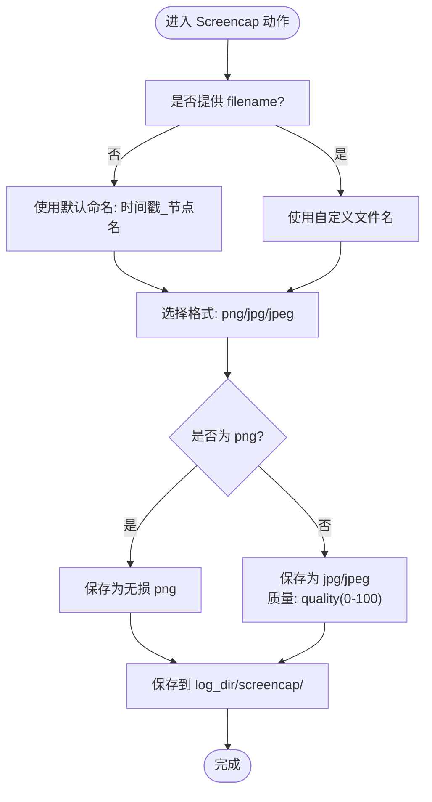
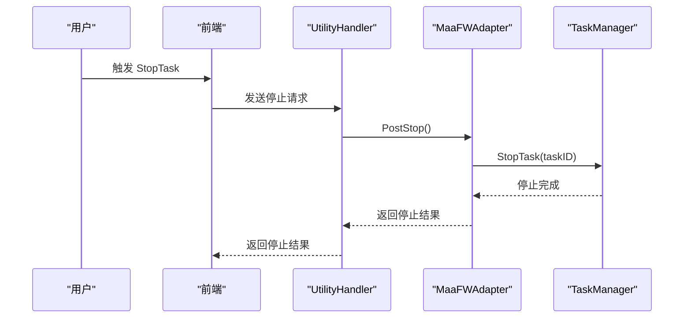
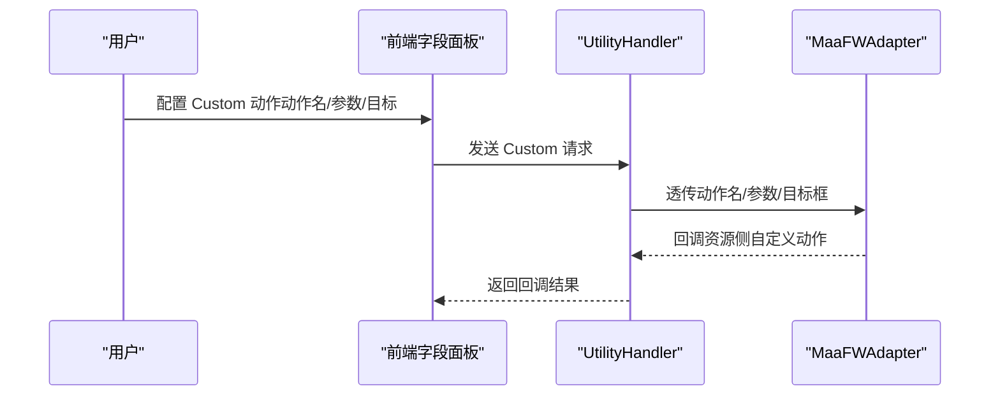
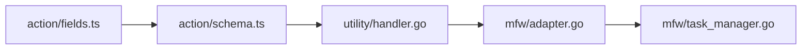

# 实用工具动作

<cite>
**本文引用的文件**
- [action/fields.ts](file://src/core/fields/action/fields.ts)
- [action/schema.ts](file://src/core/fields/action/schema.ts)
- [utility/handler.go](file://LocalBridge/internal/protocol/utility/handler.go)
- [mfw/task_manager.go](file://LocalBridge/internal/mfw/task_manager.go)
- [mfw/adapter.go](file://LocalBridge/internal/mfw/adapter.go)
- [README.md](file://README.md)
</cite>

## 目录
1. [简介](#简介)
2. [项目结构](#项目结构)
3. [核心组件](#核心组件)
4. [架构总览](#架构总览)
5. [详细组件分析](#详细组件分析)
6. [依赖关系分析](#依赖关系分析)
7. [性能考量](#性能考量)
8. [故障排查指南](#故障排查指南)
9. [结论](#结论)
10. [附录](#附录)

## 简介
本文件面向“实用工具动作”字段，系统性梳理以下动作的配置与行为要点：
- Screencap 截图保存：文件命名规则、格式选择、质量设置、存储路径等参数说明与使用建议
- DoNothing 空操作：占位与调试用途
- StopTask 任务停止：执行时机、影响范围与注意事项
- Custom 自定义动作：注册机制、回调参数传递、与资源系统的对接方式

同时给出工作流中的典型应用场景与组合使用技巧，帮助读者在实际自动化流程中高效、安全地使用这些动作。

## 项目结构
实用工具动作的前端字段定义位于前端核心字段模块，后端本地桥接（LocalBridge）负责与 MaaFramework 交互，包括任务控制与实用工具（如 OCR/Screencap）的处理。

图表来源
- [action/fields.ts:1-149](file://src/core/fields/action/fields.ts#L1-L149)
- [action/schema.ts:1-299](file://src/core/fields/action/schema.ts#L1-L299)
- [utility/handler.go:91-140](file://LocalBridge/internal/protocol/utility/handler.go#L91-L140)
- [mfw/adapter.go:427-443](file://LocalBridge/internal/mfw/adapter.go#L427-L443)
- [mfw/task_manager.go:68-90](file://LocalBridge/internal/mfw/task_manager.go#L68-L90)

章节来源
- [action/fields.ts:1-149](file://src/core/fields/action/fields.ts#L1-L149)
- [action/schema.ts:1-299](file://src/core/fields/action/schema.ts#L1-L299)
- [utility/handler.go:91-140](file://LocalBridge/internal/protocol/utility/handler.go#L91-L140)
- [mfw/adapter.go:427-443](file://LocalBridge/internal/mfw/adapter.go#L427-L443)
- [mfw/task_manager.go:68-90](file://LocalBridge/internal/mfw/task_manager.go#L68-L90)

## 核心组件
- Screencap 截图保存：通过 ScreencapFilename、ScreencapFormat、ScreencapQuality 参数控制文件名、格式与质量；描述明确指出截图保存在 log_dir/screencap/ 目录下。
- DoNothing 空操作：无参数，用于占位或临时禁用某节点。
- StopTask 任务停止：无参数，用于停止当前任务链（MaaTaskerPostTask 传入的单个任务链）。
- Custom 自定义动作：通过 customAction、customActionParam、customTarget、targetOffset 等参数，将动作名、参数与目标框传递给资源侧注册的自定义动作回调。

章节来源
- [action/fields.ts:8-29](file://src/core/fields/action/fields.ts#L8-L29)
- [action/schema.ts:244-291](file://src/core/fields/action/schema.ts#L244-L291)

## 架构总览
前端字段定义与 Schema 决定用户可配置项；后端 UtilityHandler 负责执行 OCR/Screencap 等实用工具；MaaFWAdapter 与 TaskManager 负责任务生命周期控制（提交、停止）。

图表来源
- [utility/handler.go:91-140](file://LocalBridge/internal/protocol/utility/handler.go#L91-L140)
- [mfw/adapter.go:427-443](file://LocalBridge/internal/mfw/adapter.go#L427-L443)
- [mfw/task_manager.go:68-90](file://LocalBridge/internal/mfw/task_manager.go#L68-L90)

## 详细组件分析

### Screencap 截图保存
- 文件命名规则
  - filename 字段为可选字符串；默认使用“时间戳_节点名”格式（由字段描述明确说明）。
  - 若显式指定 filename，则保存为指定名称（不含扩展名）。
- 格式选择
  - format 字段可选值为 png、jpg、jpeg；默认 png（无损）。
- 质量设置
  - quality 字段为 0-100 的整数，仅对 jpg/jpeg 有效；png 始终无损压缩，此字段对 png 无效。
  - 默认质量 80（对 jpg/jpeg 有效）。
- 存储路径
  - 描述明确指出截图保存在 log_dir/screencap/ 目录下。
- 典型用法
  - 用于记录关键步骤截图，便于后续人工复核或流程回溯。
  - 与识别节点配合，可形成“识别命中即截图”的策略，提高调试效率。

图表来源
- [action/schema.ts:244-264](file://src/core/fields/action/schema.ts#L244-L264)
- [action/fields.ts:136-143](file://src/core/fields/action/fields.ts#L136-L143)

章节来源
- [action/fields.ts:136-143](file://src/core/fields/action/fields.ts#L136-L143)
- [action/schema.ts:244-264](file://src/core/fields/action/schema.ts#L244-L264)

### DoNothing 空操作
- 无参数，用于占位或临时禁用某节点，不影响流程执行。
- 常用于：
  - 调试阶段临时屏蔽某一步骤
  - 作为流程占位，预留后续扩展空间

章节来源
- [action/fields.ts:8-11](file://src/core/fields/action/fields.ts#L8-L11)

### StopTask 任务停止
- 无参数，用于停止当前任务链（MaaTaskerPostTask 传入的单个任务链）。
- 执行时机与影响范围
  - 调用路径：UtilityHandler -> MaaFWAdapter.PostStop -> TaskManager.StopTask
  - 影响范围：仅停止当前任务链，不会影响其他并发任务
  - 并发场景：当存在多个任务链时，StopTask 仅作用于触发该动作的任务链
- 注意事项
  - 停止后任务状态更新为 Stopped
  - 若需要彻底释放资源，可结合 StopAll（停止所有任务并销毁 Tasker）

图表来源
- [mfw/adapter.go:427-443](file://LocalBridge/internal/mfw/adapter.go#L427-L443)
- [mfw/task_manager.go:68-90](file://LocalBridge/internal/mfw/task_manager.go#L68-L90)

章节来源
- [action/fields.ts:120-123](file://src/core/fields/action/fields.ts#L120-L123)
- [mfw/adapter.go:427-443](file://LocalBridge/internal/mfw/adapter.go#L427-L443)
- [mfw/task_manager.go:68-90](file://LocalBridge/internal/mfw/task_manager.go#L68-L90)

### Custom 自定义动作
- 参数说明
  - customAction：动作名，需与资源侧注册的自定义动作名一致
  - customActionParam：动作参数，任意类型，会通过回调传出
  - customTarget：目标位置，会通过回调 box 传出
  - targetOffset：在目标基础上的偏移
- 注册机制与回调
  - 动作名需与资源侧注册接口传入的识别器名一致
  - 回调参数包含：custom_action_name、custom_action_param、box（目标框）
- 典型用法
  - 将复杂或特定设备的操作封装为自定义动作，统一在工作流中调用
  - 通过 customActionParam 传递动态参数，提升复用性

图表来源
- [action/fields.ts:21-29](file://src/core/fields/action/fields.ts#L21-L29)
- [action/schema.ts:266-291](file://src/core/fields/action/schema.ts#L266-L291)
- [utility/handler.go:91-140](file://LocalBridge/internal/protocol/utility/handler.go#L91-L140)

章节来源
- [action/fields.ts:21-29](file://src/core/fields/action/fields.ts#L21-L29)
- [action/schema.ts:266-291](file://src/core/fields/action/schema.ts#L266-L291)

## 依赖关系分析
- 前端字段定义与 Schema
  - action/fields.ts 定义动作名称与描述
  - action/schema.ts 定义每个动作的参数类型、默认值、可选项与描述
- 后端处理
  - utility/handler.go 负责执行 OCR/Screencap 等实用工具，并将结果通过消息通道返回
  - mfw/adapter.go 提供任务提交与停止接口
  - mfw/task_manager.go 管理任务生命周期，支持单任务停止与全部停止

图表来源
- [action/fields.ts:1-149](file://src/core/fields/action/fields.ts#L1-L149)
- [action/schema.ts:1-299](file://src/core/fields/action/schema.ts#L1-L299)
- [utility/handler.go:91-140](file://LocalBridge/internal/protocol/utility/handler.go#L91-L140)
- [mfw/adapter.go:427-443](file://LocalBridge/internal/mfw/adapter.go#L427-L443)
- [mfw/task_manager.go:68-90](file://LocalBridge/internal/mfw/task_manager.go#L68-L90)

章节来源
- [action/fields.ts:1-149](file://src/core/fields/action/fields.ts#L1-L149)
- [action/schema.ts:1-299](file://src/core/fields/action/schema.ts#L1-L299)
- [utility/handler.go:91-140](file://LocalBridge/internal/protocol/utility/handler.go#L91-L140)
- [mfw/adapter.go:427-443](file://LocalBridge/internal/mfw/adapter.go#L427-L443)
- [mfw/task_manager.go:68-90](file://LocalBridge/internal/mfw/task_manager.go#L68-L90)

## 性能考量
- Screencap
  - png 无损但体积较大；jpg/jpeg 可通过 quality 控制体积与速度
  - 建议在高频截图场景优先考虑 jpg/jpeg，并根据网络/磁盘压力调整 quality
- StopTask
  - 停止操作为同步等待，避免在热循环中频繁触发
  - 对于批量任务，建议使用 StopAll 清理资源，防止资源泄漏
- Custom
  - 自定义动作应尽量短小、幂等，避免阻塞主线程
  - 参数传递建议精简，减少序列化/反序列化开销

## 故障排查指南
- 截图未生成或路径异常
  - 检查 ScreencapFilename 是否合法（不含非法字符）
  - 确认 log_dir/screencap/ 目录可写
  - 若使用自定义文件名，确保扩展名不在 filename 中指定
- 截图质量不符合预期
  - png 不受 quality 影响，如需有损压缩请选择 jpg/jpeg
  - 调整 quality 数值以平衡体积与清晰度
- StopTask 未生效
  - 确认触发 StopTask 的任务链 ID 正确
  - 检查是否存在其他任务链仍在运行
  - 如需彻底释放资源，使用 StopAll 并重新初始化 Tasker
- Custom 动作未执行
  - 确认动作名与资源侧注册名一致
  - 检查 customActionParam 与 customTarget 的类型与格式
  - 查看回调日志，确认资源侧是否正确接收并处理

章节来源
- [action/schema.ts:244-264](file://src/core/fields/action/schema.ts#L244-L264)
- [mfw/adapter.go:427-443](file://LocalBridge/internal/mfw/adapter.go#L427-L443)
- [mfw/task_manager.go:68-90](file://LocalBridge/internal/mfw/task_manager.go#L68-L90)

## 结论
- Screencap 提供灵活的命名、格式与质量控制，适合调试与归档
- DoNothing 作为占位动作，便于流程演进与调试
- StopTask 用于精确停止当前任务链，配合 StopAll 可清理资源
- Custom 将复杂动作抽象为可复用单元，提升工作流的可维护性与扩展性

## 附录
- 工作流应用场景与组合技巧
  - 调试流程：在关键节点插入 Screencap，结合 DoNothing 临时禁用某些步骤，逐步缩小问题范围
  - 任务中断：在条件满足时插入 StopTask，提前终止当前任务链，避免无效执行
  - 自定义封装：将设备特定操作封装为 Custom 动作，统一在工作流中调用，便于复用与升级
  - 资源清理：长时间运行的流程末尾使用 StopAll，确保资源被释放

章节来源
- [README.md:92-113](file://README.md#L92-L113)