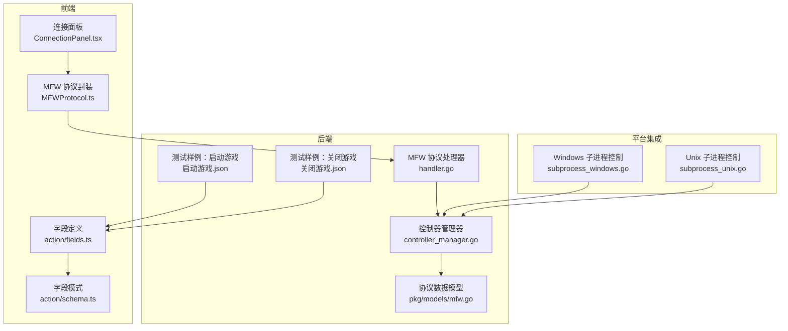
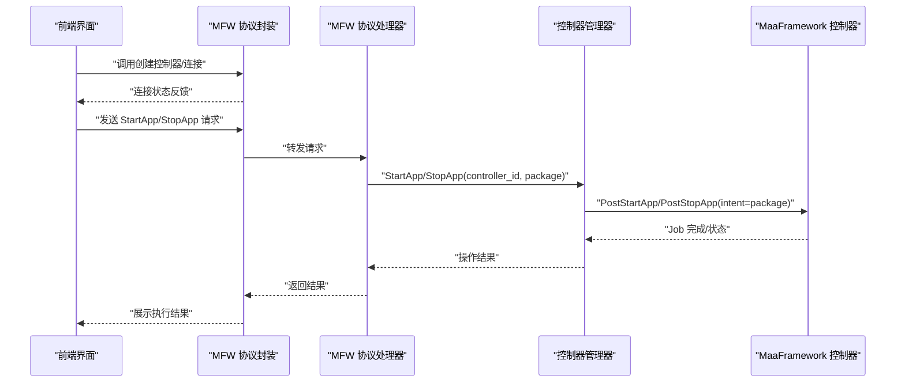
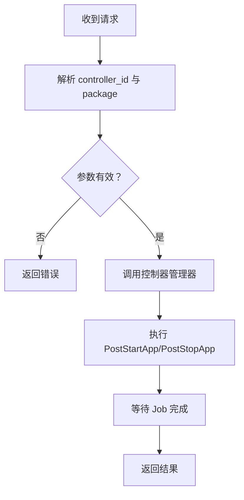
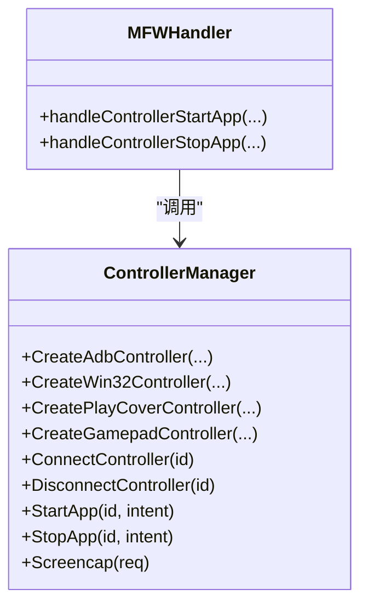
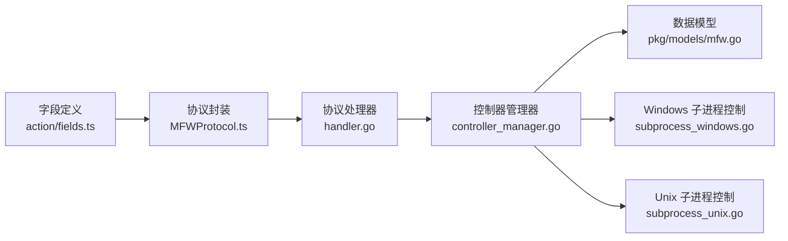

# 应用控制动作

<cite>
**本文档引用的文件**
- [action\fields.ts](file://src/core/fields/action/fields.ts)
- [action\schema.ts](file://src/core/fields/action/schema.ts)
- [handler.go](file://LocalBridge/internal/protocol/mfw/handler.go)
- [controller_manager.go](file://LocalBridge/internal/mfw/controller_manager.go)
- [mfw.go](file://LocalBridge/pkg/models/mfw.go)
- [启动游戏.json](file://LocalBridge/test-json/base/pipeline/日常任务/启动游戏.json)
- [关闭游戏.json](file://LocalBridge/test-json/base/pipeline/日常任务/关闭游戏.json)
- [MFWProtocol.ts](file://src/services/protocols/MFWProtocol.ts)
- [ConnectionPanel.tsx](file://src/components/panels/main/ConnectionPanel.tsx)
- [subprocess_windows.go](file://Extremer/internal/bridge/subprocess_windows.go)
- [subprocess_unix.go](file://Extremer/internal/bridge/subprocess_unix.go)
</cite>

## 目录
1. [简介](#简介)
2. [项目结构](#项目结构)
3. [核心组件](#核心组件)
4. [架构总览](#架构总览)
5. [详细组件分析](#详细组件分析)
6. [依赖分析](#依赖分析)
7. [性能考量](#性能考量)
8. [故障排查指南](#故障排查指南)
9. [结论](#结论)

## 简介
本文件围绕“应用控制动作”展开，重点覆盖以下内容：
- StartApp 启动应用与 StopApp 关闭应用的配置方法，包括 package 包名设置、应用标识符匹配、权限检查等
- 应用控制动作与不同操作系统和设备的集成方式，涵盖 Android 包管理、iOS 应用管理（通过 PlayCover）、PC 进程控制
- 应用生命周期管理的最佳实践，包括应用状态检查、启动等待、异常处理
- 应用控制动作的安全考虑与权限要求

## 项目结构
应用控制动作涉及前端字段定义、协议处理、后端控制器管理以及测试样例等多个层次。

**图表来源**
- [action\fields.ts:112-119](file://src/core/fields/action/fields.ts#L112-L119)
- [action\schema.ts:200-207](file://src/core/fields/action/schema.ts#L200-L207)
- [handler.go:448-486](file://LocalBridge/internal/protocol/mfw/handler.go#L448-L486)
- [controller_manager.go:444-514](file://LocalBridge/internal/mfw/controller_manager.go#L444-L514)
- [mfw.go:72-82](file://LocalBridge/pkg/models/mfw.go#L72-L82)
- [MFWProtocol.ts:329-384](file://src/services/protocols/MFWProtocol.ts#L329-L384)
- [ConnectionPanel.tsx:500-616](file://src/components/panels/main/ConnectionPanel.tsx#L500-L616)
- [subprocess_windows.go:10-25](file://Extremer/internal/bridge/subprocess_windows.go#L10-L25)
- [subprocess_unix.go:10-29](file://Extremer/internal/bridge/subprocess_unix.go#L10-L29)

**章节来源**
- [action\fields.ts:112-119](file://src/core/fields/action/fields.ts#L112-L119)
- [action\schema.ts:200-207](file://src/core/fields/action/schema.ts#L200-L207)
- [handler.go:448-486](file://LocalBridge/internal/protocol/mfw/handler.go#L448-L486)
- [controller_manager.go:444-514](file://LocalBridge/internal/mfw/controller_manager.go#L444-L514)
- [mfw.go:72-82](file://LocalBridge/pkg/models/mfw.go#L72-L82)
- [MFWProtocol.ts:329-384](file://src/services/protocols/MFWProtocol.ts#L329-L384)
- [ConnectionPanel.tsx:500-616](file://src/components/panels/main/ConnectionPanel.tsx#L500-L616)
- [subprocess_windows.go:10-25](file://Extremer/internal/bridge/subprocess_windows.go#L10-L25)
- [subprocess_unix.go:10-29](file://Extremer/internal/bridge/subprocess_unix.go#L10-L29)

## 核心组件
- 字段定义与模式
  - StartApp/StopApp 在字段定义中声明为“启动 App/关闭 App”，参数为必填的 package 字段
  - package 字段描述支持包名或 Activity，如 com.example.app 或 com.example.app/com.example.MainActivity
- 协议处理
  - MFW 协议处理器接收 controller_start_app/controller_stop_app 请求，解析 controller_id 与 package，并调用控制器管理器执行
- 控制器管理
  - 控制器管理器根据 controller_id 获取控制器实例，校验连接状态后调用 PostStartApp/PostStopApp 执行应用控制
- 数据模型
  - 协议数据模型中定义了 StartApp/StopApp 请求结构，包含 controller_id 与 intent（即 package）

**章节来源**
- [action\fields.ts:112-119](file://src/core/fields/action/fields.ts#L112-L119)
- [action\schema.ts:200-207](file://src/core/fields/action/schema.ts#L200-L207)
- [handler.go:448-486](file://LocalBridge/internal/protocol/mfw/handler.go#L448-L486)
- [controller_manager.go:444-514](file://LocalBridge/internal/mfw/controller_manager.go#L444-L514)
- [mfw.go:72-82](file://LocalBridge/pkg/models/mfw.go#L72-L82)

## 架构总览
应用控制动作的端到端流程如下：

**图表来源**
- [MFWProtocol.ts:329-384](file://src/services/protocols/MFWProtocol.ts#L329-L384)
- [handler.go:448-486](file://LocalBridge/internal/protocol/mfw/handler.go#L448-L486)
- [controller_manager.go:444-514](file://LocalBridge/internal/mfw/controller_manager.go#L444-L514)

## 详细组件分析

### 字段与参数配置
- StartApp/StopApp 字段
  - 类型：StartApp/StopApp
  - 参数：package（字符串，必填）
  - 描述：启动/关闭应用
- package 字段模式
  - key: package
  - 类型：字符串
  - 必填：是
  - 默认值：空字符串
  - 描述：启动入口。需要填入 package name 或 activity，例如 com.hypergryph.arknights 或 com.hypergryph.arknights/com.u8.sdk.U8UnityContext

最佳实践
- 优先使用包名；若需指定 Activity，使用“包名/Activity类名”的形式
- 在测试样例中可见，package 字段直接传入包名字符串

**章节来源**
- [action\fields.ts:112-119](file://src/core/fields/action/fields.ts#L112-L119)
- [action\schema.ts:200-207](file://src/core/fields/action/schema.ts#L200-L207)
- [启动游戏.json:62-66](file://LocalBridge/test-json/base/pipeline/日常任务/启动游戏.json#L62-L66)
- [关闭游戏.json:24-28](file://LocalBridge/test-json/base/pipeline/日常任务/关闭游戏.json#L24-L28)

### 协议处理流程
- StartApp/StopApp 请求路由
  - /etl/mfw/controller_start_app
  - /etl/mfw/controller_stop_app
- 请求解析
  - 读取 controller_id 与 package
  - 调用控制器管理器执行操作
- 结果返回
  - 成功：返回操作结果
  - 失败：返回错误码与错误信息

**图表来源**
- [handler.go:448-486](file://LocalBridge/internal/protocol/mfw/handler.go#L448-L486)

**章节来源**
- [handler.go:448-486](file://LocalBridge/internal/protocol/mfw/handler.go#L448-L486)

### 控制器管理与平台集成
- 控制器类型
  - ADB 控制器：用于 Android 设备
  - Win32 控制器：用于 Windows 窗口
  - PlayCover 控制器：用于 macOS 上运行的 iOS 应用
  - Gamepad 控制器：用于手柄输入
- 控制器管理器职责
  - 创建控制器
  - 连接/断开控制器
  - 执行应用控制（StartApp/StopApp）
  - 截图、点击、滑动、输入文本等通用操作
- 应用控制实现
  - StartApp：调用 ctrl.PostStartApp(intent=package)，等待 Job 完成
  - StopApp：调用 ctrl.PostStopApp(intent=package)，等待 Job 完成

**图表来源**
- [controller_manager.go:34-247](file://LocalBridge/internal/mfw/controller_manager.go#L34-L247)
- [controller_manager.go:444-514](file://LocalBridge/internal/mfw/controller_manager.go#L444-L514)
- [handler.go:448-486](file://LocalBridge/internal/protocol/mfw/handler.go#L448-L486)

**章节来源**
- [controller_manager.go:34-247](file://LocalBridge/internal/mfw/controller_manager.go#L34-L247)
- [controller_manager.go:444-514](file://LocalBridge/internal/mfw/controller_manager.go#L444-L514)
- [handler.go:448-486](file://LocalBridge/internal/protocol/mfw/handler.go#L448-L486)

### 测试样例与使用场景
- 启动游戏样例
  - StartApp 节点使用 package 字段指定应用包名
  - 配合识别节点实现启动后的状态判断
- 关闭游戏样例
  - StopApp 节点使用 package 字段指定应用包名
  - 用于结束后台残留进程或回到桌面

**章节来源**
- [启动游戏.json:62-66](file://LocalBridge/test-json/base/pipeline/日常任务/启动游戏.json#L62-L66)
- [关闭游戏.json:24-28](file://LocalBridge/test-json/base/pipeline/日常任务/关闭游戏.json#L24-L28)

### 权限与安全考虑
- Win32 控制权限
  - 大多数 Win32 控制需要以管理员模式启动后端或客户端，特别是对系统级应用或需要提升权限的应用进行控制时
  - 若连接失败或控制无响应，建议以管理员身份重新启动
- MaaFramework 库路径
  - 服务未初始化时会提示设置 MaaFramework 库路径，需运行相应命令配置后重启服务
- 安全检查
  - 配置模块提供根目录安全性检查，检测是否位于高风险系统目录内并给出建议

**章节来源**
- [ConnectionPanel.tsx:503-509](file://src/components/panels/main/ConnectionPanel.tsx#L503-L509)
- [handler.go:33-41](file://LocalBridge/internal/protocol/mfw/handler.go#L33-L41)
- [config.go:234-296](file://LocalBridge/internal/config/config.go#L234-L296)

## 依赖分析
应用控制动作的关键依赖关系如下：

**图表来源**
- [action\fields.ts:112-119](file://src/core/fields/action/fields.ts#L112-L119)
- [MFWProtocol.ts:329-384](file://src/services/protocols/MFWProtocol.ts#L329-L384)
- [handler.go:448-486](file://LocalBridge/internal/protocol/mfw/handler.go#L448-L486)
- [controller_manager.go:444-514](file://LocalBridge/internal/mfw/controller_manager.go#L444-L514)
- [mfw.go:72-82](file://LocalBridge/pkg/models/mfw.go#L72-L82)
- [subprocess_windows.go:10-25](file://Extremer/internal/bridge/subprocess_windows.go#L10-L25)
- [subprocess_unix.go:10-29](file://Extremer/internal/bridge/subprocess_unix.go#L10-L29)

**章节来源**
- [action\fields.ts:112-119](file://src/core/fields/action/fields.ts#L112-L119)
- [MFWProtocol.ts:329-384](file://src/services/protocols/MFWProtocol.ts#L329-L384)
- [handler.go:448-486](file://LocalBridge/internal/protocol/mfw/handler.go#L448-L486)
- [controller_manager.go:444-514](file://LocalBridge/internal/mfw/controller_manager.go#L444-L514)
- [mfw.go:72-82](file://LocalBridge/pkg/models/mfw.go#L72-L82)
- [subprocess_windows.go:10-25](file://Extremer/internal/bridge/subprocess_windows.go#L10-L25)
- [subprocess_unix.go:10-29](file://Extremer/internal/bridge/subprocess_unix.go#L10-L29)

## 性能考量
- 启动等待与阻塞
  - 控制器管理器在执行应用控制后会等待 Job 完成，这保证了操作的原子性，但也会带来一定的阻塞时间
  - 建议在流水线中合理安排后续节点，避免不必要的重复等待
- 连接超时
  - 控制器连接过程包含超时机制，超时会导致连接失败，需在 UI 层提示并允许重试
- 截图与资源占用
  - 截图操作会占用 CPU 和内存，建议在需要时再触发截图，避免频繁截图导致性能下降

## 故障排查指南
常见问题与解决方法
- 无法连接设备
  - 可能原因：MaaFramework 路径未配置、ADB 设备未启动或连接异常、Win32 窗口已关闭
  - 解决方法：运行配置命令重新设置库路径；重启模拟器或检查 ADB 连接；确保目标窗口正常运行
- 截图失败或黑屏
  - 可能原因：设备未正确连接、模拟器不支持当前截图方式
  - 解决方法：断开并重新连接设备；对于 ADB 设备，确保模拟器支持全输出模式；对于 Win32 窗口，确保窗口未最小化
- Win32 控制无响应
  - 可能原因：权限不足
  - 解决方法：以管理员身份启动后端或客户端

**章节来源**
- [字段快捷工具.md:304-348](file://docsite/docs/01.指南/20.本地服务/20.字段快捷工具.md#L304-L348)
- [ConnectionPanel.tsx:503-509](file://src/components/panels/main/ConnectionPanel.tsx#L503-L509)

## 结论
- StartApp/StopApp 通过 package 字段实现跨平台应用控制，前端字段定义与后端协议处理形成闭环
- 控制器管理器统一调度不同平台的控制器，确保操作一致性
- 在 Win32 平台下需关注权限问题，且应以管理员模式运行以获得最佳兼容性
- 建议在流水线中结合识别节点进行应用状态检查，并在必要时增加超时与重试策略