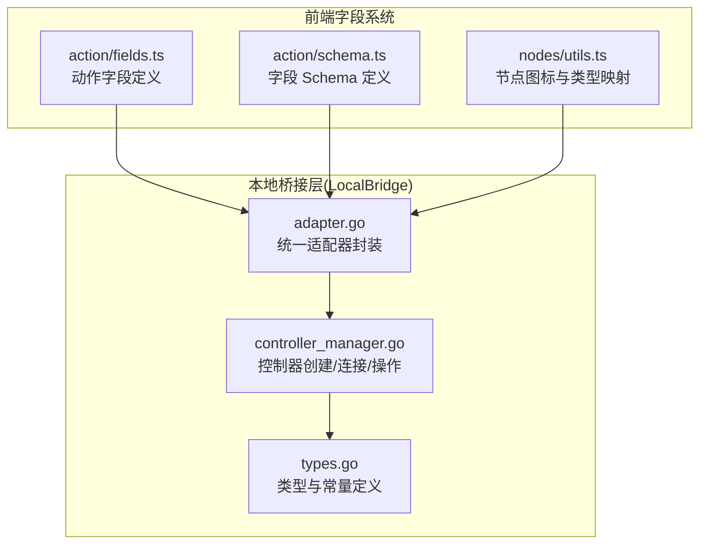
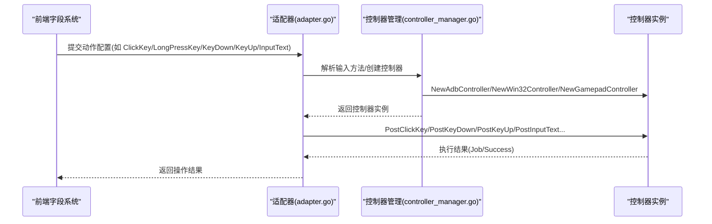
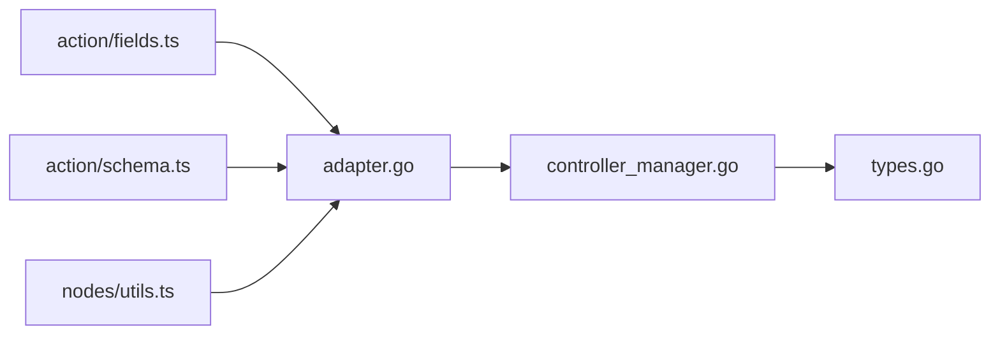

# 按键和输入动作

<cite>
**本文引用的文件**
- [action/fields.ts](file://src/core/fields/action/fields.ts)
- [action/schema.ts](file://src/core/fields/action/schema.ts)
- [nodes/utils.ts](file://src/components/flow/nodes/utils.ts)
- [controller_manager.go](file://LocalBridge/internal/mfw/controller_manager.go)
- [adapter.go](file://LocalBridge/internal/mfw/adapter.go)
- [types.go](file://LocalBridge/internal/mfw/types.go)
</cite>

## 目录
1. [简介](#简介)
2. [项目结构](#项目结构)
3. [核心组件](#核心组件)
4. [架构总览](#架构总览)
5. [详细组件分析](#详细组件分析)
6. [依赖分析](#依赖分析)
7. [性能考虑](#性能考虑)
8. [故障排查指南](#故障排查指南)
9. [结论](#结论)

## 简介
本章节面向“按键和输入动作”字段的使用者与维护者，系统化说明以下内容：
- ClickKey 单击按键、LongPressKey 长按按键、KeyDown 按键按下、KeyUp 按键松开等按键操作的配置方法与语义差异
- Key 与 ClickKey 的区别及其废弃原因
- InputText 文本输入的字符编码、特殊字符处理、输入法兼容性要点
- 按键动作与不同控制器（Win32 键盘、ADB 按键、游戏手柄）的兼容性
- 按键输入动作的组合使用技巧与时序控制方法

## 项目结构
按键与输入动作的定义位于前端字段系统，控制器与输入方法的解析与桥接位于本地服务（LocalBridge）侧。整体关系如下：

图表来源
- [action/fields.ts:53-147](file://src/core/fields/action/fields.ts#L53-L147)
- [action/schema.ts:168-198](file://src/core/fields/action/schema.ts#L168-L198)
- [nodes/utils.ts:43-88](file://src/components/flow/nodes/utils.ts#L43-L88)
- [controller_manager.go:33-75](file://LocalBridge/internal/mfw/controller_manager.go#L33-L75)
- [adapter.go:63-118](file://LocalBridge/internal/mfw/adapter.go#L63-L118)
- [types.go:92-124](file://LocalBridge/internal/mfw/types.go#L92-L124)

章节来源
- [action/fields.ts:53-147](file://src/core/fields/action/fields.ts#L53-L147)
- [action/schema.ts:168-198](file://src/core/fields/action/schema.ts#L168-L198)
- [nodes/utils.ts:43-88](file://src/components/flow/nodes/utils.ts#L43-L88)
- [controller_manager.go:33-75](file://LocalBridge/internal/mfw/controller_manager.go#L33-L75)
- [adapter.go:63-118](file://LocalBridge/internal/mfw/adapter.go#L63-L118)
- [types.go:92-124](file://LocalBridge/internal/mfw/types.go#L92-L124)

## 核心组件
- 动作字段定义：集中于动作字段表，包含 ClickKey、LongPressKey、KeyDown、KeyUp、InputText 等。
- 字段 Schema：定义每个动作字段的键名、类型、默认值、步进、是否必填、描述等。
- 控制器适配：LocalBridge 侧负责解析输入方法、创建控制器、执行按键/文本操作，并返回结果。

章节来源
- [action/fields.ts:53-147](file://src/core/fields/action/fields.ts#L53-L147)
- [action/schema.ts:168-198](file://src/core/fields/action/schema.ts#L168-L198)
- [controller_manager.go:33-75](file://LocalBridge/internal/mfw/controller_manager.go#L33-L75)
- [adapter.go:63-118](file://LocalBridge/internal/mfw/adapter.go#L63-L118)

## 架构总览
按键与输入动作的执行链路如下：
- 前端字段系统定义动作与字段 Schema
- LocalBridge 适配器根据控制器类型选择合适的输入方法
- 控制器执行具体按键/文本操作，返回执行结果

图表来源
- [adapter.go:63-118](file://LocalBridge/internal/mfw/adapter.go#L63-L118)
- [controller_manager.go:33-75](file://LocalBridge/internal/mfw/controller_manager.go#L33-L75)
- [controller_manager.go:775-800](file://LocalBridge/internal/mfw/controller_manager.go#L775-L800)
- [types.go:92-124](file://LocalBridge/internal/mfw/types.go#L92-L124)

## 详细组件分析

### 动作字段与配置要点
- ClickKey 单击按键
  - 字段键名与类型：key 为整数或整数列表，必填
  - 描述：单击按键
- LongPressKey 长按按键
  - 字段键名与类型：key 为整数，duration 为整数（毫秒），必填
  - 描述：长按按键
- KeyDown 按键按下
  - 字段键名与类型：key 为整数
  - 描述：按下按键但不立即松开；可与 KeyUp 配合实现自定义按键时序
- KeyUp 按键松开
  - 字段键名与类型：key 为整数
  - 描述：松开按键；用于结束 KeyDown 建立的按键状态
- InputText 文本输入
  - 字段键名与类型：input_text 为字符串，必填
  - 描述：输入文本；部分控制器仅支持 ASCII

章节来源
- [action/fields.ts:53-147](file://src/core/fields/action/fields.ts#L53-L147)
- [action/schema.ts:168-198](file://src/core/fields/action/schema.ts#L168-L198)

### Key 与 ClickKey 的区别与废弃原因
- Key 动作在 4.5 版本中被标记为废弃，保留兼容性，推荐使用 ClickKey 替代
- 二者均通过 key 字段指定虚拟按键码，但 ClickKey 更明确地表达“单击”的语义，便于理解与维护

章节来源
- [action/fields.ts:144-147](file://src/core/fields/action/fields.ts#L144-L147)

### 字段 Schema 详解
- ClickKey
  - key: 整数或整数列表，必填
  - 说明：仅支持对应控制器的虚拟按键码
- LongPressKey
  - key: 整数，必填
  - duration: 整数（毫秒），默认 1000
- InputText
  - input_text: 字符串，必填
  - 说明：部分控制器仅支持 ASCII

章节来源
- [action/schema.ts:168-198](file://src/core/fields/action/schema.ts#L168-L198)

### 控制器与输入方法兼容性
- ADB 控制器
  - 输入方法解析：支持多输入方法叠加（按位或）
  - 支持按键与文本输入：ClickKey、LongPressKey、KeyDown、KeyUp、InputText
- Win32 控制器
  - 输入方法解析：支持多种消息派发方式（含带光标位置与阻塞输入的变体）
  - 支持按键与文本输入：ClickKey、LongPressKey、KeyDown、KeyUp、InputText
- 游戏手柄控制器
  - 支持手柄按键点击（ClickKey）、触控（TouchDown/Move/Up）等
  - 支持手柄类型：Xbox360、DualShock4

章节来源
- [controller_manager.go:33-75](file://LocalBridge/internal/mfw/controller_manager.go#L33-L75)
- [controller_manager.go:106-162](file://LocalBridge/internal/mfw/controller_manager.go#L106-L162)
- [controller_manager.go:194-247](file://LocalBridge/internal/mfw/controller_manager.go#L194-L247)
- [adapter.go:63-118](file://LocalBridge/internal/mfw/adapter.go#L63-L118)
- [adapter.go:120-167](file://LocalBridge/internal/mfw/adapter.go#L120-L167)

### 文本输入与字符编码、特殊字符处理、输入法兼容性
- InputText 字段描述明确指出“部分控制器仅支持 ASCII”，因此在跨平台/跨控制器场景下应避免使用非 ASCII 字符
- 特殊字符处理与输入法兼容性由底层控制器与系统输入法共同决定，前端字段仅负责传递字符串
- 若需输入复杂字符，建议：
  - 在目标环境中确保输入法可用
  - 优先使用 ASCII 字符集，必要时分步输入或使用系统原生输入法

章节来源
- [action/schema.ts:192-198](file://src/core/fields/action/schema.ts#L192-L198)

### 按键动作组合与时序控制
- KeyDown + KeyUp 组合
  - 通过 KeyDown 建立按键状态，随后通过 KeyUp 松开，可实现自定义时序
  - 适用于需要精确控制按键持续时间的场景
- ClickKey 与 LongPressKey
  - ClickKey 适合短促单击
  - LongPressKey 适合长按，可通过 duration 参数调整时长
- 时序控制建议
  - 明确各动作之间的等待与间隔
  - 对于需要稳定性的场景，建议在节点间插入必要的等待或确认动作

章节来源
- [action/fields.ts:93-107](file://src/core/fields/action/fields.ts#L93-L107)
- [action/schema.ts:183-189](file://src/core/fields/action/schema.ts#L183-L189)

### 前端图标与类型映射
- 前端节点图标根据动作类型映射到特定图标，便于可视化识别
- 包含 ClickKey、LongPressKey、KeyDown、KeyUp、InputText 等类型的图标配置

章节来源
- [nodes/utils.ts:43-88](file://src/components/flow/nodes/utils.ts#L43-L88)

## 依赖分析
- 前端字段系统依赖 LocalBridge 的控制器能力
- LocalBridge 通过适配器封装控制器创建与操作，屏蔽不同控制器的差异
- 控制器内部根据输入方法解析策略执行具体输入

图表来源
- [action/fields.ts:53-147](file://src/core/fields/action/fields.ts#L53-L147)
- [action/schema.ts:168-198](file://src/core/fields/action/schema.ts#L168-L198)
- [nodes/utils.ts:43-88](file://src/components/flow/nodes/utils.ts#L43-L88)
- [adapter.go:63-118](file://LocalBridge/internal/mfw/adapter.go#L63-L118)
- [controller_manager.go:33-75](file://LocalBridge/internal/mfw/controller_manager.go#L33-L75)
- [types.go:92-124](file://LocalBridge/internal/mfw/types.go#L92-L124)

## 性能考虑
- 控制器连接与操作采用异步 Job 模式，前端可等待或继续后续任务
- 截图与输入操作均通过 Job 管理，避免阻塞主线程
- 对于高频按键/文本输入，建议合并动作或减少不必要的等待

## 故障排查指南
- 控制器未连接
  - 现象：操作返回失败或连接超时
  - 排查：确认控制器已创建并连接成功；检查连接超时与状态
- 输入方法不匹配
  - 现象：按键/文本输入无效
  - 排查：确认所选输入方法与目标环境兼容；ADB/Win32 的输入方法解析是否正确
- 字符集限制
  - 现象：非 ASCII 字符无法输入
  - 排查：改用 ASCII 字符或在目标环境中启用相应输入法
- 手柄驱动问题
  - 现象：创建手柄控制器失败
  - 排查：确认 ViGEm 驱动已安装；检查手柄类型与截图方法配置

章节来源
- [controller_manager.go:250-300](file://LocalBridge/internal/mfw/controller_manager.go#L250-L300)
- [controller_manager.go:408-442](file://LocalBridge/internal/mfw/controller_manager.go#L408-L442)
- [controller_manager.go:227-230](file://LocalBridge/internal/mfw/controller_manager.go#L227-L230)

## 结论
- ClickKey/LongPressKey/KeyDown/KeyUp/InputText 是按键与文本输入的核心动作
- Key 已废弃，建议统一使用 ClickKey
- 不同控制器对输入的支持存在差异，需结合输入方法与字符集限制合理配置
- 通过 KeyDown/KeyUp 组合可实现精细时序控制，提升自动化稳定性