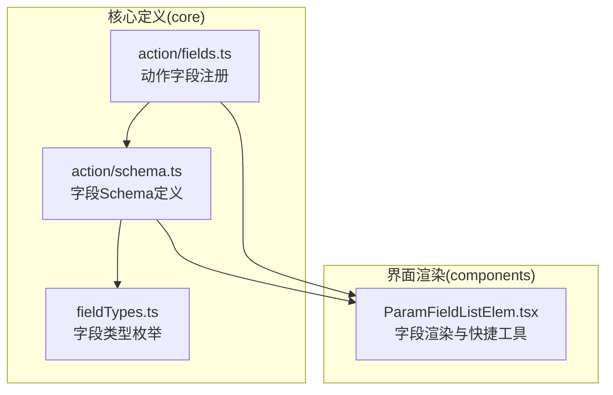
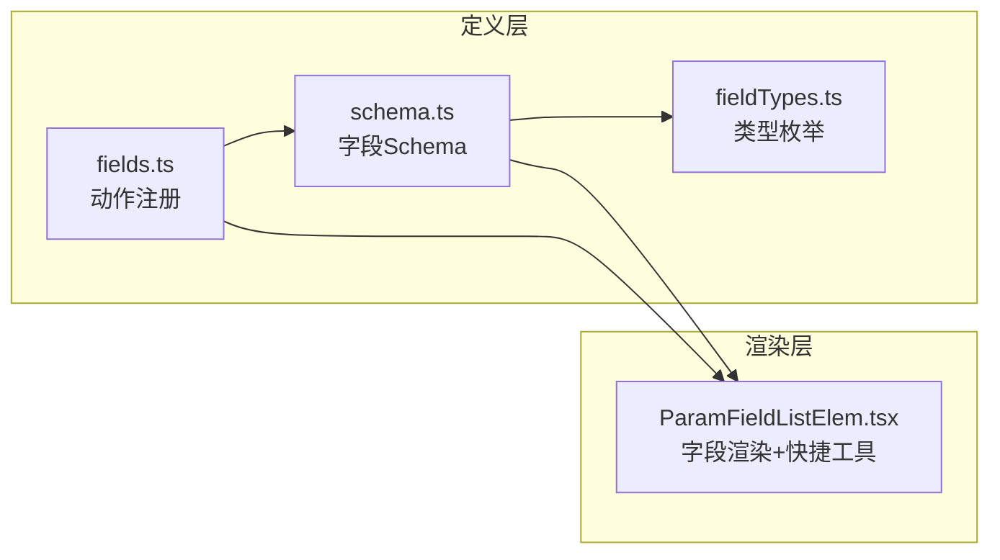
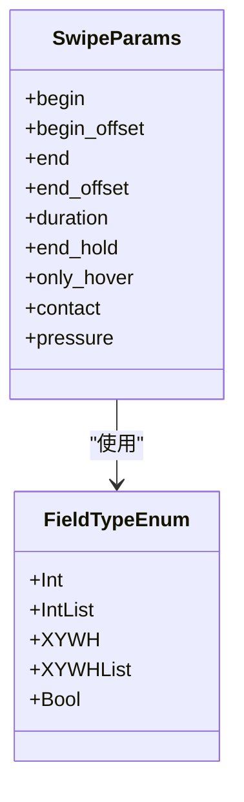
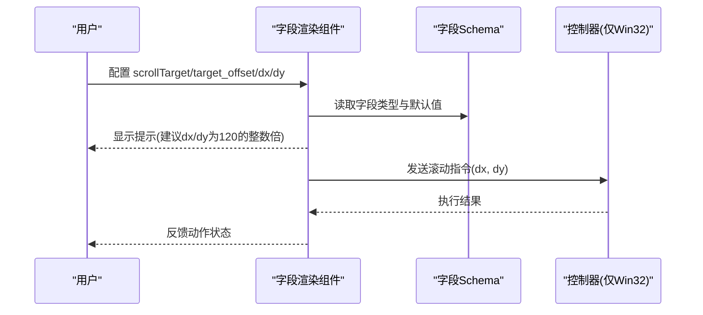
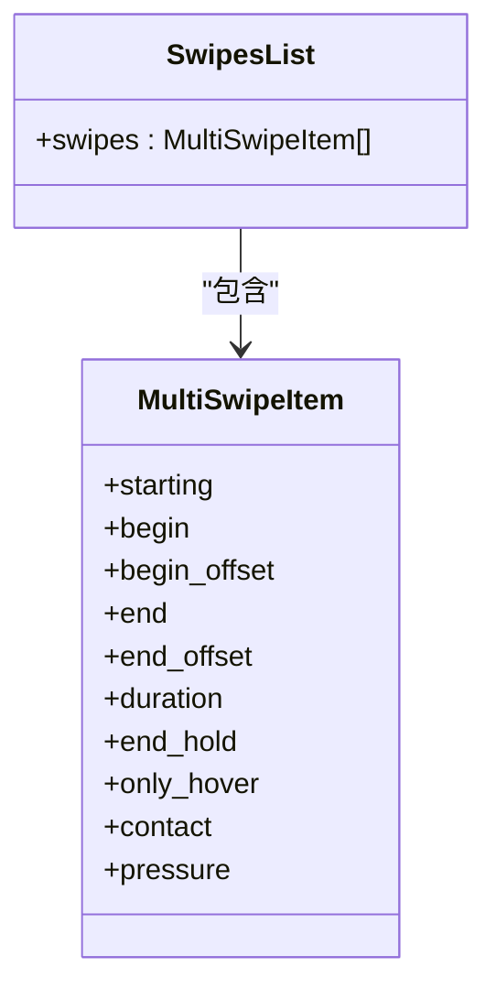
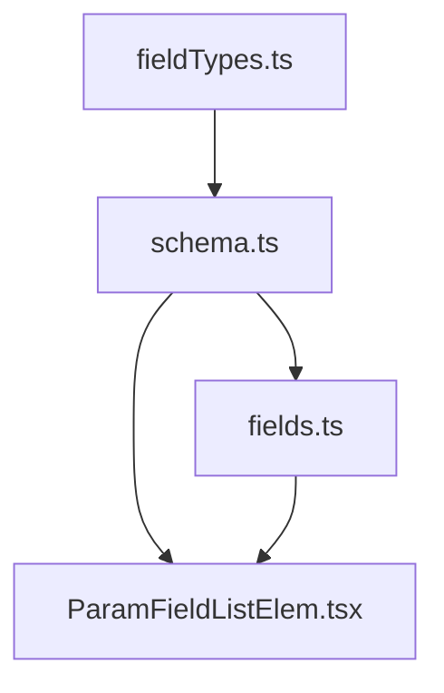

# 滑动和滚动动作

<cite>
**本文引用的文件**
- [fields.ts](file://src/core/fields/action/fields.ts)
- [schema.ts](file://src/core/fields/action/schema.ts)
- [fieldTypes.ts](file://src/core/fields/fieldTypes.ts)
- [ParamFieldListElem.tsx](file://src/components/panels/field/items/ParamFieldListElem.tsx)
- [启动游戏.json](file://LocalBridge/test-json/base/pipeline/日常任务/启动游戏.json)
</cite>

## 目录
1. [简介](#简介)
2. [项目结构](#项目结构)
3. [核心组件](#核心组件)
4. [架构总览](#架构总览)
5. [详细组件分析](#详细组件分析)
6. [依赖关系分析](#依赖关系分析)
7. [性能考量](#性能考量)
8. [故障排查指南](#故障排查指南)
9. [结论](#结论)
10. [附录](#附录)

## 简介
本技术文档围绕“滑动”和“滚动”两类动作字段展开，系统化说明以下内容：
- Swipe（线性滑动）的复杂参数配置：起始点、起始偏移、终点、终点偏移、持续时间、结束停留、悬停模式、接触面、压力等。
- Scroll（鼠标滚轮滚动）的 dx/dy 参数设置与 WHEEL_DELTA 标准值。
- MultiSwipe（多指滑动）的配置方式与应用场景。
- 滑动动作的时间控制、轨迹计算、设备兼容性差异。
- 调试技巧与性能优化建议。

## 项目结构
本仓库前端采用 React + TypeScript 构建，动作字段的定义与 UI 渲染分离：
- 字段定义与类型：位于 core 层，统一描述每个动作的参数键、类型、默认值与说明。
- UI 渲染：位于 components 层，根据字段类型动态生成输入控件，并提供快捷工具（如 ROI、偏移测量、OCR、模板截图、颜色取点、位移差值）辅助配置。

图表来源
- [fields.ts:1-90](file://src/core/fields/action/fields.ts#L1-L90)
- [schema.ts:1-299](file://src/core/fields/action/schema.ts#L1-L299)
- [fieldTypes.ts:1-27](file://src/core/fields/fieldTypes.ts#L1-L27)
- [ParamFieldListElem.tsx:1-200](file://src/components/panels/field/items/ParamFieldListElem.tsx#L1-L200)

章节来源
- [fields.ts:1-90](file://src/core/fields/action/fields.ts#L1-L90)
- [schema.ts:1-299](file://src/core/fields/action/schema.ts#L1-L299)
- [fieldTypes.ts:1-27](file://src/core/fields/fieldTypes.ts#L1-L27)
- [ParamFieldListElem.tsx:1-200](file://src/components/panels/field/items/ParamFieldListElem.tsx#L1-L200)

## 核心组件
- 动作字段注册：集中声明各动作及其参数集合，明确每个动作的可用字段与描述。
- 字段 Schema：定义每个参数的键名、类型、默认值、步进、是否必填以及详细说明。
- 字段类型枚举：统一约束参数的数据形态（如整数、整数列表、二维/四维坐标、对象列表等）。
- 字段渲染组件：根据字段类型生成输入控件，并提供快捷工具辅助定位与测量。

章节来源
- [fields.ts:7-90](file://src/core/fields/action/fields.ts#L7-L90)
- [schema.ts:47-138](file://src/core/fields/action/schema.ts#L47-L138)
- [fieldTypes.ts:4-26](file://src/core/fields/fieldTypes.ts#L4-L26)
- [ParamFieldListElem.tsx:500-700](file://src/components/panels/field/items/ParamFieldListElem.tsx#L500-L700)

## 架构总览
下图展示“滑动/滚动/MultiSwipe”三类动作在定义层与渲染层的交互关系：

图表来源
- [fields.ts:1-90](file://src/core/fields/action/fields.ts#L1-L90)
- [schema.ts:1-299](file://src/core/fields/action/schema.ts#L1-L299)
- [fieldTypes.ts:1-27](file://src/core/fields/fieldTypes.ts#L1-L27)
- [ParamFieldListElem.tsx:1-200](file://src/components/panels/field/items/ParamFieldListElem.tsx#L1-L200)

## 详细组件分析

### Swipe（线性滑动）
- 参数要点
  - 起始点 begin：支持 true（引用自身识别结果）、节点名字符串、固定坐标点或固定区域（四元组）。
  - 起始偏移 begin_offset：在 begin 基础上的额外偏移，四元组逐项相加。
  - 终点 end：支持单点或多点列表（v4.5.x 新增），用于一次性折线滑动，避免多次 swipe 抬手。
  - 终点偏移 end_offset：与 end 对应的偏移，可为单个或与 end 对应的列表。
  - 持续时间 duration：整数或整数列表，单位毫秒；用于控制滑动总时长。
  - 结束停留 end_hold：到达终点后额外等待再抬起，单位毫秒。
  - 悬停模式 only_hover：仅移动不按下/抬起，常用于鼠标悬停。
  - 接触面 contact：触点编号，ADB 控制器表示手指编号，Win32 控制器表示鼠标按键编号。
  - 压力 pressure：触控压力，范围取决于控制器实现。
- 时间控制与轨迹
  - 持续时间与结束停留共同决定滑动过程的时序与终点状态。
  - 多终点列表可形成折线轨迹，减少抬手次数，提升连贯性。
- 设备兼容性
  - 滚轮滚动 Scroll 仅 Win32 控制器支持，ADB/PlayCover 不支持。
  - MultiSwipe 在多触点场景下需合理分配 contact 编号，避免冲突。

章节来源
- [fields.ts:30-43](file://src/core/fields/action/fields.ts#L30-L43)
- [schema.ts:48-102](file://src/core/fields/action/schema.ts#L48-L102)
- [fieldTypes.ts:4-26](file://src/core/fields/fieldTypes.ts#L4-L26)

#### 类图：Swipe 参数与类型

图表来源
- [schema.ts:48-102](file://src/core/fields/action/schema.ts#L48-L102)
- [fieldTypes.ts:4-26](file://src/core/fields/fieldTypes.ts#L4-L26)

### Scroll（鼠标滚轮滚动）
- 参数要点
  - 目标位置 scrollTarget 与 scrollTargetOffset：先移动到目标位置再滚动。
  - dx/dy：水平/垂直滚动距离，正负分别代表方向；建议使用 WHEEL_DELTA（Windows 标准滚轮每格增量为 120）的整数倍，以获得最佳兼容性。
- 兼容性
  - 仅 Win32 控制器支持；ADB 与 PlayCover 控制器不支持滚动操作。

章节来源
- [fields.ts:44-52](file://src/core/fields/action/fields.ts#L44-L52)
- [schema.ts:103-131](file://src/core/fields/action/schema.ts#L103-L131)

#### 序列图：Scroll 参数生效流程

图表来源
- [schema.ts:103-131](file://src/core/fields/action/schema.ts#L103-L131)
- [fields.ts:44-52](file://src/core/fields/action/fields.ts#L44-L52)

### MultiSwipe（多指滑动）
- 参数要点
  - swipes：对象列表，每个对象包含：
    - starting：该滑动在本动作中的起始时间（毫秒），数组元素顺序不影响执行，按 starting 排序。
    - begin/begin_offset/end/end_offset/duration/end_hold/only_hover/contact/pressure：与 Swipe 对应字段一致。
  - contact 编号规则：当 contact 为 0 时，将使用该滑动在数组中的索引作为触点编号，便于多指并行。
- 应用场景
  - 多指缩放、旋转、多点拖拽等复合手势。
  - 多触点同时发起的滑动序列，减少抬手带来的中断感。

章节来源
- [fields.ts:67-70](file://src/core/fields/action/fields.ts#L67-L70)
- [schema.ts:132-138](file://src/core/fields/action/schema.ts#L132-L138)
- [fieldTypes.ts](file://src/core/fields/fieldTypes.ts#L21)

#### 类图：MultiSwipe 结构

图表来源
- [schema.ts:132-138](file://src/core/fields/action/schema.ts#L132-L138)

### 字段渲染与快捷工具
- 渲染逻辑
  - 根据字段类型生成输入控件：整数、浮点数、布尔、字符串、列表、对象列表等。
  - 提供快捷工具：ROI 区域选择、偏移测量、OCR、模板截图、颜色取点、位移差值等，辅助定位 begin/end 与 dx/dy。
- 示例
  - 在示例 JSON 中可见 Swipe 的 begin 与 end 使用了固定坐标点与列表形式，体现 v4.5.x 对多终点的支持。

章节来源
- [ParamFieldListElem.tsx:500-700](file://src/components/panels/field/items/ParamFieldListElem.tsx#L500-L700)
- [启动游戏.json:114-120](file://LocalBridge/test-json/base/pipeline/日常任务/启动游戏.json#L114-L120)

## 依赖关系分析
- 字段注册依赖字段 Schema 与类型枚举，确保参数键、类型、默认值与说明的一致性。
- UI 渲染依赖字段 Schema 的类型定义，动态生成输入控件与快捷工具。
- MultiSwipe 依赖对象列表类型，结合 starting 字段实现时间轴排序。

图表来源
- [fieldTypes.ts:1-27](file://src/core/fields/fieldTypes.ts#L1-L27)
- [schema.ts:1-299](file://src/core/fields/action/schema.ts#L1-L299)
- [fields.ts:1-90](file://src/core/fields/action/fields.ts#L1-L90)
- [ParamFieldListElem.tsx:1-200](file://src/components/panels/field/items/ParamFieldListElem.tsx#L1-L200)

章节来源
- [fieldTypes.ts:1-27](file://src/core/fields/fieldTypes.ts#L1-L27)
- [schema.ts:1-299](file://src/core/fields/action/schema.ts#L1-L299)
- [fields.ts:1-90](file://src/core/fields/action/fields.ts#L1-L90)
- [ParamFieldListElem.tsx:1-200](file://src/components/panels/field/items/ParamFieldListElem.tsx#L1-L200)

## 性能考量
- 滑动时间控制
  - 合理设置 duration 与 end_hold，避免过短导致误触或过长造成卡顿。
  - 多终点折线滑动可减少抬手次数，但需评估轨迹平滑度与设备响应能力。
- 轨迹计算
  - 使用 end_offset 与多终点列表可实现复杂轨迹，但应避免过于频繁的方向突变。
- 设备兼容性
  - 滚轮滚动仅 Win32 支持，跨平台场景需规避或提供降级方案。
  - MultiSwipe 的 contact 编号应避免重复，防止多指冲突。
- UI 辅助
  - 使用 ROI/偏移测量/位移差值等工具提高参数精度，减少反复调试成本。

## 故障排查指南
- 滚轮滚动无效
  - 确认控制器为 Win32；ADB/PlayCover 不支持滚动。
  - dx/dy 建议使用 120 的整数倍，以适配 Windows 标准增量。
- 滑动轨迹异常
  - 检查 begin/end 是否正确引用节点或固定坐标；确认 begin_offset/end_offset 的叠加是否符合预期。
  - 多终点列表需确保顺序与 starting 的组合满足期望的并发/串行关系。
- MultiSwipe 冲突
  - 若 contact 为 0，系统会以索引作为触点编号；建议显式指定 contact，避免冲突。
- 参数校验
  - 使用字段 Schema 的默认值与步进，逐步调整参数，观察动作反馈。

章节来源
- [fields.ts:44-52](file://src/core/fields/action/fields.ts#L44-L52)
- [schema.ts:103-138](file://src/core/fields/action/schema.ts#L103-L138)
- [ParamFieldListElem.tsx:500-700](file://src/components/panels/field/items/ParamFieldListElem.tsx#L500-L700)

## 结论
- Swipe 提供丰富的参数组合，适合大多数滑动场景；MultiSwipe 则面向多触点与复杂轨迹。
- Scroll 仅限 Win32，dx/dy 建议遵循 WHEEL_DELTA 的整数倍以提升兼容性。
- 通过字段 Schema 与 UI 渲染组件的配合，可高效完成参数配置与调试。

## 附录
- 示例参考：在示例 JSON 中可见 Swipe 的 begin 与 end 使用了固定坐标点与列表形式，体现 v4.5.x 对多终点的支持。

章节来源
- [启动游戏.json:114-120](file://LocalBridge/test-json/base/pipeline/日常任务/启动游戏.json#L114-L120)