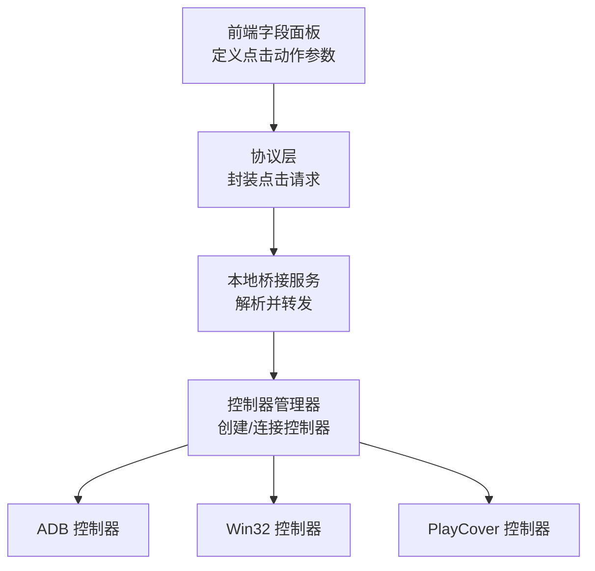
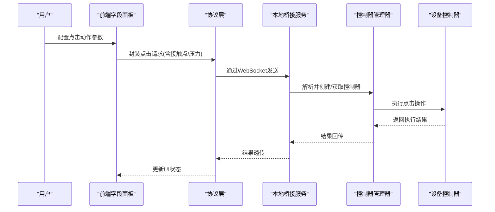
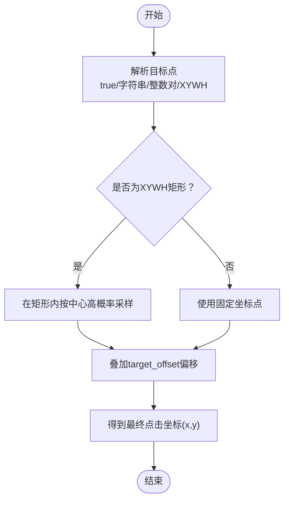
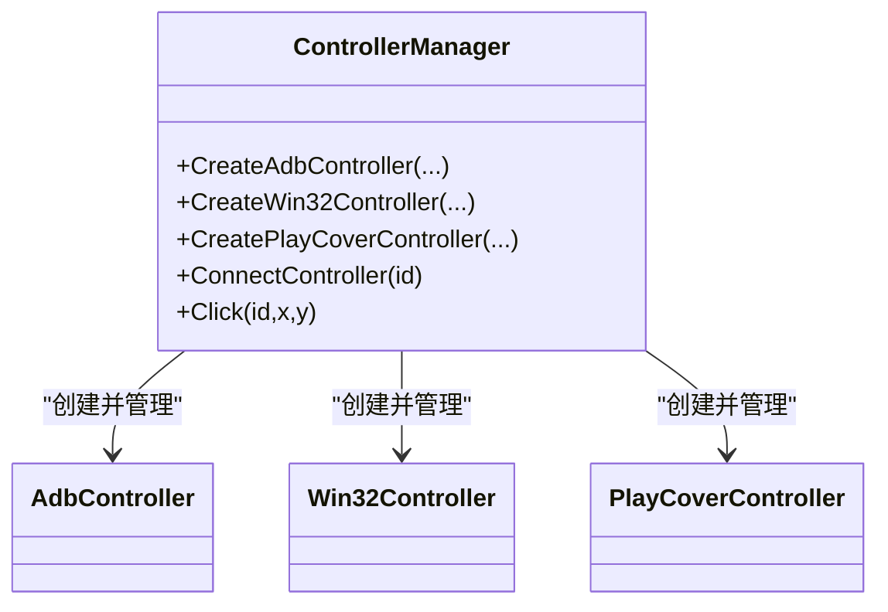
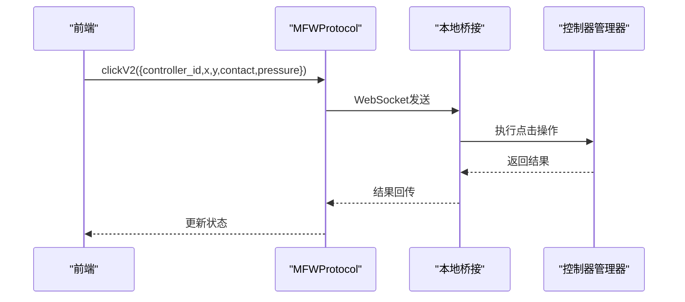
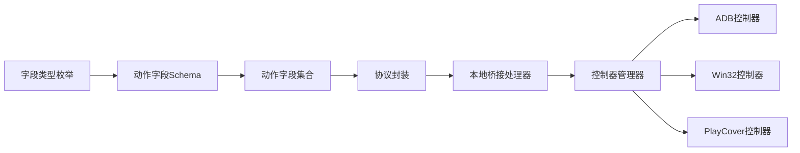

# 点击动作

<cite>
**本文引用的文件**
- [fields.ts](file://src/core/fields/action/fields.ts)
- [schema.ts](file://src/core/fields/action/schema.ts)
- [fieldTypes.ts](file://src/core/fields/fieldTypes.ts)
- [ConnectionPanel.tsx](file://src/components/panels/main/ConnectionPanel.tsx)
- [MFWProtocol.ts](file://src/services/protocols/MFWProtocol.ts)
- [handler.go](file://LocalBridge/internal/protocol/mfw/handler.go)
- [controller_manager.go](file://LocalBridge/internal/mfw/controller_manager.go)
- [mfw.go](file://LocalBridge/pkg/models/mfw.go)
- [ROIOffsetModal.tsx](file://src/components/modals/ROIOffsetModal.tsx)
</cite>

## 目录
1. [简介](#简介)
2. [项目结构](#项目结构)
3. [核心组件](#核心组件)
4. [架构总览](#架构总览)
5. [详细组件分析](#详细组件分析)
6. [依赖分析](#依赖分析)
7. [性能考虑](#性能考虑)
8. [故障排查指南](#故障排查指南)
9. [结论](#结论)
10. [附录](#附录)

## 简介
本章节面向“点击动作”字段的使用者与维护者，系统性阐述点击动作的配置参数、坐标计算与偏移机制、接触面与压力参数、以及与设备控制器（Win32、ADB、PlayCover）的集成差异。文档还提供典型应用场景与最佳实践，帮助读者在不同平台与设备上稳定地执行精确点击、区域点击与相对定位点击。

## 项目结构
点击动作的定义与使用贯穿前端字段定义、协议层调用与后端控制器桥接三层：
- 前端字段定义：在动作字段集合中声明点击动作及其参数，并给出参数类型与默认值说明。
- 协议层调用：前端通过协议封装点击请求（含接触点与压力），经由WebSocket发送至本地桥接服务。
- 本地桥接服务：解析请求并调用底层控制器（ADB/Win32/PlayCover）执行点击操作。

图表来源
- [fields.ts:12-19](file://src/core/fields/action/fields.ts#L12-L19)
- [MFWProtocol.ts:710-723](file://src/services/protocols/MFWProtocol.ts#L710-L723)
- [controller_manager.go:33-75](file://LocalBridge/internal/mfw/controller_manager.go#L33-L75)
- [controller_manager.go:106-162](file://LocalBridge/internal/mfw/controller_manager.go#L106-L162)
- [controller_manager.go:164-192](file://LocalBridge/internal/mfw/controller_manager.go#L164-L192)

章节来源
- [fields.ts:12-19](file://src/core/fields/action/fields.ts#L12-L19)
- [schema.ts:9-25](file://src/core/fields/action/schema.ts#L9-L25)
- [fieldTypes.ts:4-26](file://src/core/fields/fieldTypes.ts#L4-L26)

## 核心组件
- 点击动作字段定义：包含目标点、目标偏移、接触面、压力等参数，用于描述点击行为。
- 参数类型体系：统一的字段类型枚举，支撑前端表单渲染与校验。
- 协议封装：将点击请求（含接触点与压力）序列化并通过协议发送。
- 控制器桥接：根据设备类型创建对应控制器并执行点击。

章节来源
- [fields.ts:12-19](file://src/core/fields/action/fields.ts#L12-L19)
- [schema.ts:9-25](file://src/core/fields/action/schema.ts#L9-L25)
- [fieldTypes.ts:4-26](file://src/core/fields/fieldTypes.ts#L4-L26)
- [MFWProtocol.ts:710-723](file://src/services/protocols/MFWProtocol.ts#L710-L723)
- [controller_manager.go:33-75](file://LocalBridge/internal/mfw/controller_manager.go#L33-L75)

## 架构总览
点击动作从“字段定义”到“设备执行”的完整链路如下：

图表来源
- [MFWProtocol.ts:710-723](file://src/services/protocols/MFWProtocol.ts#L710-L723)
- [handler.go:251-280](file://LocalBridge/internal/protocol/mfw/handler.go#L251-L280)
- [controller_manager.go:33-75](file://LocalBridge/internal/mfw/controller_manager.go#L33-L75)
- [controller_manager.go:336-370](file://LocalBridge/internal/mfw/controller_manager.go#L336-L370)

## 详细组件分析

### 点击动作参数详解
- 目标点（target）
  - 类型：支持XYWH矩形、整数对、布尔true、字符串节点名。
  - 默认：[0, 0, 0, 0]。
  - 说明：true表示使用本节点刚识别到的目标；字符串表示使用之前某个节点的识别结果；整数对[x,y]为固定坐标点；XYWH矩形[x,y,w,h]表示在区域内随机采样，越靠近中心概率越高；全屏可设为[0,0,0,0]。
- 目标偏移（target_offset）
  - 类型：XYWH或整数对。
  - 默认：[0, 0, 0, 0]。
  - 说明：在target基础上再叠加的偏移量，四个分量分别相加。
- 接触面（contact）
  - 类型：整数。
  - 默认：0。
  - 说明：用于区分不同触控点。ADB控制器表示手指编号（0为第一根手指，1为第二根等）；Win32控制器表示鼠标按键编号（0左键，1右键，2中键，3/4扩展键）。
- 压力（pressure）
  - 类型：整数。
  - 默认：0。
  - 说明：触控压力，范围取决于控制器实现。

章节来源
- [schema.ts:9-25](file://src/core/fields/action/schema.ts#L9-L25)
- [schema.ts:141-165](file://src/core/fields/action/schema.ts#L141-L165)
- [fieldTypes.ts:4-26](file://src/core/fields/fieldTypes.ts#L4-L26)

### 坐标计算与偏移机制
- 目标解析优先级：字符串节点名 → 布尔true → 整数对[x,y] → XYWH矩形[x,y,w,h]。
- 偏移叠加：target_offset与target的四维分量逐项相加，得到最终点击坐标。
- 区域点击策略：当target为XYWH矩形时，系统在区域内按中心高概率、边缘低概率的策略采样，确保点击更贴近目标中心。
- 全屏覆盖：当target为[0,0,0,0]时，表示全屏区域，偏移仍按规则叠加。

图表来源
- [schema.ts:9-25](file://src/core/fields/action/schema.ts#L9-L25)

章节来源
- [schema.ts:9-25](file://src/core/fields/action/schema.ts#L9-L25)

### 不同接触面类型的影响
- ADB控制器（Android）
  - contact表示“手指编号”，0为第一根手指，1为第二根等。
  - 适合多指协同场景（如双指缩放、多点点击）。
- Win32控制器（Windows）
  - contact表示“鼠标按键编号”，0为左键，1为右键，2为中键，3/4为扩展键。
  - 适合桌面应用的鼠标点击与滚轮操作。
- PlayCover控制器（macOS/iOS）
  - 通过远程连接iOS应用，支持触摸事件与压力。
  - contact与pressure参数同样生效，但具体范围与精度取决于设备与模拟器实现。

章节来源
- [schema.ts:141-147](file://src/core/fields/action/schema.ts#L141-L147)
- [ConnectionPanel.tsx:572-664](file://src/components/panels/main/ConnectionPanel.tsx#L572-L664)

### 点击动作与设备控制的集成方式
- Win32控制器
  - 通过窗口句柄与输入方法（如SendMessage/PostMessage）执行点击。
  - 支持多种截图与输入方法，具备较好的兼容性。
- ADB控制器
  - 通过adb设备地址与输入方法（如触摸屏注入）执行点击。
  - 支持多输入方法组合，适配不同设备。
- PlayCover控制器
  - 通过PlayCover地址与设备UUID建立连接，远程控制iOS应用。
  - 适用于macOS环境下的iOS应用自动化。

图表来源
- [controller_manager.go:33-75](file://LocalBridge/internal/mfw/controller_manager.go#L33-L75)
- [controller_manager.go:106-162](file://LocalBridge/internal/mfw/controller_manager.go#L106-L162)
- [controller_manager.go:164-192](file://LocalBridge/internal/mfw/controller_manager.go#L164-L192)

章节来源
- [controller_manager.go:33-75](file://LocalBridge/internal/mfw/controller_manager.go#L33-L75)
- [controller_manager.go:106-162](file://LocalBridge/internal/mfw/controller_manager.go#L106-L162)
- [controller_manager.go:164-192](file://LocalBridge/internal/mfw/controller_manager.go#L164-L192)

### 协议与模型对接
- 前端协议封装
  - 提供clickV2接口，携带controller_id、x、y、contact、pressure等参数。
- 本地桥接处理
  - 解析请求并调用控制器管理器执行点击。
- 数据模型
  - 定义了ControllerClickV2Request结构，确保参数一致性。

图表来源
- [MFWProtocol.ts:710-723](file://src/services/protocols/MFWProtocol.ts#L710-L723)
- [handler.go:251-280](file://LocalBridge/internal/protocol/mfw/handler.go#L251-L280)
- [mfw.go:119-126](file://LocalBridge/pkg/models/mfw.go#L119-L126)

章节来源
- [MFWProtocol.ts:710-723](file://src/services/protocols/MFWProtocol.ts#L710-L723)
- [handler.go:251-280](file://LocalBridge/internal/protocol/mfw/handler.go#L251-L280)
- [mfw.go:119-126](file://LocalBridge/pkg/models/mfw.go#L119-L126)

### 实际应用场景与最佳实践
- 精确点击
  - 使用整数对[x,y]作为target，确保点击落在固定像素点。
  - 若需微调，配合target_offset进行小范围偏移。
- 区域点击
  - 使用XYWH矩形作为target，在区域内按中心高概率采样，提升命中率。
  - 对于全屏点击，可将w/h设为0，形成[0,0,0,0]的全屏区域。
- 相对定位
  - 使用布尔true作为target，引用本节点刚识别到的目标，再叠加target_offset实现相对定位。
- 多触控点
  - ADB场景下通过contact区分不同手指，实现多点协同（如双指缩放、多点点击）。
  - Win32场景下通过contact区分鼠标按键，实现左/右键等不同点击。
- 压力控制
  - 在支持压力的设备（如平板、触控板、PlayCover）上，合理设置pressure参数以模拟真实触控体验。

章节来源
- [schema.ts:9-25](file://src/core/fields/action/schema.ts#L9-L25)
- [schema.ts:141-165](file://src/core/fields/action/schema.ts#L141-L165)
- [ROIOffsetModal.tsx:858-895](file://src/components/modals/ROIOffsetModal.tsx#L858-L895)

## 依赖分析
- 字段类型依赖：点击动作参数类型依赖统一的字段类型枚举，保证前后端一致。
- 协议依赖：前端协议封装依赖后端模型定义，确保参数序列化与反序列化一致。
- 控制器依赖：控制器管理器根据设备类型创建对应控制器，点击操作通过统一接口执行。

图表来源
- [fieldTypes.ts:4-26](file://src/core/fields/fieldTypes.ts#L4-L26)
- [schema.ts:9-25](file://src/core/fields/action/schema.ts#L9-L25)
- [fields.ts:12-19](file://src/core/fields/action/fields.ts#L12-L19)
- [MFWProtocol.ts:710-723](file://src/services/protocols/MFWProtocol.ts#L710-L723)
- [handler.go:251-280](file://LocalBridge/internal/protocol/mfw/handler.go#L251-L280)
- [controller_manager.go:33-75](file://LocalBridge/internal/mfw/controller_manager.go#L33-L75)

章节来源
- [fieldTypes.ts:4-26](file://src/core/fields/fieldTypes.ts#L4-L26)
- [schema.ts:9-25](file://src/core/fields/action/schema.ts#L9-L25)
- [fields.ts:12-19](file://src/core/fields/action/fields.ts#L12-L19)
- [MFWProtocol.ts:710-723](file://src/services/protocols/MFWProtocol.ts#L710-L723)
- [handler.go:251-280](file://LocalBridge/internal/protocol/mfw/handler.go#L251-L280)
- [controller_manager.go:33-75](file://LocalBridge/internal/mfw/controller_manager.go#L33-L75)

## 性能考虑
- 区域点击的概率分布：在XYWH矩形内采用中心高概率采样，可减少无效重试，提高命中效率。
- 偏移叠加的复杂度：target_offset为四维向量叠加，计算开销极低，适合高频点击场景。
- 控制器选择：不同控制器的输入延迟与兼容性不同，建议根据目标设备与平台选择最优控制器。

## 故障排查指南
- 点击未生效
  - 检查目标点解析：确认target为正确的布尔true、字符串节点名、整数对或XYWH。
  - 校验偏移量：确认target_offset叠加后仍在可见区域内。
  - 验证控制器：确认控制器已成功创建并连接。
- 压力无效
  - 确认目标设备支持压力参数；不同控制器对pressure的支持范围不同。
- 多触控点冲突
  - ADB场景下确保contact编号唯一且与预期一致；避免多点冲突导致误触。

章节来源
- [schema.ts:9-25](file://src/core/fields/action/schema.ts#L9-L25)
- [schema.ts:141-165](file://src/core/fields/action/schema.ts#L141-L165)
- [controller_manager.go:33-75](file://LocalBridge/internal/mfw/controller_manager.go#L33-L75)

## 结论
点击动作通过明确的参数定义与统一的协议封装，实现了跨平台、多设备的一致点击体验。结合区域采样、偏移叠加与接触面/压力参数，可在不同设备与场景下实现高精度、高稳定的点击操作。建议在实际使用中优先采用布尔true+target_offset的相对定位策略，并根据设备特性合理设置contact与pressure参数。

## 附录
- 字段类型参考：整数、浮点、布尔、字符串、列表、XYWH与整数对等，用于支撑点击动作参数的多样化表达。
- 连接配置：Win32/ADB/PlayCover等设备的连接参数与方法选择，直接影响点击的稳定性与兼容性。

章节来源
- [fieldTypes.ts:4-26](file://src/core/fields/fieldTypes.ts#L4-L26)
- [ConnectionPanel.tsx:572-664](file://src/components/panels/main/ConnectionPanel.tsx#L572-L664)