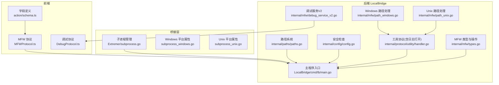
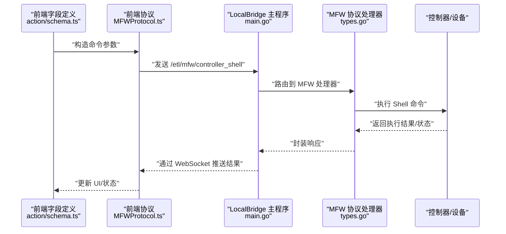
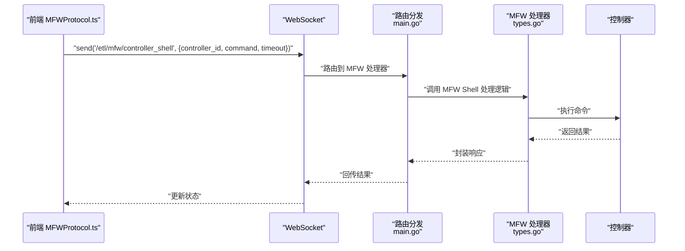
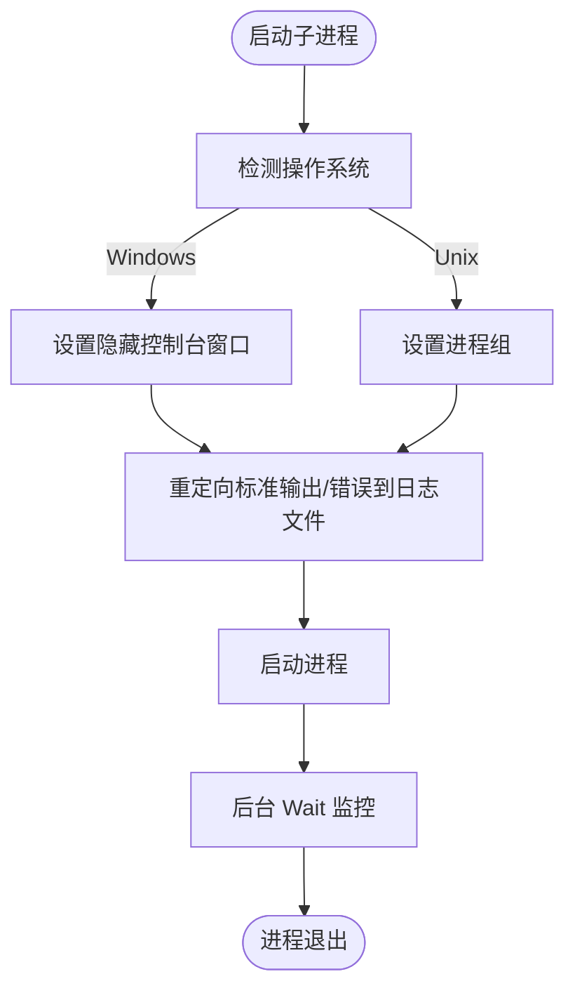
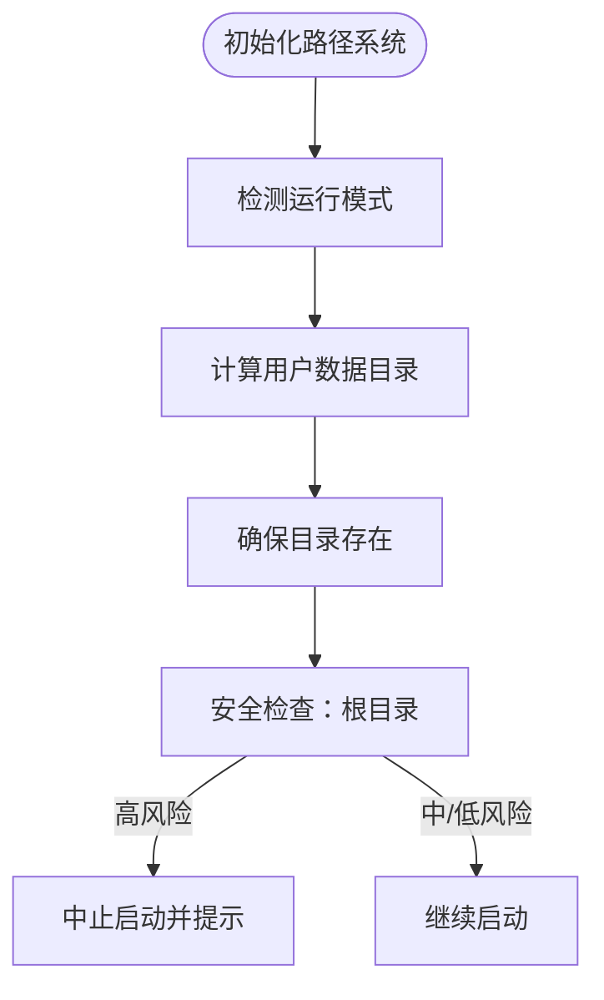
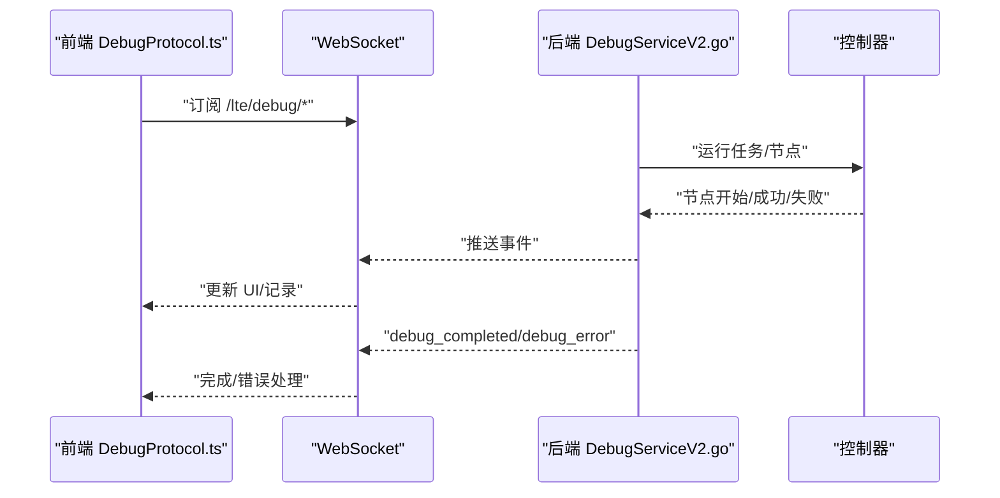
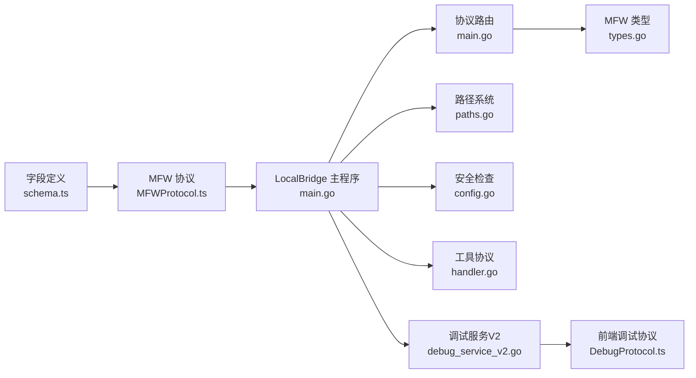

# 系统命令动作

<cite>
**本文档引用的文件**
- [schema.ts](file://src/core/fields/action/schema.ts)
- [MFWProtocol.ts](file://src/services/protocols/MFWProtocol.ts)
- [subprocess.go](file://Extremer/internal/bridge/subprocess.go)
- [subprocess_windows.go](file://Extremer/internal/bridge/subprocess_windows.go)
- [subprocess_unix.go](file://Extremer/internal/bridge/subprocess_unix.go)
- [main.go](file://LocalBridge/cmd/lb/main.go)
- [paths.go](file://LocalBridge/internal/paths/paths.go)
- [config.go](file://LocalBridge/internal/config/config.go)
- [types.go](file://LocalBridge/internal/mfw/types.go)
- [handler.go](file://LocalBridge/internal/protocol/utility/handler.go)
- [path_windows.go](file://LocalBridge/internal/mfw/path_windows.go)
- [path_unix.go](file://LocalBridge/internal/mfw/path_unix.go)
- [DebugProtocol.ts](file://src/services/protocols/DebugProtocol.ts)
- [debug_service_v2.go](file://LocalBridge/internal/mfw/debug_service_v2.go)
</cite>

## 目录
1. [简介](#简介)
2. [项目结构](#项目结构)
3. [核心组件](#核心组件)
4. [架构总览](#架构总览)
5. [详细组件分析](#详细组件分析)
6. [依赖分析](#依赖分析)
7. [性能考虑](#性能考虑)
8. [故障排查指南](#故障排查指南)
9. [结论](#结论)
10. [附录](#附录)

## 简介
本文件面向“系统命令动作”字段，系统性梳理并解释以下内容：
- Command 执行命令与 Shell 执行 Shell 命令的配置参数与行为差异
- 关键参数：exec 可执行文件路径、commandArgs 命令参数、detach 分离模式、cmd 命令内容、shellTimeout 超时设置
- 安全机制、权限控制、环境变量传递策略
- 不同操作系统下的命令兼容性与路径处理
- 异步机制、输出捕获、错误处理
- 调试技巧与安全最佳实践

## 项目结构
围绕系统命令动作，涉及前后端与桥接层的关键模块如下：
- 前端字段定义与协议：action 字段 schema、MFW 协议
- 桥接层子进程管理：Extremer 内桥接子进程管理器
- LocalBridge 后端：命令执行、路径与安全检查、日志与事件推送
- 调试协议与事件：前端调试协议与后端调试服务

**图表来源**
- [schema.ts:209-242](file://src/core/fields/action/schema.ts#L209-L242)
- [MFWProtocol.ts:745-773](file://src/services/protocols/MFWProtocol.ts#L745-L773)
- [subprocess.go:1-132](file://Extremer/internal/bridge/subprocess.go#L1-L132)
- [subprocess_windows.go:1-25](file://Extremer/internal/bridge/subprocess_windows.go#L1-L25)
- [subprocess_unix.go:1-29](file://Extremer/internal/bridge/subprocess_unix.go#L1-L29)
- [main.go:1-440](file://LocalBridge/cmd/lb/main.go#L1-L440)
- [paths.go:1-125](file://LocalBridge/internal/paths/paths.go#L1-L125)
- [config.go:207-338](file://LocalBridge/internal/config/config.go#L207-L338)
- [handler.go:1-694](file://LocalBridge/internal/protocol/utility/handler.go#L1-L694)
- [types.go:1-124](file://LocalBridge/internal/mfw/types.go#L1-L124)
- [path_windows.go:1-57](file://LocalBridge/internal/mfw/path_windows.go#L1-L57)
- [path_unix.go:1-22](file://LocalBridge/internal/mfw/path_unix.go#L1-L22)
- [DebugProtocol.ts:1-800](file://src/services/protocols/DebugProtocol.ts#L1-L800)
- [debug_service_v2.go:333-471](file://LocalBridge/internal/mfw/debug_service_v2.go#L333-L471)

**章节来源**
- [schema.ts:209-242](file://src/core/fields/action/schema.ts#L209-L242)
- [MFWProtocol.ts:745-773](file://src/services/protocols/MFWProtocol.ts#L745-L773)
- [subprocess.go:1-132](file://Extremer/internal/bridge/subprocess.go#L1-L132)
- [main.go:1-440](file://LocalBridge/cmd/lb/main.go#L1-L440)

## 核心组件
- 命令字段定义（前端）
  - exec：必填，指定要执行的可执行文件路径
  - commandArgs：可选，命令参数列表，支持运行期参数替换
  - detach：可选，默认 false，控制是否分离子进程（不等待完成）
  - cmd：必填，Shell 命令内容（ADB 控制器专用）
  - shellTimeout：可选，默认 20000ms，-1 表示无限等待（ADB 控制器专用）

- MFW 协议（前端 → 后端）
  - shell 接口：发送 ADB 控制器 Shell 命令，带超时参数（默认 10000ms）

- 子进程管理（桥接层）
  - 启动 LocalBridge 子进程，设置平台特定进程属性，重定向日志输出，后台监控进程状态

- LocalBridge 主程序（后端）
  - 初始化路径、日志、安全检查
  - 注册协议处理器（文件、MFW、Utility、Config、Debug、Resource）
  - 启动 WebSocket 服务器，处理消息路由与事件广播

- 调试协议（前端）
  - 订阅调试事件，处理节点/识别/动作生命周期事件，展示调试结果与错误

**章节来源**
- [schema.ts:209-242](file://src/core/fields/action/schema.ts#L209-L242)
- [MFWProtocol.ts:745-773](file://src/services/protocols/MFWProtocol.ts#L745-L773)
- [subprocess.go:35-105](file://Extremer/internal/bridge/subprocess.go#L35-L105)
- [main.go:182-440](file://LocalBridge/cmd/lb/main.go#L182-L440)
- [DebugProtocol.ts:136-232](file://src/services/protocols/DebugProtocol.ts#L136-L232)

## 架构总览
系统命令动作的执行链路分为两条：
- Command 执行命令：由前端字段定义与 MFW 协议触发，后端通过 LocalBridge 的 MFW 协议处理器执行控制器操作（如 shell）
- Shell 执行 Shell 命令：由前端字段定义触发，后端通过 MFW 协议发送命令至控制器，控制器执行并返回结果

**图表来源**
- [schema.ts:209-242](file://src/core/fields/action/schema.ts#L209-L242)
- [MFWProtocol.ts:745-773](file://src/services/protocols/MFWProtocol.ts#L745-L773)
- [main.go:385-420](file://LocalBridge/cmd/lb/main.go#L385-L420)
- [types.go:92-124](file://LocalBridge/internal/mfw/types.go#L92-L124)

## 详细组件分析

### 字段定义与参数详解
- exec（必填）
  - 作用：指定要执行的可执行文件路径
  - 影响：决定子进程的入口程序
- commandArgs（可选）
  - 作用：命令参数列表，支持运行期参数替换
  - 替换占位符：{ENTRY}、{NODE}、{IMAGE}、{BOX}、{RESOURCE_DIR}、{LIBRARY_DIR}
- detach（可选，默认 false）
  - 作用：分离模式，不等待子进程结束
  - 影响：后续任务可立即继续，适合异步执行
- cmd（必填，ADB 控制器）
  - 作用：要执行的 Shell 命令内容
  - 适用：Android ADB 控制器场景
- shellTimeout（可选，默认 20000ms）
  - 作用：命令执行超时时间（毫秒），-1 表示无限等待
  - 限制：仅对 ADB 控制器有效

**章节来源**
- [schema.ts:209-242](file://src/core/fields/action/schema.ts#L209-L242)

### MFW 协议与 Shell 执行
- 前端 MFWProtocol.shell
  - 发送路径：/etl/mfw/controller_shell
  - 参数：controller_id、command、timeout（默认 10000ms）
- 后端路由
  - LocalBridge 注册 MFW 协议处理器，接收并处理 Shell 请求
  - 返回执行结果与状态

**图表来源**
- [MFWProtocol.ts:745-773](file://src/services/protocols/MFWProtocol.ts#L745-L773)
- [main.go:385-420](file://LocalBridge/cmd/lb/main.go#L385-L420)
- [types.go:92-124](file://LocalBridge/internal/mfw/types.go#L92-L124)

**章节来源**
- [MFWProtocol.ts:745-773](file://src/services/protocols/MFWProtocol.ts#L745-L773)
- [main.go:385-420](file://LocalBridge/cmd/lb/main.go#L385-L420)
- [types.go:92-124](file://LocalBridge/internal/mfw/types.go#L92-L124)

### 子进程管理与平台差异
- 启动 LocalBridge 子进程
  - 选择可执行文件：Windows 使用 mpelb.exe，其他平台使用 mpelb
  - 参数：--port、--root、--log-dir、--config（可选）
  - 设置平台特定进程属性：隐藏控制台窗口（Windows）、进程组（Unix）
  - 重定向 stdout/stderr 到日志文件
  - 后台 Wait 监控进程状态
- 停止进程
  - Windows：直接 Kill
  - Unix：先 SIGTERM，失败则 Kill

**图表来源**
- [subprocess.go:35-105](file://Extremer/internal/bridge/subprocess.go#L35-L105)
- [subprocess_windows.go:10-25](file://Extremer/internal/bridge/subprocess_windows.go#L10-L25)
- [subprocess_unix.go:10-29](file://Extremer/internal/bridge/subprocess_unix.go#L10-L29)

**章节来源**
- [subprocess.go:35-105](file://Extremer/internal/bridge/subprocess.go#L35-L105)
- [subprocess_windows.go:10-25](file://Extremer/internal/bridge/subprocess_windows.go#L10-L25)
- [subprocess_unix.go:10-29](file://Extremer/internal/bridge/subprocess_unix.go#L10-L29)

### 路径系统与安全检查
- 路径系统
  - 检测运行模式：开发模式、便携模式、用户模式
  - 用户数据目录：Windows APPDATA、macOS Application Support、Linux XDG_CONFIG_HOME
  - 确保数据目录存在
- 安全检查
  - 根目录安全性检查：检测是否位于高风险系统目录
  - 风险等级：high/medium/low；高风险直接中止启动并给出建议

**图表来源**
- [paths.go:39-125](file://LocalBridge/internal/paths/paths.go#L39-L125)
- [config.go:234-296](file://LocalBridge/internal/config/config.go#L234-L296)

**章节来源**
- [paths.go:39-125](file://LocalBridge/internal/paths/paths.go#L39-L125)
- [config.go:234-296](file://LocalBridge/internal/config/config.go#L234-L296)

### 跨平台路径处理与日志打开
- Windows 路径处理
  - 检测非 ASCII 字符，尝试短路径转换（GetShortPathNameW）
  - 若短路径无效，采用工作目录切换方案
- 日志打开
  - 根据操作系统使用不同命令打开日志目录或选中文件
  - Windows：explorer /select, macOS：open -R，Linux：xdg-open

**章节来源**
- [path_windows.go:1-57](file://LocalBridge/internal/mfw/path_windows.go#L1-L57)
- [path_unix.go:1-22](file://LocalBridge/internal/mfw/path_unix.go#L1-L22)
- [handler.go:597-694](file://LocalBridge/internal/protocol/utility/handler.go#L597-L694)

### 调试协议与事件流
- 前端调试协议
  - 订阅 /lte/debug/* 事件，处理节点/识别/动作生命周期事件
  - 根据 session_id 过滤事件，避免会话错配
- 后端调试服务V2
  - 等待任务完成，根据状态发送 completed/error 事件
  - 记录节点执行次数与耗时，转发事件给前端

**图表来源**
- [DebugProtocol.ts:136-232](file://src/services/protocols/DebugProtocol.ts#L136-L232)
- [debug_service_v2.go:380-438](file://LocalBridge/internal/mfw/debug_service_v2.go#L380-L438)

**章节来源**
- [DebugProtocol.ts:136-232](file://src/services/protocols/DebugProtocol.ts#L136-L232)
- [debug_service_v2.go:380-438](file://LocalBridge/internal/mfw/debug_service_v2.go#L380-L438)

## 依赖分析
- 前端字段定义依赖 MFW 协议进行 Shell 命令下发
- LocalBridge 主程序依赖协议处理器与路由分发
- 调试协议依赖后端调试服务与 WebSocket 事件
- 路径系统与安全检查贯穿启动流程

**图表来源**
- [schema.ts:209-242](file://src/core/fields/action/schema.ts#L209-L242)
- [MFWProtocol.ts:745-773](file://src/services/protocols/MFWProtocol.ts#L745-L773)
- [main.go:385-420](file://LocalBridge/cmd/lb/main.go#L385-L420)
- [types.go:92-124](file://LocalBridge/internal/mfw/types.go#L92-L124)
- [paths.go:39-125](file://LocalBridge/internal/paths/paths.go#L39-L125)
- [config.go:234-296](file://LocalBridge/internal/config/config.go#L234-L296)
- [handler.go:1-694](file://LocalBridge/internal/protocol/utility/handler.go#L1-L694)
- [debug_service_v2.go:380-438](file://LocalBridge/internal/mfw/debug_service_v2.go#L380-L438)
- [DebugProtocol.ts:136-232](file://src/services/protocols/DebugProtocol.ts#L136-L232)

**章节来源**
- [schema.ts:209-242](file://src/core/fields/action/schema.ts#L209-L242)
- [MFWProtocol.ts:745-773](file://src/services/protocols/MFWProtocol.ts#L745-L773)
- [main.go:385-420](file://LocalBridge/cmd/lb/main.go#L385-L420)
- [paths.go:39-125](file://LocalBridge/internal/paths/paths.go#L39-L125)
- [config.go:234-296](file://LocalBridge/internal/config/config.go#L234-L296)
- [handler.go:1-694](file://LocalBridge/internal/protocol/utility/handler.go#L1-L694)
- [debug_service_v2.go:380-438](file://LocalBridge/internal/mfw/debug_service_v2.go#L380-L438)
- [DebugProtocol.ts:136-232](file://src/services/protocols/DebugProtocol.ts#L136-L232)

## 性能考虑
- 异步执行：通过 detach 参数实现分离模式，避免阻塞后续任务
- 超时控制：shellTimeout 与 MFW 协议默认超时共同保障执行时效
- 日志重定向：将子进程输出重定向到文件，减少内存占用
- 路径处理优化：Windows 短路径转换与工作目录切换降低路径问题导致的失败率

[本节为通用指导，无需列出具体文件来源]

## 故障排查指南
- 启动失败
  - 检查 LocalBridge 可执行文件是否存在与路径正确
  - 查看日志文件（mpelb.log）定位错误
- 权限与安全
  - 高风险目录启动被中止：调整根目录至项目目录
  - 非 ASCII 路径（Windows）：启用短路径转换或工作目录切换
- 调试异常
  - 资源路径错误：检查资源目录结构与权限
  - 会话 ID 不匹配：确认前端/后端会话一致性
- 日志查看
  - 使用工具协议打开日志目录或选中 maa.log 文件

**章节来源**
- [subprocess.go:53-56](file://Extremer/internal/bridge/subprocess.go#L53-L56)
- [config.go:234-296](file://LocalBridge/internal/config/config.go#L234-L296)
- [path_windows.go:18-57](file://LocalBridge/internal/mfw/path_windows.go#L18-L57)
- [DebugProtocol.ts:444-540](file://src/services/protocols/DebugProtocol.ts#L444-L540)
- [handler.go:597-694](file://LocalBridge/internal/protocol/utility/handler.go#L597-L694)

## 结论
系统命令动作通过清晰的字段定义与协议设计，实现了跨平台、可配置、可调试的命令执行能力。前端负责参数构造与事件订阅，后端负责安全检查、路径处理与协议路由，桥接层负责子进程生命周期管理。遵循本文档的安全与调试建议，可在多平台上稳定地执行命令并获得可观测的执行结果。

[本节为总结性内容，无需列出具体文件来源]

## 附录
- 参数速查
  - exec：可执行文件路径（必填）
  - commandArgs：命令参数列表（可选，支持运行期替换）
  - detach：分离模式（可选，默认 false）
  - cmd：Shell 命令内容（ADB 控制器）
  - shellTimeout：Shell 超时（毫秒，默认 20000，-1 无限等待）

[本节为补充说明，无需列出具体文件来源]