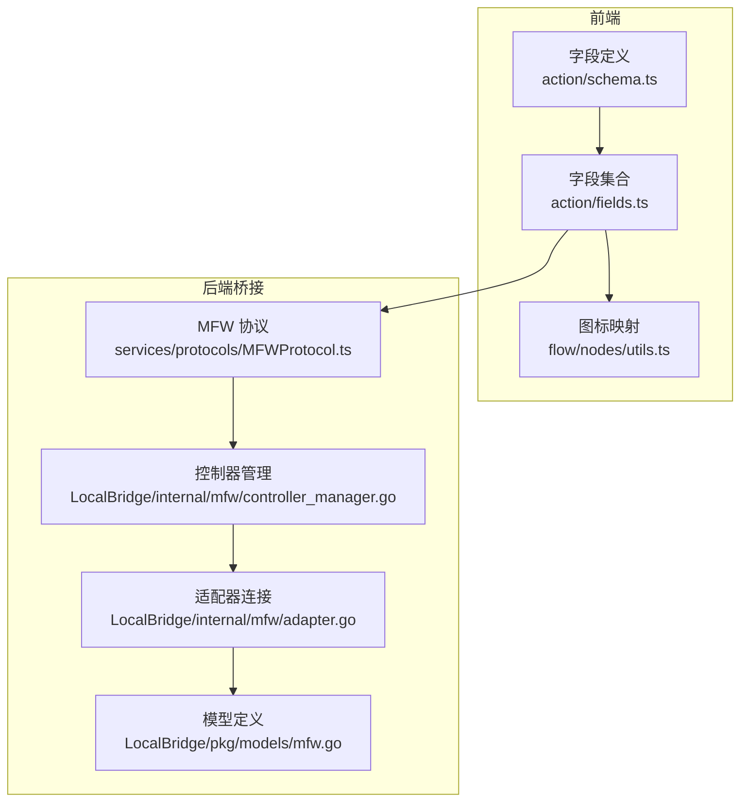
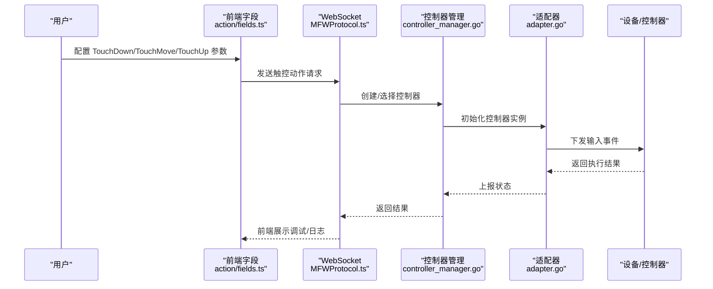
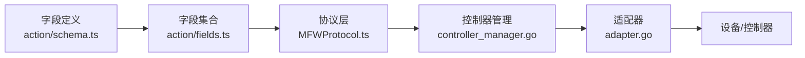

# 触控手势动作

<cite>
**本文引用的文件**
- [schema.ts](file://src/core/fields/action/schema.ts)
- [fields.ts](file://src/core/fields/action/fields.ts)
- [index.ts](file://src/core/fields/action/index.ts)
- [utils.ts](file://src/components/flow/nodes/utils.ts)
- [DebugProtocol.ts](file://src/services/protocols/DebugProtocol.ts)
- [MFWProtocol.ts](file://src/services/protocols/MFWProtocol.ts)
- [controller_manager.go](file://LocalBridge/internal/mfw/controller_manager.go)
- [adapter.go](file://LocalBridge/internal/mfw/adapter.go)
- [mfw.go](file://LocalBridge/pkg/models/mfw.go)
- [mfwStore.ts](file://src/stores/mfwStore.ts)
</cite>

## 目录
1. [简介](#简介)
2. [项目结构](#项目结构)
3. [核心组件](#核心组件)
4. [架构总览](#架构总览)
5. [详细组件分析](#详细组件分析)
6. [依赖关系分析](#依赖关系分析)
7. [性能考量](#性能考量)
8. [故障排查指南](#故障排查指南)
9. [结论](#结论)
10. [附录](#附录)

## 简介
本文件面向“触控手势动作”字段，系统化阐述 TouchDown 按下触控点、TouchMove 移动触控点、TouchUp 抬起触控点等多点触控动作的配置参数与行为规范；详解 contact 接触面 ID、touchTarget 目标点、targetOffset 偏移量、pressure 压力等关键参数；说明多点触控的协调机制与手势序列的执行顺序；解释与不同设备（触摸屏、触控板、模拟器等）的兼容性；并提供复杂手势设计思路与调试方法。

## 项目结构
围绕触控动作的核心代码主要分布在前端字段定义与后端桥接协议两部分：
- 前端字段定义：统一在动作字段 Schema 与字段集合中声明 TouchDown/TouchMove/TouchUp 的参数项与描述
- 后端桥接协议：通过 MFW 协议将触控动作下发至控制器（ADB/Win32/Gamepad）

图表来源
- [schema.ts:140-165](file://src/core/fields/action/schema.ts#L140-L165)
- [fields.ts:71-92](file://src/core/fields/action/fields.ts#L71-L92)
- [utils.ts:61-66](file://src/components/flow/nodes/utils.ts#L61-L66)
- [MFWProtocol.ts:708-743](file://src/services/protocols/MFWProtocol.ts#L708-L743)
- [controller_manager.go:47-75](file://LocalBridge/internal/mfw/controller_manager.go#L47-L75)
- [adapter.go:120-156](file://LocalBridge/internal/mfw/adapter.go#L120-L156)
- [mfw.go:1-42](file://LocalBridge/pkg/models/mfw.go#L1-L42)

章节来源
- [schema.ts:140-165](file://src/core/fields/action/schema.ts#L140-L165)
- [fields.ts:71-92](file://src/core/fields/action/fields.ts#L71-L92)
- [utils.ts:61-66](file://src/components/flow/nodes/utils.ts#L61-L66)
- [MFWProtocol.ts:708-743](file://src/services/protocols/MFWProtocol.ts#L708-L743)
- [controller_manager.go:47-75](file://LocalBridge/internal/mfw/controller_manager.go#L47-L75)
- [adapter.go:120-156](file://LocalBridge/internal/mfw/adapter.go#L120-L156)
- [mfw.go:1-42](file://LocalBridge/pkg/models/mfw.go#L1-L42)

## 核心组件
- 触控动作字段定义：TouchDown/TouchMove/TouchUp 的参数项与默认值、类型约束、描述
- 触控动作字段集合：将动作与其参数绑定，形成可编辑的 UI 字段
- 图标映射：为 TouchDown/TouchMove/TouchUp 显示统一的触控图标
- MFW 协议：将触控动作封装为 WebSocket 请求，下发给控制器
- 控制器管理与适配：根据设备类型创建并连接控制器，建立输入通道

章节来源
- [schema.ts:140-165](file://src/core/fields/action/schema.ts#L140-L165)
- [fields.ts:71-92](file://src/core/fields/action/fields.ts#L71-L92)
- [utils.ts:61-66](file://src/components/flow/nodes/utils.ts#L61-L66)
- [MFWProtocol.ts:708-743](file://src/services/protocols/MFWProtocol.ts#L708-L743)
- [controller_manager.go:47-75](file://LocalBridge/internal/mfw/controller_manager.go#L47-L75)
- [adapter.go:120-156](file://LocalBridge/internal/mfw/adapter.go#L120-L156)

## 架构总览
触控动作从字段定义到设备执行的端到端流程如下：

图表来源
- [fields.ts:71-92](file://src/core/fields/action/fields.ts#L71-L92)
- [MFWProtocol.ts:708-743](file://src/services/protocols/MFWProtocol.ts#L708-L743)
- [controller_manager.go:47-75](file://LocalBridge/internal/mfw/controller_manager.go#L47-L75)
- [adapter.go:120-156](file://LocalBridge/internal/mfw/adapter.go#L120-L156)

## 详细组件分析

### 字段定义与参数详解
- contact 接触面 ID
  - 类型：整数
  - 默认值：0
  - 描述：用于区分不同的触控点。ADB 控制器表示手指编号（0 为第一根手指，1 为第二根手指…）；Win32 控制器表示鼠标按键编号（0 为左键，1 为右键，2 为中键，3/4 为 XBUTTON1/XBUTTON2）
- touchTarget 触控目标
  - 类型：支持 XYWH 区域、整数对、布尔 true、字符串节点名
  - 默认值：[0, 0, 0, 0]
  - 描述：目标位置。true 表示使用本节点刚识别到的位置；字符串填写节点名表示使用之前某节点的识别结果；整数对 [x,y] 为固定坐标点；四元组 [x,y,w,h] 为固定区域并在其中随机采样（越靠近中心概率越高）
- targetOffset 目标偏移
  - 类型：XYWH 或整数对
  - 默认值：[0, 0, 0, 0]
  - 描述：在 target 基础上额外偏移后再作为目标
- pressure 压力
  - 类型：整数
  - 默认值：0
  - 描述：触控压力，范围取决于控制器实现

章节来源
- [schema.ts:140-165](file://src/core/fields/action/schema.ts#L140-L165)

### 动作字段集合与 UI 映射
- TouchDown/TouchMove/TouchUp 的参数均包含 contact、touchTarget、targetOffset、pressure
- TouchMove 的描述明确指出字段含义与 TouchDown 一致，用于更新触点位置
- UI 图标映射：TouchDown/TouchMove/TouchUp 对应统一的触控图标，便于识别

章节来源
- [fields.ts:71-92](file://src/core/fields/action/fields.ts#L71-L92)
- [utils.ts:61-66](file://src/components/flow/nodes/utils.ts#L61-L66)

### 多点触控协调机制
- 多点触控通过 contact 参数区分不同触点，确保每个触点独立控制
- 在多指滑动（MultiSwipe）场景中，contact 为 0 时会使用滑动在数组中的索引作为触点编号，避免重复触点冲突
- 建议在复杂手势中为每个触点分配唯一 contact，并在 TouchDown/ToucMove/ToucUp 成对出现，保证状态一致性

章节来源
- [schema.ts:132-138](file://src/core/fields/action/schema.ts#L132-L138)
- [fields.ts:71-92](file://src/core/fields/action/fields.ts#L71-L92)

### 执行顺序与手势序列
- 基本顺序：TouchDown → 若干 TouchMove → TouchUp
- 多点触控序列：为每个 contact 先执行 TouchDown，期间可多次 TouchMove 更新位置，最后对每个活跃触点执行 TouchUp
- 复杂序列：可通过多个动作节点串联，或在 MultiSwipe 中一次性定义多条路径，减少抬手次数，提升流畅度

章节来源
- [fields.ts:71-92](file://src/core/fields/action/fields.ts#L71-L92)
- [schema.ts:132-138](file://src/core/fields/action/schema.ts#L132-L138)

### 设备兼容性
- ADB 控制器
  - 支持多点触控，contact 表示手指编号
  - 适合连接真机/模拟器（如模拟器需开启触摸输入）
- Win32 控制器
  - contact 表示鼠标按键编号（0=左键，1=右键，2=中键，3/4=XBUTTON1/XBUTTON2）
  - 适合桌面环境下的触控板/鼠标模拟触摸
- Gamepad 控制器
  - 通过 ViGEm 驱动模拟输入，适合手柄到键盘/鼠标的映射场景

章节来源
- [schema.ts:140-147](file://src/core/fields/action/schema.ts#L140-L147)
- [controller_manager.go:47-75](file://LocalBridge/internal/mfw/controller_manager.go#L47-L75)
- [adapter.go:120-156](file://LocalBridge/internal/mfw/adapter.go#L120-L156)
- [mfw.go:15-27](file://LocalBridge/pkg/models/mfw.go#L15-L27)

### 调试与可视化
- 前端调试协议
  - 通过 DebugProtocol 监听节点/动作生命周期事件，定位问题
  - 提供“测试此节点”“测试识别”等快捷调试入口
- 控制器状态
  - mfwStore 维护连接状态、控制器类型与设备信息，便于排查连接问题

章节来源
- [DebugProtocol.ts:185-232](file://src/services/protocols/DebugProtocol.ts#L185-L232)
- [DebugProtocol.ts:969-1003](file://src/services/protocols/DebugProtocol.ts#L969-L1003)
- [mfwStore.ts:117-157](file://src/stores/mfwStore.ts#L117-L157)

## 依赖关系分析
- 字段定义依赖于字段类型枚举与通用类型系统
- 字段集合依赖字段定义，形成可编辑 UI
- 动作字段最终通过 MFW 协议下发到控制器
- 控制器管理负责创建与连接不同类型的控制器

图表来源
- [schema.ts:140-165](file://src/core/fields/action/schema.ts#L140-L165)
- [fields.ts:71-92](file://src/core/fields/action/fields.ts#L71-L92)
- [MFWProtocol.ts:708-743](file://src/services/protocols/MFWProtocol.ts#L708-L743)
- [controller_manager.go:47-75](file://LocalBridge/internal/mfw/controller_manager.go#L47-L75)
- [adapter.go:120-156](file://LocalBridge/internal/mfw/adapter.go#L120-L156)

章节来源
- [index.ts:1-3](file://src/core/fields/action/index.ts#L1-L3)
- [schema.ts:140-165](file://src/core/fields/action/schema.ts#L140-L165)
- [fields.ts:71-92](file://src/core/fields/action/fields.ts#L71-L92)
- [MFWProtocol.ts:708-743](file://src/services/protocols/MFWProtocol.ts#L708-L743)
- [controller_manager.go:47-75](file://LocalBridge/internal/mfw/controller_manager.go#L47-L75)
- [adapter.go:120-156](file://LocalBridge/internal/mfw/adapter.go#L120-L156)

## 性能考量
- 多点触控时尽量减少频繁的 TouchDown/ToucUp 切换，优先使用 TouchMove 更新位置
- 在 MultiSwipe 中合理设置 duration 与 end_hold，避免过短导致设备无法稳定跟踪
- 压力值（pressure）应根据设备能力设置，过高可能被忽略或触发异常行为
- 对于 Win32 控制器，鼠标按键编号与压力值需与目标应用的输入处理逻辑匹配

## 故障排查指南
- 连接问题
  - 检查 LocalBridge 与控制器连接状态（mfwStore）
  - 确认控制器类型与设备匹配（ADB/Win32/Gamepad）
- 触控异常
  - contact 冲突：确保每个触点的 contact 唯一
  - 目标无效：确认 touchTarget 引用的节点存在且识别成功
  - 压力无效：检查设备是否支持压力感应
- 调试方法
  - 使用“测试此节点”“测试识别”快速验证动作与识别链路
  - 通过 DebugProtocol 查看节点/动作事件流，定位失败环节

章节来源
- [mfwStore.ts:117-157](file://src/stores/mfwStore.ts#L117-L157)
- [DebugProtocol.ts:185-232](file://src/services/protocols/DebugProtocol.ts#L185-L232)
- [DebugProtocol.ts:969-1003](file://src/services/protocols/DebugProtocol.ts#L969-L1003)

## 结论
触控手势动作通过标准化的字段定义与协议下发，实现了跨设备的一致性体验。正确理解 contact、touchTarget、targetOffset、pressure 等参数，并遵循多点触控的协调与执行顺序，是构建稳定复杂手势的关键。结合前端调试与后端控制器状态监控，可高效定位并解决兼容性与稳定性问题。

## 附录

### 触控动作字段一览
- TouchDown：按下触控点
- TouchMove：移动触控点（更新位置）
- TouchUp：抬起触控点

章节来源
- [fields.ts:71-92](file://src/core/fields/action/fields.ts#L71-L92)