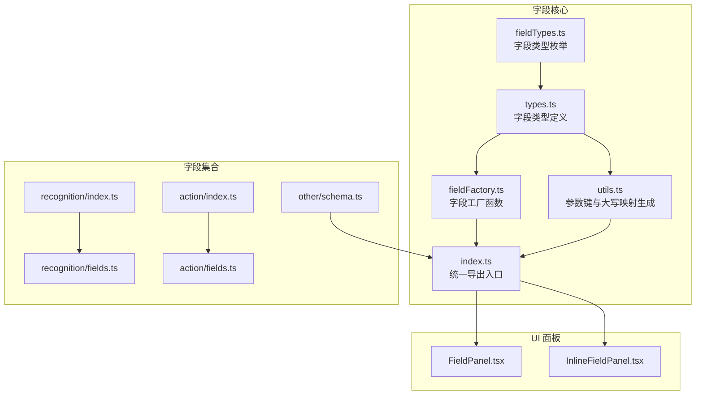
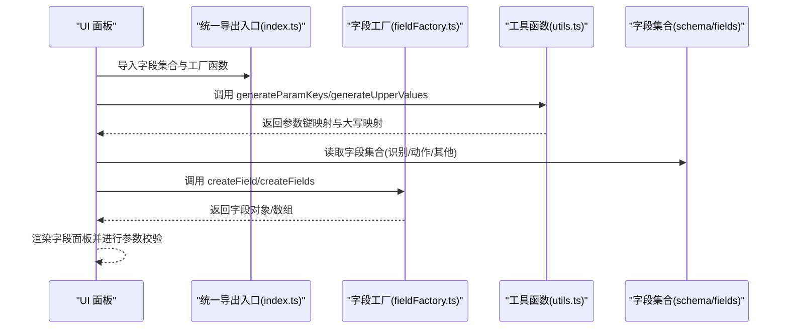
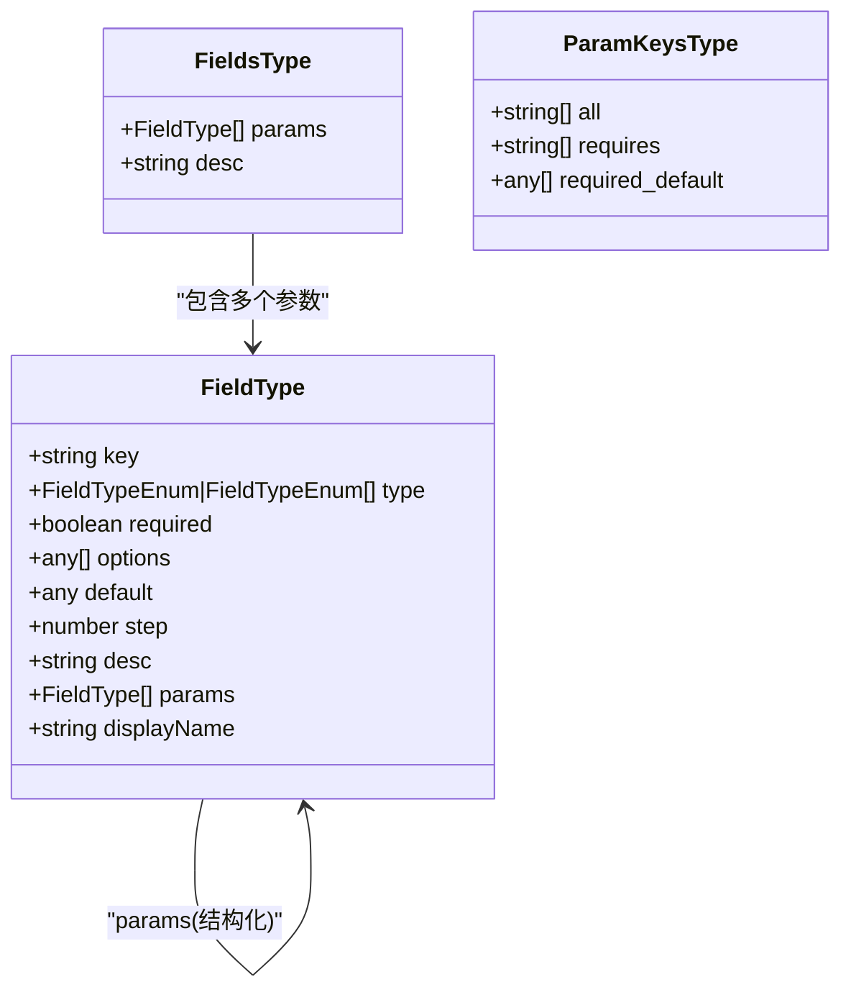
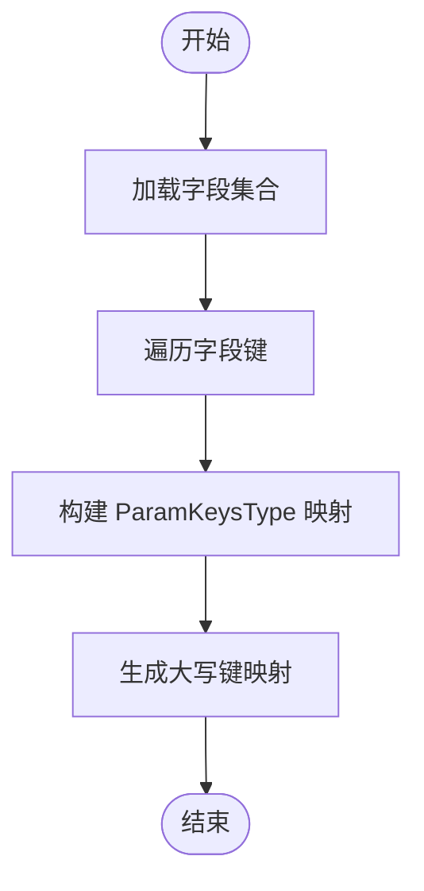
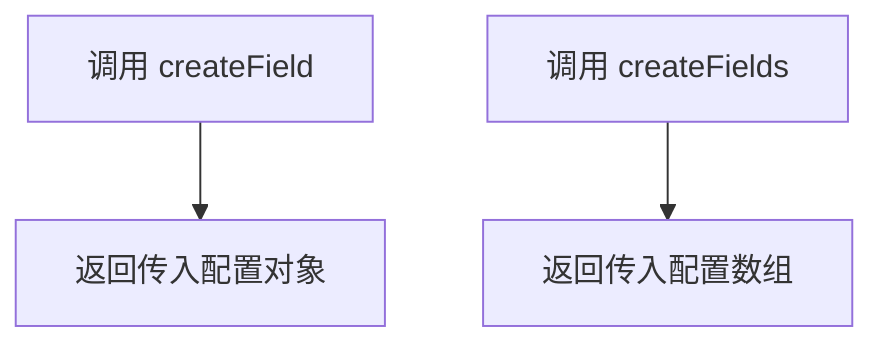
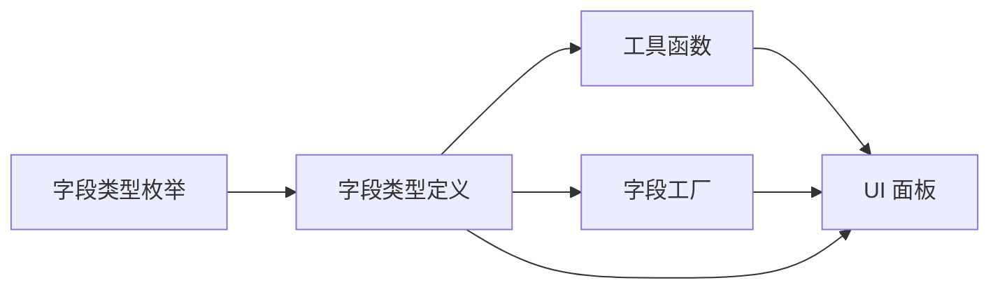
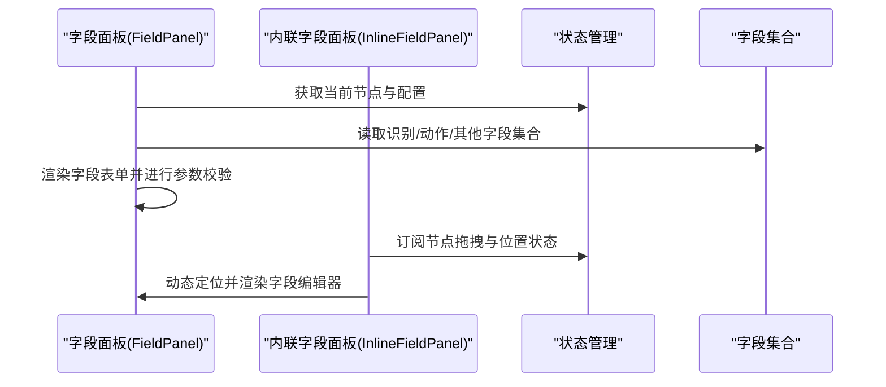
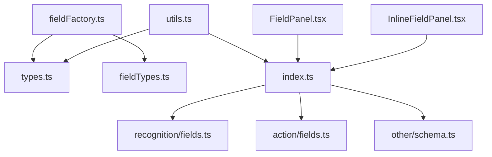

# 字段工厂

<cite>
**本文档引用的文件**
- [fieldFactory.ts](file://src/core/fields/fieldFactory.ts)
- [index.ts](file://src/core/fields/index.ts)
- [types.ts](file://src/core/fields/types.ts)
- [fieldTypes.ts](file://src/core/fields/fieldTypes.ts)
- [utils.ts](file://src/core/fields/utils.ts)
- [recognition/index.ts](file://src/core/fields/recognition/index.ts)
- [recognition/fields.ts](file://src/core/fields/recognition/fields.ts)
- [action/index.ts](file://src/core/fields/action/index.ts)
- [action/fields.ts](file://src/core/fields/action/fields.ts)
- [other/schema.ts](file://src/core/fields/other/schema.ts)
- [FieldPanel.tsx](file://src/components/panels/main/FieldPanel.tsx)
- [InlineFieldPanel.tsx](file://src/components/panels/main/InlineFieldPanel.tsx)
</cite>

## 目录
1. [引言](#引言)
2. [项目结构](#项目结构)
3. [核心组件](#核心组件)
4. [架构总览](#架构总览)
5. [详细组件分析](#详细组件分析)
6. [依赖关系分析](#依赖关系分析)
7. [性能考量](#性能考量)
8. [故障排查指南](#故障排查指南)
9. [结论](#结论)
10. [附录](#附录)

## 引言
本文件围绕“字段工厂”系统展开，系统性阐述字段定义的数据结构、类型体系、参数生成与校验、以及在节点配置中的应用方式。重点包括：
- 字段工厂的设计模式与实现原理
- 字段类型判断与参数验证
- 字段工厂如何依据类型与配置生成字段对象
- 字段工厂与字段类型系统的协作机制
- 字段工厂在节点配置中的作用与应用场景
- 自定义字段类型的扩展与集成方法

## 项目结构
字段工厂位于前端核心模块 src/core/fields 下，采用“类型定义 + 字段类型枚举 + 字段集合 + 工厂函数 + 工具函数”的分层组织方式，并通过统一入口 index.ts 汇总导出，供 UI 面板与节点编辑器消费。

图表来源
- [fieldFactory.ts:1-16](file://src/core/fields/fieldFactory.ts#L1-L16)
- [index.ts:1-45](file://src/core/fields/index.ts#L1-L45)
- [types.ts:1-34](file://src/core/fields/types.ts#L1-L34)
- [fieldTypes.ts:1-27](file://src/core/fields/fieldTypes.ts#L1-L27)
- [utils.ts:1-41](file://src/core/fields/utils.ts#L1-L41)
- [recognition/index.ts:1-3](file://src/core/fields/recognition/index.ts#L1-L3)
- [recognition/fields.ts:1-115](file://src/core/fields/recognition/fields.ts#L1-L115)
- [action/index.ts:1-3](file://src/core/fields/action/index.ts#L1-L3)
- [action/fields.ts:1-149](file://src/core/fields/action/fields.ts#L1-L149)
- [other/schema.ts:1-200](file://src/core/fields/other/schema.ts#L1-L200)
- [FieldPanel.tsx:1-200](file://src/components/panels/main/FieldPanel.tsx#L1-L200)
- [InlineFieldPanel.tsx:1-192](file://src/components/panels/main/InlineFieldPanel.tsx#L1-L192)

章节来源
- [index.ts:1-45](file://src/core/fields/index.ts#L1-L45)

## 核心组件
- 字段类型定义与集合
  - 字段类型定义：key、type、required、options、default、step、desc、params、displayName 等关键字段，支撑 UI 渲染与参数校验。
  - 字段集合：识别类、动作类、其他类字段通过 Records 组织，每个条目描述一组参数及其说明。
- 字段类型枚举
  - 提供整型、浮点、布尔、字符串、列表、数组、图片路径等丰富类型，支持复合类型与联合类型标注。
- 工具函数
  - generateParamKeys：从字段集合生成参数键映射，包含 all、requires、required_default。
  - generateUpperValues：生成字段键的大写到小写的映射，便于大小写无关的查找。
- 字段工厂
  - createField/createFields：提供字段对象的便捷构造与批量构造，简化字段定义与使用。

章节来源
- [types.ts:1-34](file://src/core/fields/types.ts#L1-L34)
- [fieldTypes.ts:1-27](file://src/core/fields/fieldTypes.ts#L1-L27)
- [utils.ts:1-41](file://src/core/fields/utils.ts#L1-L41)
- [fieldFactory.ts:1-16](file://src/core/fields/fieldFactory.ts#L1-L16)

## 架构总览
字段工厂与字段类型系统协同工作，形成“类型定义 + 参数集合 + 工厂函数 + 工具函数”的闭环。UI 面板通过统一入口 index.ts 获取字段集合与工厂函数，结合工具函数生成参数键与映射，完成字段渲染、参数校验与默认值填充。

图表来源
- [index.ts:1-45](file://src/core/fields/index.ts#L1-L45)
- [fieldFactory.ts:1-16](file://src/core/fields/fieldFactory.ts#L1-L16)
- [utils.ts:1-41](file://src/core/fields/utils.ts#L1-L41)
- [recognition/fields.ts:1-115](file://src/core/fields/recognition/fields.ts#L1-L115)
- [action/fields.ts:1-149](file://src/core/fields/action/fields.ts#L1-L149)
- [other/schema.ts:1-200](file://src/core/fields/other/schema.ts#L1-L200)

## 详细组件分析

### 字段类型与集合
- 字段类型定义
  - key：参数唯一标识
  - type：字段类型（支持联合类型数组）
  - required：是否必填
  - options/default/step：选项与默认值、步长
  - desc/displayName：描述与显示名
  - params：子字段参数列表，支持结构化字段（如 focus）
- 字段集合
  - 识别类：DirectHit、OCR、TemplateMatch、ColorMatch、FeatureMatch、And、Or、NeuralNetworkClassify、NeuralNetworkDetect 等
  - 动作类：DoNothing、Click、Swipe、Scroll、LongPress、MultiSwipe、TouchDown/Move/Up、KeyDown/KeyUp、InputText、StartApp/StopApp、Command、Shell、Screencap 等
  - 其他类：rate_limit、timeout、anchor、inverse、enabled、max_hit、pre/post_delay、pre/post_wait_freezes、focus 等

图表来源
- [types.ts:1-34](file://src/core/fields/types.ts#L1-L34)

章节来源
- [types.ts:1-34](file://src/core/fields/types.ts#L1-L34)
- [recognition/fields.ts:1-115](file://src/core/fields/recognition/fields.ts#L1-L115)
- [action/fields.ts:1-149](file://src/core/fields/action/fields.ts#L1-L149)
- [other/schema.ts:1-200](file://src/core/fields/other/schema.ts#L1-L200)

### 字段类型枚举
- 提供基础类型与复合类型，涵盖整型、浮点、布尔、字符串、列表、数组、图片路径等
- 支持联合类型标注，便于字段类型灵活表达

章节来源
- [fieldTypes.ts:1-27](file://src/core/fields/fieldTypes.ts#L1-L27)

### 工具函数
- generateParamKeys：遍历字段集合，提取参数键、必填键与对应默认值，构建映射
- generateUpperValues：将字段键转换为大写形式，建立大小写无关的查找映射

图表来源
- [utils.ts:1-41](file://src/core/fields/utils.ts#L1-L41)

章节来源
- [utils.ts:1-41](file://src/core/fields/utils.ts#L1-L41)

### 字段工厂
- createField：接收字段配置，返回原样字段对象，用于简化字段定义与传递
- createFields：批量创建字段，返回字段数组，便于集合处理

图表来源
- [fieldFactory.ts:1-16](file://src/core/fields/fieldFactory.ts#L1-L16)

章节来源
- [fieldFactory.ts:1-16](file://src/core/fields/fieldFactory.ts#L1-L16)

### 字段工厂与字段类型系统的协作
- 类型系统提供类型枚举与字段定义，确保字段对象具备统一结构
- 工具函数基于字段集合生成参数键与映射，驱动 UI 渲染与参数校验
- 工厂函数提供便捷构造，降低字段定义成本

图表来源
- [fieldTypes.ts:1-27](file://src/core/fields/fieldTypes.ts#L1-L27)
- [types.ts:1-34](file://src/core/fields/types.ts#L1-L34)
- [utils.ts:1-41](file://src/core/fields/utils.ts#L1-L41)
- [fieldFactory.ts:1-16](file://src/core/fields/fieldFactory.ts#L1-L16)

章节来源
- [index.ts:1-45](file://src/core/fields/index.ts#L1-L45)

### 字段工厂在节点配置中的作用与场景
- 字段面板渲染：UI 面板根据字段集合与映射生成表单项，结合默认值与必填规则进行校验
- 节点编辑器：在节点编辑过程中，通过字段工厂快速构造字段对象，保证字段一致性
- 内联字段面板：在节点旁渲染字段编辑器，结合拖拽状态与缩放比例动态定位

图表来源
- [FieldPanel.tsx:1-200](file://src/components/panels/main/FieldPanel.tsx#L1-L200)
- [InlineFieldPanel.tsx:1-192](file://src/components/panels/main/InlineFieldPanel.tsx#L1-L192)
- [recognition/fields.ts:1-115](file://src/core/fields/recognition/fields.ts#L1-L115)
- [action/fields.ts:1-149](file://src/core/fields/action/fields.ts#L1-L149)
- [other/schema.ts:1-200](file://src/core/fields/other/schema.ts#L1-L200)

章节来源
- [FieldPanel.tsx:1-200](file://src/components/panels/main/FieldPanel.tsx#L1-L200)
- [InlineFieldPanel.tsx:1-192](file://src/components/panels/main/InlineFieldPanel.tsx#L1-L192)

## 依赖关系分析
- 字段工厂依赖类型定义与类型枚举，确保字段对象结构一致
- 工具函数依赖字段集合，生成参数键与映射
- UI 面板依赖统一导出入口，聚合字段集合与工厂函数

图表来源
- [fieldFactory.ts:1-16](file://src/core/fields/fieldFactory.ts#L1-L16)
- [types.ts:1-34](file://src/core/fields/types.ts#L1-L34)
- [fieldTypes.ts:1-27](file://src/core/fields/fieldTypes.ts#L1-L27)
- [utils.ts:1-41](file://src/core/fields/utils.ts#L1-L41)
- [index.ts:1-45](file://src/core/fields/index.ts#L1-L45)
- [recognition/fields.ts:1-115](file://src/core/fields/recognition/fields.ts#L1-L115)
- [action/fields.ts:1-149](file://src/core/fields/action/fields.ts#L1-L149)
- [other/schema.ts:1-200](file://src/core/fields/other/schema.ts#L1-L200)
- [FieldPanel.tsx:1-200](file://src/components/panels/main/FieldPanel.tsx#L1-L200)
- [InlineFieldPanel.tsx:1-192](file://src/components/panels/main/InlineFieldPanel.tsx#L1-L192)

章节来源
- [index.ts:1-45](file://src/core/fields/index.ts#L1-L45)

## 性能考量
- 字段集合规模与参数键映射生成：字段数量较多时，generateParamKeys 与 generateUpperValues 的遍历开销需关注；建议在初始化阶段一次性生成并缓存映射。
- UI 渲染与字段面板：内联字段面板在节点拖拽时隐藏，避免频繁重渲染；合理使用 useMemo/useCallback 可减少不必要的重渲染。
- 字段工厂：createField/createFields 为轻量函数，性能影响较小，适合在渲染过程中频繁调用。

## 故障排查指南
- 字段类型不匹配
  - 现象：字段类型与期望不符导致 UI 渲染异常或参数校验失败
  - 处理：检查字段类型枚举与字段定义的 type 字段，确保类型一致
- 缺失必填参数
  - 现象：字段集合中存在 required=true 的参数但未提供默认值
  - 处理：通过 generateParamKeys 获取 required_default 映射，确保必填参数有默认值
- 参数键大小写问题
  - 现象：参数键大小写不一致导致映射失败
  - 处理：使用 generateUpperValues 建立大小写无关映射，统一转换为大写进行查找
- 节点数据结构损坏
  - 现象：节点数据缺失 recognition/action/others 或类型不正确
  - 处理：参考字段面板的节点数据验证与修复逻辑，自动补全缺失字段

章节来源
- [utils.ts:1-41](file://src/core/fields/utils.ts#L1-L41)
- [FieldPanel.tsx:1-200](file://src/components/panels/main/FieldPanel.tsx#L1-L200)

## 结论
字段工厂系统通过清晰的类型定义、丰富的类型枚举、实用的工具函数与简洁的工厂函数，实现了字段对象的标准化与可扩展性。它与字段集合紧密协作，在节点配置中承担了参数定义、校验与渲染的关键角色。通过统一入口导出与 UI 面板的集成，系统在易用性与可维护性方面表现良好。

## 附录

### 扩展开发指南：自定义字段类型的注册与集成
- 新增字段类型
  - 在类型枚举中添加新类型，确保与现有类型区分明确
  - 在字段集合中新增字段条目，定义参数列表与描述
- 字段工厂集成
  - 使用 createField/createFields 构造字段对象，确保字段结构符合 FieldType 定义
  - 将新字段加入字段集合，以便 UI 面板渲染与参数校验
- 工具函数适配
  - 如需新的参数键映射或大写映射，可在工具函数中扩展生成逻辑
- UI 面板集成
  - 通过统一入口导入新字段集合与工厂函数
  - 在字段面板中渲染新字段，并进行参数校验与默认值填充

章节来源
- [fieldTypes.ts:1-27](file://src/core/fields/fieldTypes.ts#L1-L27)
- [types.ts:1-34](file://src/core/fields/types.ts#L1-L34)
- [fieldFactory.ts:1-16](file://src/core/fields/fieldFactory.ts#L1-L16)
- [index.ts:1-45](file://src/core/fields/index.ts#L1-L45)