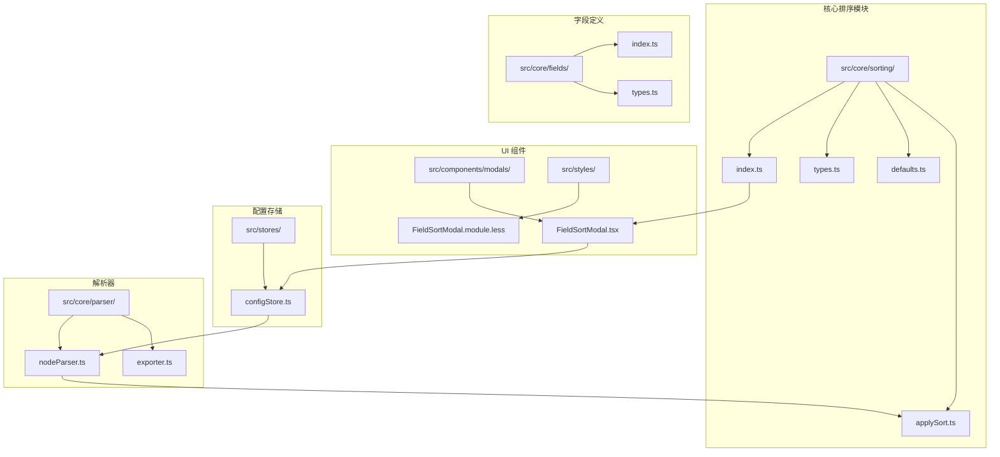
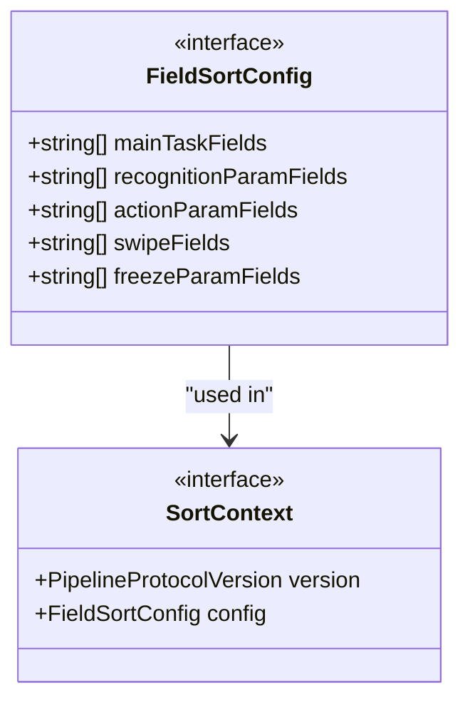
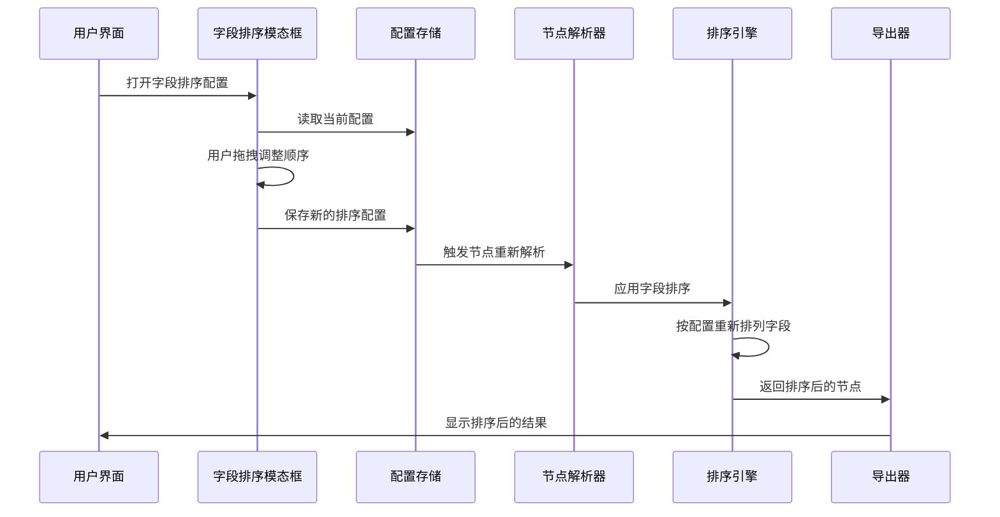
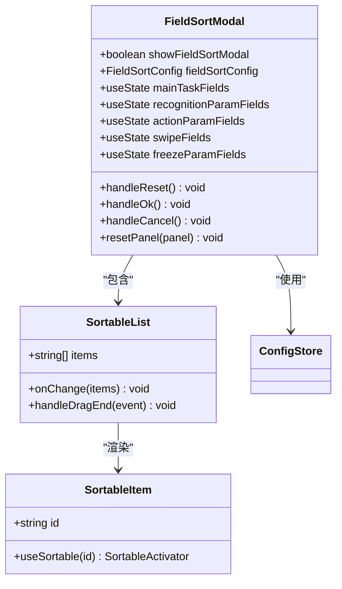
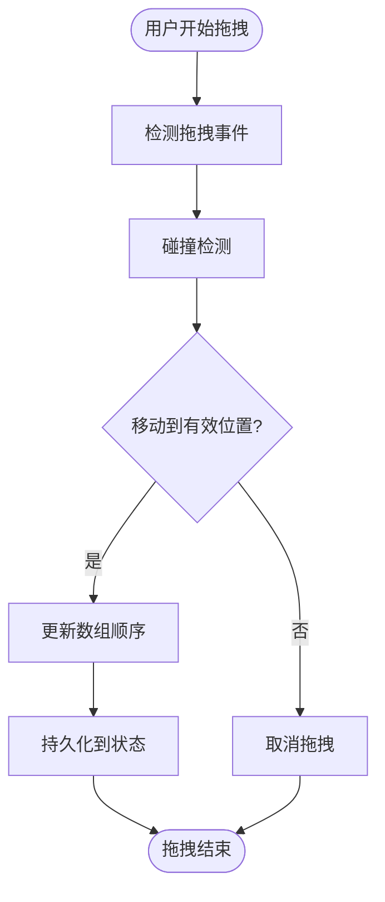
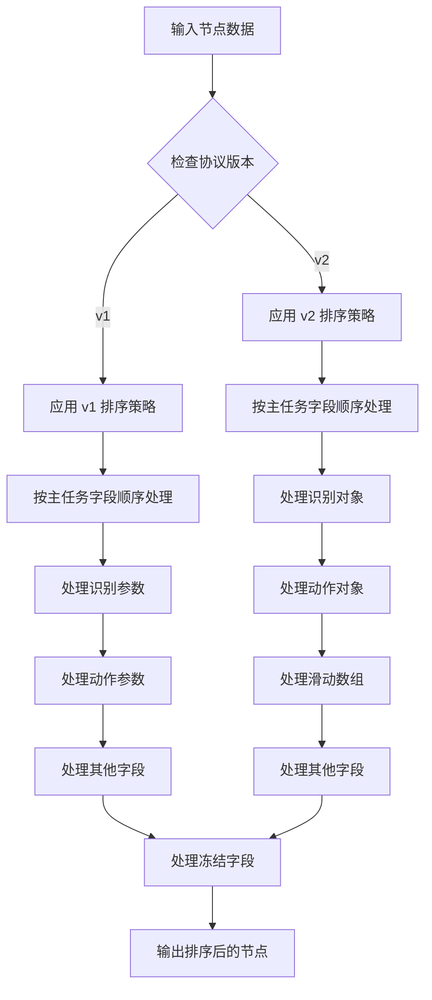
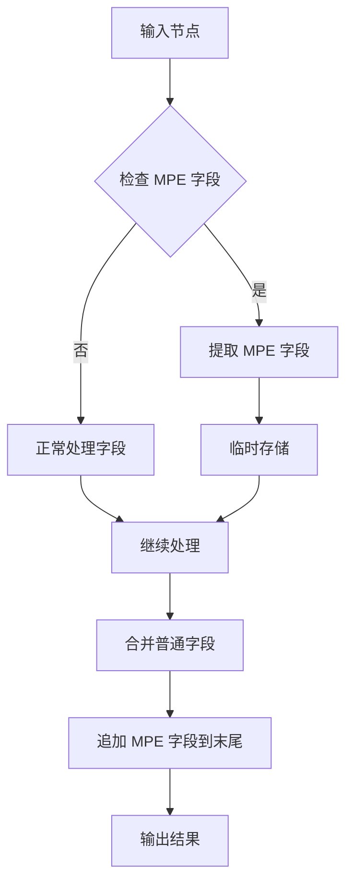
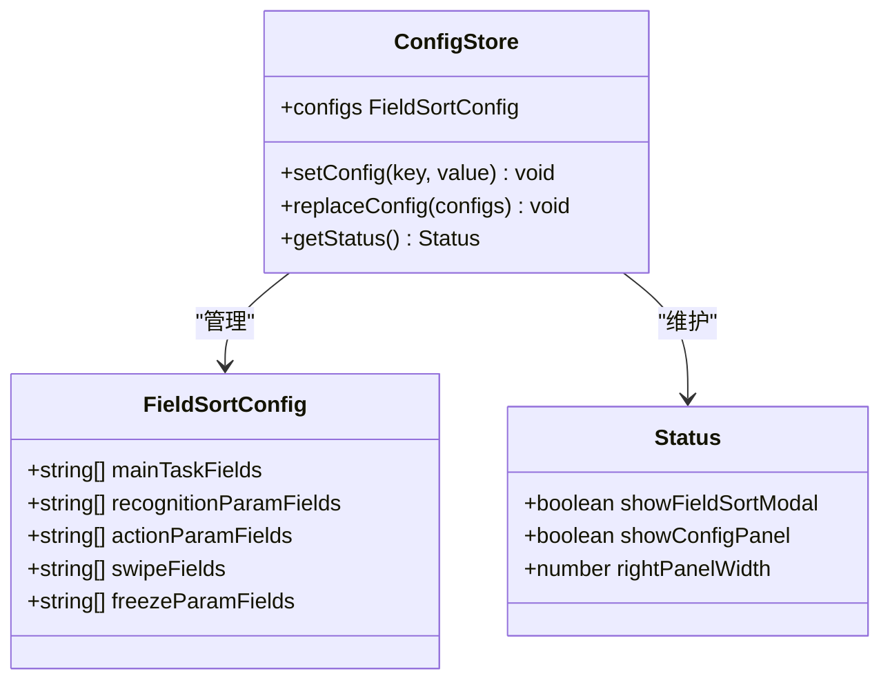
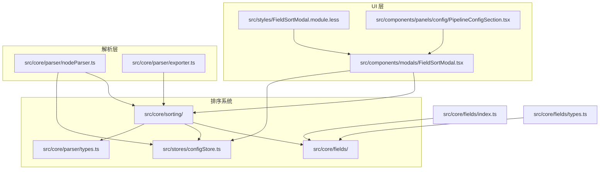

# 字段排序系统

<cite>
**本文档引用的文件**
- [src/core/sorting/index.ts](file://src/core/sorting/index.ts)
- [src/core/sorting/types.ts](file://src/core/sorting/types.ts)
- [src/core/sorting/defaults.ts](file://src/core/sorting/defaults.ts)
- [src/core/sorting/applySort.ts](file://src/core/sorting/applySort.ts)
- [src/components/modals/FieldSortModal.tsx](file://src/components/modals/FieldSortModal.tsx)
- [src/core/fields/index.ts](file://src/core/fields/index.ts)
- [src/core/fields/types.ts](file://src/core/fields/types.ts)
- [src/stores/configStore.ts](file://src/stores/configStore.ts)
- [src/core/parser/nodeParser.ts](file://src/core/parser/nodeParser.ts)
- [src/core/parser/exporter.ts](file://src/core/parser/exporter.ts)
- [src/styles/FieldSortModal.module.less](file://src/styles/FieldSortModal.module.less)
- [src/components/panels/config/PipelineConfigSection.tsx](file://src/components/panels/config/PipelineConfigSection.tsx)
</cite>

## 目录
1. [简介](#简介)
2. [项目结构](#项目结构)
3. [核心组件](#核心组件)
4. [架构概览](#架构概览)
5. [详细组件分析](#详细组件分析)
6. [依赖关系分析](#依赖关系分析)
7. [性能考虑](#性能考虑)
8. [故障排除指南](#故障排除指南)
9. [结论](#结论)

## 简介

字段排序系统是 MaaPipelineEditor 中一个重要的功能模块，负责在导出 Pipeline 文件时对节点字段进行有序排列。该系统提供了灵活的排序配置机制，允许用户自定义各种字段的显示顺序，包括主任务字段、识别参数字段、动作参数字段、滑动参数字段和冻结参数字段。

系统支持两种导出协议版本（v1 和 v2），能够根据不同的协议格式对字段进行相应的排序处理。通过可视化界面，用户可以轻松地调整字段顺序，确保导出的 JSON 文件具有清晰、一致的结构。

## 项目结构

字段排序系统主要分布在以下目录中：

**图表来源**
- [src/core/sorting/index.ts:1-22](file://src/core/sorting/index.ts#L1-L22)
- [src/components/modals/FieldSortModal.tsx:1-362](file://src/components/modals/FieldSortModal.tsx#L1-L362)

**章节来源**
- [src/core/sorting/index.ts:1-22](file://src/core/sorting/index.ts#L1-L22)
- [src/components/modals/FieldSortModal.tsx:1-362](file://src/components/modals/FieldSortModal.tsx#L1-L362)

## 核心组件

### 排序配置类型

系统定义了完整的类型体系来描述字段排序配置：

**图表来源**
- [src/core/sorting/types.ts:6-27](file://src/core/sorting/types.ts#L6-L27)

### 默认排序配置

系统提供了丰富的默认字段排序配置，涵盖了各种节点类型的字段：

| 字段类别 | 默认顺序示例 | 用途 |
|---------|-------------|------|
| 主任务字段 | desc, doc, enabled, max_hit, sub_name, recognition, inverse, pre_wait_freezes, pre_delay, action, anchor, repeat, repeat_wait_freezes, repeat_delay, post_wait_freezes, post_delay, timeout, rate_limit, next, on_error, focus, attach | 控制节点的主要属性 |
| 识别参数字段 | custom_recognition, custom_recognition_param, roi, roi_offset, template, green_mask, method, detector, ratio, lower, upper, connected, expected, replace, only_rec, model, color_filter, labels, threshold, count, all_of, any_of, box_index, order_by, index | 图像识别相关参数 |
| 动作参数字段 | custom_action, custom_action_param, target, target_offset, begin, begin_offset, end, end_offset, end_hold, only_hover, duration, contact, pressure, swipes, dx, dy, key, input_text, package, exec, args, detach, cmd, shell_timeout, filename, format, quality | 执行动作的相关参数 |
| 滑动参数字段 | 自动从字段定义中获取 | 多次滑动操作的参数 |
| 冻结参数字段 | time, target, target_offset, threshold, method, rate_limit, timeout | 等待冻结状态的参数 |

**章节来源**
- [src/core/sorting/types.ts:1-28](file://src/core/sorting/types.ts#L1-L28)
- [src/core/sorting/defaults.ts:1-152](file://src/core/sorting/defaults.ts#L1-L152)

## 架构概览

字段排序系统采用分层架构设计，从底层的数据结构定义到顶层的用户界面交互形成了完整的处理链路：

**图表来源**
- [src/components/modals/FieldSortModal.tsx:106-189](file://src/components/modals/FieldSortModal.tsx#L106-L189)
- [src/core/parser/nodeParser.ts:156-158](file://src/core/parser/nodeParser.ts#L156-L158)
- [src/core/sorting/applySort.ts:314-327](file://src/core/sorting/applySort.ts#L314-L327)

## 详细组件分析

### 字段排序模态框组件

字段排序模态框提供了直观的拖拽界面，让用户可以轻松调整各种字段的显示顺序：

**图表来源**
- [src/components/modals/FieldSortModal.tsx:106-213](file://src/components/modals/FieldSortModal.tsx#L106-L213)
- [src/components/modals/FieldSortModal.tsx:36-104](file://src/components/modals/FieldSortModal.tsx#L36-L104)

#### 拖拽排序实现

系统使用 `@dnd-kit` 库实现了流畅的拖拽排序体验：

**图表来源**
- [src/components/modals/FieldSortModal.tsx:75-85](file://src/components/modals/FieldSortModal.tsx#L75-L85)

### 排序应用引擎

排序应用引擎是系统的核心逻辑处理部分，负责根据配置对节点数据进行字段重排：

**图表来源**
- [src/core/sorting/applySort.ts:183-236](file://src/core/sorting/applySort.ts#L183-L236)
- [src/core/sorting/applySort.ts:241-305](file://src/core/sorting/applySort.ts#L241-L305)

#### 特殊字段处理

系统特别处理了 MPE 特色字段，确保这些内部使用的字段始终位于排序结果的末尾：

**图表来源**
- [src/core/sorting/applySort.ts:23-57](file://src/core/sorting/applySort.ts#L23-L57)
- [src/core/sorting/applySort.ts:187-235](file://src/core/sorting/applySort.ts#L187-L235)

**章节来源**
- [src/components/modals/FieldSortModal.tsx:1-362](file://src/components/modals/FieldSortModal.tsx#L1-L362)
- [src/core/sorting/applySort.ts:1-341](file://src/core/sorting/applySort.ts#L1-L341)

### 配置存储管理

配置存储系统负责管理用户的排序偏好设置：

**图表来源**
- [src/stores/configStore.ts:101-173](file://src/stores/configStore.ts#L101-L173)
- [src/stores/configStore.ts:153-154](file://src/stores/configStore.ts#L153-L154)

**章节来源**
- [src/stores/configStore.ts:1-284](file://src/stores/configStore.ts#L1-L284)

## 依赖关系分析

字段排序系统与其他模块的依赖关系如下：

**图表来源**
- [src/core/sorting/index.ts:1-22](file://src/core/sorting/index.ts#L1-L22)
- [src/components/modals/FieldSortModal.tsx:21-30](file://src/components/modals/FieldSortModal.tsx#L21-L30)

### 关键依赖点

1. **字段定义依赖**: 排序系统依赖于核心字段定义模块，确保排序顺序与实际可用字段保持同步
2. **配置存储依赖**: 通过配置存储获取用户的排序偏好设置
3. **解析器集成**: 在节点解析过程中集成排序逻辑，确保导出的节点数据符合用户期望
4. **UI 组件集成**: 提供直观的用户界面让用户调整排序配置

**章节来源**
- [src/core/sorting/index.ts:1-22](file://src/core/sorting/index.ts#L1-L22)
- [src/core/fields/index.ts:1-46](file://src/core/fields/index.ts#L1-L46)

## 性能考虑

字段排序系统在设计时充分考虑了性能优化：

### 时间复杂度分析

- **字段排序**: O(n + m)，其中 n 是节点字段数量，m 是排序配置长度
- **对象重排**: O(k)，其中 k 是需要处理的对象字段数量
- **整体性能**: 系统采用单次遍历策略，避免重复计算

### 内存优化策略

1. **惰性加载**: 排序配置仅在需要时才进行合并和应用
2. **对象复用**: 使用原地修改策略减少内存分配
3. **缓存机制**: 默认配置通过函数返回避免重复创建

### 用户体验优化

1. **实时预览**: 拖拽过程中的视觉反馈提供即时响应
2. **批量操作**: 支持一键重置到默认配置
3. **智能合并**: 自动检测用户配置与默认值的差异

## 故障排除指南

### 常见问题及解决方案

#### 1. 字段排序不生效

**可能原因**:
- 排序配置未正确保存
- 节点数据格式不符合预期
- 协议版本不匹配

**解决步骤**:
1. 检查配置存储中的 `fieldSortConfig` 是否存在
2. 验证节点数据结构是否完整
3. 确认 `pipelineProtocolVersion` 设置正确

#### 2. 拖拽功能异常

**可能原因**:
- 拖拽传感器配置错误
- 事件处理器冲突
- 样式冲突

**解决步骤**:
1. 检查 `@dnd-kit` 库的版本兼容性
2. 验证拖拽事件监听器的正确性
3. 确认样式文件没有影响拖拽功能

#### 3. 导出结果不符合预期

**可能原因**:
- 排序逻辑错误
- 特殊字段处理问题
- 协议版本切换

**解决步骤**:
1. 检查 `applyFieldSort` 函数的执行路径
2. 验证 `isMpeField` 函数的判断逻辑
3. 确认不同协议版本的处理分支

**章节来源**
- [src/core/sorting/applySort.ts:314-340](file://src/core/sorting/applySort.ts#L314-L340)
- [src/components/modals/FieldSortModal.tsx:141-155](file://src/components/modals/FieldSortModal.tsx#L141-L155)

## 结论

字段排序系统通过精心设计的架构和实现，为用户提供了强大而灵活的字段排序功能。系统的主要优势包括：

1. **模块化设计**: 清晰的分层架构便于维护和扩展
2. **用户友好**: 直观的拖拽界面提升用户体验
3. **性能优化**: 高效的算法实现确保良好的响应速度
4. **兼容性强**: 支持多种协议版本和字段类型
5. **配置灵活**: 允许用户完全自定义字段显示顺序

该系统成功地将复杂的排序逻辑封装在简洁易用的界面背后，为 MaaPipelineEditor 的用户提供了一个强大而可靠的字段排序解决方案。通过持续的优化和改进，该系统将继续为用户创造更好的使用体验。