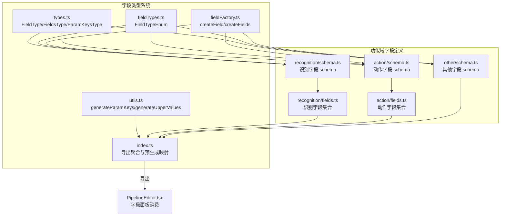
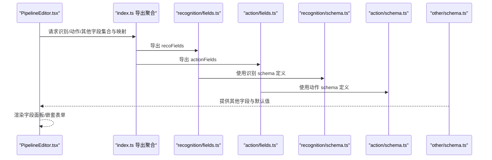
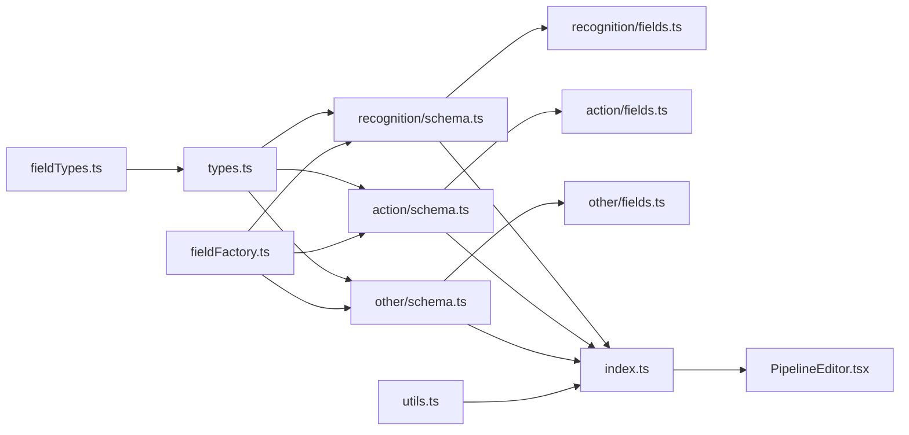

# 字段类型系统

<cite>
**本文档引用的文件**
- [src/core/fields/types.ts](file://src/core/fields/types.ts)
- [src/core/fields/fieldTypes.ts](file://src/core/fields/fieldTypes.ts)
- [src/core/fields/utils.ts](file://src/core/fields/utils.ts)
- [src/core/fields/index.ts](file://src/core/fields/index.ts)
- [src/core/fields/fieldFactory.ts](file://src/core/fields/fieldFactory.ts)
- [src/core/fields/recognition/schema.ts](file://src/core/fields/recognition/schema.ts)
- [src/core/fields/action/schema.ts](file://src/core/fields/action/schema.ts)
- [src/core/fields/other/schema.ts](file://src/core/fields/other/schema.ts)
- [src/core/fields/recognition/fields.ts](file://src/core/fields/recognition/fields.ts)
- [src/core/fields/action/fields.ts](file://src/core/fields/action/fields.ts)
- [src/components/panels/node-editors/PipelineEditor.tsx](file://src/components/panels/node-editors/PipelineEditor.tsx)
</cite>

## 目录
1. [简介](#简介)
2. [项目结构](#项目结构)
3. [核心组件](#核心组件)
4. [架构总览](#架构总览)
5. [详细组件分析](#详细组件分析)
6. [依赖关系分析](#依赖关系分析)
7. [性能考量](#性能考量)
8. [故障排查指南](#故障排查指南)
9. [结论](#结论)
10. [附录](#附录)

## 简介
本文件系统性地阐述字段类型系统的设计与实现，围绕 FieldType 接口、字段类型枚举、结构化字段与嵌套参数、工具函数与导出聚合、以及扩展开发的最佳实践展开。目标是帮助开发者快速理解字段定义如何驱动前端表单渲染、参数校验与默认值管理，并提供可复用的扩展指南。

## 项目结构
字段类型系统位于前端核心模块 src/core/fields 下，采用“类型定义 + 枚举 + 工具函数 + 各功能域字段定义”的分层组织方式：
- 类型与枚举：统一定义 FieldType、FieldsType、ParamKeysType 以及 FieldTypeEnum
- 工具函数：生成参数键映射、大小写映射等
- 功能域字段：识别（recognition）、动作（action）、其他（other）三类字段的 schema 与汇总
- 导出聚合：统一导出类型、枚举、字段集合、工具函数与预生成映射

图表来源
- [src/core/fields/types.ts:1-34](file://src/core/fields/types.ts#L1-L34)
- [src/core/fields/fieldTypes.ts:1-27](file://src/core/fields/fieldTypes.ts#L1-L27)
- [src/core/fields/utils.ts:1-41](file://src/core/fields/utils.ts#L1-L41)
- [src/core/fields/fieldFactory.ts:1-16](file://src/core/fields/fieldFactory.ts#L1-L16)
- [src/core/fields/index.ts:1-45](file://src/core/fields/index.ts#L1-L45)
- [src/core/fields/recognition/schema.ts:1-276](file://src/core/fields/recognition/schema.ts#L1-L276)
- [src/core/fields/action/schema.ts:1-299](file://src/core/fields/action/schema.ts#L1-L299)
- [src/core/fields/other/schema.ts:1-363](file://src/core/fields/other/schema.ts#L1-L363)
- [src/core/fields/recognition/fields.ts:1-115](file://src/core/fields/recognition/fields.ts#L1-L115)
- [src/core/fields/action/fields.ts:1-149](file://src/core/fields/action/fields.ts#L1-L149)
- [src/components/panels/node-editors/PipelineEditor.tsx:450-503](file://src/components/panels/node-editors/PipelineEditor.tsx#L450-L503)

章节来源
- [src/core/fields/index.ts:1-45](file://src/core/fields/index.ts#L1-L45)

## 核心组件
本节聚焦 FieldType 接口及其关键属性，解释每个字段的语义、典型取值与使用场景。

- key
  - 作用：字段的唯一标识键，用于序列化/反序列化与 UI 映射
  - 示例：roi、target、duration、filename 等
  - 使用：作为对象键、UI 列表项的 key、工具函数生成映射的基础
  - 章节来源
    - [src/core/fields/types.ts:6-16](file://src/core/fields/types.ts#L6-L16)
    - [src/core/fields/recognition/schema.ts:9-20](file://src/core/fields/recognition/schema.ts#L9-L20)
    - [src/core/fields/action/schema.ts:9-25](file://src/core/fields/action/schema.ts#L9-L25)
    - [src/core/fields/other/schema.ts:8-27](file://src/core/fields/other/schema.ts#L8-L27)

- type
  - 作用：字段类型声明，支持单值或联合类型数组（联合类型用于“双模式”字段）
  - 示例：FieldTypeEnum.XYWH、[FieldTypeEnum.XYWH, FieldTypeEnum.String]、FieldTypeEnum.StringList
  - 使用：驱动 UI 控件选择、校验与序列化
  - 章节来源
    - [src/core/fields/types.ts:8](file://src/core/fields/types.ts#L8)
    - [src/core/fields/fieldTypes.ts:4-26](file://src/core/fields/fieldTypes.ts#L4-L26)
    - [src/core/fields/recognition/schema.ts:11](file://src/core/fields/recognition/schema.ts#L11)
    - [src/core/fields/action/schema.ts:11-16](file://src/core/fields/action/schema.ts#L11-L16)
    - [src/core/fields/other/schema.ts:62](file://src/core/fields/other/schema.ts#L62)

- required
  - 作用：标记该字段是否为必填
  - 示例：template、ocrExpected、neuralNetworkClassifyModel、clickKey 等
  - 使用：表单校验、默认值生成策略
  - 章节来源
    - [src/core/fields/types.ts:9](file://src/core/fields/types.ts#L9)
    - [src/core/fields/recognition/schema.ts:32](file://src/core/fields/recognition/schema.ts#L32)
    - [src/core/fields/action/schema.ts:171](file://src/core/fields/action/schema.ts#L171)

- options
  - 作用：枚举选项集合，用于下拉选择
  - 示例：order_by 的 ["Horizontal","Vertical","Score","Random"] 等
  - 使用：渲染选择器、约束输入范围
  - 章节来源
    - [src/core/fields/types.ts:10](file://src/core/fields/types.ts#L10)
    - [src/core/fields/recognition/schema.ts:61](file://src/core/fields/recognition/schema.ts#L61)
    - [src/core/fields/action/schema.ts:254](file://src/core/fields/action/schema.ts#L254)

- default
  - 作用：默认值，用于初始化与回退
  - 示例：[0,0,0,0]、true、""、1000、[1] 等
  - 使用：表单初始值、序列化缺省值
  - 章节来源
    - [src/core/fields/types.ts:11](file://src/core/fields/types.ts#L11)
    - [src/core/fields/recognition/schema.ts:13](file://src/core/fields/recognition/schema.ts#L13)
    - [src/core/fields/action/schema.ts:17](file://src/core/fields/action/schema.ts#L17)

- step
  - 作用：步进值，用于数值控件的增量/减量调整
  - 示例：0.01、100、1、500
  - 使用：滑块/步进控件的粒度控制
  - 章节来源
    - [src/core/fields/types.ts:12](file://src/core/fields/types.ts#L12)
    - [src/core/fields/recognition/schema.ts:40](file://src/core/fields/recognition/schema.ts#L40)
    - [src/core/fields/action/schema.ts:43](file://src/core/fields/action/schema.ts#L43)

- desc
  - 作用：字段描述，用于 Tooltip/Help 文案
  - 示例：roi 的“感兴趣区域（ROI）...”、clickTarget 的“点击目标位置...”
  - 使用：UI 提示、文档生成
  - 章节来源
    - [src/core/fields/types.ts:13](file://src/core/fields/types.ts#L13)
    - [src/core/fields/recognition/schema.ts:13](file://src/core/fields/recognition/schema.ts#L13)
    - [src/core/fields/action/schema.ts:18](file://src/core/fields/action/schema.ts#L18)

- params
  - 作用：结构化字段的子参数列表，支持嵌套字段
  - 示例：waitFreezes、focus 等
  - 使用：渲染嵌套表单、递归处理默认值与校验
  - 章节来源
    - [src/core/fields/types.ts:14](file://src/core/fields/types.ts#L14)
    - [src/core/fields/other/schema.ts:65-118](file://src/core/fields/other/schema.ts#L65-L118)
    - [src/core/fields/other/schema.ts:185-228](file://src/core/fields/other/schema.ts#L185-L228)

- displayName
  - 作用：UI 显示名称，用于简短标签
  - 示例：time、target、offset、threshold 等
  - 使用：嵌套字段的列头或折叠标题
  - 章节来源
    - [src/core/fields/types.ts:15](file://src/core/fields/types.ts#L15)
    - [src/core/fields/other/schema.ts:71](file://src/core/fields/other/schema.ts#L71)
    - [src/core/fields/other/schema.ts:191](file://src/core/fields/other/schema.ts#L191)

- FieldsType 与 ParamKeysType
  - FieldsType：将一组 FieldType 聚合成一个命名字段族（如识别/动作/其他），并提供描述
  - ParamKeysType：为字段族生成三元映射：全部键、必填键、必填默认值
  - 章节来源
    - [src/core/fields/types.ts:18-33](file://src/core/fields/types.ts#L18-L33)
    - [src/core/fields/utils.ts:6-25](file://src/core/fields/utils.ts#L6-L25)

- 字段类型枚举（FieldTypeEnum）
  - 基础类型：Int、Double、Bool、String、True
  - 列表类型：IntList、IntListList、DoubleList、StringList、ObjectList、StringOrObjectList
  - 数组类型：XYWH、XYWHList、IntPair、StringPair、StringPairList、PositionList
  - 图片类型：ImagePath、ImagePathList
  - 任意类型：Any
  - 章节来源
    - [src/core/fields/fieldTypes.ts:4-26](file://src/core/fields/fieldTypes.ts#L4-L26)

## 架构总览
字段类型系统通过“schema 定义 + 字段集合 + 工具函数 + 导出聚合”的方式，形成可扩展、可复用的字段定义生态。前端 UI（如 PipelineEditor）通过统一导出的字段集合与映射进行渲染与交互。

图表来源
- [src/components/panels/node-editors/PipelineEditor.tsx:450-503](file://src/components/panels/node-editors/PipelineEditor.tsx#L450-L503)
- [src/core/fields/index.ts:7-28](file://src/core/fields/index.ts#L7-L28)
- [src/core/fields/recognition/fields.ts:7-115](file://src/core/fields/recognition/fields.ts#L7-L115)
- [src/core/fields/action/fields.ts:7-149](file://src/core/fields/action/fields.ts#L7-L149)
- [src/core/fields/recognition/schema.ts:7-276](file://src/core/fields/recognition/schema.ts#L7-L276)
- [src/core/fields/action/schema.ts:7-299](file://src/core/fields/action/schema.ts#L7-L299)
- [src/core/fields/other/schema.ts:7-363](file://src/core/fields/other/schema.ts#L7-L363)

## 详细组件分析

### FieldType 接口与字段属性详解
- 设计原则
  - key 唯一性：保证序列化与 UI 唯一定位
  - type 联合：支持“双模式”字段（如 waitFreezes 可为 Int 或 Any）
  - required 与 default：明确必填与默认行为，便于表单与序列化
  - options：限定可选项，提升输入正确性
  - step：控制数值控件粒度
  - desc：提供上下文帮助
  - params：支持结构化字段的嵌套参数
  - displayName：用于 UI 简称展示
- 复杂度与性能
  - 字段定义为静态数据，读取 O(n)（n 为字段数量），内存占用小
  - params 嵌套深度有限，递归渲染成本可控
- 错误处理与边界
  - 联合类型需确保 default 与 desc 与之匹配
  - params 中的 required 字段应与默认值数组长度一致
- 章节来源
  - [src/core/fields/types.ts:6-16](file://src/core/fields/types.ts#L6-L16)
  - [src/core/fields/fieldTypes.ts:4-26](file://src/core/fields/fieldTypes.ts#L4-L26)

### 结构化字段与嵌套字段处理
- 设计机制
  - params 为子字段数组，每个子字段遵循 FieldType 接口
  - 嵌套字段可独立设置 required、default、options、step、desc、displayName
  - UI 通过递归渲染实现层级表单
- 实例：waitFreezes 与 focus
  - waitFreezes 支持两种形态：Int（毫秒）或 Any（完整配置对象）
  - focus 支持多种事件类型的消息模板，每个模板为一个子字段
- 章节来源
  - [src/core/fields/other/schema.ts:65-118](file://src/core/fields/other/schema.ts#L65-L118)
  - [src/core/fields/other/schema.ts:185-228](file://src/core/fields/other/schema.ts#L185-L228)

### 字段类型枚举（FieldTypeEnum）分类
- 基础类型：整数、浮点、布尔、字符串、布尔真值
- 列表类型：整数/浮点/字符串/对象列表，支持混合类型列表
- 数组类型：固定长度数组（如 XYWH、IntPair、StringPair），以及列表化的数组
- 图片类型：图像路径与路径列表
- 任意类型：Any，用于灵活参数传递
- 章节来源
  - [src/core/fields/fieldTypes.ts:4-26](file://src/core/fields/fieldTypes.ts#L4-L26)

### 工具函数与导出聚合
- generateParamKeys
  - 输入：字段族（如 recoFields、actionFields）
  - 输出：ParamKeysType 映射，包含 all、requires、required_default
  - 用途：表单校验、默认值生成、UI 渲染策略
- generateUpperValues
  - 输入：字段族
  - 输出：键的大写到小写的映射，便于大小写不敏感查找
- 导出聚合
  - 统一导出类型、枚举、字段集合、工具函数
  - 预生成映射：recoParamKeys、actionParamKeys、upperRecoValues、upperActionValues
- 章节来源
  - [src/core/fields/utils.ts:6-40](file://src/core/fields/utils.ts#L6-L40)
  - [src/core/fields/index.ts:31-45](file://src/core/fields/index.ts#L31-L45)

### 字段集合与 UI 消费
- 识别字段集合（recoFields）
  - 聚合：DirectHit、OCR、TemplateMatch、ColorMatch、FeatureMatch、And、Or、NeuralNetworkClassify、NeuralNetworkDetect、Custom
  - 用途：驱动识别节点的参数表单
- 动作字段集合（actionFields）
  - 聚合：DoNothing、Click、Swipe、Scroll、LongPress、MultiSwipe、TouchDown/Move/Up、KeyDown/KeyUp、InputText、StartApp/StopApp、Command、Shell、Screencap、Key、Custom
  - 用途：驱动动作节点的参数表单
- 其他字段（otherFieldParams）
  - 聚合：rateLimit、timeout、anchor、inverse、enabled、maxHit、pre/postDelay、pre/post/repeat_waitFreezes、focus、repeat、repeatDelay、attach
  - 用途：节点级控制与回调配置
- UI 消费示例：PipelineEditor
  - 通过 AddFieldElem 与 ParamFieldListElem 消费字段定义，支持 others 字段的增删改
- 章节来源
  - [src/core/fields/recognition/fields.ts:7-115](file://src/core/fields/recognition/fields.ts#L7-L115)
  - [src/core/fields/action/fields.ts:7-149](file://src/core/fields/action/fields.ts#L7-L149)
  - [src/core/fields/other/schema.ts:320-362](file://src/core/fields/other/schema.ts#L320-L362)
  - [src/components/panels/node-editors/PipelineEditor.tsx:450-503](file://src/components/panels/node-editors/PipelineEditor.tsx#L450-L503)

### 字段类型扩展开发指南与最佳实践
- 新增字段步骤
  - 在对应 schema 中定义 FieldType（key、type、required、options、default、step、desc、params、displayName）
  - 在字段集合中将其加入到合适的 FieldsType.params
  - 如需 UI 嵌套，确保 params 的子字段完整定义
- 类型选择建议
  - 使用联合类型表达“双模式”字段（如 waitFreezes）
  - 列表字段优先使用强类型（如 IntList、StringList），避免 Any
  - 图像路径使用 ImagePath/ImagePathList
- 默认值与校验
  - required 字段必须提供默认值（即使为空字符串/0/[]）
  - params 中的 required 字段与 required_default 数组一一对应
- UI 一致性
  - 为每个字段提供清晰的 desc
  - params 子字段使用 displayName 简化 UI 标题
- 性能与可维护性
  - 避免过深的 params 嵌套
  - 使用 createField/createFields 简化字段定义
  - 通过 generateParamKeys 与 generateUpperValues 保持映射一致性
- 章节来源
  - [src/core/fields/fieldFactory.ts:6-15](file://src/core/fields/fieldFactory.ts#L6-L15)
  - [src/core/fields/utils.ts:6-25](file://src/core/fields/utils.ts#L6-L25)
  - [src/core/fields/index.ts:31-45](file://src/core/fields/index.ts#L31-L45)

## 依赖关系分析
字段类型系统内部依赖关系清晰，遵循“定义 -> 聚合 -> 消费”的单向流动。

图表来源
- [src/core/fields/fieldTypes.ts:1-27](file://src/core/fields/fieldTypes.ts#L1-L27)
- [src/core/fields/types.ts:1-34](file://src/core/fields/types.ts#L1-L34)
- [src/core/fields/recognition/schema.ts:1-276](file://src/core/fields/recognition/schema.ts#L1-L276)
- [src/core/fields/action/schema.ts:1-299](file://src/core/fields/action/schema.ts#L1-L299)
- [src/core/fields/other/schema.ts:1-363](file://src/core/fields/other/schema.ts#L1-L363)
- [src/core/fields/recognition/fields.ts:1-115](file://src/core/fields/recognition/fields.ts#L1-L115)
- [src/core/fields/action/fields.ts:1-149](file://src/core/fields/action/fields.ts#L1-L149)
- [src/core/fields/utils.ts:1-41](file://src/core/fields/utils.ts#L1-L41)
- [src/core/fields/fieldFactory.ts:1-16](file://src/core/fields/fieldFactory.ts#L1-L16)
- [src/core/fields/index.ts:1-45](file://src/core/fields/index.ts#L1-L45)
- [src/components/panels/node-editors/PipelineEditor.tsx:450-503](file://src/components/panels/node-editors/PipelineEditor.tsx#L450-L503)

章节来源
- [src/core/fields/index.ts:1-45](file://src/core/fields/index.ts#L1-L45)

## 性能考量
- 字段定义为静态数据，读取与遍历成本低
- generateParamKeys 与 generateUpperValues 在应用启动时一次性计算，后续使用 O(1) 查找
- params 嵌套渲染在 UI 层进行，深度有限，性能可接受
- 建议：避免在热路径频繁重建字段定义；合理拆分字段集合，减少不必要的渲染

## 故障排查指南
- 字段缺失或类型不匹配
  - 现象：UI 不显示或报错
  - 排查：确认 key 是否存在于字段集合；type 与 default 是否一致；params 子字段是否完整
  - 章节来源
    - [src/core/fields/types.ts:6-16](file://src/core/fields/types.ts#L6-L16)
    - [src/core/fields/utils.ts:6-25](file://src/core/fields/utils.ts#L6-L25)

- 必填字段未设置默认值
  - 现象：表单初始化异常或序列化错误
  - 排查：required 字段必须提供 default；params 的 required_default 与 required 数量一致
  - 章节来源
    - [src/core/fields/types.ts:9-11](file://src/core/fields/types.ts#L9-L11)
    - [src/core/fields/utils.ts:18-20](file://src/core/fields/utils.ts#L18-L20)

- 大小写不敏感查找失败
  - 现象：键找不到
  - 排查：使用 generateUpperValues 生成映射，统一转为大写后再查找
  - 章节来源
    - [src/core/fields/utils.ts:30-40](file://src/core/fields/utils.ts#L30-L40)
    - [src/core/fields/index.ts:41-44](file://src/core/fields/index.ts#L41-L44)

## 结论
字段类型系统通过严谨的接口设计、清晰的枚举分类、完善的工具函数与导出聚合，构建了可扩展、可维护、易消费的字段定义生态。借助 params 机制与联合类型，系统能够灵活表达复杂参数，并通过 UI 与工具函数实现一致的用户体验与可靠的序列化行为。扩展新字段时，遵循本文档的指南与最佳实践，可确保新增字段与现有体系无缝集成。

## 附录
- 字段类型枚举示例（节选）
  - 基础：Int、Double、Bool、String、True
  - 列表：IntList、DoubleList、StringList、ObjectList、StringOrObjectList
  - 数组：XYWH、XYWHList、IntPair、StringPair、StringPairList、PositionList
  - 图片：ImagePath、ImagePathList
  - 任意：Any
- 章节来源
  - [src/core/fields/fieldTypes.ts:4-26](file://src/core/fields/fieldTypes.ts#L4-L26)