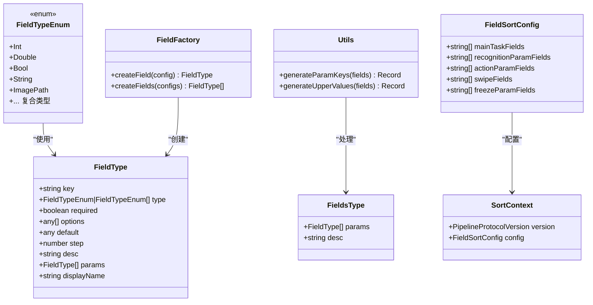
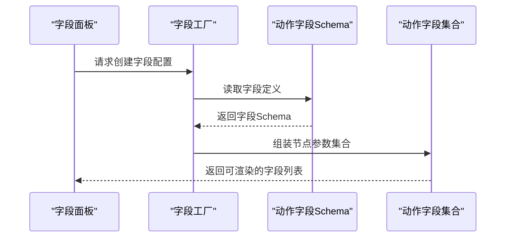
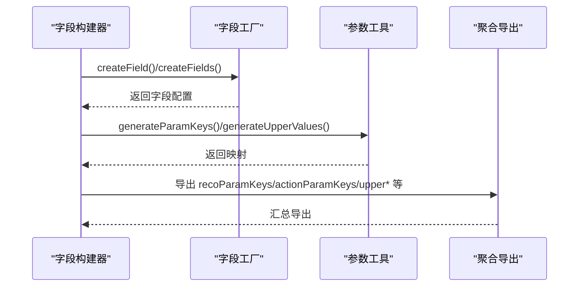
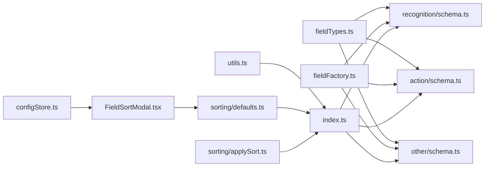

# 字段配置系统

<cite>
**本文档引用的文件**
- [src/core/fields/index.ts](file://src/core/fields/index.ts)
- [src/core/fields/fieldFactory.ts](file://src/core/fields/fieldFactory.ts)
- [src/core/fields/types.ts](file://src/core/fields/types.ts)
- [src/core/fields/utils.ts](file://src/core/fields/utils.ts)
- [src/core/fields/fieldTypes.ts](file://src/core/fields/fieldTypes.ts)
- [src/core/fields/recognition/index.ts](file://src/core/fields/recognition/index.ts)
- [src/core/fields/recognition/schema.ts](file://src/core/fields/recognition/schema.ts)
- [src/core/fields/recognition/fields.ts](file://src/core/fields/recognition/fields.ts)
- [src/core/fields/action/index.ts](file://src/core/fields/action/index.ts)
- [src/core/fields/action/schema.ts](file://src/core/fields/action/schema.ts)
- [src/core/fields/action/fields.ts](file://src/core/fields/action/fields.ts)
- [src/core/fields/other/index.ts](file://src/core/fields/other/index.ts)
- [src/core/fields/other/schema.ts](file://src/core/fields/other/schema.ts)
- [src/core/sorting/index.ts](file://src/core/sorting/index.ts)
- [src/core/sorting/types.ts](file://src/core/sorting/types.ts)
- [src/core/sorting/defaults.ts](file://src/core/sorting/defaults.ts)
- [src/core/sorting/applySort.ts](file://src/core/sorting/applySort.ts)
- [src/components/modals/FieldSortModal.tsx](file://src/components/modals/FieldSortModal.tsx)
- [src/stores/configStore.ts](file://src/stores/configStore.ts)
- [src/core/parser/exporter.ts](file://src/core/parser/exporter.ts)
</cite>

## 更新摘要
**变更内容**
- 新增字段排序功能模块，支持用户自定义不同类型字段的显示顺序
- 集成字段排序配置到导出流程中，确保导出文件的字段顺序符合用户偏好
- 提供可视化拖拽排序界面，支持主任务字段、识别参数、动作参数、滑动参数和冻结参数的独立排序
- 实现排序配置的持久化存储和默认值管理
- **新增滑动字段定义**：在动作字段schema中新增了15个新的滑动字段，包括begin、beginOffset、end、endOffset、swipeDuration、endHold、onlyHover等，支持MultiSwipe动作的复杂滑动场景

## 目录
1. [简介](#简介)
2. [项目结构](#项目结构)
3. [核心组件](#核心组件)
4. [架构总览](#架构总览)
5. [详细组件分析](#详细组件分析)
6. [字段排序系统](#字段排序系统)
7. [依赖关系分析](#依赖关系分析)
8. [性能考量](#性能考量)
9. [故障排查指南](#故障排查指南)
10. [结论](#结论)
11. [附录](#附录)

## 简介
本文件面向字段配置系统，系统性阐述其架构设计与实现原理，涵盖字段工厂模式、类型系统、验证机制、识别字段（recognition）、动作字段（action）、其他参数（other）的定义与使用方法，以及动态生成、参数验证、默认值处理等核心功能。**新增字段排序功能**允许用户自定义不同类型字段的显示顺序，提升用户体验和工作流程效率。同时提供字段扩展开发指南，解释字段与节点数据结构的关系与数据绑定机制。

## 项目结构
字段配置系统位于前端核心模块 src/core/fields 下，采用按功能域分层的组织方式：
- 类型与工厂：types.ts、fieldFactory.ts、fieldTypes.ts、utils.ts
- 识别字段：recognition/schema.ts、recognition/fields.ts、recognition/index.ts
- 动作字段：action/schema.ts、action/fields.ts、action/index.ts
- 其他参数：other/schema.ts、other/index.ts
- **排序系统**：sorting/types.ts、sorting/defaults.ts、sorting/applySort.ts、sorting/index.ts
- 导出聚合：index.ts

```mermaid
graph TB
subgraph "字段系统"
IDX["index.ts<br/>导出聚合"]
FTY["fieldTypes.ts<br/>类型枚举"]
TYP["types.ts<br/>类型定义"]
FAC["fieldFactory.ts<br/>工厂函数"]
UTL["utils.ts<br/>参数生成工具"]
subgraph "识别字段"
RIDX["recognition/index.ts"]
RSCH["recognition/schema.ts"]
RFIE["recognition/fields.ts"]
end
subgraph "动作字段"
AIDX["action/index.ts"]
ASCH["action/schema.ts"]
AFIE["action/fields.ts"]
end
subgraph "其他参数"
OIDX["other/index.ts"]
OSCH["other/schema.ts"]
end
subgraph "排序系统"
STY["sorting/types.ts<br/>类型定义"]
STD["sorting/defaults.ts<br/>默认配置"]
STA["sorting/applySort.ts<br/>排序应用"]
END
end
IDX --> RIDX
IDX --> AIDX
IDX --> OIDX
IDX --> FAC
IDX --> UTL
RIDX --> RSCH
RIDX --> RFIE
AIDX --> ASCH
AIDX --> AFIE
OIDX --> OSCH
FAC --> TYP
UTL --> TYP
FTY --> RSCH
FTY --> ASCH
FTY --> OSCH
STY --> STD
STY --> STA
STD --> FAC
STA --> UTL
```

**图表来源**
- [src/core/fields/index.ts:1-45](file://src/core/fields/index.ts#L1-L45)
- [src/core/fields/fieldFactory.ts:1-16](file://src/core/fields/fieldFactory.ts#L1-L16)
- [src/core/fields/types.ts:1-34](file://src/core/fields/types.ts#L1-L34)
- [src/core/fields/utils.ts:1-41](file://src/core/fields/utils.ts#L1-L41)
- [src/core/fields/fieldTypes.ts:1-27](file://src/core/fields/fieldTypes.ts#L1-L27)
- [src/core/fields/recognition/index.ts:1-3](file://src/core/fields/recognition/index.ts#L1-L3)
- [src/core/fields/recognition/schema.ts:1-276](file://src/core/fields/recognition/schema.ts#L1-L276)
- [src/core/fields/recognition/fields.ts:1-115](file://src/core/fields/recognition/fields.ts#L1-L115)
- [src/core/fields/action/index.ts:1-3](file://src/core/fields/action/index.ts#L1-L3)
- [src/core/fields/action/schema.ts:1-316](file://src/core/fields/action/schema.ts#L1-L316)
- [src/core/fields/action/fields.ts:1-149](file://src/core/fields/action/fields.ts#L1-L149)
- [src/core/fields/other/index.ts:1-8](file://src/core/fields/other/index.ts#L1-L8)
- [src/core/fields/other/schema.ts:1-363](file://src/core/fields/other/schema.ts#L1-L363)
- [src/core/sorting/types.ts:1-28](file://src/core/sorting/types.ts#L1-L28)
- [src/core/sorting/defaults.ts:1-152](file://src/core/sorting/defaults.ts#L1-L152)
- [src/core/sorting/applySort.ts:1-314](file://src/core/sorting/applySort.ts#L1-L314)

**章节来源**
- [src/core/fields/index.ts:1-45](file://src/core/fields/index.ts#L1-L45)

## 核心组件
- 字段类型系统：通过 FieldTypeEnum 定义统一的数据类型，支持基础类型、复合类型（数组/列表/对象）、图片路径等。
- 字段定义类型：FieldType 描述单个字段的键、类型、是否必需、选项、默认值、步长、描述、子参数、显示名等；FieldsType 描述一组字段及其描述。
- 字段工厂：createField/createFields 提供简化的字段定义语法，便于声明式构建。
- 参数生成工具：generateParamKeys 生成参数键集合（全部/必需/必需默认值），generateUpperValues 生成大写映射，便于大小写不敏感查找。
- 识别/动作/其他字段：分别在 recognition、action、other 目录下定义字段 Schema 与具体节点类型映射。
- **字段排序系统**：提供字段排序配置、默认排序规则、排序应用逻辑，支持 v1/v2 协议版本的差异化处理。

**章节来源**
- [src/core/fields/types.ts:1-34](file://src/core/fields/types.ts#L1-L34)
- [src/core/fields/fieldTypes.ts:1-27](file://src/core/fields/fieldTypes.ts#L1-L27)
- [src/core/fields/fieldFactory.ts:1-16](file://src/core/fields/fieldFactory.ts#L1-L16)
- [src/core/fields/utils.ts:1-41](file://src/core/fields/utils.ts#L1-L41)
- [src/core/sorting/types.ts:1-28](file://src/core/sorting/types.ts#L1-L28)

## 架构总览
字段系统采用"类型定义 + Schema + 节点映射 + 工厂 + 工具 + 排序"的分层架构：
- 类型层：统一字段类型与校验依据
- 定义层：各节点类型的字段 Schema 与字段集合映射
- 使用层：通过工厂与工具函数动态生成参数键、默认值映射，供 UI 与解析器使用
- **排序层**：提供字段排序配置与应用逻辑，确保导出文件的字段顺序符合用户偏好
- 导出层：index.ts 聚合导出，形成稳定的对外接口



**图表来源**
- [src/core/fields/types.ts:1-34](file://src/core/fields/types.ts#L1-L34)
- [src/core/fields/fieldTypes.ts:1-27](file://src/core/fields/fieldTypes.ts#L1-L27)
- [src/core/fields/fieldFactory.ts:1-16](file://src/core/fields/fieldFactory.ts#L1-L16)
- [src/core/fields/utils.ts:1-41](file://src/core/fields/utils.ts#L1-L41)
- [src/core/sorting/types.ts:6-27](file://src/core/sorting/types.ts#L6-L27)

## 详细组件分析

### 识别字段（Recognition）
识别字段负责描述各类识别算法所需的参数，如模板匹配、颜色匹配、OCR、特征匹配、神经网络等，并支持组合识别（AND/OR）。

- 字段 Schema：定义 roi、roiOffset、index、template、threshold、method、green_mask、order_by、detector、ratio、lower、upper、count、connected、expected、only_rec、model、color_filter、labels、neuralNetwork* 等参数。
- 节点映射：DirectHit、OCR、TemplateMatch、ColorMatch、Custom、FeatureMatch、And、Or、NeuralNetworkClassify、NeuralNetworkDetect 等节点类型与其参数集合一一对应。
- 键列表：recoFieldSchemaKeyList 基于 Schema 生成唯一键集合，便于去重与遍历。

```mermaid
erDiagram
RECO_SCHEMA {
string key
string[]|string type
boolean required
any[] options
any default
number step
string desc
string displayName
}
RECO_FIELDS {
string node_type
string desc
}
RECO_SCHEMA ||--o{ RECO_FIELDS : "映射到节点参数"
```

**图表来源**
- [src/core/fields/recognition/schema.ts:1-276](file://src/core/fields/recognition/schema.ts#L1-L276)
- [src/core/fields/recognition/fields.ts:1-115](file://src/core/fields/recognition/fields.ts#L1-L115)

**章节来源**
- [src/core/fields/recognition/index.ts:1-3](file://src/core/fields/recognition/index.ts#L1-L3)
- [src/core/fields/recognition/schema.ts:1-276](file://src/core/fields/recognition/schema.ts#L1-L276)
- [src/core/fields/recognition/fields.ts:1-115](file://src/core/fields/recognition/fields.ts#L1-L115)

### 动作字段（Action）
动作字段描述各类动作行为所需的参数，如点击、长按、滑动、滚动、按键、输入、应用控制、命令执行、截图等。

- 字段 Schema：clickTarget、targetOffset、longPress*、begin/end、swipeDuration、endHold、onlyHover、scroll*、dx/dy、swipes、contact、touch*、pressure、clickKey、longPressKey、inputText、package、exec/command、commandArgs、detach、cmd、shellTimeout、screencap*、customAction* 等。
- **新增滑动字段**：在动作字段schema中新增了15个新的滑动字段，包括begin、beginOffset、end、endOffset、swipeDuration、endHold、onlyHover等，支持MultiSwipe动作的复杂滑动场景。
- 节点映射：DoNothing、Click、Custom、Swipe、Scroll、ClickKey、LongPress、MultiSwipe、TouchDown/Move/Up、LongPressKey、KeyDown/KeyUp、InputText、StartApp/StopApp、StopTask、Command、Shell、Screencap、Key 等。
- 键列表：actionFieldSchemaKeyList 基于 Schema 生成唯一键集合。



**图表来源**
- [src/core/fields/action/schema.ts:1-316](file://src/core/fields/action/schema.ts#L1-L316)
- [src/core/fields/action/fields.ts:1-149](file://src/core/fields/action/fields.ts#L1-L149)
- [src/core/fields/fieldFactory.ts:1-16](file://src/core/fields/fieldFactory.ts#L1-L16)

**章节来源**
- [src/core/fields/action/index.ts:1-3](file://src/core/fields/action/index.ts#L1-L3)
- [src/core/fields/action/schema.ts:1-316](file://src/core/fields/action/schema.ts#L1-L316)
- [src/core/fields/action/fields.ts:1-149](file://src/core/fields/action/fields.ts#L1-L149)

### 其他参数（Other）
其他参数用于控制节点的执行策略与生命周期，如速率限制、超时、锚点、反转、启用状态、最大命中次数、前后延迟、等待画面静止、重复执行、附加信息等。

- 字段 Schema：rateLimit、timeout、anchor、inverse、enabled、maxHit、pre/postDelay、pre/post_wait_freezes、repeat、repeatDelay、repeat_wait_freezes、attach 等。
- 参数集合：otherFieldParams、otherFieldParamsWithoutFocus、waitFreezesFields 等，用于 UI 渲染与解析。
- 键列表：otherFieldSchemaKeyList 基于 Schema 生成唯一键集合。


**图表来源**
- [src/core/fields/other/schema.ts:1-363](file://src/core/fields/other/schema.ts#L1-L363)

**章节来源**
- [src/core/fields/other/index.ts:1-8](file://src/core/fields/other/index.ts#L1-L8)
- [src/core/fields/other/schema.ts:1-363](file://src/core/fields/other/schema.ts#L1-L363)

### 字段工厂与工具函数
- 字段工厂：createField/createFields 提供简化的字段定义语法，便于在 Schema 中声明字段。
- 参数生成工具：
  - generateParamKeys：为每个节点类型生成参数键集合（全部、必需、必需默认值），便于 UI 与解析器进行参数校验与默认值注入。
  - generateUpperValues：生成节点类型的大写到小写的映射，便于大小写不敏感的查找与匹配。



**图表来源**
- [src/core/fields/fieldFactory.ts:1-16](file://src/core/fields/fieldFactory.ts#L1-L16)
- [src/core/fields/utils.ts:1-41](file://src/core/fields/utils.ts#L1-L41)
- [src/core/fields/index.ts:36-45](file://src/core/fields/index.ts#L36-L45)

**章节来源**
- [src/core/fields/fieldFactory.ts:1-16](file://src/core/fields/fieldFactory.ts#L1-L16)
- [src/core/fields/utils.ts:1-41](file://src/core/fields/utils.ts#L1-L41)
- [src/core/fields/index.ts:36-45](file://src/core/fields/index.ts#L36-L45)

## 字段排序系统

### 排序配置类型
字段排序系统提供完整的排序配置管理，支持多种字段类型的自定义排序：

- **主任务字段排序**：控制节点主要字段的显示顺序，包括 desc、doc、enabled、max_hit、sub_name、recognition、inverse、pre_wait_freezes、pre_delay、action、anchor、repeat、repeat_wait_freezes、repeat_delay、post_wait_freezes、post_delay、timeout、rate_limit、next、on_error、focus、attach 等。
- **识别参数排序**：控制 recognition.param 内部字段的显示顺序，包括 custom_recognition、custom_recognition_param、roi、roi_offset、template、green_mask、method、detector、ratio、lower、upper、connected、expected、replace、only_rec、model、color_filter、labels、threshold、count、all_of、any_of、box_index、order_by、index 等。
- **动作参数排序**：控制 action.param 内部字段的显示顺序，包括 custom_action、custom_action_param、target、target_offset、begin、begin_offset、end、end_offset、end_hold、only_hover、duration、contact、pressure、swipes、dx、dy、key、input_text、package、exec、args、detach、cmd、shell_timeout、filename、format、quality 等。
- **滑动参数排序**：控制 swipes 数组元素内部字段的显示顺序，基于 swipeFieldSchemaKeyList 动态生成，包含 starting、begin、begin_offset、end、end_offset、duration、end_hold、only_hover、contact、pressure 等15个字段。
- **冻结参数排序**：控制 pre_wait_freezes、post_wait_freezes、repeat_wait_freezes 对象内部字段的显示顺序，包括 time、target、target_offset、threshold、method、rate_limit、timeout 等。

### 排序应用机制
排序系统提供两种协议版本的差异化处理：

- **v2 版本排序**：适用于现代协议版本，支持结构化字段（recognition 和 action）的深度排序，包括嵌套对象和数组元素的排序。
- **v1 版本排序**：适用于传统协议版本，将识别参数和动作参数直接扁平化到节点根级别。

排序应用的核心逻辑包括：
- 按主任务字段顺序遍历节点字段
- 对结构化字段（recognition、action）进行深度排序
- 支持 swipes 数组元素的内部排序
- 对冻结参数对象进行字段排序
- 将 MPE 特色字段保持在末尾

### 可视化排序界面
提供直观的拖拽排序界面，支持以下功能：
- 拖拽调整字段顺序
- 一键重置为默认排序
- 分面板管理不同类型的字段排序
- 实时预览排序效果

**章节来源**
- [src/core/sorting/types.ts:6-27](file://src/core/sorting/types.ts#L6-L27)
- [src/core/sorting/defaults.ts:122-152](file://src/core/sorting/defaults.ts#L122-L152)
- [src/core/sorting/applySort.ts:275-314](file://src/core/sorting/applySort.ts#L275-L314)
- [src/components/modals/FieldSortModal.tsx:106-362](file://src/components/modals/FieldSortModal.tsx#L106-L362)
- [src/stores/configStore.ts:151-152](file://src/stores/configStore.ts#L151-L152)

## 依赖关系分析
- 类型依赖：所有字段 Schema 依赖 FieldTypeEnum 与 FieldType 定义。
- 导出聚合：index.ts 统一导出识别/动作/其他字段的 Schema、键列表、字段集合，以及工厂与工具函数。
- 参数映射：通过 utils 生成的映射供 UI 与解析器使用，避免硬编码键名与默认值。
- **排序集成**：排序系统与字段配置系统紧密集成，通过 applyFieldSort 函数在导出流程中应用用户自定义的字段顺序。



**图表来源**
- [src/core/fields/fieldTypes.ts:1-27](file://src/core/fields/fieldTypes.ts#L1-L27)
- [src/core/fields/fieldFactory.ts:1-16](file://src/core/fields/fieldFactory.ts#L1-L16)
- [src/core/fields/utils.ts:1-41](file://src/core/fields/utils.ts#L1-L41)
- [src/core/fields/index.ts:1-45](file://src/core/fields/index.ts#L1-L45)
- [src/core/sorting/defaults.ts:1-152](file://src/core/sorting/defaults.ts#L1-L152)
- [src/core/sorting/applySort.ts:1-314](file://src/core/sorting/applySort.ts#L1-L314)
- [src/components/modals/FieldSortModal.tsx:1-362](file://src/components/modals/FieldSortModal.tsx#L1-L362)
- [src/stores/configStore.ts:1-281](file://src/stores/configStore.ts#L1-L281)

**章节来源**
- [src/core/fields/index.ts:1-45](file://src/core/fields/index.ts#L1-L45)

## 性能考量
- 参数键生成：generateParamKeys 与 generateUpperValues 仅在初始化阶段执行，避免运行时重复计算。
- 类型校验：通过 FieldTypeEnum 与 options 限制输入范围，减少无效参数带来的运行时开销。
- 结构化字段：params 子字段支持嵌套结构，便于 UI 展示与解析，但应避免过深嵌套导致渲染与序列化成本上升。
- 默认值注入：利用 required_default 与 default 字段，减少 UI 侧的空值判断逻辑。
- **排序性能**：排序操作在导出时执行，使用 Set 数据结构优化字段查找性能，避免重复处理已排序字段。
- **内存优化**：排序过程中使用对象展开语法创建新对象，避免修改原始数据结构。

## 故障排查指南
- 参数缺失：当 required 字段未提供时，UI 应提示用户补齐；解析器可根据 generateParamKeys.requres 列表进行校验。
- 类型不匹配：当字段类型与 FieldTypeEnum 不一致时，应拒绝提交或给出类型转换建议。
- 默认值异常：检查 default 与 required_default 是否合理，避免因默认值导致的误判。
- 键名冲突：确保字段 key 在同一 Schema 内唯一，避免 generateUpperValues 冲突。
- 等待静止参数：当 pre/post_wait_freezes 为对象时，需校验子参数完整性；为整数时按简单模式处理。
- **排序配置问题**：如果排序配置导致导出文件格式异常，检查 FieldSortConfig 的字段列表是否包含有效的字段键名。
- **协议版本兼容性**：确保排序配置与当前使用的协议版本（v1/v2）兼容，避免字段结构不匹配的问题。
- **滑动字段问题**：对于MultiSwipe动作，确保swipes数组中的每个元素都包含必要的滑动参数，如begin、end、duration等。

**章节来源**
- [src/core/fields/utils.ts:6-25](file://src/core/fields/utils.ts#L6-L25)
- [src/core/fields/other/schema.ts:65-119](file://src/core/fields/other/schema.ts#L65-L119)
- [src/core/fields/other/schema.ts:125-179](file://src/core/fields/other/schema.ts#L125-L179)
- [src/core/fields/other/schema.ts:247-301](file://src/core/fields/other/schema.ts#L247-L301)
- [src/core/sorting/applySort.ts:275-314](file://src/core/sorting/applySort.ts#L275-L314)

## 结论
字段配置系统通过清晰的类型定义、Schema 与节点映射、工厂与工具函数，实现了对识别、动作、其他参数的统一管理。**新增的字段排序功能进一步增强了系统的灵活性和用户体验**，允许用户自定义不同类型字段的显示顺序，并通过可视化界面轻松管理排序配置。**新增的滑动字段定义**为复杂的多指滑动场景提供了强大的支持，包括begin、beginOffset、end、endOffset、swipeDuration、endHold、onlyHover等15个字段，满足了MultiSwipe动作的各种需求。系统设计支持动态生成、参数验证与默认值处理，并提供了扩展开发的便捷接口。通过合理的参数键与大小写映射，以及排序配置的持久化存储，系统在 UI 与解析器之间建立了稳定的数据绑定机制。

## 附录

### 字段扩展开发指南
- 新增字段类型
  - 在 fieldTypes.ts 中扩展 FieldTypeEnum，确保与后端/解析器约定一致。
  - 在相应目录的 schema.ts 中新增字段定义，设置 key、type、required、options、default、step、desc、params 等。
  - 在 fields.ts 中将新字段加入目标节点类型 params 列表。
  - 如需 UI 子参数，为 params 字段补充子字段定义。
- 新增节点类型
  - 在 fields.ts 中新增节点类型映射，包含 params 与 desc。
  - 如需特殊处理（如等待静止的整数/对象双模式），在 other/schema.ts 中定义并加入 waitFreezesFields。
- **新增排序支持**
  - 在 sorting/defaults.ts 中为新字段类型添加默认排序配置。
  - 在 sorting/types.ts 中更新 FieldSortConfig 类型定义。
  - 在 sorting/applySort.ts 中实现相应的排序逻辑。
  - 在 FieldSortModal.tsx 中添加对应的排序面板配置。
- **新增滑动字段支持**
  - 在 action/schema.ts 中定义新的滑动相关字段，如begin、beginOffset、end、endOffset、swipeDuration、endHold、onlyHover等。
  - 在 action/fields.ts 中将新字段加入相应的动作节点类型映射。
  - 在 sorting/defaults.ts 中将新字段加入swipeFieldSchemaKeyList的默认排序配置。
  - 在 FieldSortModal.tsx 中为swipe面板添加新字段的排序选项。
- 导出与使用
  - 通过 index.ts 聚合导出新字段与节点映射，确保 UI 与解析器可访问。
  - 使用 generateParamKeys 与 generateUpperValues 生成参数键与大小写映射，供 UI 与解析器使用。
  - **排序配置通过 configStore 持久化存储，支持用户自定义排序偏好**。

**章节来源**
- [src/core/fields/fieldTypes.ts:1-27](file://src/core/fields/fieldTypes.ts#L1-L27)
- [src/core/fields/recognition/schema.ts:1-276](file://src/core/fields/recognition/schema.ts#L1-L276)
- [src/core/fields/action/schema.ts:1-316](file://src/core/fields/action/schema.ts#L1-L316)
- [src/core/fields/other/schema.ts:1-363](file://src/core/fields/other/schema.ts#L1-L363)
- [src/core/fields/recognition/fields.ts:1-115](file://src/core/fields/recognition/fields.ts#L1-L115)
- [src/core/fields/action/fields.ts:1-149](file://src/core/fields/action/fields.ts#L1-L149)
- [src/core/fields/index.ts:1-45](file://src/core/fields/index.ts#L1-L45)
- [src/core/sorting/defaults.ts:1-152](file://src/core/sorting/defaults.ts#L1-L152)
- [src/core/sorting/types.ts:1-28](file://src/core/sorting/types.ts#L1-L28)
- [src/core/sorting/applySort.ts:1-314](file://src/core/sorting/applySort.ts#L1-L314)
- [src/components/modals/FieldSortModal.tsx:1-362](file://src/components/modals/FieldSortModal.tsx#L1-L362)
- [src/stores/configStore.ts:151-152](file://src/stores/configStore.ts#L151-L152)