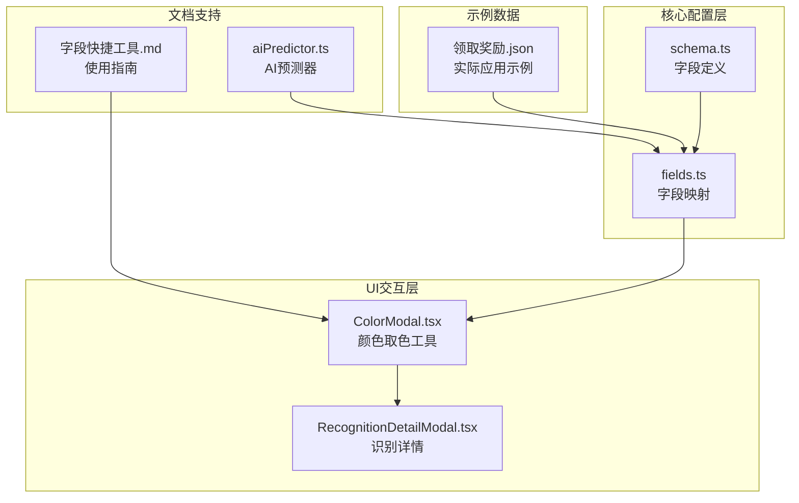
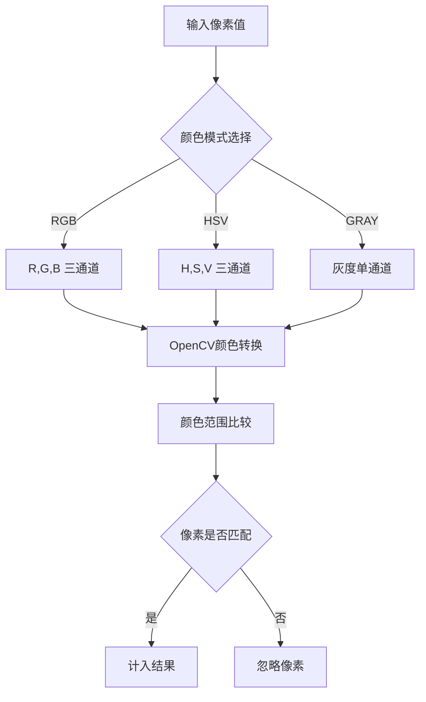
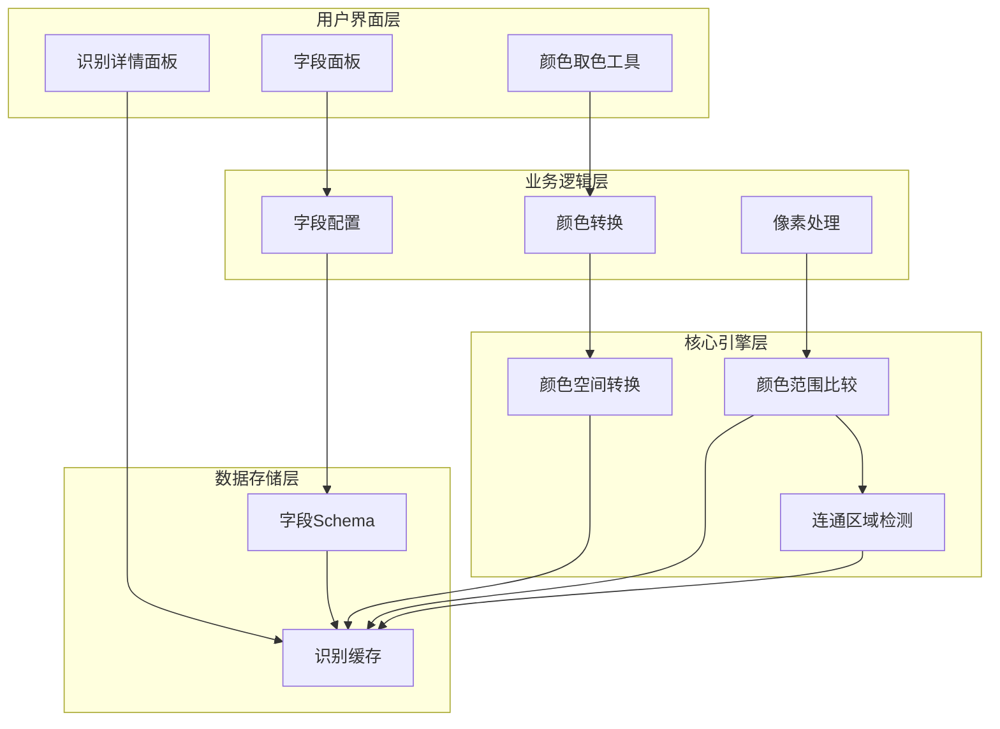
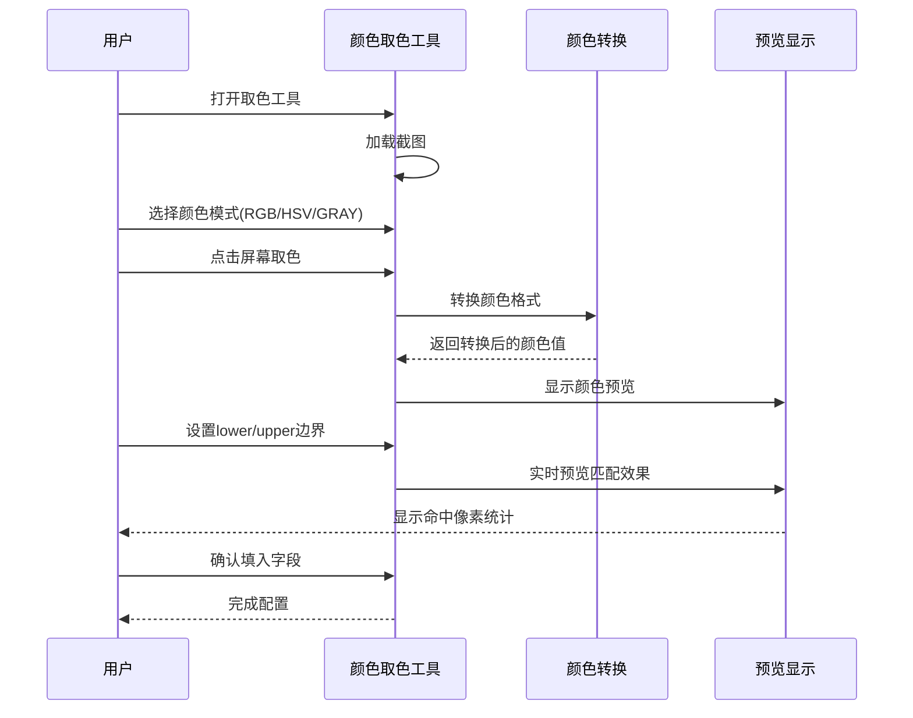
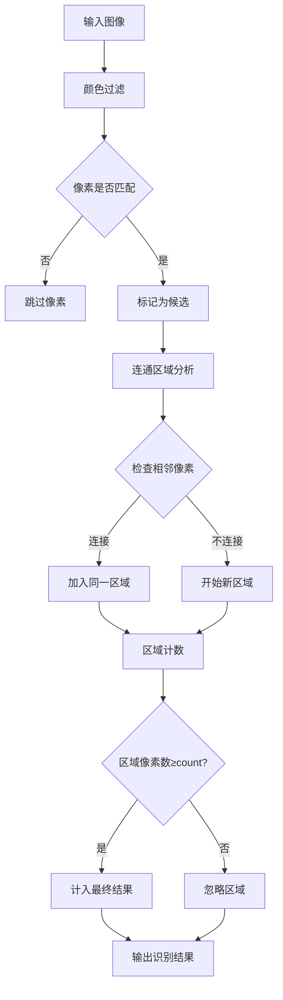
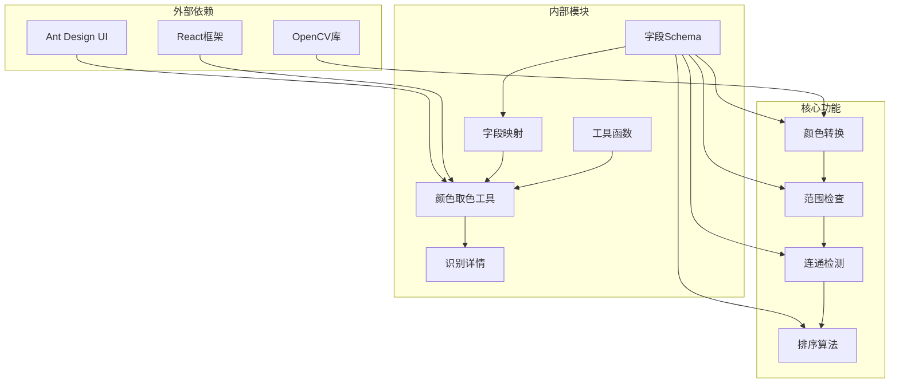
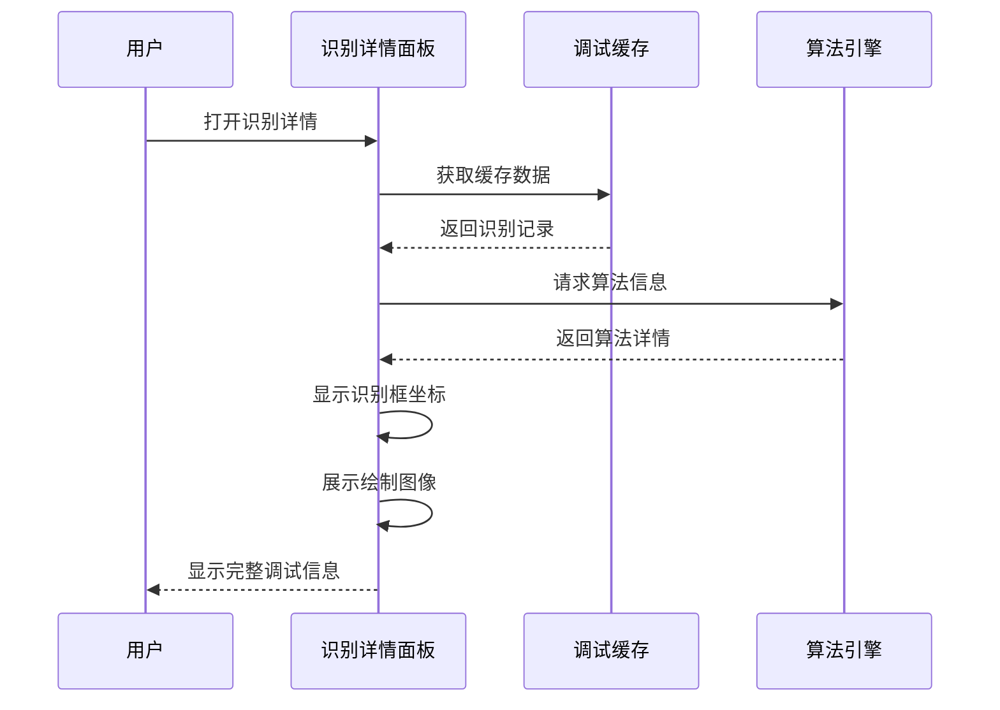

# ColorMatch 颜色匹配识别

<cite>
**本文档引用的文件**
- [schema.ts](file://src/core/fields/recognition/schema.ts)
- [fields.ts](file://src/core/fields/recognition/fields.ts)
- [ColorModal.tsx](file://src/components/modals/ColorModal.tsx)
- [字段快捷工具.md](file://docsite/docs/01.指南/20.本地服务/20.字段快捷工具.md)
- [aiPredictor.ts](file://src/utils/aiPredictor.ts)
- [RecognitionDetailModal.tsx](file://src/components/panels/tools/RecognitionDetailModal.tsx)
- [领取奖励.json](file://LocalBridge/test-json/base/pipeline/日常任务/领取奖励.json)
</cite>

## 目录
1. [简介](#简介)
2. [项目结构](#项目结构)
3. [核心组件](#核心组件)
4. [架构概览](#架构概览)
5. [详细组件分析](#详细组件分析)
6. [依赖关系分析](#依赖关系分析)
7. [性能考量](#性能考量)
8. [故障排除指南](#故障排除指南)
9. [结论](#结论)
10. [附录](#附录)

## 简介

ColorMatch 是 MAA Pipeline Editor 中的核心识别组件之一，专门用于在游戏自动化中进行颜色匹配识别。该组件通过颜色空间转换、颜色范围设置、阈值配置等参数，实现对特定颜色区域的精确识别。

在游戏自动化领域，ColorMatch 主要应用于：
- 按钮状态识别（如开启/关闭状态的指示灯）
- 特殊标记点检测（如任务目标、交互点）
- 界面元素识别（如特定颜色的图标、装饰元素）
- 游戏内状态监控（如血量条、蓝量条的颜色变化）

## 项目结构

ColorMatch 功能在项目中的组织结构如下：

**图表来源**
- [schema.ts:116-148](file://src/core/fields/recognition/schema.ts#L116-L148)
- [fields.ts:40-52](file://src/core/fields/recognition/fields.ts#L40-L52)

**章节来源**
- [schema.ts:1-276](file://src/core/fields/recognition/schema.ts#L1-L276)
- [fields.ts:1-94](file://src/core/fields/recognition/fields.ts#L1-L94)

## 核心组件

### 字段定义系统

ColorMatch 的核心参数通过统一的字段定义系统进行管理：

| 字段名称 | 类型 | 默认值 | 描述 |
|---------|------|--------|------|
| method | 整数 | 4 | 颜色匹配方式（4=RGB, 40=HSV, 6=GRAY） |
| lower | 数组 | [0,0,0] | 颜色下限值 |
| upper | 数组 | [255,255,255] | 颜色上限值 |
| count | 整数 | 1 | 符合的像素点最低数量 |
| connected | 布尔值 | true | 是否要求像素点相连 |
| roi | 数组 | [0,0,0,0] | 感兴趣区域 |
| roi_offset | 数组 | [0,0,0,0] | ROI偏移量 |
| order_by | 字符串 | "Horizontal" | 结果排序方式 |
| index | 整数 | 0 | 命中第几个结果 |

### 颜色空间支持

ColorMatch 支持三种主要颜色空间：

**图表来源**
- [schema.ts:117-148](file://src/core/fields/recognition/schema.ts#L117-L148)
- [ColorModal.tsx:101-191](file://src/components/modals/ColorModal.tsx#L101-L191)

**章节来源**
- [schema.ts:116-148](file://src/core/fields/recognition/schema.ts#L116-L148)
- [ColorModal.tsx:194-207](file://src/components/modals/ColorModal.tsx#L194-L207)

## 架构概览

ColorMatch 的整体架构采用分层设计，确保了功能的模块化和可扩展性：

**图表来源**
- [fields.ts:40-52](file://src/core/fields/recognition/fields.ts#L40-L52)
- [schema.ts:116-148](file://src/core/fields/recognition/schema.ts#L116-L148)

## 详细组件分析

### 颜色取色工具

颜色取色工具提供了完整的颜色识别和预览功能：

**图表来源**
- [ColorModal.tsx:346-405](file://src/components/modals/ColorModal.tsx#L346-L405)
- [字段快捷工具.md:227-261](file://docsite/docs/01.指南/20.本地服务/20.字段快捷工具.md#L227-L261)

#### 颜色转换算法

工具实现了完整的颜色空间转换功能：

| 转换方向 | 算法实现 | 应用场景 |
|---------|----------|----------|
| RGB → HSV | 标准HSV转换公式 | 光照变化场景识别 |
| HSV → RGB | 反向HSV转换 | 颜色值回显显示 |
| RGB → GRAY | 标准灰度转换 | 灰度图像处理 |
| GRAY → RGB | 灰度到RGB映射 | 统一显示格式 |

**章节来源**
- [ColorModal.tsx:101-191](file://src/components/modals/ColorModal.tsx#L101-L191)
- [ColorModal.tsx:232-331](file://src/components/modals/ColorModal.tsx#L232-L331)

### 连通区域检测

ColorMatch 实现了基于像素连通性的区域检测机制：

**图表来源**
- [schema.ts:137-148](file://src/core/fields/recognition/schema.ts#L137-L148)
- [fields.ts:40-52](file://src/core/fields/recognition/fields.ts#L40-L52)

**章节来源**
- [schema.ts:137-148](file://src/core/fields/recognition/schema.ts#L137-L148)
- [aiPredictor.ts:316-325](file://src/utils/aiPredictor.ts#L316-L325)

### 排序和索引机制

ColorMatch 支持多种排序策略和结果索引：

| 排序方式 | 计算规则 | 适用场景 |
|---------|----------|----------|
| Horizontal | 按X坐标从小到大 | 从左到右的线性排列 |
| Vertical | 按Y坐标从小到大 | 从上到下的线性排列 |
| Area | 按区域面积降序 | 优先处理大面积目标 |
| Score | 按匹配置信度降序 | 优先处理高质量匹配 |
| Random | 随机排序 | 避免固定模式依赖 |

**章节来源**
- [schema.ts:65-92](file://src/core/fields/recognition/schema.ts#L65-L92)
- [fields.ts:40-52](file://src/core/fields/recognition/fields.ts#L40-L52)

## 依赖关系分析

ColorMatch 组件间的依赖关系体现了清晰的分层架构：

**图表来源**
- [schema.ts:1-276](file://src/core/fields/recognition/schema.ts#L1-L276)
- [fields.ts:1-94](file://src/core/fields/recognition/fields.ts#L1-L94)

**章节来源**
- [schema.ts:1-276](file://src/core/fields/recognition/schema.ts#L1-L276)
- [fields.ts:1-94](file://src/core/fields/recognition/fields.ts#L1-L94)

## 性能考量

### 算法复杂度分析

ColorMatch 的主要计算开销来自像素级别的颜色比较和连通区域分析：

- **颜色过滤阶段**: O(W×H×C)，其中W为宽度，H为高度，C为通道数
- **连通区域检测**: O(N)，N为匹配像素数量
- **排序阶段**: O(M log M)，M为区域数量

### 优化策略

1. **ROI限制**: 通过合理的感兴趣区域设置，减少不必要的像素处理
2. **颜色空间选择**: 在光照变化场景优先使用HSV模式
3. **阈值优化**: 合理设置count和connected参数，避免过度计算
4. **缓存机制**: 利用识别缓存减少重复计算

## 故障排除指南

### 常见问题及解决方案

| 问题类型 | 症状描述 | 可能原因 | 解决方案 |
|---------|----------|----------|----------|
| 识别不准确 | 颜色边界模糊 | lower/upper设置不当 | 使用颜色取色工具微调边界 |
| 光照敏感 | 明暗环境下识别失败 | 使用RGB模式 | 切换到HSV模式 |
| 性能问题 | 识别响应缓慢 | ROI过大 | 缩小识别区域 |
| 连接错误 | 分离的相同颜色被分开计数 | connected参数设置 | 调整connected为true/false |

### 调试工具使用

识别详情面板提供了完整的调试信息：

**图表来源**
- [RecognitionDetailModal.tsx:132-247](file://src/components/panels/tools/RecognitionDetailModal.tsx#L132-L247)

**章节来源**
- [RecognitionDetailModal.tsx:1-261](file://src/components/panels/tools/RecognitionDetailModal.tsx#L1-261)

## 结论

ColorMatch 作为 MAA Pipeline Editor 的核心识别组件，通过精心设计的字段系统、完善的颜色处理能力和直观的用户界面，为游戏自动化提供了强大而灵活的颜色匹配识别能力。

其主要优势包括：
- **多模式支持**: RGB、HSV、GRAY三种颜色空间的全面支持
- **智能预览**: 实时颜色范围预览和统计反馈
- **灵活配置**: 丰富的参数选项满足不同应用场景需求
- **性能优化**: 合理的算法设计和优化策略
- **易用性**: 直观的用户界面和完善的调试工具

通过合理配置和参数调优，ColorMatch 能够在各种复杂的游戏中实现稳定可靠的颜色匹配识别，为自动化脚本提供坚实的技术基础。

## 附录

### 实际应用场景示例

基于项目中的实际应用示例，ColorMatch 可以应用于以下场景：

1. **任务状态识别**: 通过特定颜色识别任务完成状态
2. **界面元素检测**: 识别游戏界面中的特殊图标或装饰元素
3. **状态监控**: 监控游戏内血量、蓝量等状态变化
4. **交互点定位**: 识别可点击的按钮或交互区域

### 参数配置最佳实践

- **颜色模式选择**: 根据光照条件选择合适的颜色空间
- **阈值设置**: 从保守值开始，逐步调整以获得最佳效果
- **ROI优化**: 精确设置识别区域，避免不必要的计算
- **排序策略**: 根据业务逻辑选择合适的排序方式