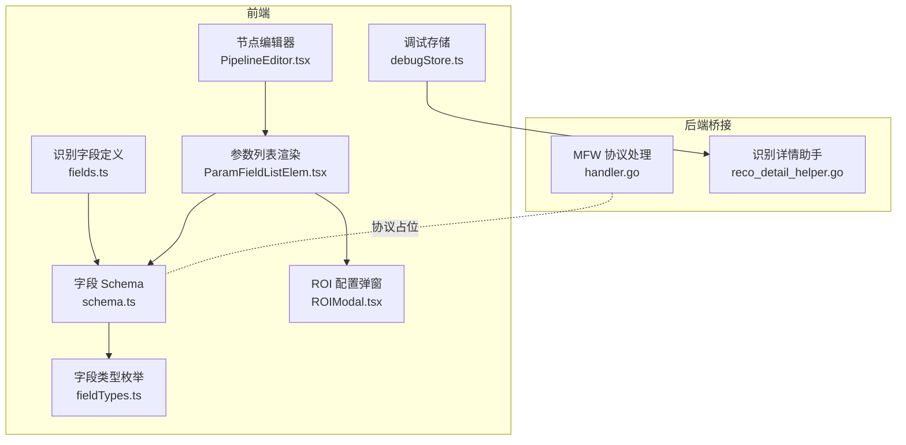
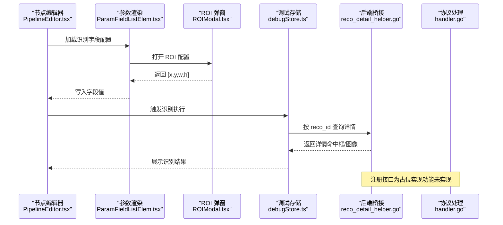
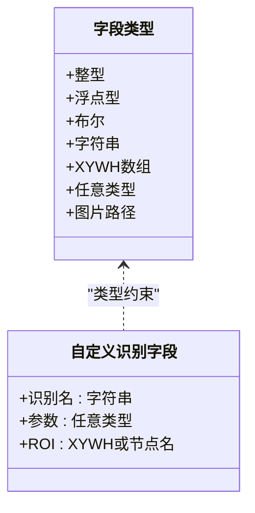
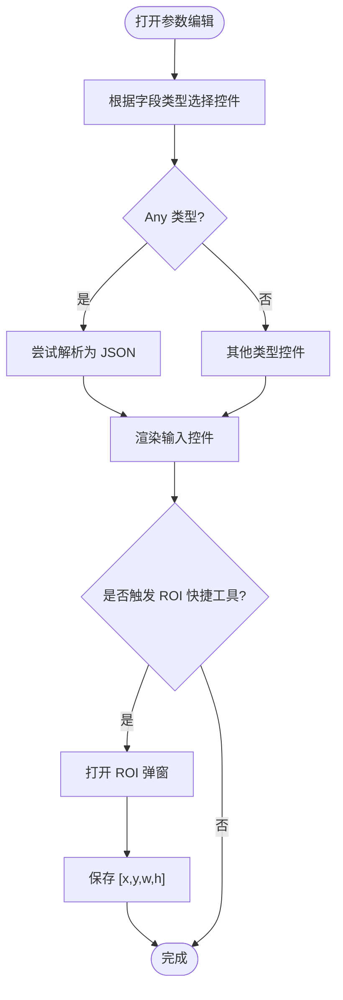
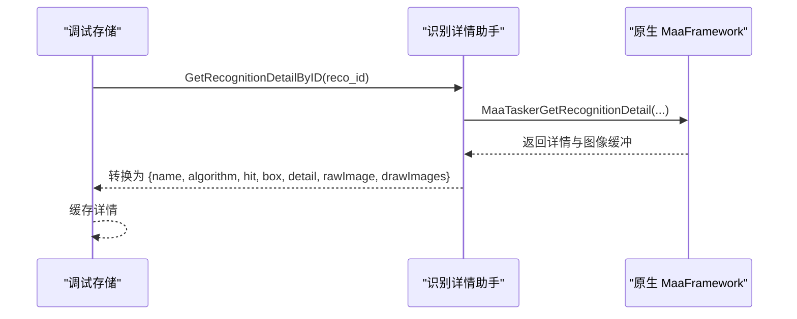
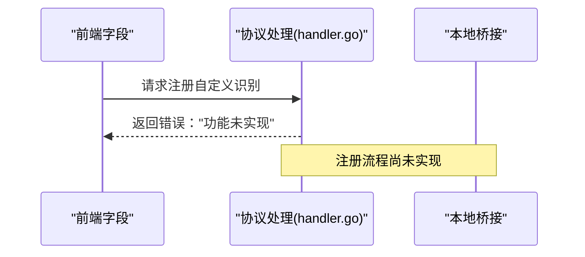
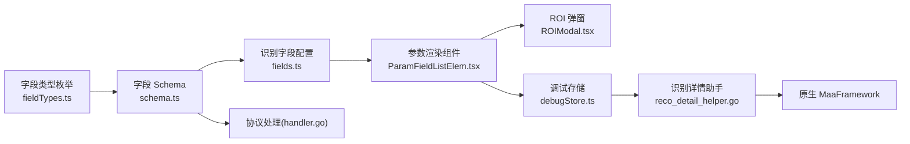

# Custom 自定义识别

<cite>
**本文档引用的文件**
- [fields.ts](file://src/core/fields/recognition/fields.ts)
- [schema.ts](file://src/core/fields/recognition/schema.ts)
- [fieldTypes.ts](file://src/core/fields/fieldTypes.ts)
- [ParamFieldListElem.tsx](file://src/components/panels/field/items/ParamFieldListElem.tsx)
- [ROIModal.tsx](file://src/components/modals/ROIModal.tsx)
- [PipelineEditor.tsx](file://src/components/panels/node-editors/PipelineEditor.tsx)
- [handler.go](file://LocalBridge/internal/protocol/mfw/handler.go)
- [reco_detail_helper.go](file://LocalBridge/internal/mfw/reco_detail_helper.go)
- [debugStore.ts](file://src/stores/debugStore.ts)
</cite>

## 目录
1. [简介](#简介)
2. [项目结构](#项目结构)
3. [核心组件](#核心组件)
4. [架构总览](#架构总览)
5. [详细组件分析](#详细组件分析)
6. [依赖关系分析](#依赖关系分析)
7. [性能考量](#性能考量)
8. [故障排查指南](#故障排查指南)
9. [结论](#结论)
10. [附录](#附录)

## 简介
本文件面向“Custom 自定义识别”字段，系统性说明其注册机制、使用方法、参数传递与 ROI 设置等关键要素，并提供开发与集成指南、实际应用场景与最佳实践建议。当前仓库中，前端已完整支持 Custom 识别字段的参数编辑与可视化，后端协议侧对“自定义识别注册”的处理仍处于占位状态，尚未实现具体注册流程。

## 项目结构
围绕 Custom 自定义识别的关键文件分布如下：
- 字段定义与类型：识别字段配置、字段类型枚举
- UI 编辑器：参数渲染、快捷工具、ROI 配置弹窗
- 后端桥接：协议处理与识别详情获取
- 调试存储：识别记录与详情缓存

**图表来源**
- [fields.ts:54-62](file://src/core/fields/recognition/fields.ts#L54-L62)
- [schema.ts:248-268](file://src/core/fields/recognition/schema.ts#L248-L268)
- [fieldTypes.ts:4-26](file://src/core/fields/fieldTypes.ts#L4-L26)
- [ParamFieldListElem.tsx:72-775](file://src/components/panels/field/items/ParamFieldListElem.tsx#L72-L775)
- [ROIModal.tsx:1-564](file://src/components/modals/ROIModal.tsx#L1-L564)
- [PipelineEditor.tsx:346-383](file://src/components/panels/node-editors/PipelineEditor.tsx#L346-L383)
- [handler.go:802-806](file://LocalBridge/internal/protocol/mfw/handler.go#L802-L806)
- [reco_detail_helper.go:168-267](file://LocalBridge/internal/mfw/reco_detail_helper.go#L168-L267)

**章节来源**
- [fields.ts:54-62](file://src/core/fields/recognition/fields.ts#L54-L62)
- [schema.ts:248-268](file://src/core/fields/recognition/schema.ts#L248-L268)
- [fieldTypes.ts:4-26](file://src/core/fields/fieldTypes.ts#L4-L26)
- [ParamFieldListElem.tsx:72-775](file://src/components/panels/field/items/ParamFieldListElem.tsx#L72-L775)
- [ROIModal.tsx:1-564](file://src/components/modals/ROIModal.tsx#L1-L564)
- [PipelineEditor.tsx:346-383](file://src/components/panels/node-editors/PipelineEditor.tsx#L346-L383)
- [handler.go:802-806](file://LocalBridge/internal/protocol/mfw/handler.go#L802-L806)
- [reco_detail_helper.go:168-267](file://LocalBridge/internal/mfw/reco_detail_helper.go#L168-L267)

## 核心组件
- 自定义识别字段定义
  - 字段键：custom_recognition、custom_recognition_param、roi（自定义识别专用）
  - 类型：字符串、任意类型、XYWH 或节点名字符串
  - 默认值：识别名必填，参数默认空对象，ROI 默认全屏
- 字段类型枚举
  - 支持 XYWH、Any、String 等类型，用于参数校验与 UI 渲染
- 参数渲染与快捷工具
  - 通过参数列表组件渲染字段输入，支持 Any 类型的 JSON 文本编辑
  - 提供 ROI 快捷配置弹窗，支持负数坐标与分割区域提示
- 调试与详情
  - 识别记录与详情缓存，支持按 reco_id 获取识别详情（含命中框、原始图、绘制图）

**章节来源**
- [fields.ts:54-62](file://src/core/fields/recognition/fields.ts#L54-L62)
- [schema.ts:248-268](file://src/core/fields/recognition/schema.ts#L248-L268)
- [fieldTypes.ts:4-26](file://src/core/fields/fieldTypes.ts#L4-L26)
- [ParamFieldListElem.tsx:584-609](file://src/components/panels/field/items/ParamFieldListElem.tsx#L584-L609)
- [ROIModal.tsx:346-362](file://src/components/modals/ROIModal.tsx#L346-L362)
- [debugStore.ts:105-122](file://src/stores/debugStore.ts#L105-L122)

## 架构总览
Custom 自定义识别在前端通过字段 Schema 与参数渲染组件完成配置，在后端桥接层负责协议处理与识别详情获取。当前注册接口在协议层为占位实现，尚未下发到底层框架。

**图表来源**
- [PipelineEditor.tsx:346-383](file://src/components/panels/node-editors/PipelineEditor.tsx#L346-L383)
- [ParamFieldListElem.tsx:115-221](file://src/components/panels/field/items/ParamFieldListElem.tsx#L115-L221)
- [ROIModal.tsx:218-232](file://src/components/modals/ROIModal.tsx#L218-L232)
- [debugStore.ts:878-896](file://src/stores/debugStore.ts#L878-L896)
- [reco_detail_helper.go:168-267](file://LocalBridge/internal/mfw/reco_detail_helper.go#L168-L267)
- [handler.go:802-806](file://LocalBridge/internal/protocol/mfw/handler.go#L802-L806)

## 详细组件分析

### 字段定义与类型
- Custom 识别字段
  - custom_recognition：必填字符串，对应注册时的识别名
  - custom_recognition_param：可选任意类型参数，透传给回调
  - roi（自定义识别专用）：可选，支持 XYWH 或引用前置节点名
- 字段类型
  - XYWH：四元数组 [x, y, w, h]
  - Any：JSON 文本自动解析
  - String：字符串

**图表来源**
- [fieldTypes.ts:4-26](file://src/core/fields/fieldTypes.ts#L4-L26)
- [schema.ts:248-268](file://src/core/fields/recognition/schema.ts#L248-L268)

**章节来源**
- [fields.ts:54-62](file://src/core/fields/recognition/fields.ts#L54-L62)
- [schema.ts:248-268](file://src/core/fields/recognition/schema.ts#L248-L268)
- [fieldTypes.ts:4-26](file://src/core/fields/fieldTypes.ts#L4-L26)

### 参数渲染与交互
- 参数渲染组件根据字段类型生成输入控件
  - Any 类型：文本域，尝试解析为 JSON，否则保留字符串
  - XYWH：数字输入，支持负数坐标与分割提示
  - 快捷工具：ROI、OCR、模板、颜色、位移等
- ROI 配置弹窗
  - 支持拖拽框选、手动输入坐标
  - 负数坐标解析与分割区域高亮展示

**图表来源**
- [ParamFieldListElem.tsx:584-609](file://src/components/panels/field/items/ParamFieldListElem.tsx#L584-L609)
- [ROIModal.tsx:218-232](file://src/components/modals/ROIModal.tsx#L218-L232)

**章节来源**
- [ParamFieldListElem.tsx:72-775](file://src/components/panels/field/items/ParamFieldListElem.tsx#L72-L775)
- [ROIModal.tsx:1-564](file://src/components/modals/ROIModal.tsx#L1-L564)

### 调试与识别详情
- 调试存储维护识别记录与详情缓存
  - 通过 reco_id 获取识别详情（命中框、原始图、绘制图）
- 识别详情助手
  - 通过原生 API 获取识别详情并转换为前端可用格式

**图表来源**
- [debugStore.ts:878-896](file://src/stores/debugStore.ts#L878-L896)
- [reco_detail_helper.go:168-267](file://LocalBridge/internal/mfw/reco_detail_helper.go#L168-L267)

**章节来源**
- [debugStore.ts:105-122](file://src/stores/debugStore.ts#L105-L122)
- [reco_detail_helper.go:168-267](file://LocalBridge/internal/mfw/reco_detail_helper.go#L168-L267)

### 注册机制与协议占位
- 当前协议层对“自定义识别注册”接口返回“功能未实现”，属于占位实现
- 前端字段已完整支持配置，后端需补充注册流程方可生效

**图表来源**
- [handler.go:802-806](file://LocalBridge/internal/protocol/mfw/handler.go#L802-L806)

**章节来源**
- [handler.go:802-806](file://LocalBridge/internal/protocol/mfw/handler.go#L802-L806)

## 依赖关系分析
- 字段定义依赖字段类型枚举，确保参数类型约束
- 参数渲染组件依赖字段 Schema，动态生成输入控件
- ROI 弹窗为参数渲染组件的快捷工具之一
- 调试存储依赖识别详情助手，后者依赖原生 MaaFramework
- 协议处理层与识别详情助手相互独立，前者为占位实现

**图表来源**
- [fieldTypes.ts:4-26](file://src/core/fields/fieldTypes.ts#L4-L26)
- [schema.ts:248-268](file://src/core/fields/recognition/schema.ts#L248-L268)
- [fields.ts:54-62](file://src/core/fields/recognition/fields.ts#L54-L62)
- [ParamFieldListElem.tsx:72-775](file://src/components/panels/field/items/ParamFieldListElem.tsx#L72-L775)
- [ROIModal.tsx:1-564](file://src/components/modals/ROIModal.tsx#L1-L564)
- [debugStore.ts:878-896](file://src/stores/debugStore.ts#L878-L896)
- [reco_detail_helper.go:168-267](file://LocalBridge/internal/mfw/reco_detail_helper.go#L168-L267)
- [handler.go:802-806](file://LocalBridge/internal/protocol/mfw/handler.go#L802-L806)

**章节来源**
- [fieldTypes.ts:4-26](file://src/core/fields/fieldTypes.ts#L4-L26)
- [schema.ts:248-268](file://src/core/fields/recognition/schema.ts#L248-L268)
- [fields.ts:54-62](file://src/core/fields/recognition/fields.ts#L54-L62)
- [ParamFieldListElem.tsx:72-775](file://src/components/panels/field/items/ParamFieldListElem.tsx#L72-L775)
- [ROIModal.tsx:1-564](file://src/components/modals/ROIModal.tsx#L1-L564)
- [debugStore.ts:878-896](file://src/stores/debugStore.ts#L878-L896)
- [reco_detail_helper.go:168-267](file://LocalBridge/internal/mfw/reco_detail_helper.go#L168-L267)
- [handler.go:802-806](file://LocalBridge/internal/protocol/mfw/handler.go#L802-L806)

## 性能考量
- ROI 设置
  - 尽量缩小识别区域，避免全屏扫描
  - 负数坐标与分割区域需谨慎使用，避免重复计算
- 参数类型
  - Any 类型参数过大可能增加序列化与传输开销
- 识别详情
  - 原始图与绘制图的 base64 编码会增加内存与带宽消耗，建议按需获取与缓存

[本节为通用建议，无需特定文件引用]

## 故障排查指南
- 注册接口报错
  - 现象：请求注册自定义识别返回“功能未实现”
  - 处理：等待后端补齐注册流程，或临时使用占位实现进行联调
- ROI 配置异常
  - 现象：负数坐标或分割区域显示异常
  - 处理：检查坐标输入与图片尺寸，确认负数解析逻辑
- 识别详情为空
  - 现象：按 reco_id 查询不到详情
  - 处理：确认识别已执行且 reco_id 正确，检查原生 API 初始化与缓冲区状态

**章节来源**
- [handler.go:802-806](file://LocalBridge/internal/protocol/mfw/handler.go#L802-L806)
- [ROIModal.tsx:516-557](file://src/components/modals/ROIModal.tsx#L516-L557)
- [reco_detail_helper.go:168-267](file://LocalBridge/internal/mfw/reco_detail_helper.go#L168-L267)

## 结论
- 前端已完整支持 Custom 自定义识别字段的配置与可视化
- 后端协议层对注册接口为占位实现，尚未下发到底层框架
- 建议优先完善后端注册流程，随后结合前端配置进行端到端验证

[本节为总结，无需特定文件引用]

## 附录

### 开发与集成指南
- 前端集成
  - 在识别字段配置中添加自定义识别项，确保字段键与类型正确
  - 使用参数渲染组件与 ROI 弹窗完成参数编辑
- 后端集成
  - 实现自定义识别注册接口，将识别器句柄与识别名绑定
  - 确保回调中正确透传识别名、参数与 ROI
- 调试与验证
  - 通过调试存储查看识别记录与详情缓存
  - 使用识别详情助手获取命中框与图像，辅助定位问题

**章节来源**
- [fields.ts:54-62](file://src/core/fields/recognition/fields.ts#L54-L62)
- [schema.ts:248-268](file://src/core/fields/recognition/schema.ts#L248-L268)
- [ParamFieldListElem.tsx:72-775](file://src/components/panels/field/items/ParamFieldListElem.tsx#L72-L775)
- [ROIModal.tsx:1-564](file://src/components/modals/ROIModal.tsx#L1-L564)
- [debugStore.ts:878-896](file://src/stores/debugStore.ts#L878-L896)
- [reco_detail_helper.go:168-267](file://LocalBridge/internal/mfw/reco_detail_helper.go#L168-L267)
- [handler.go:802-806](file://LocalBridge/internal/protocol/mfw/handler.go#L802-L806)

### 实际应用场景与最佳实践
- 场景
  - 需要跨项目复用的复杂识别逻辑
  - 需要结合业务上下文的定制化识别策略
- 最佳实践
  - 明确识别名与参数结构，便于前后端协作
  - 合理设置 ROI，减少无效计算
  - 使用 Any 类型参数时注意序列化与版本兼容
  - 通过调试存储与识别详情助手持续验证识别效果

[本节为通用建议，无需特定文件引用]