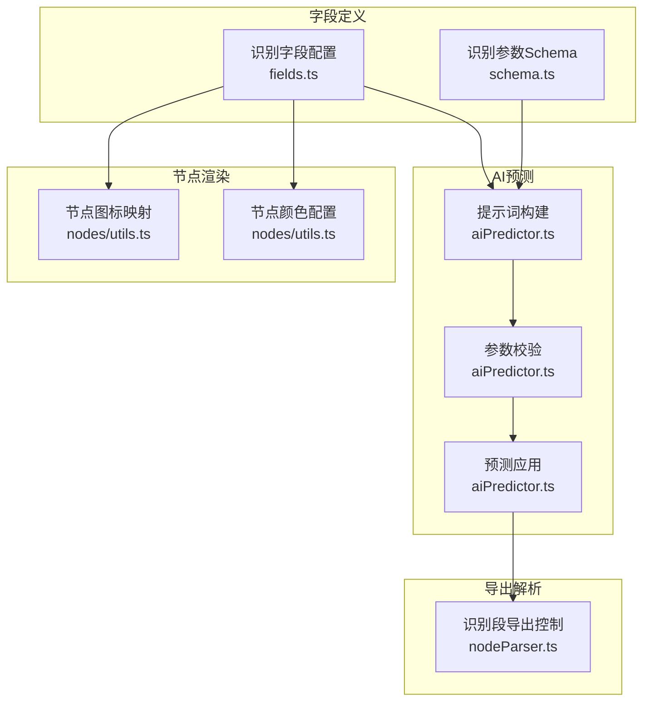
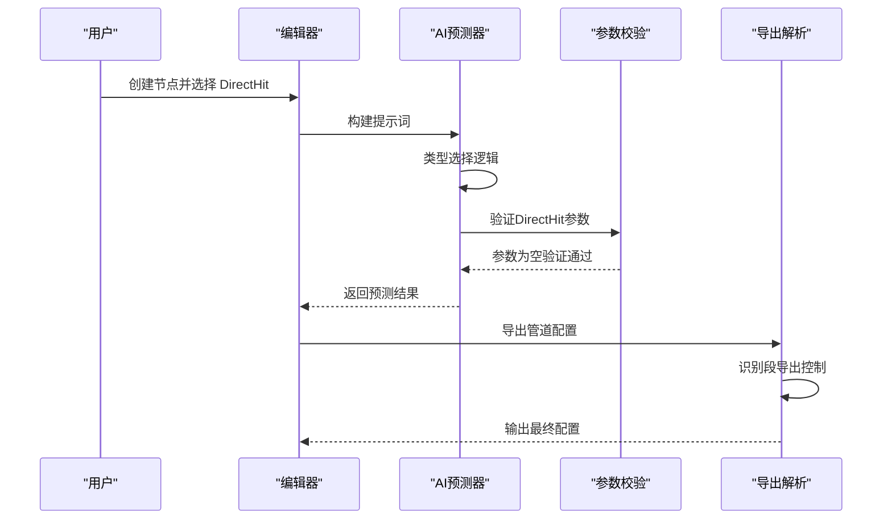
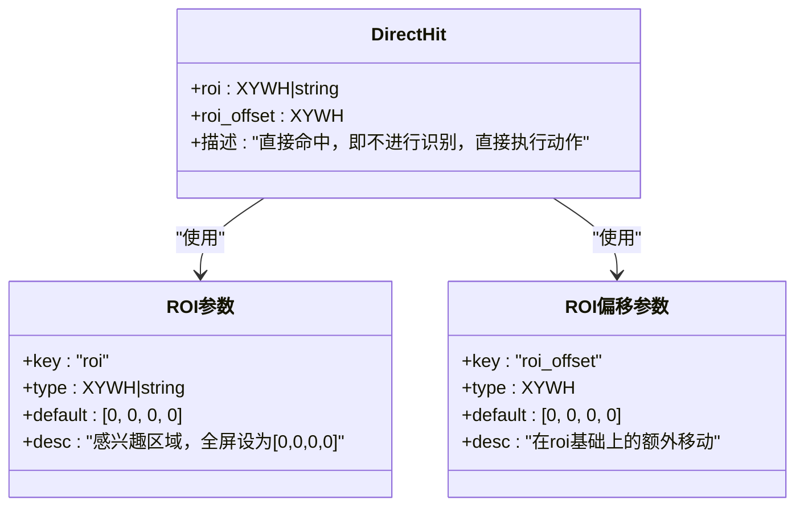
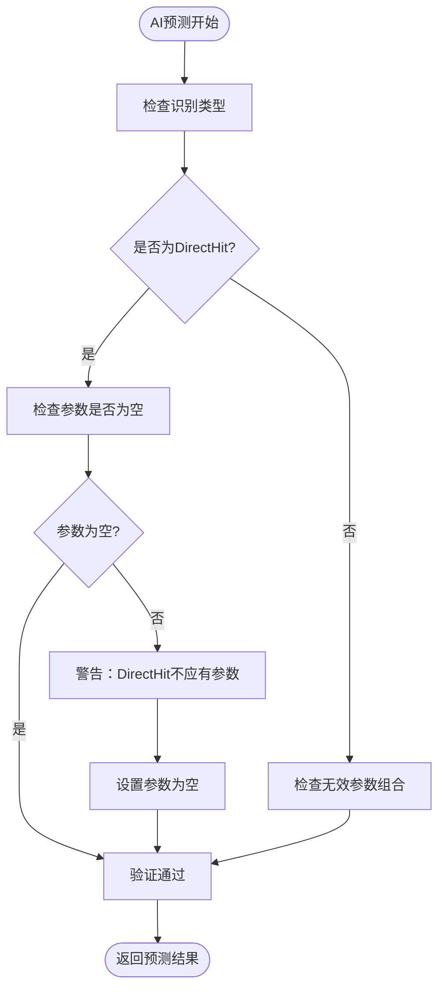
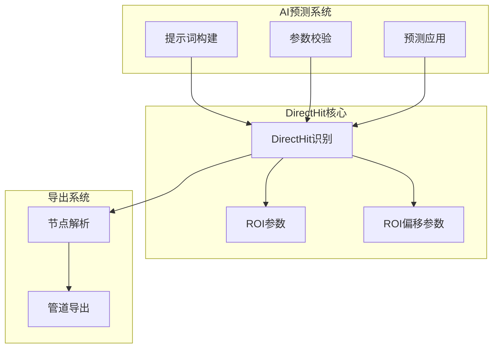

# DirectHit 直接命中识别

<cite>
**本文档引用的文件**
- [src/core/fields/recognition/fields.ts](file://src/core/fields/recognition/fields.ts)
- [src/core/fields/recognition/schema.ts](file://src/core/fields/recognition/schema.ts)
- [src/utils/aiPredictor.ts](file://src/utils/aiPredictor.ts)
- [src/components/flow/nodes/utils.ts](file://src/components/flow/nodes/utils.ts)
- [src/core/parser/nodeParser.ts](file://src/core/parser/nodeParser.ts)
</cite>

## 目录
1. [简介](#简介)
2. [项目结构](#项目结构)
3. [核心组件](#核心组件)
4. [架构总览](#架构总览)
5. [详细组件分析](#详细组件分析)
6. [依赖关系分析](#依赖关系分析)
7. [性能考量](#性能考量)
8. [故障排查指南](#故障排查指南)
9. [结论](#结论)
10. [附录](#附录)

## 简介
DirectHit 是一种特殊的识别类型，它不进行任何图像识别操作，而是直接执行后续动作。这种设计适用于“无条件直接执行”的场景，例如起始节点、流程控制节点或不需要识别即可触发的动作。

DirectHit 的关键特性：
- 不进行任何识别，直接执行动作
- 仅支持 ROI 区域设置和 ROI 偏移配置
- 不应包含任何识别参数（如 expected、template、roi 等）
- 在导出时，当识别参数为空且类型为 DirectHit 时，可选择是否导出识别段

## 项目结构
DirectHit 的实现分布在多个模块中：
- 字段定义：识别字段配置与参数 Schema
- AI 预测：智能推断与参数校验
- 节点渲染：节点样式与图标
- 导出解析：管道导出时的识别段处理

**图表来源**
- [src/core/fields/recognition/fields.ts:8-11](file://src/core/fields/recognition/fields.ts#L8-L11)
- [src/core/fields/recognition/schema.ts:9-20](file://src/core/fields/recognition/schema.ts#L9-L20)
- [src/utils/aiPredictor.ts:278-282](file://src/utils/aiPredictor.ts#L278-L282)
- [src/components/flow/nodes/utils.ts:15-40](file://src/components/flow/nodes/utils.ts#L15-L40)
- [src/core/parser/nodeParser.ts:88-96](file://src/core/parser/nodeParser.ts#L88-L96)

**章节来源**
- [src/core/fields/recognition/fields.ts:8-11](file://src/core/fields/recognition/fields.ts#L8-L11)
- [src/core/fields/recognition/schema.ts:9-20](file://src/core/fields/recognition/schema.ts#L9-L20)
- [src/utils/aiPredictor.ts:278-282](file://src/utils/aiPredictor.ts#L278-L282)
- [src/components/flow/nodes/utils.ts:15-40](file://src/components/flow/nodes/utils.ts#L15-L40)
- [src/core/parser/nodeParser.ts:88-96](file://src/core/parser/nodeParser.ts#L88-L96)

## 核心组件
DirectHit 的核心由以下组件构成：

### 识别字段配置
DirectHit 的字段配置包含：
- roi：感兴趣区域（ROI），定义识别边界，默认 [0, 0, 0, 0]（全屏）
- roi_offset：在 roi 基础上的额外偏移，默认 [0, 0, 0, 0]

### 参数 Schema
- roi 支持 XYWH 数组或字符串引用，支持负数坐标
- roi_offset 支持 XYWH 数组，默认 [0, 0, 0, 0]

### AI 预测约束
- DirectHit 不支持 expected、template、roi 等识别参数
- 类型选择逻辑：无条件直接执行 → 使用 DirectHit（不设置任何识别参数）

**章节来源**
- [src/core/fields/recognition/fields.ts:8-11](file://src/core/fields/recognition/fields.ts#L8-L11)
- [src/core/fields/recognition/schema.ts:9-20](file://src/core/fields/recognition/schema.ts#L9-L20)
- [src/utils/aiPredictor.ts:278-282](file://src/utils/aiPredictor.ts#L278-L282)
- [src/utils/aiPredictor.ts:398-402](file://src/utils/aiPredictor.ts#L398-L402)

## 架构总览
DirectHit 在系统中的工作流程如下：

**图表来源**
- [src/utils/aiPredictor.ts](file://src/utils/aiPredictor.ts#L496)
- [src/utils/aiPredictor.ts:620-632](file://src/utils/aiPredictor.ts#L620-L632)
- [src/core/parser/nodeParser.ts:88-96](file://src/core/parser/nodeParser.ts#L88-L96)

## 详细组件分析

### DirectHit 字段定义
DirectHit 的字段定义体现了其“无识别”的特性：

**图表来源**
- [src/core/fields/recognition/fields.ts:8-11](file://src/core/fields/recognition/fields.ts#L8-L11)
- [src/core/fields/recognition/schema.ts:9-20](file://src/core/fields/recognition/schema.ts#L9-L20)

### ROI 区域设置详解
ROI（感兴趣区域）参数支持以下格式：
- XYWH 数组：[x, y, w, h]，其中负数表示从右/下边缘计算
- 字符串引用：引用前置节点的识别结果或锚点

ROI 的行为特点：
- w/h 为 0 表示延伸至边缘
- w/h 为负数时，(x, y) 视为右下角
- 若引用的前置节点识别结果为空，则视为识别失败

**章节来源**
- [src/core/fields/recognition/schema.ts:9-14](file://src/core/fields/recognition/schema.ts#L9-L14)

### ROI 偏移配置详解
ROI 偏移参数提供更精细的定位控制：
- 支持在基础 ROI 上进行额外的偏移调整
- 四个值分别与 ROI 的 [x, y, w, h] 相加
- 默认值 [0, 0, 0, 0] 表示不进行偏移

**章节来源**
- [src/core/fields/recognition/schema.ts:15-20](file://src/core/fields/recognition/schema.ts#L15-L20)

### AI 预测与参数校验
AI 预测器对 DirectHit 的约束规则：
- DirectHit 的 param 必须为空对象 {}
- 不应包含 expected、template、roi 等识别参数
- 类型选择逻辑：无条件直接执行 → DirectHit

**图表来源**
- [src/utils/aiPredictor.ts:620-632](file://src/utils/aiPredictor.ts#L620-L632)
- [src/utils/aiPredictor.ts:639-644](file://src/utils/aiPredictor.ts#L639-L644)

**章节来源**
- [src/utils/aiPredictor.ts:278-282](file://src/utils/aiPredictor.ts#L278-L282)
- [src/utils/aiPredictor.ts](file://src/utils/aiPredictor.ts#L516)
- [src/utils/aiPredictor.ts:620-632](file://src/utils/aiPredictor.ts#L620-L632)

### 导出解析与识别段控制
导出解析器对 DirectHit 的处理逻辑：
- 当识别类型为 DirectHit 且参数为空时，可选择是否导出识别段
- 这提供了灵活性，可根据需要决定是否保留 DirectHit 的识别配置

**章节来源**
- [src/core/parser/nodeParser.ts:88-96](file://src/core/parser/nodeParser.ts#L88-L96)

### 节点渲染与样式
DirectHit 在 UI 中的呈现：
- 图标：使用 "icon-Deactivate"，尺寸 15
- 颜色：默认/DirectHit 使用中性灰色系
- 与其他识别类型形成视觉区分

**章节来源**
- [src/components/flow/nodes/utils.ts:15-40](file://src/components/flow/nodes/utils.ts#L15-L40)
- [src/components/flow/nodes/utils.ts:133-137](file://src/components/flow/nodes/utils.ts#L133-L137)

## 依赖关系分析
DirectHit 的依赖关系体现了其在系统中的作用：

**图表来源**
- [src/core/fields/recognition/fields.ts:8-11](file://src/core/fields/recognition/fields.ts#L8-L11)
- [src/utils/aiPredictor.ts:278-282](file://src/utils/aiPredictor.ts#L278-L282)
- [src/core/parser/nodeParser.ts:88-96](file://src/core/parser/nodeParser.ts#L88-L96)

**章节来源**
- [src/core/fields/recognition/fields.ts:8-11](file://src/core/fields/recognition/fields.ts#L8-L11)
- [src/utils/aiPredictor.ts:278-282](file://src/utils/aiPredictor.ts#L278-L282)
- [src/core/parser/nodeParser.ts:88-96](file://src/core/parser/nodeParser.ts#L88-L96)

## 性能考量
DirectHit 的性能优势：
- 无识别开销：不进行图像处理，直接执行动作
- 低延迟：避免了模板匹配、OCR 等计算密集型操作
- 资源友好：减少 CPU 和内存占用

适用场景：
- 起始节点：流程的入口点
- 纯流程控制：不需要识别的跳转或等待
- 快速执行：对响应时间敏感的操作

## 故障排查指南
常见问题与解决方案：

### 问题1：DirectHit 包含识别参数
**现象**：DirectHit 节点出现 expected、template、roi 等参数
**原因**：错误地为 DirectHit 添加了识别参数
**解决**：确保 DirectHit 的 param 为空对象 {}

### 问题2：ROI 设置不正确
**现象**：DirectHit 未按预期执行
**原因**：ROI 坐标或偏移设置错误
**解决**：检查 ROI 参数格式，确认坐标计算逻辑

### 问题3：导出配置缺失
**现象**：导出的管道缺少 DirectHit 的识别段
**原因**：DirectHit 参数为空且导出设置为不导出默认识别
**解决**：调整导出配置或手动添加识别段

**章节来源**
- [src/utils/aiPredictor.ts:625-629](file://src/utils/aiPredictor.ts#L625-L629)
- [src/core/parser/nodeParser.ts:88-96](file://src/core/parser/nodeParser.ts#L88-L96)

## 结论
DirectHit 作为一种特殊的识别类型，通过"无识别"的设计实现了高效的流程控制。其核心价值在于：
- 简化配置：无需复杂的识别参数
- 提升性能：避免不必要的计算开销
- 增强灵活性：支持 ROI 和 ROI 偏移的精确定位

在实际使用中，应充分利用 ROI 和 ROI 偏移参数来实现精确控制，并遵循 AI 预测器的约束规则，确保 DirectHit 的正确使用。

## 附录

### 配置示例
DirectHit 的典型配置结构：
- recognition.type: "DirectHit"
- recognition.param: {}
- action.type: "Click" 或其他动作类型
- roi: [x, y, w, h] 或节点引用
- roi_offset: [dx, dy, dw, dh]

### 最佳实践建议
1. **明确使用场景**：仅在确实不需要识别的情况下使用 DirectHit
2. **合理设置 ROI**：利用 ROI 和 ROI 偏移实现精确定位
3. **遵循约束规则**：不要为 DirectHit 添加任何识别参数
4. **注意导出设置**：根据需要调整识别段的导出策略
5. **UI 一致性**：使用统一的样式和图标标识 DirectHit 节点