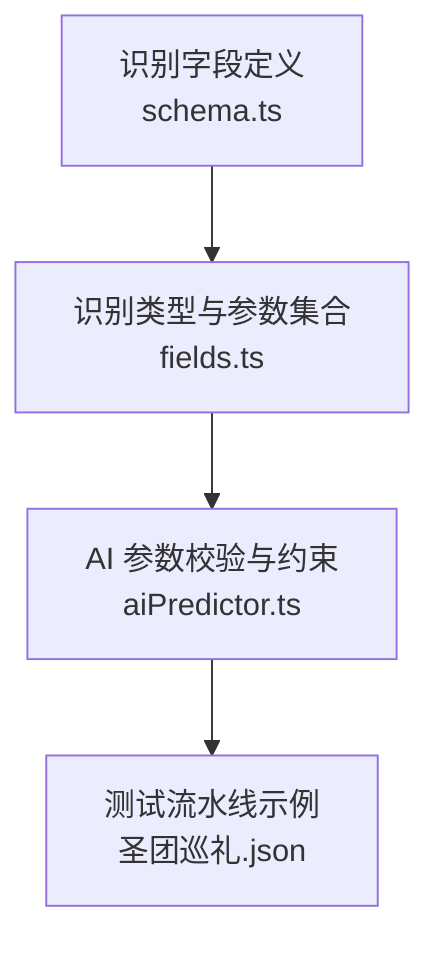
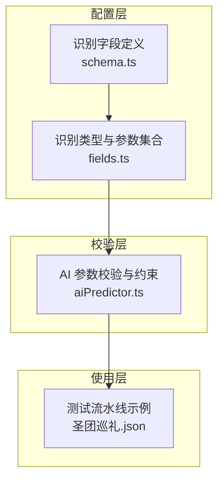
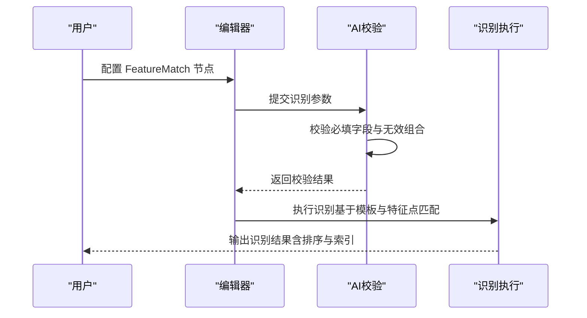
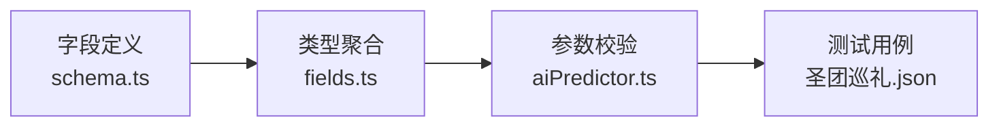

# FeatureMatch 特征匹配识别

<cite>
**本文引用的文件**
- [schema.ts](file://src/core/fields/recognition/schema.ts)
- [fields.ts](file://src/core/fields/recognition/fields.ts)
- [aiPredictor.ts](file://src/utils/aiPredictor.ts)
- [圣团巡礼.json](file://LocalBridge/test-json/base/pipeline/日常任务/圣团巡礼.json)
</cite>

## 目录
1. [简介](#简介)
2. [项目结构](#项目结构)
3. [核心组件](#核心组件)
4. [架构总览](#架构总览)
5. [详细组件分析](#详细组件分析)
6. [依赖分析](#依赖分析)
7. [性能考量](#性能考量)
8. [故障排查指南](#故障排查指南)
9. [结论](#结论)
10. [附录](#附录)

## 简介
FeatureMatch（特征匹配）是一种基于图像特征点的识别方法，相较模板匹配（TemplateMatch）具备更强的泛化能力，尤其在抗透视形变、抗尺寸变化、光照变化等方面表现更优。它通过提取模板与目标图像的关键特征点并进行匹配，从而实现更稳健的“找图”识别。

## 项目结构
FeatureMatch 的配置与使用涉及以下关键文件：
- 识别字段定义与参数说明：src/core/fields/recognition/schema.ts
- 识别类型与参数集合：src/core/fields/recognition/fields.ts
- AI 参数校验与约束规则：src/utils/aiPredictor.ts
- 实际使用示例（测试流水线）：LocalBridge/test-json/base/pipeline/日常任务/圣团巡礼.json

**图表来源**
- [schema.ts:1-276](file://src/core/fields/recognition/schema.ts#L1-L276)
- [fields.ts:1-115](file://src/core/fields/recognition/fields.ts#L1-L115)
- [aiPredictor.ts:300-499](file://src/utils/aiPredictor.ts#L300-L499)
- [圣团巡礼.json:590-602](file://LocalBridge/test-json/base/pipeline/日常任务/圣团巡礼.json#L590-L602)

**章节来源**
- [schema.ts:1-276](file://src/core/fields/recognition/schema.ts#L1-L276)
- [fields.ts:1-115](file://src/core/fields/recognition/fields.ts#L1-L115)
- [aiPredictor.ts:300-499](file://src/utils/aiPredictor.ts#L300-L499)
- [圣团巡礼.json:590-602](file://LocalBridge/test-json/base/pipeline/日常任务/圣团巡礼.json#L590-L602)

## 核心组件
- 特征匹配专属参数
  - 模板图片：template（必填）
  - 最低特征点数量：featureMatchCount（默认 4）
  - 特征检测器：detector（可选，默认 SIFT；可选值：SIFT/KAZE/AKAZE/BRISK/ORB）
  - KNN 匹配距离比值：ratio（默认 0.6）
  - 绿色掩码：greenMask（默认 false）
  - 通用参数：roi、roi_offset、order_by、index
- 适用场景
  - 需要抗透视、抗尺寸变化的图像识别
  - 对光照鲁棒性有要求的场景
  - 模板图像与目标图像存在角度、缩放差异的场景

**章节来源**
- [schema.ts:94-114](file://src/core/fields/recognition/schema.ts#L94-L114)
- [fields.ts:63-76](file://src/core/fields/recognition/fields.ts#L63-L76)
- [aiPredictor.ts:305-315](file://src/utils/aiPredictor.ts#L305-L315)

## 架构总览
FeatureMatch 的配置与校验遵循统一的识别字段体系，参数在 schema.ts 中定义，类型在 fields.ts 中聚合，AI 校验在 aiPredictor.ts 中执行，最终在测试流水线中落地使用。

**图表来源**
- [schema.ts:1-276](file://src/core/fields/recognition/schema.ts#L1-L276)
- [fields.ts:1-115](file://src/core/fields/recognition/fields.ts#L1-L115)
- [aiPredictor.ts:608-671](file://src/utils/aiPredictor.ts#L608-L671)
- [圣团巡礼.json:590-602](file://LocalBridge/test-json/base/pipeline/日常任务/圣团巡礼.json#L590-L602)

## 详细组件分析

### 参数详解与配置建议
- 模板图片（template）
  - 必填，支持单张或多张模板路径；路径为 image 目录下的相对路径
  - 建议：模板应尽量简洁、对比度高，避免过多纹理干扰
- 最低特征点数量（featureMatchCount）
  - 默认 4，数值越大匹配越严格，误检率降低但漏检风险上升
  - 建议：根据模板复杂度与目标图像差异调整；复杂场景可适当提高
- 特征检测器（detector）
  - 可选，默认 SIFT；可选值：SIFT/KAZE/AKAZE/BRISK/ORB
  - 各检测器特性与适用场景：
    - SIFT：速度较慢，具备尺度与旋转不变性，精度最高，推荐首选
    - KAZE：速度较慢，具备尺度与旋转不变性，边缘保持优异
    - AKAZE：速度中等，尺度与旋转不变性较好，速度与精度平衡
    - BRISK：速度快，尺度与旋转不变性中等，适合实时性要求高
    - ORB：速度最快，旋转不变性好，但不具备尺度不变性，建议尺寸一致时使用
- KNN 匹配距离比值（ratio）
  - 默认 0.6，数值越大匹配越宽松（更容易连线）
  - 建议：在误检较多时可适当增大，漏检较多时可适当减小
- 绿色掩码（greenMask）
  - 默认 false；开启后可对图像中绿色区域（RGB: 0,255,0）进行屏蔽，避免误匹配
  - 建议：当背景复杂或存在大量绿色元素时开启
- 通用参数
  - roi/roi_offset：限定识别区域，提升效率与准确性
  - order_by：结果排序方式（Horizontal/Vertical/Score/Area/Random/Expected 等）
  - index：命中第几个结果，支持负索引

**章节来源**
- [schema.ts:29-55](file://src/core/fields/recognition/schema.ts#L29-L55)
- [schema.ts:94-114](file://src/core/fields/recognition/schema.ts#L94-L114)
- [fields.ts:63-76](file://src/core/fields/recognition/fields.ts#L63-L76)
- [aiPredictor.ts:308-314](file://src/utils/aiPredictor.ts#L308-L314)

### 特性与优势
- 抗透视与抗尺寸变化
  - 基于特征点匹配，对图像的旋转、缩放、轻微透视形变具有较强鲁棒性
- 光照鲁棒性
  - 在不同光照条件下仍能保持较好的识别稳定性
- 泛化能力强
  - 适用于模板与目标图像存在较大差异的场景

**章节来源**
- [fields.ts:63-76](file://src/core/fields/recognition/fields.ts#L63-L76)
- [aiPredictor.ts:306-314](file://src/utils/aiPredictor.ts#L306-L314)

### 参数校验与约束
- 必填字段约束
  - TemplateMatch/FeatureMatch 必须提供 template
- 无效组合约束（FeatureMatch）
  - 不应使用 expected、only_rec 字段
- 通用字段
  - roi、roi_offset、order_by、index 均可使用

**章节来源**
- [aiPredictor.ts:391-396](file://src/utils/aiPredictor.ts#L391-L396)
- [aiPredictor.ts:639-647](file://src/utils/aiPredictor.ts#L639-L647)

### 实际使用案例与配置示例
- 示例：在“圣团巡礼”流水线中，使用 FeatureMatch 识别多个模板（如 bom.png、soap.png、barrel.png），并开启绿色掩码与指定识别区域
  - 关键参数：template、green_mask、roi、count
  - 参考路径：LocalBridge/test-json/base/pipeline/日常任务/圣团巡礼.json

**图表来源**
- [aiPredictor.ts:608-671](file://src/utils/aiPredictor.ts#L608-L671)
- [圣团巡礼.json:590-602](file://LocalBridge/test-json/base/pipeline/日常任务/圣团巡礼.json#L590-L602)

**章节来源**
- [圣团巡礼.json:590-602](file://LocalBridge/test-json/base/pipeline/日常任务/圣团巡礼.json#L590-L602)

## 依赖分析
- 字段定义与类型聚合
  - schema.ts 定义了 FeatureMatch 的专属字段与通用字段
  - fields.ts 将识别类型与其参数集合关联
- 校验与约束
  - aiPredictor.ts 对识别类型与参数进行合法性校验，防止无效组合
- 使用与验证
  - 圣团巡礼.json 展示了 FeatureMatch 在真实流水线中的使用方式

**图表来源**
- [schema.ts:1-276](file://src/core/fields/recognition/schema.ts#L1-L276)
- [fields.ts:1-115](file://src/core/fields/recognition/fields.ts#L1-L115)
- [aiPredictor.ts:608-671](file://src/utils/aiPredictor.ts#L608-L671)
- [圣团巡礼.json:590-602](file://LocalBridge/test-json/base/pipeline/日常任务/圣团巡礼.json#L590-L602)

**章节来源**
- [schema.ts:1-276](file://src/core/fields/recognition/schema.ts#L1-L276)
- [fields.ts:1-115](file://src/core/fields/recognition/fields.ts#L1-L115)
- [aiPredictor.ts:608-671](file://src/utils/aiPredictor.ts#L608-L671)
- [圣团巡礼.json:590-602](file://LocalBridge/test-json/base/pipeline/日常任务/圣团巡礼.json#L590-L602)

## 性能考量
- 特征检测器选择
  - SIFT/KAZE/AKAZE：精度高但速度较慢，适合对精度要求高的场景
  - BRISK：速度较快，适合实时性要求高的场景
  - ORB：速度最快，但不具备尺度不变性，建议模板与目标尺寸一致时使用
- ratio 参数
  - 增大 ratio 可放宽匹配，减少误检但可能增加漏检
- featureMatchCount
  - 提高阈值可降低误检，但可能增加漏检
- roi 与 greenMask
  - 合理设置识别区域与开启绿色掩码可显著提升性能与准确性

**章节来源**
- [schema.ts:101-114](file://src/core/fields/recognition/schema.ts#L101-L114)
- [aiPredictor.ts:308-314](file://src/utils/aiPredictor.ts#L308-L314)

## 故障排查指南
- 常见问题
  - 识别不到目标：检查 template 是否正确、ratio 是否过大、featureMatchCount 是否过高
  - 误检：适当提高 featureMatchCount 或降低 ratio；必要时开启 greenMask
  - 性能过慢：优先考虑 BRISK 或 ORB；减少模板数量或缩小 roi
- 参数校验错误
  - 确保 FeatureMatch 使用 template；不要使用 expected/only_rec
  - 确认 roi/roi_offset/order_by/index 等通用参数格式正确

**章节来源**
- [aiPredictor.ts:391-396](file://src/utils/aiPredictor.ts#L391-L396)
- [aiPredictor.ts:639-647](file://src/utils/aiPredictor.ts#L639-L647)

## 结论
FeatureMatch 通过特征点匹配实现了更强的泛化能力，尤其在抗透视、抗尺寸变化与光照鲁棒性方面优于传统模板匹配。合理配置模板、特征检测器、ratio 与 featureMatchCount，并结合 roi 与 greenMask，可在不同场景下取得稳定高效的识别效果。

## 附录
- 参考示例：LocalBridge/test-json/base/pipeline/日常任务/圣团巡礼.json 中的 FeatureMatch 节点配置

**章节来源**
- [圣团巡礼.json:590-602](file://LocalBridge/test-json/base/pipeline/日常任务/圣团巡礼.json#L590-L602)