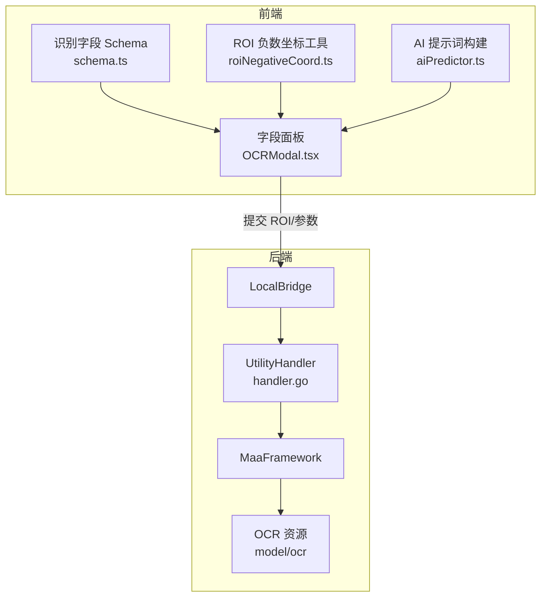
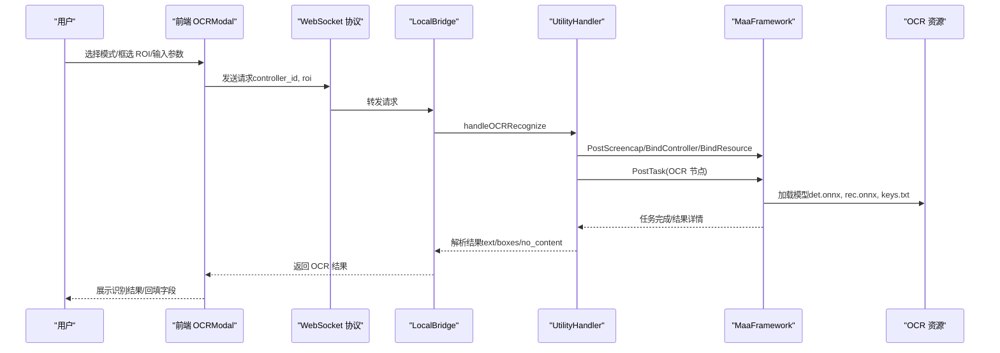
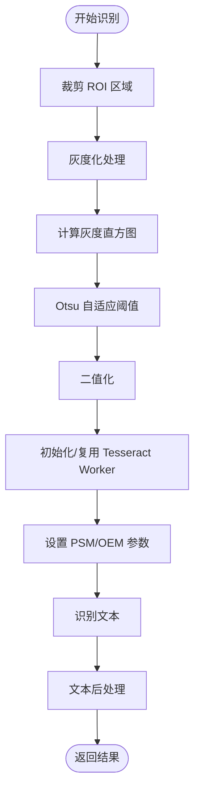
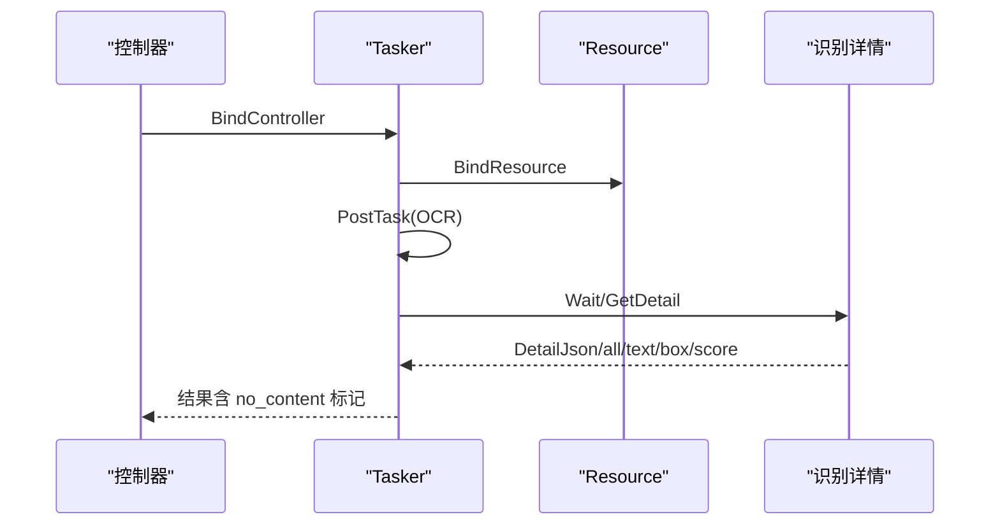
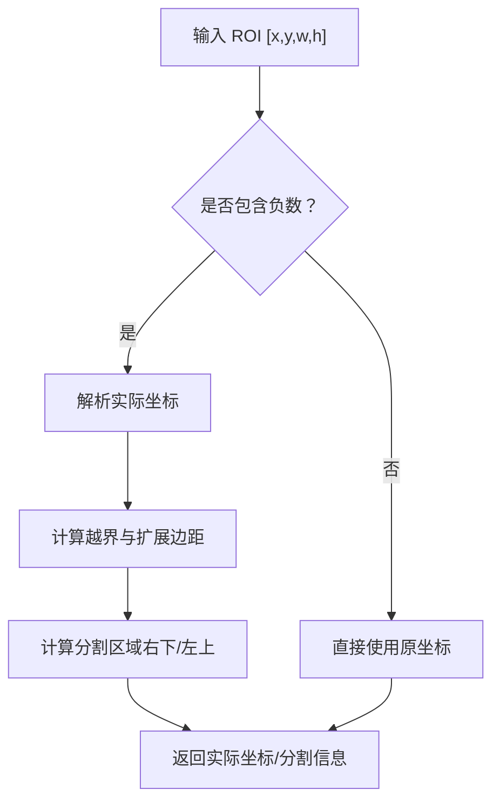
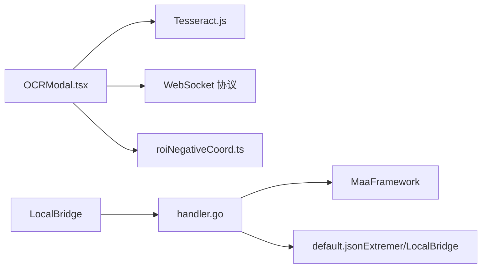

# OCR 文字识别

<cite>
**本文引用的文件**
- [schema.ts](file://src/core/fields/recognition/schema.ts)
- [OCRModal.tsx](file://src/components/modals/OCRModal.tsx)
- [handler.go](file://LocalBridge/internal/protocol/utility/handler.go)
- [roiNegativeCoord.ts](file://src/utils/roiNegativeCoord.ts)
- [aiPredictor.ts](file://src/utils/aiPredictor.ts)
- [default.json（Extremer）](file://Extremer/config/default.json)
- [default.json（LocalBridge）](file://LocalBridge/config/default.json)
- [nodeTemplates.ts](file://src/data/nodeTemplates.ts)
- [字段面板.md](file://docsite/docs/01.指南/10.工作流面板/30.字段面板.md)
- [字段快捷工具.md](file://docsite/docs/01.指南/20.本地服务/20.字段快捷工具.md)
</cite>

## 目录
1. [简介](#简介)
2. [项目结构](#项目结构)
3. [核心组件](#核心组件)
4. [架构总览](#架构总览)
5. [详细组件分析](#详细组件分析)
6. [依赖分析](#依赖分析)
7. [性能考量](#性能考量)
8. [故障排查指南](#故障排查指南)
9. [结论](#结论)
10. [附录](#附录)

## 简介
本技术文档围绕 OCR 文字识别字段进行全面说明，覆盖 ROI 区域设置、期望文本内容、阈值配置、文本替换规则、长度排序、索引选择、仅识别模式、OCR 模型选择、颜色过滤等关键参数。文档解释各参数对识别效果的影响与调优方法，并提供性能优化技巧、常见问题解决方案、实际配置示例与最佳实践，帮助开发者与使用者高效构建稳定可靠的 OCR 流程。

## 项目结构
本项目采用前后端分离与协议驱动的架构：
- 前端负责可视化编辑、参数配置、ROI 框选与预览、OCR 模式切换（前端/原生）、以及结果回填。
- 后端通过 MaaFramework（MFW）执行原生 OCR 识别，支持资源加载、任务提交与结果解析。
- 通用字段定义集中于识别字段 Schema，统一约束 OCR 参数与行为。

**图表来源**
- [OCRModal.tsx:1-1059](file://src/components/modals/OCRModal.tsx#L1-1059)
- [schema.ts:150-188](file://src/core/fields/recognition/schema.ts#L150-L188)
- [roiNegativeCoord.ts:1-313](file://src/utils/roiNegativeCoord.ts#L1-L313)
- [handler.go:67-450](file://LocalBridge/internal/protocol/utility/handler.go#L67-L450)

**章节来源**
- [OCRModal.tsx:1-1059](file://src/components/modals/OCRModal.tsx#L1-1059)
- [schema.ts:1-276](file://src/core/fields/recognition/schema.ts#L1-L276)
- [roiNegativeCoord.ts:1-313](file://src/utils/roiNegativeCoord.ts#L1-L313)
- [handler.go:1-694](file://LocalBridge/internal/protocol/utility/handler.go#L1-L694)

## 核心组件
- 识别字段 Schema：定义 OCR 的期望文本、阈值、替换规则、仅识别模式、模型路径、颜色过滤等字段及其默认值与描述。
- OCR 预览与参数配置：提供前端/原生两种 OCR 模式，支持 ROI 框选、坐标输入、负数坐标解析、图像预处理与结果回填。
- 原生 OCR 执行：通过 LocalBridge 的 UtilityHandler 提交任务，绑定控制器与资源，执行识别并解析结果。
- ROI 负数坐标工具：解析负数坐标、计算扩展边距、绘制扩展区域与标签，确保跨分辨率与窗口变化的稳定性。
- AI 提示词构建：辅助生成符合协议规范的 OCR 节点配置提示词，便于自动化推断与配置。

**章节来源**
- [schema.ts:150-188](file://src/core/fields/recognition/schema.ts#L150-L188)
- [OCRModal.tsx:1-1059](file://src/components/modals/OCRModal.tsx#L1-1059)
- [handler.go:121-450](file://LocalBridge/internal/protocol/utility/handler.go#L121-L450)
- [roiNegativeCoord.ts:1-313](file://src/utils/roiNegativeCoord.ts#L1-L313)
- [aiPredictor.ts:267-285](file://src/utils/aiPredictor.ts#L267-L285)

## 架构总览
OCR 识别在本系统中的整体流程如下：
- 前端通过字段面板与 OCRModal 配置参数与 ROI，支持前端（Tesseract.js）与原生（MFW）两种模式。
- 原生模式下，LocalBridge 的 UtilityHandler 接收请求，构造 OCR 任务，绑定控制器与资源，等待任务完成并解析结果。
- ROI 支持负数坐标，工具会解析为实际坐标并处理越界与分割情况，保证识别区域的准确性。

**图表来源**
- [OCRModal.tsx:254-321](file://src/components/modals/OCRModal.tsx#L254-L321)
- [handler.go:67-450](file://LocalBridge/internal/protocol/utility/handler.go#L67-L450)

## 详细组件分析

### OCR 字段参数详解与调优
- 期望文本 expected
  - 类型：字符串或字符串列表，必填。
  - 作用：用于匹配与筛选识别结果，支持正则表达式。
  - 影响：提升识别结果的准确性与稳定性，减少误判。
  - 调优：尽量使用稳定、唯一的片段；避免过于宽泛导致误匹配。
  - 参考定义
    - [schema.ts:151-156](file://src/core/fields/recognition/schema.ts#L151-L156)

- 置信度阈值 threshold
  - 类型：浮点数，默认 0.3。
  - 作用：过滤低置信度结果，提升识别质量。
  - 影响：阈值过高可能导致漏检，过低可能导致误检。
  - 调优：结合业务场景逐步调整；对不稳定文本可适当提高阈值。
  - 参考定义
    - [schema.ts:158-163](file://src/core/fields/recognition/schema.ts#L158-L163)

- 文本替换 replace
  - 类型：字符串对列表或单个字符串对，默认 ["origin","target"]。
  - 作用：对识别结果进行局部修正，提升准确性。
  - 影响：可纠正常见误识别字符或格式问题。
  - 调优：针对常见错别字或变形字符建立替换规则。
  - 参考定义
    - [schema.ts:165-169](file://src/core/fields/recognition/schema.ts#L165-L169)

- 仅识别模式 only_rec
  - 类型：布尔，默认 false。
  - 作用：关闭检测步骤，仅进行识别，需精确设置 ROI。
  - 影响：减少检测开销，提升速度；但对动态目标不友好。
  - 调优：静态界面或已知目标区域建议开启。
  - 参考定义
    - [schema.ts:171-175](file://src/core/fields/recognition/schema.ts#L171-L175)

- OCR 模型 model
  - 类型：字符串，默认空。
  - 作用：指定模型文件夹相对路径，需包含 det.onnx、rec.onnx、keys.txt。
  - 影响：模型质量直接影响识别精度与速度。
  - 调优：优先使用官方推荐模型；在多语言场景下选择合适语言集。
  - 参考定义
    - [schema.ts:177-181](file://src/core/fields/recognition/schema.ts#L177-L181)

- 颜色过滤 color_filter
  - 类型：字符串，默认空。
  - 作用：引用某个 ColorMatch 节点，先进行颜色二值化再识别。
  - 影响：显著提升在复杂背景下的识别稳定性；不参与 batch 优化。
  - 调优：与 ColorMatch 节点配合，合理设置 method、lower、upper。
  - 参考定义
    - [schema.ts:183-187](file://src/core/fields/recognition/schema.ts#L183-L187)

- ROI 区域 roi
  - 类型：数组 [x, y, w, h] 或节点名引用。
  - 作用：限定识别范围，支持负数坐标与偏移。
  - 影响：缩小识别范围，提升速度与精度。
  - 调优：结合负数坐标与偏移字段，确保跨分辨率一致性。
  - 参考定义
    - [schema.ts:9-13](file://src/core/fields/recognition/schema.ts#L9-L13)
  - 负数坐标解析
    - [roiNegativeCoord.ts:55-178](file://src/utils/roiNegativeCoord.ts#L55-L178)

- 索引选择 index
  - 类型：整数，默认 0。
  - 作用：选择第几个结果，支持负数索引。
  - 影响：在多候选结果中定位目标。
  - 调优：结合排序策略与预期文本共同使用。
  - 参考定义
    - [schema.ts:21-25](file://src/core/fields/recognition/schema.ts#L21-L25)

- 排序 order_by
  - 类型：字符串枚举，如 Horizontal、Vertical、Score、Area、Length、Random、Expected。
  - 作用：对识别结果进行排序，可与 index 配合使用。
  - 影响：改善多结果场景下的命中稳定性。
  - 调优：根据场景选择合适的排序策略。
  - 参考定义
    - [schema.ts:58-91](file://src/core/fields/recognition/schema.ts#L58-L91)

**章节来源**
- [schema.ts:9-188](file://src/core/fields/recognition/schema.ts#L9-L188)
- [roiNegativeCoord.ts:1-313](file://src/utils/roiNegativeCoord.ts#L1-L313)

### 前端 OCR（Tesseract.js）实现与优化
- 模式选择
  - 前端模式基于 Tesseract.js，无需后端资源配置，适合快速验证与静态内容识别。
  - 原生模式依赖后端 OCR 资源，识别更贴近真实环境。
- 图像预处理
  - 灰度化与 Otsu 二值化，自动计算最佳阈值，提升对比度。
  - 文本后处理：去除多余空白、合并中文字符间空格、清理换行。
- 参数配置
  - PSM（页面分割模式）与 OEM（引擎模式）参数可调，以适配不同文本形态。
- 性能要点
  - 首次加载模型需时间，建议复用 worker；防抖触发识别，避免频繁计算。
- 参考实现
  - [OCRModal.tsx:92-251](file://src/components/modals/OCRModal.tsx#L92-L251)

**图表来源**
- [OCRModal.tsx:92-251](file://src/components/modals/OCRModal.tsx#L92-L251)

**章节来源**
- [OCRModal.tsx:1-1059](file://src/components/modals/OCRModal.tsx#L1-L1059)

### 原生 OCR（MaaFramework）执行流程
- 资源加载
  - 从配置读取 OCR 资源目录，支持 Windows 非 ASCII 路径处理与工作目录切换。
  - 验证模型文件完整性（det.onnx、rec.onnx、keys.txt）。
- 任务提交
  - 构造 OCR 节点配置，提交任务并等待完成。
- 结果解析
  - 从任务详情解析 all/text/box/score 等字段，兼容多种返回格式。
  - 当无内容时返回空结果与标记。
- 参考实现
  - [handler.go:121-450](file://LocalBridge/internal/protocol/utility/handler.go#L121-L450)

**图表来源**
- [handler.go:256-409](file://LocalBridge/internal/protocol/utility/handler.go#L256-L409)

**章节来源**
- [handler.go:121-450](file://LocalBridge/internal/protocol/utility/handler.go#L121-L450)

### ROI 负数坐标解析与可视化
- 负数坐标语义
  - x 负数：从右边缘计算；y 负数：从下边缘计算；w/h 为 0：延伸至边缘；w/h 为负数：取绝对值并将 (x,y) 视为右下角。
- 解析与扩展
  - 计算实际坐标、越界情况、需要的扩展边距与分割区域。
  - 在画布上绘制扩展区域与标签，辅助用户理解坐标含义。
- 参考实现
  - [roiNegativeCoord.ts:55-178](file://src/utils/roiNegativeCoord.ts#L55-L178)

**图表来源**
- [roiNegativeCoord.ts:55-178](file://src/utils/roiNegativeCoord.ts#L55-L178)

**章节来源**
- [roiNegativeCoord.ts:1-313](file://src/utils/roiNegativeCoord.ts#L1-L313)

### 字段面板与节点模板
- 字段面板
  - 显示与编辑节点字段，支持固定/拖动模式与内嵌缩放。
  - 参考
    - [字段面板.md:1-78](file://docsite/docs/01.指南/10.工作流面板/30.字段面板.md#L1-L78)
- 节点模板
  - 提供“文字识别”模板，初始参数包含 expected 字段。
  - 参考
    - [nodeTemplates.ts:13-32](file://src/data/nodeTemplates.ts#L13-L32)

**章节来源**
- [字段面板.md:1-78](file://docsite/docs/01.指南/10.工作流面板/30.字段面板.md#L1-L78)
- [nodeTemplates.ts:1-108](file://src/data/nodeTemplates.ts#L1-L108)

## 依赖分析
- 前端依赖
  - OCRModal 依赖 Tesseract.js 进行前端识别；依赖 WebSocket 协议与 MFW Store 进行后端通信。
  - 依赖 ROI 工具进行坐标解析与可视化。
- 后端依赖
  - UtilityHandler 依赖 MaaFramework 执行识别，依赖配置文件中的资源目录。
- 配置依赖
  - Extremer 默认启用 MFW，提供资源目录默认值；LocalBridge 默认禁用，需手动配置。

**图表来源**
- [OCRModal.tsx:1-1059](file://src/components/modals/OCRModal.tsx#L1-L1059)
- [roiNegativeCoord.ts:1-313](file://src/utils/roiNegativeCoord.ts#L1-L313)
- [handler.go:1-694](file://LocalBridge/internal/protocol/utility/handler.go#L1-L694)
- [default.json（Extremer）:22-32](file://Extremer/config/default.json#L22-L32)
- [default.json（LocalBridge）:23-27](file://LocalBridge/config/default.json#L23-L27)

**章节来源**
- [OCRModal.tsx:1-1059](file://src/components/modals/OCRModal.tsx#L1-L1059)
- [roiNegativeCoord.ts:1-313](file://src/utils/roiNegativeCoord.ts#L1-L313)
- [handler.go:1-694](file://LocalBridge/internal/protocol/utility/handler.go#L1-L694)
- [default.json（Extremer）:1-34](file://Extremer/config/default.json#L1-L34)
- [default.json（LocalBridge）:1-29](file://LocalBridge/config/default.json#L1-L29)

## 性能考量
- 模式选择
  - 静态内容与快速验证：优先前端 OCR（Tesseract.js），避免后端重截屏与资源加载开销。
  - 实时识别与高精度：使用原生 OCR，确保与真实界面一致。
- ROI 设计
  - 尽量缩小 ROI，减少计算量；利用负数坐标与偏移字段提升跨分辨率稳定性。
- 模型与资源
  - 合理选择模型语言集，避免加载过大模型；确保资源目录结构完整（det.onnx、rec.onnx、keys.txt）。
- 预处理与缓存
  - 前端模式复用 Tesseract Worker，减少模型加载时间；对重复 ROI 进行防抖处理。
- 参考
  - [字段快捷工具.md:350-365](file://docsite/docs/01.指南/20.本地服务/20.字段快捷工具.md#L350-L365)

[本节为通用指导，不直接分析具体文件，故无“章节来源”]

## 故障排查指南
- OCR 资源未配置
  - 现象：原生 OCR 返回“OCR 资源路径未配置”错误。
  - 处理：在后端运行配置命令设置资源目录并重启服务。
  - 参考
    - [handler.go:164-169](file://LocalBridge/internal/protocol/utility/handler.go#L164-L169)
    - [OCRModal.tsx:304-313](file://src/components/modals/OCRModal.tsx#L304-L313)
- 模型路径不正确
  - 现象：Tasker 未初始化，提示模型路径不符合期望。
  - 处理：确认资源目录下存在 model/ocr，并包含所需文件。
  - 参考
    - [handler.go:247-253](file://LocalBridge/internal/protocol/utility/handler.go#L247-L253)
- Windows 非 ASCII 路径
  - 现象：中文路径导致加载失败。
  - 处理：系统尝试短路径转换或工作目录切换。
  - 参考
    - [handler.go:187-227](file://LocalBridge/internal/protocol/utility/handler.go#L187-L227)
- 无内容识别
  - 现象：识别完成但 no_content 为真。
  - 处理：检查 ROI 是否正确、阈值是否过高、颜色过滤是否过度抑制。
  - 参考
    - [handler.go:289-306](file://LocalBridge/internal/protocol/utility/handler.go#L289-L306)
    - [OCRModal.tsx:294-314](file://src/components/modals/OCRModal.tsx#L294-L314)

**章节来源**
- [handler.go:164-253](file://LocalBridge/internal/protocol/utility/handler.go#L164-L253)
- [OCRModal.tsx:304-314](file://src/components/modals/OCRModal.tsx#L304-L314)

## 结论
通过统一的识别字段 Schema、灵活的前端/原生 OCR 模式、完善的 ROI 负数坐标解析与资源加载机制，本系统为 OCR 文字识别提供了高可配置性与高稳定性。合理设置期望文本、阈值、替换规则、仅识别模式、模型路径与颜色过滤，并结合 ROI 优化与性能调优策略，可在不同场景下获得稳定可靠的识别效果。

[本节为总结，不直接分析具体文件，故无“章节来源”]

## 附录

### 实际配置示例与最佳实践
- 示例一：基础 OCR 节点
  - 使用“文字识别”模板，设置 expected 与 roi，必要时启用 only_rec。
  - 参考
    - [nodeTemplates.ts:13-32](file://src/data/nodeTemplates.ts#L13-L32)
- 示例二：颜色过滤 OCR
  - 先配置 ColorMatch 节点，再在 OCR 节点中设置 color_filter 引用该节点名。
  - 参考
    - [schema.ts:183-187](file://src/core/fields/recognition/schema.ts#L183-L187)
- 示例三：多语言前端 OCR
  - 在前端模式下，Tesseract.js 支持多语言混合识别，建议首次加载后复用 worker。
  - 参考
    - [OCRModal.tsx:191-215](file://src/components/modals/OCRModal.tsx#L191-L215)
- 最佳实践
  - 保持设备连接稳定；编辑固定内容用前端 OCR，实时内容用原生 OCR；规范图片管理与命名；善用缩放与拖动；验证结果并及时调整。
  - 参考
    - [字段快捷工具.md:350-365](file://docsite/docs/01.指南/20.本地服务/20.字段快捷工具.md#L350-L365)

**章节来源**
- [nodeTemplates.ts:13-32](file://src/data/nodeTemplates.ts#L13-L32)
- [schema.ts:183-187](file://src/core/fields/recognition/schema.ts#L183-L187)
- [OCRModal.tsx:191-215](file://src/components/modals/OCRModal.tsx#L191-L215)
- [字段快捷工具.md:350-365](file://docsite/docs/01.指南/20.本地服务/20.字段快捷工具.md#L350-L365)