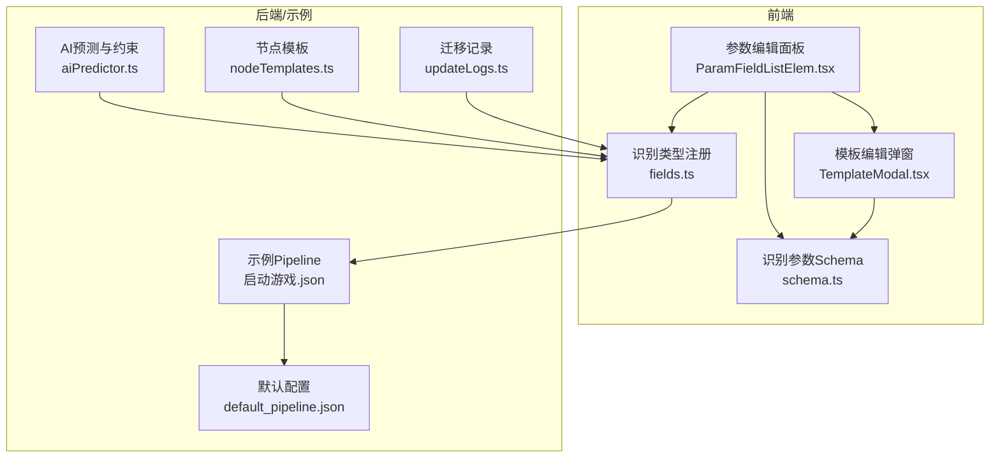
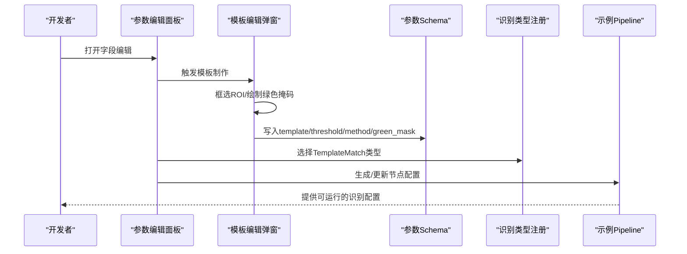
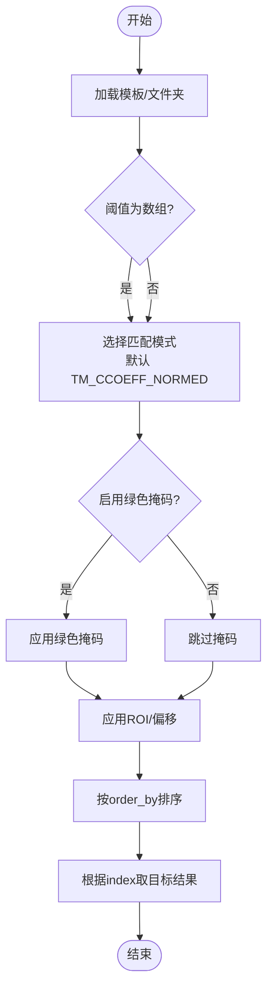
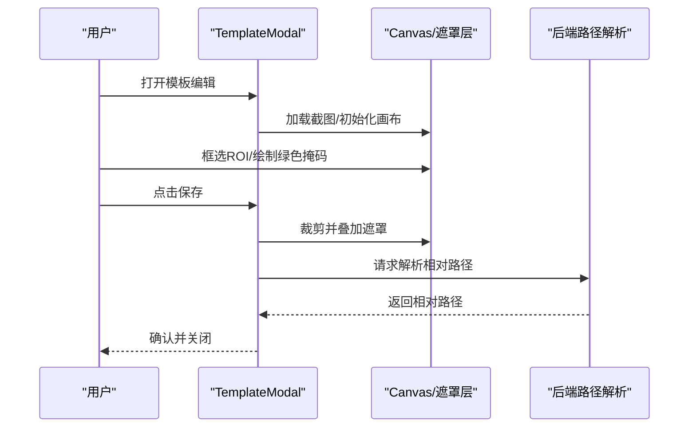
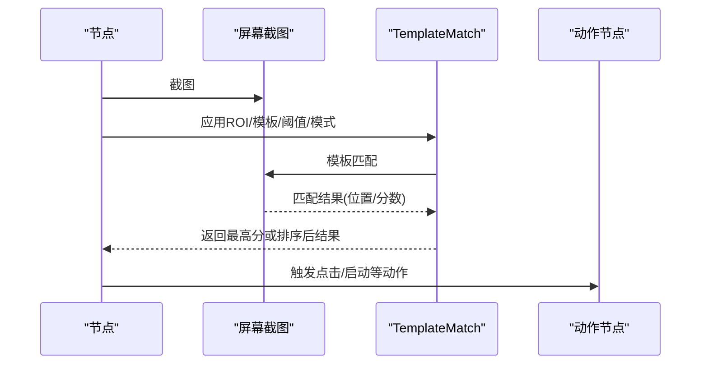
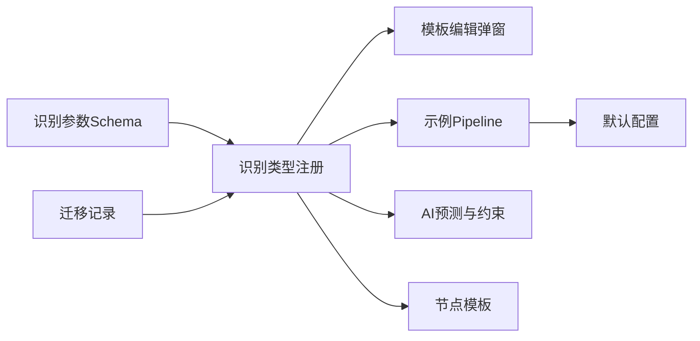

# TemplateMatch 模板匹配识别

<cite>
**本文档引用的文件**
- [schema.ts](file://src/core/fields/recognition/schema.ts)
- [fields.ts](file://src/core/fields/recognition/fields.ts)
- [TemplateModal.tsx](file://src/components/modals/TemplateModal.tsx)
- [ParamFieldListElem.tsx](file://src/components/panels/field/items/ParamFieldListElem.tsx)
- [启动游戏.json](file://LocalBridge/test-json/base/pipeline/日常任务/启动游戏.json)
- [default_pipeline.json](file://LocalBridge/test-json/base/default_pipeline.json)
- [aiPredictor.ts](file://src/utils/aiPredictor.ts)
- [nodeTemplates.ts](file://src/data/nodeTemplates.ts)
- [updateLogs.ts](file://src/data/updateLogs.ts)
</cite>

## 目录
1. [简介](#简介)
2. [项目结构](#项目结构)
3. [核心组件](#核心组件)
4. [架构总览](#架构总览)
5. [详细组件分析](#详细组件分析)
6. [依赖关系分析](#依赖关系分析)
7. [性能考量](#性能考量)
8. [故障排查指南](#故障排查指南)
9. [结论](#结论)
10. [附录](#附录)

## 简介
TemplateMatch 是“找图”识别的核心节点类型，通过在屏幕截图中寻找与预设模板图像高度相似的区域，实现界面元素定位与交互触发。本节将系统讲解其工作原理、参数配置、排序策略、匹配模式、绿色掩码等关键要素，并结合实际案例与最佳实践帮助快速落地。

## 项目结构
TemplateMatch 的前端可视化与参数校验由前端模块负责，后端配置与示例位于测试资源中。核心涉及以下文件：
- 参数定义与校验：src/core/fields/recognition/schema.ts、src/core/fields/recognition/fields.ts
- 可视化模板制作工具：src/components/modals/TemplateModal.tsx
- 参数编辑入口：src/components/panels/field/items/ParamFieldListElem.tsx
- 实际使用示例：LocalBridge/test-json/base/pipeline/日常任务/启动游戏.json
- 默认配置：LocalBridge/test-json/base/default_pipeline.json
- AI 预测与参数约束：src/utils/aiPredictor.ts
- 节点模板与迁移记录：src/data/nodeTemplates.ts、src/data/updateLogs.ts

**图表来源**
- [ParamFieldListElem.tsx:692-733](file://src/components/panels/field/items/ParamFieldListElem.tsx#L692-L733)
- [TemplateModal.tsx:1-800](file://src/components/modals/TemplateModal.tsx#L1-L800)
- [schema.ts:1-276](file://src/core/fields/recognition/schema.ts#L1-L276)
- [fields.ts:1-115](file://src/core/fields/recognition/fields.ts#L1-L115)
- [启动游戏.json:1-314](file://LocalBridge/test-json/base/pipeline/日常任务/启动游戏.json#L1-L314)
- [default_pipeline.json:1-7](file://LocalBridge/test-json/base/default_pipeline.json#L1-L7)
- [aiPredictor.ts:294-494](file://src/utils/aiPredictor.ts#L294-L494)
- [nodeTemplates.ts:30-45](file://src/data/nodeTemplates.ts#L30-L45)
- [updateLogs.ts:400-415](file://src/data/updateLogs.ts#L400-L415)

**章节来源**
- [schema.ts:1-276](file://src/core/fields/recognition/schema.ts#L1-L276)
- [fields.ts:1-115](file://src/core/fields/recognition/fields.ts#L1-L115)
- [TemplateModal.tsx:1-800](file://src/components/modals/TemplateModal.tsx#L1-L800)
- [ParamFieldListElem.tsx:692-733](file://src/components/panels/field/items/ParamFieldListElem.tsx#L692-L733)
- [启动游戏.json:1-314](file://LocalBridge/test-json/base/pipeline/日常任务/启动游戏.json#L1-L314)
- [default_pipeline.json:1-7](file://LocalBridge/test-json/base/default_pipeline.json#L1-L7)
- [aiPredictor.ts:294-494](file://src/utils/aiPredictor.ts#L294-L494)
- [nodeTemplates.ts:30-45](file://src/data/nodeTemplates.ts#L30-L45)
- [updateLogs.ts:400-415](file://src/data/updateLogs.ts#L400-L415)

## 核心组件
- 模板匹配参数定义
  - 模板路径 template：必填，支持单张图片或文件夹（递归加载）
  - 阈值 threshold：可选，默认 0.7，支持数组且长度需与模板数组一致
  - 匹配模式 method：可选，默认 5（TM_CCOEFF_NORMED），支持 10001、3、5
  - 绿色掩码 green_mask：可选，默认 false，启用后可对特定区域屏蔽匹配
  - 排序 order_by：可选，默认 Horizontal，支持 Horizontal、Vertical、Score、Area、Random、Expected
  - 结果索引 index：可选，默认 0，支持负索引与越界处理
  - ROI 与 ROI 偏移：可选，限定识别区域，提升性能与准确性

- 类型注册与描述
  - TemplateMatch 类型在识别字段注册表中声明，参数集合包含上述字段
  - 与 OCR、ColorMatch、FeatureMatch 等类型形成差异化能力矩阵

**章节来源**
- [schema.ts:28-92](file://src/core/fields/recognition/schema.ts#L28-L92)
- [fields.ts:27-38](file://src/core/fields/recognition/fields.ts#L27-L38)

## 架构总览
TemplateMatch 的端到端流程包括：参数编辑 -> 模板制作 -> 配置落盘 -> 运行时识别 -> 结果排序与索引 -> 动作执行。

**图表来源**
- [ParamFieldListElem.tsx:692-733](file://src/components/panels/field/items/ParamFieldListElem.tsx#L692-L733)
- [TemplateModal.tsx:1-800](file://src/components/modals/TemplateModal.tsx#L1-L800)
- [schema.ts:28-92](file://src/core/fields/recognition/schema.ts#L28-L92)
- [fields.ts:27-38](file://src/core/fields/recognition/fields.ts#L27-L38)
- [启动游戏.json:16-52](file://LocalBridge/test-json/base/pipeline/日常任务/启动游戏.json#L16-L52)

## 详细组件分析

### 参数定义与约束
- 模板路径 template
  - 支持 image 目录下的相对路径，建议使用无损原图缩放至 720p 的裁剪图
  - 支持文件夹路径，将递归加载其中所有图片文件
- 阈值 threshold
  - 默认 0.7，数值越高越严格
  - 当模板数组为多个时，阈值数组长度需与模板数组一致
- 匹配模式 method
  - 默认 5（TM_CCOEFF_NORMED），光照鲁棒性好，阈值易设定
  - 10001：TM_SQDIFF_NORMED 的反转版本，分数越高越匹配
  - 3：TM_CCORR_NORMED，模板较亮时效果好
- 绿色掩码 green_mask
  - 默认 false
  - 启用后可在模板上绘制绿色区域（RGB: 0, 255, 0），对应区域不参与匹配
- 排序 order_by
  - 支持 Horizontal、Vertical、Score、Area、Random、Expected
  - 与 index 结合使用，可稳定选取目标结果
- ROI 与 ROI 偏移
  - roi/roi_offset 可限定识别区域，减少误检与性能损耗

**图表来源**
- [schema.ts:28-92](file://src/core/fields/recognition/schema.ts#L28-L92)

**章节来源**
- [schema.ts:28-92](file://src/core/fields/recognition/schema.ts#L28-L92)

### 模板制作与可视化
- 模板编辑弹窗提供截图预览、ROI 框选、画笔/橡皮擦绘制绿色掩码、坐标输入与导出等功能
- 支持负数坐标解析（从右/下边缘计算），并可自动分割负数区域
- 保存模板时可叠加绿色掩码，导出 PNG 并请求后端解析相对路径

**图表来源**
- [TemplateModal.tsx:1-800](file://src/components/modals/TemplateModal.tsx#L1-L800)

**章节来源**
- [TemplateModal.tsx:1-800](file://src/components/modals/TemplateModal.tsx#L1-L800)

### 参数校验与约束
- AI 预测与参数校验对 TemplateMatch 的参数组合进行约束
- 例如：TemplateMatch 与 expected/only_rec 不能同时使用；与 OCR 的参数组合存在互斥
- 保证配置合法，避免运行期错误

**章节来源**
- [aiPredictor.ts:606-647](file://src/utils/aiPredictor.ts#L606-L647)

### 实际使用案例
- 启动游戏流程中的“关闭公告”节点使用 TemplateMatch，限定 ROI 并指定模板路径
- “关闭面板”节点使用多模板数组，提升识别稳定性
- “识别主界面”节点在 ROI 内匹配模板，作为后续动作的前置条件

**图表来源**
- [启动游戏.json:16-52](file://LocalBridge/test-json/base/pipeline/日常任务/启动游戏.json#L16-L52)

**章节来源**
- [启动游戏.json:16-52](file://LocalBridge/test-json/base/pipeline/日常任务/启动游戏.json#L16-L52)
- [default_pipeline.json:1-7](file://LocalBridge/test-json/base/default_pipeline.json#L1-L7)

### 参数配置示例（路径指引）
- 单模板 + ROI + 阈值 + 排序 + 索引
  - 参考路径：LocalBridge/test-json/base/pipeline/日常任务/启动游戏.json
  - 示例片段：[关闭公告节点:28-34](file://LocalBridge/test-json/base/pipeline/日常任务/启动游戏.json#L28-L34)
- 多模板数组 + 绿色掩码
  - 示例片段：[关闭面板节点:47-52](file://LocalBridge/test-json/base/pipeline/日常任务/启动游戏.json#L47-L52)
- 仅模板 + ROI
  - 示例片段：[识别主界面节点:214-220](file://LocalBridge/test-json/base/pipeline/日常任务/启动游戏.json#L214-L220)

**章节来源**
- [启动游戏.json:16-52](file://LocalBridge/test-json/base/pipeline/日常任务/启动游戏.json#L16-L52)

## 依赖关系分析
- 参数定义依赖识别字段枚举与类型系统
- 类型注册依赖参数定义
- 可视化工具依赖参数定义与后端协议
- 示例配置依赖默认配置与节点模板
- AI 预测依赖类型注册与参数约束

**图表来源**
- [schema.ts:1-276](file://src/core/fields/recognition/schema.ts#L1-L276)
- [fields.ts:1-115](file://src/core/fields/recognition/fields.ts#L1-L115)
- [TemplateModal.tsx:1-800](file://src/components/modals/TemplateModal.tsx#L1-L800)
- [启动游戏.json:1-314](file://LocalBridge/test-json/base/pipeline/日常任务/启动游戏.json#L1-L314)
- [default_pipeline.json:1-7](file://LocalBridge/test-json/base/default_pipeline.json#L1-L7)
- [aiPredictor.ts:294-494](file://src/utils/aiPredictor.ts#L294-L494)
- [nodeTemplates.ts:30-45](file://src/data/nodeTemplates.ts#L30-L45)
- [updateLogs.ts:400-415](file://src/data/updateLogs.ts#L400-L415)

**章节来源**
- [schema.ts:1-276](file://src/core/fields/recognition/schema.ts#L1-L276)
- [fields.ts:1-115](file://src/core/fields/recognition/fields.ts#L1-L115)
- [TemplateModal.tsx:1-800](file://src/components/modals/TemplateModal.tsx#L1-L800)
- [启动游戏.json:1-314](file://LocalBridge/test-json/base/pipeline/日常任务/启动游戏.json#L1-L314)
- [default_pipeline.json:1-7](file://LocalBridge/test-json/base/default_pipeline.json#L1-L7)
- [aiPredictor.ts:294-494](file://src/utils/aiPredictor.ts#L294-L494)
- [nodeTemplates.ts:30-45](file://src/data/nodeTemplates.ts#L30-L45)
- [updateLogs.ts:400-415](file://src/data/updateLogs.ts#L400-L415)

## 性能考量
- ROI 限定：缩小识别区域，显著降低计算量
- 阈值调优：过高导致漏检，过低导致误检；建议从 0.7 开始微调
- 匹配模式选择：默认 TM_CCOEFF_NORMED 光照鲁棒性好；模板较亮时可考虑 TM_CCORR_NORMED
- 绿色掩码：对复杂背景区域进行屏蔽，减少干扰
- 多模板数组：提升稳定性，但增加计算成本
- 排序策略：Score/Expected 更适合高精度场景，Area/Random 更适合快速定位

## 故障排查指南
- 模板路径无效
  - 确认项目根目录与 image/template 目录存在
  - 使用相对路径，避免绝对路径
- 截图失败或黑屏
  - 检查设备连接与截图方式
  - 确保窗口未最小化或模拟器支持全屏输出
- 识别不稳定
  - 调整阈值与匹配模式
  - 使用 ROI 精确定位
  - 启用绿色掩码屏蔽干扰区域
- 参数冲突
  - 避免与 OCR 的 expected/only_rec 同时使用
  - 遵循 AI 预测的参数组合约束

**章节来源**
- [启动游戏.json:1-314](file://LocalBridge/test-json/base/pipeline/日常任务/启动游戏.json#L1-L314)
- [aiPredictor.ts:606-647](file://src/utils/aiPredictor.ts#L606-L647)

## 结论
TemplateMatch 通过简洁而强大的参数体系，实现了高可靠性的“找图”识别。配合 ROI、阈值、匹配模式与绿色掩码，能够在复杂界面中稳定定位目标。建议以示例为起点，逐步优化参数与模板质量，结合排序与索引策略，构建稳健的自动化流程。

## 附录

### 模板质量与优化
- 模板尺寸：建议缩放至 720p，保持清晰锐利
- 模板多样性：针对不同亮度、角度、变形场景准备多模板
- 掩码策略：对动态元素（如边框、光效）使用绿色掩码屏蔽
- ROI 精准：尽量缩小识别范围，减少误检与性能损耗

### 最佳实践清单
- 规范图片管理：统一放置于 image 或 template 目录
- 合理使用阈值：从 0.7 开始，结合场景微调
- 使用 ROI 限定：优先在小区域内匹配
- 多模板互补：同一功能准备多个模板
- 绿色掩码：对干扰区域进行屏蔽
- 验证运行：配置完成后进行实际运行验证

**章节来源**
- [启动游戏.json:1-314](file://LocalBridge/test-json/base/pipeline/日常任务/启动游戏.json#L1-L314)