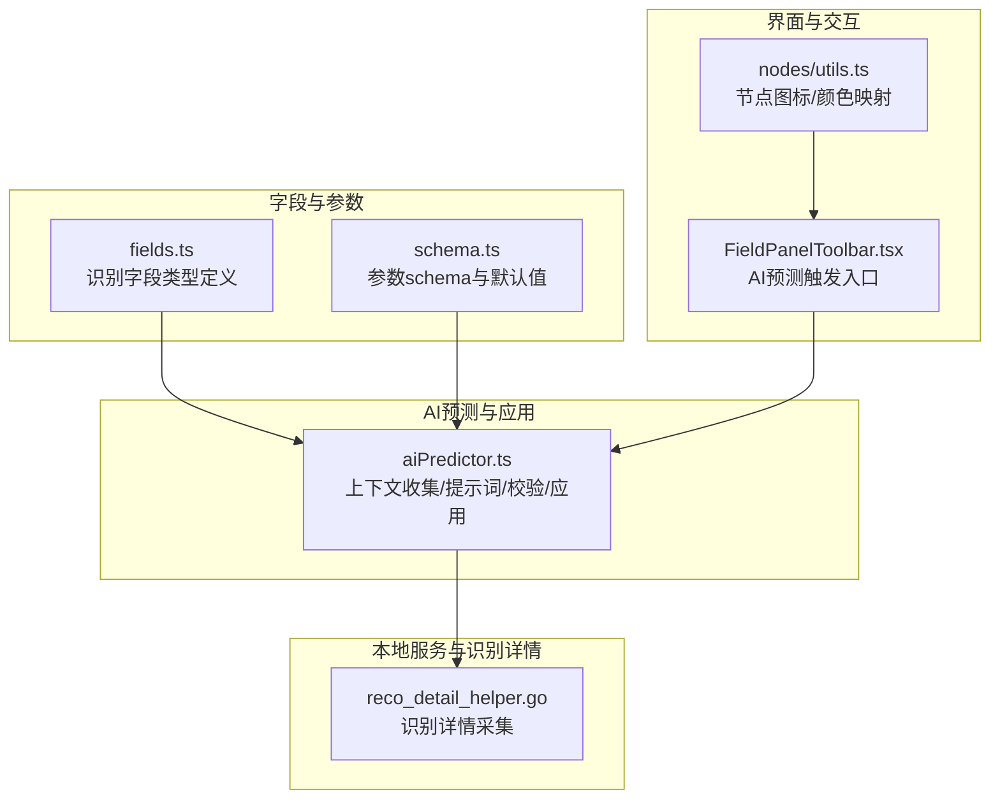
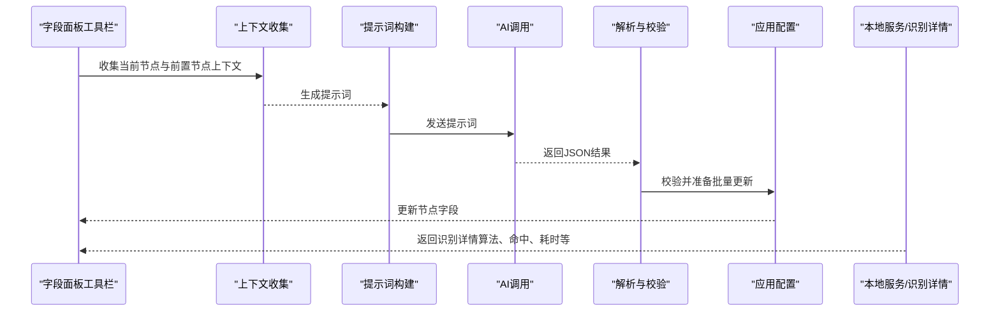
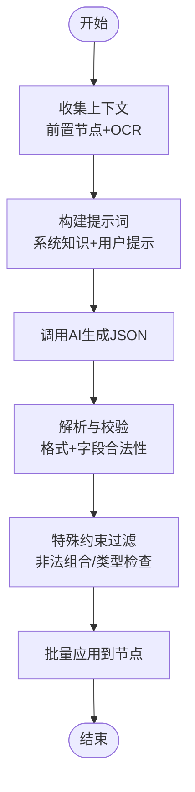
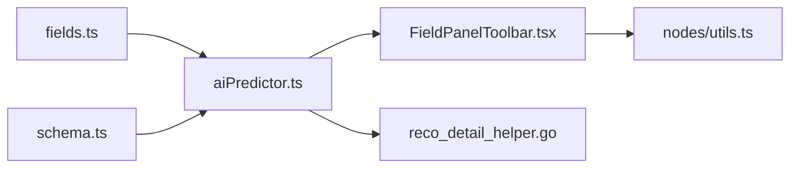

# 神经网络识别

<cite>
**本文引用的文件**
- [src/core/fields/recognition/fields.ts](file://src/core/fields/recognition/fields.ts)
- [src/core/fields/recognition/schema.ts](file://src/core/fields/recognition/schema.ts)
- [src/components/flow/nodes/utils.ts](file://src/components/flow/nodes/utils.ts)
- [src/utils/aiPredictor.ts](file://src/utils/aiPredictor.ts)
- [src/components/panels/field/tools/FieldPanelToolbar.tsx](file://src/components/panels/field/tools/FieldPanelToolbar.tsx)
- [docsite/docs/01.指南/20.本地服务/50.AI 服务.md](file://docsite/docs/01.指南/20.本地服务/50.AI 服务.md)
- [LocalBridge/internal/mfw/reco_detail_helper.go](file://LocalBridge/internal/mfw/reco_detail_helper.go)
</cite>

## 目录
1. [简介](#简介)
2. [项目结构](#项目结构)
3. [核心组件](#核心组件)
4. [架构总览](#架构总览)
5. [详细组件分析](#详细组件分析)
6. [依赖分析](#依赖分析)
7. [性能考量](#性能考量)
8. [故障排查指南](#故障排查指南)
9. [结论](#结论)
10. [附录](#附录)

## 简介
本文件面向“神经网络识别”能力，系统性梳理两类识别节点：NeuralNetworkClassify（神经网络分类）与 NeuralNetworkDetect（神经网络检测）。内容覆盖参数配置（标签、模型、期望结果、排序、索引等）、优势与局限、模型选择与训练建议、部署与性能优化，以及结合工程实现的可视化流程与最佳实践。

## 项目结构
围绕神经网络识别的关键代码分布在以下模块：
- 字段定义与参数约束：识别字段类型与参数 schema
- UI 图标与颜色映射：节点类型在界面中的呈现
- AI 预测与应用：基于上下文的智能配置生成与落盘
- 工具栏触发入口：一键触发 AI 预测
- 本地服务与识别详情：底层识别细节采集与展示

**图表来源**
- [src/core/fields/recognition/fields.ts:1-115](file://src/core/fields/recognition/fields.ts#L1-L115)
- [src/core/fields/recognition/schema.ts:1-276](file://src/core/fields/recognition/schema.ts#L1-L276)
- [src/components/flow/nodes/utils.ts:1-139](file://src/components/flow/nodes/utils.ts#L1-L139)
- [src/utils/aiPredictor.ts:1-785](file://src/utils/aiPredictor.ts#L1-L785)
- [LocalBridge/internal/mfw/reco_detail_helper.go:1-179](file://LocalBridge/internal/mfw/reco_detail_helper.go#L1-L179)

**章节来源**
- [src/core/fields/recognition/fields.ts:88-114](file://src/core/fields/recognition/fields.ts#L88-L114)
- [src/core/fields/recognition/schema.ts:190-218](file://src/core/fields/recognition/schema.ts#L190-L218)
- [src/components/flow/nodes/utils.ts:33-36](file://src/components/flow/nodes/utils.ts#L33-L36)
- [src/utils/aiPredictor.ts:532-559](file://src/utils/aiPredictor.ts#L532-L559)
- [src/components/panels/field/tools/FieldPanelToolbar.tsx:120-183](file://src/components/panels/field/tools/FieldPanelToolbar.tsx#L120-L183)
- [LocalBridge/internal/mfw/reco_detail_helper.go:168-179](file://LocalBridge/internal/mfw/reco_detail_helper.go#L168-L179)

## 核心组件
- 神经网络分类（NeuralNetworkClassify）
  - 关键参数：roi、roi_offset、labels、model（必填，ONNX）、expected（必填，分类下标）、expectedOrderBy、index
  - 适用场景：固定位置的类别判断
- 神经网络检测（NeuralNetworkDetect）
  - 关键参数：roi、roi_offset、labels、model（必填，ONNX，当前支持 YoloV8）、expected（必填，分类下标）、threshold、areaExpectedOrderBy、index
  - 适用场景：任意位置的目标检测

上述参数在字段定义与 schema 中均有明确约束与默认值，AI 预测流程会据此生成并校验配置。

**章节来源**
- [src/core/fields/recognition/fields.ts:88-114](file://src/core/fields/recognition/fields.ts#L88-L114)
- [src/core/fields/recognition/schema.ts:190-218](file://src/core/fields/recognition/schema.ts#L190-L218)

## 架构总览
AI 预测流程从“节点上下文收集”开始，经过“提示词构建与调用 AI”，再到“结果解析与校验”，最终“批量应用到节点”。识别详情由本地服务采集并回传，便于调试与可视化。

**图表来源**
- [src/utils/aiPredictor.ts:82-172](file://src/utils/aiPredictor.ts#L82-L172)
- [src/utils/aiPredictor.ts:271-525](file://src/utils/aiPredictor.ts#L271-L525)
- [src/utils/aiPredictor.ts:532-596](file://src/utils/aiPredictor.ts#L532-L596)
- [src/utils/aiPredictor.ts:720-784](file://src/utils/aiPredictor.ts#L720-L784)
- [LocalBridge/internal/mfw/reco_detail_helper.go:168-179](file://LocalBridge/internal/mfw/reco_detail_helper.go#L168-L179)

## 详细组件分析

### 参数与配置要点
- 标签（labels）
  - 作用：为每个分类命名，仅影响调试图片与日志；未填写时填充“Unknown”
  - 影响：提升可读性与定位效率
- 模型（model）
  - 分类：model/classify 相对路径，ONNX
  - 检测：model/detect 相对路径，当前支持 YoloV8 ONNX
  - 必填：两类均要求提供 model
- 期望结果（expected）
  - 类型：整数或整数数组
  - 作用：指定期望的分类下标，AI 会据此生成 order_by 与 index 等参数
- 排序方式（order_by）
  - 分类：expectedOrderBy（支持 Expected）
  - 检测：areaExpectedOrderBy（支持 Expected、Area）
  - 与 index 结合：index 决定取第几个结果，支持负索引
- ROI 与偏移
  - roi/roi_offset：限定识别区域，支持负数与字符串引用前置节点结果
- 阈值（threshold）
  - 检测专用：默认 0.3，可为数组与模板匹配阈值对应

**章节来源**
- [src/core/fields/recognition/schema.ts:190-218](file://src/core/fields/recognition/schema.ts#L190-L218)
- [src/core/fields/recognition/fields.ts:88-114](file://src/core/fields/recognition/fields.ts#L88-L114)

### AI 预测与应用流程
- 上下文收集：遍历前置节点，提取关键参数（expected、template、roi 等），并尝试 OCR 文本
- 提示词构建：基于系统知识与用户提示词，约束字段匹配、必填字段、类型选择逻辑等
- AI 调用：发送提示词，接收 JSON 结果
- 解析与校验：去除 Markdown 包裹、校验格式与字段有效性、过滤非法组合
- 应用配置：批量更新节点 recognition/action 类型与参数

**图表来源**
- [src/utils/aiPredictor.ts:82-172](file://src/utils/aiPredictor.ts#L82-L172)
- [src/utils/aiPredictor.ts:271-525](file://src/utils/aiPredictor.ts#L271-L525)
- [src/utils/aiPredictor.ts:564-596](file://src/utils/aiPredictor.ts#L564-L596)
- [src/utils/aiPredictor.ts:603-713](file://src/utils/aiPredictor.ts#L603-L713)
- [src/utils/aiPredictor.ts:720-784](file://src/utils/aiPredictor.ts#L720-L784)

**章节来源**
- [src/utils/aiPredictor.ts:82-172](file://src/utils/aiPredictor.ts#L82-L172)
- [src/utils/aiPredictor.ts:271-525](file://src/utils/aiPredictor.ts#L271-L525)
- [src/utils/aiPredictor.ts:532-596](file://src/utils/aiPredictor.ts#L532-L596)
- [src/utils/aiPredictor.ts:603-713](file://src/utils/aiPredictor.ts#L603-L713)
- [src/utils/aiPredictor.ts:720-784](file://src/utils/aiPredictor.ts#L720-L784)

### UI 与交互
- 节点图标与颜色
  - 分类/检测节点使用专属图标与统一的渐变紫色主题，便于识别
- 工具栏入口
  - 在字段面板工具栏提供“AI智能预测节点配置”按钮，一键触发预测流程
  - 预测前检查本地服务连接、控制器可用性与 OCR 配置

**章节来源**
- [src/components/flow/nodes/utils.ts:33-36](file://src/components/flow/nodes/utils.ts#L33-L36)
- [src/components/flow/nodes/utils.ts:122-125](file://src/components/flow/nodes/utils.ts#L122-L125)
- [src/components/panels/field/tools/FieldPanelToolbar.tsx:120-183](file://src/components/panels/field/tools/FieldPanelToolbar.tsx#L120-L183)

### 识别详情与调试
- 识别详情采集
  - 通过本地服务接口获取识别名称、算法、命中框、原始图与绘制图等
- 调试信息
  - 展示识别算法、命中状态、耗时等，辅助定位问题

**章节来源**
- [LocalBridge/internal/mfw/reco_detail_helper.go:168-179](file://LocalBridge/internal/mfw/reco_detail_helper.go#L168-L179)

## 依赖分析
- 字段定义与参数约束
  - fields.ts 定义识别类型与参数列表
  - schema.ts 定义参数类型、必填、默认值与描述
- AI 预测依赖
  - 依赖字段定义与参数键集合进行参数校验
  - 依赖本地服务连接状态与 OCR 结果
- UI 依赖
  - 依赖节点图标与颜色映射，保证视觉一致性

**图表来源**
- [src/core/fields/recognition/fields.ts:1-115](file://src/core/fields/recognition/fields.ts#L1-L115)
- [src/core/fields/recognition/schema.ts:1-276](file://src/core/fields/recognition/schema.ts#L1-L276)
- [src/utils/aiPredictor.ts:10-15](file://src/utils/aiPredictor.ts#L10-L15)
- [src/components/panels/field/tools/FieldPanelToolbar.tsx:8-20](file://src/components/panels/field/tools/FieldPanelToolbar.tsx#L8-L20)
- [src/components/flow/nodes/utils.ts:14-40](file://src/components/flow/nodes/utils.ts#L14-L40)
- [LocalBridge/internal/mfw/reco_detail_helper.go:168-179](file://LocalBridge/internal/mfw/reco_detail_helper.go#L168-L179)

**章节来源**
- [src/core/fields/recognition/fields.ts:1-115](file://src/core/fields/recognition/fields.ts#L1-L115)
- [src/core/fields/recognition/schema.ts:1-276](file://src/core/fields/recognition/schema.ts#L1-L276)
- [src/utils/aiPredictor.ts:10-15](file://src/utils/aiPredictor.ts#L10-L15)
- [src/components/panels/field/tools/FieldPanelToolbar.tsx:8-20](file://src/components/panels/field/tools/FieldPanelToolbar.tsx#L8-L20)
- [src/components/flow/nodes/utils.ts:14-40](file://src/components/flow/nodes/utils.ts#L14-L40)
- [LocalBridge/internal/mfw/reco_detail_helper.go:168-179](file://LocalBridge/internal/mfw/reco_detail_helper.go#L168-L179)

## 性能考量
- 模型选择
  - 分类：ONNX，适合固定位置、高精度场景
  - 检测：YoloV8 ONNX，适合任意位置、多目标场景，但资源占用更高
- ROI 与阈值
  - 合理设置 roi/roi_offset，缩小搜索范围
  - 检测阈值 threshold 与排序 order_by 可降低误检与提升命中率
- 索引与排序
  - index 与 expectedOrderBy/areaExpectedOrderBy 结合，减少后处理成本
- 资源占用
  - 检测模型通常推理开销更大，需评估设备性能与并发需求

[本节为通用性能建议，不直接分析具体文件]

## 故障排查指南
- AI 预测失败
  - 未连接本地服务或设备：检查连接状态与控制器可用性
  - AI API 配置缺失：在配置面板完善 URL、Key、Model 并测试
  - OCR 识别失败：确认 MaaFramework 路径、OCR 模型存在与设备画面清晰
- 截图与 OCR
  - 截图黑屏或失败：检查设备连接、模拟器支持与窗口状态
  - OCR 不准确：调整识别模式、框选区域或手动修正
- 模板保存路径
  - 路径不正确：确认项目根目录与 image/template 目录存在

**章节来源**
- [src/components/panels/field/tools/FieldPanelToolbar.tsx:164-183](file://src/components/panels/field/tools/FieldPanelToolbar.tsx#L164-L183)
- [docsite/docs/01.指南/20.本地服务/50.AI 服务.md:156-187](file://docsite/docs/01.指南/20.本地服务/50.AI 服务.md#L156-L187)

## 结论
神经网络识别在固定位置分类与任意位置检测两类场景中各有优势。通过严谨的参数配置（标签、模型、期望、排序、索引、ROI、阈值）与 AI 智能预测流程，可显著提升配置效率与准确性。结合本地服务的识别详情采集与调试能力，能够快速定位问题并优化性能。

[本节为总结性内容，不直接分析具体文件]

## 附录

### 参数一览（分类/检测）
- 分类（NeuralNetworkClassify）
  - roi、roi_offset、labels、model（必填，ONNX）、expected（必填）、expectedOrderBy、index
- 检测（NeuralNetworkDetect）
  - roi、roi_offset、labels、model（必填，ONNX，YoloV8）、expected（必填）、threshold、areaExpectedOrderBy、index

**章节来源**
- [src/core/fields/recognition/fields.ts:88-114](file://src/core/fields/recognition/fields.ts#L88-L114)
- [src/core/fields/recognition/schema.ts:190-218](file://src/core/fields/recognition/schema.ts#L190-L218)

### 实际应用建议
- 模型选择
  - 固定位置、高精度：优先分类模型（ONNX）
  - 多目标、任意位置：优先检测模型（YoloV8 ONNX）
- 训练与部署
  - 分类：准备高质量、标注清晰的样本，收敛后导出 ONNX
  - 检测：准备多尺度、多角度样本，注意类别平衡与数据增强
- 性能优化
  - 合理设置 ROI 与阈值，减少无效计算
  - 使用排序与索引策略，降低后处理成本
  - 在资源受限设备上优先分类模型或降低分辨率

[本节为通用建议，不直接分析具体文件]