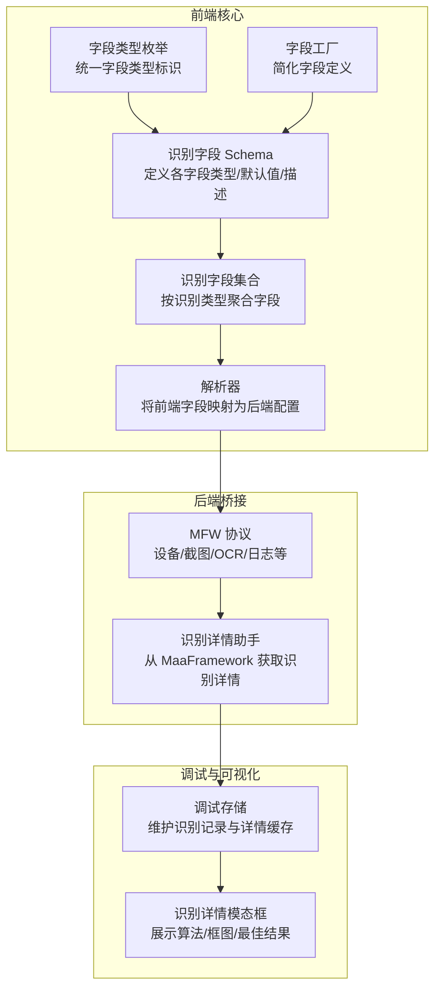
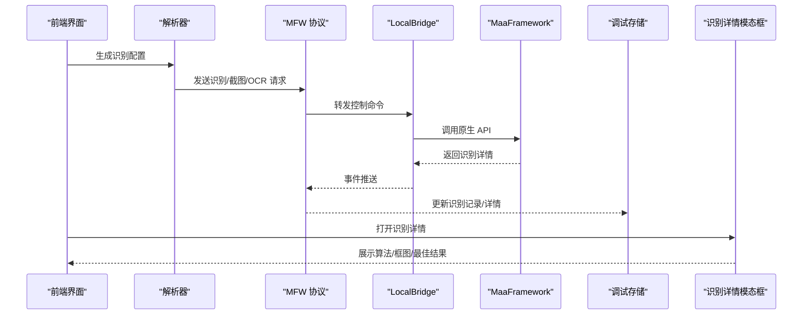
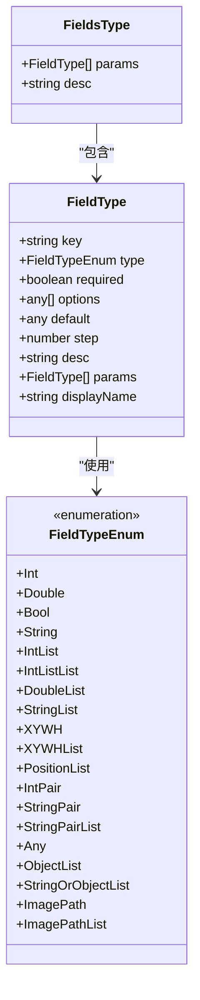
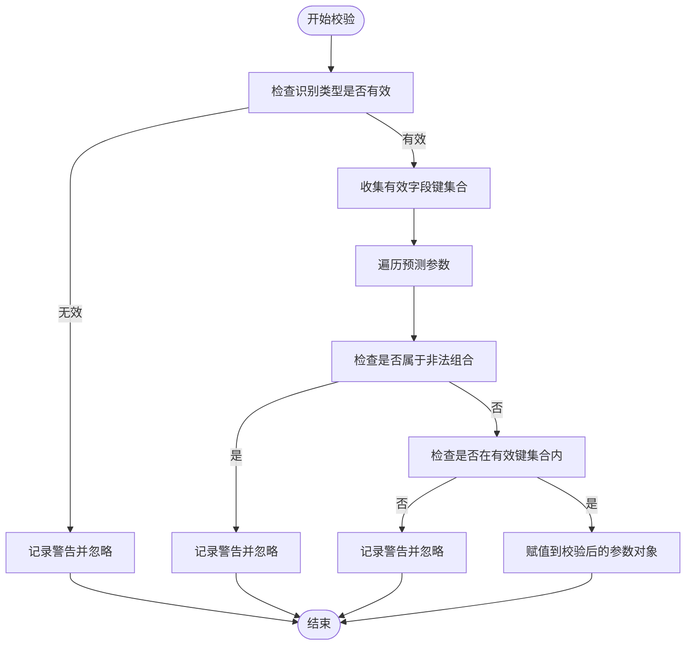
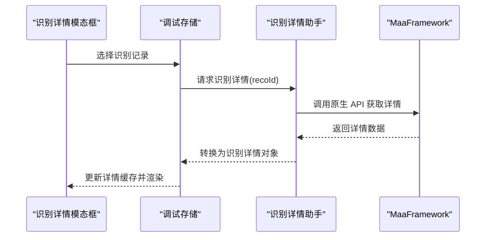
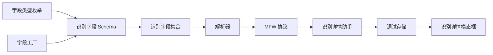

# 识别字段

<cite>
**本文档引用的文件**
- [schema.ts](file://src/core/fields/recognition/schema.ts)
- [fields.ts](file://src/core/fields/recognition/fields.ts)
- [fieldTypes.ts](file://src/core/fields/fieldTypes.ts)
- [types.ts](file://src/core/fields/types.ts)
- [fieldFactory.ts](file://src/core/fields/fieldFactory.ts)
- [reco_detail_helper.go](file://LocalBridge/internal/mfw/reco_detail_helper.go)
- [MFWProtocol.ts](file://src/services/protocols/MFWProtocol.ts)
- [RecognitionDetailModal.tsx](file://src/components/panels/tools/RecognitionDetailModal.tsx)
- [debugStore.ts](file://src/stores/debugStore.ts)
- [nodeParser.ts](file://src/core/parser/nodeParser.ts)
- [aiPredictor.ts](file://src/utils/aiPredictor.ts)
</cite>

## 目录
1. [简介](#简介)
2. [项目结构](#项目结构)
3. [核心组件](#核心组件)
4. [架构总览](#架构总览)
5. [详细组件分析](#详细组件分析)
6. [依赖分析](#依赖分析)
7. [性能考量](#性能考量)
8. [故障排查指南](#故障排查指南)
9. [结论](#结论)
10. [附录](#附录)

## 简介
本文件面向“识别字段系统”，系统性阐述识别字段的定义、类型与参数、验证规则、默认值处理、与 MaaFramework 的集成方式、优先级与组合使用策略，以及调试技巧与常见问题解决方案。目标读者既包括开发者，也包括需要在图形界面中高效配置识别参数的使用者。

## 项目结构
识别字段系统位于前端核心模块中，采用“Schema 定义 + 字段类型 + 字段集合”的分层设计，并通过解析器与调试存储模块与运行时集成。

图表来源
- [schema.ts:1-276](file://src/core/fields/recognition/schema.ts#L1-L276)
- [fields.ts:1-115](file://src/core/fields/recognition/fields.ts#L1-L115)
- [fieldTypes.ts:1-27](file://src/core/fields/fieldTypes.ts#L1-L27)
- [fieldFactory.ts:1-16](file://src/core/fields/fieldFactory.ts#L1-L16)
- [nodeParser.ts:50-96](file://src/core/parser/nodeParser.ts#L50-L96)
- [MFWProtocol.ts:1-774](file://src/services/protocols/MFWProtocol.ts#L1-L774)
- [reco_detail_helper.go:1-345](file://LocalBridge/internal/mfw/reco_detail_helper.go#L1-L345)
- [RecognitionDetailModal.tsx:1-261](file://src/components/panels/tools/RecognitionDetailModal.tsx#L1-L261)
- [debugStore.ts:1-800](file://src/stores/debugStore.ts#L1-L800)

章节来源
- [schema.ts:1-276](file://src/core/fields/recognition/schema.ts#L1-L276)
- [fields.ts:1-115](file://src/core/fields/recognition/fields.ts#L1-L115)
- [fieldTypes.ts:1-27](file://src/core/fields/fieldTypes.ts#L1-L27)
- [fieldFactory.ts:1-16](file://src/core/fields/fieldFactory.ts#L1-L16)
- [nodeParser.ts:50-96](file://src/core/parser/nodeParser.ts#L50-L96)

## 核心组件
- 识别字段 Schema：定义所有识别字段的键、类型、默认值、步长、选项、描述等元信息。
- 识别字段集合：按识别类型（如 OCR、TemplateMatch、FeatureMatch、ColorMatch、NeuralNetworkClassify/Detect、And/Or 组合、Custom、DirectHit）聚合字段。
- 字段类型枚举：统一字段类型标识，支持基础类型、复合类型、图片路径类型等。
- 字段工厂：提供便捷的字段定义与批量定义能力。
- 解析器：将前端字段映射为后端配置，处理默认识别导出、协议版本兼容等。
- 调试存储与可视化：维护识别记录、详情缓存，并提供识别详情模态框。
- MFW 协议与识别详情助手：负责与 MaaFramework 交互，获取识别详情与绘制图像。

章节来源
- [schema.ts:1-276](file://src/core/fields/recognition/schema.ts#L1-L276)
- [fields.ts:1-115](file://src/core/fields/recognition/fields.ts#L1-L115)
- [fieldTypes.ts:1-27](file://src/core/fields/fieldTypes.ts#L1-L27)
- [fieldFactory.ts:1-16](file://src/core/fields/fieldFactory.ts#L1-L16)
- [nodeParser.ts:50-96](file://src/core/parser/nodeParser.ts#L50-L96)
- [debugStore.ts:1-800](file://src/stores/debugStore.ts#L1-L800)
- [RecognitionDetailModal.tsx:1-261](file://src/components/panels/tools/RecognitionDetailModal.tsx#L1-L261)
- [MFWProtocol.ts:1-774](file://src/services/protocols/MFWProtocol.ts#L1-L774)
- [reco_detail_helper.go:1-345](file://LocalBridge/internal/mfw/reco_detail_helper.go#L1-L345)

## 架构总览
识别字段系统与 MaaFramework 的集成路径如下：
- 前端通过 MFWProtocol 发送设备/截图/OCR 等请求；
- LocalBridge 侧通过 RecoDetailHelper 调用 MaaFramework 原生 API 获取识别详情；
- 调试存储接收后端事件，构建识别记录与详情缓存；
- 识别详情模态框展示算法类型、最佳结果、识别框、绘制图像与原始图像。

图表来源
- [MFWProtocol.ts:1-774](file://src/services/protocols/MFWProtocol.ts#L1-L774)
- [reco_detail_helper.go:168-267](file://LocalBridge/internal/mfw/reco_detail_helper.go#L168-L267)
- [debugStore.ts:437-795](file://src/stores/debugStore.ts#L437-L795)
- [RecognitionDetailModal.tsx:1-261](file://src/components/panels/tools/RecognitionDetailModal.tsx#L1-L261)

## 详细组件分析

### 识别字段定义与类型体系
- 字段类型枚举涵盖整数、浮点、布尔、字符串、列表、XYWH、图片路径等，支持复合类型与多态类型（如 StringOrObjectList）。
- 字段定义包含键、类型、是否必填、选项、默认值、步长、描述等，便于 UI 渲染与校验。
- 字段工厂提供便捷的字段定义与批量定义能力，降低重复代码。

图表来源
- [types.ts:6-24](file://src/core/fields/types.ts#L6-L24)
- [fieldTypes.ts:4-26](file://src/core/fields/fieldTypes.ts#L4-L26)
- [fieldFactory.ts:6-15](file://src/core/fields/fieldFactory.ts#L6-L15)

章节来源
- [types.ts:1-34](file://src/core/fields/types.ts#L1-L34)
- [fieldTypes.ts:1-27](file://src/core/fields/fieldTypes.ts#L1-L27)
- [fieldFactory.ts:1-16](file://src/core/fields/fieldFactory.ts#L1-L16)

### 识别类型与参数详解
- 通用字段
  - roi：感兴趣区域（ROI），支持数组 [x,y,w,h] 与字符串引用前置节点/锚点。
  - roiOffset：在 roi 基础上的偏移。
  - index：命中第几个结果，支持负索引。
- 模板匹配（TemplateMatch）
  - template：模板图片路径（支持文件夹递归加载）。
  - threshold：匹配阈值，支持数组与单值。
  - method：匹配算法（OpenCV TemplateMatchModes）。
  - green_mask：是否启用绿色掩码。
- 排序字段（order_by）
  - 支持 Horizontal、Vertical、Score、Area、Length、Random、Expected 等，不同识别类型提供不同的可选项集合。
- 特征匹配（FeatureMatch）
  - detector：SIFT/KAZE/AKAZE/BRISK/ORB。
  - ratio：KNN 距离比值。
  - count：匹配特征点最低数量。
- 颜色匹配（ColorMatch）
  - method：颜色空间转换（RGB/HSV/GRAY）。
  - lower/upper：颜色区间（通道数需与 method 一致）。
  - count：符合像素点最低数量。
  - connected：是否仅统计连通区域。
- OCR
  - expected：期望结果（支持正则）。
  - threshold：模型置信度阈值。
  - replace：替换不准确的识别结果。
  - only_rec：仅识别（不进行检测，需精确设置 roi）。
  - model：自定义 OCR 模型路径。
  - color_filter：颜色过滤节点引用。
- 神经网络（NeuralNetworkClassify/Detect）
  - labels：分类标签名。
  - model：ONNX 模型路径。
  - expected：期望分类下标。
  - detect 模型支持 YoloV8 等。
- 组合识别（And/Or）
  - all_of/any_of：子识别列表（字符串引用或内联对象）。
  - box_index：指定输出哪个子识别的识别框。
  - sub_name：子识别可引用的过滤结果作为 ROI。
- 自定义识别（Custom）
  - custom_recognition：识别名（与注册名一致）。
  - custom_recognition_param：任意参数对象。
  - roi：自定义识别区域。
- 直接命中（DirectHit）
  - 无参数，直接执行动作。

章节来源
- [schema.ts:9-268](file://src/core/fields/recognition/schema.ts#L9-L268)
- [fields.ts:7-114](file://src/core/fields/recognition/fields.ts#L7-L114)

### 参数验证与默认值处理
- 字段定义包含 required、default、options、step 等元信息，用于 UI 渲染与校验。
- AI 预测校验：对识别类型与参数进行有效性检查，忽略无效字段与非法组合。
- 导出策略：默认识别（DirectHit 且无参数）可按配置决定是否导出。

图表来源
- [aiPredictor.ts:608-687](file://src/utils/aiPredictor.ts#L608-L687)
- [nodeParser.ts:88-96](file://src/core/parser/nodeParser.ts#L88-L96)

章节来源
- [aiPredictor.ts:608-687](file://src/utils/aiPredictor.ts#L608-L687)
- [nodeParser.ts:88-96](file://src/core/parser/nodeParser.ts#L88-L96)

### 与 MaaFramework 的集成
- MFWProtocol：封装设备管理、截图、OCR、日志等 WebSocket 消息路由与发送方法。
- RecoDetailHelper：通过 purego 直接调用 MaaFramework 原生 API，获取识别详情（名称、算法、命中、框、详情 JSON、原始图像、绘制图像）。
- 调试存储：接收后端事件，维护识别记录与详情缓存；识别详情模态框展示算法信息、最佳结果、识别框、绘制图像与原始图像。

图表来源
- [RecognitionDetailModal.tsx:34-62](file://src/components/panels/tools/RecognitionDetailModal.tsx#L34-L62)
- [debugStore.ts:666-683](file://src/stores/debugStore.ts#L666-L683)
- [reco_detail_helper.go:168-267](file://LocalBridge/internal/mfw/reco_detail_helper.go#L168-L267)

章节来源
- [MFWProtocol.ts:1-774](file://src/services/protocols/MFWProtocol.ts#L1-L774)
- [reco_detail_helper.go:1-345](file://LocalBridge/internal/mfw/reco_detail_helper.go#L1-L345)
- [RecognitionDetailModal.tsx:1-261](file://src/components/panels/tools/RecognitionDetailModal.tsx#L1-L261)
- [debugStore.ts:1-800](file://src/stores/debugStore.ts#L1-L800)

### 优先级与组合使用
- 通用优先级：roi/roiOffset/index 提供全局筛选与排序。
- 排序字段（order_by）：不同识别类型提供不同排序维度（如 Area、Length、Expected），结合 index 使用可实现灵活的优先级控制。
- 组合识别（And/Or）：And 要求所有子识别命中，Or 命中首个即成功；支持通过 box_index 指定输出框，通过 sub_name 在当前节点内传递过滤结果作为 ROI。
- 直接命中（DirectHit）：无参数，直接执行动作，适合无需识别的场景。

章节来源
- [schema.ts:57-92](file://src/core/fields/recognition/schema.ts#L57-L92)
- [schema.ts:220-246](file://src/core/fields/recognition/schema.ts#L220-L246)
- [fields.ts:77-88](file://src/core/fields/recognition/fields.ts#L77-L88)

## 依赖分析
识别字段系统内部依赖关系清晰，遵循“定义—聚合—解析—运行时”的分层：

图表来源
- [fieldTypes.ts:1-27](file://src/core/fields/fieldTypes.ts#L1-L27)
- [fieldFactory.ts:1-16](file://src/core/fields/fieldFactory.ts#L1-L16)
- [schema.ts:1-276](file://src/core/fields/recognition/schema.ts#L1-L276)
- [fields.ts:1-115](file://src/core/fields/recognition/fields.ts#L1-L115)
- [nodeParser.ts:50-96](file://src/core/parser/nodeParser.ts#L50-L96)
- [MFWProtocol.ts:1-774](file://src/services/protocols/MFWProtocol.ts#L1-L774)
- [reco_detail_helper.go:1-345](file://LocalBridge/internal/mfw/reco_detail_helper.go#L1-L345)
- [debugStore.ts:1-800](file://src/stores/debugStore.ts#L1-L800)
- [RecognitionDetailModal.tsx:1-261](file://src/components/panels/tools/RecognitionDetailModal.tsx#L1-L261)

章节来源
- [schema.ts:1-276](file://src/core/fields/recognition/schema.ts#L1-L276)
- [fields.ts:1-115](file://src/core/fields/recognition/fields.ts#L1-L115)
- [nodeParser.ts:50-96](file://src/core/parser/nodeParser.ts#L50-L96)

## 性能考量
- ROI 精准裁剪：合理设置 roi/roiOffset，缩小识别范围，减少计算量。
- 阈值与算法选择：模板匹配的 method 与 threshold、特征匹配的 detector/ratio、颜色匹配的 connected/count 等参数直接影响性能与精度。
- 组合识别：And/Or 的子识别数量与顺序会影响整体耗时，建议将高成本识别放在末尾或使用更严格的阈值。
- 缓存与内存：调试详情缓存有容量限制与清理策略，避免长时间调试导致内存膨胀。

## 故障排查指南
- 无法连接设备
  - 检查 MaaFramework 库路径配置是否正确。
  - ADB 设备需处于可连接状态；Win32 窗口需保持可见。
- 截图失败或黑屏
  - 尝试断开并重新连接设备；确认截图方式与设备兼容性。
- OCR 识别不准确
  - 调整 roi 区域，避免背景干扰；必要时切换前端/原生识别模式；首次使用需等待模型下载。
- 模板/颜色路径问题
  - 确认项目根目录与 image/template 目录存在；系统会自动识别并优先使用这些目录。
- 识别详情未显示
  - 确认后端事件中包含详情数据；识别详情模态框会在事件到达时自动显示。

章节来源
- [MFWProtocol.ts:1-774](file://src/services/protocols/MFWProtocol.ts#L1-L774)
- [reco_detail_helper.go:1-345](file://LocalBridge/internal/mfw/reco_detail_helper.go#L1-L345)
- [RecognitionDetailModal.tsx:250-256](file://src/components/panels/tools/RecognitionDetailModal.tsx#L250-L256)

## 结论
识别字段系统通过严谨的 Schema 定义、完善的字段类型体系与解析导出策略，实现了对多种识别方式（OCR、模板匹配、特征匹配、颜色匹配、神经网络、组合识别、自定义识别、直接命中）的统一建模与配置。配合 MaaFramework 的原生 API 与前端调试可视化，能够高效地进行识别参数调优与问题定位。建议在实际工程中：
- 优先使用 ROI 精准裁剪；
- 根据场景选择合适的排序与阈值；
- 合理组织组合识别的子识别顺序；
- 善用调试详情与缓存，提升迭代效率。

## 附录
- 识别字段 Schema 键列表：用于 UI 构建与校验的字段键集合。
- 识别类型与字段映射：按识别类型聚合字段，便于 UI 展示与参数联动。
- 参数默认值与步长：用于 UI 控件的默认值与步进设置。

章节来源
- [schema.ts:270-276](file://src/core/fields/recognition/schema.ts#L270-L276)
- [fields.ts:7-114](file://src/core/fields/recognition/fields.ts#L7-L114)