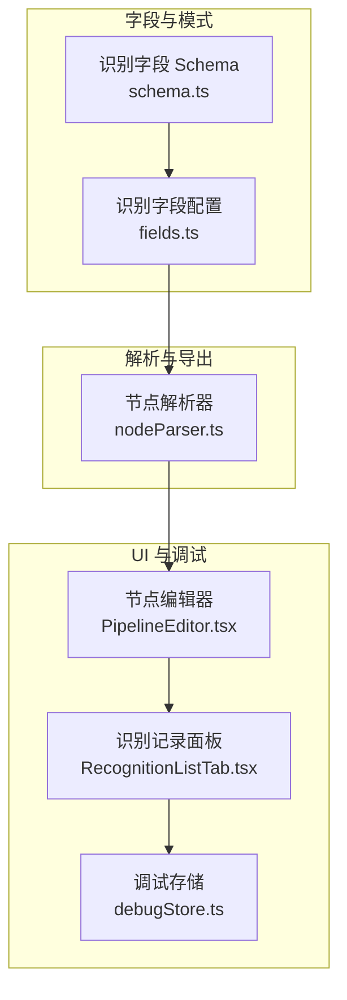
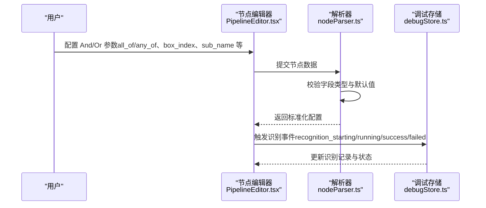
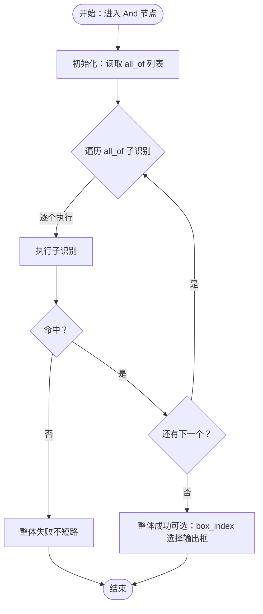
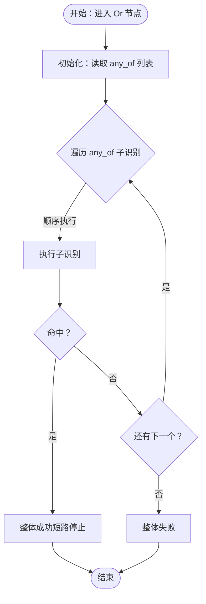
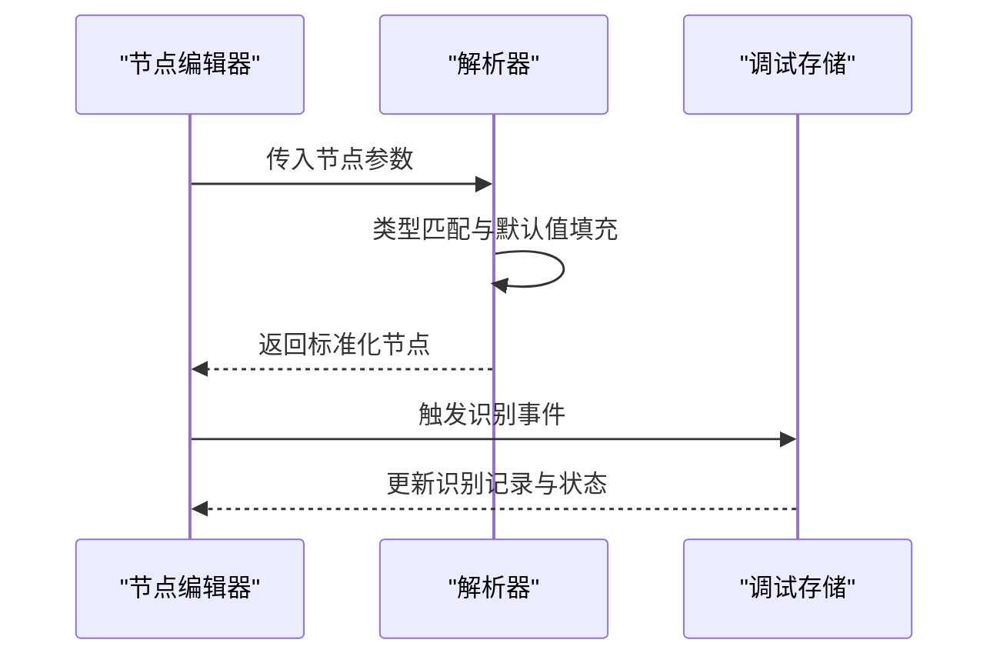

# 逻辑组合识别

<cite>
**本文引用的文件**
- [schema.ts](file://src/core/fields/recognition/schema.ts)
- [fields.ts](file://src/core/fields/recognition/fields.ts)
- [nodeParser.ts](file://src/core/parser/nodeParser.ts)
- [PipelineEditor.tsx](file://src/components/panels/node-editors/PipelineEditor.tsx)
- [RecognitionListTab.tsx](file://src/components/panels/tools/RecognitionListTab.tsx)
- [debugStore.ts](file://src/stores/debugStore.ts)
- [流程级调试.md](file://docsite/docs/01.指南/20.本地服务/40.流程级调试.md)
</cite>

## 目录
1. [简介](#简介)
2. [项目结构](#项目结构)
3. [核心组件](#核心组件)
4. [架构总览](#架构总览)
5. [详细组件分析](#详细组件分析)
6. [依赖关系分析](#依赖关系分析)
7. [性能考量](#性能考量)
8. [故障排查指南](#故障排查指南)
9. [结论](#结论)
10. [附录](#附录)

## 简介
本篇文档围绕“逻辑组合识别”展开，系统讲解 And（逻辑与）与 Or（逻辑或）两种组合识别的工作原理、参数配置、执行顺序与短路特性，并给出复杂场景的设计思路、最佳实践与实际应用示例。读者将理解如何通过子识别器列表、索引设置、名称标识等参数，构建稳定高效的多条件识别策略。

## 项目结构
与“逻辑组合识别”直接相关的代码分布在以下模块：
- 识别字段定义与参数校验：src/core/fields/recognition
- 节点解析与导出：src/core/parser
- UI 节点编辑器与识别记录面板：src/components/panels
- 流程级调试与识别记录存储：src/stores

图表来源
- [schema.ts:1-276](file://src/core/fields/recognition/schema.ts#L1-L276)
- [fields.ts:1-115](file://src/core/fields/recognition/fields.ts#L1-L115)
- [nodeParser.ts:1-372](file://src/core/parser/nodeParser.ts#L1-L372)
- [PipelineEditor.tsx:346-383](file://src/components/panels/node-editors/PipelineEditor.tsx#L346-L383)
- [RecognitionListTab.tsx:58-105](file://src/components/panels/tools/RecognitionListTab.tsx#L58-L105)
- [debugStore.ts:449-733](file://src/stores/debugStore.ts#L449-L733)

章节来源
- [schema.ts:1-276](file://src/core/fields/recognition/schema.ts#L1-L276)
- [fields.ts:1-115](file://src/core/fields/recognition/fields.ts#L1-L115)
- [nodeParser.ts:1-372](file://src/core/parser/nodeParser.ts#L1-L372)
- [PipelineEditor.tsx:346-383](file://src/components/panels/node-editors/PipelineEditor.tsx#L346-L383)
- [RecognitionListTab.tsx:58-105](file://src/components/panels/tools/RecognitionListTab.tsx#L58-L105)
- [debugStore.ts:449-733](file://src/stores/debugStore.ts#L449-L733)

## 核心组件
- 组合识别字段定义
  - And：逻辑与，要求 all_of 中的所有子识别均命中才成功；支持 box_index 指定输出框，支持 sub_name 在当前节点内共享 ROI。
  - Or：逻辑或，命中 any_of 中的第一个子识别即成功，后续不再识别（短路）。
- 子识别列表配置
  - all_of/any_of：元素可为字符串（引用前置节点名）或对象（内联识别定义），兼容 v1/v2 混用。
- 索引与框选择
  - index：命中第几个结果；box_index：选择输出框索引。
- 名称标识
  - sub_name：在当前节点内为后续子识别提供基于 filtered 的 ROI 名称，同名以最后一个为准。

章节来源
- [fields.ts:77-88](file://src/core/fields/recognition/fields.ts#L77-L88)
- [schema.ts:220-246](file://src/core/fields/recognition/schema.ts#L220-L246)

## 架构总览
组合识别在 UI 中由节点编辑器呈现，解析器负责参数校验与导出，调试系统记录识别过程与结果。

图表来源
- [PipelineEditor.tsx:346-383](file://src/components/panels/node-editors/PipelineEditor.tsx#L346-L383)
- [nodeParser.ts:21-147](file://src/core/parser/nodeParser.ts#L21-L147)
- [debugStore.ts:550-733](file://src/stores/debugStore.ts#L550-L733)

## 详细组件分析

### And（逻辑与）组件分析
- 工作原理
  - 顺序执行 all_of 中的子识别，全部命中才整体成功；任一失败则整体失败。
  - 可通过 box_index 指定输出框索引，使当前节点的识别框来自特定子识别。
  - 通过 sub_name 将前一个子识别的 filtered 结果作为后续子识别的 ROI 名称，实现“前序结果驱动”的多阶段识别。
- 关键参数
  - all_of：子识别列表（字符串或对象）。
  - box_index：输出框索引（0 <= index < all_of.size）。
  - sub_name：当前节点内生效的 ROI 名称，供后续子识别引用。
- 执行顺序与短路
  - 严格顺序执行，不短路；即使前面多个子识别失败，仍会按顺序尝试全部，避免遗漏。
- 使用场景
  - 多阶段定位：先颜色/模板粗定位，再 OCR 精确定位。
  - 多条件强约束：必须同时满足多个独立条件才执行动作。

图表来源
- [fields.ts:77-83](file://src/core/fields/recognition/fields.ts#L77-L83)
- [schema.ts:220-239](file://src/core/fields/recognition/schema.ts#L220-L239)

章节来源
- [fields.ts:77-83](file://src/core/fields/recognition/fields.ts#L77-L83)
- [schema.ts:220-239](file://src/core/fields/recognition/schema.ts#L220-L239)

### Or（逻辑或）组件分析
- 工作原理
  - 顺序执行 any_of 中的子识别，命中第一个即成功，后续不再识别（短路）。
- 关键参数
  - any_of：子识别列表（字符串或对象）。
- 执行顺序与短路
  - 严格顺序执行，命中即停，减少无效计算。
- 使用场景
  - 多种候选形态：同一目标可能出现在不同区域或不同形态，优先尝试命中率高的形态。
  - 多分支判定：不同条件下采用不同识别策略，按优先级排列。

图表来源
- [fields.ts:85-87](file://src/core/fields/recognition/fields.ts#L85-L87)
- [schema.ts:240-246](file://src/core/fields/recognition/schema.ts#L240-L246)

章节来源
- [fields.ts:85-87](file://src/core/fields/recognition/fields.ts#L85-L87)
- [schema.ts:240-246](file://src/core/fields/recognition/schema.ts#L240-L246)

### 参数详解与配置要点
- 子识别列表（all_of/any_of）
  - 元素类型：字符串（引用前置节点名）或对象（内联识别定义），兼容 v1/v2 混用。
  - 建议：将高频命中、成本低的子识别排在前面，利用 Or 的短路特性提升性能。
- 索引设置（index、box_index）
  - index：命中第几个结果，支持负索引；超出范围视为无结果。
  - box_index：选择输出框索引，确保最终框与预期一致。
- 名称标识（sub_name）
  - 在当前节点内为后续子识别提供 filtered ROI 名称，同名以最后一个为准。
  - 常用于“先粗后精”的两阶段识别：第一阶段输出 filtered，第二阶段以 filtered 为 ROI 再次识别。

章节来源
- [schema.ts:21-26](file://src/core/fields/recognition/schema.ts#L21-L26)
- [schema.ts:220-246](file://src/core/fields/recognition/schema.ts#L220-L246)

### UI 与解析链路
- 节点编辑器
  - 根据识别类型动态渲染字段面板，支持添加/删除/修改参数。
- 解析器
  - 校验字段类型与默认值，兼容 v1/v2 识别参数，保证导出一致性。
- 调试与记录
  - 识别事件驱动识别记录更新，支持查看命中/失败详情与调试图像。

图表来源
- [PipelineEditor.tsx:346-383](file://src/components/panels/node-editors/PipelineEditor.tsx#L346-L383)
- [nodeParser.ts:21-147](file://src/core/parser/nodeParser.ts#L21-L147)
- [debugStore.ts:550-733](file://src/stores/debugStore.ts#L550-L733)

章节来源
- [PipelineEditor.tsx:346-383](file://src/components/panels/node-editors/PipelineEditor.tsx#L346-L383)
- [nodeParser.ts:21-147](file://src/core/parser/nodeParser.ts#L21-L147)
- [RecognitionListTab.tsx:58-105](file://src/components/panels/tools/RecognitionListTab.tsx#L58-L105)
- [debugStore.ts:550-733](file://src/stores/debugStore.ts#L550-L733)

## 依赖关系分析
- 字段定义依赖于字段类型枚举与校验器，确保参数合法与默认值一致。
- 节点解析器依赖字段配置与类型匹配器，统一 v1/v2 参数格式。
- UI 依赖解析器输出与调试存储，提供可视化与可观测性。

图表来源
- [schema.ts:1-276](file://src/core/fields/recognition/schema.ts#L1-L276)
- [fields.ts:1-115](file://src/core/fields/recognition/fields.ts#L1-L115)
- [nodeParser.ts:1-372](file://src/core/parser/nodeParser.ts#L1-L372)
- [PipelineEditor.tsx:346-383](file://src/components/panels/node-editors/PipelineEditor.tsx#L346-L383)
- [debugStore.ts:449-733](file://src/stores/debugStore.ts#L449-L733)

章节来源
- [schema.ts:1-276](file://src/core/fields/recognition/schema.ts#L1-L276)
- [fields.ts:1-115](file://src/core/fields/recognition/fields.ts#L1-L115)
- [nodeParser.ts:1-372](file://src/core/parser/nodeParser.ts#L1-L372)
- [PipelineEditor.tsx:346-383](file://src/components/panels/node-editors/PipelineEditor.tsx#L346-L383)
- [debugStore.ts:449-733](file://src/stores/debugStore.ts#L449-L733)

## 性能考量
- Or 的短路特性可显著降低无效计算，建议将高命中率、低成本的子识别前置。
- And 的顺序执行意味着即使前面失败也会继续尝试，适合强约束场景；若存在明显耗时差异，可考虑拆分为多个 Or 分支以缩短平均延迟。
- 使用 index 与 box_index 精准定位最佳结果，避免重复识别。
- sub_name 串联多个子识别，减少重复 ROI 计算，提高整体吞吐。

## 故障排查指南
- 识别记录与状态
  - 识别阶段状态包括 pending/running/succeeded/failed；可在识别记录面板查看详细信息与调试图像。
  - 节点执行历史记录运行时长、状态与错误信息，便于定位瓶颈。
- 常见问题
  - 子识别顺序不当导致整体失败：调整 any_of/all_of 的顺序，将高置信度子识别前置。
  - ROI 不一致导致误判：使用 sub_name 或明确设置 roi/roi_offset，确保各阶段在同一区域。
  - 输出框不正确：检查 box_index 是否指向正确的子识别索引。
- 调试建议
  - 启用流程级调试，观察识别目标与识别项状态变化。
  - 对关键节点开启 focus，获取更丰富的回调消息与模板字符串占位符。

章节来源
- [流程级调试.md:57-107](file://docsite/docs/01.指南/20.本地服务/40.流程级调试.md#L57-L107)
- [RecognitionListTab.tsx:58-105](file://src/components/panels/tools/RecognitionListTab.tsx#L58-L105)
- [debugStore.ts:449-733](file://src/stores/debugStore.ts#L449-L733)

## 结论
And/Or 组合识别通过“子识别列表 + 索引与框选择 + 名称标识”的参数体系，提供了灵活而强大的多条件识别能力。合理设计子识别顺序、利用短路与串联机制，能在保证稳定性的同时显著提升性能。配合流程级调试与可视化记录，可快速定位问题并持续优化识别策略。

## 附录

### 设计思路与最佳实践
- Or 的优先级设计
  - 将“形态简单、命中快、成本低”的子识别放在前面，利用短路特性减少平均耗时。
- And 的强约束设计
  - 将“必须全部满足”的条件拆分为多个子识别，确保每个条件独立可控；必要时使用 sub_name 将前一阶段结果作为下一阶段的 ROI。
- 索引与框选择
  - 使用 index 精确选择目标结果；使用 box_index 选择最合适的输出框，避免误判。
- 可观测性
  - 为关键节点启用 focus，记录识别开始/成功/失败的回调消息，便于回溯与优化。

### 实际应用案例与配置示例（路径指引）
- 多形态按钮识别（Or）
  - 将不同形态的按钮作为 any_of 的子识别，按命中概率排序，利用短路快速定位。
  - 参考路径：[schema.ts:240-246](file://src/core/fields/recognition/schema.ts#L240-L246)
- 两阶段定位（And + sub_name）
  - 第一阶段：颜色匹配或模板匹配，输出 filtered；
  - 第二阶段：在 filtered ROI 上进行 OCR 或细粒度模板匹配；
  - 使用 sub_name 将第一阶段结果传递给第二阶段。
  - 参考路径：[schema.ts:220-239](file://src/core/fields/recognition/schema.ts#L220-L239)
- 输出框一致性（box_index）
  - 当多个子识别均可作为输出框时，通过 box_index 指定最优框，确保后续动作定位准确。
  - 参考路径：[schema.ts:228-233](file://src/core/fields/recognition/schema.ts#L228-L233)