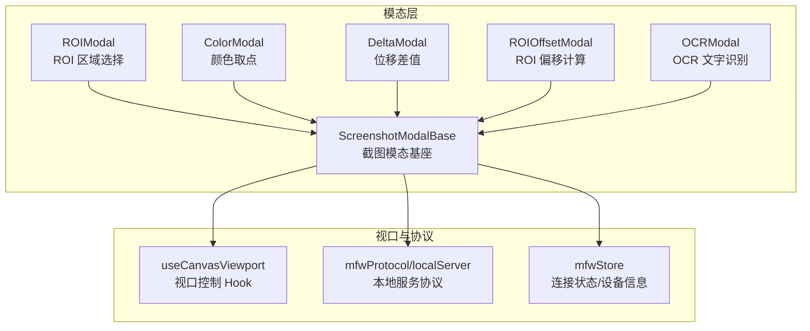
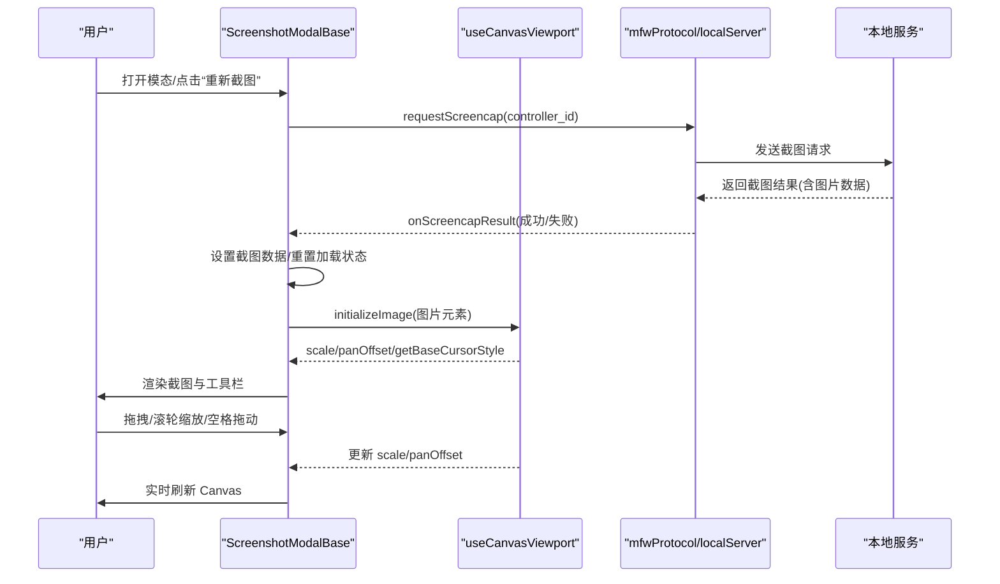
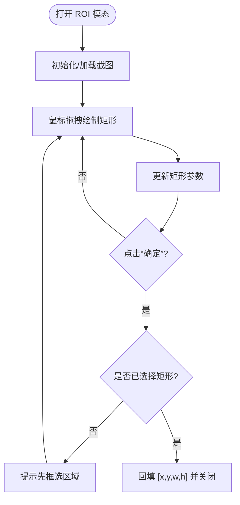
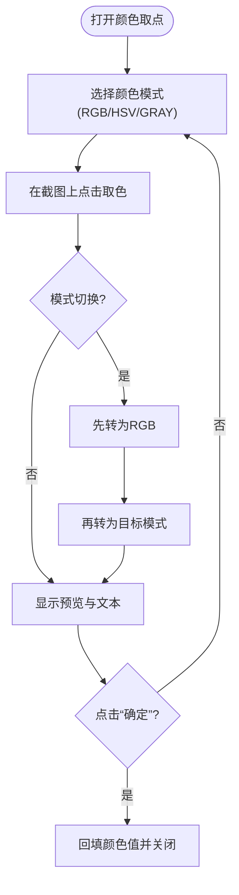
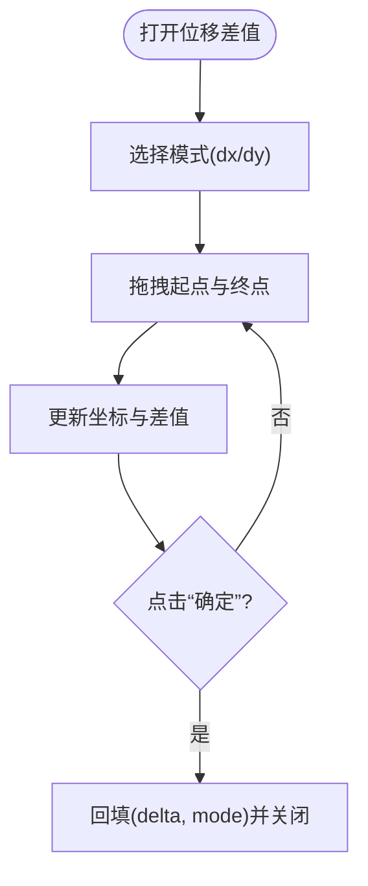
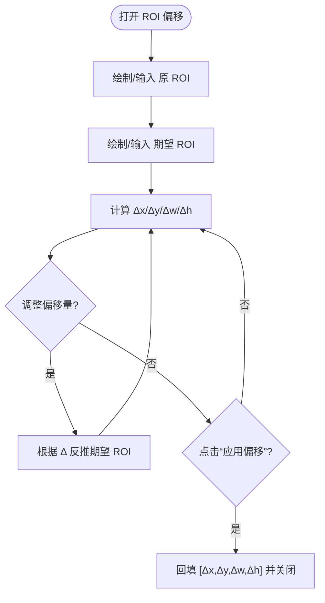
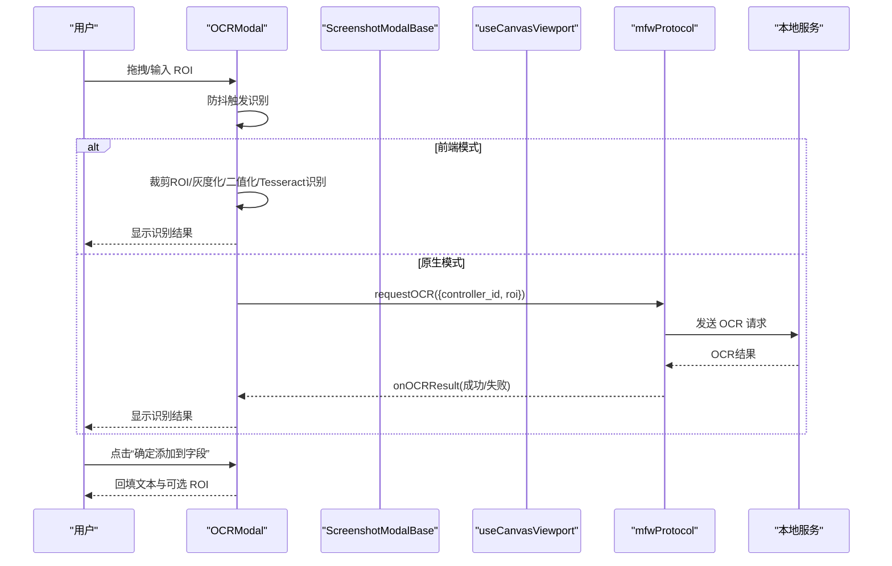
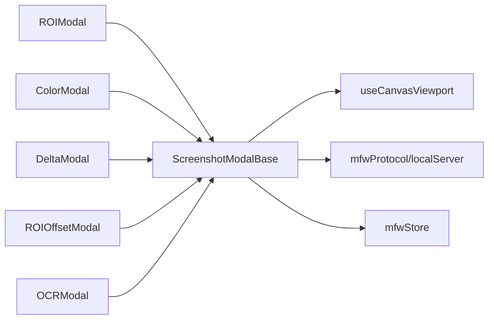

# 图像选择组件

<cite>
**本文引用的文件**
- [ScreenshotModalBase.tsx](file://src/components/modals/ScreenshotModalBase.tsx)
- [ROIModal.tsx](file://src/components/modals/ROIModal.tsx)
- [ColorModal.tsx](file://src/components/modals/ColorModal.tsx)
- [DeltaModal.tsx](file://src/components/modals/DeltaModal.tsx)
- [ROIOffsetModal.tsx](file://src/components/modals/ROIOffsetModal.tsx)
- [OCRModal.tsx](file://src/components/modals/OCRModal.tsx)
- [useCanvasViewport.ts](file://src/hooks/useCanvasViewport.ts)
- [server.ts](file://src/services/server.ts)
- [mfwStore.ts](file://src/stores/mfwStore.ts)
- [ParamFieldListElem.tsx](file://src/components/panels/field/items/ParamFieldListElem.tsx)
</cite>

## 目录
1. [简介](#简介)
2. [项目结构](#项目结构)
3. [核心组件](#核心组件)
4. [架构总览](#架构总览)
5. [详细组件分析](#详细组件分析)
6. [依赖关系分析](#依赖关系分析)
7. [性能考量](#性能考量)
8. [故障排查指南](#故障排查指南)
9. [结论](#结论)

## 简介
本组件体系围绕“图像选择”能力展开，提供统一的截图获取、视口缩放与平移、交互式 ROI 框选、颜色取点、位移差值计算以及 OCR 文字识别等功能。其核心是基于一个可复用的截图模态基座组件，衍生出多种用途的专用模态：ROI 区域选择、颜色取点、位移差值、ROI 偏移计算、OCR 文字识别等。这些组件共享同一套视口控制与截图流程，保证一致的用户体验与交互行为。

## 项目结构
该功能模块位于前端 src/components/modals 目录下，采用“基座 + 专用模态”的组合结构：
- 基座组件负责截图拉取、视口控制、布局与工具栏渲染
- 专用模态在基座之上叠加具体业务逻辑（如 ROI 框选、颜色取点、OCR 等）

图表来源
- [ScreenshotModalBase.tsx](file://src/components/modals/ScreenshotModalBase.tsx#L1-L405)
- [ROIModal.tsx](file://src/components/modals/ROIModal.tsx#L1-L394)
- [ColorModal.tsx](file://src/components/modals/ColorModal.tsx#L1-L509)
- [DeltaModal.tsx](file://src/components/modals/DeltaModal.tsx#L1-L401)
- [ROIOffsetModal.tsx](file://src/components/modals/ROIOffsetModal.tsx#L1-L936)
- [OCRModal.tsx](file://src/components/modals/OCRModal.tsx#L1-L884)
- [useCanvasViewport.ts](file://src/hooks/useCanvasViewport.ts#L1-L307)
- [server.ts](file://src/services/server.ts#L1-L369)
- [mfwStore.ts](file://src/stores/mfwStore.ts#L1-L147)

章节来源
- [ScreenshotModalBase.tsx](file://src/components/modals/ScreenshotModalBase.tsx#L1-L405)
- [useCanvasViewport.ts](file://src/hooks/useCanvasViewport.ts#L1-L307)
- [server.ts](file://src/services/server.ts#L1-L369)
- [mfwStore.ts](file://src/stores/mfwStore.ts#L1-L147)

## 核心组件
- 截图模态基座（ScreenshotModalBase）
  - 负责截图请求、结果监听、图片加载、视口控制注入、左右布局与操作区渲染
  - 对外暴露 renderCanvas、renderToolbar、onScreenshotChange、onImageLoaded、onReset 等扩展点
- 视口控制 Hook（useCanvasViewport）
  - 提供缩放、平移、空格/中键拖动、滚轮缩放、初始适配、重置等能力
  - 输出 scale、panOffset、isPanning、isSpacePressed、isMiddleMouseDown、getBaseCursorStyle 等状态与方法
- 本地服务协议（mfwProtocol/localServer）
  - 通过 WebSocket 与本地服务通信，封装 screencap/OCR 等请求与结果监听
- 连接状态存储（mfwStore）
  - 维护连接状态、控制器类型与 ID、设备信息等，为截图请求提供必要条件

章节来源
- [ScreenshotModalBase.tsx](file://src/components/modals/ScreenshotModalBase.tsx#L1-L405)
- [useCanvasViewport.ts](file://src/hooks/useCanvasViewport.ts#L1-L307)
- [server.ts](file://src/services/server.ts#L1-L369)
- [mfwStore.ts](file://src/stores/mfwStore.ts#L1-L147)

## 架构总览
下面的序列图展示了“截图获取与视口渲染”的典型流程，涵盖请求、结果监听、图片加载与 Canvas 渲染：

图表来源
- [ScreenshotModalBase.tsx](file://src/components/modals/ScreenshotModalBase.tsx#L120-L208)
- [useCanvasViewport.ts](file://src/hooks/useCanvasViewport.ts#L123-L214)
- [server.ts](file://src/services/server.ts#L1-L369)

## 详细组件分析

### 截图模态基座（ScreenshotModalBase）
- 职责
  - 统一管理截图生命周期：请求 -> 监听 -> 加载 -> 渲染
  - 提供视口控制注入：scale、panOffset、拖拽、滚轮缩放、初始适配
  - 左右布局：左侧截图预览区，右侧参数配置区；支持自定义工具栏与参数面板
  - 操作按钮：重新截图、取消、确认（可禁用）
- 关键交互
  - 打开时自动请求截图并重置视口
  - 监听截图结果，更新截图数据与加载状态
  - 图片加载完成后回调子组件，触发二次渲染
- 扩展点
  - renderCanvas：传入 CanvasRenderProps，返回自定义 Canvas
  - renderToolbar：传入 ViewportProps，返回自定义工具栏
  - onScreenshotChange/onImageLoaded/onReset：生命周期回调

章节来源
- [ScreenshotModalBase.tsx](file://src/components/modals/ScreenshotModalBase.tsx#L1-L405)

### ROI 区域选择（ROIModal）
- 功能要点
  - 支持鼠标拖拽绘制矩形 ROI，并实时在 Canvas 上绘制
  - 支持手动输入 x/y/w/h，输入变化时自动触发重绘
  - 确认时将四元组 [x, y, w, h] 回填给调用方
  - 支持初始 ROI 的展示与重置
- 交互细节
  - 鼠标按下：根据是否按住空格或中键决定拖动模式
  - 鼠标移动：动态更新矩形宽高，支持反向拖拽
  - 鼠标抬起：结束绘制，触发重绘
- 与基座协作
  - 通过 renderCanvas 注入 Canvas，使用基座提供的 scale/panOffset/initializeImage
  - 通过 onScreenshotChange/onImageLoaded/onReset 与基座同步状态

图表来源
- [ROIModal.tsx](file://src/components/modals/ROIModal.tsx#L1-L394)

章节来源
- [ROIModal.tsx](file://src/components/modals/ROIModal.tsx#L1-L394)

### 颜色取点（ColorModal）
- 功能要点
  - 支持三种颜色模式：RGB、HSV、GRAY
  - 在截图上点击取点，自动转换为当前模式并显示预览
  - 支持在不同模式间切换，内部进行颜色空间转换
  - 确认时回填所选颜色值
- 交互细节
  - 点击取色：读取像素点 RGB 值，按当前模式格式化输出
  - 模式切换：若已有颜色，先转换到 RGB 再转为目标模式
  - 预览：根据模式生成对应背景色块与文本
- 与基座协作
  - 通过 renderCanvas 注入 Canvas，使用基座提供的缩放与拖动
  - 通过 onImageLoaded 初始化 Canvas 并绘制底图

图表来源
- [ColorModal.tsx](file://src/components/modals/ColorModal.tsx#L1-L509)

章节来源
- [ColorModal.tsx](file://src/components/modals/ColorModal.tsx#L1-L509)

### 位移差值（DeltaModal）
- 功能要点
  - 在截图上拖动起点与终点，计算水平(dx)或垂直(dy)差值
  - 支持手动输入起点/终点坐标，输入变化时自动重绘
  - 显示差值计算公式与结果
- 交互细节
  - 拖拽绘制：起点与终点联动，连线与辅助线可视化
  - 模式切换：dx/dy 切换影响连线颜色与辅助线方向
  - 确认：回填差值与模式

图表来源
- [DeltaModal.tsx](file://src/components/modals/DeltaModal.tsx#L1-L401)

章节来源
- [DeltaModal.tsx](file://src/components/modals/DeltaModal.tsx#L1-L401)

### ROI 偏移计算（ROIOffsetModal）
- 功能要点
  - 同时维护“原 ROI”与“期望 ROI”，自动计算偏移量 [Δx, Δy, Δw, Δh]
  - 支持在两者之间交换、复制、清空，以及使用节点初始 ROI 重置
  - 支持直接输入偏移量，自动反推期望 ROI
- 交互细节
  - 工具栏：切换绘制目标（原/期望）、交换、复制、重置
  - Canvas：绘制两块 ROI 区域与连接箭头，直观展示偏移方向
  - 确认：回填偏移量

图表来源
- [ROIOffsetModal.tsx](file://src/components/modals/ROIOffsetModal.tsx#L1-L936)

章节来源
- [ROIOffsetModal.tsx](file://src/components/modals/ROIOffsetModal.tsx#L1-L936)

### OCR 文字识别（OCRModal）
- 功能要点
  - 支持两种识别模式：前端（Tesseract.js）与原生（MaaFramework）
  - 前端模式：在当前截图上裁剪 ROI 区域，进行灰度化与二值化，再识别
  - 原生模式：通过本地服务重新截取当前窗口画面进行识别
  - 支持手动输入 ROI 坐标，输入变化时自动触发识别
- 交互细节
  - 鼠标拖拽绘制 ROI，松开后进行防抖识别
  - 模式切换：前端无需额外配置，原生需确保 OCR 资源已配置
  - 结果：成功/失败状态与文本内容，支持回填到字段

图表来源
- [OCRModal.tsx](file://src/components/modals/OCRModal.tsx#L1-L884)
- [server.ts](file://src/services/server.ts#L1-L369)

章节来源
- [OCRModal.tsx](file://src/components/modals/OCRModal.tsx#L1-L884)
- [server.ts](file://src/services/server.ts#L1-L369)

### 视口控制 Hook（useCanvasViewport）
- 能力清单
  - 缩放：+/- 按钮、滚轮缩放、重置为适合尺寸
  - 平移：空格键拖动、中键拖动
  - 初始适配：根据容器与图片尺寸计算初始 scale 与 panOffset
  - 状态输出：scale、panOffset、isPanning、isSpacePressed、isMiddleMouseDown、getBaseCursorStyle
  - 重置：清空状态与图片引用
- 关键实现点
  - 滚轮缩放：以鼠标位置为中心进行缩放，更新 panOffset
  - 空格键：监听按键状态，切换拖动模式
  - 初始化：fit-to-container，居中显示

章节来源
- [useCanvasViewport.ts](file://src/hooks/useCanvasViewport.ts#L1-L307)

### 本地服务协议与连接状态（mfwProtocol/localServer, mfwStore）
- mfwProtocol/localServer
  - 封装 WebSocket 连接、握手、消息发送与路由注册
  - 提供 screencap/OCR 等请求与结果监听接口
- mfwStore
  - 维护连接状态、控制器类型与 ID、设备信息
  - 为截图请求提供 controller_id 与连接状态判断

章节来源
- [server.ts](file://src/services/server.ts#L1-L369)
- [mfwStore.ts](file://src/stores/mfwStore.ts#L1-L147)

### 与字段面板的集成（ParamFieldListElem.tsx）
- 在字段面板中，当用户选择“位移差”或“ROI 偏移”等参数项时，会弹出对应的模态（DeltaModal 或 ROIOffsetModal），并将最终结果回填到字段值中
- 该集成体现了“图像选择组件”作为通用工具在字段编辑流程中的落地

章节来源
- [ParamFieldListElem.tsx](file://src/components/panels/field/items/ParamFieldListElem.tsx#L686-L710)

## 依赖关系分析
- 组件耦合
  - 所有专用模态均依赖 ScreenshotModalBase 的布局与截图流程
  - 专用模态通过 renderCanvas 与基座共享视口控制能力
- 外部依赖
  - WebSocket 本地服务：用于截图与 OCR 请求
  - Zustand 状态：用于连接状态与设备信息
  - Ant Design UI：模态、按钮、输入框、提示等
- 潜在循环依赖
  - 模态与基座为单向依赖，无循环
  - 视口 Hook 与模态为弱耦合，仅通过 props 传递

图表来源
- [ScreenshotModalBase.tsx](file://src/components/modals/ScreenshotModalBase.tsx#L1-L405)
- [ROIModal.tsx](file://src/components/modals/ROIModal.tsx#L1-L394)
- [ColorModal.tsx](file://src/components/modals/ColorModal.tsx#L1-L509)
- [DeltaModal.tsx](file://src/components/modals/DeltaModal.tsx#L1-L401)
- [ROIOffsetModal.tsx](file://src/components/modals/ROIOffsetModal.tsx#L1-L936)
- [OCRModal.tsx](file://src/components/modals/OCRModal.tsx#L1-L884)
- [useCanvasViewport.ts](file://src/hooks/useCanvasViewport.ts#L1-L307)
- [server.ts](file://src/services/server.ts#L1-L369)
- [mfwStore.ts](file://src/stores/mfwStore.ts#L1-L147)

## 性能考量
- 截图与图片加载
  - 基座在收到截图结果后，通过 new Image() 触发 onload，避免阻塞 UI
  - 建议在关闭模态时重置截图与视口，释放内存
- Canvas 绘制
  - ROI/颜色/偏移等绘制采用离屏 Canvas，仅在必要时重绘（如矩形变化、图片加载完成）
  - 避免在高频事件（mousemove）中执行昂贵操作，当前实现通过防抖与最小化重绘达到平衡
- OCR 识别
  - 前端模式：首次加载模型会有延迟，后续识别较快；建议在合适时机预热
  - 原生模式：依赖本地服务，注意网络与服务稳定性
- 视口缩放
  - 滚轮缩放以鼠标为中心，panOffset 动态更新，保持视觉连续性

## 故障排查指南
- 无法连接本地服务
  - 现象：连接超时或失败提示
  - 排查：确认本地服务已启动、端口正确、协议版本匹配
  - 参考
    - [server.ts](file://src/services/server.ts#L105-L219)
- 截图为空或长时间处于“等待截图”
  - 现象：截图预览区空白，提示“等待截图”
  - 排查：检查连接状态与 controller_id 是否有效；确认本地服务已就绪
  - 参考
    - [ScreenshotModalBase.tsx](file://src/components/modals/ScreenshotModalBase.tsx#L124-L169)
    - [mfwStore.ts](file://src/stores/mfwStore.ts#L1-L147)
- OCR 资源未配置
  - 现象：原生 OCR 返回错误码“MFW_OCR_RESOURCE_NOT_CONFIGURED”
  - 排查：按照提示运行配置命令并重启服务
  - 参考
    - [OCRModal.tsx](file://src/components/modals/OCRModal.tsx#L292-L323)
- 颜色取点无效
  - 现象：点击截图无反应或未显示颜色
  - 排查：确认截图已加载、Canvas 已初始化、未处于拖动状态
  - 参考
    - [ColorModal.tsx](file://src/components/modals/ColorModal.tsx#L259-L341)
- ROI 框选无效
  - 现象：拖拽无矩形、确认按钮不可用
  - 排查：确认截图已加载、未处于拖动状态、矩形尺寸足够大（前端 OCR 防抖要求）
  - 参考
    - [ROIModal.tsx](file://src/components/modals/ROIModal.tsx#L361-L462)
    - [OCRModal.tsx](file://src/components/modals/OCRModal.tsx#L433-L462)

## 结论
图像选择组件通过“截图模态基座 + 视口控制 Hook + 本地服务协议”的组合，实现了统一且可扩展的图像交互体验。各专用模态在保持一致交互的前提下，分别聚焦 ROI 框选、颜色取点、位移差值、ROI 偏移与 OCR 识别等场景，满足复杂字段编辑与自动化识别需求。建议在实际使用中关注连接稳定性、模型加载时机与 Canvas 重绘策略，以获得更流畅的体验。