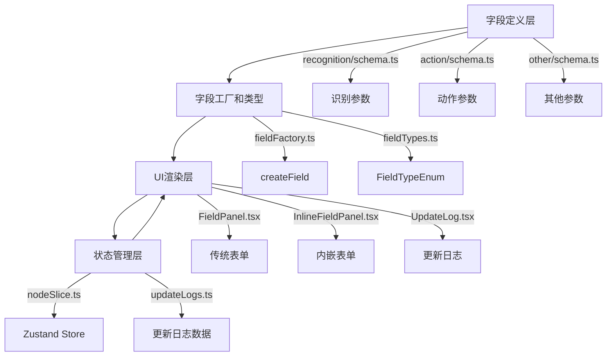

# 字段面板

<cite>
**本文档引用的文件**  
- [FieldPanel.tsx](file://src/components/panels/main/FieldPanel.tsx)
- [InlineFieldPanel.tsx](file://src/components/panels/main/InlineFieldPanel.tsx)
- [UpdateLog.tsx](file://src/components/modals/UpdateLog.tsx)
- [updateLogs.ts](file://src/data/updateLogs.ts)
- [PanelConfigSection.tsx](file://src/components/panels/config/PanelConfigSection.tsx)
- [configStore.ts](file://src/stores/configStore.ts)
- [InlineFieldPanel.module.less](file://src/styles/InlineFieldPanel.module.less)
- [DraggablePanel.tsx](file://src/components/panels/common/DraggablePanel.tsx)
- [panelPosition.ts](file://src/utils/panelPosition.ts)
- [fieldFactory.ts](file://src/core/fields/fieldFactory.ts)
- [fieldTypes.ts](file://src/core/fields/fieldTypes.ts)
- [KVElem.tsx](file://src/components/flow/nodes/components/KVElem.tsx)
- [types.ts](file://src/core/fields/types.ts)
- [schema.ts](file://src/core/fields/recognition/schema.ts)
- [schema.ts](file://src/core/fields/action/schema.ts)
- [schema.ts](file://src/core/fields/other/schema.ts)
- [index.ts](file://src/core/fields/index.ts)
- [flowSlice.ts](file://src/stores/flow/slices/nodeSlice.ts)
- [types.ts](file://src/stores/flow/types.ts)
</cite>

## 更新摘要
**已做更改**  
- 新增了更新日志增强功能，提供用户清晰的变更日志信息
- 更新了字段面板的架构概述，以反映同步字段描述条目的增强功能
- 更新了核心组件分析，包括对更新日志组件的分析
- 更新了依赖分析，增加了新的依赖关系
- 修订了性能考虑部分，以包含新的性能优化策略

## 目录
1. [简介](#简介)
2. [项目结构](#项目结构)
3. [核心组件](#核心组件)
4. [架构概述](#架构概述)
5. [详细组件分析](#详细组件分析)
6. [依赖分析](#依赖分析)
7. [性能考虑](#性能考虑)
8. [故障排除指南](#故障排除指南)
9. [结论](#结论)

## 简介
字段面板是 MaaPipelineEditor 的核心功能之一，负责根据用户选中的节点动态生成参数配置界面。该面板通过集成 `fieldFactory.ts` 和 `fieldTypes.ts` 模块，实现了基于识别、动作和其它三类参数的动态表单渲染逻辑。当用户在流程图中选择一个节点时，字段面板会自动展示该节点的所有可配置参数，并提供相应的 UI 组件进行编辑。参数值的变更会触发 Zustand 状态更新，并实时反映在 JSON 预览中。

本版本新增了更新日志增强功能，通过 `UpdateLog.tsx` 组件提供可视化的变更日志界面，用户可以清晰地查看应用的更新历史、功能改进、问题修复等内容。同时，系统支持扩展新的参数类型及其验证规则，为开发者提供了高度的灵活性。

**更新** 新增了更新日志增强功能，提供用户清晰的变更日志信息

## 项目结构
字段面板相关的代码主要分布在 `src/components/panels/` 和 `src/core/fields/` 目录下。`FieldPanel.tsx` 是传统字段面板的主组件，负责渲染整个界面。`InlineFieldPanel.tsx` 是新增的内嵌模式面板组件，允许在节点旁边直接编辑字段。`UpdateLog.tsx` 是新增的更新日志组件，提供可视化的变更日志界面。`updateLogs.ts` 包含了完整的更新日志数据，支持置顶公告和多类别更新内容。`fieldFactory.ts` 提供了创建字段的辅助函数，而 `fieldTypes.ts` 定义了所有可用的字段类型枚举。具体的字段定义则分散在 `recognition/`、`action/` 和 `other/` 子目录的 `schema.ts` 文件中。`KVElem.tsx` 组件用于在节点上显示键值对信息。整个系统的状态管理由 `src/stores/flow/` 目录下的 Zustand store 负责。

**图示来源**
- [FieldPanel.tsx](file://src/components/panels/main/FieldPanel.tsx)
- [InlineFieldPanel.tsx](file://src/components/panels/main/InlineFieldPanel.tsx)
- [UpdateLog.tsx](file://src/components/modals/UpdateLog.tsx)
- [updateLogs.ts](file://src/data/updateLogs.ts)
- [fieldFactory.ts](file://src/core/fields/fieldFactory.ts)
- [fieldTypes.ts](file://src/core/fields/fieldTypes.ts)
- [types.ts](file://src/core/fields/types.ts)
- [schema.ts](file://src/core/fields/recognition/schema.ts)
- [schema.ts](file://src/core/fields/action/schema.ts)
- [schema.ts](file://src/core/fields/other/schema.ts)
- [types.ts](file://src/stores/flow/types.ts)
- [nodeSlice.ts](file://src/stores/flow/slices/nodeSlice.ts)
- [KVElem.tsx](file://src/components/flow/nodes/components/KVElem.tsx)

**章节来源**
- [FieldPanel.tsx](file://src/components/panels/main/FieldPanel.tsx)
- [InlineFieldPanel.tsx](file://src/components/panels/main/InlineFieldPanel.tsx)
- [UpdateLog.tsx](file://src/components/modals/UpdateLog.tsx)
- [updateLogs.ts](file://src/data/updateLogs.ts)
- [fieldFactory.ts](file://src/core/fields/fieldFactory.ts)
- [fieldTypes.ts](file://src/core/fields/fieldTypes.ts)

## 核心组件
字段面板的核心在于其动态生成表单的能力。`FieldPanel.tsx` 和 `InlineFieldPanel.tsx` 组件通过 `useFlowStore` Hook 获取当前选中的节点，并根据节点类型渲染不同的配置界面。对于 `Pipeline` 类型的节点，它会分别展示识别、动作和其它三类参数。每类参数都通过 `ParamFieldListElem` 组件进行渲染，该组件根据字段的类型（如整数、浮点数、字符串列表等）选择合适的 UI 控件。`fieldFactory.ts` 中的 `createField` 函数简化了字段定义的过程，而 `fieldTypes.ts` 中的 `FieldTypeEnum` 枚举则统一了所有字段类型的定义。

内嵌模式（inline mode）是本版本的重要新增功能，它允许用户在节点旁边直接编辑字段，提供更直观的编辑体验。用户可以在设置面板中通过 `PanelConfigSection.tsx` 配置字段面板模式和内嵌面板缩放比例。

**更新** 新增了更新日志增强功能，提供用户清晰的变更日志信息

**章节来源**
- [FieldPanel.tsx](file://src/components/panels/main/FieldPanel.tsx)
- [InlineFieldPanel.tsx](file://src/components/panels/main/InlineFieldPanel.tsx)
- [UpdateLog.tsx](file://src/components/modals/UpdateLog.tsx)
- [PanelConfigSection.tsx](file://src/components/panels/config/PanelConfigSection.tsx)
- [fieldFactory.ts](file://src/core/fields/fieldFactory.ts)
- [fieldTypes.ts](file://src/core/fields/fieldTypes.ts)

## 架构概述
字段面板的架构采用了分层设计，将数据定义、UI 渲染和状态管理分离。最底层是字段定义层，由 `recognition/schema.ts`、`action/schema.ts` 和 `other/schema.ts` 文件组成，它们定义了所有可用参数的结构、默认值和描述。中间层是字段工厂和类型定义，`fieldFactory.ts` 和 `fieldTypes.ts` 提供了创建和管理字段的通用接口。最上层是 UI 渲染层，`FieldPanel.tsx` 和 `InlineFieldPanel.tsx` 负责根据当前节点动态组合这些字段并生成用户界面。状态管理层（Zustand store）则负责在用户修改参数时更新全局状态，并触发 UI 的重新渲染。

**更新** 新增了更新日志增强功能，提供用户清晰的变更日志信息

**图示来源**
- [schema.ts](file://src/core/fields/recognition/schema.ts)
- [schema.ts](file://src/core/fields/action/schema.ts)
- [schema.ts](file://src/core/fields/other/schema.ts)
- [fieldFactory.ts](file://src/core/fields/fieldFactory.ts)
- [fieldTypes.ts](file://src/core/fields/fieldTypes.ts)
- [FieldPanel.tsx](file://src/components/panels/main/FieldPanel.tsx)
- [InlineFieldPanel.tsx](file://src/components/panels/main/InlineFieldPanel.tsx)
- [UpdateLog.tsx](file://src/components/modals/UpdateLog.tsx)
- [updateLogs.ts](file://src/data/updateLogs.ts)
- [nodeSlice.ts](file://src/stores/flow/slices/nodeSlice.ts)

## 详细组件分析
### FieldPanel 组件分析
`FieldPanel` 组件是传统字段面板的入口点。它首先通过 `useFlowStore` 获取当前选中的节点，然后根据节点类型决定渲染哪个子组件。对于 `Pipeline` 节点，它会渲染一个包含识别、动作和其它参数的完整表单。表单的每一项都由 `ParamFieldListElem` 组件生成，该组件根据字段的 `type` 属性选择合适的输入控件。例如，`Int` 类型的字段会使用 `InputNumber`，`StringList` 类型的字段会使用 `TextArea` 并支持添加/删除多个值。

#### 对于面向对象的组件:

**图示来源**
- [FieldPanel.tsx](file://src/components/panels/main/FieldPanel.tsx)

#### 对于 API/服务组件:

**图示来源**
- [FieldPanel.tsx](file://src/components/panels/main/FieldPanel.tsx)
- [types.ts](file://src/stores/flow/types.ts)

#### 对于复杂逻辑组件:

**图示来源**
- [FieldPanel.tsx](file://src/components/panels/main/FieldPanel.tsx)

### InlineFieldPanel 组件分析
`InlineFieldPanel` 组件是新增的内嵌模式面板，允许在节点旁边直接编辑字段。该组件通过 `useConfigStore` 获取 `fieldPanelMode` 配置，只有当模式设置为 "inline" 时才会渲染。组件使用 `ViewportPortal` 将面板渲染在画布的绝对位置上，并通过 `useStore` 订阅节点的实时位置变化，确保面板始终位于节点右侧。

面板位置通过 `panelPosition` 计算，基于节点的实时位置和宽度加上 `PANEL_GAP` 间距。内嵌面板的缩放比例通过 `inlinePanelScale` 配置控制，用户可以在设置面板中调整 0.5-1.0 范围内的缩放值。当用户拖动节点时，面板会自动隐藏以避免干扰。

**图示来源**
- [InlineFieldPanel.tsx](file://src/components/panels/main/InlineFieldPanel.tsx)

### UpdateLog 组件分析
`UpdateLog` 组件是新增的更新日志功能，提供可视化的变更日志界面。该组件使用 `updateLogs.ts` 中的数据，支持置顶公告和多类别更新内容的展示。组件采用时间轴（Timeline）布局，按照版本号倒序显示更新历史，支持新功能、体验优化、问题修复等不同类别的内容展示。

组件的主要功能包括：
- 置顶公告显示：支持标题、内容列表和类型配置
- 时间轴展示：按版本号倒序显示更新历史
- 分类标签：使用不同颜色标识更新类型（重大更新、新功能、修复）
- Markdown 支持：支持链接和加粗文本的渲染
- 响应式设计：支持不同屏幕尺寸的显示

**更新** 新增了更新日志增强功能，提供用户清晰的变更日志信息

**图示来源**
- [UpdateLog.tsx](file://src/components/modals/UpdateLog.tsx)
- [updateLogs.ts](file://src/data/updateLogs.ts)

### 字段类型与UI组件
字段面板支持多种字段类型，每种类型对应不同的 UI 组件。基本类型包括 `Int`（整数）、`Double`（浮点数）、`Bool`（布尔值）和 `String`（字符串）。复合类型包括 `IntList`（整数列表）、`StringList`（字符串列表）、`XYWH`（四元组坐标）和 `ObjectList`（对象列表）。`KVElem.tsx` 组件用于在节点上以键值对的形式显示这些参数。当用户在字段面板中修改参数时，对应的 UI 组件会调用 `setNodeData` 方法更新 Zustand store 中的状态，从而触发整个应用的重新渲染。

**章节来源**
- [fieldTypes.ts](file://src/core/fields/fieldTypes.ts)
- [KVElem.tsx](file://src/components/flow/nodes/components/KVElem.tsx)
- [types.ts](file://src/stores/flow/types.ts)

## 依赖分析
字段面板的依赖关系清晰且层次分明。`FieldPanel.tsx` 和 `InlineFieldPanel.tsx` 直接依赖于 `fieldFactory.ts`、`fieldTypes.ts` 和 `types.ts` 来获取字段定义和类型信息。它们还依赖于 `src/stores/flow/` 中的 Zustand store 来管理应用状态。`recognition/schema.ts`、`action/schema.ts` 和 `other/schema.ts` 文件定义了具体的字段参数，并通过 `index.ts` 统一导出。`UpdateLog.tsx` 组件依赖于 `updateLogs.ts` 提供的更新日志数据。

**更新** 新增了更新日志组件的依赖关系

这种模块化的设计使得添加新的参数类型变得非常简单，只需在相应的 `schema.ts` 文件中添加定义即可。

**图示来源**
- [FieldPanel.tsx](file://src/components/panels/main/FieldPanel.tsx)
- [InlineFieldPanel.tsx](file://src/components/panels/main/InlineFieldPanel.tsx)
- [UpdateLog.tsx](file://src/components/modals/UpdateLog.tsx)
- [updateLogs.ts](file://src/data/updateLogs.ts)
- [fieldFactory.ts](file://src/core/fields/fieldFactory.ts)
- [fieldTypes.ts](file://src/core/fields/fieldTypes.ts)
- [types.ts](file://src/core/fields/types.ts)
- [nodeSlice.ts](file://src/stores/flow/slices/nodeSlice.ts)
- [schema.ts](file://src/core/fields/recognition/schema.ts)
- [schema.ts](file://src/core/fields/action/schema.ts)
- [schema.ts](file://src/core/fields/other/schema.ts)
- [PanelConfigSection.tsx](file://src/components/panels/config/PanelConfigSection.tsx)
- [configStore.ts](file://src/stores/configStore.ts)

**章节来源**
- [FieldPanel.tsx](file://src/components/panels/main/FieldPanel.tsx)
- [InlineFieldPanel.tsx](file://src/components/panels/main/InlineFieldPanel.tsx)
- [UpdateLog.tsx](file://src/components/modals/UpdateLog.tsx)
- [fieldFactory.ts](file://src/core/fields/fieldFactory.ts)
- [fieldTypes.ts](file://src/core/fields/fieldTypes.ts)
- [types.ts](file://src/core/fields/types.ts)
- [nodeSlice.ts](file://src/stores/flow/slices/nodeSlice.ts)

## 性能考虑
字段面板在设计时考虑了性能优化。它使用了 React 的 `useMemo` 和 `useCallback` Hook 来缓存计算结果和函数引用，避免不必要的重新渲染。`ParamFieldListElem` 组件被标记为 `memo`，只有当 `paramData` 或 `paramType` 发生变化时才会重新渲染。对于大型表单，这种优化可以显著提升用户体验。此外，字段面板采用了懒加载技术，`PipelineElem` 组件被包裹在 `lazy` 和 `Suspense` 中，只有在需要时才会加载，减少了初始加载时间。

内嵌模式特别优化了实时位置更新的性能，通过 `useStore` 订阅节点的 `dragging` 状态和位置变化，仅在必要时重新计算面板位置。当节点正在拖动时，面板会自动隐藏，避免在频繁的位置更新中产生性能开销。

**更新** 新增了更新日志组件的性能考虑

更新日志组件采用了高效的渲染策略，使用 `Timeline` 组件按需渲染更新内容，支持虚拟滚动以处理大量的历史记录。Markdown 解析通过正则表达式实现，避免了复杂的 DOM 操作。组件使用 `useMemo` 缓存解析结果，减少重复计算。

## 故障排除指南
如果字段面板没有正确显示参数，首先检查 `FieldPanel.tsx` 中的 `currentNode` 是否为空。如果节点存在但参数未显示，可能是 `recoFields` 或 `actionFields` 的导入路径有误。检查 `src/core/fields/index.ts` 文件中的导出是否正确。如果某个特定参数无法编辑，检查该字段在 `schema.ts` 文件中的 `required` 属性是否设置正确。对于列表类型的参数，确保 `ListValueElem` 组件的 `step` 属性与字段类型匹配。如果状态更新没有反映在 UI 上，检查 `setNodeData` 方法是否被正确调用，并确认 Zustand store 的订阅是否正常工作。

如果内嵌模式无法正常工作，请检查 `PanelConfigSection.tsx` 中的 `fieldPanelMode` 是否设置为 "inline"。如果内嵌面板位置不正确，请确认 `InlineFieldPanel.tsx` 中的 `useStore` 是否正确订阅了节点的实时位置。如果缩放比例不生效，请检查 `configStore.ts` 中的 `inlinePanelScale` 配置是否在 0.5-1.0 范围内。

**更新** 新增了更新日志组件的故障排除指南

如果更新日志界面显示异常，首先检查 `UpdateLog.tsx` 中的 `updateLogs` 数据是否正确加载。如果置顶公告不显示，检查 `pinnedNotice` 配置是否正确。如果时间轴渲染出现问题，确认 `updateLogs.ts` 中的数据格式是否符合预期。如果分类内容显示不完整，检查 `UpdateCategory` 接口的各个字段是否都有正确的数据。

**章节来源**
- [FieldPanel.tsx](file://src/components/panels/main/FieldPanel.tsx)
- [InlineFieldPanel.tsx](file://src/components/panels/main/InlineFieldPanel.tsx)
- [UpdateLog.tsx](file://src/components/modals/UpdateLog.tsx)
- [PanelConfigSection.tsx](file://src/components/panels/config/PanelConfigSection.tsx)
- [configStore.ts](file://src/stores/configStore.ts)
- [index.ts](file://src/core/fields/index.ts)
- [schema.ts](file://src/core/fields/recognition/schema.ts)
- [schema.ts](file://src/core/fields/action/schema.ts)
- [nodeSlice.ts](file://src/stores/flow/slices/nodeSlice.ts)

## 结论
字段面板是 MaaPipelineEditor 中一个功能强大且设计精良的组件。它通过动态生成表单的方式，为用户提供了一个直观且灵活的参数配置界面。其模块化的架构和清晰的依赖关系使得系统易于维护和扩展。通过合理使用 React 的性能优化技术，字段面板在保持功能丰富的同时也保证了良好的用户体验。

**更新** 新增了更新日志增强功能，提供用户清晰的变更日志信息

本版本新增的内嵌模式（inline mode）进一步提升了用户体验，允许用户在节点旁边直接编辑字段。通过 `PanelConfigSection.tsx` 中的配置选项，用户可以灵活选择字段面板模式并调整内嵌面板的缩放比例，满足不同场景下的使用需求。

新增的更新日志功能通过 `UpdateLog.tsx` 组件提供了可视化的变更历史展示，用户可以清晰地了解应用的功能改进、问题修复和体验优化。该功能采用现代化的界面设计，支持多种更新类型的分类展示，为用户提供了更好的信息获取体验。

对于开发者而言，添加新的参数类型只需在相应的 `schema.ts` 文件中定义即可，极大地降低了开发门槛。更新日志系统也为开发者提供了清晰的版本演进信息，有助于跟踪功能的变更历史。