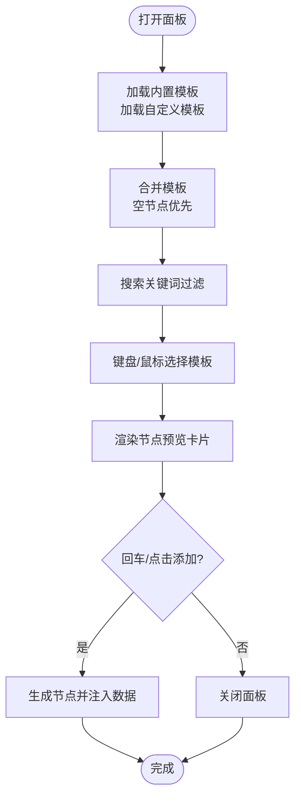

# 模板预览

<cite>
**本文引用的文件**
- [main.go](file://LocalBridge/cmd/lb/main.go)
- [controller_manager.go](file://LocalBridge/internal/mfw/controller_manager.go)
- [pipeline_engine.go](file://LocalBridge/internal/mfw/pipeline_engine.go)
- [nodeTemplates.ts](file://src/data/nodeTemplates.ts)
- [NodeAddPanel.tsx](file://src/components/panels/main/NodeAddPanel.tsx)
- [customTemplateStore.ts](file://src/stores/customTemplateStore.ts)
- [nodes/index.ts](file://src/components/flow/nodes/index.ts)
- [nodes/utils.ts](file://src/components/flow/nodes/utils.ts)
- [NodeAddPanel.module.less](file://src/styles/NodeAddPanel.module.less)
- [constants.ts](file://src/components/flow/nodes/constants.ts)
- [README.md](file://README.md)
</cite>

## 目录
1. [简介](#简介)
2. [项目结构](#项目结构)
3. [核心组件](#核心组件)
4. [架构总览](#架构总览)
5. [详细组件分析](#详细组件分析)
6. [依赖分析](#依赖分析)
7. [性能考虑](#性能考虑)
8. [故障排查指南](#故障排查指南)
9. [结论](#结论)
10. [附录](#附录)

## 简介
本节围绕“模板预览”的实现进行系统化说明，重点解释前端如何基于内置与自定义节点模板，实时渲染节点预览，帮助用户在添加节点前直观了解节点的识别类型、动作类型与参数结构，从而提升编辑效率与准确性。

## 项目结构
- 前端侧通过“节点添加面板”承载模板列表与预览区域，结合模板数据与图标工具函数，动态生成节点预览卡片。
- 模板来源包括内置模板与用户自定义模板，后者持久化存储于本地存储，并在加载时合并到模板列表中。
- 后端 LocalBridge 提供 MaaFramework 能力（如截图、设备控制等），与前端模板预览无直接耦合，但为后续“模板预览联动调试”提供基础。

**图表来源**
- [main.go](file://LocalBridge/cmd/lb/main.go#L170-L320)
- [controller_manager.go](file://LocalBridge/internal/mfw/controller_manager.go#L1-L120)
- [pipeline_engine.go](file://LocalBridge/internal/mfw/pipeline_engine.go#L1-L84)
- [nodeTemplates.ts](file://src/data/nodeTemplates.ts#L1-L96)
- [NodeAddPanel.tsx](file://src/components/panels/main/NodeAddPanel.tsx#L1-L120)
- [customTemplateStore.ts](file://src/stores/customTemplateStore.ts#L1-L120)
- [nodes/index.ts](file://src/components/flow/nodes/index.ts#L1-L22)
- [nodes/utils.ts](file://src/components/flow/nodes/utils.ts#L1-L103)
- [NodeAddPanel.module.less](file://src/styles/NodeAddPanel.module.less#L1-L120)
- [constants.ts](file://src/components/flow/nodes/constants.ts#L1-L45)

**章节来源**
- [README.md](file://README.md#L30-L85)
- [main.go](file://LocalBridge/cmd/lb/main.go#L170-L320)

## 核心组件
- 内置模板数据：定义节点标签、图标、节点类型以及默认数据结构（含识别、动作、其他参数）。
- 自定义模板存储：负责模板的增删改查、导入导出、版本迁移与本地持久化。
- 节点添加面板：提供模板列表、搜索过滤、键盘导航、鼠标悬停删除、以及模板预览区域。
- 图标与颜色工具：根据识别类型返回对应图标与极简节点配色，用于预览卡片的视觉表达。
- 节点类型注册：统一管理节点类型映射，确保预览与实际节点渲染一致。

**章节来源**
- [nodeTemplates.ts](file://src/data/nodeTemplates.ts#L1-L96)
- [customTemplateStore.ts](file://src/stores/customTemplateStore.ts#L1-L120)
- [NodeAddPanel.tsx](file://src/components/panels/main/NodeAddPanel.tsx#L1-L120)
- [nodes/utils.ts](file://src/components/flow/nodes/utils.ts#L1-L103)
- [nodes/index.ts](file://src/components/flow/nodes/index.ts#L1-L22)

## 架构总览
模板预览的前端链路：
- 模板数据来源：内置模板 + 自定义模板（localStorage）。
- 渲染链路：模板列表 → 选中模板 → 预览组件根据模板数据与工具函数生成节点预览卡片。
- 交互链路：搜索过滤 → 键盘上下移动 → Enter 添加 → Esc 关闭。

**图表来源**
- [NodeAddPanel.tsx](file://src/components/panels/main/NodeAddPanel.tsx#L238-L545)
- [nodeTemplates.ts](file://src/data/nodeTemplates.ts#L1-L96)
- [customTemplateStore.ts](file://src/stores/customTemplateStore.ts#L212-L231)
- [nodes/utils.ts](file://src/components/flow/nodes/utils.ts#L1-L103)

## 详细组件分析

### 组件 A：节点添加面板（NodeAddPanel）
- 职责
  - 展示模板列表与搜索框。
  - 支持键盘导航（上下、回车、Esc）与鼠标交互。
  - 实时预览选中模板的节点卡片（识别、动作、其他参数）。
  - 删除自定义模板（带二次确认）。
- 关键流程
  - 合并内置与自定义模板，按创建时间排序，空节点置于首位。
  - 搜索关键词过滤模板列表。
  - 预览组件根据模板数据与工具函数渲染节点卡片，特殊节点类型（外部、锚点）有专属样式。
  - 添加节点时将模板数据注入到画布节点中。

**图表来源**
- [NodeAddPanel.tsx](file://src/components/panels/main/NodeAddPanel.tsx#L238-L545)
- [nodeTemplates.ts](file://src/data/nodeTemplates.ts#L1-L96)
- [customTemplateStore.ts](file://src/stores/customTemplateStore.ts#L212-L231)

**章节来源**
- [NodeAddPanel.tsx](file://src/components/panels/main/NodeAddPanel.tsx#L1-L120)
- [NodeAddPanel.tsx](file://src/components/panels/main/NodeAddPanel.tsx#L238-L545)
- [NodeAddPanel.module.less](file://src/styles/NodeAddPanel.module.less#L1-L120)

### 组件 B：模板数据与工具
- 内置模板（nodeTemplates.ts）
  - 定义节点标签、图标名、节点类型与默认数据工厂。
  - 包含“空节点”“文字识别”“图像识别”“无延迟节点”“直接点击”“Custom”“外部节点”“锚点”等。
- 图标与颜色工具（nodes/utils.ts）
  - 根据识别类型返回图标配置与极简节点颜色，用于预览卡片的视觉一致性。
- 节点类型注册（nodes/index.ts）
  - 统一注册节点类型映射，保证预览与实际节点渲染一致。

**图表来源**
- [nodeTemplates.ts](file://src/data/nodeTemplates.ts#L1-L96)
- [nodes/utils.ts](file://src/components/flow/nodes/utils.ts#L1-L139)
- [nodes/index.ts](file://src/components/flow/nodes/index.ts#L1-L22)

**章节来源**
- [nodeTemplates.ts](file://src/data/nodeTemplates.ts#L1-L96)
- [nodes/utils.ts](file://src/components/flow/nodes/utils.ts#L1-L139)
- [nodes/index.ts](file://src/components/flow/nodes/index.ts#L1-L22)
- [constants.ts](file://src/components/flow/nodes/constants.ts#L1-L45)

### 组件 C：自定义模板存储（customTemplateStore）
- 职责
  - 本地持久化存储自定义模板，支持版本迁移、导入导出、数量限制与名称校验。
  - 提供获取全部模板的方法，将自定义模板插入到内置模板之前。
- 关键点
  - 存储键名固定，版本号用于迁移策略。
  - 导入时校验格式并转换为 NodeTemplateType 结构，按创建时间倒序排列。

**图表来源**
- [customTemplateStore.ts](file://src/stores/customTemplateStore.ts#L1-L120)
- [customTemplateStore.ts](file://src/stores/customTemplateStore.ts#L212-L231)

**章节来源**
- [customTemplateStore.ts](file://src/stores/customTemplateStore.ts#L1-L120)
- [customTemplateStore.ts](file://src/stores/customTemplateStore.ts#L212-L231)

### 组件 D：后端 MaaFramework 能力（与模板预览关系）
- LocalBridge 提供 MaaFramework 控制器管理与流水线引擎能力，为“模板预览联动调试”奠定基础。
- 控制器管理：创建/连接/断开控制器，执行点击、滑动、输入文本、启动/停止应用、截图等操作。
- 流水线引擎：从资源路径加载 pipeline 配置，支持断点/继续/单步执行的 override 构造。

**图表来源**
- [main.go](file://LocalBridge/cmd/lb/main.go#L262-L320)
- [controller_manager.go](file://LocalBridge/internal/mfw/controller_manager.go#L412-L481)
- [pipeline_engine.go](file://LocalBridge/internal/mfw/pipeline_engine.go#L86-L186)

**章节来源**
- [main.go](file://LocalBridge/cmd/lb/main.go#L262-L320)
- [controller_manager.go](file://LocalBridge/internal/mfw/controller_manager.go#L1-L120)
- [controller_manager.go](file://LocalBridge/internal/mfw/controller_manager.go#L412-L481)
- [pipeline_engine.go](file://LocalBridge/internal/mfw/pipeline_engine.go#L86-L186)

## 依赖分析
- 前端依赖关系
  - NodeAddPanel 依赖 nodeTemplates、customTemplateStore、nodes/utils、nodes/index、NodeAddPanel.module.less。
  - nodes/utils 为预览提供图标与颜色，nodes/index 保证节点类型一致。
- 后端依赖关系
  - main.go 注册协议处理器与 WebSocket 路由，controller_manager.go 与 pipeline_engine.go 提供底层能力。

**图表来源**
- [NodeAddPanel.tsx](file://src/components/panels/main/NodeAddPanel.tsx#L1-L120)
- [nodeTemplates.ts](file://src/data/nodeTemplates.ts#L1-L96)
- [customTemplateStore.ts](file://src/stores/customTemplateStore.ts#L1-L120)
- [nodes/utils.ts](file://src/components/flow/nodes/utils.ts#L1-L103)
- [nodes/index.ts](file://src/components/flow/nodes/index.ts#L1-L22)
- [NodeAddPanel.module.less](file://src/styles/NodeAddPanel.module.less#L1-L120)
- [main.go](file://LocalBridge/cmd/lb/main.go#L262-L320)
- [controller_manager.go](file://LocalBridge/internal/mfw/controller_manager.go#L1-L120)
- [pipeline_engine.go](file://LocalBridge/internal/mfw/pipeline_engine.go#L1-L84)

**章节来源**
- [NodeAddPanel.tsx](file://src/components/panels/main/NodeAddPanel.tsx#L1-L120)
- [main.go](file://LocalBridge/cmd/lb/main.go#L262-L320)

## 性能考虑
- 模板渲染
  - 预览组件采用记忆化（memo）以减少重复渲染。
  - 参数值格式化函数对数组/对象进行截断显示，避免长列表导致的渲染压力。
- 模板存储
  - 自定义模板数量上限控制，防止 localStorage 过载。
  - 导入/导出采用 JSON 序列化，注意模板体量过大时的内存占用。
- 视口与布局
  - 面板位置计算避免超出视口，减少重绘与滚动抖动。

[本节为通用指导，不涉及具体文件分析]

## 故障排查指南
- 模板加载异常
  - 检查自定义模板版本是否匹配，不匹配将触发清空并提示迁移。
  - 若解析失败，控制台会记录错误并提示清空损坏数据。
- 模板数量超限
  - 当达到上限（默认 50）时，新增模板会被拒绝并提示先删除旧模板。
- 预览显示异常
  - 确认模板数据工厂返回的数据结构完整，特别是识别/动作/其他字段。
  - 检查图标工具函数是否支持该识别类型，否则将返回默认图标。
- 键盘/鼠标交互无效
  - 确保面板可见且焦点在搜索框，键盘事件绑定正常。
  - 滚动到选中项依赖容器宽度，若容器宽度为 0，需等待布局完成后重试。

**章节来源**
- [customTemplateStore.ts](file://src/stores/customTemplateStore.ts#L50-L94)
- [customTemplateStore.ts](file://src/stores/customTemplateStore.ts#L96-L170)
- [NodeAddPanel.tsx](file://src/components/panels/main/NodeAddPanel.tsx#L343-L376)
- [nodes/utils.ts](file://src/components/flow/nodes/utils.ts#L1-L103)

## 结论
模板预览通过“内置模板 + 自定义模板 + 图标/颜色工具 + 节点类型注册”的组合，实现了直观、可交互的节点预览体验。前端链路简洁清晰，后端 LocalBridge 则为后续“模板预览联动调试”提供了坚实的能力基础。整体设计兼顾易用性与可扩展性，适合在复杂 Pipeline 编辑场景中提升效率与一致性。

[本节为总结性内容，不涉及具体文件分析]

## 附录
- 相关文件路径与职责
  - [nodeTemplates.ts](file://src/data/nodeTemplates.ts#L1-L96)：内置模板数据
  - [customTemplateStore.ts](file://src/stores/customTemplateStore.ts#L1-L120)：自定义模板存储与迁移
  - [NodeAddPanel.tsx](file://src/components/panels/main/NodeAddPanel.tsx#L1-L120)：模板列表与预览主组件
  - [nodes/utils.ts](file://src/components/flow/nodes/utils.ts#L1-L103)：图标与颜色工具
  - [nodes/index.ts](file://src/components/flow/nodes/index.ts#L1-L22)：节点类型注册
  - [constants.ts](file://src/components/flow/nodes/constants.ts#L1-L45)：节点类型枚举
  - [NodeAddPanel.module.less](file://src/styles/NodeAddPanel.module.less#L1-L120)：面板样式
  - [main.go](file://LocalBridge/cmd/lb/main.go#L262-L320)：LocalBridge 服务入口与协议注册
  - [controller_manager.go](file://LocalBridge/internal/mfw/controller_manager.go#L412-L481)：截图与控制器操作
  - [pipeline_engine.go](file://LocalBridge/internal/mfw/pipeline_engine.go#L86-L186)：断点/继续/单步执行

[本节为补充说明，不涉及具体文件分析]