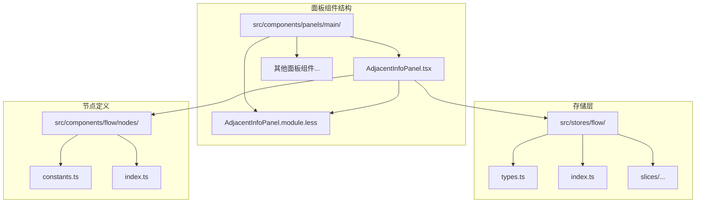
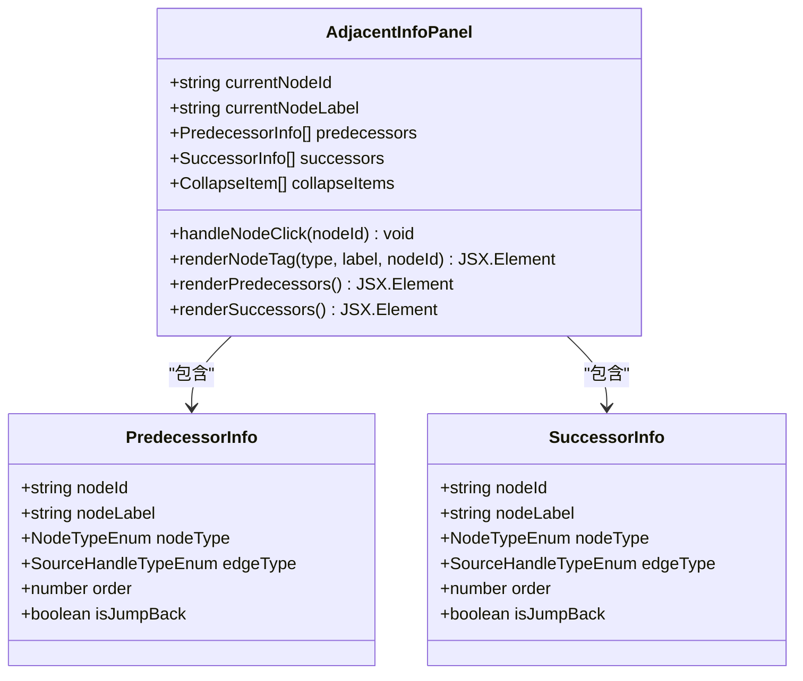
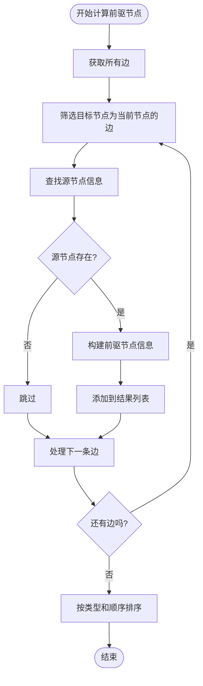
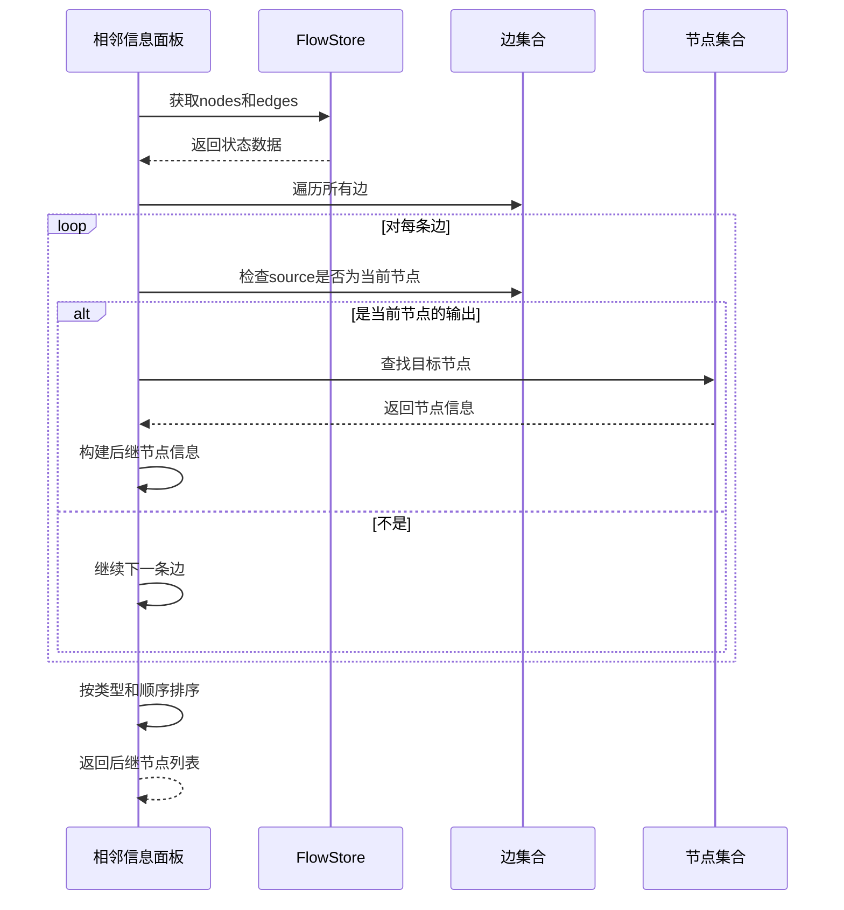
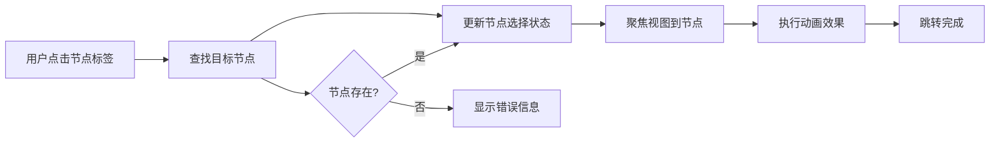
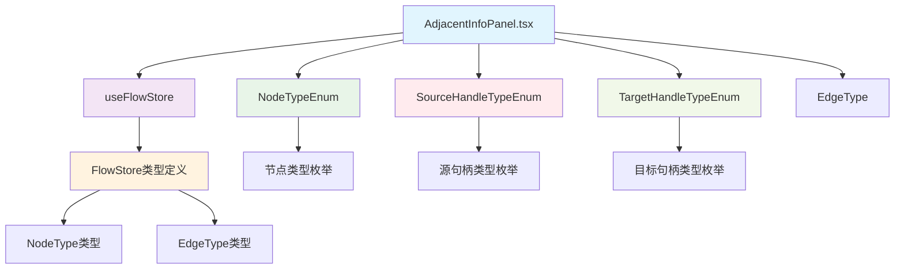
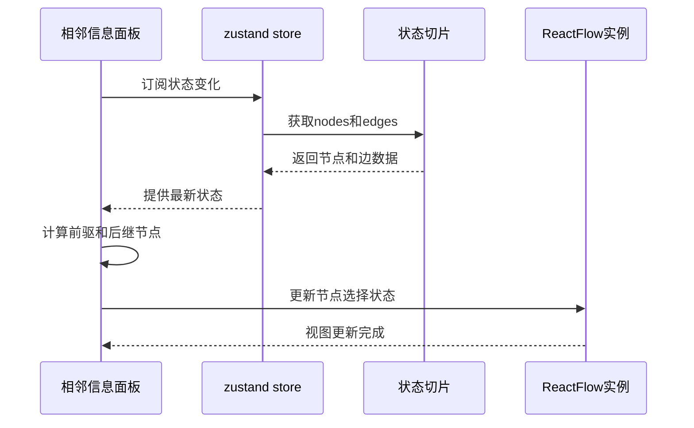

# 相邻信息面板

<cite>
**本文档引用的文件**
- [AdjacentInfoPanel.tsx](file://src/components/panels/main/AdjacentInfoPanel.tsx)
- [AdjacentInfoPanel.module.less](file://src/components/panels/main/AdjacentInfoPanel.module.less)
- [index.ts](file://src/stores/flow/index.ts)
- [types.ts](file://src/stores/flow/types.ts)
- [constants.ts](file://src/components/flow/nodes/constants.ts)
- [index.ts](file://src/components/flow/nodes/index.ts)
- [selectionSlice.ts](file://src/stores/flow/slices/selectionSlice.ts)
</cite>

## 目录
1. [简介](#简介)
2. [项目结构](#项目结构)
3. [核心组件](#核心组件)
4. [架构概览](#架构概览)
5. [详细组件分析](#详细组件分析)
6. [依赖关系分析](#依赖关系分析)
7. [性能考虑](#性能考虑)
8. [故障排除指南](#故障排除指南)
9. [结论](#结论)

## 简介

相邻信息面板是一个专门用于展示工作流编辑器中节点前后关系的UI组件。该组件能够实时显示选中节点的前驱节点（上游节点）和后继节点（下游节点），帮助用户更好地理解和导航复杂的节点关系网络。

该组件基于React和Ant Design构建，采用现代前端开发技术栈，提供了直观的可视化界面和流畅的用户体验。通过智能的节点关系分析和排序算法，用户可以轻松地查看和管理节点之间的连接关系。

## 项目结构

相邻信息面板位于项目的主面板组件目录中，与其它面板组件共同构成了完整的UI界面体系：



**图表来源**
- [AdjacentInfoPanel.tsx:1-344](file://src/components/panels/main/AdjacentInfoPanel.tsx#L1-L344)
- [AdjacentInfoPanel.module.less:1-121](file://src/components/panels/main/AdjacentInfoPanel.module.less#L1-L121)

**章节来源**
- [AdjacentInfoPanel.tsx:1-344](file://src/components/panels/main/AdjacentInfoPanel.tsx#L1-L344)
- [AdjacentInfoPanel.module.less:1-121](file://src/components/panels/main/AdjacentInfoPanel.module.less#L1-L121)

## 核心组件

相邻信息面板的核心功能围绕三个主要方面展开：

### 数据结构设计

组件使用了精心设计的数据结构来表示节点关系信息：



**图表来源**
- [AdjacentInfoPanel.tsx:23-41](file://src/components/panels/main/AdjacentInfoPanel.tsx#L23-L41)

### 排序和分组逻辑

组件实现了智能的排序和分组算法，确保节点信息以最直观的方式呈现：

- **优先级排序**：`next` 类型优先于 `on_error` 类型
- **顺序排序**：同类型节点按照 `order` 字段进行升序排列
- **分组显示**：将具有相同边类型的节点归为一组

**章节来源**
- [AdjacentInfoPanel.tsx:48-108](file://src/components/panels/main/AdjacentInfoPanel.tsx#L48-L108)

## 架构概览

相邻信息面板采用分层架构设计，各层职责明确，耦合度低：

```mermaid
graph TD
subgraph "UI层"
A[AdjacentInfoPanel.tsx] --> B[Ant Design组件]
A --> C[自定义样式]
end
subgraph "状态管理层"
D[zustand store] --> E[FlowStore]
E --> F[节点状态]
E --> G[边状态]
E --> H[选择状态]
end
subgraph "数据层"
I[EdgeType] --> J[EdgeType[]]
K[NodeType] --> L[NodeType[]]
end
subgraph "类型定义层"
M[SourceHandleTypeEnum] --> N[TargetHandleTypeEnum]
O[NodeTypeEnum] --> P[HandleDirection]
end
A --> D
A --> I
A --> K
A --> M
A --> O
D --> E
E --> F
E --> G
E --> H
```

**图表来源**
- [AdjacentInfoPanel.tsx:43-46](file://src/components/panels/main/AdjacentInfoPanel.tsx#L43-L46)
- [types.ts:27-38](file://src/stores/flow/types.ts#L27-L38)
- [constants.ts:1-47](file://src/components/flow/nodes/constants.ts#L1-L47)

## 详细组件分析

### 主要功能实现

#### 前驱节点计算

组件通过遍历所有边来识别当前节点的前驱节点：



**图表来源**
- [AdjacentInfoPanel.tsx:48-77](file://src/components/panels/main/AdjacentInfoPanel.tsx#L48-L77)

#### 后继节点计算

后继节点的计算逻辑与前驱节点类似，但方向相反：



**图表来源**
- [AdjacentInfoPanel.tsx:79-108](file://src/components/panels/main/AdjacentInfoPanel.tsx#L79-L108)

#### 节点跳转功能

组件提供了便捷的节点跳转功能，用户点击节点标签即可跳转到对应节点：



**图表来源**
- [AdjacentInfoPanel.tsx:121-144](file://src/components/panels/main/AdjacentInfoPanel.tsx#L121-L144)

### 样式设计

相邻信息面板采用了现代化的样式设计，注重用户体验和视觉效果：

| 样式类 | 功能描述 | 设计特点 |
|--------|----------|----------|
| `.adjacent-panel` | 主容器 | 透明背景，内边距适中 |
| `.collapse-header` | 折叠头部 | 左右布局，图标对齐 |
| `.node-list` | 节点列表 | 垂直布局，间距统一 |
| `.node-item` | 单个节点项 | 悬停效果，圆角设计 |
| `.node-tag` | 节点标签 | 指针样式，缩放动画 |
| `.mini-tag` | 小标签 | 字体缩小，间距紧凑 |

**章节来源**
- [AdjacentInfoPanel.module.less:1-121](file://src/components/panels/main/AdjacentInfoPanel.module.less#L1-L121)

## 依赖关系分析

相邻信息面板的依赖关系相对简单，主要依赖于状态管理和类型定义：



**图表来源**
- [AdjacentInfoPanel.tsx:7-13](file://src/components/panels/main/AdjacentInfoPanel.tsx#L7-L13)
- [types.ts:27-38](file://src/stores/flow/types.ts#L27-L38)
- [constants.ts:1-47](file://src/components/flow/nodes/constants.ts#L1-L47)

### 状态管理集成

组件通过zustand状态管理库与全局状态进行交互：



**图表来源**
- [index.ts:16-24](file://src/stores/flow/index.ts#L16-L24)
- [selectionSlice.ts:27-63](file://src/stores/flow/slices/selectionSlice.ts#L27-L63)

**章节来源**
- [index.ts:1-109](file://src/stores/flow/index.ts#L1-L109)
- [selectionSlice.ts:1-100](file://src/stores/flow/slices/selectionSlice.ts#L1-L100)

## 性能考虑

相邻信息面板在设计时充分考虑了性能优化：

### 计算复杂度优化

- **时间复杂度**：O(E + N log N)，其中E是边的数量，N是节点数量
- **空间复杂度**：O(N)
- **记忆化缓存**：使用`useMemo`避免不必要的重新计算

### 渲染优化策略

- **条件渲染**：只有在有数据时才显示折叠面板
- **空状态处理**：提供友好的空状态提示
- **懒加载**：节点标签点击时才执行跳转操作

### 内存管理

- **及时清理**：组件卸载时自动清理相关资源
- **引用优化**：使用`useCallback`优化函数引用稳定性

## 故障排除指南

### 常见问题及解决方案

#### 节点跳转失败

**问题描述**：点击节点标签无法跳转到目标节点

**可能原因**：
1. 目标节点不存在于当前工作流中
2. ReactFlow实例尚未初始化
3. 节点ID不匹配

**解决步骤**：
1. 检查目标节点是否存在于当前工作流
2. 确认ReactFlow实例状态正常
3. 验证节点ID的正确性

#### 显示异常

**问题描述**：相邻信息面板显示不正确或空白

**可能原因**：
1. 状态数据未正确更新
2. 样式文件加载失败
3. 类型定义不匹配

**解决步骤**：
1. 检查控制台是否有错误信息
2. 验证样式文件路径正确性
3. 确认类型定义版本兼容性

**章节来源**
- [AdjacentInfoPanel.tsx:121-144](file://src/components/panels/main/AdjacentInfoPanel.tsx#L121-L144)

## 结论

相邻信息面板是一个设计精良、功能完善的UI组件，它有效地解决了工作流编辑器中节点关系可视化的问题。通过智能的数据处理算法、优雅的用户界面设计和高效的性能优化，该组件为用户提供了优秀的使用体验。

该组件的主要优势包括：

1. **直观的可视化**：清晰展示节点的前后关系
2. **智能排序**：合理的节点排序和分组逻辑
3. **便捷的操作**：一键跳转到相关节点
4. **良好的性能**：优化的记忆化和渲染策略
5. **可扩展性**：模块化的架构设计便于功能扩展

未来可以考虑的功能增强包括：支持更多类型的节点关系、提供批量操作功能、增加搜索和过滤能力等。