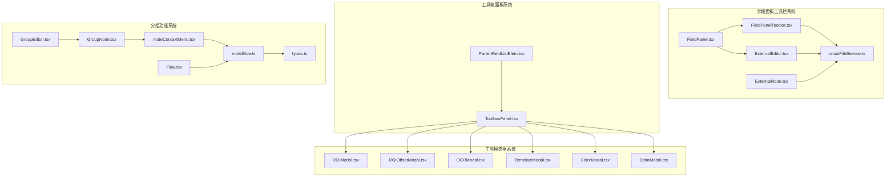
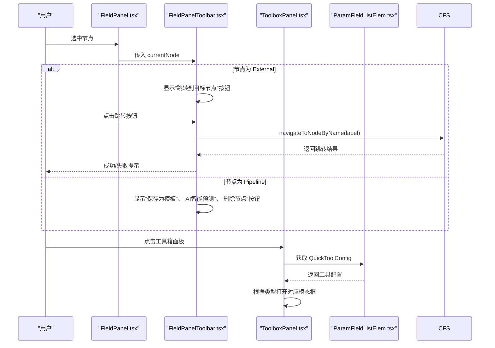
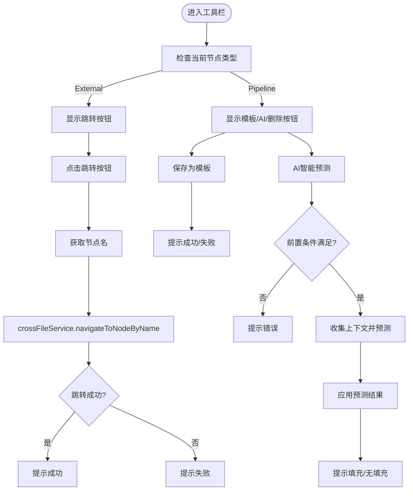
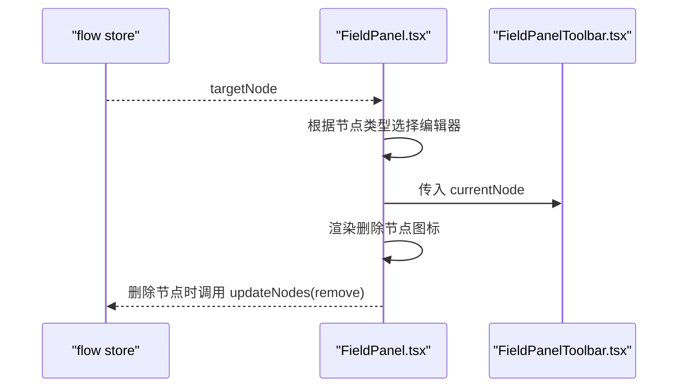
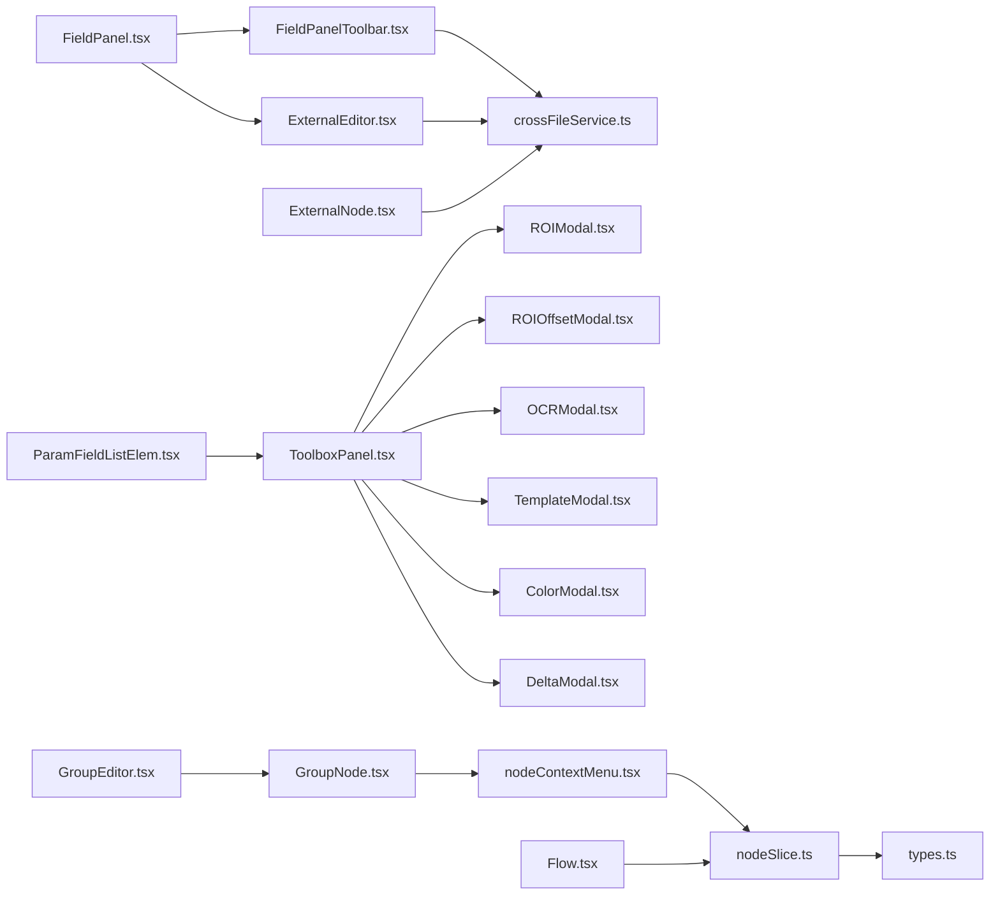

# 字段面板工具栏

<cite>
**本文引用的文件**
- [FieldPanelToolbar.tsx](file://src/components/panels/field/tools/FieldPanelToolbar.tsx)
- [FieldPanel.tsx](file://src/components/panels/main/FieldPanel.tsx)
- [ExternalEditor.tsx](file://src/components/panels/node-editors/ExternalEditor.tsx)
- [crossFileService.ts](file://src/services/crossFileService.ts)
- [ExternalNode.tsx](file://src/components/flow/nodes/ExternalNode.tsx)
- [FieldPanel.module.less](file://src/styles/FieldPanel.module.less)
- [index.ts](file://src/components/panels/field/tools/index.ts)
- [ToolboxPanel.tsx](file://src/components/panels/tools/ToolboxPanel.tsx)
- [ParamFieldListElem.tsx](file://src/components/panels/field/items/ParamFieldListElem.tsx)
- [ROIModal.tsx](file://src/components/modals/ROIModal.tsx)
- [ROIOffsetModal.tsx](file://src/components/modals/ROIOffsetModal.tsx)
- [OCRModal.tsx](file://src/components/modals/OCRModal.tsx)
- [TemplateModal.tsx](file://src/components/modals/TemplateModal.tsx)
- [ColorModal.tsx](file://src/components/modals/ColorModal.tsx)
- [DeltaModal.tsx](file://src/components/modals/DeltaModal.tsx)
- [GroupNode.tsx](file://src/components/flow/nodes/GroupNode.tsx)
- [GroupEditor.tsx](file://src/components/panels/node-editors/GroupEditor.tsx)
- [nodeContextMenu.tsx](file://src/components/flow/nodes/nodeContextMenu.tsx)
- [types.ts](file://src/stores/flow/types.ts)
- [nodeSlice.ts](file://src/stores/flow/slices/nodeSlice.ts)
- [Flow.tsx](file://src/components/Flow.tsx)
</cite>

## 更新摘要
**所做更改**
- 新增节点分组功能集成章节，详细介绍分组编辑器、节点右键菜单的分组选项
- 更新字段面板工具栏与分组功能的交互关系
- 新增分组节点的颜色主题系统和编辑功能
- 更新节点右键菜单配置，增加分组专用菜单项

## 目录
1. [简介](#简介)
2. [项目结构](#项目结构)
3. [核心组件](#核心组件)
4. [架构总览](#架构总览)
5. [字段快捷工具系统重构](#字段快捷工具系统重构)
6. [工具箱面板架构](#工具箱面板架构)
7. [工具类型与处理逻辑](#工具类型与处理逻辑)
8. [节点分组功能集成](#节点分组功能集成)
9. [详细组件分析](#详细组件分析)
10. [依赖关系分析](#依赖关系分析)
11. [性能考量](#性能考量)
12. [故障排查指南](#故障排查指南)
13. [结论](#结论)
14. [附录](#附录)

## 简介
字段面板工具栏位于"字段面板"的顶部区域，提供与当前节点相关的便捷操作入口。本次更新重点介绍了字段快捷工具系统的重大重构：从简单的图标映射升级为基于 QuickToolConfig 接口的分类系统，新增了 roi、roi_offset、ocr、template、color、delta 六种工具类型的详细说明。系统现在支持更精细的工具分类、统一的配置接口和增强的用户体验。

**更新** 新增节点分组功能的完整集成，包括分组编辑器、节点右键菜单的分组选项、颜色主题系统以及分组节点的拖拽和管理功能。

## 项目结构
围绕字段面板工具栏和快捷工具系统重构的相关文件组织如下：
- 工具栏组件：src/components/panels/field/tools/FieldPanelToolbar.tsx
- 字段面板容器：src/components/panels/main/FieldPanel.tsx
- External 节点编辑器：src/components/panels/node-editors/ExternalEditor.tsx
- 跨文件服务：src/services/crossFileService.ts
- External 节点渲染：src/components/flow/nodes/ExternalNode.tsx
- 工具箱面板：src/components/panels/tools/ToolboxPanel.tsx
- 字段快捷工具配置：src/components/panels/field/items/ParamFieldListElem.tsx
- 工具模态框：ROIModal.tsx、ROIOffsetModal.tsx、OCRModal.tsx、TemplateModal.tsx、ColorModal.tsx、DeltaModal.tsx
- 分组节点组件：src/components/flow/nodes/GroupNode.tsx
- 分组编辑器：src/components/panels/node-editors/GroupEditor.tsx
- 节点右键菜单：src/components/flow/nodes/nodeContextMenu.tsx
- 流存储类型定义：src/stores/flow/types.ts
- 流存储切片：src/stores/flow/slices/nodeSlice.ts
- 主流程组件：src/components/Flow.tsx
- 样式：src/styles/FieldPanel.module.less
- 导出入口：src/components/panels/field/tools/index.ts



**图表来源**
- [FieldPanelToolbar.tsx](file://src/components/panels/field/tools/FieldPanelToolbar.tsx#L1-L238)
- [FieldPanel.tsx](file://src/components/panels/main/FieldPanel.tsx#L1-L499)
- [ExternalEditor.tsx](file://src/components/panels/node-editors/ExternalEditor.tsx#L1-L106)
- [crossFileService.ts](file://src/services/crossFileService.ts#L1-L574)
- [ExternalNode.tsx](file://src/components/flow/nodes/ExternalNode.tsx#L1-L154)
- [ToolboxPanel.tsx](file://src/components/panels/tools/ToolboxPanel.tsx#L1-L475)
- [ParamFieldListElem.tsx](file://src/components/panels/field/items/ParamFieldListElem.tsx#L1-L900)
- [GroupNode.tsx](file://src/components/flow/nodes/GroupNode.tsx#L1-L181)
- [GroupEditor.tsx](file://src/components/panels/node-editors/GroupEditor.tsx#L1-L97)
- [nodeContextMenu.tsx](file://src/components/flow/nodes/nodeContextMenu.tsx#L354-L522)
- [nodeSlice.ts](file://src/stores/flow/slices/nodeSlice.ts#L510-L695)
- [types.ts](file://src/stores/flow/types.ts#L151-L163)
- [Flow.tsx](file://src/components/Flow.tsx#L348-L380)

**章节来源**
- [FieldPanelToolbar.tsx](file://src/components/panels/field/tools/FieldPanelToolbar.tsx#L1-L238)
- [FieldPanel.tsx](file://src/components/panels/main/FieldPanel.tsx#L1-L499)
- [ToolboxPanel.tsx](file://src/components/panels/tools/ToolboxPanel.tsx#L1-L475)
- [GroupNode.tsx](file://src/components/flow/nodes/GroupNode.tsx#L1-L181)
- [GroupEditor.tsx](file://src/components/panels/node-editors/GroupEditor.tsx#L1-L97)

## 核心组件
- 字段面板工具栏（FieldPanelToolbar）
  - 左侧工具栏：提供复制节点名、复制 Reco JSON（Pipeline 节点）等基础操作。
  - 右侧工具栏：根据节点类型条件化显示保存为模板、AI 预测、删除节点、跳转到目标节点等操作。
- 字段面板（FieldPanel）
  - 根据当前目标节点类型切换编辑器：Pipeline、External、Anchor。
  - 顶部渲染工具栏与标题，右侧提供删除节点的快捷入口。
- External 节点编辑器（ExternalEditor）
  - 提供节点名自动完成功能，支持跨文件节点名选择。
- 跨文件服务（crossFileService）
  - 提供跨文件节点搜索、跳转、自动完成等能力，支撑 External 节点导航与工具栏跳转。
- 工具箱面板（ToolboxPanel）
  - 基于 QuickToolConfig 接口的分类系统，支持六种工具类型的统一管理。
  - 提供工具配置、结果处理和复制功能。
- 分组节点组件（GroupNode）
  - 提供分组节点的可视化渲染，支持颜色主题、标题编辑、尺寸调整。
  - 集成右键菜单，提供分组颜色设置、解散分组、删除分组等功能。
- 分组编辑器（GroupEditor）
  - 提供分组节点的字段编辑功能，支持名称和颜色的修改。
- 节点右键菜单（nodeContextMenu）
  - 为分组节点提供专用菜单配置，包括颜色选择、解散分组、删除分组等选项。

**章节来源**
- [FieldPanelToolbar.tsx](file://src/components/panels/field/tools/FieldPanelToolbar.tsx#L1-L238)
- [FieldPanel.tsx](file://src/components/panels/main/FieldPanel.tsx#L1-L499)
- [ExternalEditor.tsx](file://src/components/panels/node-editors/ExternalEditor.tsx#L1-L106)
- [crossFileService.ts](file://src/services/crossFileService.ts#L1-L574)
- [ToolboxPanel.tsx](file://src/components/panels/tools/ToolboxPanel.tsx#L1-L475)
- [GroupNode.tsx](file://src/components/flow/nodes/GroupNode.tsx#L1-L181)
- [GroupEditor.tsx](file://src/components/panels/node-editors/GroupEditor.tsx#L1-L97)
- [nodeContextMenu.tsx](file://src/components/flow/nodes/nodeContextMenu.tsx#L354-L522)

## 架构总览
字段面板工具栏与字段面板主体通过状态选择器绑定当前目标节点，工具栏根据节点类型动态显示按钮。External 节点专用导航按钮通过跨文件服务实现跨文件节点跳转，提升多文件工作流下的节点定位效率。工具箱面板采用新的 QuickToolConfig 接口系统，实现了工具的分类管理和统一配置。

**更新** 新增分组功能的完整架构，包括分组节点的创建、编辑、拖拽和管理，以及与主流程组件的集成。



**图表来源**
- [FieldPanel.tsx](file://src/components/panels/main/FieldPanel.tsx#L1-L499)
- [FieldPanelToolbar.tsx](file://src/components/panels/field/tools/FieldPanelToolbar.tsx#L1-L238)
- [ToolboxPanel.tsx](file://src/components/panels/tools/ToolboxPanel.tsx#L1-L475)
- [ParamFieldListElem.tsx](file://src/components/panels/field/items/ParamFieldListElem.tsx#L1-L900)

## 字段快捷工具系统重构

### QuickToolConfig 接口设计
新的字段快捷工具系统基于 QuickToolConfig 接口实现了统一的工具配置管理：

- **接口定义**：每个字段都有对应的 QuickToolConfig 配置，包含工具类型、图标和处理逻辑
- **分类系统**：支持六种工具类型的分类管理，每种类型都有特定的处理逻辑
- **统一配置**：通过配置驱动的方式，实现工具的动态加载和管理

### 工具类型映射表
系统支持以下六种工具类型的快捷访问：

| 工具类型 | 字段键 | 图标 | 功能描述 |
|---------|--------|------|----------|
| roi | roi | icon-kuangxuanzhong | 区域选择工具，用于配置图像识别区域 |
| roi_offset | roi_offset、target_offset、begin_offset、end_offset | icon-celiang1 | 偏移测量工具，计算两个区域间的偏移量 |
| ocr | expected | icon-ocr1 | OCR文字识别工具，提取图像中的文本内容 |
| template | template | icon-jietu | 模板截图工具，创建图像模板用于匹配 |
| color | lower、upper | icon-ic_quseqi | 颜色取点工具，提取颜色范围用于颜色识别 |
| delta | dx、dy | icon-celiang2 | 位移差值工具，计算两点间的水平或垂直距离 |

**章节来源**
- [ParamFieldListElem.tsx](file://src/components/panels/field/items/ParamFieldListElem.tsx#L45-L64)
- [ToolboxPanel.tsx](file://src/components/panels/tools/ToolboxPanel.tsx#L17-L24)

## 工具箱面板架构

### 新的分类系统
工具箱面板采用全新的分类系统，替代了原有的简单图标映射：

- **ToolConfig 接口**：定义了工具的基本配置结构，包括 key、label、icon 和 modalType
- **工具列表配置**：集中管理所有可用的工具，支持动态扩展和自定义
- **统一处理逻辑**：通过 modalType 实现工具的统一调度和处理

### 工具配置结构
```typescript
interface ToolConfig {
  key: string;           // 工具唯一标识
  label: string;         // 工具显示名称
  icon: IconNames;       // 工具图标
  iconSize?: number;     // 图标尺寸
  modalType: "ocr" | "template" | "color" | "roi" | "roi_offset" | "delta"; // 模态框类型
}
```

**章节来源**
- [ToolboxPanel.tsx](file://src/components/panels/tools/ToolboxPanel.tsx#L17-L24)
- [ToolboxPanel.tsx](file://src/components/panels/tools/ToolboxPanel.tsx#L27-L70)

## 工具类型与处理逻辑

### ROI 区域选择工具
- **功能**：提供可视化的图像区域选择功能
- **处理逻辑**：支持鼠标框选和手动输入坐标两种方式
- **应用场景**：图像识别、模板匹配等需要精确定位的场景

### ROI 偏移测量工具
- **功能**：计算两个区域间的偏移量，支持原 ROI 和期望 ROI 的对比
- **处理逻辑**：自动计算 Δx、Δy、Δwidth、Δheight 四个维度的偏移
- **应用场景**：UI 自动化测试、图像对齐、坐标变换等

### OCR 文字识别工具
- **功能**：支持前端和后端两种 OCR 识别模式
- **处理逻辑**：自动加载 Tesseract 模型，支持多种语言识别
- **应用场景**：文本提取、验证码识别、界面元素识别等

### 模板截图工具
- **功能**：创建图像模板用于匹配识别
- **处理逻辑**：支持画笔和橡皮擦工具，可添加绿色遮罩
- **应用场景**：按钮识别、图标匹配、界面元素检测等

### 颜色取点工具
- **功能**：支持 RGB、HSV、GRAY 三种颜色模式的颜色提取
- **处理逻辑**：实时转换颜色空间，支持模式间相互转换
- **应用场景**：颜色识别、颜色阈值设置、视觉检测等

### 位移差值工具
- **功能**：计算两点间的水平或垂直距离
- **处理逻辑**：支持 dx（水平差）和 dy（垂直差）两种模式
- **应用场景**：坐标计算、移动距离测量、动画效果等

**章节来源**
- [ROIModal.tsx](file://src/components/modals/ROIModal.tsx#L1-L394)
- [ROIOffsetModal.tsx](file://src/components/modals/ROIOffsetModal.tsx#L1-L937)
- [OCRModal.tsx](file://src/components/modals/OCRModal.tsx#L1-L884)
- [TemplateModal.tsx](file://src/components/modals/TemplateModal.tsx#L1-L805)
- [ColorModal.tsx](file://src/components/modals/ColorModal.tsx#L1-L509)
- [DeltaModal.tsx](file://src/components/modals/DeltaModal.tsx#L1-L401)

## 节点分组功能集成

### 分组节点组件
分组节点是节点分组功能的核心组件，提供了完整的分组管理能力：

- **颜色主题系统**：支持蓝色、绿色、紫色、橙色、灰色五种颜色主题
- **标题编辑**：可直接在节点头部编辑分组名称
- **尺寸调整**：支持拖拽调整分组容器大小
- **视觉反馈**：选中状态下的特殊样式和边框效果

### 分组编辑器
分组编辑器专门用于编辑分组节点的属性：

- **名称编辑**：支持分组名称的修改和清空
- **颜色选择**：提供五种颜色主题的选择下拉框
- **即时保存**：颜色变更时自动保存历史记录

### 节点右键菜单
为分组节点专门设计的右键菜单提供了丰富的操作选项：

- **分组颜色**：快速切换分组颜色主题
- **解散分组**：将分组内的所有子节点移出分组
- **删除分组**：删除整个分组及其子节点

### 分组存储管理
分组功能通过流存储切片实现完整的生命周期管理：

- **创建分组**：将选中的节点包装为分组，计算包围盒并设置相对坐标
- **解散分组**：将子节点转换为绝对坐标并移除分组关联
- **节点拖拽**：支持节点在分组内拖拽和离开分组的自动处理
- **层级管理**：确保分组节点始终位于其子节点之前

### 分组拖拽交互
主流程组件集成了分组的拖拽交互逻辑：

- **拖拽进入**：节点拖拽到分组范围内自动成为子节点
- **拖拽离开**：节点拖出分组范围自动脱离分组
- **坐标转换**：自动处理相对坐标和绝对坐标的转换

**章节来源**
- [GroupNode.tsx](file://src/components/flow/nodes/GroupNode.tsx#L12-L47)
- [GroupNode.tsx](file://src/components/flow/nodes/GroupNode.tsx#L52-L109)
- [GroupNode.tsx](file://src/components/flow/nodes/GroupNode.tsx#L112-L181)
- [GroupEditor.tsx](file://src/components/panels/node-editors/GroupEditor.tsx#L11-L17)
- [GroupEditor.tsx](file://src/components/panels/node-editors/GroupEditor.tsx#L20-L97)
- [nodeContextMenu.tsx](file://src/components/flow/nodes/nodeContextMenu.tsx#L360-L403)
- [nodeSlice.ts](file://src/stores/flow/slices/nodeSlice.ts#L510-L695)
- [Flow.tsx](file://src/components/Flow.tsx#L348-L380)

## 详细组件分析

### 字段面板工具栏（FieldPanelToolbar）
- 功能要点
  - 左侧工具栏：复制节点名；当节点类型为 Pipeline 时显示复制 Reco JSON。
  - 右侧工具栏：当节点类型为 External 时显示"跳转到目标节点"按钮；当节点类型为 Pipeline 时显示"保存为模板"、"AI智能预测"、"删除节点"按钮。
  - 跳转逻辑：调用跨文件服务根据节点名进行跨文件跳转，排除 External 与 Anchor 类型，避免循环引用。
  - AI 预测：在满足前置条件（本地服务连接、设备就绪、OCR 配置）时，收集上下文并应用预测结果。
- 条件化显示
  - 通过 currentNode.type 判断显示不同按钮集合，避免无关按钮干扰。
- 用户反馈
  - 跳转成功/失败提示；AI 预测阶段进度提示；删除节点触发状态更新。



**图表来源**
- [FieldPanelToolbar.tsx](file://src/components/panels/field/tools/FieldPanelToolbar.tsx#L1-L238)
- [crossFileService.ts](file://src/services/crossFileService.ts#L1-L574)

**章节来源**
- [FieldPanelToolbar.tsx](file://src/components/panels/field/tools/FieldPanelToolbar.tsx#L1-L238)
- [crossFileService.ts](file://src/services/crossFileService.ts#L1-L574)

### 字段面板（FieldPanel）
- 功能要点
  - 根据当前目标节点类型切换编辑器：Pipeline、External、Anchor。
  - 顶部渲染工具栏与标题，右侧提供删除节点的快捷入口。
  - 使用类名控制面板显隐与样式。
- 与工具栏协作
  - 将 currentNode 传递给左右两侧工具栏，实现复制、保存、跳转、删除等联动。



**图表来源**
- [FieldPanel.tsx](file://src/components/panels/main/FieldPanel.tsx#L1-L499)

**章节来源**
- [FieldPanel.tsx](file://src/components/panels/main/FieldPanel.tsx#L1-L499)

### External 节点编辑器（ExternalEditor）
- 功能要点
  - 节点名输入框支持自动完成功能，基于跨文件服务提供的选项列表。
  - 支持搜索过滤，优先展示当前文件以外的节点，避免引用自身。
- 与工具栏联动
  - External 节点专用导航按钮通过节点名触发跨文件跳转，提升定位效率。

```mermaid
sequenceDiagram
participant User as "用户"
participant END as "ExternalEditor.tsx"
participant CFS as "crossFileService.ts"
User->>END : 输入节点名
END->>CFS : getAutoCompleteOptions()
CFS-->>END : 返回候选节点列表
User->>END : 选择某个节点
END->>END : 更新节点名
```

**图表来源**
- [ExternalEditor.tsx](file://src/components/panels/node-editors/ExternalEditor.tsx#L1-L106)
- [crossFileService.ts](file://src/services/crossFileService.ts#L1-L574)

**章节来源**
- [ExternalEditor.tsx](file://src/components/panels/node-editors/ExternalEditor.tsx#L1-L106)
- [crossFileService.ts](file://src/services/crossFileService.ts#L1-L574)

### External 节点渲染（ExternalNode）
- 功能要点
  - External 节点渲染包含标题与连接句柄，支持右键菜单与路径高亮。
  - 与跨文件服务协同，为跳转与自动完成提供节点标识。

**章节来源**
- [ExternalNode.tsx](file://src/components/flow/nodes/ExternalNode.tsx#L1-L154)

### 工具箱面板（ToolboxPanel）
- 功能要点
  - 基于 QuickToolConfig 接口的分类系统，支持六种工具类型的统一管理。
  - 提供工具配置、结果处理和复制功能。
  - 支持前端和后端两种 OCR 识别模式。
- 工具配置
  - 集中管理所有可用工具，支持动态扩展和自定义。
  - 通过 modalType 实现工具的统一调度和处理。
- 结果处理
  - 统一的结果格式化和复制功能。
  - 支持值复制和键值对复制两种模式。

**章节来源**
- [ToolboxPanel.tsx](file://src/components/panels/tools/ToolboxPanel.tsx#L1-L475)

### 分组节点组件（GroupNode）
- 功能要点
  - 颜色主题系统：支持蓝色、绿色、紫色、橙色、灰色五种颜色主题
  - 标题编辑：可直接在节点头部编辑分组名称
  - 尺寸调整：支持拖拽调整分组容器大小
  - 右键菜单：提供分组颜色设置、解散分组、删除分组等功能
- 视觉样式
  - 不同颜色主题对应不同的背景色、边框色和文本色
  - 选中状态下有特殊的样式效果

**章节来源**
- [GroupNode.tsx](file://src/components/flow/nodes/GroupNode.tsx#L1-L181)

### 分组编辑器（GroupEditor）
- 功能要点
  - 名称编辑：支持分组名称的修改和清空
  - 颜色选择：提供五种颜色主题的选择下拉框
  - 即时保存：颜色变更时自动保存历史记录
- 用户交互
  - 使用 Popover 提供操作提示
  - 支持键盘输入和下拉选择两种方式

**章节来源**
- [GroupEditor.tsx](file://src/components/panels/node-editors/GroupEditor.tsx#L1-L97)

### 节点右键菜单（nodeContextMenu）
- 功能要点
  - 为分组节点提供专用菜单配置
  - 分组颜色选择：快速切换分组颜色主题
  - 解散分组：将分组内的所有子节点移出分组
  - 删除分组：删除整个分组及其子节点
- 处理逻辑
  - handleSetGroupColor：设置分组颜色并保存历史
  - handleUngroupNodes：调用存储层解散分组
  - handleDeleteGroup：先解散子节点再删除分组

**章节来源**
- [nodeContextMenu.tsx](file://src/components/flow/nodes/nodeContextMenu.tsx#L334-L403)

## 依赖关系分析
- 组件耦合
  - FieldPanelToolbar 依赖跨文件服务实现 External 节点跳转。
  - FieldPanel 依赖 flow store 的 targetNode，按节点类型切换编辑器。
  - ExternalEditor 依赖跨文件服务提供自动完成选项。
  - ToolboxPanel 依赖各工具模态框组件实现具体功能。
  - ParamFieldListElem 依赖 QuickToolConfig 接口实现工具配置。
  - GroupNode 依赖 NodeContextMenu 实现右键菜单功能。
  - GroupEditor 依赖 FlowStore 实现分组属性编辑。
  - nodeContextMenu 依赖 nodeSlice 实现分组操作。
- 外部依赖
  - Ant Design 组件（Tooltip、Popover、AutoComplete、Alert、Tabs 等）。
  - 本地存储（localStorage）用于模板持久化（由模板系统负责，不在本节展开）。
  - Tesseract.js 用于前端 OCR 识别。
- 潜在循环依赖
  - 当前结构以单向依赖为主，工具栏 -> 服务，面板 -> 工具栏，编辑器 -> 服务，工具箱 -> 模态框，未见明显循环。



**图表来源**
- [FieldPanelToolbar.tsx](file://src/components/panels/field/tools/FieldPanelToolbar.tsx#L1-L238)
- [FieldPanel.tsx](file://src/components/panels/main/FieldPanel.tsx#L1-L499)
- [ExternalEditor.tsx](file://src/components/panels/node-editors/ExternalEditor.tsx#L1-L106)
- [crossFileService.ts](file://src/services/crossFileService.ts#L1-L574)
- [ExternalNode.tsx](file://src/components/flow/nodes/ExternalNode.tsx#L1-L154)
- [ToolboxPanel.tsx](file://src/components/panels/tools/ToolboxPanel.tsx#L1-L475)
- [ParamFieldListElem.tsx](file://src/components/panels/field/items/ParamFieldListElem.tsx#L1-L900)
- [GroupNode.tsx](file://src/components/flow/nodes/GroupNode.tsx#L1-L181)
- [GroupEditor.tsx](file://src/components/panels/node-editors/GroupEditor.tsx#L1-L97)
- [nodeContextMenu.tsx](file://src/components/flow/nodes/nodeContextMenu.tsx#L354-L522)
- [nodeSlice.ts](file://src/stores/flow/slices/nodeSlice.ts#L510-L695)
- [types.ts](file://src/stores/flow/types.ts#L151-L163)
- [Flow.tsx](file://src/components/Flow.tsx#L348-L380)

**章节来源**
- [FieldPanelToolbar.tsx](file://src/components/panels/field/tools/FieldPanelToolbar.tsx#L1-L238)
- [FieldPanel.tsx](file://src/components/panels/main/FieldPanel.tsx#L1-L499)
- [ExternalEditor.tsx](file://src/components/panels/node-editors/ExternalEditor.tsx#L1-L106)
- [crossFileService.ts](file://src/services/crossFileService.ts#L1-L574)
- [ExternalNode.tsx](file://src/components/flow/nodes/ExternalNode.tsx#L1-L154)
- [ToolboxPanel.tsx](file://src/components/panels/tools/ToolboxPanel.tsx#L1-L475)
- [ParamFieldListElem.tsx](file://src/components/panels/field/items/ParamFieldListElem.tsx#L1-L900)
- [GroupNode.tsx](file://src/components/flow/nodes/GroupNode.tsx#L1-L181)
- [GroupEditor.tsx](file://src/components/panels/node-editors/GroupEditor.tsx#L1-L97)
- [nodeContextMenu.tsx](file://src/components/flow/nodes/nodeContextMenu.tsx#L354-L522)
- [nodeSlice.ts](file://src/stores/flow/slices/nodeSlice.ts#L510-L695)
- [types.ts](file://src/stores/flow/types.ts#L151-L163)
- [Flow.tsx](file://src/components/Flow.tsx#L348-L380)

## 性能考量
- 渲染优化
  - 工具栏与面板主体均使用记忆化组件，减少不必要的重渲染。
  - ExternalEditor 的自动完成选项按需过滤，避免全量重绘。
  - 工具箱面板采用懒加载方式，只在需要时加载对应模态框。
  - 分组节点使用 memo 优化，只有属性变化时才重新渲染。
- 交互体验
  - 跳转按钮仅在 External 节点显示，减少无关交互。
  - AI 预测过程提供进度提示，避免长时间无响应。
  - 新的 QuickToolConfig 系统支持工具的动态加载，提升启动性能。
  - 分组拖拽操作使用防抖处理，避免频繁的状态更新。
- 建议
  - 对于大量节点的项目，合理使用 External 节点与跨文件跳转，避免过度依赖导致跳转链路复杂。
  - 定期清理历史模板与节点缓存，保持本地存储体积可控。
  - 合理使用工具箱面板，避免同时打开过多模态框影响性能。
  - 分组节点数量较多时，建议合理规划分组层次，避免过深的嵌套。

## 故障排查指南
- External 节点跳转失败
  - 检查节点名是否为空或已被删除。
  - 确认跨文件服务已连接并可检索到目标节点。
  - 排除类型为 External/Anchor 的节点，避免循环引用。
- AI 预测失败
  - 检查本地服务连接状态、设备 ID 与 OCR 配置。
  - 确认节点上下文收集正常，避免字段缺失导致预测失败。
- External 节点自动完成无结果
  - 检查跨文件服务是否已加载目标文件。
  - 确认节点名拼写与大小写一致，或使用模糊搜索。
- 工具箱面板工具不可用
  - 检查本地服务连接状态，部分工具需要连接设备才能使用。
  - 确认工具配置正确，检查 modalType 是否匹配。
  - 验证工具模态框组件是否正确加载。
- QuickToolConfig 配置问题
  - 检查字段键是否正确映射到对应的工具类型。
  - 确认工具图标和处理逻辑配置正确。
  - 验证工具配置的兼容性。
- 分组功能异常
  - 检查分组节点的颜色主题配置是否正确。
  - 确认分组操作的权限和约束条件。
  - 验证分组拖拽的坐标转换逻辑。
  - 检查存储层的分组状态同步。

**章节来源**
- [FieldPanelToolbar.tsx](file://src/components/panels/field/tools/FieldPanelToolbar.tsx#L1-L238)
- [ExternalEditor.tsx](file://src/components/panels/node-editors/ExternalEditor.tsx#L1-L106)
- [crossFileService.ts](file://src/services/crossFileService.ts#L1-L574)
- [ToolboxPanel.tsx](file://src/components/panels/tools/ToolboxPanel.tsx#L1-L475)
- [ParamFieldListElem.tsx](file://src/components/panels/field/items/ParamFieldListElem.tsx#L1-L900)
- [GroupNode.tsx](file://src/components/flow/nodes/GroupNode.tsx#L1-L181)
- [GroupEditor.tsx](file://src/components/panels/node-editors/GroupEditor.tsx#L1-L97)
- [nodeContextMenu.tsx](file://src/components/flow/nodes/nodeContextMenu.tsx#L354-L522)
- [nodeSlice.ts](file://src/stores/flow/slices/nodeSlice.ts#L510-L695)

## 结论
本次更新显著增强了字段面板工具栏的功能：为 External 节点新增专用导航按钮，支持跨文件节点跳转；同时通过条件化显示不同工具按钮，使工具栏在不同节点类型下呈现最优操作入口。结合 ExternalEditor 的自动完成功能与跨文件服务，系统在多文件工作流场景下的节点定位与编辑效率得到大幅提升。

**更新** 本次重大更新还集成了完整的节点分组功能，包括分组编辑器、节点右键菜单的分组选项、颜色主题系统以及分组节点的拖拽和管理功能。分组功能通过颜色主题、标题编辑、尺寸调整等特性提供了强大的节点组织能力，配合流存储的完整生命周期管理，实现了从创建到销毁的全流程支持。

## 附录
- 相关导出入口
  - [index.ts](file://src/components/panels/field/tools/index.ts#L1-L5)
- 工具类型参考
  - ROI 区域选择：用于图像识别的精确区域配置
  - ROI 偏移测量：计算两个区域间的偏移量
  - OCR 文字识别：提取图像中的文本内容
  - 模板截图：创建图像模板用于匹配识别
  - 颜色取点：提取颜色范围用于颜色识别
  - 位移差值：计算两点间的水平或垂直距离
- 分组颜色主题
  - 蓝色：#1890ff，适用于主要分组
  - 绿色：#52c41a，适用于次要分组
  - 紫色：#722ed1，适用于特殊分组
  - 橙色：#fa8c16，适用于警告分组
  - 灰色：#666，适用于普通分组