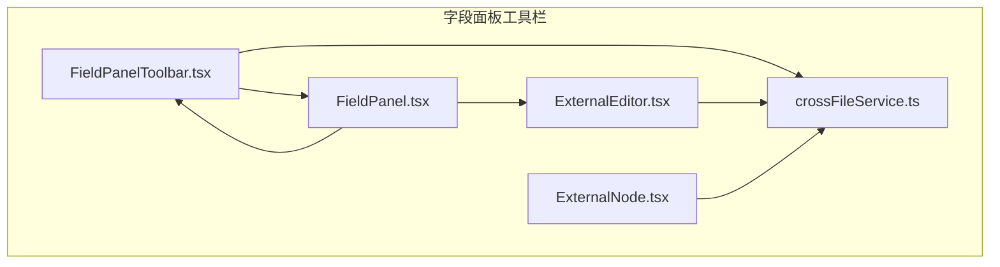
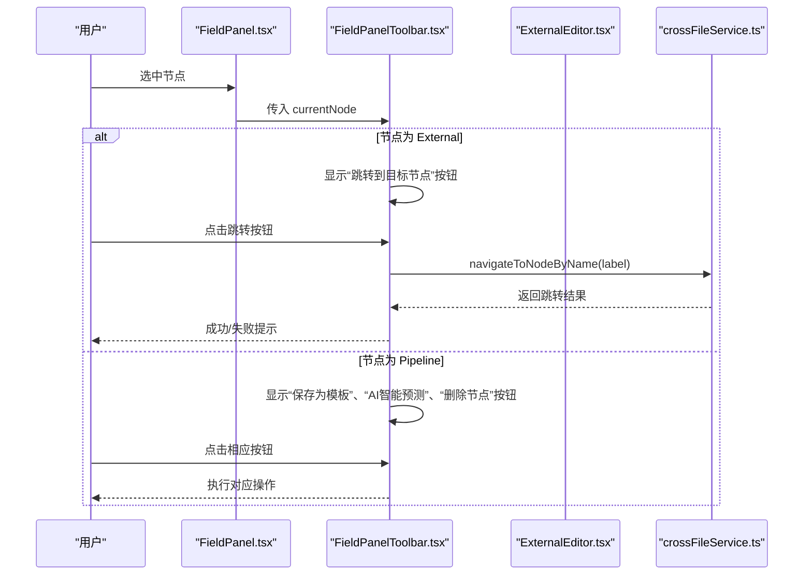
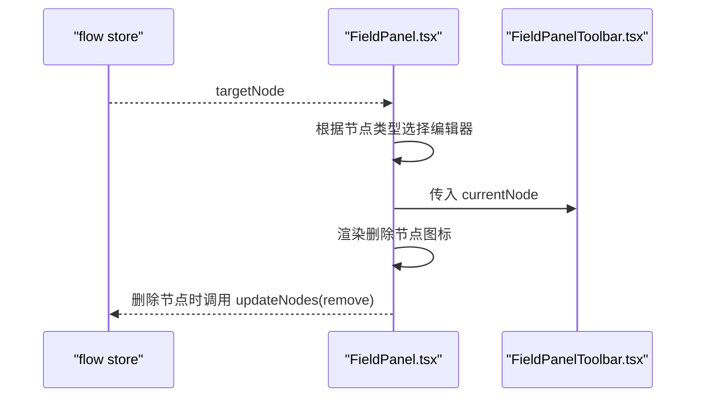
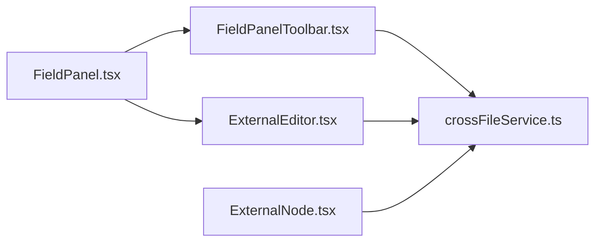

# 字段面板工具栏

<cite>
**本文引用的文件**
- [FieldPanelToolbar.tsx](file://src/components/panels/field/tools/FieldPanelToolbar.tsx)
- [FieldPanel.tsx](file://src/components/panels/main/FieldPanel.tsx)
- [ExternalEditor.tsx](file://src/components/panels/node-editors/ExternalEditor.tsx)
- [crossFileService.ts](file://src/services/crossFileService.ts)
- [ExternalNode.tsx](file://src/components/flow/nodes/ExternalNode.tsx)
- [FieldPanel.module.less](file://src/styles/FieldPanel.module.less)
- [index.ts](file://src/components/panels/field/tools/index.ts)
</cite>

## 目录
1. [简介](#简介)
2. [项目结构](#项目结构)
3. [核心组件](#核心组件)
4. [架构总览](#架构总览)
5. [详细组件分析](#详细组件分析)
6. [依赖关系分析](#依赖关系分析)
7. [性能考量](#性能考量)
8. [故障排查指南](#故障排查指南)
9. [结论](#结论)
10. [附录](#附录)

## 简介
字段面板工具栏位于“字段面板”的顶部区域，提供与当前节点相关的便捷操作入口。本次更新增强了工具栏功能，新增 External 节点专用导航按钮，支持跨文件节点跳转，并实现条件化显示不同工具按钮，使工具栏能够根据节点类型动态呈现最合适的操作入口。

## 项目结构
围绕字段面板工具栏的相关文件组织如下：
- 工具栏组件：src/components/panels/field/tools/FieldPanelToolbar.tsx
- 字段面板容器：src/components/panels/main/FieldPanel.tsx
- External 节点编辑器：src/components/panels/node-editors/ExternalEditor.tsx
- 跨文件服务：src/services/crossFileService.ts
- External 节点渲染：src/components/flow/nodes/ExternalNode.tsx
- 样式：src/styles/FieldPanel.module.less
- 导出入口：src/components/panels/field/tools/index.ts



图表来源
- [FieldPanelToolbar.tsx](file://src/components/panels/field/tools/FieldPanelToolbar.tsx#L1-L238)
- [FieldPanel.tsx](file://src/components/panels/main/FieldPanel.tsx#L1-L499)
- [ExternalEditor.tsx](file://src/components/panels/node-editors/ExternalEditor.tsx#L1-L106)
- [crossFileService.ts](file://src/services/crossFileService.ts#L1-L574)
- [ExternalNode.tsx](file://src/components/flow/nodes/ExternalNode.tsx#L1-L154)

章节来源
- [FieldPanelToolbar.tsx](file://src/components/panels/field/tools/FieldPanelToolbar.tsx#L1-L238)
- [FieldPanel.tsx](file://src/components/panels/main/FieldPanel.tsx#L1-L499)

## 核心组件
- 字段面板工具栏（FieldPanelToolbar）
  - 左侧工具栏：提供复制节点名、复制 Reco JSON（Pipeline 节点）等基础操作。
  - 右侧工具栏：根据节点类型条件化显示保存为模板、AI 预测、删除节点、跳转到目标节点等操作。
- 字段面板（FieldPanel）
  - 根据当前目标节点类型切换编辑器：Pipeline、External、Anchor。
  - 顶部渲染工具栏与标题，右侧提供删除节点的快捷入口。
- External 节点编辑器（ExternalEditor）
  - 提供节点名自动完成功能，支持跨文件节点名选择。
- 跨文件服务（crossFileService）
  - 提供跨文件节点搜索、跳转、自动完成等能力，支撑 External 节点导航与工具栏跳转。

章节来源
- [FieldPanelToolbar.tsx](file://src/components/panels/field/tools/FieldPanelToolbar.tsx#L1-L238)
- [FieldPanel.tsx](file://src/components/panels/main/FieldPanel.tsx#L1-L499)
- [ExternalEditor.tsx](file://src/components/panels/node-editors/ExternalEditor.tsx#L1-L106)
- [crossFileService.ts](file://src/services/crossFileService.ts#L1-L574)

## 架构总览
字段面板工具栏与字段面板主体通过状态选择器绑定当前目标节点，工具栏根据节点类型动态显示按钮。External 节点专用导航按钮通过跨文件服务实现跨文件节点跳转，提升多文件工作流下的节点定位效率。



图表来源
- [FieldPanel.tsx](file://src/components/panels/main/FieldPanel.tsx#L1-L499)
- [FieldPanelToolbar.tsx](file://src/components/panels/field/tools/FieldPanelToolbar.tsx#L1-L238)
- [ExternalEditor.tsx](file://src/components/panels/node-editors/ExternalEditor.tsx#L1-L106)
- [crossFileService.ts](file://src/services/crossFileService.ts#L1-L574)

## 详细组件分析

### 字段面板工具栏（FieldPanelToolbar）
- 功能要点
  - 左侧工具栏：复制节点名；当节点类型为 Pipeline 时显示复制 Reco JSON。
  - 右侧工具栏：当节点类型为 External 时显示“跳转到目标节点”按钮；当节点类型为 Pipeline 时显示“保存为模板”、“AI智能预测”、“删除节点”按钮。
  - 跳转逻辑：调用跨文件服务根据节点名进行跨文件跳转，排除 External 与 Anchor 类型，避免循环引用。
  - AI 预测：在满足前置条件（本地服务连接、设备就绪、OCR 配置）时，收集上下文并应用预测结果。
- 条件化显示
  - 通过 currentNode.type 判断显示不同按钮集合，避免无关按钮干扰。
- 用户反馈
  - 跳转成功/失败提示；AI 预测阶段进度提示；删除节点触发状态更新。


图表来源
- [FieldPanelToolbar.tsx](file://src/components/panels/field/tools/FieldPanelToolbar.tsx#L1-L238)
- [crossFileService.ts](file://src/services/crossFileService.ts#L1-L574)

章节来源
- [FieldPanelToolbar.tsx](file://src/components/panels/field/tools/FieldPanelToolbar.tsx#L1-L238)
- [crossFileService.ts](file://src/services/crossFileService.ts#L1-L574)

### 字段面板（FieldPanel）
- 功能要点
  - 根据当前目标节点类型切换编辑器：Pipeline、External、Anchor。
  - 顶部渲染工具栏与标题，右侧提供删除节点的快捷入口。
  - 使用类名控制面板显隐与样式。
- 与工具栏协作
  - 将 currentNode 传递给左右两侧工具栏，实现复制、保存、跳转、删除等联动。



图表来源
- [FieldPanel.tsx](file://src/components/panels/main/FieldPanel.tsx#L1-L499)

章节来源
- [FieldPanel.tsx](file://src/components/panels/main/FieldPanel.tsx#L1-L499)

### External 节点编辑器（ExternalEditor）
- 功能要点
  - 节点名输入框支持自动完成功能，基于跨文件服务提供的选项列表。
  - 支持搜索过滤，优先展示当前文件以外的节点，避免引用自身。
- 与工具栏联动
  - External 节点专用导航按钮通过节点名触发跨文件跳转，提升定位效率。

```mermaid
sequenceDiagram
participant User as "用户"
participant END as "ExternalEditor.tsx"
participant CFS as "crossFileService.ts"
User->>END : 输入节点名
END->>CFS : getAutoCompleteOptions()
CFS-->>END : 返回候选节点列表
User->>END : 选择某个节点
END->>END : 更新节点名
```

图表来源
- [ExternalEditor.tsx](file://src/components/panels/node-editors/ExternalEditor.tsx#L1-L106)
- [crossFileService.ts](file://src/services/crossFileService.ts#L1-L574)

章节来源
- [ExternalEditor.tsx](file://src/components/panels/node-editors/ExternalEditor.tsx#L1-L106)
- [crossFileService.ts](file://src/services/crossFileService.ts#L1-L574)

### External 节点渲染（ExternalNode）
- 功能要点
  - External 节点渲染包含标题与连接句柄，支持右键菜单与路径高亮。
  - 与跨文件服务协同，为跳转与自动完成提供节点标识。

章节来源
- [ExternalNode.tsx](file://src/components/flow/nodes/ExternalNode.tsx#L1-L154)

## 依赖关系分析
- 组件耦合
  - FieldPanelToolbar 依赖跨文件服务实现 External 节点跳转。
  - FieldPanel 依赖 flow store 的 targetNode，按节点类型切换编辑器。
  - ExternalEditor 依赖跨文件服务提供自动完成选项。
- 外部依赖
  - Ant Design 组件（Tooltip、Popover、AutoComplete、Alert、Tabs 等）。
  - 本地存储（localStorage）用于模板持久化（由模板系统负责，不在本节展开）。
- 潜在循环依赖
  - 当前结构以单向依赖为主，工具栏 -> 服务，面板 -> 工具栏，编辑器 -> 服务，未见明显循环。



图表来源
- [FieldPanelToolbar.tsx](file://src/components/panels/field/tools/FieldPanelToolbar.tsx#L1-L238)
- [FieldPanel.tsx](file://src/components/panels/main/FieldPanel.tsx#L1-L499)
- [ExternalEditor.tsx](file://src/components/panels/node-editors/ExternalEditor.tsx#L1-L106)
- [crossFileService.ts](file://src/services/crossFileService.ts#L1-L574)
- [ExternalNode.tsx](file://src/components/flow/nodes/ExternalNode.tsx#L1-L154)

章节来源
- [FieldPanelToolbar.tsx](file://src/components/panels/field/tools/FieldPanelToolbar.tsx#L1-L238)
- [FieldPanel.tsx](file://src/components/panels/main/FieldPanel.tsx#L1-L499)
- [ExternalEditor.tsx](file://src/components/panels/node-editors/ExternalEditor.tsx#L1-L106)
- [crossFileService.ts](file://src/services/crossFileService.ts#L1-L574)
- [ExternalNode.tsx](file://src/components/flow/nodes/ExternalNode.tsx#L1-L154)

## 性能考量
- 渲染优化
  - 工具栏与面板主体均使用记忆化组件，减少不必要的重渲染。
  - ExternalEditor 的自动完成选项按需过滤，避免全量重绘。
- 交互体验
  - 跳转按钮仅在 External 节点显示，减少无关交互。
  - AI 预测过程提供进度提示，避免长时间无响应。
- 建议
  - 对于大量节点的项目，合理使用 External 节点与跨文件跳转，避免过度依赖导致跳转链路复杂。
  - 定期清理历史模板与节点缓存，保持本地存储体积可控。

## 故障排查指南
- External 节点跳转失败
  - 检查节点名是否为空或已被删除。
  - 确认跨文件服务已连接并可检索到目标节点。
  - 排除类型为 External/Anchor 的节点，避免循环引用。
- AI 预测失败
  - 检查本地服务连接状态、设备 ID 与 OCR 配置。
  - 确认节点上下文收集正常，避免字段缺失导致预测失败。
- External 节点自动完成无结果
  - 检查跨文件服务是否已加载目标文件。
  - 确认节点名拼写与大小写一致，或使用模糊搜索。

章节来源
- [FieldPanelToolbar.tsx](file://src/components/panels/field/tools/FieldPanelToolbar.tsx#L1-L238)
- [ExternalEditor.tsx](file://src/components/panels/node-editors/ExternalEditor.tsx#L1-L106)
- [crossFileService.ts](file://src/services/crossFileService.ts#L1-L574)

## 结论
本次更新显著增强了字段面板工具栏的功能：为 External 节点新增专用导航按钮，支持跨文件节点跳转；同时通过条件化显示不同工具按钮，使工具栏在不同节点类型下呈现最优操作入口。结合 ExternalEditor 的自动完成功能与跨文件服务，系统在多文件工作流场景下的节点定位与编辑效率得到大幅提升。

## 附录
- 相关导出入口
  - [index.ts](file://src/components/panels/field/tools/index.ts#L1-L5)