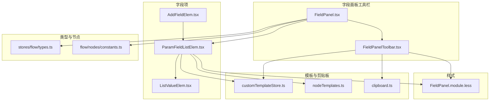
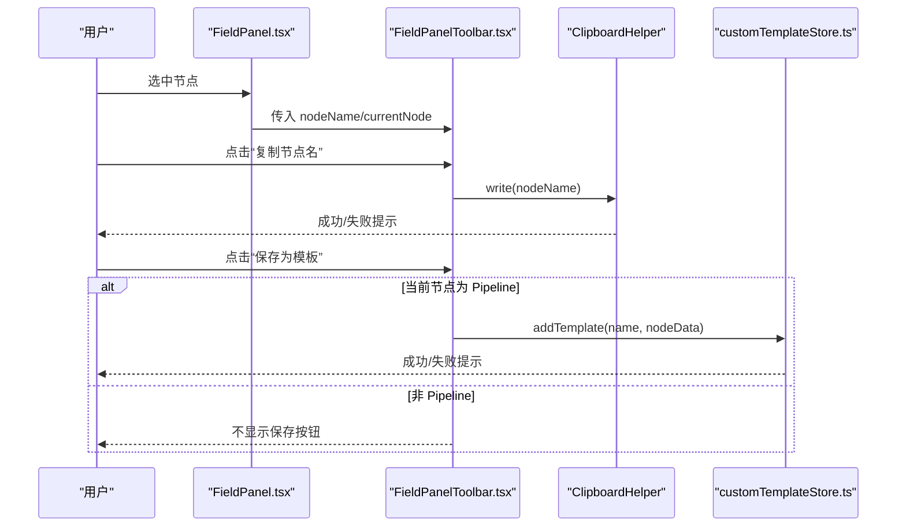
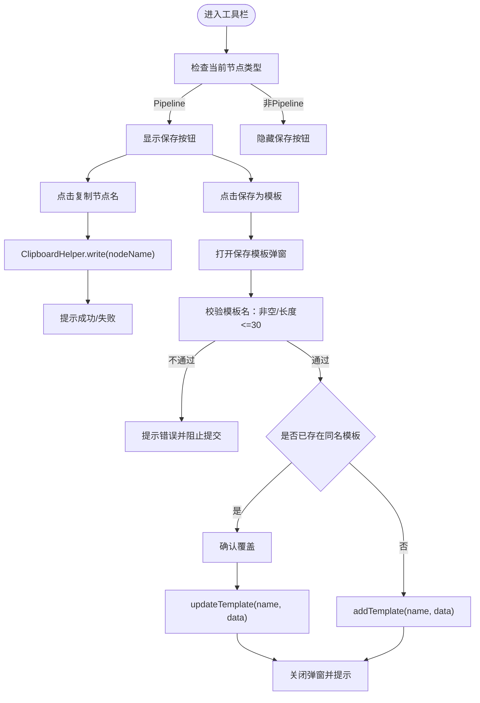
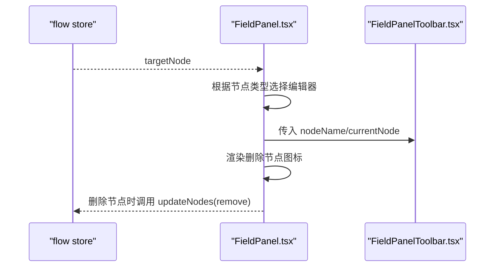
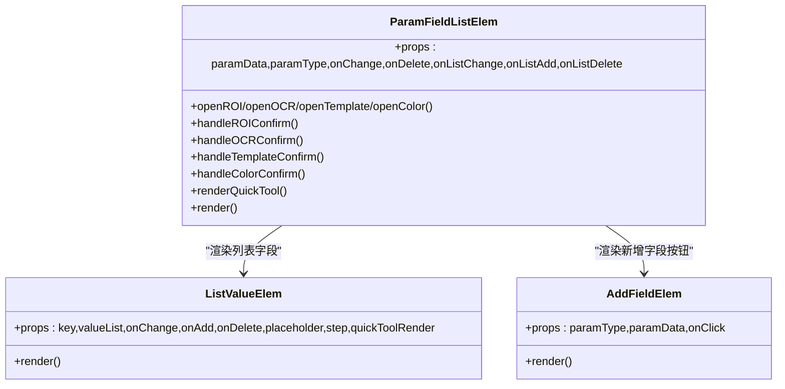
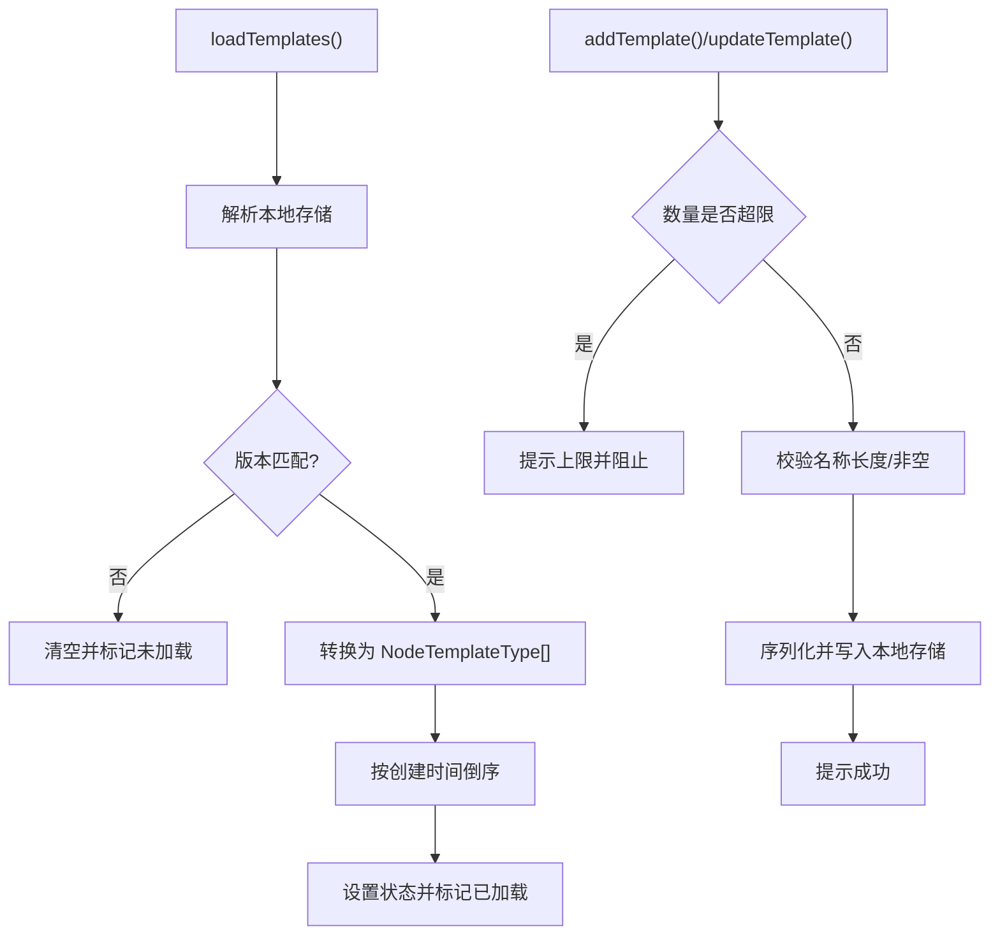
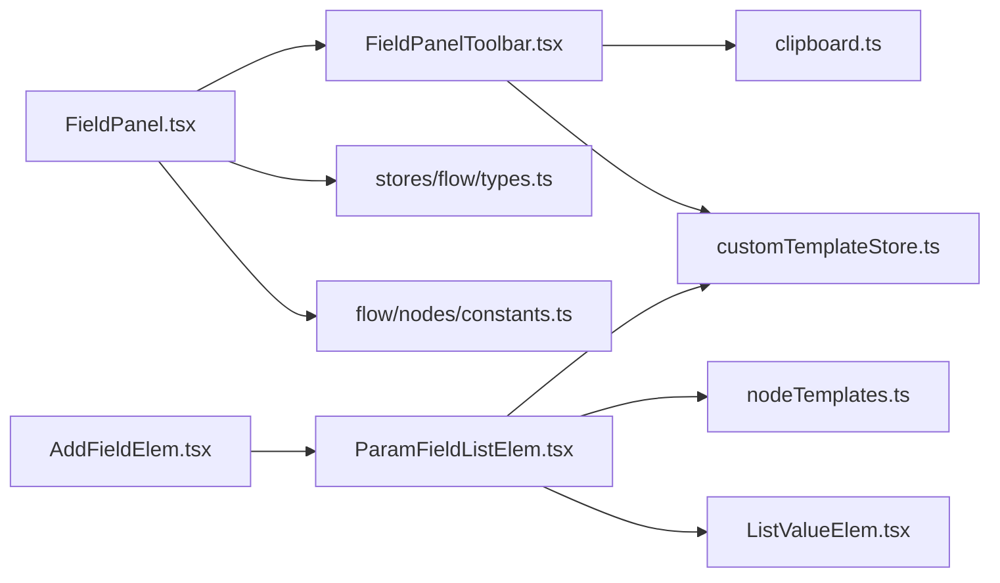

# 字段面板工具栏

<cite>
**本文引用的文件**
- [FieldPanelToolbar.tsx](file://src/components/panels/field-tools/FieldPanelToolbar.tsx)
- [FieldPanel.tsx](file://src/components/panels/FieldPanel.tsx)
- [ParamFieldListElem.tsx](file://src/components/panels/field-items/ParamFieldListElem.tsx)
- [AddFieldElem.tsx](file://src/components/panels/field-items/AddFieldElem.tsx)
- [ListValueElem.tsx](file://src/components/panels/field-items/ListValueElem.tsx)
- [types.ts](file://src/stores/flow/types.ts)
- [constants.ts](file://src/components/flow/nodes/constants.ts)
- [customTemplateStore.ts](file://src/stores/customTemplateStore.ts)
- [clipboard.ts](file://src/utils/clipboard.ts)
- [FieldPanel.module.less](file://src/styles/FieldPanel.module.less)
- [nodeTemplates.ts](file://src/data/nodeTemplates.ts)
- [index.ts](file://src/components/panels/field-tools/index.ts)
</cite>

## 目录
1. [简介](#简介)
2. [项目结构](#项目结构)
3. [核心组件](#核心组件)
4. [架构总览](#架构总览)
5. [详细组件分析](#详细组件分析)
6. [依赖关系分析](#依赖关系分析)
7. [性能考量](#性能考量)
8. [故障排查指南](#故障排查指南)
9. [结论](#结论)
10. [附录](#附录)

## 简介
字段面板工具栏位于“字段面板”的顶部区域，提供与当前节点相关的便捷操作入口，包括：
- 复制节点名（用于导入调试等场景）
- 保存为模板（仅 Pipeline 节点可用）

该工具栏与字段面板主体配合，共同完成节点字段的可视化编辑、快捷工具调用与模板管理。

## 项目结构
围绕字段面板工具栏的相关文件组织如下：
- 工具栏组件：src/components/panels/field-tools/FieldPanelToolbar.tsx
- 字段面板容器：src/components/panels/FieldPanel.tsx
- 字段项渲染：src/components/panels/field-items/ParamFieldListElem.tsx、AddFieldElem.tsx、ListValueElem.tsx
- 数据类型与节点类型：src/stores/flow/types.ts、src/components/flow/nodes/constants.ts
- 模板存储与持久化：src/stores/customTemplateStore.ts、src/data/nodeTemplates.ts
- 剪贴板工具：src/utils/clipboard.ts
- 样式：src/styles/FieldPanel.module.less
- 导出入口：src/components/panels/field-tools/index.ts

图表来源
- [FieldPanelToolbar.tsx](file://src/components/panels/field-tools/FieldPanelToolbar.tsx#L1-L149)
- [FieldPanel.tsx](file://src/components/panels/FieldPanel.tsx#L1-L97)
- [ParamFieldListElem.tsx](file://src/components/panels/field-items/ParamFieldListElem.tsx#L1-L478)
- [AddFieldElem.tsx](file://src/components/panels/field-items/AddFieldElem.tsx#L1-L60)
- [ListValueElem.tsx](file://src/components/panels/field-items/ListValueElem.tsx#L1-L95)
- [types.ts](file://src/stores/flow/types.ts#L1-L268)
- [constants.ts](file://src/components/flow/nodes/constants.ts#L1-L14)
- [customTemplateStore.ts](file://src/stores/customTemplateStore.ts#L1-L242)
- [nodeTemplates.ts](file://src/data/nodeTemplates.ts#L1-L96)
- [clipboard.ts](file://src/utils/clipboard.ts#L1-L44)
- [FieldPanel.module.less](file://src/styles/FieldPanel.module.less#L1-L120)

章节来源
- [FieldPanelToolbar.tsx](file://src/components/panels/field-tools/FieldPanelToolbar.tsx#L1-L149)
- [FieldPanel.tsx](file://src/components/panels/FieldPanel.tsx#L1-L97)

## 核心组件
- 字段面板工具栏（FieldPanelToolbar）：负责渲染顶部工具条，提供复制节点名与保存为模板的功能。
- 字段面板（FieldPanel）：承载工具栏与字段编辑内容，根据当前选中节点类型切换不同编辑器。
- 字段项渲染（ParamFieldListElem、AddFieldElem、ListValueElem）：负责字段键值展示、输入控件渲染、列表增删改、快捷工具弹窗等。
- 类型与节点（flow/types、nodes/constants）：定义节点数据结构、字段类型与节点类型枚举。
- 模板存储（customTemplateStore、nodeTemplates）：提供模板的增删改查、本地持久化与预设模板合并。
- 剪贴板（ClipboardHelper）：封装复制/粘贴能力，统一错误提示。
- 样式（FieldPanel.module.less）：统一字段面板布局与交互元素样式。

章节来源
- [FieldPanelToolbar.tsx](file://src/components/panels/field-tools/FieldPanelToolbar.tsx#L1-L149)
- [FieldPanel.tsx](file://src/components/panels/FieldPanel.tsx#L1-L97)
- [ParamFieldListElem.tsx](file://src/components/panels/field-items/ParamFieldListElem.tsx#L1-L478)
- [AddFieldElem.tsx](file://src/components/panels/field-items/AddFieldElem.tsx#L1-L60)
- [ListValueElem.tsx](file://src/components/panels/field-items/ListValueElem.tsx#L1-L95)
- [types.ts](file://src/stores/flow/types.ts#L1-L268)
- [constants.ts](file://src/components/flow/nodes/constants.ts#L1-L14)
- [customTemplateStore.ts](file://src/stores/customTemplateStore.ts#L1-L242)
- [nodeTemplates.ts](file://src/data/nodeTemplates.ts#L1-L96)
- [clipboard.ts](file://src/utils/clipboard.ts#L1-L44)
- [FieldPanel.module.less](file://src/styles/FieldPanel.module.less#L1-L120)

## 架构总览
字段面板工具栏与字段面板主体通过状态选择器绑定当前目标节点，工具栏仅在 Pipeline 节点时显示“保存为模板”按钮；字段项渲染根据字段类型动态生成输入控件，并在需要时打开快捷工具弹窗（如 ROI、OCR、模板、颜色）。模板保存使用自定义模板存储，基于本地存储实现持久化。

图表来源
- [FieldPanel.tsx](file://src/components/panels/FieldPanel.tsx#L1-L97)
- [FieldPanelToolbar.tsx](file://src/components/panels/field-tools/FieldPanelToolbar.tsx#L1-L149)
- [clipboard.ts](file://src/utils/clipboard.ts#L1-L44)
- [customTemplateStore.ts](file://src/stores/customTemplateStore.ts#L1-L242)

## 详细组件分析

### 字段面板工具栏（FieldPanelToolbar）
- 功能要点
  - 复制节点名：通过剪贴板工具写入文本，支持非字符串自动序列化。
  - 保存为模板：仅在当前节点类型为 Pipeline 时显示；弹窗输入模板名，进行长度与重复校验，支持覆盖确认。
- 关键行为
  - 前缀拼接：若当前文件配置存在前缀，则与节点名拼接形成最终显示名。
  - 模板存储：调用自定义模板存储的添加/更新接口，持久化到本地存储。
  - 用户反馈：使用消息与确认对话框进行交互提示。

图表来源
- [FieldPanelToolbar.tsx](file://src/components/panels/field-tools/FieldPanelToolbar.tsx#L1-L149)
- [clipboard.ts](file://src/utils/clipboard.ts#L1-L44)
- [customTemplateStore.ts](file://src/stores/customTemplateStore.ts#L1-L242)

章节来源
- [FieldPanelToolbar.tsx](file://src/components/panels/field-tools/FieldPanelToolbar.tsx#L1-L149)
- [clipboard.ts](file://src/utils/clipboard.ts#L1-L44)
- [customTemplateStore.ts](file://src/stores/customTemplateStore.ts#L1-L242)

### 字段面板（FieldPanel）
- 功能要点
  - 根据当前目标节点类型切换编辑器：Pipeline、External、Anchor。
  - 顶部渲染工具栏与标题，右侧提供删除节点的快捷入口。
  - 使用类名控制面板显隐与样式。
- 与工具栏协作
  - 将当前节点名与节点对象传递给工具栏，实现复制与保存模板联动。

图表来源
- [FieldPanel.tsx](file://src/components/panels/FieldPanel.tsx#L1-L97)
- [types.ts](file://src/stores/flow/types.ts#L1-L268)
- [constants.ts](file://src/components/flow/nodes/constants.ts#L1-L14)

章节来源
- [FieldPanel.tsx](file://src/components/panels/FieldPanel.tsx#L1-L97)
- [types.ts](file://src/stores/flow/types.ts#L1-L268)
- [constants.ts](file://src/components/flow/nodes/constants.ts#L1-L14)

### 字段项渲染（ParamFieldListElem、AddFieldElem、ListValueElem）
- 功能要点
  - 根据字段类型渲染不同输入控件：字符串、整数、浮点、布尔、列表等。
  - 支持选项字段（Select）与扩展字段（TextArea）。
  - 列表字段支持增删改与快捷工具（ROI、OCR、模板、颜色）。
  - 快捷工具弹窗确认后回填对应字段值，支持列表索引定位。
- 与模板系统的关联
  - 模板数据来源于 Pipeline 节点的识别与动作配置，保存时仅保留必要字段，避免冗余 label。

图表来源
- [ParamFieldListElem.tsx](file://src/components/panels/field-items/ParamFieldListElem.tsx#L1-L478)
- [ListValueElem.tsx](file://src/components/panels/field-items/ListValueElem.tsx#L1-L95)
- [AddFieldElem.tsx](file://src/components/panels/field-items/AddFieldElem.tsx#L1-L60)

章节来源
- [ParamFieldListElem.tsx](file://src/components/panels/field-items/ParamFieldListElem.tsx#L1-L478)
- [ListValueElem.tsx](file://src/components/panels/field-items/ListValueElem.tsx#L1-L95)
- [AddFieldElem.tsx](file://src/components/panels/field-items/AddFieldElem.tsx#L1-L60)

### 模板存储与持久化（customTemplateStore、nodeTemplates）
- 功能要点
  - 加载/保存模板：基于本地存储，版本控制与迁移策略。
  - 模板命名规范：长度限制、去重策略、覆盖确认。
  - 模板合并：将预设模板与自定义模板合并，排序优先级明确。
  - 数据结构：仅保存识别、动作、others、extras等必要字段，去除 label。

图表来源
- [customTemplateStore.ts](file://src/stores/customTemplateStore.ts#L1-L242)
- [nodeTemplates.ts](file://src/data/nodeTemplates.ts#L1-L96)

章节来源
- [customTemplateStore.ts](file://src/stores/customTemplateStore.ts#L1-L242)
- [nodeTemplates.ts](file://src/data/nodeTemplates.ts#L1-L96)

### 剪贴板工具（ClipboardHelper）
- 功能要点
  - 写入：自动序列化非字符串内容，统一成功/失败提示。
  - 读取：提供异步读取能力，错误时弹出通知。
- 在工具栏中的应用：复制节点名时调用写入方法。

章节来源
- [clipboard.ts](file://src/utils/clipboard.ts#L1-L44)
- [FieldPanelToolbar.tsx](file://src/components/panels/field-tools/FieldPanelToolbar.tsx#L1-L149)

## 依赖关系分析
- 组件耦合
  - FieldPanelToolbar 依赖剪贴板工具与自定义模板存储。
  - FieldPanel 依赖 flow store 的 targetNode，按节点类型切换编辑器。
  - 字段项渲染依赖字段类型定义与节点类型枚举，以及模板数据结构。
- 外部依赖
  - Ant Design 组件（Tooltip、Modal、Input、InputNumber、Select、Switch、Popover）。
  - 本地存储（localStorage）用于模板持久化。
- 潜在循环依赖
  - 当前结构以单向依赖为主，工具栏 -> 存储/剪贴板，面板 -> 工具栏，字段项 -> 模板数据，未见明显循环。

图表来源
- [FieldPanelToolbar.tsx](file://src/components/panels/field-tools/FieldPanelToolbar.tsx#L1-L149)
- [FieldPanel.tsx](file://src/components/panels/FieldPanel.tsx#L1-L97)
- [ParamFieldListElem.tsx](file://src/components/panels/field-items/ParamFieldListElem.tsx#L1-L478)
- [AddFieldElem.tsx](file://src/components/panels/field-items/AddFieldElem.tsx#L1-L60)
- [ListValueElem.tsx](file://src/components/panels/field-items/ListValueElem.tsx#L1-L95)
- [types.ts](file://src/stores/flow/types.ts#L1-L268)
- [constants.ts](file://src/components/flow/nodes/constants.ts#L1-L14)
- [customTemplateStore.ts](file://src/stores/customTemplateStore.ts#L1-L242)
- [nodeTemplates.ts](file://src/data/nodeTemplates.ts#L1-L96)
- [clipboard.ts](file://src/utils/clipboard.ts#L1-L44)

章节来源
- [FieldPanelToolbar.tsx](file://src/components/panels/field-tools/FieldPanelToolbar.tsx#L1-L149)
- [FieldPanel.tsx](file://src/components/panels/FieldPanel.tsx#L1-L97)
- [ParamFieldListElem.tsx](file://src/components/panels/field-items/ParamFieldListElem.tsx#L1-L478)
- [AddFieldElem.tsx](file://src/components/panels/field-items/AddFieldElem.tsx#L1-L60)
- [ListValueElem.tsx](file://src/components/panels/field-items/ListValueElem.tsx#L1-L95)
- [types.ts](file://src/stores/flow/types.ts#L1-L268)
- [constants.ts](file://src/components/flow/nodes/constants.ts#L1-L14)
- [customTemplateStore.ts](file://src/stores/customTemplateStore.ts#L1-L242)
- [nodeTemplates.ts](file://src/data/nodeTemplates.ts#L1-L96)
- [clipboard.ts](file://src/utils/clipboard.ts#L1-L44)

## 性能考量
- 渲染优化
  - 工具栏与面板主体均使用记忆化组件，减少不必要的重渲染。
  - 字段项渲染按需生成输入控件，列表字段通过受控组件更新，避免全量重绘。
- 交互体验
  - 快捷工具弹窗仅在需要时打开，减少 DOM 开销。
  - 模板保存采用本地存储，避免频繁网络请求。
- 建议
  - 对于大量字段的节点，可考虑虚拟滚动或分页展示，降低首屏渲染压力。
  - 模板数量较多时，建议定期清理历史模板，保持本地存储体积可控。

## 故障排查指南
- 复制节点名失败
  - 检查浏览器剪贴板权限与安全上下文（HTTPS）。
  - 查看提示消息与通知，确认异常原因。
- 保存模板失败
  - 检查模板名是否为空或超长。
  - 确认本地存储空间是否充足，或尝试清理旧模板。
  - 若版本不匹配，系统会清空并提示，重新保存即可。
- 快捷工具无法打开
  - 确认设备连接状态，工具栏会在未连接时给出提示。
  - 检查当前节点类型是否支持对应快捷工具（如 ROI/OCR/模板/颜色）。
- 字段值编辑异常
  - 确认字段类型与输入控件匹配（整数/浮点/布尔/列表）。
  - 列表字段注意索引与数据结构一致性。

章节来源
- [clipboard.ts](file://src/utils/clipboard.ts#L1-L44)
- [customTemplateStore.ts](file://src/stores/customTemplateStore.ts#L1-L242)
- [ParamFieldListElem.tsx](file://src/components/panels/field-items/ParamFieldListElem.tsx#L1-L478)

## 结论
字段面板工具栏通过简洁直观的操作，提升了节点编辑效率：复制节点名便于调试与导入，保存为模板则实现了工作流的快速复用。结合字段项渲染与快捷工具弹窗，系统在保证易用性的同时，提供了灵活的数据编辑能力。模板存储与本地持久化确保了用户资产的安全与可移植性。

## 附录
- 相关导出入口
  - [index.ts](file://src/components/panels/field-tools/index.ts#L1-L1)