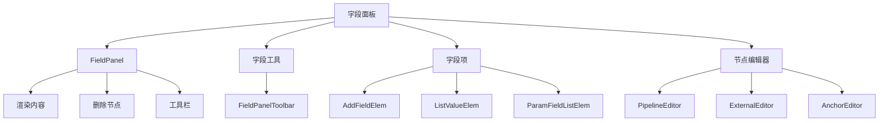
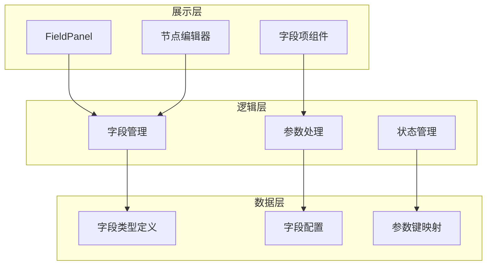
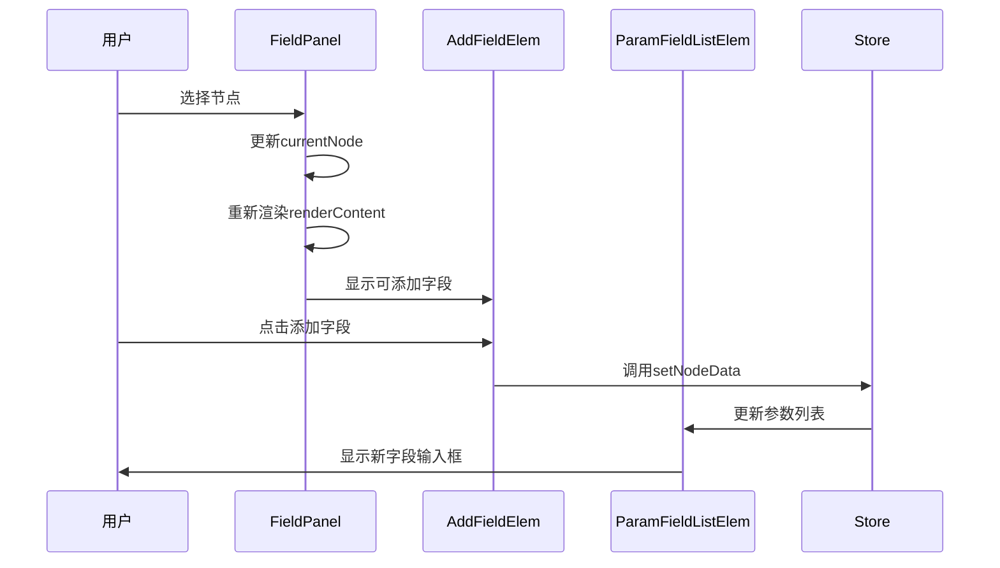
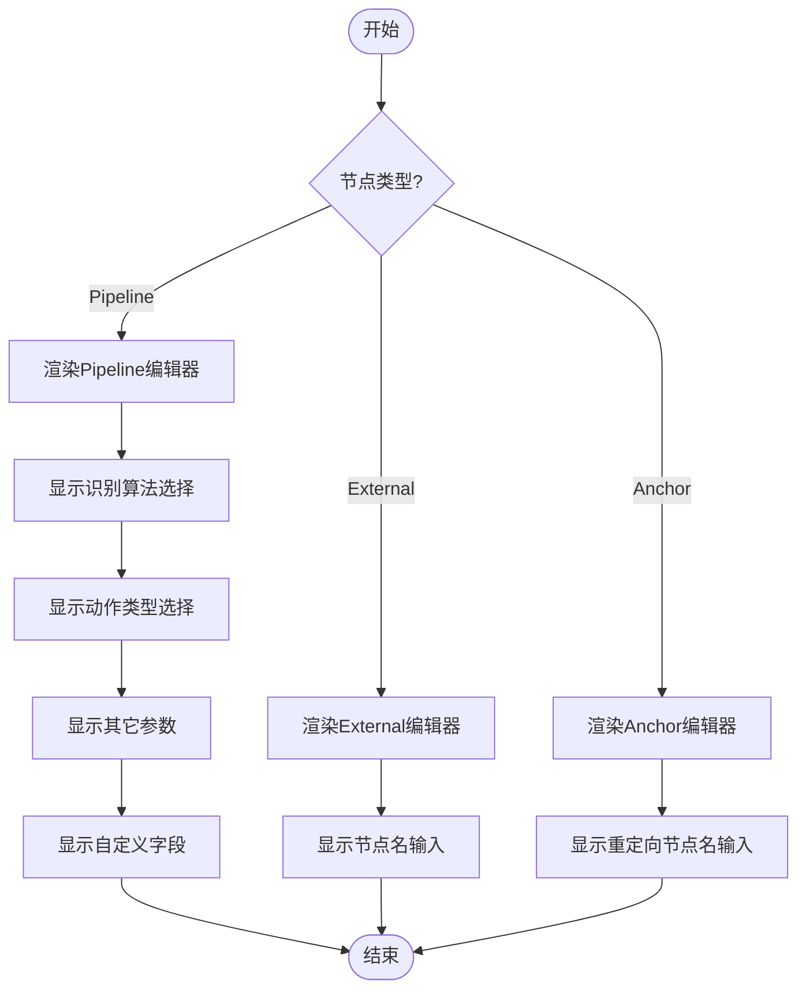
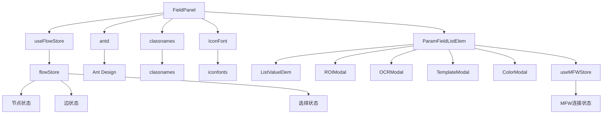

# 字段面板重构

<cite>
**本文档引用的文件**
- [FieldPanel.tsx](file://src/components/panels/FieldPanel.tsx)
- [ParamFieldListElem.tsx](file://src/components/panels/field-items/ParamFieldListElem.tsx)
- [AddFieldElem.tsx](file://src/components/panels/field-items/AddFieldElem.tsx)
- [ListValueElem.tsx](file://src/components/panels/field-items/ListValueElem.tsx)
- [PipelineEditor.tsx](file://src/components/panels/node-editors/PipelineEditor.tsx)
- [ExternalEditor.tsx](file://src/components/panels/node-editors/ExternalEditor.tsx)
- [AnchorEditor.tsx](file://src/components/panels/node-editors/AnchorEditor.tsx)
- [index.ts](file://src/core/fields/index.ts)
- [types.ts](file://src/core/fields/types.ts)
- [fieldTypes.ts](file://src/core/fields/fieldTypes.ts)
- [utils.ts](file://src/core/fields/utils.ts)
- [action/index.ts](file://src/core/fields/action/index.ts)
- [recognition/index.ts](file://src/core/fields/recognition/index.ts)
- [other/index.ts](file://src/core/fields/other/index.ts)
- [types.ts](file://src/stores/flow/types.ts)
- [FieldPanel.module.less](file://src/styles/FieldPanel.module.less)
</cite>

## 目录
1. [介绍](#介绍)
2. [项目结构](#项目结构)
3. [核心组件](#核心组件)
4. [架构概述](#架构概述)
5. [详细组件分析](#详细组件分析)
6. [依赖分析](#依赖分析)
7. [性能考虑](#性能考虑)
8. [故障排除指南](#故障排除指南)
9. [结论](#结论)

## 介绍
字段面板是可见MAAFW流水线编辑器中的核心功能组件，负责为用户提供节点参数配置的可视化界面。本重构文档详细分析了字段面板的架构设计、组件关系和实现细节，旨在为开发人员提供全面的技术参考。

## 项目结构
字段面板相关的代码主要分布在`src/components/panels`目录下，采用模块化设计，各组件职责分明。

**图表来源**
- [FieldPanel.tsx](file://src/components/panels/FieldPanel.tsx#L23-L96)
- [field-items/index.ts](file://src/components/panels/field-items/index.ts#L1-L4)
- [node-editors/index.ts](file://src/components/panels/node-editors/index.ts#L1-L4)

## 核心组件
字段面板系统由多个核心组件构成，包括主面板组件、字段项组件和节点编辑器组件。这些组件协同工作，为用户提供完整的节点参数配置功能。

**章节来源**
- [FieldPanel.tsx](file://src/components/panels/FieldPanel.tsx#L23-L96)
- [ParamFieldListElem.tsx](file://src/components/panels/field-items/ParamFieldListElem.tsx#L29-L477)
- [PipelineEditor.tsx](file://src/components/panels/node-editors/PipelineEditor.tsx#L20-L340)

## 架构概述
字段面板采用分层架构设计，从上到下分为展示层、逻辑层和数据层。这种设计模式提高了代码的可维护性和可扩展性。

**图表来源**
- [FieldPanel.tsx](file://src/components/panels/FieldPanel.tsx#L23-L96)
- [index.ts](file://src/core/fields/index.ts#L1-L39)
- [types.ts](file://src/core/fields/types.ts#L1-L32)

## 详细组件分析
### 字段面板主组件分析
字段面板主组件负责协调各个子组件的工作，根据当前选中的节点类型动态渲染相应的编辑器。

#### 类图

**图表来源**
- [FieldPanel.tsx](file://src/components/panels/FieldPanel.tsx#L23-L96)
- [FieldPanelToolbar.tsx](file://src/components/panels/field-tools/FieldPanelToolbar.tsx#L1-L50)
- [PipelineEditor.tsx](file://src/components/panels/node-editors/PipelineEditor.tsx#L20-L340)

### 字段项组件分析
字段项组件负责实现字段的添加、编辑和删除功能，支持多种数据类型的输入。

#### 序列图

**图表来源**
- [AddFieldElem.tsx](file://src/components/panels/field-items/AddFieldElem.tsx#L12-L59)
- [ParamFieldListElem.tsx](file://src/components/panels/field-items/ParamFieldListElem.tsx#L29-L477)
- [FieldPanel.tsx](file://src/components/panels/FieldPanel.tsx#L23-L96)

### 节点编辑器分析
节点编辑器根据节点类型提供不同的参数配置界面，支持识别、动作和其它参数的配置。

#### 流程图

**图表来源**
- [PipelineEditor.tsx](file://src/components/panels/node-editors/PipelineEditor.tsx#L20-L340)
- [ExternalEditor.tsx](file://src/components/panels/node-editors/ExternalEditor.tsx#L7-L50)
- [AnchorEditor.tsx](file://src/components/panels/node-editors/AnchorEditor.tsx#L7-L50)

## 依赖分析
字段面板系统依赖于多个核心模块，包括状态管理、字段定义和UI组件库。

**图表来源**
- [go.mod](file://go.mod#L1-L20)
- [FieldPanel.tsx](file://src/components/panels/FieldPanel.tsx#L1-L97)
- [ParamFieldListElem.tsx](file://src/components/panels/field-items/ParamFieldListElem.tsx#L1-L478)

## 性能考虑
字段面板在设计时考虑了性能优化，采用了多种技术手段来提升用户体验。

1. **组件记忆化**: 使用`memo`高阶组件避免不必要的重新渲染
2. **值记忆化**: 使用`useMemo`缓存计算结果
3. **回调记忆化**: 使用`useCallback`缓存函数引用
4. **异步加载**: 使用`lazy`和`Suspense`实现组件的懒加载
5. **状态优化**: 通过`useFlowStore`精确订阅所需状态

这些优化措施确保了在处理复杂流水线时，字段面板仍能保持流畅的用户体验。

## 故障排除指南
### 常见问题及解决方案
1. **字段面板不显示**
   - 检查是否选择了节点
   - 确认`currentNode`状态是否正确更新
   - 验证`useFlowStore`的订阅是否正常工作

2. **参数无法保存**
   - 检查`setNodeData`调用是否正确
   - 确认store中的更新逻辑
   - 验证参数路径是否正确

3. **快捷工具无法打开**
   - 检查设备连接状态
   - 确认`connectionStatus`是否为"connected"
   - 验证模态框的打开逻辑

4. **列表字段操作异常**
   - 检查数组规范化逻辑
   - 确认列表索引处理是否正确
   - 验证状态更新时机

**章节来源**
- [ParamFieldListElem.tsx](file://src/components/panels/field-items/ParamFieldListElem.tsx#L48-L233)
- [FieldPanel.tsx](file://src/components/panels/FieldPanel.tsx#L57-L62)

## 结论
字段面板重构通过模块化设计和分层架构，实现了高内聚低耦合的代码结构。系统采用React函数组件和Hooks API，结合Zustand状态管理，提供了响应式的用户界面。通过合理的组件拆分和性能优化，确保了在复杂场景下的稳定性和流畅性。未来可进一步优化字段类型的扩展性，增强自定义字段的灵活性。