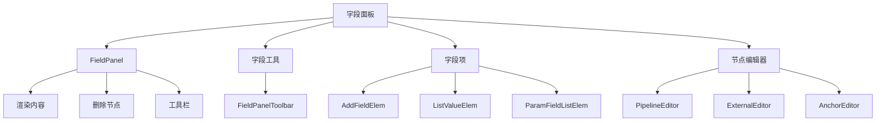
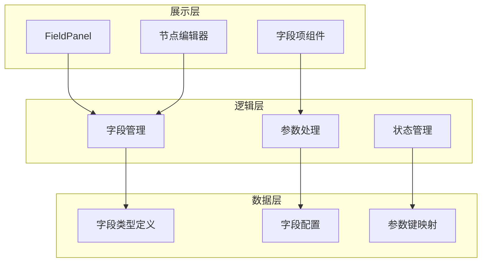
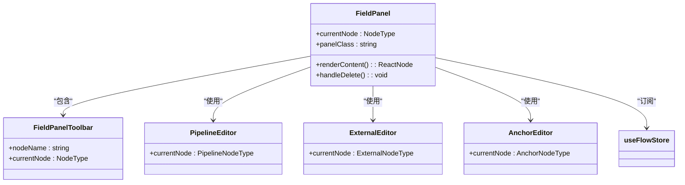
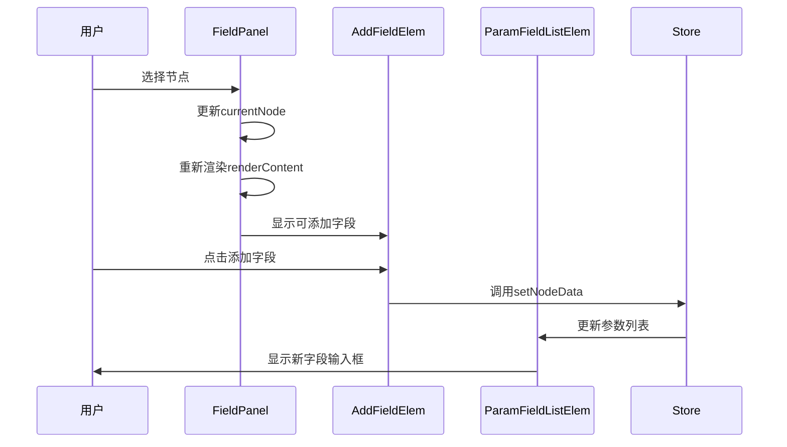
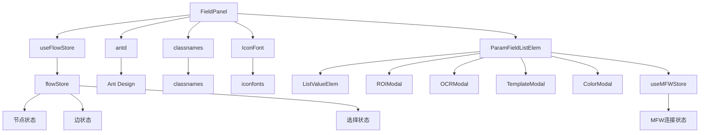

# 字段面板重构

<cite>
**本文档引用的文件**
- [FieldPanel.tsx](file://src/components/panels/main/FieldPanel.tsx)
- [ParamFieldListElem.tsx](file://src/components/panels/field/items/ParamFieldListElem.tsx)
- [AddFieldElem.tsx](file://src/components/panels/field/items/AddFieldElem.tsx)
- [ListValueElem.tsx](file://src/components/panels/field/items/ListValueElem.tsx)
- [PipelineEditor.tsx](file://src/components/panels/node-editors/PipelineEditor.tsx)
- [ExternalEditor.tsx](file://src/components/panels/node-editors/ExternalEditor.tsx)
- [AnchorEditor.tsx](file://src/components/panels/node-editors/AnchorEditor.tsx)
- [index.ts](file://src/core/fields/index.ts)
- [types.ts](file://src/core/fields/types.ts)
- [fieldTypes.ts](file://src/core/fields/fieldTypes.ts)
- [utils.ts](file://src/core/fields/utils.ts)
- [action/index.ts](file://src/core/fields/action/index.ts)
- [recognition/index.ts](file://src/core/fields/recognition/index.ts)
- [other/index.ts](file://src/core/fields/other/index.ts)
- [types.ts](file://src/stores/flow/types.ts)
- [FieldPanel.module.less](file://src/styles/FieldPanel.module.less)
- [schema.ts](file://src/core/fields/other/schema.ts)
</cite>

## 目录
1. [介绍](#介绍)
2. [项目结构](#项目结构)
3. [核心组件](#核心组件)
4. [架构概述](#架构概述)
5. [详细组件分析](#详细组件分析)
6. [依赖分析](#依赖分析)
7. [性能考虑](#性能考虑)
8. [故障排除指南](#故障排除指南)
9. [结论](#结论)

## 介绍
字段面板是可见 MAAF 编辑器中的核心功能组件，负责为用户提供节点参数配置的可视化界面。本重构文档详细分析了字段面板的架构设计、组件关系和实现细节，并重点补充 waitFreezes 字段的双模式支持（整数值与复杂对象结构）的实现与交互逻辑，旨在为开发人员提供全面的技术参考。

## 项目结构
字段面板相关的代码主要分布在 src/components/panels 目录下，采用模块化设计，各组件职责分明。

**图表来源**
- [FieldPanel.tsx](file://src/components/panels/main/FieldPanel.tsx#L182-L200)
- [field-items/index.ts](file://src/components/panels/field/items/index.ts#L1-L4)
- [node-editors/index.ts](file://src/components/panels/node-editors/index.ts#L1-L4)

## 核心组件
字段面板系统由多个核心组件构成，包括主面板组件、字段项组件和节点编辑器组件。这些组件协同工作，为用户提供完整的节点参数配置功能。

**章节来源**
- [FieldPanel.tsx](file://src/components/panels/main/FieldPanel.tsx#L182-L200)
- [ParamFieldListElem.tsx](file://src/components/panels/field/items/ParamFieldListElem.tsx#L1-L200)
- [PipelineEditor.tsx](file://src/components/panels/node-editors/PipelineEditor.tsx#L21-L60)

## 架构概述
字段面板采用分层架构设计，从上到下分为展示层、逻辑层和数据层。这种设计模式提高了代码的可维护性和可扩展性。

**图表来源**
- [FieldPanel.tsx](file://src/components/panels/main/FieldPanel.tsx#L182-L200)
- [index.ts](file://src/core/fields/index.ts#L1-L39)
- [types.ts](file://src/core/fields/types.ts#L1-L32)

## 详细组件分析
### 字段面板主组件分析
字段面板主组件负责协调各个子组件的工作，根据当前选中的节点类型动态渲染相应的编辑器。

#### 类图

**图表来源**
- [FieldPanel.tsx](file://src/components/panels/main/FieldPanel.tsx#L182-L200)
- [FieldPanelToolbar.tsx](file://src/components/panels/field/tools/FieldPanelToolbar.tsx#L1-L50)
- [PipelineEditor.tsx](file://src/components/panels/node-editors/PipelineEditor.tsx#L21-L60)

### 字段项组件分析
字段项组件负责实现字段的添加、编辑和删除功能，支持多种数据类型的输入。

#### 序列图

**图表来源**
- [AddFieldElem.tsx](file://src/components/panels/field/items/AddFieldElem.tsx#L12-L59)
- [ParamFieldListElem.tsx](file://src/components/panels/field/items/ParamFieldListElem.tsx#L1-L200)
- [FieldPanel.tsx](file://src/components/panels/main/FieldPanel.tsx#L182-L200)

### 节点编辑器分析
节点编辑器根据节点类型提供不同的参数配置界面，支持识别、动作和其它参数的配置。

#### 流程图

**图表来源**
- [PipelineEditor.tsx](file://src/components/panels/node-editors/PipelineEditor.tsx#L21-L60)
- [ExternalEditor.tsx](file://src/components/panels/node-editors/ExternalEditor.tsx#L7-L50)
- [AnchorEditor.tsx](file://src/components/panels/node-editors/AnchorEditor.tsx#L7-L50)

## 依赖分析
字段面板系统依赖于多个核心模块，包括状态管理、字段定义和 UI 组件库。

**图表来源**
- [go.mod](file://go.mod#L1-L20)
- [FieldPanel.tsx](file://src/components/panels/main/FieldPanel.tsx#L1-L97)
- [ParamFieldListElem.tsx](file://src/components/panels/field/items/ParamFieldListElem.tsx#L1-L478)

## 性能考虑
字段面板在设计时考虑了性能优化，采用了多种技术手段来提升用户体验。

1. 组件记忆化：使用 memo 高阶组件避免不必要的重新渲染
2. 值记忆化：使用 useMemo 缓存计算结果
3. 回调记忆化：使用 useCallback 缓存函数引用
4. 异步加载：使用 lazy 和 Suspense 实现组件的懒加载
5. 状态优化：通过 useFlowStore 精确订阅所需状态

这些优化措施确保了在处理复杂流水线时，字段面板仍能保持流畅的用户体验。

## 故障排除指南
### 常见问题及解决方案
1. 字段面板不显示
   - 检查是否选择了节点
   - 确认 currentNode 状态是否正确更新
   - 验证 useFlowStore 的订阅是否正常工作

2. 参数无法保存
   - 检查 setNodeData 调用是否正确
   - 确认 store 中的更新逻辑
   - 验证参数路径是否正确

3. 快捷工具无法打开
   - 检查设备连接状态
   - 确认 connectionStatus 是否为 "connected"
   - 验证模态框的打开逻辑

4. 列表字段操作异常
   - 检查数组规范化逻辑
   - 确认列表索引处理是否正确
   - 验证状态更新时机

**章节来源**
- [ParamFieldListElem.tsx](file://src/components/panels/field/items/ParamFieldListElem.tsx#L170-L200)
- [FieldPanel.tsx](file://src/components/panels/main/FieldPanel.tsx#L182-L200)

## waitFreezes 字段双模式支持（整数与对象）实现说明
本节针对 waitFreezes 字段的双模式支持进行专项说明，涵盖字段定义、模式判定、智能切换与数据转换保护策略。

- 字段定义与参数
  - pre_wait_freezes、post_wait_freezes、repeat_wait_freezes 字段均支持两种类型：
    - 整数值：表示毫秒级等待时长
    - 复杂对象：包含 time、target、target_offset、threshold、method、rate_limit、timeout 等子参数，用于更精细的“画面静止”检测
  - 字段定义与参数键列表由 other/schema.ts 提供，其中明确标注了 waitFreezes 相关字段需单独处理 int/object 双模式

- 模式判定与智能切换
  - 模式判定逻辑 isWaitFreezesObjectMode 会根据当前值是否为非空对象且非数组来判断是否进入对象模式
  - 当处于对象模式时，字段面板会显示子参数输入控件；当处于整数模式时，字段面板提供数值输入框
  - 当用户点击“添加详细参数”按钮时，若当前值为整数，则自动切换到对象模式并填充默认参数；当删除最后一个子参数时，自动回退到整数模式（值为 0）

- 数据转换与保护策略
  - 整数到对象的转换：用户在整数输入框中修改值时，直接写入 others.pre/post/repeat_wait_freezes；当点击“添加详细参数”时，将当前整数值作为 time 的默认值并进入对象模式
  - 对象到整数的回退：当删除对象中的最后一个子参数时，自动将 others.pre/post/repeat_wait_freezes 写回为 0，从而保证数据一致性与向后兼容
  - 子参数变更：在对象模式下，对任意子参数的修改都会深拷贝当前对象并写回，避免意外覆盖其他字段

- 交互细节
  - 整数模式下的 InputNumber 支持占位提示，提示用户可点击右侧按钮添加详细参数
  - 对象模式下，字段面板会渲染 AddFieldElem 以允许用户逐项添加子参数，并通过 ParamFieldListElem 渲染具体输入控件
  - 删除子参数时，若对象为空则回退到整数模式；否则保留对象结构

- 相关实现位置
  - 字段定义与参数键列表：参见 [schema.ts](file://src/core/fields/other/schema.ts#L60-L118)、[schema.ts](file://src/core/fields/other/schema.ts#L120-L179)、[schema.ts](file://src/core/fields/other/schema.ts#L242-L301)
  - 模式判定与切换逻辑：参见 [PipelineEditor.tsx](file://src/components/panels/node-editors/PipelineEditor.tsx#L185-L193)
  - 整数模式变更处理：参见 [PipelineEditor.tsx](file://src/components/panels/node-editors/PipelineEditor.tsx#L225-L261)
  - 对象模式子参数变更与删除处理：参见 [PipelineEditor.tsx](file://src/components/panels/node-editors/PipelineEditor.tsx#L262-L291)
  - 对象模式渲染与子参数输入：参见 [PipelineEditor.tsx](file://src/components/panels/node-editors/PipelineEditor.tsx#L529-L571)、[PipelineEditor.tsx](file://src/components/panels/node-editors/PipelineEditor.tsx#L590-L651)、[PipelineEditor.tsx](file://src/components/panels/node-editors/PipelineEditor.tsx#L652-L731)

**章节来源**
- [schema.ts](file://src/core/fields/other/schema.ts#L60-L118)
- [schema.ts](file://src/core/fields/other/schema.ts#L120-L179)
- [schema.ts](file://src/core/fields/other/schema.ts#L242-L301)
- [PipelineEditor.tsx](file://src/components/panels/node-editors/PipelineEditor.tsx#L185-L193)
- [PipelineEditor.tsx](file://src/components/panels/node-editors/PipelineEditor.tsx#L225-L291)
- [PipelineEditor.tsx](file://src/components/panels/node-editors/PipelineEditor.tsx#L529-L731)

## 结论
字段面板重构通过模块化设计和分层架构，实现了高内聚低耦合的代码结构。系统采用 React 函数组件和 Hooks API，结合 Zustand 状态管理，提供了响应式的用户界面。通过合理的组件拆分和性能优化，确保了在复杂场景下的稳定性和流畅性。本次更新新增 waitFreezes 字段的双模式支持，增强了字段面板对“画面静止”等待机制的表达能力，并通过智能模式切换与数据转换保护策略，提升了配置体验与数据安全性。