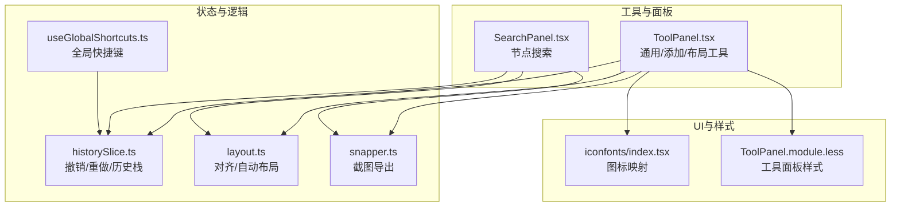
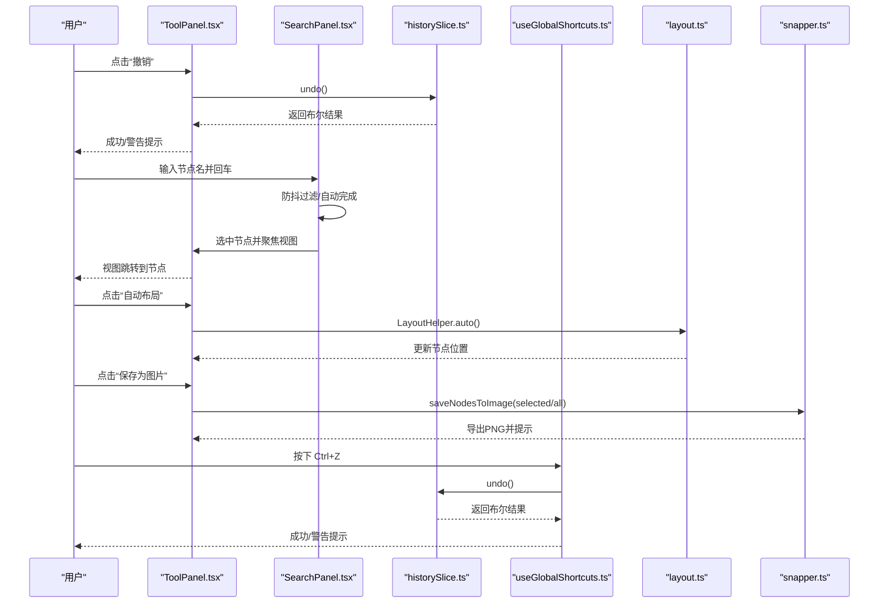
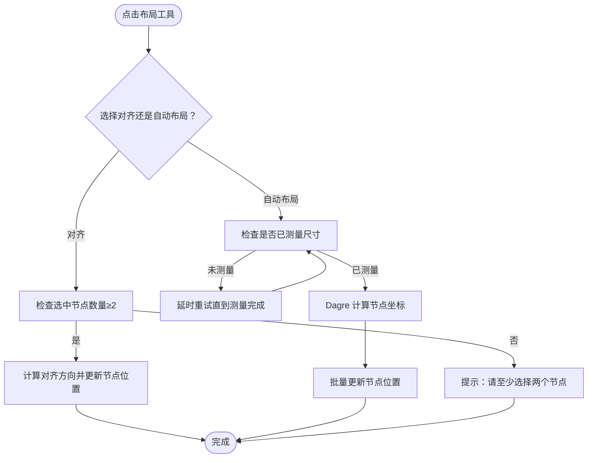
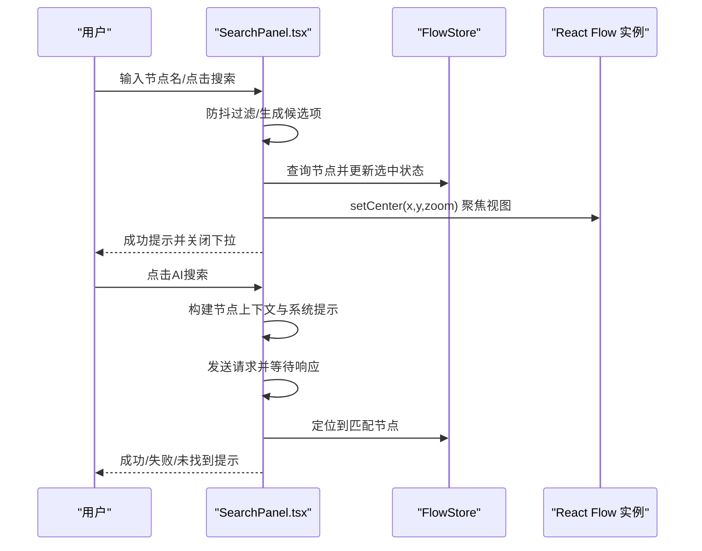
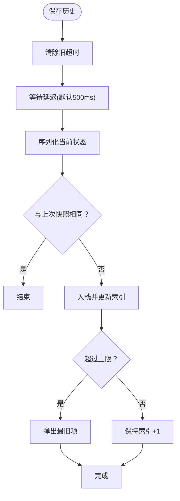
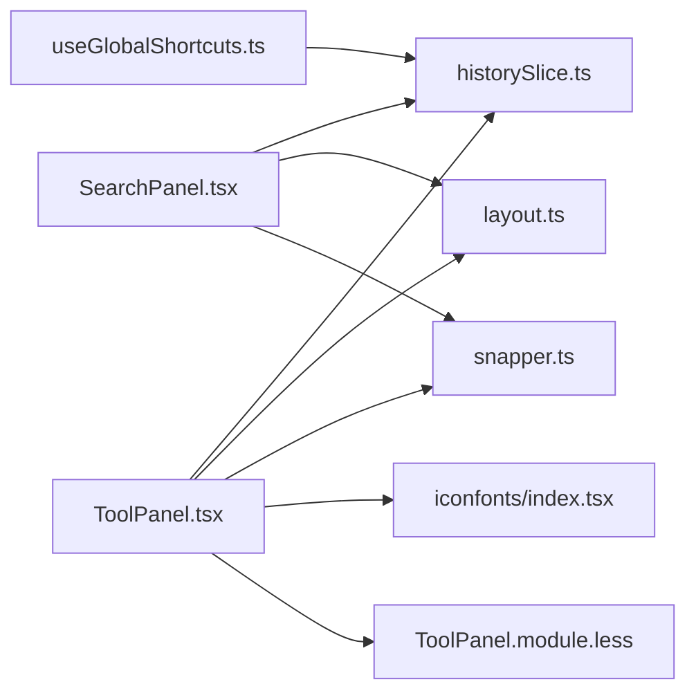

# 工具

<cite>
**本文引用的文件**
- [ToolPanel.tsx](file://src/components/panels/ToolPanel.tsx)
- [SearchPanel.tsx](file://src/components/panels/SearchPanel.tsx)
- [useGlobalShortcuts.ts](file://src/hooks/useGlobalShortcuts.ts)
- [historySlice.ts](file://src/stores/flow/slices/historySlice.ts)
- [layout.ts](file://src/core/layout.ts)
- [snapper.ts](file://src/utils/snapper.ts)
- [ToolPanel.module.less](file://src/styles/ToolPanel.module.less)
- [index.tsx](file://src/components/iconfonts/index.tsx)
- [工具.md](file://docsite/docs/01.指南/02.核心概念/60.工具.md)
</cite>

## 目录
1. [简介](#简介)
2. [项目结构](#项目结构)
3. [核心组件](#核心组件)
4. [架构总览](#架构总览)
5. [组件详解](#组件详解)
6. [依赖关系分析](#依赖关系分析)
7. [性能考量](#性能考量)
8. [故障排查指南](#故障排查指南)
9. [结论](#结论)
10. [附录](#附录)

## 简介
本章节系统性说明工具栏提供的各项辅助功能，重点围绕 ToolPanel.tsx 中的三类工具面板：通用工具（全局）、节点模板（添加）、布局工具；以及与之配套的搜索面板 SearchPanel.tsx、撤销/重做历史机制（historySlice.ts）、全局快捷键（useGlobalShortcuts.ts）与布局算法（layout.ts）、截图导出（snapper.ts）。我们将解释每个图标按钮的功能、底层实现机制、如何提升编辑效率，并提供快捷键列表与自定义建议，辅以常见使用场景示例，帮助用户快速掌握操作技巧。

## 项目结构
工具栏相关代码主要分布在以下模块：
- 工具面板：ToolPanel.tsx（包含 Add/Global/Layout 三个子面板）
- 搜索面板：SearchPanel.tsx
- 全局快捷键：useGlobalShortcuts.ts
- 历史状态管理：historySlice.ts
- 布局算法：layout.ts
- 截图导出：snapper.ts
- 样式与图标：ToolPanel.module.less、iconfonts/index.tsx
- 文档说明：docsite/docs/01.指南/02.核心概念/60.工具.md

图表来源
- [ToolPanel.tsx](file://src/components/panels/ToolPanel.tsx#L1-L313)
- [SearchPanel.tsx](file://src/components/panels/SearchPanel.tsx#L1-L307)
- [useGlobalShortcuts.ts](file://src/hooks/useGlobalShortcuts.ts#L1-L147)
- [historySlice.ts](file://src/stores/flow/slices/historySlice.ts#L1-L230)
- [layout.ts](file://src/core/layout.ts#L1-L103)
- [snapper.ts](file://src/utils/snapper.ts#L1-L87)
- [index.tsx](file://src/components/iconfonts/index.tsx#L1-L283)
- [ToolPanel.module.less](file://src/styles/ToolPanel.module.less#L1-L125)

章节来源
- [ToolPanel.tsx](file://src/components/panels/ToolPanel.tsx#L1-L313)
- [SearchPanel.tsx](file://src/components/panels/SearchPanel.tsx#L1-L307)
- [useGlobalShortcuts.ts](file://src/hooks/useGlobalShortcuts.ts#L1-L147)
- [historySlice.ts](file://src/stores/flow/slices/historySlice.ts#L1-L230)
- [layout.ts](file://src/core/layout.ts#L1-L103)
- [snapper.ts](file://src/utils/snapper.ts#L1-L87)
- [ToolPanel.module.less](file://src/styles/ToolPanel.module.less#L1-L125)
- [index.tsx](file://src/components/iconfonts/index.tsx#L1-L283)
- [工具.md](file://docsite/docs/01.指南/02.核心概念/60.工具.md#L1-L49)

## 核心组件
- 通用工具（全局面板）：设置、AI 历史、复制、粘贴、撤销、重做。支持禁用态与提示反馈，点击时触发对应 store 方法或历史状态查询。
- 节点模板（添加面板）：通过 nodeTemplates 读取模板列表，点击后调用 addNode 并可自动建立连接。
- 布局工具：居中对齐、顶部对齐、底部对齐、自动布局、保存为图片。依赖 LayoutHelper 与 snapper。
- 搜索面板：普通搜索与 AI 智能搜索，支持防抖、自动完成、键盘回车定位、视图聚焦。
- 全局快捷键：统一监听 Ctrl/Cmd+Z（撤销）、Ctrl/Cmd+Y 或 Ctrl+Shift+Z（重做），并在编辑态阻止默认行为。

章节来源
- [ToolPanel.tsx](file://src/components/panels/ToolPanel.tsx#L60-L188)
- [ToolPanel.tsx](file://src/components/panels/ToolPanel.tsx#L190-L305)
- [SearchPanel.tsx](file://src/components/panels/SearchPanel.tsx#L1-L307)
- [useGlobalShortcuts.ts](file://src/hooks/useGlobalShortcuts.ts#L1-L147)

## 架构总览
工具栏通过 Zustand Store 统一调度，历史状态由 historySlice.ts 管理，布局与截图由独立工具模块提供，搜索面板结合 store 数据与 UI 交互，全局快捷键在文档级别拦截键盘事件并转发到 store。

图表来源
- [ToolPanel.tsx](file://src/components/panels/ToolPanel.tsx#L120-L170)
- [SearchPanel.tsx](file://src/components/panels/SearchPanel.tsx#L50-L85)
- [historySlice.ts](file://src/stores/flow/slices/historySlice.ts#L110-L188)
- [useGlobalShortcuts.ts](file://src/hooks/useGlobalShortcuts.ts#L57-L116)
- [layout.ts](file://src/core/layout.ts#L16-L68)
- [snapper.ts](file://src/utils/snapper.ts#L22-L87)

## 组件详解

### 通用工具（全局面板）
- 设置：打开配置面板。
- AI 对话历史：打开 AI 历史面板。
- 复制（Ctrl+C）：当存在选中节点时可用，将节点复制到剪贴板；否则提示“未选中节点”。
- 粘贴（Ctrl+V）：当剪贴板有节点时可用，执行粘贴；否则提示“粘贴板中无已复制节点”。
- 撤销（Ctrl+Z）：基于历史状态 canUndo 判断；成功时提示“撤销成功”，失败时提示“真的没有了😭”。点击按钮时会强制刷新以同步禁用态。
- 重做（Ctrl+Y 或 Ctrl+Shift+Z）：基于历史状态 canRedo 判断；成功时提示“重做成功”，失败时提示“真的没有了😭”。

实现要点
- 历史状态查询：通过 getHistoryState() 返回 canUndo/canRedo。
- 禁用态与提示：disabled 字段与 onDisabledClick 组合，确保用户获得明确反馈。
- 与全局快捷键联动：撤销/重做同时支持按钮与快捷键两种入口。

章节来源
- [ToolPanel.tsx](file://src/components/panels/ToolPanel.tsx#L87-L170)
- [historySlice.ts](file://src/stores/flow/slices/historySlice.ts#L221-L229)
- [useGlobalShortcuts.ts](file://src/hooks/useGlobalShortcuts.ts#L57-L116)

### 节点模板（添加面板）
- 通过 nodeTemplates 读取模板列表，渲染为图标按钮。
- 点击后调用 addNode，传入模板类型、数据、是否选中/聚焦/自动连接等参数。
- 与现有选中节点配合可自动建立“next”连接。

章节来源
- [ToolPanel.tsx](file://src/components/panels/ToolPanel.tsx#L17-L57)

### 布局工具
- 居中对齐：将多个选中节点的 x 坐标设置为最小 x，实现水平居中对齐。
- 顶部对齐：将多个选中节点的 y 坐标设置为最小 y，实现顶部对齐。
- 底部对齐：将多个选中节点的 y+height 设置为最大 y+height，实现底部对齐。
- 自动布局：基于 Dagre 算法，考虑节点尺寸与边关系，生成拓扑有序的布局。
- 保存为图片：根据选中节点或全部节点计算边界，生成 PNG 并下载，支持选中范围导出。

图表来源
- [layout.ts](file://src/core/layout.ts#L16-L103)
- [ToolPanel.tsx](file://src/components/panels/ToolPanel.tsx#L206-L267)
- [snapper.ts](file://src/utils/snapper.ts#L22-L87)

章节来源
- [layout.ts](file://src/core/layout.ts#L16-L103)
- [ToolPanel.tsx](file://src/components/panels/ToolPanel.tsx#L206-L267)
- [snapper.ts](file://src/utils/snapper.ts#L22-L87)

### 搜索面板（SearchPanel.tsx）
- 普通搜索：输入节点标签，支持防抖过滤与自动完成，回车或点击按钮定位节点并聚焦视图。
- AI 智能搜索：构建节点上下文（含识别/动作/其他参数），发送给 OpenAIChat，返回最匹配节点标签并定位。
- 用户体验：输入为空时提示；找不到节点时提示；定位成功后关闭下拉并提示。

图表来源
- [SearchPanel.tsx](file://src/components/panels/SearchPanel.tsx#L1-L307)

章节来源
- [SearchPanel.tsx](file://src/components/panels/SearchPanel.tsx#L1-L307)

### 全局快捷键（useGlobalShortcuts.ts）
- 撤销：Ctrl/Cmd+Z，阻止默认行为，调用 undo()，成功提示“撤销成功”，否则提示“真的没有了😭”。
- 重做：Ctrl/Cmd+Y 或 Ctrl+Shift+Z，阻止默认行为，调用 redo()，成功提示“重做成功”，否则提示“真的没有了😭”。
- 删除键重定向：Delete 键被重定向为 Backspace，确保在编辑区中触发预期删除行为。

章节来源
- [useGlobalShortcuts.ts](file://src/hooks/useGlobalShortcuts.ts#L1-L147)

### 撤销/重做历史机制（historySlice.ts）
- 快照策略：定期（默认 500ms）序列化节点与边，差异检测后入栈，限制栈大小为 100。
- 撤销/重做：索引向前/向后移动，替换节点与边（不保存历史），清空选中状态，更新 lastSnapshot。
- 历史状态查询：返回 canUndo/canRedo，供 UI 控制禁用态。

图表来源
- [historySlice.ts](file://src/stores/flow/slices/historySlice.ts#L50-L108)
- [historySlice.ts](file://src/stores/flow/slices/historySlice.ts#L110-L188)
- [historySlice.ts](file://src/stores/flow/slices/historySlice.ts#L221-L229)

章节来源
- [historySlice.ts](file://src/stores/flow/slices/historySlice.ts#L1-L230)

## 依赖关系分析
- ToolPanel.tsx 依赖：
  - Zustand 流图 store（节点/边/选择/视口/历史）
  - ClipboardStore（复制/粘贴）
  - ConfigStore（打开设置）
  - FileStore（文件名）
  - LayoutHelper（对齐/自动布局）
  - snapper（截图导出）
  - IconFont（图标渲染）
  - ToolPanel.module.less（样式）
- SearchPanel.tsx 依赖：
  - FlowStore（节点列表/实例）
  - OpenAIChat（AI 搜索）
  - AutoComplete/Antd（输入与提示）
- useGlobalShortcuts.ts 依赖：
  - FlowStore（undo/redo）
  - Antd message（提示）
- historySlice.ts 依赖：
  - FlowStore 类型与 replace 接口
  - 结构化克隆/JSON 克隆降级
- layout.ts 依赖：
  - @dagrejs/dagre（自动布局）
  - FlowStore（读取/写入节点）
- snapper.ts 依赖：
  - html-to-image（截图）
  - @xyflow/react（边界与视口）

图表来源
- [ToolPanel.tsx](file://src/components/panels/ToolPanel.tsx#L1-L313)
- [SearchPanel.tsx](file://src/components/panels/SearchPanel.tsx#L1-L307)
- [useGlobalShortcuts.ts](file://src/hooks/useGlobalShortcuts.ts#L1-L147)
- [historySlice.ts](file://src/stores/flow/slices/historySlice.ts#L1-L230)
- [layout.ts](file://src/core/layout.ts#L1-L103)
- [snapper.ts](file://src/utils/snapper.ts#L1-L87)
- [index.tsx](file://src/components/iconfonts/index.tsx#L1-L283)
- [ToolPanel.module.less](file://src/styles/ToolPanel.module.less#L1-L125)

## 性能考量
- 历史快照节流：默认 500ms 防抖，避免频繁序列化与入栈导致卡顿。
- 差异检测：仅在状态变化时入栈，减少无效历史记录。
- 自动布局：Dagre 计算在下一帧执行，避免阻塞主线程；节点未测量时延时重试，确保尺寸准确。
- 搜索防抖：输入防抖 300ms，降低过滤开销。
- 图片导出：计算边界与视口变换，按需缩放，避免过大图像内存占用。

章节来源
- [historySlice.ts](file://src/stores/flow/slices/historySlice.ts#L50-L108)
- [layout.ts](file://src/core/layout.ts#L16-L68)
- [SearchPanel.tsx](file://src/components/panels/SearchPanel.tsx#L32-L48)
- [snapper.ts](file://src/utils/snapper.ts#L22-L87)

## 故障排查指南
- 撤销/重做不可用
  - 检查历史状态：canUndo/canRedo 是否为真。
  - 若刚执行过操作，确认保存历史的 500ms 防抖是否触发。
- 复制/粘贴无反应
  - 确认是否存在选中节点或剪贴板是否有内容。
  - 粘贴时检查剪贴板内容格式是否正确。
- 对齐/自动布局无效
  - 对齐：至少选择两个节点。
  - 自动布局：确保节点尺寸已测量；若未测量，稍后重试。
- 保存为图片失败
  - 检查画布元素是否存在；确认选中节点或全部节点非空。
- AI 搜索失败
  - 确认网络连通与提示词构建是否完整；查看错误提示与日志。
- 快捷键无效
  - 确认当前焦点不在输入框；Delete 键会被重定向为 Backspace。

章节来源
- [ToolPanel.tsx](file://src/components/panels/ToolPanel.tsx#L100-L170)
- [ToolPanel.tsx](file://src/components/panels/ToolPanel.tsx#L206-L267)
- [useGlobalShortcuts.ts](file://src/hooks/useGlobalShortcuts.ts#L1-L147)
- [snapper.ts](file://src/utils/snapper.ts#L22-L87)
- [SearchPanel.tsx](file://src/components/panels/SearchPanel.tsx#L134-L203)

## 结论
工具栏通过“通用工具 + 节点模板 + 布局工具”的组合，覆盖了复制粘贴、撤销重做、节点对齐与自动布局、节点搜索与 AI 辅助定位、全局快捷键与截图导出等高频场景。历史状态采用差异检测与节流策略，兼顾性能与可靠性；布局与截图分别由独立模块提供，职责清晰、扩展性强。配合搜索面板与快捷键，能够显著提升复杂流程图的编辑效率与准确性。

## 附录

### 快捷键一览
- 撤销：Ctrl/Cmd+Z
- 重做：Ctrl/Cmd+Y 或 Ctrl+Shift+Z
- 删除键重定向：Delete → Backspace（在编辑区内）

章节来源
- [useGlobalShortcuts.ts](file://src/hooks/useGlobalShortcuts.ts#L57-L116)

### 常见使用场景示例
- 通过搜索快速定位节点
  - 在搜索面板输入节点标签，回车或点击搜索按钮即可定位并聚焦视图。
  - 可使用 AI 智能搜索，根据节点识别/动作/参数描述返回最匹配节点。
- 利用撤销功能修复误操作
  - 执行错误操作后立即使用 Ctrl+Z 撤销；若已撤销过多，使用 Ctrl+Y 重做。
- 快速对齐与导出
  - 选中多个节点后使用“居中/顶部/底部对齐”快速整理布局。
  - 使用“自动布局”一键生成拓扑清晰的排列。
  - 使用“保存为图片”导出当前视图，支持仅导出选中节点或全部节点。

章节来源
- [SearchPanel.tsx](file://src/components/panels/SearchPanel.tsx#L50-L85)
- [ToolPanel.tsx](file://src/components/panels/ToolPanel.tsx#L120-L170)
- [ToolPanel.tsx](file://src/components/panels/ToolPanel.tsx#L206-L267)
- [ToolPanel.module.less](file://src/styles/ToolPanel.module.less#L63-L125)
- [工具.md](file://docsite/docs/01.指南/02.核心概念/60.工具.md#L1-L49)