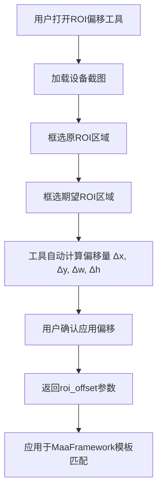

# ROI偏移工具

<cite>
**本文引用的文件列表**   
- [ROIOffsetModal.tsx](file://src\components\modals\ROIOffsetModal.tsx)
- [ROIModal.tsx](file://src\components\modals\ROIModal.tsx)
- [ScreenshotModalBase.tsx](file://src\components\modals\ScreenshotModalBase.tsx)
- [useCanvasViewport.ts](file://src\hooks\useCanvasViewport.ts)
- [API大全.md](file://instructions\maafw-golang\API大全.md)
- [模板匹配.md](file://instructions\maafw-golang\高级功能\流水线配置\识别系统配置\模板匹配.md)
- [模板匹配识别.md](file://instructions\maafw-golang\高级功能\流水线配置\节点结构详解\识别配置详解\模板匹配识别.md)
</cite>

## 目录
1. [简介](#简介)
2. [核心功能与实现](#核心功能与实现)
3. [用户界面与交互设计](#用户界面与交互设计)
4. [技术架构与组件关系](#技术架构与组件关系)
5. [应用场景与最佳实践](#应用场景与最佳实践)
6. [结论](#结论)

## 简介

ROI偏移工具是MaaPipelineEditor中的一个关键功能模块，旨在帮助用户精确计算和配置模板匹配识别中的区域偏移量。该工具通过可视化界面，允许用户在截图上分别框选“原ROI”和“期望ROI”，自动计算出两者之间的偏移量（Δx, Δy, Δw, Δh），并将其作为`roi_offset`参数应用于自动化流程中。此功能对于处理不同分辨率设备、动态界面元素或需要微调识别区域的场景至关重要，极大地提升了自动化脚本的灵活性和准确性。

**文档来源**
- [README.md](file://README.md)

## 核心功能与实现

ROI偏移工具的核心功能是计算两个矩形区域之间的偏移量，并将结果应用于MaaFramework的模板匹配识别参数中。该工具的实现基于React和Ant Design组件库，通过`ROIOffsetModal`组件提供用户界面。

工具的核心逻辑在`ROIOffsetModal.tsx`文件中实现，主要包含以下几个关键部分：
1. **状态管理**：使用`useState`钩子管理截图数据、原ROI、目标ROI、当前绘制目标等状态。
2. **偏移计算**：通过`calculateOffset`函数实时计算原ROI与目标ROI之间的偏移量，公式为`期望ROI - 原ROI`。
3. **Canvas渲染**：利用HTML5 Canvas API在截图上绘制两个ROI区域，并用不同颜色（蓝色代表原ROI，橙色代表期望ROI）和标签进行区分。
4. **交互逻辑**：通过鼠标事件处理器实现ROI的框选、拖动和缩放功能，支持在“原ROI”和“期望ROI”之间切换绘制目标。
5. **结果应用**：当用户确认操作时，将计算出的偏移量通过`onConfirm`回调函数返回，供上层组件使用。

该工具与MaaFramework的`NodeTemplateMatchParam`结构体紧密集成，其中`ROIOffset`字段直接对应此工具的输出结果，用于在模板匹配时对识别区域进行微调。



**图表来源**
- [ROIOffsetModal.tsx](file://src\components\modals\ROIOffsetModal.tsx)

**文档来源**
- [ROIOffsetModal.tsx](file://src\components\modals\ROIOffsetModal.tsx)
- [API大全.md](file://instructions\maafw-golang\API大全.md)

## 用户界面与交互设计

ROI偏移工具的用户界面设计直观且高效，采用左右分栏布局，左侧为截图预览区，右侧为参数配置区。

**截图预览区**：
- 显示从设备获取的实时截图。
- 支持滚轮缩放和按住空格键拖动视图，方便用户精确定位。
- 在截图上直观绘制“原ROI”（蓝色）和“期望ROI”（橙色）两个矩形区域，并用箭头连接，清晰展示偏移方向。
- 提供“重新截图”按钮，可随时刷新截图。

**参数配置区**：
- **原ROI区域**：显示当前框选的原ROI坐标（x, y, w, h），并提供“清除”按钮。用户可手动输入坐标值进行精确调整。
- **期望ROI区域**：显示期望的ROI坐标，同样支持手动输入和清除。
- **计算结果区域**：实时显示计算出的偏移量（Δx, Δy, Δw, Δh），并明确标注公式“= 期望 ROI - 原 ROI”。用户也可直接修改偏移量，工具会反向计算出期望ROI的位置。
- **工具栏**：提供“交换”、“复制到原ROI”、“使用节点ROI”等快捷操作按钮，提升操作效率。

整个交互流程流畅，用户可以通过鼠标框选快速定义区域，也可以通过手动输入实现像素级精确控制，满足不同场景下的需求。

```mermaid
flowchart LR
subgraph 左侧 [截图预览区]
A[设备截图] --> B[原ROI (蓝色)]
A --> C[期望ROI (橙色)]
B --> D[偏移箭头]
C --> D
end
subgraph 右侧 [参数配置区]
E[原ROI输入] --> F[期望ROI输入]
F --> G[偏移量输出]
G --> H[应用偏移]
end
A --> E
C --> F
G --> D
```

**图表来源**
- [ROIOffsetModal.tsx](file://src\components\modals\ROIOffsetModal.tsx)
- [ScreenshotModalBase.tsx](file://src\components\modals\ScreenshotModalBase.tsx)

**文档来源**
- [ROIOffsetModal.tsx](file://src\components\modals\ROIOffsetModal.tsx)

## 技术架构与组件关系

ROI偏移工具的技术架构清晰，由多个可复用的组件构成，体现了良好的模块化设计。

**核心组件**：
- `ROIOffsetModal`：主组件，负责整体逻辑和UI布局。
- `ROIModal`：基础ROI配置组件，`ROIOffsetModal`继承并扩展了其功能。
- `ScreenshotModalBase`：通用的截图模态框基类，提供截图加载、视口控制（缩放、拖动）等基础功能。
- `useCanvasViewport`：自定义Hook，封装了Canvas视口的缩放、平移和键盘事件（如空格键）处理逻辑。

**组件关系**：
`ROIOffsetModal`通过组合`ScreenshotModalBase`来复用其截图和视口控制功能，同时使用`useCanvasViewport`来管理视图状态。`ROIModal`作为更基础的ROI选择器，为`ROIOffsetModal`提供了单个ROI框选的核心能力。这种分层设计使得代码高度可复用，例如`ROIModal`也被用于其他需要选择ROI的场景。

**数据流**：
1. `ROIOffsetModal`初始化，打开模态框。
2. 通过`mfwProtocol`请求设备截图。
3. 截图数据通过`onScreenshotChange`回调传递给`ROIOffsetModal`。
4. 用户在Canvas上框选ROI，状态更新触发`redrawCanvas`重新绘制。
5. `calculateOffset`根据`sourceRect`和`targetRect`计算偏移量。
6. 用户点击“应用偏移”，`onConfirm`回调返回偏移量数组。

```mermaid
classDiagram
class ROIOffsetModal {
+open : boolean
+onClose() : void
+onConfirm(offset : [number, number, number, number]) : void
+initialROI : [number, number, number, number]
-screenshot : string | null
-sourceRect : Rectangle | null
-targetRect : Rectangle | null
-drawingTarget : "source" | "target"
-offset : [number, number, number, number]
+calculateOffset() : [number, number, number, number]
+handleConfirm() : void
}
class ROIModal {
+open : boolean
+onClose() : void
+onConfirm(roi : [number, number, number, number]) : void
+initialROI : [number, number, number, number]
-rectangle : Rectangle | null
}
class ScreenshotModalBase {
+open : boolean
+onClose() : void
+title : string
+width : number
+confirmText : string
+confirmDisabled : boolean
+onConfirm() : void
+renderToolbar(props : ViewportProps) : ReactNode
+renderCanvas(props : CanvasRenderProps) : ReactNode
+children : ReactNode
-screenshot : string | null
-imageLoaded : boolean
-isLoading : boolean
}
class useCanvasViewport {
+scale : number
+panOffset : {x : number, y : number}
+isPanning : boolean
+isSpacePressed : boolean
+containerRef : RefObject<HTMLDivElement>
+imageRef : RefObject<HTMLImageElement | null>
+handleZoomIn() : void
+handleZoomOut() : void
+handleZoomReset() : void
+startPan(clientX : number, clientY : number) : void
+updatePan(clientX : number, clientY : number) : void
+endPan() : void
+initializeImage(img : HTMLImageElement) : void
+resetViewport() : void
}
ROIOffsetModal --> ROIModal : 继承/扩展
ROIOffsetModal --> ScreenshotModalBase : 组合
ROIOffsetModal --> useCanvasViewport : 使用
ScreenshotModalBase --> useCanvasViewport : 使用
```

**图表来源**
- [ROIOffsetModal.tsx](file://src\components\modals\ROIOffsetModal.tsx)
- [ROIModal.tsx](file://src\components\modals\ROIModal.tsx)
- [ScreenshotModalBase.tsx](file://src\components\modals\ScreenshotModalBase.tsx)
- [useCanvasViewport.ts](file://src\hooks\useCanvasViewport.ts)

**文档来源**
- [ROIOffsetModal.tsx](file://src\components\modals\ROIOffsetModal.tsx)
- [useCanvasViewport.ts](file://src\hooks\useCanvasViewport.ts)

## 应用场景与最佳实践

ROI偏移工具在自动化脚本开发中具有广泛的应用场景，是确保脚本在不同环境下稳定运行的关键。

**主要应用场景**：
1. **多分辨率适配**：当同一应用在不同型号的设备上运行时，界面元素的位置和大小可能略有差异。通过ROI偏移工具，可以基于一个基准分辨率的ROI，快速计算出在其他分辨率下的偏移量，实现跨设备兼容。
2. **动态界面处理**：某些应用的界面会根据用户数据动态变化（如排行榜、任务列表），导致目标元素位置不固定。ROI偏移工具可以帮助开发者微调识别区域，确保在各种情况下都能准确定位。
3. **模板匹配优化**：在模板匹配识别中，精确的ROI可以显著提高匹配速度和准确性。通过先框选一个大致区域，再使用偏移工具进行微调，可以找到最佳的识别窗口。

**最佳实践**：
- **精确框选**：在框选ROI时，应尽量紧密地围绕目标元素，避免包含过多无关背景，以减少计算量和误匹配风险。
- **利用快捷操作**：善用“交换”和“复制到原ROI”按钮，可以快速进行对比和调整。
- **结合OCR工具**：对于文本识别场景，可以先使用OCR工具识别文本位置，再以此为基础设置ROI，提高效率。
- **验证偏移效果**：应用偏移后，应在实际环境中测试脚本，验证识别效果是否符合预期。

**文档来源**
- [模板匹配.md](file://instructions\maafw-golang\高级功能\流水线配置\识别系统配置\模板匹配.md)
- [模板匹配识别.md](file://instructions\maafw-golang\高级功能\流水线配置\节点结构详解\识别配置详解\模板匹配识别.md)

## 结论

ROI偏移工具是MaaPipelineEditor中一个设计精良、功能实用的组件。它通过直观的可视化界面，解决了自动化脚本开发中ROI区域微调的痛点问题。其模块化的架构设计，使得核心功能（如截图、视口控制）得以高度复用，保证了代码的可维护性和扩展性。该工具与MaaFramework的深度集成，使得开发者能够轻松地将计算出的偏移量应用于模板匹配等识别任务中，极大地提升了开发效率和脚本的鲁棒性。对于需要处理多分辨率或动态界面的自动化项目，ROI偏移工具是不可或缺的利器。