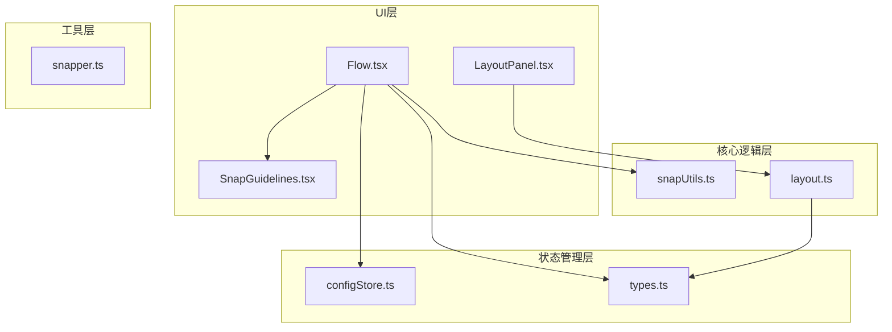
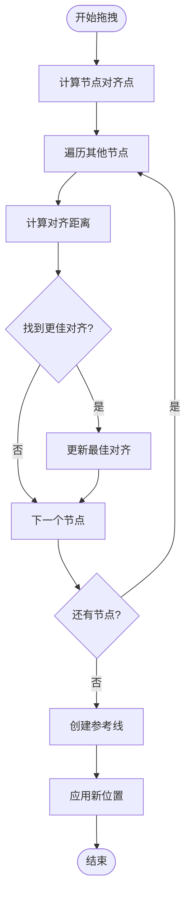
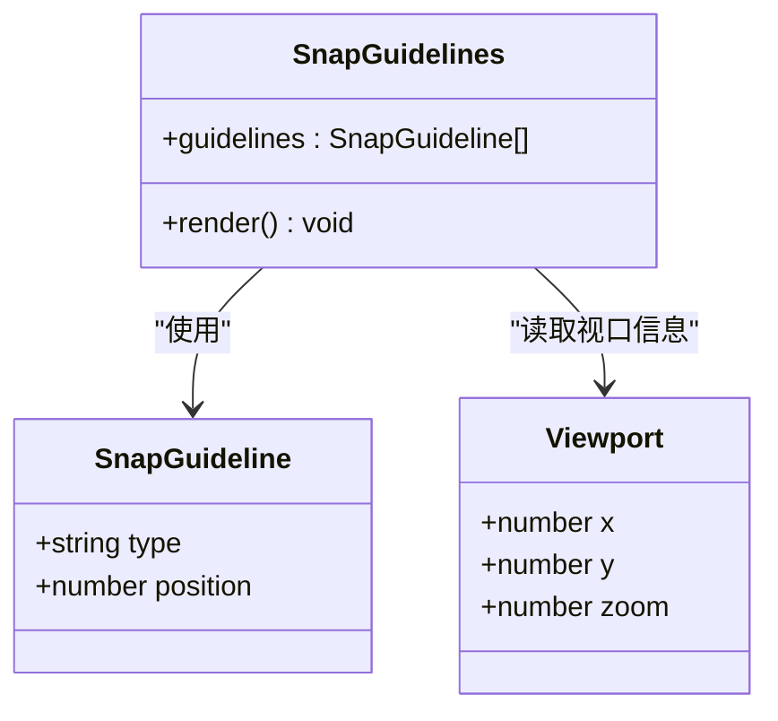
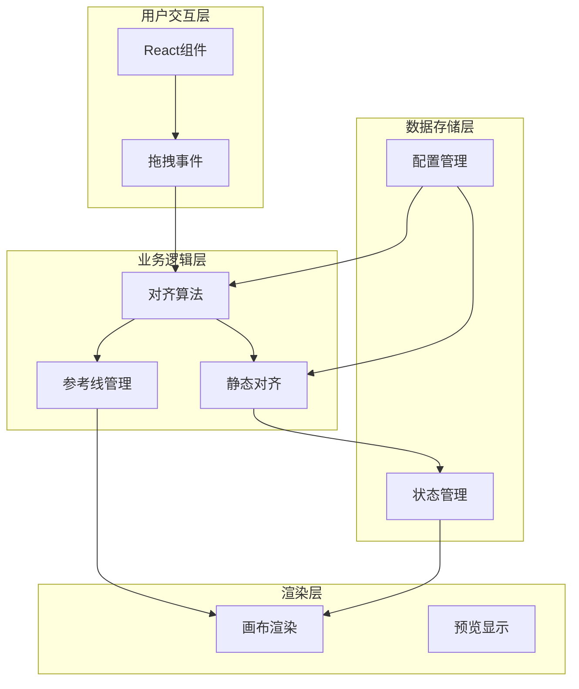
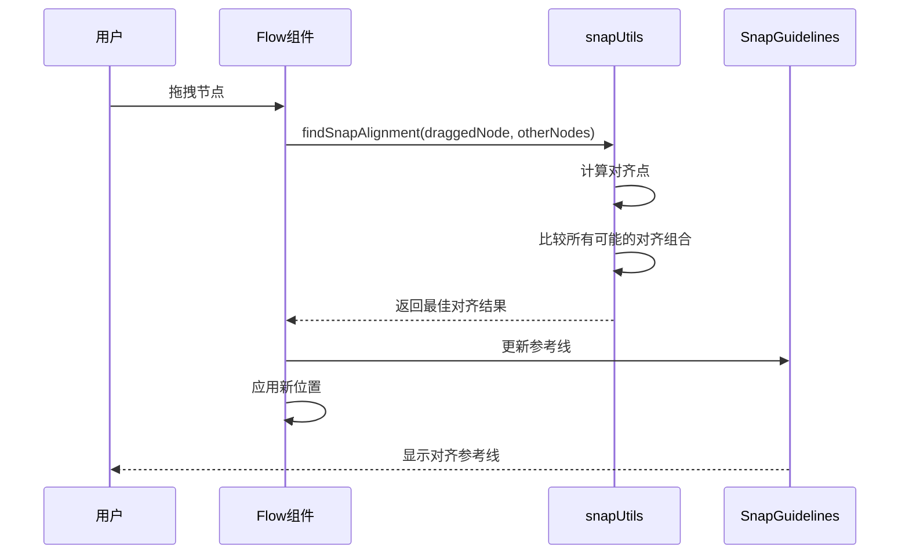
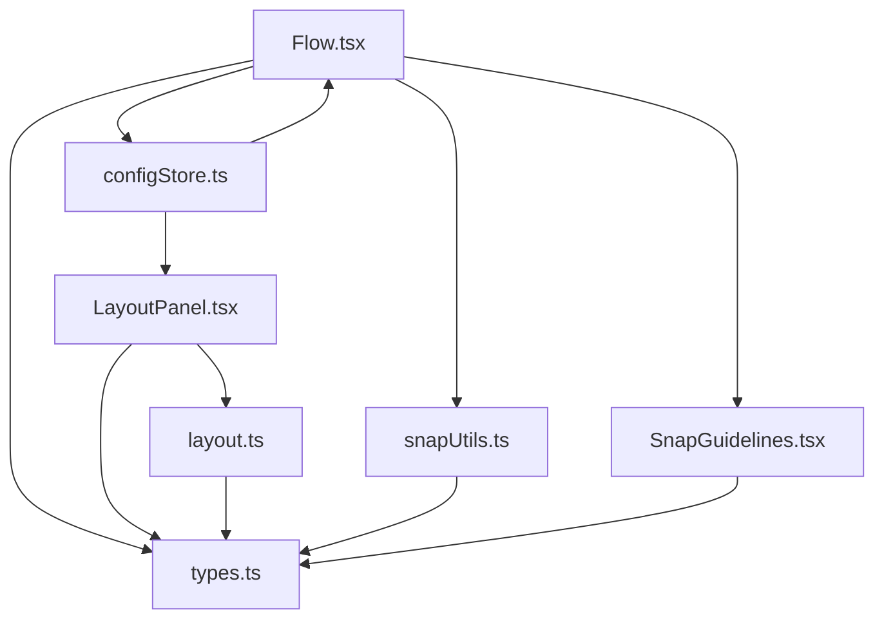

# 对齐吸附系统

<cite>
**本文档引用的文件**
- [snapUtils.ts](file://src/core/snapUtils.ts)
- [SnapGuidelines.tsx](file://src/components/flow/SnapGuidelines.tsx)
- [Flow.tsx](file://src/components/Flow.tsx)
- [layout.ts](file://src/core/layout.ts)
- [LayoutPanel.tsx](file://src/components/panels/tools/LayoutPanel.tsx)
- [configStore.ts](file://src/stores/configStore.ts)
- [types.ts](file://src/stores/flow/types.ts)
- [snapper.ts](file://src/utils/snapper.ts)
</cite>

## 目录
1. [简介](#简介)
2. [项目结构](#项目结构)
3. [核心组件](#核心组件)
4. [架构概览](#架构概览)
5. [详细组件分析](#详细组件分析)
6. [依赖关系分析](#依赖关系分析)
7. [性能考虑](#性能考虑)
8. [故障排除指南](#故障排除指南)
9. [结论](#结论)

## 简介

对齐吸附系统是 MaaPipelineEditor 中的一个重要功能模块，它提供了智能的节点对齐和磁吸对齐能力。该系统允许用户在拖拽节点时自动对齐到其他节点，提高工作流编辑的效率和准确性。

系统主要包含三个核心功能：
- **磁吸对齐**：拖拽节点时自动吸附到其他节点的边缘
- **视觉参考线**：实时显示对齐参考线
- **静态对齐**：支持居中、顶部、底部等静态对齐方式

## 项目结构

对齐吸附系统分布在多个文件中，形成了清晰的分层架构：

**图表来源**
- [Flow.tsx](file://src/components/Flow.tsx#L1-L404)
- [snapUtils.ts](file://src/core/snapUtils.ts#L1-L105)
- [SnapGuidelines.tsx](file://src/components/flow/SnapGuidelines.tsx#L1-L59)

**章节来源**
- [Flow.tsx](file://src/components/Flow.tsx#L1-L404)
- [snapUtils.ts](file://src/core/snapUtils.ts#L1-L105)
- [configStore.ts](file://src/stores/configStore.ts#L1-L241)

## 核心组件

### 磁吸对齐算法

磁吸对齐系统的核心是 `findSnapAlignment` 函数，它实现了智能的节点对齐算法：

**图表来源**
- [snapUtils.ts](file://src/core/snapUtils.ts#L43-L104)

### 参考线渲染系统

参考线系统负责可视化显示对齐结果：

**图表来源**
- [SnapGuidelines.tsx](file://src/components/flow/SnapGuidelines.tsx#L1-L59)
- [snapUtils.ts](file://src/core/snapUtils.ts#L5-L15)

**章节来源**
- [snapUtils.ts](file://src/core/snapUtils.ts#L1-L105)
- [SnapGuidelines.tsx](file://src/components/flow/SnapGuidelines.tsx#L1-L59)

## 架构概览

对齐吸附系统采用分层架构设计，确保了良好的模块化和可维护性：

**图表来源**
- [Flow.tsx](file://src/components/Flow.tsx#L274-L322)
- [layout.ts](file://src/core/layout.ts#L70-L102)
- [configStore.ts](file://src/stores/configStore.ts#L145-L200)

## 详细组件分析

### 磁吸对齐核心算法

磁吸对齐算法是整个系统的核心，它通过计算节点的多个关键点来进行精确对齐：

#### 对齐点计算

系统为每个节点计算六个关键对齐点：
- 左边缘：`left = x`
- 右边缘：`right = x + width`
- 顶部：`top = y`
- 底部：`bottom = y + height`
- 水平中心：`centerX = x + width/2`
- 垂直中心：`centerY = y + height/2`

#### 对齐策略

算法采用双重循环策略：
1. **X轴对齐**：比较拖拽节点的左右边缘与目标节点的左右边缘
2. **Y轴对齐**：比较拖拽节点的上下边缘与目标节点的上下边缘

**图表来源**
- [Flow.tsx](file://src/components/Flow.tsx#L274-L322)
- [snapUtils.ts](file://src/core/snapUtils.ts#L43-L104)

**章节来源**
- [snapUtils.ts](file://src/core/snapUtils.ts#L24-L104)
- [Flow.tsx](file://src/components/Flow.tsx#L274-L322)

### 参考线渲染系统

参考线系统提供了实时的视觉反馈：

#### 渲染机制

参考线使用CSS渐变背景实现：
- **垂直参考线**：使用蓝色渐变条纹，沿Y轴延伸
- **水平参考线**：使用蓝色渐变条纹，沿X轴延伸
- **响应式缩放**：根据视口缩放比例动态调整位置

#### 性能优化

系统采用了多项性能优化措施：
- **条件渲染**：只有在存在参考线时才渲染
- **内存优化**：使用React.memo避免不必要的重渲染
- **坐标转换**：正确处理视口变换和缩放

**章节来源**
- [SnapGuidelines.tsx](file://src/components/flow/SnapGuidelines.tsx#L1-L59)

### 静态对齐功能

静态对齐提供了预定义的对齐方式：

#### 对齐类型

系统支持三种静态对齐方式：
- **居中对齐**：将节点左边缘对齐到最左侧节点的左边缘
- **顶部对齐**：将节点顶部对齐到最高节点的顶部
- **底部对齐**：将节点底部对齐到最低节点的底部

#### 实现原理

静态对齐通过计算节点边界来实现：
1. **边界检测**：计算选中节点的最小/最大坐标
2. **位置调整**：将节点移动到计算出的对齐位置
3. **批量更新**：使用单次操作更新所有节点位置

**章节来源**
- [layout.ts](file://src/core/layout.ts#L70-L102)
- [LayoutPanel.tsx](file://src/components/panels/tools/LayoutPanel.tsx#L55-L92)

### 配置管理系统

系统提供了灵活的配置选项：

#### 配置项

主要配置项包括：
- `enableNodeSnap`：启用/禁用节点磁吸对齐
- `canvasBackgroundMode`：画布背景模式
- `fieldPanelMode`：字段面板模式

#### 配置存储

配置使用Zustand状态管理：
- **集中存储**：所有配置项统一存储在configStore中
- **类型安全**：完整的TypeScript类型定义
- **响应式更新**：配置变更自动触发UI更新

**章节来源**
- [configStore.ts](file://src/stores/configStore.ts#L86-L184)

## 依赖关系分析

对齐吸附系统的依赖关系清晰明确：

**图表来源**
- [Flow.tsx](file://src/components/Flow.tsx#L38-L42)
- [layout.ts](file://src/core/layout.ts#L1-L103)

**章节来源**
- [Flow.tsx](file://src/components/Flow.tsx#L1-L404)
- [layout.ts](file://src/core/layout.ts#L1-L103)

## 性能考虑

### 算法复杂度

磁吸对齐算法的时间复杂度为 O(n)，其中 n 是场景中节点数量的平方：
- **外层循环**：遍历每个其他节点
- **内层循环**：比较每个节点的六个对齐点
- **总比较次数**：6 × 6 × (n-1) = 36(n-1)

### 优化策略

系统采用了多种优化策略：
1. **早期退出**：当没有测量尺寸的节点时跳过计算
2. **阈值控制**：只处理接近的节点对齐
3. **批量更新**：使用单次操作更新所有节点位置
4. **条件渲染**：避免不必要的DOM更新

### 内存管理

- **状态管理**：使用Zustand提供高效的状态更新
- **组件优化**：大量使用React.memo避免重渲染
- **事件处理**：使用useCallback优化事件处理器

## 故障排除指南

### 常见问题

#### 节点无法对齐

**可能原因**：
1. 节点未测量尺寸（measured属性缺失）
2. 磁吸功能被禁用
3. 节点间距离超过阈值

**解决方案**：
1. 确保所有节点都有width和height属性
2. 检查配置中的enableNodeSnap设置
3. 调整磁吸阈值参数

#### 参考线不显示

**可能原因**：
1. 视口元素未找到
2. 没有对齐的节点
3. ReactFlow实例未正确初始化

**解决方案**：
1. 确保ReactFlow容器正确渲染
2. 检查节点选择状态
3. 验证ReactFlow实例状态

#### 对齐效果不准确

**可能原因**：
1. 节点尺寸计算错误
2. 坐标系统转换问题
3. 视口缩放影响

**解决方案**：
1. 验证节点的measured属性
2. 检查坐标转换逻辑
3. 考虑视口缩放因素

**章节来源**
- [Flow.tsx](file://src/components/Flow.tsx#L274-L322)
- [snapUtils.ts](file://src/core/snapUtils.ts#L43-L104)

## 结论

对齐吸附系统是一个设计精良的功能模块，具有以下特点：

### 优势

1. **算法精确**：通过多点对齐确保高精度的对齐效果
2. **性能优秀**：O(n)时间复杂度适合大规模节点场景
3. **用户体验好**：实时参考线提供直观的视觉反馈
4. **配置灵活**：支持多种对齐模式和自定义参数

### 技术亮点

1. **分层架构**：清晰的组件分离便于维护和扩展
2. **类型安全**：完整的TypeScript类型定义
3. **性能优化**：多处性能优化确保流畅体验
4. **状态管理**：合理的状态组织和更新机制

### 改进建议

1. **阈值调节**：可以考虑动态调整磁吸阈值
2. **对齐预览**：添加对齐预览功能提升用户体验
3. **批量对齐**：支持更多节点的批量对齐操作
4. **自定义对齐**：允许用户自定义对齐规则

该系统为MaaPipelineEditor提供了强大的节点对齐能力，显著提升了工作流编辑的效率和准确性。