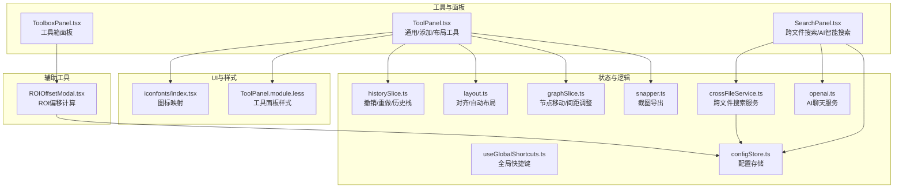
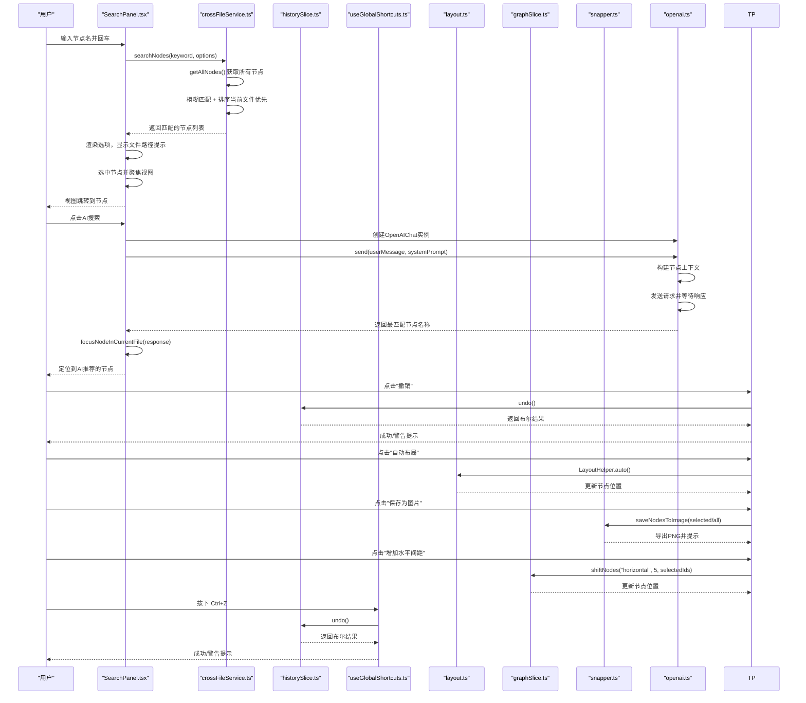
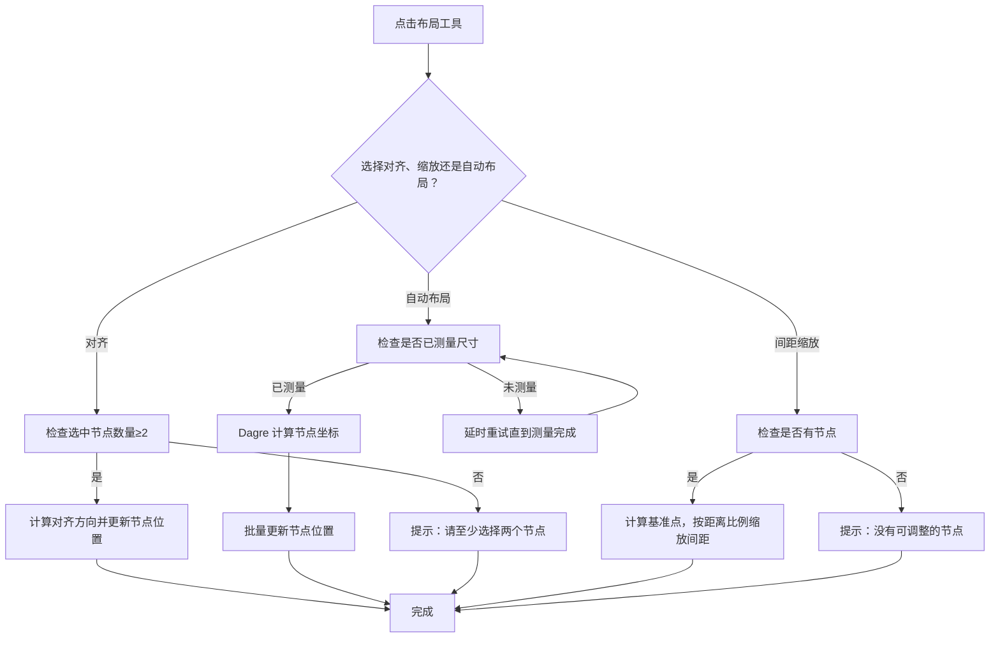
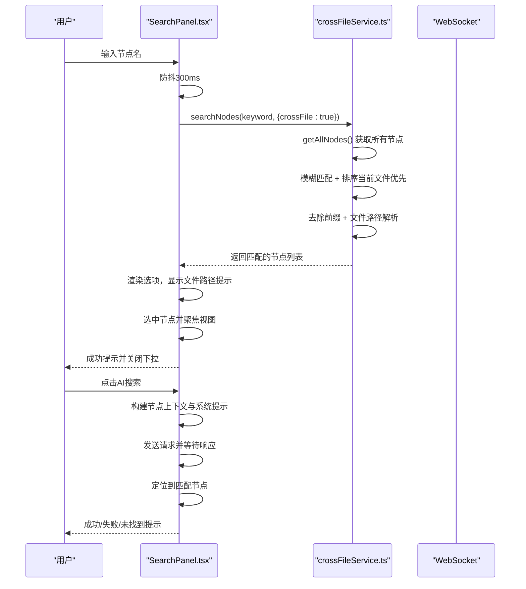
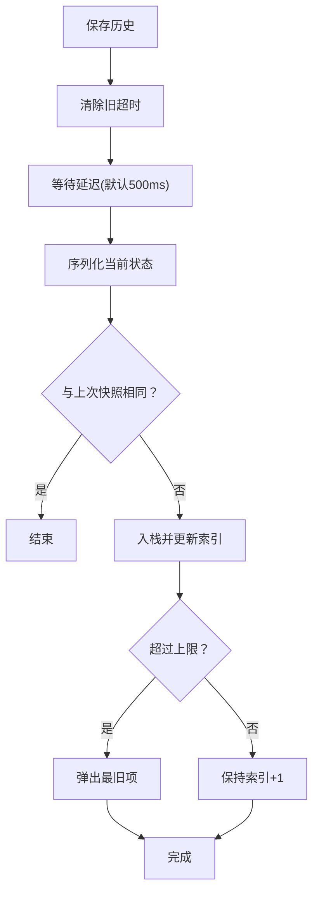
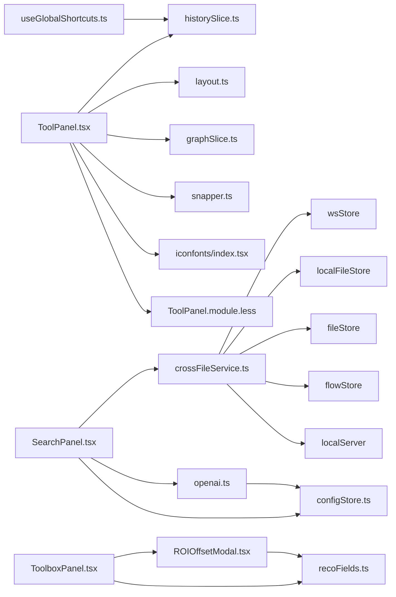

# 工具

<cite>
**本文引用的文件**
- [ToolPanel.tsx](file://src/components/panels/ToolPanel.tsx)
- [SearchPanel.tsx](file://src/components/panels/main/SearchPanel.tsx)
- [crossFileService.ts](file://src/services/crossFileService.ts)
- [useGlobalShortcuts.ts](file://src/hooks/useGlobalShortcuts.ts)
- [historySlice.ts](file://src/stores/flow/slices/historySlice.ts)
- [layout.ts](file://src/core/layout.ts)
- [snapper.ts](file://src/utils/snapper.ts)
- [graphSlice.ts](file://src/stores/flow/slices/graphSlice.ts)
- [openai.ts](file://src/utils/openai.ts)
- [configStore.ts](file://src/stores/configStore.ts)
- [ToolPanel.module.less](file://src/styles/ToolPanel.module.less)
- [index.tsx](file://src/components/iconfonts/index.tsx)
- [recoFields.ts](file://src/core/fields/recognition/fields.ts)
- [ROIOffsetModal.tsx](file://src/components/modals/ROIOffsetModal.tsx)
- [ToolboxPanel.tsx](file://src/components/panels/tools/ToolboxPanel.tsx)
- [工具.md](file://docsite/docs/01.指南/02.核心概念/60.工具.md)
</cite>

## 更新摘要
**已做更改**
- 更新搜索面板功能，增强跨文件搜索能力，支持文件路径显示和智能节点定位
- 改进AI搜索功能，使用OpenAIChat类进行智能节点定位
- 新增enableCrossFileSearch配置项，支持跨文件搜索开关
- 优化搜索面板UI，支持文件路径提示和智能跳转
- 增强节点搜索的用户体验，支持当前文件优先显示

## 目录
1. [简介](#简介)
2. [项目结构](#项目结构)
3. [核心组件](#核心组件)
4. [架构总览](#架构总览)
5. [组件详解](#组件详解)
6. [依赖关系分析](#依赖关系分析)
7. [性能考量](#性能考量)
8. [故障排查指南](#故障排查指南)
9. [结论](#结论)
10. [附录](#附录)

## 简介
本章节系统性说明工具栏提供的各项辅助功能，重点围绕 ToolPanel.tsx 中的三类工具面板：通用工具（全局）、节点模板（添加）、布局工具；以及与之配套的搜索面板 SearchPanel.tsx、撤销/重做历史机制（historySlice.ts）、全局快捷键（useGlobalShortcuts.ts）与布局算法（layout.ts）、截图导出（snapper.ts）。我们将解释每个图标按钮的功能、底层实现机制、如何提升编辑效率，并提供快捷键列表与自定义建议，辅以常见使用场景示例，帮助用户快速掌握操作技巧。本次更新重点新增了跨文件搜索能力、智能AI搜索功能和文件路径显示支持，显著提升了复杂流程图的编辑效率与准确性。

## 项目结构
工具栏相关代码主要分布在以下模块：
- 工具面板：ToolPanel.tsx（包含 Add/Global/Layout 三个子面板）
- 搜索面板：SearchPanel.tsx（支持跨文件搜索和AI智能搜索）
- 跨文件服务：crossFileService.ts（提供跨文件节点搜索、跳转、自动完成）
- 全局快捷键：useGlobalShortcuts.ts
- 历史状态管理：historySlice.ts
- 布局算法：layout.ts
- 节点移动与间距调整：graphSlice.ts
- 截图导出：snapper.ts
- AI聊天服务：openai.ts（支持系统提示词和历史记录管理）
- 配置存储：configStore.ts（包含enableCrossFileSearch配置）
- 识别字段配置：recoFields.ts
- ROI偏移测量工具：ROIOffsetModal.tsx
- 工具箱面板：ToolboxPanel.tsx
- 样式与图标：ToolPanel.module.less、iconfonts/index.tsx
- 文档说明：docsite/docs/01.指南/02.核心概念/60.工具.md

**图表来源**
- [ToolPanel.tsx](file://src/components/panels/ToolPanel.tsx#L1-L313)
- [SearchPanel.tsx](file://src/components/panels/main/SearchPanel.tsx#L1-L388)
- [crossFileService.ts](file://src/services/crossFileService.ts#L1-L589)
- [useGlobalShortcuts.ts](file://src/hooks/useGlobalShortcuts.ts#L1-L147)
- [historySlice.ts](file://src/stores/flow/slices/historySlice.ts#L1-L230)
- [layout.ts](file://src/core/layout.ts#L1-L103)
- [graphSlice.ts](file://src/stores/flow/slices/graphSlice.ts#L1-L160)
- [snapper.ts](file://src/utils/snapper.ts#L1-L87)
- [openai.ts](file://src/utils/openai.ts#L1-L394)
- [configStore.ts](file://src/stores/configStore.ts#L1-L228)
- [ROIOffsetModal.tsx](file://src/components/modals/ROIOffsetModal.tsx#L1-L935)
- [ToolboxPanel.tsx](file://src/components/panels/tools/ToolboxPanel.tsx#L1-L475)
- [index.tsx](file://src/components/iconfonts/index.tsx#L1-L283)
- [ToolPanel.module.less](file://src/styles/ToolPanel.module.less#L1-L131)

**章节来源**
- [ToolPanel.tsx](file://src/components/panels/ToolPanel.tsx#L1-L313)
- [SearchPanel.tsx](file://src/components/panels/main/SearchPanel.tsx#L1-L388)
- [crossFileService.ts](file://src/services/crossFileService.ts#L1-L589)
- [useGlobalShortcuts.ts](file://src/hooks/useGlobalShortcuts.ts#L1-L147)
- [historySlice.ts](file://src/stores/flow/slices/historySlice.ts#L1-L230)
- [layout.ts](file://src/core/layout.ts#L1-L103)
- [graphSlice.ts](file://src/stores/flow/slices/graphSlice.ts#L1-L160)
- [snapper.ts](file://src/utils/snapper.ts#L1-L87)
- [openai.ts](file://src/utils/openai.ts#L1-L394)
- [configStore.ts](file://src/stores/configStore.ts#L1-L228)
- [ROIOffsetModal.tsx](file://src/components/modals/ROIOffsetModal.tsx#L1-L935)
- [ToolboxPanel.tsx](file://src/components/panels/tools/ToolboxPanel.tsx#L1-L475)
- [工具.md](file://docsite/docs/01.指南/02.核心概念/60.工具.md#L1-L49)

## 核心组件
- 通用工具（全局面板）：设置、AI 历史、复制、粘贴、撤销、重做。支持禁用态与提示反馈，点击时触发对应 store 方法或历史状态查询。
- 节点模板（添加面板）：通过 nodeTemplates 读取模板列表，点击后调用 addNode 并可自动建立连接。
- 布局工具：居中对齐、顶部对齐、底部对齐、自动布局、保存为图片。新增节点间距缩放工具，支持水平和垂直方向的间距调整。
- **搜索面板**：普通搜索与 AI 智能搜索，支持防抖、自动完成、键盘回车定位、视图聚焦，**新增跨文件搜索能力**和**文件路径显示**。
- 全局快捷键：统一监听 Ctrl/Cmd+Z（撤销）、Ctrl/Cmd+Y 或 Ctrl+Shift+Z（重做），并在编辑态阻止默认行为。
- **跨文件搜索服务**：crossFileService 提供跨文件节点搜索、跳转、自动完成等功能，支持当前文件优先显示和文件路径解析。
- **AI聊天服务**：OpenAIChat 类支持系统提示词、历史记录管理和重试机制，用于智能节点定位。
- **配置管理**：configStore 包含 enableCrossFileSearch 配置项，支持跨文件搜索开关控制。

**章节来源**
- [ToolPanel.tsx](file://src/components/panels/ToolPanel.tsx#L60-L188)
- [ToolPanel.tsx](file://src/components/panels/ToolPanel.tsx#L190-L305)
- [SearchPanel.tsx](file://src/components/panels/main/SearchPanel.tsx#L1-L388)
- [crossFileService.ts](file://src/services/crossFileService.ts#L1-L589)
- [openai.ts](file://src/utils/openai.ts#L1-L394)
- [configStore.ts](file://src/stores/configStore.ts#L108-L109)
- [useGlobalShortcuts.ts](file://src/hooks/useGlobalShortcuts.ts#L1-L147)

## 架构总览
工具栏通过 Zustand Store 统一调度，历史状态由 historySlice.ts 管理，布局与截图由独立工具模块提供，搜索面板结合 store 数据与 UI 交互，全局快捷键在文档级别拦截键盘事件并转发到 store。**新增的跨文件搜索服务通过 crossFileService 提供统一的节点搜索接口，支持当前文件优先显示和文件路径解析。**

**图表来源**
- [SearchPanel.tsx](file://src/components/panels/main/SearchPanel.tsx#L42-L68)
- [crossFileService.ts](file://src/services/crossFileService.ts#L208-L269)
- [openai.ts](file://src/utils/openai.ts#L169-L243)
- [historySlice.ts](file://src/stores/flow/slices/historySlice.ts#L110-L188)
- [useGlobalShortcuts.ts](file://src/hooks/useGlobalShortcuts.ts#L57-L116)
- [layout.ts](file://src/core/layout.ts#L16-L68)
- [graphSlice.ts](file://src/stores/flow/slices/graphSlice.ts#L110-L157)
- [snapper.ts](file://src/utils/snapper.ts#L22-L87)

## 组件详解

### 通用工具（全局面板）
- 设置：打开配置面板。
- AI 对话历史：打开 AI 历史面板。
- 复制（Ctrl+C）：当存在选中节点时可用，将节点复制到剪贴板；否则提示"未选中节点"。
- 粘贴（Ctrl+V）：当剪贴板有节点时可用，执行粘贴；否则提示"粘贴板中无已复制节点"。
- 撤销（Ctrl+Z）：基于历史状态 canUndo 判断；成功时提示"撤销成功"，失败时提示"真的没有了😭"。点击按钮时会强制刷新以同步禁用态。
- 重做（Ctrl+Y 或 Ctrl+Shift+Z）：基于历史状态 canRedo 判断；成功时提示"重做成功"，失败时提示"真的没有了😭"。

**实现要点**
- 历史状态查询：通过 getHistoryState() 返回 canUndo/canRedo。
- 禁用态与提示：disabled 字段与 onDisabledClick 组合，确保用户获得明确反馈。
- 与全局快捷键联动：撤销/重做同时支持按钮与快捷键两种入口。

**章节来源**
- [ToolPanel.tsx](file://src/components/panels/ToolPanel.tsx#L87-L170)
- [historySlice.ts](file://src/stores/flow/slices/historySlice.ts#L221-L229)
- [useGlobalShortcuts.ts](file://src/hooks/useGlobalShortcuts.ts#L57-L116)

### 节点模板（添加面板）
- 通过 nodeTemplates 读取模板列表，渲染为图标按钮。
- 点击后调用 addNode，传入模板类型、数据、是否选中/聚焦/自动连接等参数。
- 与现有选中节点配合可自动建立"next"连接。

**章节来源**
- [ToolPanel.tsx](file://src/components/panels/ToolPanel.tsx#L17-L57)

### 布局工具
- 居中对齐：将多个选中节点的 x 坐标设置为最小 x，实现水平居中对齐。
- 顶部对齐：将多个选中节点的 y 坐标设置为最小 y，实现顶部对齐。
- 底部对齐：将多个选中节点的 y+height 设置为最大 y+height，实现底部对齐。
- 自动布局：基于 Dagre 算法，考虑节点尺寸与边关系，生成拓扑有序的布局。
- 保存为图片：根据选中节点或全部节点计算边界，生成 PNG 并下载，支持选中范围导出。
- 节点间距缩放：通过 `createShiftTool` 函数创建工具按钮，调用 `shiftNodes` 方法实现节点间距的动态调整。

**图表来源**
- [layout.ts](file://src/core/layout.ts#L16-L103)
- [graphSlice.ts](file://src/stores/flow/slices/graphSlice.ts#L110-L157)
- [ToolPanel.tsx](file://src/components/panels/ToolPanel.tsx#L206-L267)
- [snapper.ts](file://src/utils/snapper.ts#L22-L87)

**章节来源**
- [layout.ts](file://src/core/layout.ts#L16-L103)
- [graphSlice.ts](file://src/stores/flow/slices/graphSlice.ts#L110-L157)
- [ToolPanel.tsx](file://src/components/panels/ToolPanel.tsx#L206-L267)
- [snapper.ts](file://src/utils/snapper.ts#L22-L87)

### 节点间距缩放工具
#### 使用方法
在布局工具面板中，新增了四个用于调整节点间距的图标按钮：
- **增加水平间距**：点击后，选中的节点组（或全部节点）将在水平方向上根据其与最左侧节点的距离，按比例向外移动，从而增加整体水平间距。
- **缩减水平间距**：点击后，节点组将在水平方向上向最左侧节点靠拢，减少水平间距。
- **增加垂直间距**：点击后，选中的节点组（或全部节点）将在垂直方向上根据其与最上方节点的距离，按比例向下移动，从而增加整体垂直间距。
- **缩减垂直间距**：点击后，节点组将在垂直方向上向最上方节点靠拢，减少垂直间距。

当未选中任何节点时，操作将作用于画布上的所有节点。当选中两个及以上节点时，操作仅作用于选中的节点组。

#### 实现原理
节点间距缩放功能由 `ToolPanel.tsx` 中的 `createShiftTool` 工厂函数和 `graphSlice.ts` 中的 `shiftNodes` 方法共同实现。

1.  **`createShiftTool` 函数**：
    - 位于 `ToolPanel.tsx` 第 208-228 行。
    - 这是一个工厂函数，用于创建具有特定行为的布局工具对象。
    - 它接收 `label`（标签）、`iconName`（图标名）、`direction`（方向）和 `delta`（变化量）作为参数。
    - 其核心是 `onClick` 回调，该回调会调用 `shiftNodes` 方法，并传入 `direction`、`delta` 以及当前选中节点的 ID 列表（`targetIds`）。
    - 在 `layoutTools` 数组中，通过调用 `createShiftTool` 四次，分别创建了增加/缩减水平和垂直间距的四个工具实例。

2.  **`shiftNodes` 方法**：
    - 位于 `graphSlice.ts` 第 110-157 行。
    - 这是状态管理中的核心方法，负责实际的节点位置更新。
    - **确定目标节点**：根据传入的 `targetNodeIds` 参数，确定需要移动的节点集合。如果未传入 ID 列表，则默认操作所有节点。
    - **计算基准点**：找到目标节点集合中最左（水平方向）或最上（垂直方向）的节点位置，作为移动的基准点（`minPosition`）。
    - **按比例缩放**：对于每个目标节点，计算其当前位置与基准点的距离（`distanceFromBase`）。然后，根据这个距离与一个固定值（100）的比例（`scaleFactor`），计算出该节点的实际移动偏移量（`offset = scaleFactor * delta`）。距离基准点越远的节点，移动的幅度越大，从而实现了"缩放"效果，而非简单的整体平移。
    - **更新状态**：使用 Zustand 的 `set` 方法，批量更新所有目标节点的位置。
    - **保存历史**：调用 `saveHistory(0)` 立即保存当前状态到历史栈，确保用户可以撤销此操作。

此设计使得节点间距调整更加智能和直观，能够保持节点组的相对结构，同时均匀地扩大或缩小整体布局。

**章节来源**
- [ToolPanel.tsx](file://src/components/panels/ToolPanel.tsx#L208-L228)
- [graphSlice.ts](file://src/stores/flow/slices/graphSlice.ts#L110-L157)

### 搜索面板（SearchPanel.tsx）
**更新** 搜索面板现已支持跨文件搜索和智能AI搜索功能，显著提升了复杂流程图的编辑效率。

#### 跨文件搜索功能
- **普通搜索**：输入节点标签，支持防抖过滤与自动完成，回车或点击按钮定位节点并聚焦视图。**新增跨文件搜索能力**，支持当前文件优先显示和文件路径提示。
- **AI 智能搜索**：构建节点上下文（含识别/动作/其他参数），发送给 OpenAIChat，返回最匹配节点标签并定位。
- **文件路径显示**：搜索结果选项中显示文件路径提示，当前文件显示为"当前文件"，其他文件显示相对路径。
- **智能跳转**：支持直接跳转到其他文件的节点，自动处理文件切换和节点定位。

#### 搜索结果渲染
搜索面板现在支持更丰富的结果显示：
- **节点标签**：主显示节点名称
- **文件路径**：副显示文件路径信息
- **当前文件优先**：当前文件中的节点优先显示在搜索结果中
- **文件前缀支持**：支持带前缀的节点名搜索和显示

**图表来源**
- [SearchPanel.tsx](file://src/components/panels/main/SearchPanel.tsx#L42-L68)
- [crossFileService.ts](file://src/services/crossFileService.ts#L67-L200)
- [crossFileService.ts](file://src/services/crossFileService.ts#L208-L269)

**章节来源**
- [SearchPanel.tsx](file://src/components/panels/main/SearchPanel.tsx#L1-L388)
- [crossFileService.ts](file://src/services/crossFileService.ts#L1-L589)

### 跨文件搜索服务（crossFileService.ts）
**新增** 跨文件搜索服务提供了统一的节点搜索接口，支持当前文件优先显示和文件路径解析。

#### 核心功能
- **getAllNodes()**：获取所有可用节点列表，支持当前文件优先显示
- **searchNodes()**：模糊匹配搜索，支持类型过滤和限制返回数量
- **navigateToNode()**：跳转到指定节点，支持跨文件切换
- **parseNodeName()**：解析带前缀的节点名
- **getAutoCompleteOptions()**：获取自动完成选项

#### 智能排序规则
搜索结果按以下优先级排序：
1. **当前文件优先**：当前文件中的节点优先显示
2. **完全匹配优先**：与关键词完全相同的节点优先
3. **前缀匹配优先**：以关键词开头的节点其次
4. **包含匹配**：包含关键词的节点最后

#### 文件路径处理
- **本地文件**：显示相对路径，支持文件前缀解析
- **前端Tab文件**：显示文件名，支持文件前缀设置
- **未加载文件**：通过LocalBridge加载后显示

**章节来源**
- [crossFileService.ts](file://src/services/crossFileService.ts#L1-L589)

### AI聊天服务（openai.ts）
**更新** AI聊天服务现在支持系统提示词和历史记录管理，用于智能节点定位。

#### OpenAIChat 类功能
- **系统提示词**：支持自定义系统提示词，指导AI理解节点上下文
- **历史记录管理**：维护对话历史，支持历史记录上限控制
- **重试机制**：支持配置重试次数和间隔时间
- **流式响应**：支持流式响应处理
- **配置验证**：自动校验API配置完整性

#### AI搜索提示词构建
AI搜索时构建详细的节点上下文：
- **节点类型说明**：pipeline=流程节点，external=外部节点，anchor=锚点节点
- **Pipeline节点详情**：识别方式（type和param）、动作方式（type和param）、其他配置参数
- **常见字段说明**：template（模板图片）、threshold（阈值）、roi（识别区域）、expected（期望文本）、target（目标位置）、input_text（输入文本）、package（应用包名）等

**章节来源**
- [openai.ts](file://src/utils/openai.ts#L1-L394)

### 全局快捷键（useGlobalShortcuts.ts）
- 撤销：Ctrl/Cmd+Z，阻止默认行为，调用 undo()，成功提示"撤销成功"，否则提示"真的没有了😭"。
- 重做：Ctrl/Cmd+Y 或 Ctrl+Shift+Z，阻止默认行为，调用 redo()，成功提示"重做成功"，否则提示"真的没有了😭"。
- 删除键重定向：Delete 键被重定向为 Backspace，确保在编辑区中触发预期删除行为。

**章节来源**
- [useGlobalShortcuts.ts](file://src/hooks/useGlobalShortcuts.ts#L1-L147)

### 撤销/重做历史机制（historySlice.ts）
- 快照策略：定期（默认 500ms）序列化节点与边，差异检测后入栈，限制栈大小为 100。
- 撤销/重做：索引向前/向后移动，替换节点与边（不保存历史），清空选中状态，更新 lastSnapshot。
- 历史状态查询：返回 canUndo/canRedo，供 UI 控制禁用态。

**图表来源**
- [historySlice.ts](file://src/stores/flow/slices/historySlice.ts#L50-L108)
- [historySlice.ts](file://src/stores/flow/slices/historySlice.ts#L110-L188)
- [historySlice.ts](file://src/stores/flow/slices/historySlice.ts#L221-L229)

**章节来源**
- [historySlice.ts](file://src/stores/flow/slices/historySlice.ts#L1-L230)

### ROI偏移工具
#### 使用方法
在工具箱面板（ToolboxPanel）中，新增了"偏移测量"工具（图标为 `icon-celiang1`）。点击该工具后，会弹出"ROI 偏移计算工具"模态框。

1.  **选择原ROI**：在模态框左侧的截图上，切换到"原 ROI"绘制模式，框选或手动输入当前节点的 `roi` 区域。
2.  **选择期望ROI**：切换到"期望 ROI"绘制模式，框选或手动输入目标设备或场景下的对应区域。
3.  **计算偏移**：系统会自动计算两个ROI之间的偏移量 `[Δx, Δy, Δw, Δh]`，并在右侧"计算结果"区域显示。
4.  **应用结果**：点击"应用偏移"按钮，偏移量将被复制到剪贴板，可直接粘贴到节点的 `roi_offset` 字段中。

此工具极大简化了跨设备或跨分辨率场景下ROI适配的繁琐计算过程。

#### 实现原理
ROI偏移工具由 `ToolboxPanel.tsx` 和 `ROIOffsetModal.tsx` 两个组件协同实现。

1.  **`ToolboxPanel.tsx`**：
    - 位于 `src/components/panels/tools/ToolboxPanel.tsx`。
    - 定义了工具列表 `TOOLBOX_TOOLS`，其中包含 `modalType: "roi_offset"` 的工具项。
    - 通过 `openTool` 函数监听点击事件，当 `modalType` 为 `"roi_offset"` 时，将 `roiOffsetModalOpen` 状态设置为 `true`，从而显示 `ROIOffsetModal`。
    - 接收 `ROIOffsetModal` 通过 `onConfirm` 回调返回的偏移量，并通过 `handleROIOffsetConfirm` 更新 `lastResult` 状态，供用户复制。

2.  **`ROIOffsetModal.tsx`**：
    - 位于 `src/components/modals/ROIOffsetModal.tsx`。
    - 核心功能是 `calculateOffset` 函数，它接收 `sourceRect`（原ROI）和 `targetRect`（期望ROI）两个矩形对象，计算并返回 `[Δx, Δy, Δw, Δh]`。
    - 提供了直观的Canvas画布，用户可以直接在截图上框选区域，支持平移、缩放。
    - 提供了"交换"、"复制到原ROI"、"使用节点ROI"等便捷操作，提升用户体验。
    - 结果可直接复制为值或键值对格式。

**章节来源**
- [ToolboxPanel.tsx](file://src/components/panels/tools/ToolboxPanel.tsx#L56-L61)
- [ToolboxPanel.tsx](file://src/components/panels/tools/ToolboxPanel.tsx#L127-L129)
- [ToolboxPanel.tsx](file://src/components/panels/tools/ToolboxPanel.tsx#L178-L182)
- [ROIOffsetModal.tsx](file://src/components/modals/ROIOffsetModal.tsx#L50-L63)
- [ROIOffsetModal.tsx](file://src/components/modals/ROIOffsetModal.tsx#L392-L452)

### 组合识别（And/Or）
#### 功能说明
在识别字段配置中，新增了 `And` 和 `Or` 两种组合识别类型，用于处理更复杂的识别逻辑。

- **And（逻辑与）**：配置在 `recoFields.And` 中。它包含一个 `allOf` 字段，需要配置多个子识别。只有当所有子识别都成功命中时，整个 `And` 识别才算成功。适用于需要同时满足多个条件的场景，例如"同时看到A图标和B文字"。
- **Or（逻辑或）**：配置在 `recoFields.Or` 中。它包含一个 `anyOf` 字段，同样需要配置多个子识别。只要其中任意一个子识别成功命中，整个 `Or` 识别就算成功，后续的子识别将不再执行。适用于多状态或任一条件满足即可的场景，例如"看到A、B、C中任意一个图标"。

#### 应用场景
- **And**：用于精确匹配，确保环境完全符合预期。例如，在一个复杂的界面中，需要同时识别到"确认按钮"和"倒计时数字"都存在时才进行点击。
- **Or**：用于状态兼容，提高流程的鲁棒性。例如，在一个任务节点中，可能因为网络延迟等原因出现"加载中"、"任务完成"、"奖励领取"等多个状态，使用 `Or` 可以让流程在任意一个状态出现时都继续执行。

**章节来源**
- [recoFields.ts](file://src/core/fields/recognition/fields.ts#L75-L85)

## 依赖关系分析
- ToolPanel.tsx 依赖：
  - Zustand 流图 store（节点/边/选择/视口/历史）
  - ClipboardStore（复制/粘贴）
  - ConfigStore（打开设置）
  - FileStore（文件名）
  - LayoutHelper（对齐/自动布局）
  - snapper（截图导出）
  - IconFont（图标渲染）
  - ToolPanel.module.less（样式）
  - **graphSlice.ts**（`shiftNodes` 方法用于间距调整）
- SearchPanel.tsx 依赖：
  - FlowStore（节点列表/实例）
  - **crossFileService.ts**（跨文件搜索）
  - **OpenAIChat**（AI 搜索）
  - AutoComplete/Antd（输入与提示）
  - **configStore.ts**（enableCrossFileSearch 配置）
- crossFileService.ts 依赖：
  - **wsStore**（WebSocket 连接状态）
  - **localFileStore**（本地文件信息）
  - **fileStore**（文件管理）
  - **flowStore**（节点数据）
  - **localServer**（本地服务通信）
  - **NodeTypeEnum**（节点类型枚举）
- openai.ts 依赖：
  - **configStore**（AI配置）
  - **aiHistoryManager**（历史记录管理）
  - **fetch API**（HTTP请求）
- useGlobalShortcuts.ts 依赖：
  - FlowStore（undo/redo）
  - Antd message（提示）
- historySlice.ts 依赖：
  - FlowStore 类型与 replace 接口
  - 结构化克隆/JSON 克隆降级
- layout.ts 依赖：
  - @dagrejs/dagre（自动布局）
  - FlowStore（读取/写入节点）
- graphSlice.ts 依赖：
  - Zustand StateCreator
  - lodash cloneDeep
  - FlowStore 类型与 viewportUtils
- snapper.ts 依赖：
  - html-to-image（截图）
  - @xyflow/react（边界与视口）
- **ToolboxPanel.tsx 依赖**：
  - **ROIOffsetModal.tsx**（提供偏移测量功能）
  - **recoFields.ts**（识别类型定义）
  - **useMFWStore**（检查连接状态）
  - **Antd 组件**（UI）
- **ROIOffsetModal.tsx 依赖**：
  - **ScreenshotModalBase.tsx**（基础模态框）
  - **Antd 组件**（UI）
  - **React Canvas API**（绘图）

**图表来源**
- [ToolPanel.tsx](file://src/components/panels/ToolPanel.tsx#L1-L313)
- [SearchPanel.tsx](file://src/components/panels/main/SearchPanel.tsx#L1-L388)
- [crossFileService.ts](file://src/services/crossFileService.ts#L1-L589)
- [openai.ts](file://src/utils/openai.ts#L1-L394)
- [configStore.ts](file://src/stores/configStore.ts#L1-L228)
- [useGlobalShortcuts.ts](file://src/hooks/useGlobalShortcuts.ts#L1-L147)
- [historySlice.ts](file://src/stores/flow/slices/historySlice.ts#L1-L230)
- [layout.ts](file://src/core/layout.ts#L1-L103)
- [graphSlice.ts](file://src/stores/flow/slices/graphSlice.ts#L1-L160)
- [snapper.ts](file://src/utils/snapper.ts#L1-L87)
- [index.tsx](file://src/components/iconfonts/index.tsx#L1-L283)
- [ToolPanel.module.less](file://src/styles/ToolPanel.module.less#L1-L131)
- [ToolboxPanel.tsx](file://src/components/panels/tools/ToolboxPanel.tsx#L1-L475)
- [ROIOffsetModal.tsx](file://src/components/modals/ROIOffsetModal.tsx#L1-L935)
- [recoFields.ts](file://src/core/fields/recognition/fields.ts#L1-L113)

## 性能考量
- 历史快照节流：默认 500ms 防抖，避免频繁序列化与入栈导致卡顿。
- 差异检测：仅在状态变化时入栈，减少无效历史记录。
- 自动布局：Dagre 计算在下一帧执行，避免阻塞主线程；节点未测量时延时重试，确保尺寸准确。
- **搜索防抖**：输入防抖 300ms，降低跨文件搜索开销。
- **跨文件搜索优化**：使用防抖和智能排序，避免频繁的文件扫描。
- **AI搜索优化**：使用OpenAIChat类，支持系统提示词缓存和历史记录管理。
- 图片导出：计算边界与视口变换，按需缩放，避免过大图像内存占用。
- 间距调整：`shiftNodes` 方法使用批量更新和比例计算，确保操作流畅。
- ROI偏移计算：计算过程简单，仅涉及基本的算术运算，性能开销极低。

**章节来源**
- [historySlice.ts](file://src/stores/flow/slices/historySlice.ts#L50-L108)
- [layout.ts](file://src/core/layout.ts#L16-L68)
- [SearchPanel.tsx](file://src/components/panels/main/SearchPanel.tsx#L42-L68)
- [crossFileService.ts](file://src/services/crossFileService.ts#L208-L269)
- [openai.ts](file://src/utils/openai.ts#L169-L243)
- [snapper.ts](file://src/utils/snapper.ts#L22-L87)
- [graphSlice.ts](file://src/stores/flow/slices/graphSlice.ts#L110-L157)
- [ROIOffsetModal.tsx](file://src/components/modals/ROIOffsetModal.tsx#L50-L63)

## 故障排查指南
- 撤销/重做不可用
  - 检查历史状态：canUndo/canRedo 是否为真。
  - 若刚执行过操作，确认保存历史的 500ms 防抖是否触发。
- 复制/粘贴无反应
  - 确认是否存在选中节点或剪贴板是否有内容。
  - 粘贴时检查剪贴板内容格式是否正确。
- 对齐/自动布局无效
  - 对齐：至少选择两个节点。
  - 自动布局：确保节点尺寸已测量；若未测量，稍后重试。
- 保存为图片失败
  - 检查画布元素是否存在；确认选中节点或全部节点非空。
- **跨文件搜索失败**
  - 确认LocalBridge连接状态是否正常。
  - 检查enableCrossFileSearch配置是否启用。
  - 确认目标文件是否已加载到前端。
- **AI搜索失败**
  - 确认AI API配置是否完整（URL、Key、Model）。
  - 检查网络连通性和API访问权限。
  - 查看AI历史记录面板获取详细错误信息。
- 快捷键无效
  - 确认当前焦点不在输入框；Delete 键会被重定向为 Backspace。
- 节点间距缩放无效
  - 确认画布上存在节点。
  - 如果选中了节点，确认选中数量是否大于等于2。
  - 检查控制台是否有报错信息。
- **ROI偏移工具无法打开**
  - 确认本地服务与设备已连接。
  - 检查 `ToolboxPanel.tsx` 中 `roiOffsetModalOpen` 状态是否正确更新。
- **ROI偏移计算结果为[0,0,0,0]**
  - 确认已正确框选了"原ROI"和"期望ROI"两个区域。
  - 检查 `ROIOffsetModal.tsx` 中 `sourceRect` 和 `targetRect` 是否为空。
- **And/Or 识别不工作**
  - 检查 `allOf` 或 `anyOf` 字段内是否配置了有效的子识别。
  - 对于 `And`，确保所有子识别都能独立成功。
  - 对于 `Or`，确保至少有一个子识别能成功。

**章节来源**
- [ToolPanel.tsx](file://src/components/panels/ToolPanel.tsx#L100-L170)
- [ToolPanel.tsx](file://src/components/panels/ToolPanel.tsx#L206-L267)
- [useGlobalShortcuts.ts](file://src/hooks/useGlobalShortcuts.ts#L1-L147)
- [snapper.ts](file://src/utils/snapper.ts#L22-L87)
- [SearchPanel.tsx](file://src/components/panels/main/SearchPanel.tsx#L131-L146)
- [crossFileService.ts](file://src/services/crossFileService.ts#L58-L60)
- [openai.ts](file://src/utils/openai.ts#L170-L181)
- [graphSlice.ts](file://src/stores/flow/slices/graphSlice.ts#L110-L157)
- [ToolboxPanel.tsx](file://src/components/panels/tools/ToolboxPanel.tsx#L102-L106)
- [ROIOffsetModal.tsx](file://src/components/modals/ROIOffsetModal.tsx#L368-L375)
- [recoFields.ts](file://src/core/fields/recognition/fields.ts#L75-L85)

## 结论
工具栏通过"通用工具 + 节点模板 + 布局工具"的组合，覆盖了复制粘贴、撤销重做、节点对齐与自动布局、**跨文件搜索与 AI 辅助定位**、全局快捷键与截图导出等高频场景。本次更新新增的跨文件搜索能力，通过 crossFileService 提供统一的节点搜索接口，支持当前文件优先显示和文件路径解析，显著提升了复杂流程图的编辑效率与准确性。AI搜索功能使用 OpenAIChat 类，支持系统提示词和历史记录管理，能够根据节点的识别内容、动作内容、配置参数等维度综合判断最匹配的节点。历史状态采用差异检测与节流策略，兼顾性能与可靠性；布局与截图分别由独立模块提供，职责清晰、扩展性强。配合搜索面板与快捷键，能够显著提升复杂流程图的编辑效率与准确性。此外，新增的ROI偏移工具和组合识别（And/Or）功能，极大地增强了工具集在复杂场景下的适应能力和处理能力，为用户提供了一套更强大、更智能的自动化编辑解决方案。

## 附录

### 快捷键一览
- 撤销：Ctrl/Cmd+Z
- 重做：Ctrl/Cmd+Y 或 Ctrl+Shift+Z
- 删除键重定向：Delete → Backspace（在编辑区内）

**章节来源**
- [useGlobalShortcuts.ts](file://src/hooks/useGlobalShortcuts.ts#L57-L116)

### 配置项说明
**新增** enableCrossFileSearch 配置项，用于控制跨文件搜索功能的启用状态。

- **位置**：configStore.ts 中的 configs 对象
- **默认值**：true（启用跨文件搜索）
- **作用域**：影响 SearchPanel 的搜索行为
- **使用场景**：在大型项目中，当不需要跨文件搜索时可关闭以提升性能

**章节来源**
- [configStore.ts](file://src/stores/configStore.ts#L108-L109)

### 常见使用场景示例
- **通过跨文件搜索快速定位节点**
  - 在搜索面板输入节点标签，回车或点击搜索按钮即可定位并聚焦视图。
  - **新增**：搜索结果中显示文件路径，当前文件显示为"当前文件"，其他文件显示相对路径。
  - 可使用 AI 智能搜索，根据节点识别/动作/参数描述返回最匹配节点。
- 利用撤销功能修复误操作
  - 执行错误操作后立即使用 Ctrl+Z 撤销；若已撤销过多，使用 Ctrl+Y 重做。
- 快速对齐与导出
  - 选中多个节点后使用"居中/顶部/底部对齐"快速整理布局。
  - 使用"自动布局"一键生成拓扑清晰的排列。
  - 使用"增加/缩减水平/垂直间距"工具，精细调整节点组的疏密程度。
  - 使用"保存为图片"导出当前视图，支持仅导出选中节点或全部节点。
- **使用ROI偏移工具进行跨设备适配**
  - 在新设备上打开"偏移测量"工具，框选原设备上的ROI和新设备上的对应ROI。
  - 点击"应用偏移"，将计算出的 `roi_offset` 值复制到节点配置中，即可完成适配。
- **使用组合识别处理复杂逻辑**
  - 对于需要同时满足多个条件的场景，使用 `And` 识别类型，配置所有必需的子识别。
  - 对于存在多种可能状态的场景，使用 `Or` 识别类型，配置所有可能的子识别，提高流程的鲁棒性。

**章节来源**
- [SearchPanel.tsx](file://src/components/panels/main/SearchPanel.tsx#L58-L65)
- [crossFileService.ts](file://src/services/crossFileService.ts#L247-L266)
- [ToolPanel.tsx](file://src/components/panels/ToolPanel.tsx#L120-L170)
- [ToolPanel.tsx](file://src/components/panels/ToolPanel.tsx#L206-L267)
- [ToolPanel.module.less](file://src/styles/ToolPanel.module.less#L76-L120)
- [工具.md](file://docsite/docs/01.指南/02.核心概念/60.工具.md#L1-L49)
- [ToolboxPanel.tsx](file://src/components/panels/tools/ToolboxPanel.tsx#L56-L61)
- [recoFields.ts](file://src/core/fields/recognition/fields.ts#L75-L85)