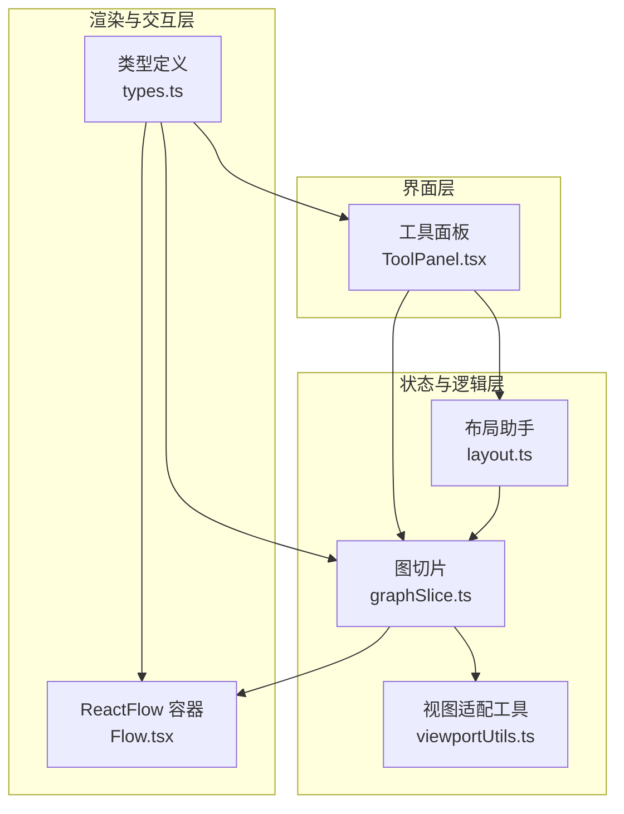
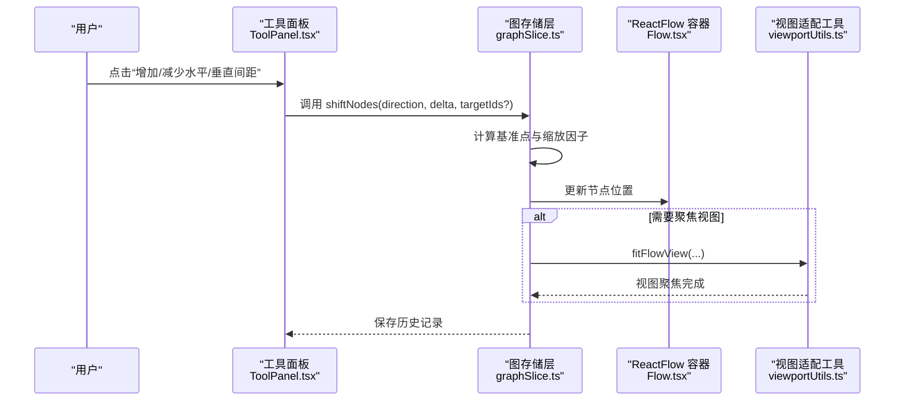
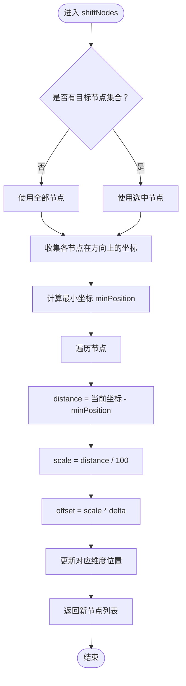
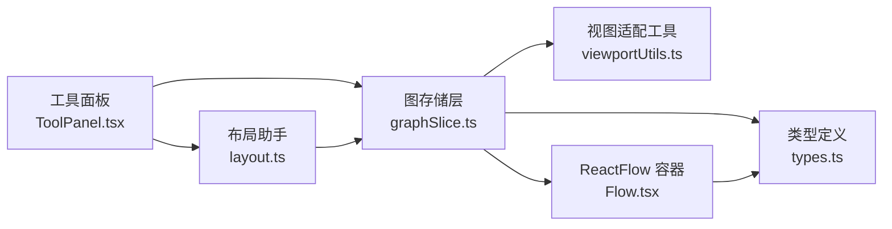

# 节点间距缩放工具

<cite>
**本文引用的文件**
- [ToolPanel.tsx](file://src/components/panels/ToolPanel.tsx)
- [graphSlice.ts](file://src/stores/flow/slices/graphSlice.ts)
- [viewportUtils.ts](file://src/stores/flow/utils/viewportUtils.ts)
- [layout.ts](file://src/core/layout.ts)
- [Flow.tsx](file://src/components/Flow.tsx)
- [types.ts](file://src/stores/flow/types.ts)
- [constants.ts](file://src/components/flow/nodes/constants.ts)
- [nodeTemplates.ts](file://src/data/nodeTemplates.ts)
</cite>

## 目录
1. [简介](#简介)
2. [项目结构](#项目结构)
3. [核心组件](#核心组件)
4. [架构总览](#架构总览)
5. [详细组件分析](#详细组件分析)
6. [依赖关系分析](#依赖关系分析)
7. [性能考量](#性能考量)
8. [故障排查指南](#故障排查指南)
9. [结论](#结论)
10. [附录](#附录)

## 简介
本文件围绕“节点间距缩放工具”展开，系统性梳理该功能在编辑器中的实现路径、交互方式、数据流与性能特征，并提供可视化图示帮助读者快速理解。该工具允许用户通过工具栏按钮对所选节点或全部节点进行水平/垂直方向的间距调整，形成更清晰、更易读的流程图布局。

## 项目结构
与“节点间距缩放工具”直接相关的模块分布如下：
- 工具栏入口：位于工具面板，包含“缩减/增加水平间距”“缩减/增加垂直间距”等按钮
- 业务逻辑：由图存储层的节点位移方法负责具体计算与更新
- 视图适配：在批量粘贴、替换等场景下，会触发视图聚焦以保证可视范围合理
- 布局辅助：提供对齐与自动布局能力，便于与间距调整协同使用

图表来源
- [ToolPanel.tsx](file://src/components/panels/ToolPanel.tsx#L205-L314)
- [graphSlice.ts](file://src/stores/flow/slices/graphSlice.ts#L110-L159)
- [layout.ts](file://src/core/layout.ts#L1-L103)
- [viewportUtils.ts](file://src/stores/flow/utils/viewportUtils.ts#L1-L37)
- [Flow.tsx](file://src/components/Flow.tsx#L180-L320)
- [types.ts](file://src/stores/flow/types.ts#L1-L268)

章节来源
- [ToolPanel.tsx](file://src/components/panels/ToolPanel.tsx#L205-L314)
- [graphSlice.ts](file://src/stores/flow/slices/graphSlice.ts#L110-L159)
- [layout.ts](file://src/core/layout.ts#L1-L103)
- [viewportUtils.ts](file://src/stores/flow/utils/viewportUtils.ts#L1-L37)
- [Flow.tsx](file://src/components/Flow.tsx#L180-L320)
- [types.ts](file://src/stores/flow/types.ts#L1-L268)

## 核心组件
- 工具面板中的“间距调整”按钮：根据当前选中节点数量决定可用性，并调用图存储层的位移方法
- 图存储层的位移方法：基于目标节点集合与方向，计算偏移量并更新节点位置
- 视图适配：在批量粘贴/替换后自动聚焦视图，确保新节点可见
- 布局辅助：提供对齐与自动布局，便于与间距调整配合使用

章节来源
- [ToolPanel.tsx](file://src/components/panels/ToolPanel.tsx#L205-L314)
- [graphSlice.ts](file://src/stores/flow/slices/graphSlice.ts#L110-L159)
- [viewportUtils.ts](file://src/stores/flow/utils/viewportUtils.ts#L1-L37)
- [layout.ts](file://src/core/layout.ts#L1-L103)

## 架构总览
“节点间距缩放工具”的调用链路如下：工具面板触发 -> 图存储层计算 -> ReactFlow 更新 -> 视图适配（必要时）。

图表来源
- [ToolPanel.tsx](file://src/components/panels/ToolPanel.tsx#L205-L314)
- [graphSlice.ts](file://src/stores/flow/slices/graphSlice.ts#L110-L159)
- [viewportUtils.ts](file://src/stores/flow/utils/viewportUtils.ts#L1-L37)
- [Flow.tsx](file://src/components/Flow.tsx#L180-L320)

## 详细组件分析

### 工具面板入口与交互
- 工具按钮：提供“缩减/增加水平间距”“缩减/增加垂直间距”，分别对应水平与垂直方向的位移
- 可用性判断：当至少选中两个节点时，按钮可用；否则仅当存在任意节点时可用
- 调用路径：点击后根据是否选中多个节点决定目标节点集合，随后调用图存储层的位移方法

章节来源
- [ToolPanel.tsx](file://src/components/panels/ToolPanel.tsx#L205-L314)

### 图存储层位移算法
- 输入参数：方向（horizontal/vertical）、步长（delta）、目标节点ID集合（可选）
- 基准点策略：以目标节点在方向上的最小坐标为基准
- 缩放因子：节点在方向上距离基准点的距离除以固定分母（此处为100），得到缩放系数
- 偏移量：缩放系数乘以步长，加到原位置对应维度上
- 结果：返回新的节点位置集合，供状态层更新

图表来源
- [graphSlice.ts](file://src/stores/flow/slices/graphSlice.ts#L110-L159)

章节来源
- [graphSlice.ts](file://src/stores/flow/slices/graphSlice.ts#L110-L159)

### 视图适配与聚焦
- 在批量粘贴/替换后，会调用视图适配函数以确保新节点在可视范围内
- 适配函数支持可选的聚焦节点集、插值方式、动画时长以及缩放限制

章节来源
- [graphSlice.ts](file://src/stores/flow/slices/graphSlice.ts#L16-L44)
- [viewportUtils.ts](file://src/stores/flow/utils/viewportUtils.ts#L1-L37)

### 布局辅助与协作
- 对齐：支持“居中对齐”“顶部对齐”“底部对齐”，用于快速整理节点位置
- 自动布局：基于有向无环图的布局算法，结合节点测量尺寸进行全局排布
- 与间距调整的协作：先使用对齐/自动布局获得较佳初始布局，再通过间距调整微调细节

章节来源
- [layout.ts](file://src/core/layout.ts#L1-L103)

### ReactFlow 容器与类型支撑
- 容器负责渲染节点、边与背景，提供默认视口、缩放范围与交互行为
- 类型定义涵盖节点、边、视口、选择状态等，保障位移与更新的类型安全

章节来源
- [Flow.tsx](file://src/components/Flow.tsx#L180-L320)
- [types.ts](file://src/stores/flow/types.ts#L1-L268)

## 依赖关系分析
- 工具面板依赖图存储层的位移方法与文件存储状态
- 图存储层依赖视图适配工具与类型定义
- ReactFlow 容器依赖节点/边类型与工具面板提供的交互入口
- 布局助手独立于位移方法，但与图存储层共享节点集合

图表来源
- [ToolPanel.tsx](file://src/components/panels/ToolPanel.tsx#L205-L314)
- [graphSlice.ts](file://src/stores/flow/slices/graphSlice.ts#L110-L159)
- [layout.ts](file://src/core/layout.ts#L1-L103)
- [viewportUtils.ts](file://src/stores/flow/utils/viewportUtils.ts#L1-L37)
- [Flow.tsx](file://src/components/Flow.tsx#L180-L320)
- [types.ts](file://src/stores/flow/types.ts#L1-L268)

章节来源
- [ToolPanel.tsx](file://src/components/panels/ToolPanel.tsx#L205-L314)
- [graphSlice.ts](file://src/stores/flow/slices/graphSlice.ts#L110-L159)
- [layout.ts](file://src/core/layout.ts#L1-L103)
- [viewportUtils.ts](file://src/stores/flow/utils/viewportUtils.ts#L1-L37)
- [Flow.tsx](file://src/components/Flow.tsx#L180-L320)
- [types.ts](file://src/stores/flow/types.ts#L1-L268)

## 性能考量
- 位移计算复杂度：对每个目标节点进行一次常数时间的坐标计算，整体为 O(n)
- 视图适配：在批量粘贴/替换后触发，避免频繁调用导致卡顿
- 自动布局：依赖布局算法，建议在节点较多时谨慎使用，或在空闲时机触发
- 交互反馈：工具按钮禁用态提示与消息提示，减少无效操作带来的状态更新

[本节为通用性能讨论，不直接分析具体文件]

## 故障排查指南
- 无法点击间距按钮
  - 检查是否至少选中两个节点，或是否存在任意节点
  - 若均不满足，按钮处于禁用态属预期行为
- 节点位移无效
  - 确认传入的目标节点集合是否正确（全量或选中集合）
  - 检查方向与步长参数是否符合预期
- 视图未聚焦
  - 在批量粘贴/替换后，确认视图适配函数被调用
  - 检查实例与视口状态是否有效

章节来源
- [ToolPanel.tsx](file://src/components/panels/ToolPanel.tsx#L205-L314)
- [graphSlice.ts](file://src/stores/flow/slices/graphSlice.ts#L16-L44)
- [viewportUtils.ts](file://src/stores/flow/utils/viewportUtils.ts#L1-L37)

## 结论
“节点间距缩放工具”通过工具面板入口与图存储层位移方法的协作，实现了对节点间距的精细化控制。其设计遵循“低耦合、高内聚”的原则：工具面板只负责交互与参数传递，位移算法专注于坐标计算，视图适配在需要时提供辅助。配合对齐与自动布局，用户可以高效地构建清晰、美观的流程图。

[本节为总结性内容，不直接分析具体文件]

## 附录
- 节点类型与句柄类型定义：为工具与布局提供一致的节点语义
- 节点模板：用于快速创建不同类型的节点，便于测试间距缩放效果

章节来源
- [constants.ts](file://src/components/flow/nodes/constants.ts#L1-L14)
- [nodeTemplates.ts](file://src/data/nodeTemplates.ts#L1-L94)