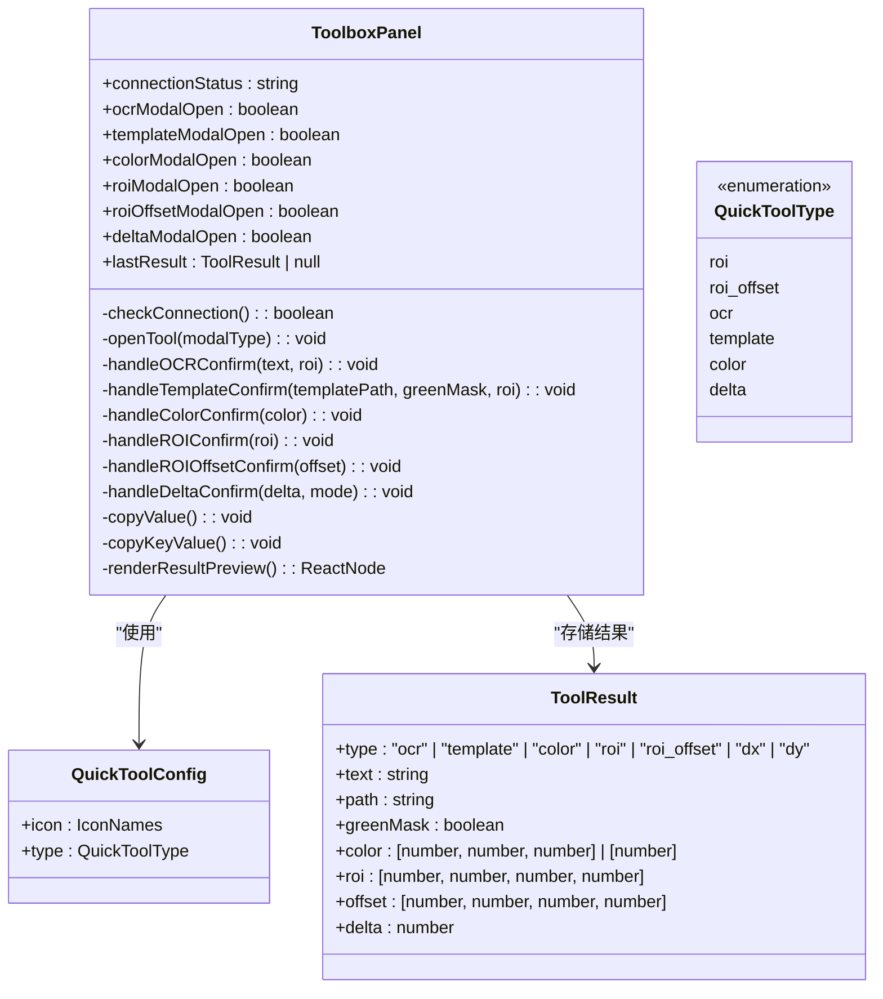
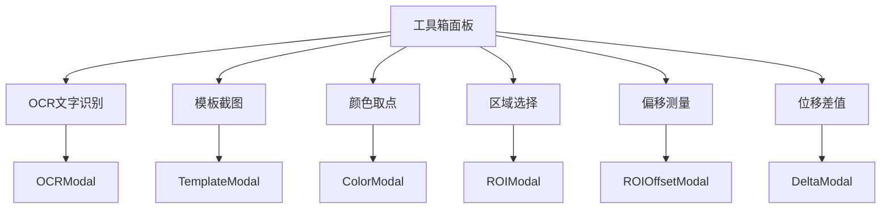
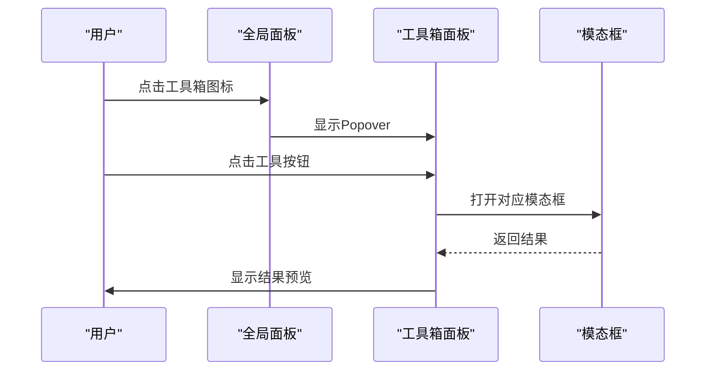
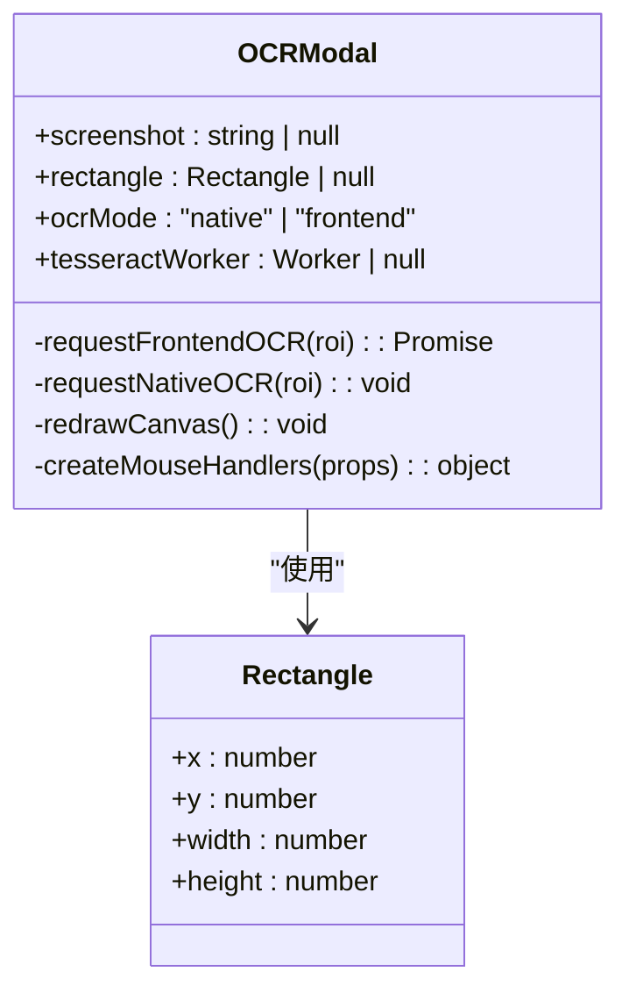
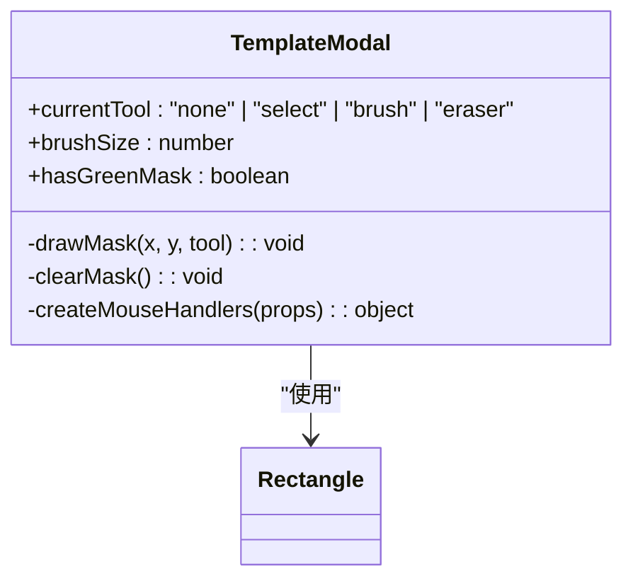
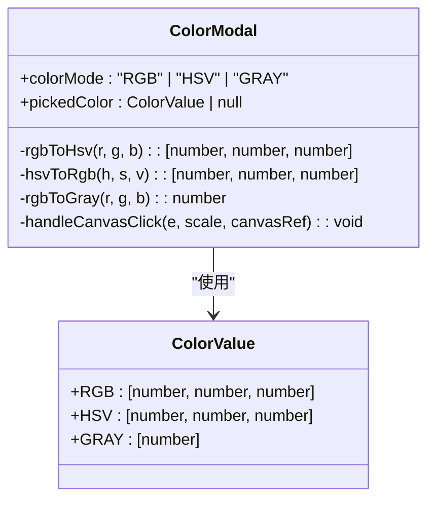
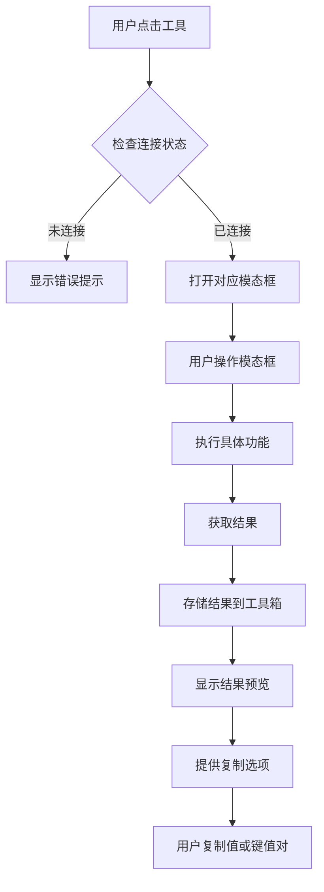

# 工具箱面板

<cite>
**本文档引用的文件**   
- [ToolboxPanel.tsx](file://src/components/panels/tools/ToolboxPanel.tsx)
- [ParamFieldListElem.tsx](file://src/components/panels/field/items/ParamFieldListElem.tsx)
- [GlobalPanel.tsx](file://src/components/panels/tools/GlobalPanel.tsx)
- [ToolPanel.tsx](file://src/components/panels/tools/ToolPanel.tsx)
- [toolbarStore.ts](file://src/stores/toolbarStore.ts)
- [OCRModal.tsx](file://src/components/modals/OCRModal.tsx)
- [TemplateModal.tsx](file://src/components/modals/TemplateModal.tsx)
- [ColorModal.tsx](file://src/components/modals/ColorModal.tsx)
- [ROIModal.tsx](file://src/components/modals/ROIModal.tsx)
- [ROIOffsetModal.tsx](file://src/components/modals/ROIOffsetModal.tsx)
- [DeltaModal.tsx](file://src/components/modals/DeltaModal.tsx)
- [ToolboxPanel.module.less](file://src/styles/ToolboxPanel.module.less)
- [FieldPanel.module.less](file://src/styles/FieldPanel.module.less)
</cite>

## 更新摘要
**所做更改**   
- 新增了工具箱面板与字段面板工具栏深度整合的章节
- 更新了快捷工具系统重构后的 QuickToolConfig 接口说明
- 增加了新的工具分类体系和字段级别的工具集成
- 完善了工具交互流程和状态管理机制

## 目录
1. [简介](#简介)
2. [工具箱面板结构](#工具箱面板结构)
3. [快捷工具系统重构](#快捷工具系统重构)
4. [核心工具功能](#核心工具功能)
5. [工具箱面板样式](#工具箱面板样式)
6. [全局工具面板集成](#全局工具面板集成)
7. [模态框组件分析](#模态框组件分析)
8. [工具交互流程](#工具交互流程)

## 简介
工具箱面板是MaaPipelineEditor中的核心工具集，提供了一系列用于图像识别和坐标测量的实用工具。该面板通过集成多种模态框组件，为用户提供了一个直观、高效的工具操作界面，支持OCR文字识别、模板截图、颜色取点、区域选择等多种功能。

**更新** 工具箱面板现已与字段面板工具栏深度整合，通过新的 QuickToolConfig 接口和分类体系，提供更精确的工具选择和处理能力。

**Section sources**
- [ToolboxPanel.tsx](file://src/components/panels/tools/ToolboxPanel.tsx)
- [ParamFieldListElem.tsx](file://src/components/panels/field/items/ParamFieldListElem.tsx)

## 工具箱面板结构
工具箱面板采用模块化设计，主要由工具按钮区域和结果预览区域组成。面板通过React组件实现，使用Ant Design UI库进行界面构建。



**Diagram sources**
- [ToolboxPanel.tsx](file://src/components/panels/tools/ToolboxPanel.tsx)
- [ParamFieldListElem.tsx](file://src/components/panels/field/items/ParamFieldListElem.tsx)

**Section sources**
- [ToolboxPanel.tsx](file://src/components/panels/tools/ToolboxPanel.tsx)
- [ParamFieldListElem.tsx](file://src/components/panels/field/items/ParamFieldListElem.tsx)

## 快捷工具系统重构
**更新** 工具箱面板已完成快捷工具系统的重构，引入了全新的 QuickToolConfig 接口和分类体系。

### QuickToolConfig 接口
新的 QuickToolConfig 接口提供了更简洁的工具配置方式：

```typescript
interface QuickToolConfig {
  icon: IconNames;
  type: QuickToolType;
}
```

### QuickToolType 分类体系
工具类型现在通过枚举类型进行统一管理：

| 类型 | 描述 | 对应字段 |
|------|------|----------|
| roi | 区域选择工具 | roi, target, begin, end |
| roi_offset | ROI偏移测量工具 | roi_offset, target_offset, begin_offset, end_offset |
| ocr | OCR文字识别工具 | expected |
| template | 模板截图工具 | template |
| color | 颜色取点工具 | lower, upper |
| delta | 位移差值工具 | dx, dy |

### 工具配置映射
系统通过 QUICK_TOOLS 映射表实现字段到工具的精确匹配：

```typescript
const QUICK_TOOLS: Record<string, QuickToolConfig> = {
  // 区域选择工具 (ROI)
  roi: { icon: "icon-kuangxuanzhong", type: "roi" },
  target: { icon: "icon-kuangxuanzhong", type: "roi" },
  begin: { icon: "icon-kuangxuanzhong", type: "roi" },
  end: { icon: "icon-kuangxuanzhong", type: "roi" },
  
  // 偏移测量工具 (ROI Offset)
  roi_offset: { icon: "icon-celiang1", type: "roi_offset" },
  target_offset: { icon: "icon-celiang1", type: "roi_offset" },
  begin_offset: { icon: "icon-celiang1", type: "roi_offset" },
  end_offset: { icon: "icon-celiang1", type: "roi_offset" },
  
  // OCR识别工具
  expected: { icon: "icon-ocr1", type: "ocr" },
  
  // 模板截图工具
  template: { icon: "icon-jietu", type: "template" },
  
  // 颜色取点工具
  lower: { icon: "icon-ic_quseqi", type: "color" },
  upper: { icon: "icon-ic_quseqi", type: "color" },
  
  // 位移差值工具
  dx: { icon: "icon-celiang2", type: "delta" },
  dy: { icon: "icon-celiang2", type: "delta" },
};
```

**Section sources**
- [ParamFieldListElem.tsx](file://src/components/panels/field/items/ParamFieldListElem.tsx)

## 核心工具功能
工具箱面板提供了六种核心工具，每种工具都对应一个特定的模态框组件，用于执行不同的图像处理任务。

### 工具配置
工具箱中的工具通过`TOOLBOX_TOOLS`常量数组进行配置，每个工具对象包含以下属性：

| 属性 | 说明 |
|------|------|
| key | 工具唯一标识符 |
| label | 工具显示名称 |
| icon | 工具图标名称 |
| iconSize | 图标大小 |
| modalType | 对应的模态框类型 |



**Diagram sources**
- [ToolboxPanel.tsx](file://src/components/panels/tools/ToolboxPanel.tsx)
- [OCRModal.tsx](file://src/components/modals/OCRModal.tsx)
- [TemplateModal.tsx](file://src/components/modals/TemplateModal.tsx)
- [ColorModal.tsx](file://src/components/modals/ColorModal.tsx)
- [ROIModal.tsx](file://src/components/modals/ROIModal.tsx)
- [ROIOffsetModal.tsx](file://src/components/modals/ROIOffsetModal.tsx)
- [DeltaModal.tsx](file://src/components/modals/DeltaModal.tsx)

**Section sources**
- [ToolboxPanel.tsx](file://src/components/panels/tools/ToolboxPanel.tsx)

## 工具箱面板样式
工具箱面板的样式通过CSS模块进行管理，支持亮色和暗色两种主题模式。

```mermaid
classDiagram
class ToolboxPanelStyle {
+toolboxPanel : object
+toolsRow : object
+toolItem : object
+toolIcon : object
+resultArea : object
+resultHeader : object
+resultLabel : object
+buttonGroup : object
+resultContent : object
+resultText : object
+resultRoi : object
+resultMeta : object
+colorPreview : object
}
style : "dark" --> ToolboxPanelStyle : "适配"
```

**Diagram sources**
- [ToolboxPanel.module.less](file://src/styles/ToolboxPanel.module.less)

**Section sources**
- [ToolboxPanel.module.less](file://src/styles/ToolboxPanel.module.less)

## 全局工具面板集成
工具箱面板作为全局工具面板的一部分，通过Popover组件集成到主界面中。



**Diagram sources**
- [GlobalPanel.tsx](file://src/components/panels/tools/GlobalPanel.tsx)
- [ToolboxPanel.tsx](file://src/components/panels/tools/ToolboxPanel.tsx)

**Section sources**
- [GlobalPanel.tsx](file://src/components/panels/tools/GlobalPanel.tsx)

## 模态框组件分析
工具箱面板集成了多个模态框组件，每个组件都提供了特定的功能实现。

### OCR模态框
OCR模态框支持前端和原生两种识别模式，提供ROI区域选择和文本识别功能。



**Diagram sources**
- [OCRModal.tsx](file://src/components/modals/OCRModal.tsx)

### 模板模态框
模板模态框支持画笔和橡皮擦工具，用于创建带有绿色遮罩的模板图片。



**Diagram sources**
- [TemplateModal.tsx](file://src/components/modals/TemplateModal.tsx)

### 颜色模态框
颜色模态框支持RGB、HSV和GRAY三种颜色模式，提供颜色取点功能。



**Diagram sources**
- [ColorModal.tsx](file://src/components/modals/ColorModal.tsx)

**Section sources**
- [OCRModal.tsx](file://src/components/modals/OCRModal.tsx)
- [TemplateModal.tsx](file://src/components/modals/TemplateModal.tsx)
- [ColorModal.tsx](file://src/components/modals/ColorModal.tsx)
- [ROIModal.tsx](file://src/components/modals/ROIModal.tsx)
- [ROIOffsetModal.tsx](file://src/components/modals/ROIOffsetModal.tsx)
- [DeltaModal.tsx](file://src/components/modals/DeltaModal.tsx)

## 工具交互流程
工具箱面板的交互流程遵循统一的模式，从工具调用到结果处理形成完整的闭环。



**Diagram sources**
- [ToolboxPanel.tsx](file://src/components/panels/tools/ToolboxPanel.tsx)

**Section sources**
- [ToolboxPanel.tsx](file://src/components/panels/tools/ToolboxPanel.tsx)