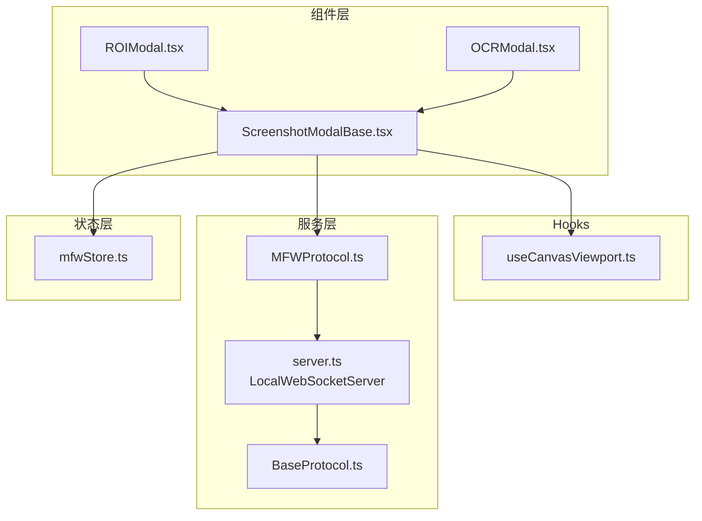
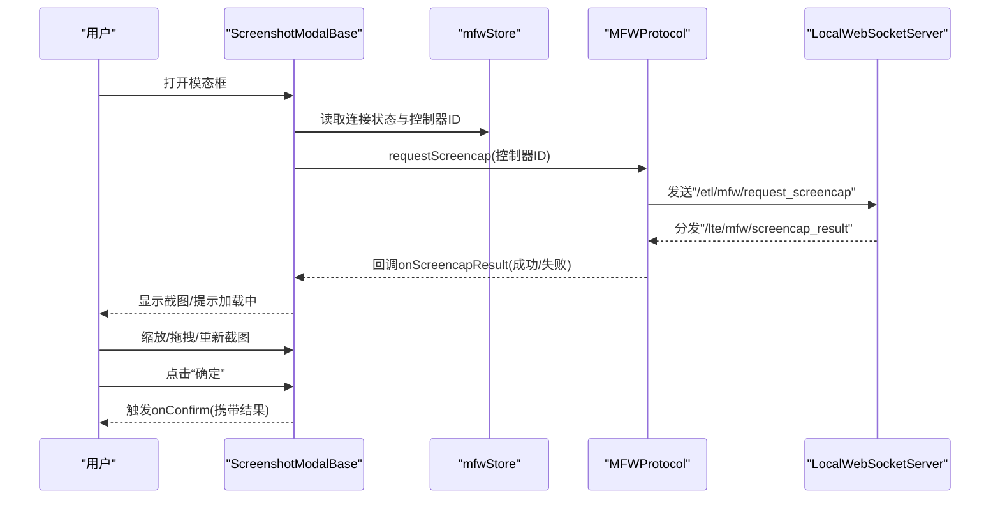
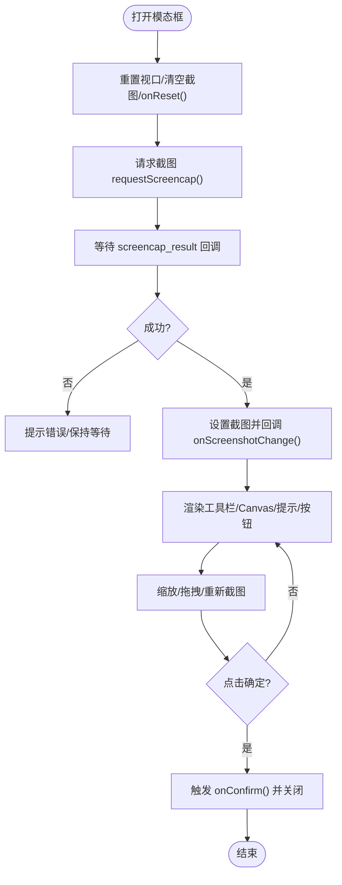
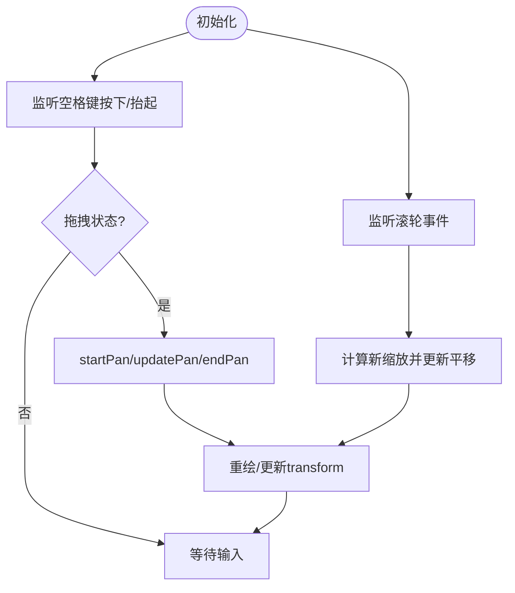
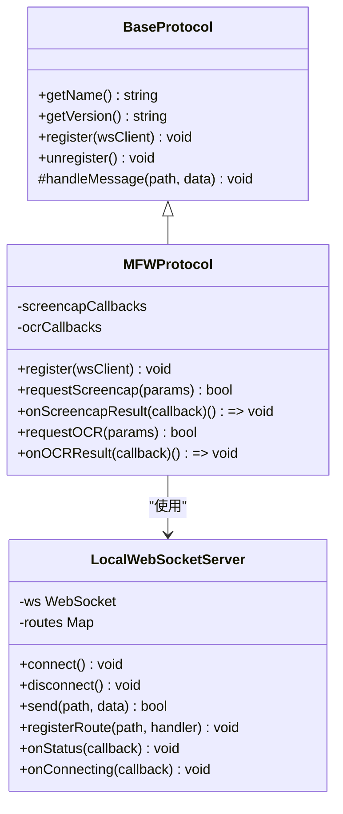
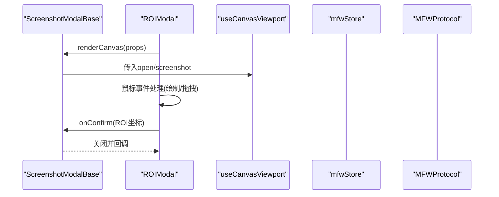
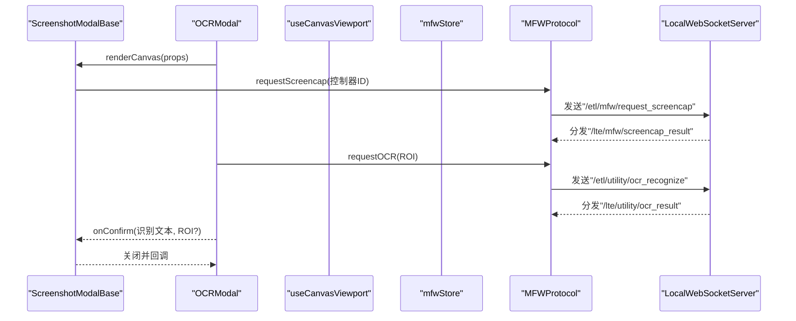
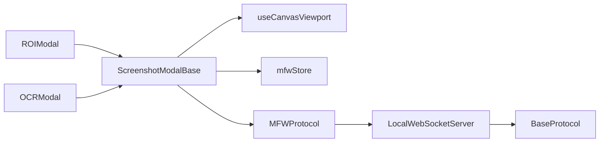

# 截图模态框基类

<cite>
**本文引用的文件**
- [ScreenshotModalBase.tsx](file://src/components/modals/ScreenshotModalBase.tsx)
- [useCanvasViewport.ts](file://src/hooks/useCanvasViewport.ts)
- [server.ts](file://src/services/server.ts)
- [MFWProtocol.ts](file://src/services/protocols/MFWProtocol.ts)
- [mfwStore.ts](file://src/stores/mfwStore.ts)
- [ROIModal.tsx](file://src/components/modals/ROIModal.tsx)
- [OCRModal.tsx](file://src/components/modals/OCRModal.tsx)
- [BaseProtocol.ts](file://src/services/protocols/BaseProtocol.ts)
</cite>

## 目录
1. [简介](#简介)
2. [项目结构](#项目结构)
3. [核心组件](#核心组件)
4. [架构总览](#架构总览)
5. [详细组件分析](#详细组件分析)
6. [依赖关系分析](#依赖关系分析)
7. [性能考量](#性能考量)
8. [故障排查指南](#故障排查指南)
9. [结论](#结论)

## 简介
本文件围绕“截图模态框基类”展开，系统性梳理了该基类的设计理念、接口约定、交互流程与扩展方式，并结合实际子组件（如 ROI 配置与 OCR 预览）展示如何基于该基类快速构建具备统一截图能力与视口控制的模态对话框。文档同时给出架构图、序列图与流程图，帮助读者从整体到细节全面理解。

## 项目结构
截图模态框基类位于组件层的模态框目录，配合视口控制 Hook、协议层与状态存储，形成完整的“请求截图—渲染视图—用户交互—确认提交”的闭环。

图表来源
- [ScreenshotModalBase.tsx](file://src/components/modals/ScreenshotModalBase.tsx#L73-L292)
- [useCanvasViewport.ts](file://src/hooks/useCanvasViewport.ts#L69-L306)
- [server.ts](file://src/services/server.ts#L1-L298)
- [MFWProtocol.ts](file://src/services/protocols/MFWProtocol.ts#L1-L399)
- [mfwStore.ts](file://src/stores/mfwStore.ts#L1-L134)
- [ROIModal.tsx](file://src/components/modals/ROIModal.tsx#L1-L300)
- [OCRModal.tsx](file://src/components/modals/OCRModal.tsx#L1-L485)
- [BaseProtocol.ts](file://src/services/protocols/BaseProtocol.ts#L1-L40)

章节来源
- [ScreenshotModalBase.tsx](file://src/components/modals/ScreenshotModalBase.tsx#L73-L292)
- [ROIModal.tsx](file://src/components/modals/ROIModal.tsx#L1-L300)
- [OCRModal.tsx](file://src/components/modals/OCRModal.tsx#L1-L485)

## 核心组件
- 截图模态框基类：提供统一的弹窗容器、截图请求与加载提示、视口缩放与拖拽、工具栏与底部按钮区、以及可插拔的 Canvas 渲染与自定义工具栏。
- 视口控制 Hook：封装缩放步进、滚轮缩放、空格/中键拖拽、初始化适配、重置状态与光标样式等通用行为。
- 协议层：通过 MFWProtocol 统一发送截图与 OCR 请求，并注册结果回调；LocalWebSocketServer 负责连接、握手与消息分发。
- 状态存储：mfwStore 提供连接状态、控制器 ID、设备信息等全局状态，供基类与子组件读取。

章节来源
- [ScreenshotModalBase.tsx](file://src/components/modals/ScreenshotModalBase.tsx#L73-L292)
- [useCanvasViewport.ts](file://src/hooks/useCanvasViewport.ts#L69-L306)
- [MFWProtocol.ts](file://src/services/protocols/MFWProtocol.ts#L1-L399)
- [server.ts](file://src/services/server.ts#L1-L298)
- [mfwStore.ts](file://src/stores/mfwStore.ts#L1-L134)

## 架构总览
下图展示了从用户打开模态框到最终确认提交的关键交互路径，以及截图请求与结果回调的异步流程。

图表来源
- [ScreenshotModalBase.tsx](file://src/components/modals/ScreenshotModalBase.tsx#L106-L149)
- [MFWProtocol.ts](file://src/services/protocols/MFWProtocol.ts#L331-L364)
- [server.ts](file://src/services/server.ts#L223-L237)

## 详细组件分析

### 截图模态框基类（ScreenshotModalBase）
- 职责
  - 统一弹窗容器与布局：标题、宽度、工具栏、Canvas 区域、提示文本、子内容区、底部按钮。
  - 截图生命周期：打开时请求截图、监听结果、关闭时清理状态。
  - 视口控制集成：通过 useCanvasViewport 提供缩放、平移、空格/中键拖拽、滚轮缩放、重置适配等。
  - 可插拔渲染：renderToolbar 与 renderCanvas 两个插槽，支持自定义工具栏与 Canvas 渲染。
- 关键接口
  - Props：open、onClose、title、width、confirmText、confirmDisabled、onConfirm、renderToolbar、renderCanvas、children、onScreenshotChange、onReset。
  - 视口 Props：scale、panOffset、isPanning、isSpacePressed、containerRef、imageRef、handleZoomIn、handleZoomOut、handleZoomReset、startPan、updatePan、endPan、initializeImage、getBaseCursorStyle。
  - Canvas Render Props：在上述基础上增加 screenshot 与 canvasRef。
- 行为要点
  - 打开时重置视口、清空旧截图、请求新截图；关闭时重置并调用 onReset。
  - 监听 screencap_result 回调，成功则设置截图并回调 onScreenshotChange。
  - 提供“重新截图”按钮与确认/取消按钮，确认按钮受 confirmDisabled 控制。
  - Canvas 区域采用相对定位与 transform 实现平移与缩放，避免 DOM 重排。

图表来源
- [ScreenshotModalBase.tsx](file://src/components/modals/ScreenshotModalBase.tsx#L116-L149)
- [ScreenshotModalBase.tsx](file://src/components/modals/ScreenshotModalBase.tsx#L151-L158)
- [ScreenshotModalBase.tsx](file://src/components/modals/ScreenshotModalBase.tsx#L168-L291)

章节来源
- [ScreenshotModalBase.tsx](file://src/components/modals/ScreenshotModalBase.tsx#L44-L115)
- [ScreenshotModalBase.tsx](file://src/components/modals/ScreenshotModalBase.tsx#L116-L149)
- [ScreenshotModalBase.tsx](file://src/components/modals/ScreenshotModalBase.tsx#L151-L158)
- [ScreenshotModalBase.tsx](file://src/components/modals/ScreenshotModalBase.tsx#L168-L291)

### 视口控制 Hook（useCanvasViewport）
- 职责
  - 统一管理缩放比例、平移偏移、拖拽状态与键盘状态（空格键）。
  - 提供滚轮缩放、缩放按钮、重置适配、初始化图片尺寸与居中、拖拽开始/更新/结束、重置视口、光标样式辅助等能力。
- 关键点
  - 缩放范围限制与步进，滚轮缩放以鼠标位置为中心。
  - 中键与空格键组合拖拽，拖拽时禁用滚轮缩放，避免冲突。
  - 重置适配根据容器宽高与图片尺寸计算 fitScale，并将图片居中。

图表来源
- [useCanvasViewport.ts](file://src/hooks/useCanvasViewport.ts#L92-L121)
- [useCanvasViewport.ts](file://src/hooks/useCanvasViewport.ts#L123-L158)
- [useCanvasViewport.ts](file://src/hooks/useCanvasViewport.ts#L160-L188)
- [useCanvasViewport.ts](file://src/hooks/useCanvasViewport.ts#L190-L215)
- [useCanvasViewport.ts](file://src/hooks/useCanvasViewport.ts#L217-L250)
- [useCanvasViewport.ts](file://src/hooks/useCanvasViewport.ts#L251-L306)

章节来源
- [useCanvasViewport.ts](file://src/hooks/useCanvasViewport.ts#L69-L306)

### 协议与服务层
- MFWProtocol
  - 注册截图结果与 OCR 结果回调，提供 requestScreencap 与 requestOCR 方法，以及 onScreencapResult/onOCRResult 注册/注销。
  - 通过 LocalWebSocketServer 发送与接收消息，负责路由分发与错误处理。
- LocalWebSocketServer
  - 负责连接建立、握手校验、消息解析、路由分发、连接状态变更通知。
- BaseProtocol
  - 协议抽象基类，定义协议名、版本与注册方法，作为各协议模块的统一入口。

图表来源
- [BaseProtocol.ts](file://src/services/protocols/BaseProtocol.ts#L1-L40)
- [server.ts](file://src/services/server.ts#L1-L298)
- [MFWProtocol.ts](file://src/services/protocols/MFWProtocol.ts#L1-L399)

章节来源
- [MFWProtocol.ts](file://src/services/protocols/MFWProtocol.ts#L1-L399)
- [server.ts](file://src/services/server.ts#L1-L298)
- [BaseProtocol.ts](file://src/services/protocols/BaseProtocol.ts#L1-L40)

### 子组件示例：ROI 配置模态框（ROIModal）
- 职责
  - 在截图上绘制矩形框选区域，支持鼠标拖拽绘制与手动输入坐标。
  - 将 ROI 坐标传递给父组件，支持确认回填。
- 与基类协作
  - 通过 renderCanvas 插槽注入自定义 Canvas 渲染逻辑，使用基类提供的 viewportProps 与 canvasRef。
  - 通过 onScreenshotChange 接收截图数据，通过 onReset 清理状态。

图表来源
- [ROIModal.tsx](file://src/components/modals/ROIModal.tsx#L190-L242)
- [ROIModal.tsx](file://src/components/modals/ROIModal.tsx#L244-L299)
- [ScreenshotModalBase.tsx](file://src/components/modals/ScreenshotModalBase.tsx#L168-L291)
- [useCanvasViewport.ts](file://src/hooks/useCanvasViewport.ts#L69-L306)

章节来源
- [ROIModal.tsx](file://src/components/modals/ROIModal.tsx#L1-L300)
- [ScreenshotModalBase.tsx](file://src/components/modals/ScreenshotModalBase.tsx#L168-L291)
- [useCanvasViewport.ts](file://src/hooks/useCanvasViewport.ts#L69-L306)

### 子组件示例：OCR 预览模态框（OCRModal）
- 职责
  - 在截图上绘制 ROI 并自动触发 OCR 识别，支持手动输入坐标与防抖触发。
  - 将识别结果与可选 ROI 传递给父组件，支持确认回填。
- 与基类协作
  - 通过 renderCanvas 插槽注入自定义 Canvas 渲染逻辑，使用基类提供的 viewportProps 与 canvasRef。
  - 通过 onScreenshotChange 接收截图数据，通过 onReset 清理状态。
  - 通过 MFWProtocol.requestOCR 与 onOCRResult 监听识别结果。

图表来源
- [OCRModal.tsx](file://src/components/modals/OCRModal.tsx#L73-L122)
- [OCRModal.tsx](file://src/components/modals/OCRModal.tsx#L177-L279)
- [OCRModal.tsx](file://src/components/modals/OCRModal.tsx#L316-L373)
- [OCRModal.tsx](file://src/components/modals/OCRModal.tsx#L374-L484)
- [MFWProtocol.ts](file://src/services/protocols/MFWProtocol.ts#L331-L364)
- [MFWProtocol.ts](file://src/services/protocols/MFWProtocol.ts#L366-L399)
- [server.ts](file://src/services/server.ts#L223-L237)

章节来源
- [OCRModal.tsx](file://src/components/modals/OCRModal.tsx#L1-L485)
- [MFWProtocol.ts](file://src/services/protocols/MFWProtocol.ts#L331-L399)
- [server.ts](file://src/services/server.ts#L1-L298)

## 依赖关系分析
- 组件依赖
  - ScreenshotModalBase 依赖 useCanvasViewport、mfwStore、MFWProtocol。
  - ROIModal/OCRModal 依赖 ScreenshotModalBase 的渲染插槽与回调。
- 协议依赖
  - MFWProtocol 依赖 LocalWebSocketServer，负责消息发送与路由分发。
  - BaseProtocol 为协议模块提供抽象接口。
- 状态依赖
  - mfwStore 提供连接状态与控制器 ID，影响截图请求的可用性。

图表来源
- [ScreenshotModalBase.tsx](file://src/components/modals/ScreenshotModalBase.tsx#L73-L292)
- [ROIModal.tsx](file://src/components/modals/ROIModal.tsx#L1-L300)
- [OCRModal.tsx](file://src/components/modals/OCRModal.tsx#L1-L485)
- [useCanvasViewport.ts](file://src/hooks/useCanvasViewport.ts#L69-L306)
- [mfwStore.ts](file://src/stores/mfwStore.ts#L1-L134)
- [MFWProtocol.ts](file://src/services/protocols/MFWProtocol.ts#L1-L399)
- [server.ts](file://src/services/server.ts#L1-L298)
- [BaseProtocol.ts](file://src/services/protocols/BaseProtocol.ts#L1-L40)

章节来源
- [ScreenshotModalBase.tsx](file://src/components/modals/ScreenshotModalBase.tsx#L73-L292)
- [ROIModal.tsx](file://src/components/modals/ROIModal.tsx#L1-L300)
- [OCRModal.tsx](file://src/components/modals/OCRModal.tsx#L1-L485)
- [useCanvasViewport.ts](file://src/hooks/useCanvasViewport.ts#L69-L306)
- [mfwStore.ts](file://src/stores/mfwStore.ts#L1-L134)
- [MFWProtocol.ts](file://src/services/protocols/MFWProtocol.ts#L1-L399)
- [server.ts](file://src/services/server.ts#L1-L298)
- [BaseProtocol.ts](file://src/services/protocols/BaseProtocol.ts#L1-L40)

## 性能考量
- 截图请求与渲染
  - 建议在打开模态框时再请求截图，避免不必要的网络与渲染开销。
  - 对于大分辨率截图，优先使用重置适配 fitScale，减少 DOM 变换复杂度。
- 事件处理
  - 滚轮缩放与拖拽事件需谨慎处理 preventDefault 与 stopPropagation，避免页面滚动与浏览器默认行为干扰。
  - 防抖触发 OCR 时，建议合理设置防抖间隔，平衡响应速度与识别频率。
- 状态管理
  - 关闭模态框时及时清理截图与图像引用，释放内存占用。
  - 使用 memo 包裹组件，减少不必要的重渲染。

## 故障排查指南
- 无法获取截图
  - 检查连接状态与控制器 ID：仅当连接状态为已连接且存在控制器 ID 时才发起截图请求。
  - 查看协议注册与握手：确认 LocalWebSocketServer 成功握手并通过 MFWProtocol 注册路由。
- 截图结果未回调
  - 确认 onScreencapResult 注册与注销逻辑正确，避免重复注册导致回调异常。
  - 检查消息路径是否匹配：/lte/mfw/screencap_result。
- OCR 识别失败
  - 检查 ROI 是否有效（宽高大于阈值），并确认控制器已连接。
  - 查看 /lte/utility/ocr_result 回调是否被正确注册。
- 拖拽/缩放异常
  - 确认空格键与中键拖拽状态切换逻辑正常，避免滚轮与拖拽冲突。
  - 检查容器与图片尺寸初始化是否完成，initializeImage 是否被调用。

章节来源
- [ScreenshotModalBase.tsx](file://src/components/modals/ScreenshotModalBase.tsx#L106-L149)
- [MFWProtocol.ts](file://src/services/protocols/MFWProtocol.ts#L192-L228)
- [MFWProtocol.ts](file://src/services/protocols/MFWProtocol.ts#L331-L364)
- [OCRModal.tsx](file://src/components/modals/OCRModal.tsx#L73-L122)
- [useCanvasViewport.ts](file://src/hooks/useCanvasViewport.ts#L92-L158)

## 结论
截图模态框基类通过统一的容器、视口控制与协议交互，为 ROI 配置与 OCR 预览等场景提供了可复用的能力。其插槽化设计使得工具栏与 Canvas 渲染高度灵活，配合完善的生命周期与错误处理，能够稳定支撑复杂的识别与标注工作流。建议在扩展新模态框时遵循相同的 Props 约定与回调规范，确保一致的用户体验与可维护性。