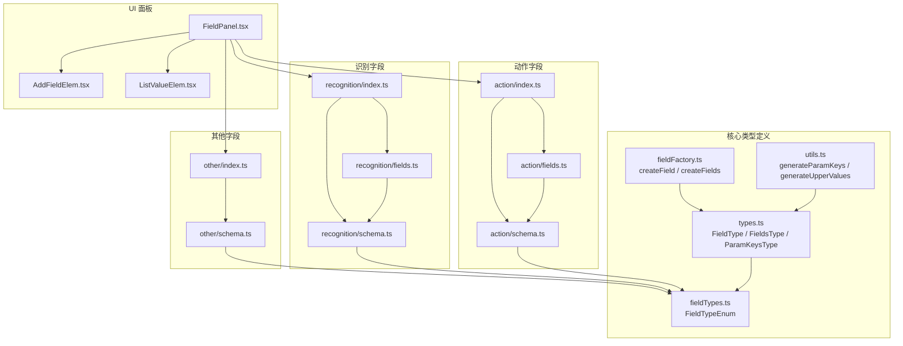
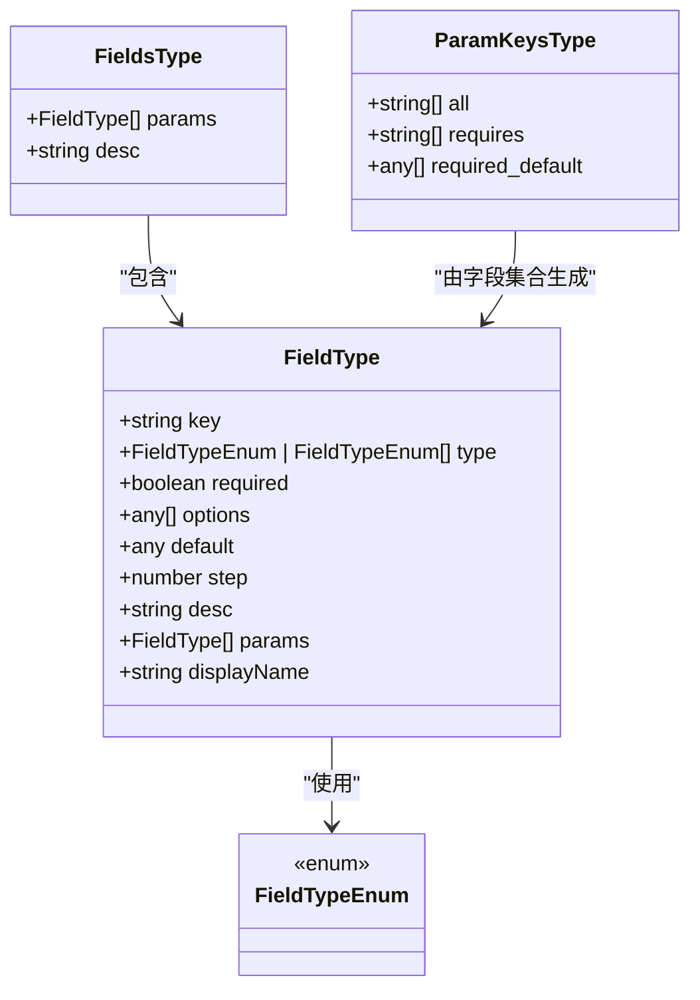
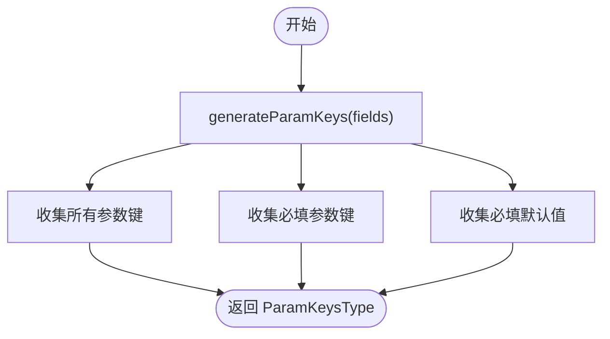
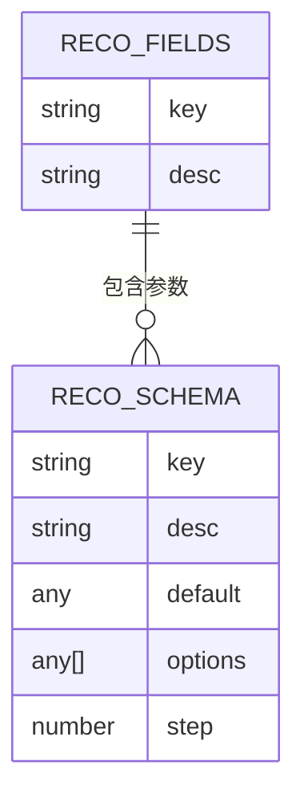
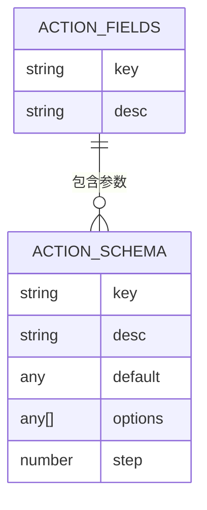
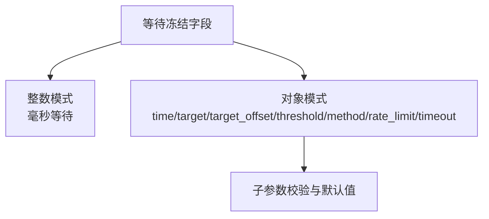
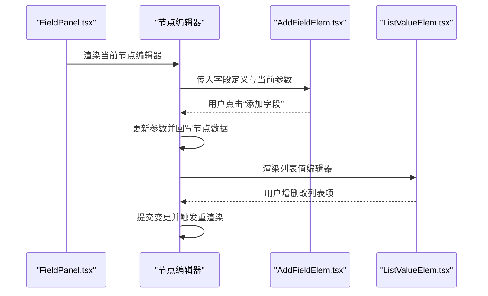
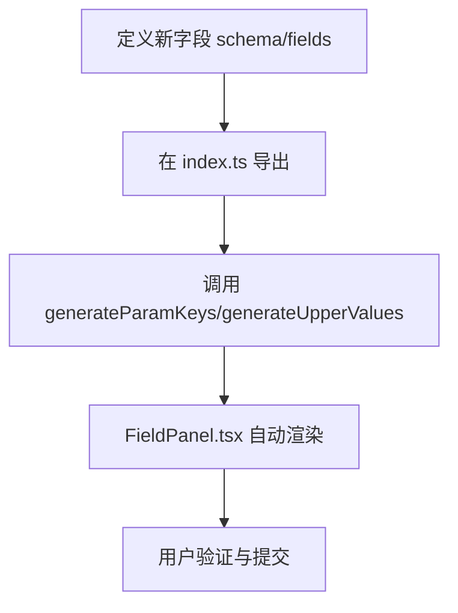
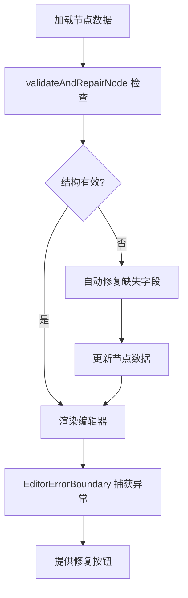
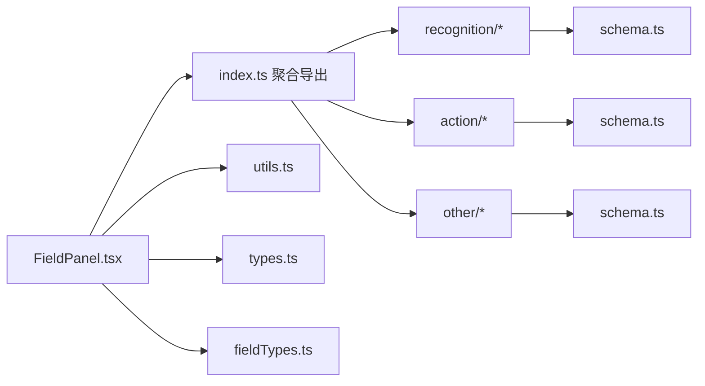

# 字段类型系统

<cite>
**本文档引用的文件**
- [src/core/fields/index.ts](file://src/core/fields/index.ts)
- [src/core/fields/types.ts](file://src/core/fields/types.ts)
- [src/core/fields/fieldTypes.ts](file://src/core/fields/fieldTypes.ts)
- [src/core/fields/fieldFactory.ts](file://src/core/fields/fieldFactory.ts)
- [src/core/fields/utils.ts](file://src/core/fields/utils.ts)
- [src/core/fields/recognition/index.ts](file://src/core/fields/recognition/index.ts)
- [src/core/fields/recognition/fields.ts](file://src/core/fields/recognition/fields.ts)
- [src/core/fields/recognition/schema.ts](file://src/core/fields/recognition/schema.ts)
- [src/core/fields/action/index.ts](file://src/core/fields/action/index.ts)
- [src/core/fields/action/fields.ts](file://src/core/fields/action/fields.ts)
- [src/core/fields/action/schema.ts](file://src/core/fields/action/schema.ts)
- [src/core/fields/other/index.ts](file://src/core/fields/other/index.ts)
- [src/core/fields/other/schema.ts](file://src/core/fields/other/schema.ts)
- [src/components/panels/main/FieldPanel.tsx](file://src/components/panels/main/FieldPanel.tsx)
- [src/components/panels/field/items/AddFieldElem.tsx](file://src/components/panels/field/items/AddFieldElem.tsx)
- [src/components/panels/field/items/ListValueElem.tsx](file://src/components/panels/field/items/ListValueElem.tsx)
</cite>

## 目录
1. [简介](#简介)
2. [项目结构](#项目结构)
3. [核心组件](#核心组件)
4. [架构总览](#架构总览)
5. [详细组件分析](#详细组件分析)
6. [依赖分析](#依赖分析)
7. [性能考量](#性能考量)
8. [故障排查指南](#故障排查指南)
9. [结论](#结论)
10. [附录](#附录)

## 简介
本文件系统性地阐述字段类型系统的设计与实现，涵盖识别字段、动作字段与其他参数的类型定义、验证规则、UI 绑定与数据流、扩展机制与自定义实现、以及动态表单生成与实时验证能力。读者无需深入底层即可理解如何配置字段、如何进行数据校验与错误处理，并掌握如何扩展新的字段类型。

## 项目结构
字段类型系统位于前端核心模块 src/core/fields 下，采用“按职责分层 + 按领域分组”的组织方式：
- types.ts：统一的类型定义（字段、字段集合、参数键集合）
- fieldTypes.ts：字段类型枚举（基础类型、复合类型、图片路径类型）
- fieldFactory.ts：字段创建辅助函数（简化字段定义）
- utils.ts：参数键生成、大写映射等工具
- recognition/：识别相关字段定义与模式
- action/：动作相关字段定义与模式
- other/：通用控制字段（如等待冻结、锚点、重复执行等）

UI 面板通过 FieldPanel.tsx 聚合不同节点类型的字段编辑器，并在 AddFieldElem.tsx 与 ListValueElem.tsx 等组件中实现字段增删改与列表编辑的交互。

**图表来源**
- [src/core/fields/index.ts:1-45](file://src/core/fields/index.ts#L1-L45)
- [src/core/fields/types.ts:1-34](file://src/core/fields/types.ts#L1-L34)
- [src/core/fields/fieldTypes.ts:1-27](file://src/core/fields/fieldTypes.ts#L1-L27)
- [src/core/fields/fieldFactory.ts:1-16](file://src/core/fields/fieldFactory.ts#L1-L16)
- [src/core/fields/utils.ts:1-41](file://src/core/fields/utils.ts#L1-L41)
- [src/core/fields/recognition/index.ts:1-3](file://src/core/fields/recognition/index.ts#L1-L3)
- [src/core/fields/recognition/fields.ts:1-115](file://src/core/fields/recognition/fields.ts#L1-L115)
- [src/core/fields/recognition/schema.ts:1-276](file://src/core/fields/recognition/schema.ts#L1-L276)
- [src/core/fields/action/index.ts:1-3](file://src/core/fields/action/index.ts#L1-L3)
- [src/core/fields/action/fields.ts:1-149](file://src/core/fields/action/fields.ts#L1-L149)
- [src/core/fields/action/schema.ts:1-299](file://src/core/fields/action/schema.ts#L1-L299)
- [src/core/fields/other/index.ts:1-8](file://src/core/fields/other/index.ts#L1-L8)
- [src/core/fields/other/schema.ts:1-363](file://src/core/fields/other/schema.ts#L1-L363)
- [src/components/panels/main/FieldPanel.tsx:1-524](file://src/components/panels/main/FieldPanel.tsx#L1-L524)
- [src/components/panels/field/items/AddFieldElem.tsx:1-62](file://src/components/panels/field/items/AddFieldElem.tsx#L1-L62)
- [src/components/panels/field/items/ListValueElem.tsx:1-149](file://src/components/panels/field/items/ListValueElem.tsx#L1-L149)

**章节来源**
- [src/core/fields/index.ts:1-45](file://src/core/fields/index.ts#L1-L45)
- [src/core/fields/types.ts:1-34](file://src/core/fields/types.ts#L1-L34)
- [src/core/fields/fieldTypes.ts:1-27](file://src/core/fields/fieldTypes.ts#L1-L27)
- [src/core/fields/fieldFactory.ts:1-16](file://src/core/fields/fieldFactory.ts#L1-L16)
- [src/core/fields/utils.ts:1-41](file://src/core/fields/utils.ts#L1-L41)
- [src/core/fields/recognition/index.ts:1-3](file://src/core/fields/recognition/index.ts#L1-L3)
- [src/core/fields/recognition/fields.ts:1-115](file://src/core/fields/recognition/fields.ts#L1-L115)
- [src/core/fields/recognition/schema.ts:1-276](file://src/core/fields/recognition/schema.ts#L1-L276)
- [src/core/fields/action/index.ts:1-3](file://src/core/fields/action/index.ts#L1-L3)
- [src/core/fields/action/fields.ts:1-149](file://src/core/fields/action/fields.ts#L1-L149)
- [src/core/fields/action/schema.ts:1-299](file://src/core/fields/action/schema.ts#L1-L299)
- [src/core/fields/other/index.ts:1-8](file://src/core/fields/other/index.ts#L1-L8)
- [src/core/fields/other/schema.ts:1-363](file://src/core/fields/other/schema.ts#L1-L363)
- [src/components/panels/main/FieldPanel.tsx:1-524](file://src/components/panels/main/FieldPanel.tsx#L1-L524)
- [src/components/panels/field/items/AddFieldElem.tsx:1-62](file://src/components/panels/field/items/AddFieldElem.tsx#L1-L62)
- [src/components/panels/field/items/ListValueElem.tsx:1-149](file://src/components/panels/field/items/ListValueElem.tsx#L1-L149)

## 核心组件
- 类型定义层
  - FieldType：字段元数据（键、类型、是否必填、选项、默认值、步长、描述、子参数、显示名）
  - FieldsType：字段集合（包含一组参数与描述）
  - ParamKeysType：参数键集合（全部键、必填键、必填默认值）
- 类型枚举层：FieldTypeEnum 定义基础与复合类型，如整数、浮点、布尔、字符串、列表、数组、图片路径等
- 工厂与工具层
  - createField/createFields：简化字段定义
  - generateParamKeys：从字段集合生成参数键映射
  - generateUpperValues：生成大写键到小写键的映射
- 领域定义层
  - recognition：识别字段（模板匹配、颜色匹配、OCR、特征匹配、神经网络、组合识别、自定义识别等）
  - action：动作字段（点击、滑动、滚动、按键、输入、应用启停、命令、截图、自定义动作等）
  - other：通用控制字段（等待冻结、锚点、重复执行、启用/禁用、最大命中次数、前置/后置延迟、速率限制、超时、附加数据等）

**章节来源**
- [src/core/fields/types.ts:1-34](file://src/core/fields/types.ts#L1-L34)
- [src/core/fields/fieldTypes.ts:1-27](file://src/core/fields/fieldTypes.ts#L1-L27)
- [src/core/fields/fieldFactory.ts:1-16](file://src/core/fields/fieldFactory.ts#L1-L16)
- [src/core/fields/utils.ts:1-41](file://src/core/fields/utils.ts#L1-L41)
- [src/core/fields/recognition/fields.ts:1-115](file://src/core/fields/recognition/fields.ts#L1-L115)
- [src/core/fields/action/fields.ts:1-149](file://src/core/fields/action/fields.ts#L1-L149)
- [src/core/fields/other/schema.ts:1-363](file://src/core/fields/other/schema.ts#L1-L363)

## 架构总览
字段类型系统通过“类型定义 + 模式约束 + UI 绑定 + 工具函数”的分层设计，实现：
- 统一的字段元数据模型
- 丰富的类型枚举与复合类型
- 领域化的字段集合与键列表
- 自动生成参数键与大小写映射
- UI 面板按节点类型动态渲染字段编辑器

**图表来源**
- [src/core/fields/types.ts:1-34](file://src/core/fields/types.ts#L1-L34)
- [src/core/fields/fieldTypes.ts:1-27](file://src/core/fields/fieldTypes.ts#L1-L27)

**章节来源**
- [src/core/fields/types.ts:1-34](file://src/core/fields/types.ts#L1-L34)
- [src/core/fields/fieldTypes.ts:1-27](file://src/core/fields/fieldTypes.ts#L1-L27)

## 详细组件分析

### 类型定义与工厂
- FieldType：描述单个字段的元数据，支持嵌套子参数（params），用于结构化字段（如 focus、等待冻结等）
- FieldsType：描述某一节点类型的字段集合
- ParamKeysType：描述字段集合的参数键集合，便于 UI 生成与校验
- createField/createFields：简化字段定义，避免重复样板代码
- generateParamKeys：遍历字段集合，提取 all/requires/required_default
- generateUpperValues：将字段键转为大写形式，便于大小写不敏感匹配

**图表来源**
- [src/core/fields/utils.ts:6-25](file://src/core/fields/utils.ts#L6-L25)

**章节来源**
- [src/core/fields/types.ts:1-34](file://src/core/fields/types.ts#L1-L34)
- [src/core/fields/fieldFactory.ts:1-16](file://src/core/fields/fieldFactory.ts#L1-L16)
- [src/core/fields/utils.ts:1-41](file://src/core/fields/utils.ts#L1-L41)

### 识别字段体系
- 领域定义：DirectHit、OCR、TemplateMatch、ColorMatch、Custom、FeatureMatch、And、Or、NeuralNetworkClassify、NeuralNetworkDetect
- 模式约束：ROI、模板路径、阈值、排序方式、颜色范围、OCR期望结果、神经网络标签与模型、组合识别子节点列表等
- 关键特性：
  - ROI 支持字符串引用前置节点或锚点
  - 模板匹配支持多种匹配算法与绿色掩码
  - OCR 支持正则期望、阈值、替换规则、颜色过滤
  - 组合识别支持 all_of/any_of 与 box_index
  - 自定义识别支持自定义参数与 ROI

**图表来源**
- [src/core/fields/recognition/fields.ts:1-115](file://src/core/fields/recognition/fields.ts#L1-L115)
- [src/core/fields/recognition/schema.ts:1-276](file://src/core/fields/recognition/schema.ts#L1-L276)

**章节来源**
- [src/core/fields/recognition/fields.ts:1-115](file://src/core/fields/recognition/fields.ts#L1-L115)
- [src/core/fields/recognition/schema.ts:1-276](file://src/core/fields/recognition/schema.ts#L1-L276)

### 动作字段体系
- 领域定义：DoNothing、Click、Custom、Swipe、Scroll、ClickKey、LongPress、MultiSwipe、TouchDown/Move/Up、KeyDown/KeyUp、InputText、StartApp/StopApp、Command、Shell、Screencap、Key
- 模式约束：目标位置（支持坐标、区域、前置节点、锚点）、偏移、持续时间、压力、按键码、输入文本、包名、命令与参数、截图格式与质量、自定义动作名与参数等
- 关键特性：
  - 目标位置支持多种类型与引用方式
  - 多指滑动支持多段路径与时间起始
  - Shell 命令支持超时与平台差异

**图表来源**
- [src/core/fields/action/fields.ts:1-149](file://src/core/fields/action/fields.ts#L1-L149)
- [src/core/fields/action/schema.ts:1-299](file://src/core/fields/action/schema.ts#L1-L299)

**章节来源**
- [src/core/fields/action/fields.ts:1-149](file://src/core/fields/action/fields.ts#L1-L149)
- [src/core/fields/action/schema.ts:1-299](file://src/core/fields/action/schema.ts#L1-L299)

### 其他参数体系
- 通用控制字段：rate_limit、timeout、anchor、inverse、enabled、max_hit、pre/post_delay、focus、repeat、repeat_delay、repeat_wait_freezes、attach
- 等待冻结（WaitFreezes）：pre_wait_freezes、post_wait_freezes、repeat_wait_freezes 支持整数与对象两种模式，对象内含 time/target/target_offset/threshold/method/rate_limit/timeout 等子参数
- 关键特性：
  - focus 支持多种消息类型与模板字符串（Markdown、国际化占位符）
  - attach 支持与默认值字典合并

**图表来源**
- [src/core/fields/other/schema.ts:60-179](file://src/core/fields/other/schema.ts#L60-L179)
- [src/core/fields/other/schema.ts:120-179](file://src/core/fields/other/schema.ts#L120-L179)
- [src/core/fields/other/schema.ts:242-301](file://src/core/fields/other/schema.ts#L242-L301)

**章节来源**
- [src/core/fields/other/schema.ts:1-363](file://src/core/fields/other/schema.ts#L1-L363)

### UI 绑定与数据流
- FieldPanel.tsx：根据当前节点类型动态渲染对应编辑器（Pipeline/External/Anchor/Sticker/Group），并在 Tab 中切换“字段配置”、“邻接信息”、“出发/目标节点记录”等
- AddFieldElem.tsx：根据当前参数集合与字段定义，提供“添加字段”弹出菜单，支持显示字段描述与显示名
- ListValueElem.tsx：支持列表值的增删改、步长输入、JSON 解析与提交、以及快速工具图标

**图表来源**
- [src/components/panels/main/FieldPanel.tsx:269-323](file://src/components/panels/main/FieldPanel.tsx#L269-L323)
- [src/components/panels/field/items/AddFieldElem.tsx:12-61](file://src/components/panels/field/items/AddFieldElem.tsx#L12-L61)
- [src/components/panels/field/items/ListValueElem.tsx:60-149](file://src/components/panels/field/items/ListValueElem.tsx#L60-L149)

**章节来源**
- [src/components/panels/main/FieldPanel.tsx:1-524](file://src/components/panels/main/FieldPanel.tsx#L1-L524)
- [src/components/panels/field/items/AddFieldElem.tsx:1-62](file://src/components/panels/field/items/AddFieldElem.tsx#L1-L62)
- [src/components/panels/field/items/ListValueElem.tsx:1-149](file://src/components/panels/field/items/ListValueElem.tsx#L1-L149)

### 扩展机制与自定义字段
- 扩展识别/动作字段：在对应 index.ts 中导出新的 fields 与 schema，并在 index.ts 导出聚合
- 扩展其他参数：在 other/schema.ts 中新增字段定义，并在 other/index.ts 导出
- 工具函数：利用 generateParamKeys 与 generateUpperValues 自动生成参数键与大小写映射
- UI 绑定：通过 FieldPanel.tsx 的节点类型分支自动渲染新字段编辑器

**图表来源**
- [src/core/fields/index.ts:7-28](file://src/core/fields/index.ts#L7-L28)
- [src/core/fields/utils.ts:6-40](file://src/core/fields/utils.ts#L6-L40)
- [src/components/panels/main/FieldPanel.tsx:269-323](file://src/components/panels/main/FieldPanel.tsx#L269-L323)

**章节来源**
- [src/core/fields/index.ts:1-45](file://src/core/fields/index.ts#L1-L45)
- [src/core/fields/utils.ts:1-41](file://src/core/fields/utils.ts#L1-L41)
- [src/components/panels/main/FieldPanel.tsx:1-524](file://src/components/panels/main/FieldPanel.tsx#L1-L524)

### 动态表单生成与实时验证
- 动态表单生成：根据节点类型与字段集合，UI 自动渲染对应字段编辑器，支持列表、对象、布尔、整数、浮点、字符串、图片路径等多种输入控件
- 实时验证与修复：
  - validateAndRepairNode：检查节点结构完整性，自动修复缺失的 recognition/action/others 字段
  - EditorErrorBoundary：捕获渲染异常并提示修复
  - 警告与修复按钮：在字段面板顶部显示验证警告，并提供一键修复

**图表来源**
- [src/components/panels/main/FieldPanel.tsx:41-119](file://src/components/panels/main/FieldPanel.tsx#L41-L119)
- [src/components/panels/main/FieldPanel.tsx:122-182](file://src/components/panels/main/FieldPanel.tsx#L122-L182)

**章节来源**
- [src/components/panels/main/FieldPanel.tsx:1-524](file://src/components/panels/main/FieldPanel.tsx#L1-L524)

## 依赖分析
- 内聚性：各领域（识别/动作/其他）字段定义与模式严格分离，内聚度高
- 耦合性：UI 通过 index.ts 聚合导出，降低对具体领域文件的耦合；工具函数与类型定义独立，便于复用
- 外部依赖：Ant Design 组件库（Input/InputNumber/Popover/Tabs/Alert/Button）用于 UI 构建
- 循环依赖：未发现循环依赖，结构清晰

**图表来源**
- [src/core/fields/index.ts:1-45](file://src/core/fields/index.ts#L1-L45)
- [src/components/panels/main/FieldPanel.tsx:1-524](file://src/components/panels/main/FieldPanel.tsx#L1-L524)

**章节来源**
- [src/core/fields/index.ts:1-45](file://src/core/fields/index.ts#L1-L45)
- [src/components/panels/main/FieldPanel.tsx:1-524](file://src/components/panels/main/FieldPanel.tsx#L1-L524)

## 性能考量
- 参数键生成：generateParamKeys 与 generateUpperValues 仅在初始化阶段执行，避免运行时重复计算
- 列表编辑：ListValueElem.tsx 使用本地状态与失焦提交，减少频繁重渲染
- UI 渲染：EditorErrorBoundary 与节点结构验证在必要时才触发，避免不必要的开销

## 故障排查指南
- 节点数据损坏：validateAndRepairNode 会自动修复缺失的 recognition/action/others 字段，若无法修复则提示删除并重建
- 渲染异常：EditorErrorBoundary 捕获异常并显示错误信息与修复按钮
- 字段冲突：AddFieldElem.tsx 会根据当前参数集合过滤已存在的字段，避免重复添加
- 列表编辑问题：ListValueElem.tsx 支持 JSON 解析与回退，确保输入安全

**章节来源**
- [src/components/panels/main/FieldPanel.tsx:41-119](file://src/components/panels/main/FieldPanel.tsx#L41-L119)
- [src/components/panels/main/FieldPanel.tsx:122-182](file://src/components/panels/main/FieldPanel.tsx#L122-L182)
- [src/components/panels/field/items/AddFieldElem.tsx:22-42](file://src/components/panels/field/items/AddFieldElem.tsx#L22-L42)
- [src/components/panels/field/items/ListValueElem.tsx:44-54](file://src/components/panels/field/items/ListValueElem.tsx#L44-L54)

## 结论
字段类型系统通过统一的类型模型、丰富的类型枚举、领域化的字段集合与强大的工具函数，实现了灵活而稳定的字段定义与 UI 绑定。其扩展机制简单直观，支持快速添加新的识别/动作/其他字段，并通过动态表单与实时验证保障用户体验与数据一致性。

## 附录
- 字段类型与 UI 绑定对照
  - 基础类型：整数、浮点、布尔、字符串、图片路径
  - 列表/数组：整数列表、双精度列表、字符串列表、二维整数列表、XYWH/XYWHList、位置列表、字符串对/列表
  - 复杂类型：对象列表、字符串或对象列表、Any
- 常用字段键
  - 识别：roi、roi_offset、index、template、threshold、method、order_by、labels、model、expected、color_filter 等
  - 动作：target/begin/end、duration、only_hover、dx/dy、input_text、package、exec/args、filename/format/quality 等
  - 其他：rate_limit、timeout、anchor、inverse、enabled、max_hit、pre/post_delay、focus、repeat、repeat_delay、repeat_wait_freezes、attach 等