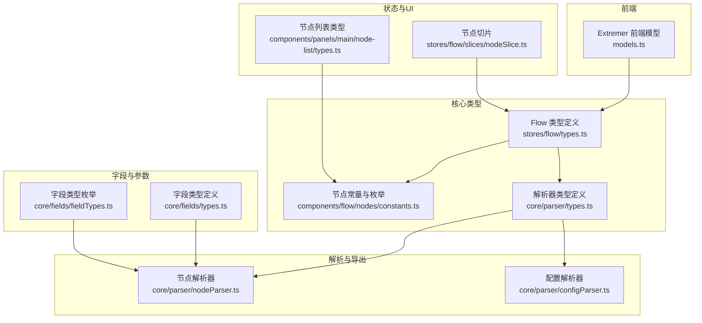
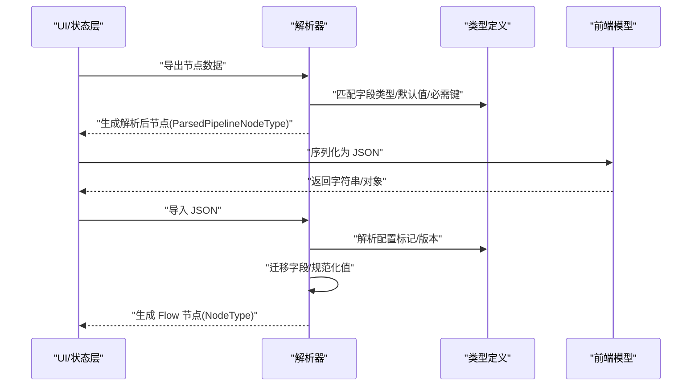
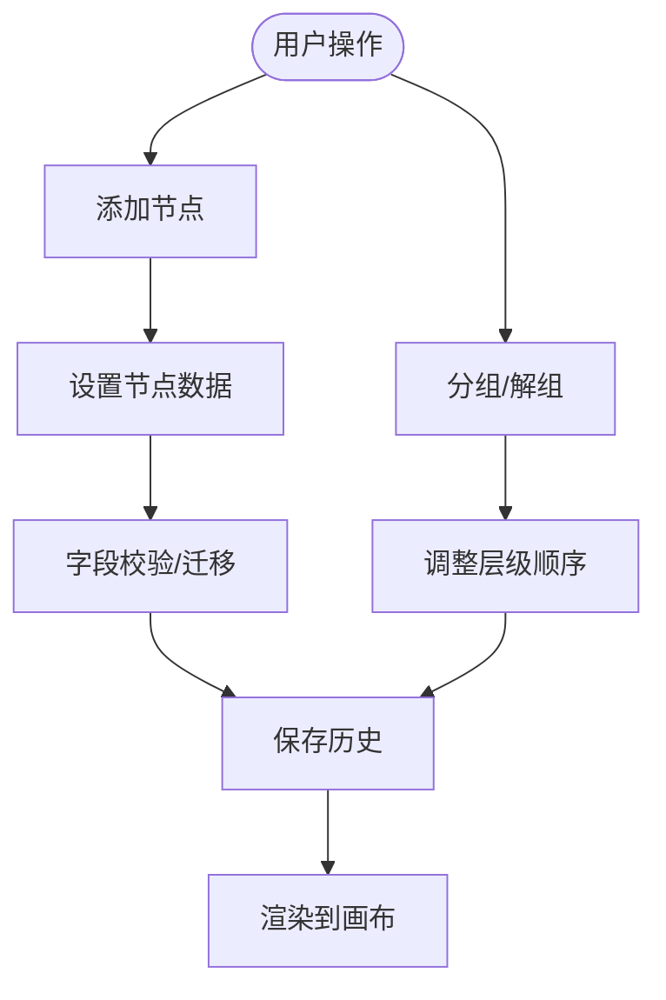
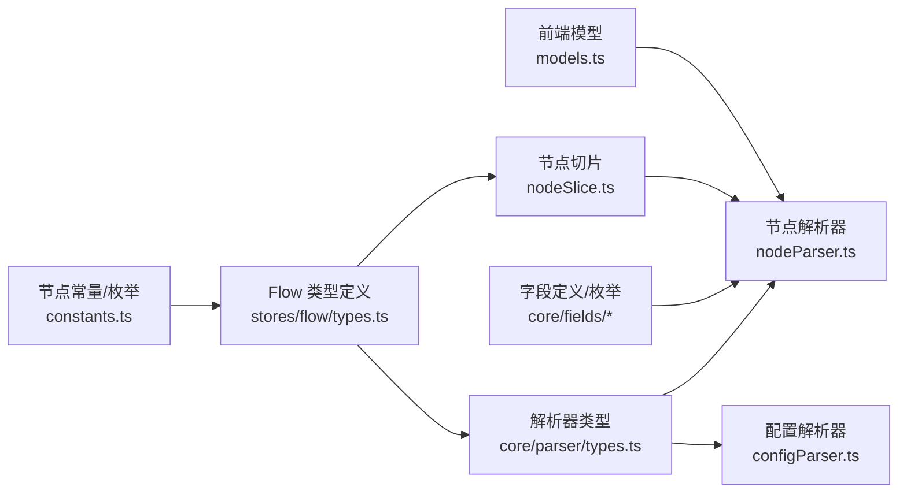

# 数据模型

<cite>
**本文引用的文件**
- [models.ts](file://Extremer/frontend/wailsjs/go/models.ts)
- [types.ts](file://src/stores/flow/types.ts)
- [constants.ts](file://src/components/flow/nodes/constants.ts)
- [types.ts](file://src/core/parser/types.ts)
- [nodeParser.ts](file://src/core/parser/nodeParser.ts)
- [configParser.ts](file://src/core/parser/configParser.ts)
- [nodeSlice.ts](file://src/stores/flow/slices/nodeSlice.ts)
- [types.ts](file://src/core/fields/types.ts)
- [fieldTypes.ts](file://src/core/fields/fieldTypes.ts)
- [types.ts](file://src/components/panels/main/node-list/types.ts)
</cite>

## 目录
1. [简介](#简介)
2. [项目结构](#项目结构)
3. [核心组件](#核心组件)
4. [架构总览](#架构总览)
5. [详细组件分析](#详细组件分析)
6. [依赖分析](#依赖分析)
7. [性能考虑](#性能考虑)
8. [故障排查指南](#故障排查指南)
9. [结论](#结论)
10. [附录](#附录)

## 简介
本文件系统性梳理本项目的“数据模型”体系，聚焦于核心数据结构与类型定义，包括 NodeType、PipelineNodeDataType、EdgeType、ParamType 等关键模型；阐明它们之间的关系与依赖（父子关系、引用关系、继承关系等）；解释序列化与反序列化机制（JSON 转换、版本兼容等）；给出使用示例与最佳实践（数据验证、类型安全、性能优化等），并说明数据模型与 UI 组件的绑定关系及状态管理策略。

## 项目结构
围绕数据模型的关键代码分布在以下模块：
- 前端类型与序列化：Extremer 前端 Wails JS 模型导出
- 流式图与节点/边模型：Flow Store 类型与切片
- 节点类型与句柄方向：节点类型枚举与方向常量
- 解析与导出：解析器类型、节点解析、配置解析
- 字段与参数：字段类型定义、字段类型枚举
- 节点列表展示：节点列表项与分组类型



图表来源
- [models.ts:1-28](file://Extremer/frontend/wailsjs/go/models.ts#L1-L28)
- [types.ts:1-362](file://src/stores/flow/types.ts#L1-L362)
- [constants.ts:1-47](file://src/components/flow/nodes/constants.ts#L1-L47)
- [types.ts:1-107](file://src/core/parser/types.ts#L1-L107)
- [nodeParser.ts:1-372](file://src/core/parser/nodeParser.ts#L1-L372)
- [configParser.ts:1-69](file://src/core/parser/configParser.ts#L1-L69)
- [types.ts:1-34](file://src/core/fields/types.ts#L1-L34)
- [fieldTypes.ts:1-27](file://src/core/fields/fieldTypes.ts#L1-L27)
- [nodeSlice.ts:1-691](file://src/stores/flow/slices/nodeSlice.ts#L1-L691)
- [types.ts:1-64](file://src/components/panels/main/node-list/types.ts#L1-L64)

章节来源
- [models.ts:1-28](file://Extremer/frontend/wailsjs/go/models.ts#L1-L28)
- [types.ts:1-362](file://src/stores/flow/types.ts#L1-L362)
- [constants.ts:1-47](file://src/components/flow/nodes/constants.ts#L1-L47)
- [types.ts:1-107](file://src/core/parser/types.ts#L1-L107)
- [nodeParser.ts:1-372](file://src/core/parser/nodeParser.ts#L1-L372)
- [configParser.ts:1-69](file://src/core/parser/configParser.ts#L1-L69)
- [types.ts:1-34](file://src/core/fields/types.ts#L1-L34)
- [fieldTypes.ts:1-27](file://src/core/fields/fieldTypes.ts#L1-L27)
- [nodeSlice.ts:1-691](file://src/stores/flow/slices/nodeSlice.ts#L1-L691)
- [types.ts:1-64](file://src/components/panels/main/node-list/types.ts#L1-L64)

## 核心组件
本节对关键数据模型进行逐项解析，并说明其职责与边界。

- 节点类型枚举与句柄方向
  - NodeTypeEnum：定义五种节点类型（Pipeline、External、Anchor、Sticker、Group）
  - HandleDirection：定义四种端点方向（左右、右左、上下、下上）
  - SourceHandleTypeEnum、TargetHandleTypeEnum：定义节点源/目标句柄类型（next/on_error、target/jump_back）

- 边类型 EdgeType
  - 描述边的来源、目标、句柄类型、标签、类型、选择状态与自定义属性
  - 属性包括：id、source、sourceHandle、target、targetHandle、label、type、selected、attributes

- 参数类型 ParamType、RecognitionParamType、ActionParamType、OtherParamType
  - ParamType 为三者交集，承载识别、动作、其他参数的合并视图
  - RecognitionParamType：识别相关参数（ROI、阈值、模板、检测器、排序等）
  - ActionParamType：动作相关参数（坐标偏移、时长、按键、输入文本、执行命令等）
  - OtherParamType：通用控制参数（限流、超时、逆向、启用、前后延时等）

- Pipeline 节点数据类型 PipelineNodeDataType
  - 包含 label、recognition（type+param）、action（type+param）、others、extras、type、handleDirection
  - 作为 PipelineNodeType.data 字段承载

- 节点联合类型 NodeType
  - 联合了 PipelineNodeType、ExternalNodeType、AnchorNodeType、StickerNodeType、GroupNodeType
  - 通过 type 字段区分具体类型

- 前端模型（Wails JS）
  - UpdateInfo：用于更新信息的前端模型，包含序列化/反序列化辅助方法

章节来源
- [constants.ts:14-47](file://src/components/flow/nodes/constants.ts#L14-L47)
- [types.ts:28-38](file://src/stores/flow/types.ts#L28-L38)
- [types.ts:44-102](file://src/stores/flow/types.ts#L44-L102)
- [types.ts:108-122](file://src/stores/flow/types.ts#L108-L122)
- [types.ts:238-244](file://src/stores/flow/types.ts#L238-L244)
- [models.ts:3-24](file://Extremer/frontend/wailsjs/go/models.ts#L3-L24)

## 架构总览
数据模型贯穿“状态层（Flow Store）—解析层（Parser）—UI 展示（React Flow + Panels）—前端桥接（Wails JS）”。

```mermaid
classDiagram
class NodeTypeEnum {
+Pipeline
+External
+Anchor
+Sticker
+Group
}
class HandleDirection {
+"left-right"
+"right-left"
+"top-bottom"
+"bottom-top"
}
class EdgeType {
+id : string
+source : string
+sourceHandle
+target : string
+targetHandle
+label : number
+type : "marked"
+selected? : boolean
+attributes? : EdgeAttributesType
}
class ParamType {
}
class RecognitionParamType {
}
class ActionParamType {
}
class OtherParamType {
}
class PipelineNodeDataType {
+label : string
+recognition : {type,param}
+action : {type,param}
+others : OtherParamType
+extras? : any
+type? : NodeTypeEnum
+handleDirection? : HandleDirection
}
class NodeType {
}
NodeTypeEnum <.. NodeType : "区分类型"
HandleDirection <.. NodeType : "附加方向"
ParamType <|-- RecognitionParamType
ParamType <|-- ActionParamType
ParamType <|-- OtherParamType
NodeType --> PipelineNodeDataType : "Pipeline 节点数据"
EdgeType ..> NodeType : "连接关系"
```

图表来源
- [constants.ts:14-47](file://src/components/flow/nodes/constants.ts#L14-L47)
- [types.ts:28-38](file://src/stores/flow/types.ts#L28-L38)
- [types.ts:44-102](file://src/stores/flow/types.ts#L44-L102)
- [types.ts:108-122](file://src/stores/flow/types.ts#L108-L122)
- [types.ts:238-244](file://src/stores/flow/types.ts#L238-L244)

## 详细组件分析

### 节点与边的数据模型
- 节点数据结构
  - PipelineNodeType：包含 id、type、data（PipelineNodeDataType）、position、拖拽/选择状态、测量宽高
  - 其他节点类型（External/Anchor/Sticker/Group）结构类似，但 data 不同
- 边数据结构
  - EdgeType：描述连接关系，包含句柄类型、标签、属性（如跳转回、锚点）

- 节点与边的关系
  - 边的 source/target 指向节点 id
  - 句柄类型决定连接方向与语义（next/on_error、target/jump_back）

章节来源
- [types.ts:166-235](file://src/stores/flow/types.ts#L166-L235)
- [types.ts:28-38](file://src/stores/flow/types.ts#L28-L38)

### 参数模型与字段系统
- ParamType 为识别、动作、其他参数的交集，确保统一访问入口
- RecognitionParamType 与 ActionParamType 定义丰富的参数键，覆盖 ROI、阈值、模板、检测器、坐标偏移、时长、按键、输入文本、执行命令等
- OtherParamType 提供通用控制参数，如限流、超时、逆向、启用、前后延时等

- 字段类型定义
  - FieldType：字段键、类型（可为枚举或枚举数组）、是否必需、默认值、步长、描述、子字段列表、显示名等
  - FieldsType：字段集合，包含参数列表与描述
  - ParamKeysType：字段键集合（全部、必需、必需默认值）

- 字段类型枚举
  - FieldTypeEnum：整数、浮点、布尔、字符串、列表、二维数组、位置列表、图像路径等

章节来源
- [types.ts:108-122](file://src/stores/flow/types.ts#L108-L122)
- [types.ts:44-102](file://src/stores/flow/types.ts#L44-L102)
- [types.ts:6-24](file://src/core/fields/types.ts#L6-L24)
- [types.ts:29-33](file://src/core/fields/types.ts#L29-L33)
- [fieldTypes.ts:4-26](file://src/core/fields/fieldTypes.ts#L4-L26)

### 解析与序列化机制
- 导出流程（节点 → Pipeline 对象）
  - parsePipelineNodeForExport：按协议版本（v1/v2）输出识别/动作参数，支持平铺或嵌套；处理默认识别/动作的导出开关；保留位置与句柄方向；分离并过滤 focus；合并 extras；兼容旧版配置标记
  - parseExternalNodeForExport、parseAnchorNodeForExport、parseStickerNodeForExport、parseGroupNodeForExport：分别处理外部、重定向、便签、分组节点的位置与元信息导出
  - parseRecognitionField、parseActionField：根据版本迁移识别/动作字段结构与特殊值（如 method）

- 导入流程（Pipeline 对象 → Flow 节点）
  - parseNodeField：根据键映射识别/动作/其他字段，处理 v1 平铺参数与 v2 对象参数，执行字段规范化与版本迁移
  - isConfigKey、isMark、getConfigMark：识别并提取配置标记，兼容新旧版本标记键
  - parsePipelineConfig：解析顶层配置对象，兼容多版本标记

- 版本兼容性
  - 协议版本由配置控制（skipFieldValidation、exportDefaultRecoAction、pipelineProtocolVersion）
  - 版本探测与归一化函数用于迁移旧字段值（如 method）

- JSON 转换与前端模型
  - 前端模型 UpdateInfo 支持从字符串/对象构造，便于跨语言传递与序列化



图表来源
- [nodeParser.ts:21-147](file://src/core/parser/nodeParser.ts#L21-L147)
- [nodeParser.ts:154-259](file://src/core/parser/nodeParser.ts#L154-L259)
- [configParser.ts:47-68](file://src/core/parser/configParser.ts#L47-L68)
- [types.ts:24-43](file://src/core/parser/types.ts#L24-L43)
- [models.ts:11-23](file://Extremer/frontend/wailsjs/go/models.ts#L11-L23)

章节来源
- [nodeParser.ts:1-372](file://src/core/parser/nodeParser.ts#L1-L372)
- [configParser.ts:1-69](file://src/core/parser/configParser.ts#L1-L69)
- [types.ts:24-43](file://src/core/parser/types.ts#L24-L43)
- [models.ts:11-23](file://Extremer/frontend/wailsjs/go/models.ts#L11-L23)

### 状态管理与 UI 绑定
- 节点切片（nodeSlice）
  - 维护 nodes 数组、节点 ID 计数器、节点增删改查、分组/解组、历史记录保存
  - setNodeData/batchSetNodeData：深拷贝节点，按 type（recognition/action/others/type）更新参数，自动清理/填充必需字段
  - addNode：根据类型创建节点，分配 label/id，计算位置，支持链接已选节点、聚焦视图、保存历史
  - groupSelectedNodes/ungroupNodes/attach/detach：基于父节点关系实现分组与子节点相对/绝对坐标转换

- 节点列表类型
  - NodeListItemInfo：封装节点基本信息（id、label、nodeType、识别/动作类型与参数、入出边计数、模板路径等）
  - NodeGroup：按 NodeTypeEnum 分组，包含名称与图标



图表来源
- [nodeSlice.ts:133-288](file://src/stores/flow/slices/nodeSlice.ts#L133-L288)
- [nodeSlice.ts:291-394](file://src/stores/flow/slices/nodeSlice.ts#L291-L394)
- [nodeSlice.ts:524-598](file://src/stores/flow/slices/nodeSlice.ts#L524-L598)
- [types.ts:10-33](file://src/components/panels/main/node-list/types.ts#L10-L33)

章节来源
- [nodeSlice.ts:1-691](file://src/stores/flow/slices/nodeSlice.ts#L1-L691)
- [types.ts:10-33](file://src/components/panels/main/node-list/types.ts#L10-L33)

## 依赖分析
- 组件耦合与内聚
  - Flow Store 类型与切片高度内聚，统一管理节点/边/视口/历史等状态
  - 解析器依赖字段定义与类型匹配器，保证导出/导入一致性
  - UI 层通过节点切片与解析器间接依赖类型定义

- 直接与间接依赖
  - nodeSlice 依赖 constants（节点类型/句柄方向）、fields（字段键集合）、utils（节点工具）
  - nodeParser 依赖 fields（字段模式）、jsonHelper（JSON 辅助）、versionDetector（版本迁移）
  - configParser 依赖解析器常量（configMark 等）

- 循环依赖
  - 当前结构未见循环依赖迹象；类型定义位于独立文件，解析器与切片通过类型引用而非反向依赖

- 外部依赖与集成点
  - @xyflow/react：节点/边变更应用、实例管理
  - 前端桥接：Wails JS 模型用于跨语言数据交换



图表来源
- [constants.ts:14-47](file://src/components/flow/nodes/constants.ts#L14-L47)
- [types.ts:1-362](file://src/stores/flow/types.ts#L1-L362)
- [nodeSlice.ts:1-691](file://src/stores/flow/slices/nodeSlice.ts#L1-L691)
- [types.ts:1-107](file://src/core/parser/types.ts#L1-L107)
- [nodeParser.ts:1-372](file://src/core/parser/nodeParser.ts#L1-L372)
- [configParser.ts:1-69](file://src/core/parser/configParser.ts#L1-L69)
- [types.ts:1-34](file://src/core/fields/types.ts#L1-L34)
- [fieldTypes.ts:1-27](file://src/core/fields/fieldTypes.ts#L1-L27)
- [models.ts:1-28](file://Extremer/frontend/wailsjs/go/models.ts#L1-L28)

章节来源
- [constants.ts:1-47](file://src/components/flow/nodes/constants.ts#L1-L47)
- [types.ts:1-362](file://src/stores/flow/types.ts#L1-L362)
- [nodeSlice.ts:1-691](file://src/stores/flow/slices/nodeSlice.ts#L1-L691)
- [types.ts:1-107](file://src/core/parser/types.ts#L1-L107)
- [nodeParser.ts:1-372](file://src/core/parser/nodeParser.ts#L1-L372)
- [configParser.ts:1-69](file://src/core/parser/configParser.ts#L1-L69)
- [types.ts:1-34](file://src/core/fields/types.ts#L1-L34)
- [fieldTypes.ts:1-27](file://src/core/fields/fieldTypes.ts#L1-L27)
- [models.ts:1-28](file://Extremer/frontend/wailsjs/go/models.ts#L1-L28)

## 性能考虑
- 深拷贝与不可变更新
  - setNodeData/batchSetNodeData 使用深拷贝策略，避免共享引用导致的副作用，同时注意数组/对象副本的创建成本
- 批量更新
  - batchSetNodeData 一次性应用多个更新，减少多次状态变更带来的重渲染与历史保存开销
- 历史记录保存
  - 节点移动/删除触发历史保存，拖拽场景延迟保存以提升交互流畅度
- 字段校验与迁移
  - 通过字段键集合与默认值自动清理/填充，降低运行期校验成本
- 导出/导入
  - 按协议版本输出/解析，避免冗余字段与重复转换

## 故障排查指南
- 节点名称重复
  - 通过节点切片的重复检查逻辑，结合错误存储提示重复标签
- 字段不合法或缺失
  - setNodeData/setNodeData 中按字段类型与必需键自动清理/填充，若仍报错，检查字段类型枚举与默认值配置
- 导入失败或版本不兼容
  - 检查配置标记键（configMark、旧版标记）与版本探测函数，确认识别/动作字段迁移是否正确
- 边连接异常
  - 确认句柄类型与方向一致（next/on_error、target/jump_back），以及 source/target 节点存在

章节来源
- [nodeSlice.ts:378-391](file://src/stores/flow/slices/nodeSlice.ts#L378-L391)
- [nodeParser.ts:322-371](file://src/core/parser/nodeParser.ts#L322-L371)
- [configParser.ts:9-24](file://src/core/parser/configParser.ts#L9-L24)

## 结论
本项目的数据模型以 Flow Store 类型为核心，配合解析器与字段系统，实现了从 UI 到 JSON 的双向转换与版本兼容。通过明确的节点/边/参数模型、严格的字段类型与默认值约束、以及完善的序列化/反序列化流程，保障了类型安全与可维护性。建议在扩展新节点类型或参数时，遵循现有模式，保持字段定义、类型匹配与解析迁移的一致性。

## 附录
- 使用示例与最佳实践
  - 新增节点：通过 addNode 指定类型与初始数据，自动分配 label/id 并保存历史
  - 修改参数：使用 setNodeData 或 batchSetNodeData，按 type（recognition/action/others/type）更新，自动清理/填充必需字段
  - 导出配置：根据配置开关与协议版本，导出识别/动作参数与位置信息
  - 版本迁移：导入时自动识别配置标记与版本，迁移特殊字段值
- 类型安全与验证
  - 优先使用 FieldTypeEnum 与字段键集合，避免硬编码键名
  - 在开发阶段启用字段校验，生产环境可按需关闭
- 性能优化
  - 大批量更新使用 batchSetNodeData
  - 避免不必要的深拷贝，仅在必要时复制对象/数组
  - 控制历史保存频率，提升拖拽与编辑体验