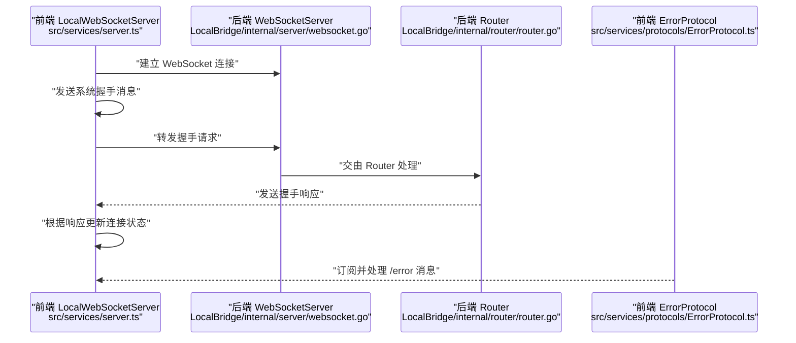
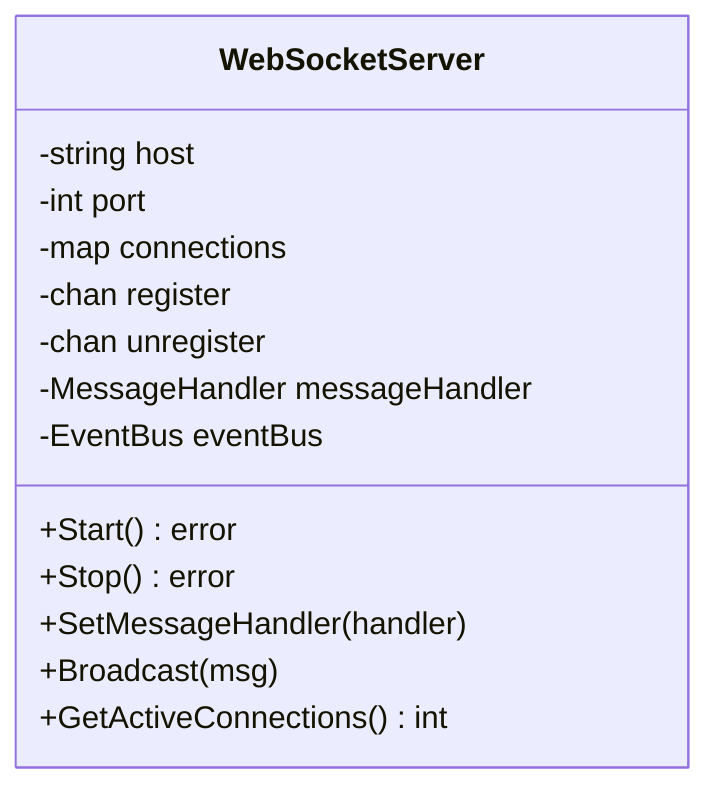
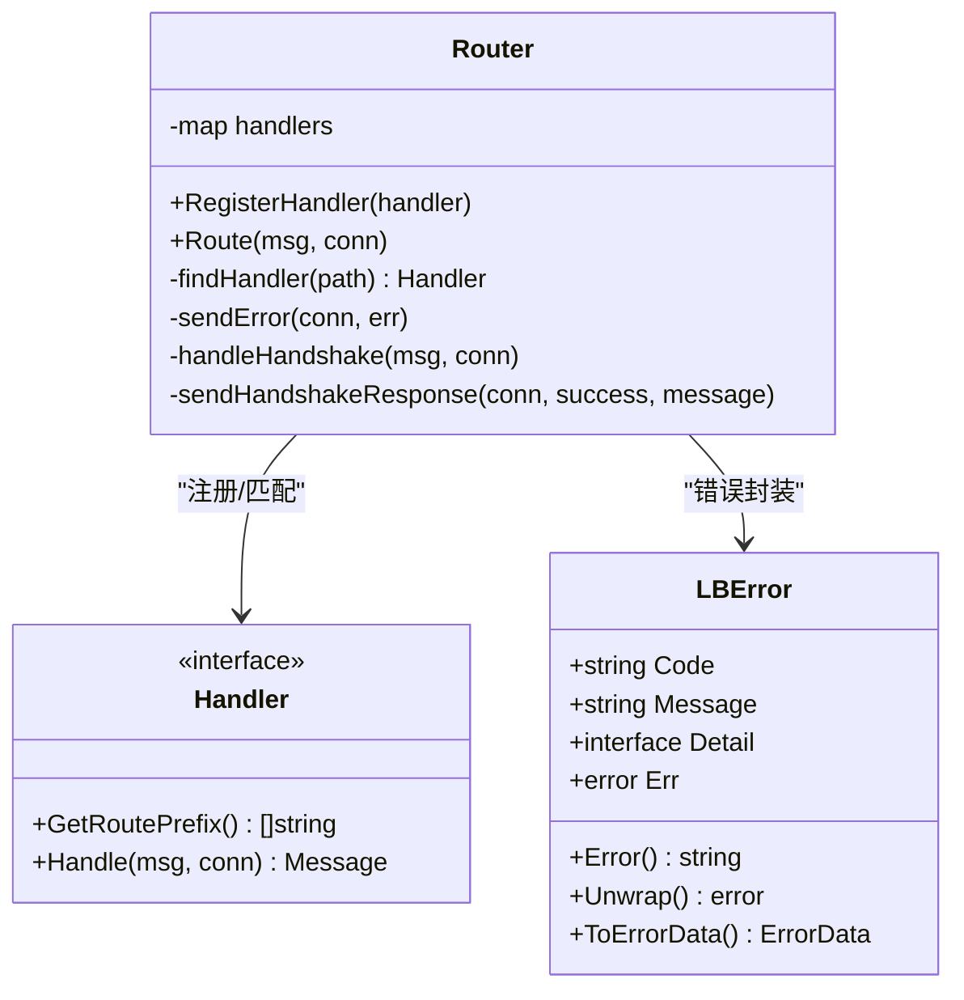
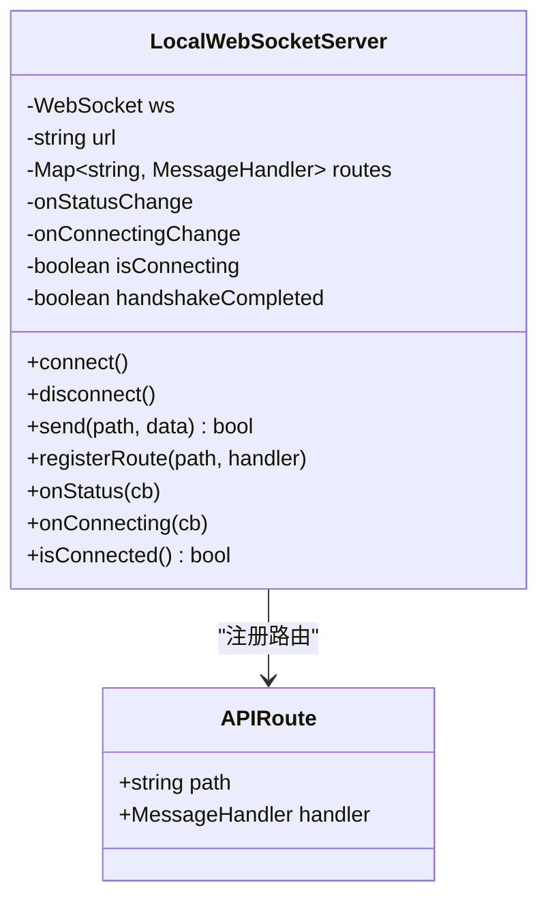
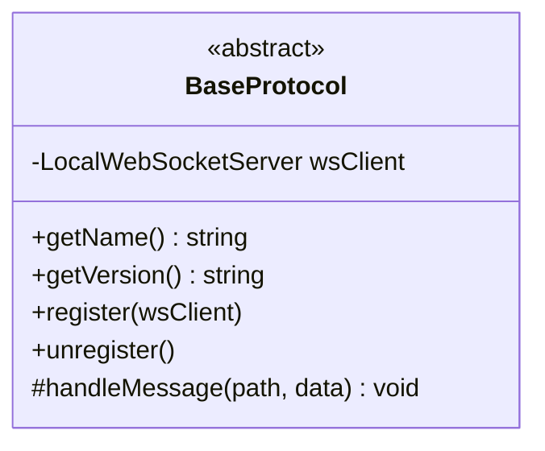
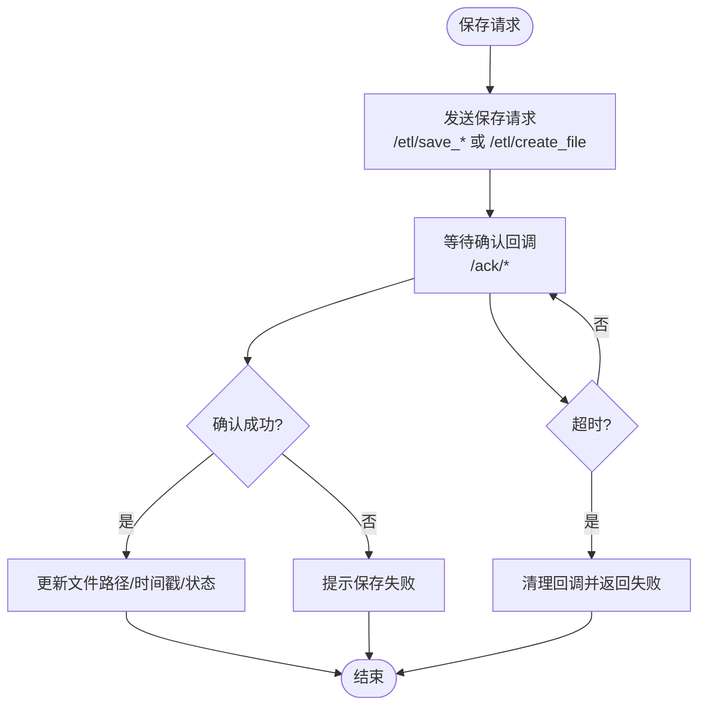
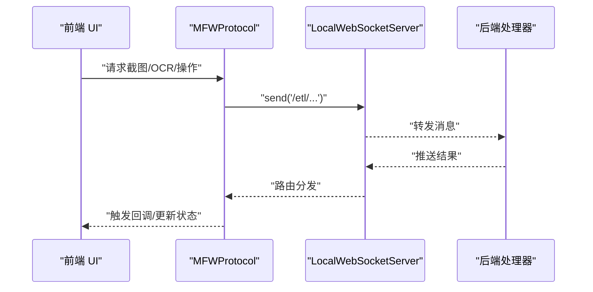
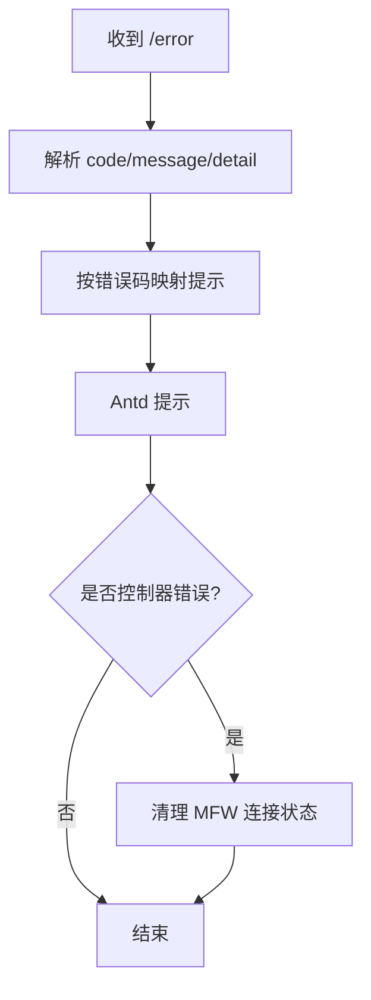
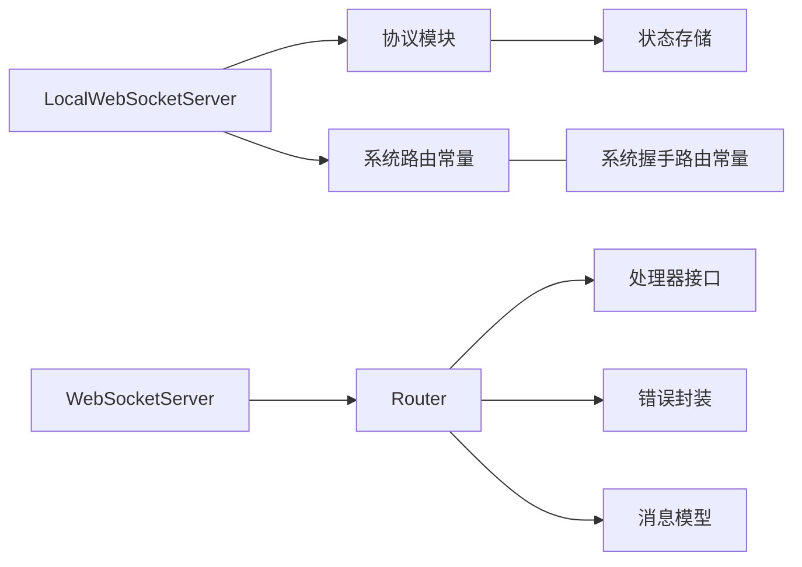

# 服务层类型

<cite>
**本文引用的文件**
- [message.go](file://LocalBridge/pkg/models/message.go)
- [websocket.go](file://LocalBridge/internal/server/websocket.go)
- [router.go](file://LocalBridge/internal/router/router.go)
- [errors.go](file://LocalBridge/internal/errors/errors.go)
- [types.go](file://LocalBridge/internal/mfw/types.go)
- [type.ts](file://src/services/type.ts)
- [server.ts](file://src/services/server.ts)
- [BaseProtocol.ts](file://src/services/protocols/BaseProtocol.ts)
- [FileProtocol.ts](file://src/services/protocols/FileProtocol.ts)
- [MFWProtocol.ts](file://src/services/protocols/MFWProtocol.ts)
- [ErrorProtocol.ts](file://src/services/protocols/ErrorProtocol.ts)
- [wsStore.ts](file://src/stores/wsStore.ts)
- [errorStore.ts](file://src/stores/errorStore.ts)
</cite>

## 目录
1. [引言](#引言)
2. [项目结构](#项目结构)
3. [核心组件](#核心组件)
4. [架构总览](#架构总览)
5. [详细组件分析](#详细组件分析)
6. [依赖分析](#依赖分析)
7. [性能考虑](#性能考虑)
8. [故障排查指南](#故障排查指南)
9. [结论](#结论)
10. [附录](#附录)

## 引言
本文件聚焦“服务层类型”，系统性梳理并解释以下内容：
- WebSocket 服务相关的类型定义：消息格式、协议结构与通信模式
- 服务层与前端 UI 的接口类型与数据传输格式
- 服务层的错误处理类型与异常管理机制
- 实际使用示例：API 调用、数据获取与状态更新流程
- 类型安全的异步操作与错误处理在类型系统中的支撑

目标是帮助开发者在不深入源码细节的前提下，准确理解并正确使用服务层类型。

## 项目结构
服务层类型横跨后端 Go 与前端 TypeScript 两部分：
- 后端 Go 定义了 WebSocket 服务器、消息模型、路由分发与错误封装
- 前端 TypeScript 定义了 WebSocket 客户端、协议抽象、具体协议模块以及状态存储

```mermaid
graph TB
subgraph "前端 TypeScript"
TS_Server["LocalWebSocketServer<br/>src/services/server.ts"]
TS_Type["类型定义<br/>src/services/type.ts"]
TS_Protocols["协议模块<br/>src/services/protocols/*"]
TS_Stores["状态存储<br/>src/stores/*"]
end
subgraph "后端 Go"
GO_WS["WebSocketServer<br/>LocalBridge/internal/server/websocket.go"]
GO_Router["Router<br/>LocalBridge/internal/router/router.go"]
GO_Models["消息与数据模型<br/>LocalBridge/pkg/models/message.go"]
GO_Errors["错误封装<br/>LocalBridge/internal/errors/errors.go"]
GO_MFW["MFW 类型<br/>LocalBridge/internal/mfw/types.go"]
end
TS_Server --> TS_Type
TS_Server --> TS_Protocols
TS_Protocols --> TS_Stores
TS_Server <- --> GO_WS
GO_WS --> GO_Router
GO_Router --> GO_Models
GO_Router --> GO_Errors
GO_Router --> GO_MFW
```

图表来源
- [server.ts:1-373](file://src/services/server.ts#L1-L373)
- [type.ts:1-28](file://src/services/type.ts#L1-L28)
- [websocket.go:1-179](file://LocalBridge/internal/server/websocket.go#L1-L179)
- [router.go:1-151](file://LocalBridge/internal/router/router.go#L1-L151)
- [message.go:1-126](file://LocalBridge/pkg/models/message.go#L1-L126)
- [errors.go:1-141](file://LocalBridge/internal/errors/errors.go#L1-L141)
- [types.go:1-124](file://LocalBridge/internal/mfw/types.go#L1-L124)

章节来源
- [server.ts:1-373](file://src/services/server.ts#L1-L373)
- [websocket.go:1-179](file://LocalBridge/internal/server/websocket.go#L1-L179)
- [router.go:1-151](file://LocalBridge/internal/router/router.go#L1-L151)
- [message.go:1-126](file://LocalBridge/pkg/models/message.go#L1-L126)
- [errors.go:1-141](file://LocalBridge/internal/errors/errors.go#L1-L141)
- [types.go:1-124](file://LocalBridge/internal/mfw/types.go#L1-L124)

## 核心组件
- 消息与协议模型
  - 通用消息结构、错误数据结构、文件与日志等数据模型
  - 前端系统路由与握手请求/响应类型
- WebSocket 服务端
  - 服务器生命周期、连接管理、广播与握手路由
- 路由分发与错误处理
  - 路由处理器注册、前缀匹配、错误消息下发
- 前端 WebSocket 客户端
  - 连接、握手、消息派发、状态回调与超时控制
- 协议模块
  - 抽象协议基类与具体协议（文件、MFW、错误等）
- 错误处理与状态存储
  - 后端错误封装与前端错误展示、连接状态存储

章节来源
- [message.go:1-126](file://LocalBridge/pkg/models/message.go#L1-L126)
- [type.ts:1-28](file://src/services/type.ts#L1-L28)
- [websocket.go:1-179](file://LocalBridge/internal/server/websocket.go#L1-L179)
- [router.go:1-151](file://LocalBridge/internal/router/router.go#L1-L151)
- [errors.go:1-141](file://LocalBridge/internal/errors/errors.go#L1-L141)
- [BaseProtocol.ts:1-40](file://src/services/protocols/BaseProtocol.ts#L1-L40)
- [FileProtocol.ts:1-607](file://src/services/protocols/FileProtocol.ts#L1-L607)
- [MFWProtocol.ts:1-774](file://src/services/protocols/MFWProtocol.ts#L1-L774)
- [ErrorProtocol.ts:1-68](file://src/services/protocols/ErrorProtocol.ts#L1-L68)
- [wsStore.ts:1-24](file://src/stores/wsStore.ts#L1-L24)

## 架构总览
服务层类型驱动的通信链路如下：
- 前端通过 LocalWebSocketServer 建立 WebSocket 连接
- 发送系统握手消息进行协议版本协商
- 注册各协议模块的路由，实现文件、MFW、错误等领域的消息收发
- 后端通过 Router 将消息分发至对应处理器，统一错误封装并通过 /error 下发



图表来源
- [server.ts:104-251](file://src/services/server.ts#L104-L251)
- [websocket.go:144-161](file://LocalBridge/internal/server/websocket.go#L144-L161)
- [router.go:107-150](file://LocalBridge/internal/router/router.go#L107-L150)
- [ErrorProtocol.ts:19-66](file://src/services/protocols/ErrorProtocol.ts#L19-L66)

## 详细组件分析

### WebSocket 服务端类型与通信模式
- 服务器结构与生命周期
  - 服务器包含主机、端口、连接集合、注册/注销通道、消息处理器与事件总线
  - 提供启动、停止、连接管理与广播能力
- 连接管理
  - 通过 goroutine 管理注册/注销事件，维护活跃连接数
  - 升级 HTTP 连接为 WebSocket，启动读写 pump 协程
- 握手路由
  - 系统握手与响应路由常量定义，便于前后端一致引用



图表来源
- [websocket.go:35-46](file://LocalBridge/internal/server/websocket.go#L35-L46)

章节来源
- [websocket.go:1-179](file://LocalBridge/internal/server/websocket.go#L1-L179)

### 路由分发与错误处理类型
- 路由器
  - Handler 接口定义路由前缀与消息处理
  - Router 支持精确与前缀匹配，找不到处理器时统一返回错误
- 错误封装
  - 后端定义 LBError 结构与常用错误码
  - 提供 ToErrorData 方法将错误转换为前端可消费的 ErrorData



图表来源
- [router.go:19-93](file://LocalBridge/internal/router/router.go#L19-L93)
- [errors.go:22-50](file://LocalBridge/internal/errors/errors.go#L22-L50)

章节来源
- [router.go:1-151](file://LocalBridge/internal/router/router.go#L1-L151)
- [errors.go:1-141](file://LocalBridge/internal/errors/errors.go#L1-L141)

### 前端 WebSocket 客户端与协议类型
- 客户端类 LocalWebSocketServer
  - 维护 WebSocket 实例、路由表、连接状态回调与超时控制
  - 提供 connect、disconnect、send、onStatus/onConnecting 等能力
  - 在握手响应后更新连接状态并触发 UI 提示
- 协议类型
  - 系统路由常量与握手请求/响应接口
  - MessageHandler 与 APIRoute 接口，统一消息处理签名



图表来源
- [server.ts:20-331](file://src/services/server.ts#L20-L331)
- [type.ts:24-27](file://src/services/type.ts#L24-L27)

章节来源
- [server.ts:1-373](file://src/services/server.ts#L1-L373)
- [type.ts:1-28](file://src/services/type.ts#L1-L28)

### 协议模块与数据模型

#### 抽象协议基类
- BaseProtocol 定义协议名称、版本、注册与消息处理入口
- 为具体协议模块提供统一的生命周期与消息分发框架



图表来源
- [BaseProtocol.ts:7-39](file://src/services/protocols/BaseProtocol.ts#L7-L39)

章节来源
- [BaseProtocol.ts:1-40](file://src/services/protocols/BaseProtocol.ts#L1-L40)

#### 文件协议（FileProtocol）
- 负责文件列表、内容、变更通知与保存/创建确认的收发
- 维护保存确认回调队列与超时机制，保证类型安全的异步确认
- 与前端文件与本地文件状态存储交互，驱动 UI 更新



图表来源
- [FileProtocol.ts:396-417](file://src/services/protocols/FileProtocol.ts#L396-L417)
- [FileProtocol.ts:560-605](file://src/services/protocols/FileProtocol.ts#L560-L605)

章节来源
- [FileProtocol.ts:1-607](file://src/services/protocols/FileProtocol.ts#L1-L607)

#### MFW 协议（MFWProtocol）
- 负责设备列表、控制器创建/状态、截图、OCR、日志与各类控制器操作
- 提供回调注册机制，支持多处订阅同一类结果
- 与 MFW 状态存储交互，驱动 UI 展示与控制



图表来源
- [MFWProtocol.ts:433-449](file://src/services/protocols/MFWProtocol.ts#L433-L449)
- [MFWProtocol.ts:574-772](file://src/services/protocols/MFWProtocol.ts#L574-L772)

章节来源
- [MFWProtocol.ts:1-774](file://src/services/protocols/MFWProtocol.ts#L1-L774)

#### 错误协议（ErrorProtocol）
- 统一订阅 /error 消息，根据错误码映射为用户可读提示
- 对特定控制器错误清理连接状态，避免 UI 误导



图表来源
- [ErrorProtocol.ts:26-66](file://src/services/protocols/ErrorProtocol.ts#L26-L66)

章节来源
- [ErrorProtocol.ts:1-68](file://src/services/protocols/ErrorProtocol.ts#L1-L68)

### 数据模型与消息格式
- 通用消息结构
  - path: 路由路径；data: 消息体
- 错误数据结构
  - code: 错误码；message: 描述；detail: 可选详情
- 文件相关模型
  - 文件信息、文件列表、文件内容、文件变更、保存/创建确认等
- 日志与握手模型
  - 日志条目、版本握手请求/响应
- MFW 相关模型
  - 设备信息、控制器/资源/任务信息、截图请求/结果、操作类型与结果

章节来源
- [message.go:1-126](file://LocalBridge/pkg/models/message.go#L1-L126)
- [types.go:1-124](file://LocalBridge/internal/mfw/types.go#L1-L124)

### 前端 UI 接口与状态更新
- 连接状态存储
  - connected/connecting 状态与 setter，供 UI 组件订阅
- 错误状态存储
  - 错误类型枚举与错误集合管理，支持按类型过滤与覆盖
- 协议模块与状态联动
  - FileProtocol 与 MFWProtocol 通过状态存储驱动 UI 更新（文件列表、内容、设备、控制器状态等）

章节来源
- [wsStore.ts:1-24](file://src/stores/wsStore.ts#L1-L24)
- [errorStore.ts:1-39](file://src/stores/errorStore.ts#L1-L39)
- [FileProtocol.ts:78-103](file://src/services/protocols/FileProtocol.ts#L78-L103)
- [MFWProtocol.ts:105-141](file://src/services/protocols/MFWProtocol.ts#L105-L141)

## 依赖分析
- 前端依赖
  - LocalWebSocketServer 依赖协议模块与状态存储
  - 协议模块依赖 LocalWebSocketServer 的 send 与注册能力
- 后端依赖
  - WebSocketServer 依赖事件总线与日志
  - Router 依赖处理器接口与错误封装
- 跨语言一致性
  - 前后端均定义系统握手路由常量，确保路径一致
  - 错误码与消息结构在两端保持语义一致



图表来源
- [server.ts:335-372](file://src/services/server.ts#L335-L372)
- [websocket.go:18-22](file://LocalBridge/internal/server/websocket.go#L18-L22)
- [router.go:13-17](file://LocalBridge/internal/router/router.go#L13-L17)

章节来源
- [server.ts:1-373](file://src/services/server.ts#L1-L373)
- [websocket.go:1-179](file://LocalBridge/internal/server/websocket.go#L1-L179)
- [router.go:1-151](file://LocalBridge/internal/router/router.go#L1-L151)

## 性能考虑
- 连接池与广播
  - 后端通过 map 维护连接，广播时遍历连接，注意连接数量增长带来的开销
- 路由匹配
  - Router 支持前缀匹配，处理器数量增多时建议优化匹配策略
- 前端回调与状态更新
  - 协议模块回调数组增长可能影响事件分发性能，建议按需清理
- 超时与资源回收
  - 前端连接超时与保存确认超时，避免悬挂状态占用内存

## 故障排查指南
- 连接失败/超时
  - 检查 LocalWebSocketServer 的连接回调与超时逻辑，确认端口与服务状态
- 协议版本不匹配
  - 查看握手响应中的 required_version，并按提示更新
- 保存/创建失败
  - 检查 /ack/* 路由处理与回调清理，确认超时与错误提示
- 控制器错误
  - ErrorProtocol 会清理控制器连接状态，确认设备/资源配置

章节来源
- [server.ts:104-251](file://src/services/server.ts#L104-L251)
- [router.go:107-150](file://LocalBridge/internal/router/router.go#L107-L150)
- [ErrorProtocol.ts:26-66](file://src/services/protocols/ErrorProtocol.ts#L26-L66)

## 结论
服务层类型通过清晰的消息模型、严格的协议版本控制与完善的错误处理机制，实现了前后端一致的通信契约。前端以协议模块为单位扩展功能，后端以处理器为单位解耦业务，配合类型系统保障了异步操作与错误处理的可靠性与可维护性。

## 附录

### 实际使用示例（步骤说明）
- 建立连接与握手
  - 初始化 LocalWebSocketServer，注册 ErrorProtocol 与其他协议
  - 调用 connect，等待握手响应，更新连接状态
- 发送文件保存请求
  - 调用 FileProtocol.requestSaveSeparated 或 requestCreateFile
  - 等待 /ack/* 确认，处理成功/失败与 UI 更新
- 请求截图与 OCR
  - 调用 MFWProtocol.requestScreencap 或 requestOCR
  - 注册回调，等待结果并渲染到 UI
- 错误处理
  - 订阅 /error，根据错误码映射提示，必要时清理控制器状态

章节来源
- [server.ts:348-372](file://src/services/server.ts#L348-L372)
- [FileProtocol.ts:396-417](file://src/services/protocols/FileProtocol.ts#L396-L417)
- [MFWProtocol.ts:433-449](file://src/services/protocols/MFWProtocol.ts#L433-L449)
- [ErrorProtocol.ts:19-66](file://src/services/protocols/ErrorProtocol.ts#L19-L66)