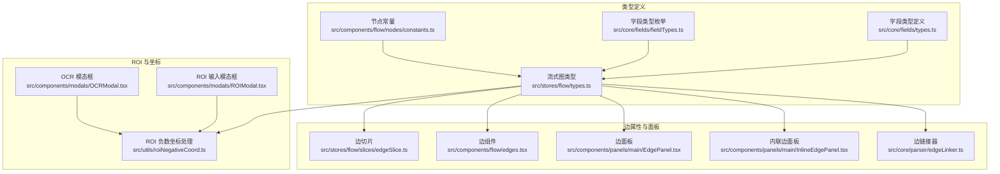
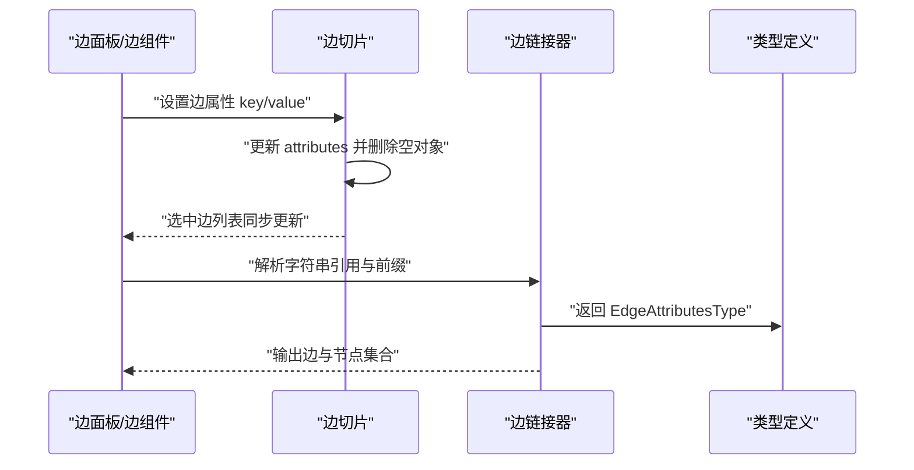
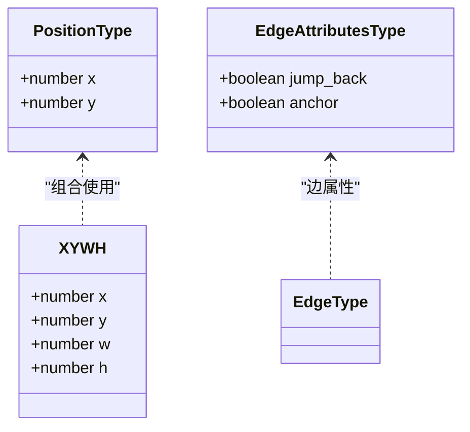
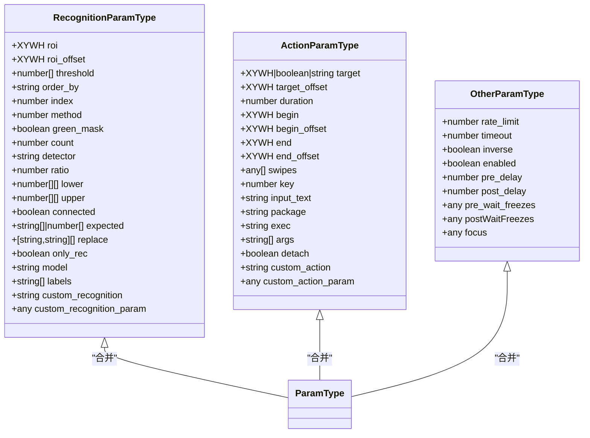
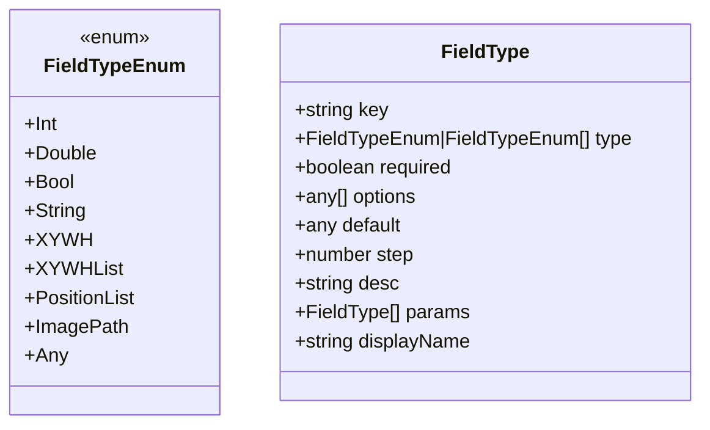
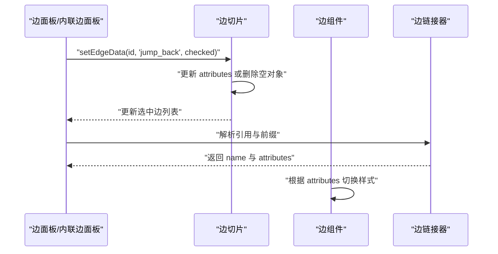
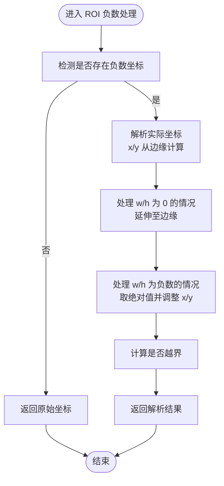
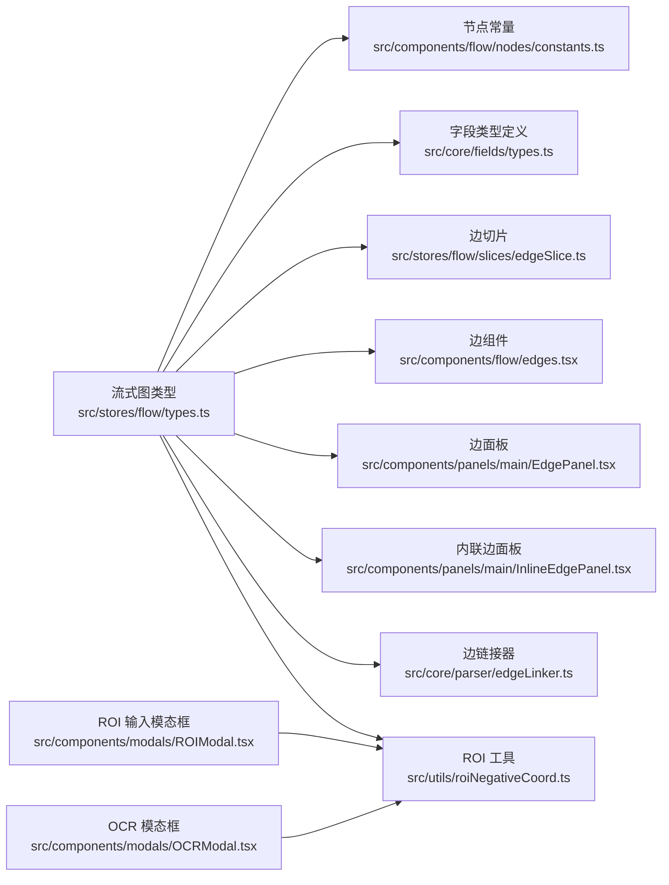

# 核心类型定义

<cite>
**本文引用的文件**
- [src/stores/flow/types.ts](file://src/stores/flow/types.ts)
- [src/components/flow/nodes/constants.ts](file://src/components/flow/nodes/constants.ts)
- [src/core/fields/types.ts](file://src/core/fields/types.ts)
- [src/core/fields/fieldTypes.ts](file://src/core/fields/fieldTypes.ts)
- [src/core/fields/utils.ts](file://src/core/fields/utils.ts)
- [src/core/fields/fieldFactory.ts](file://src/core/fields/fieldFactory.ts)
- [src/stores/flow/slices/edgeSlice.ts](file://src/stores/flow/slices/edgeSlice.ts)
- [src/components/flow/edges.tsx](file://src/components/flow/edges.tsx)
- [src/components/panels/main/EdgePanel.tsx](file://src/components/panels/main/EdgePanel.tsx)
- [src/components/panels/main/InlineEdgePanel.tsx](file://src/components/panels/main/InlineEdgePanel.tsx)
- [src/core/parser/edgeLinker.ts](file://src/core/parser/edgeLinker.ts)
- [src/utils/roiNegativeCoord.ts](file://src/utils/roiNegativeCoord.ts)
- [src/components/modals/ROIModal.tsx](file://src/components/modals/ROIModal.tsx)
- [src/components/modals/OCRModal.tsx](file://src/components/modals/OCRModal.tsx)
</cite>

## 目录
1. [简介](#简介)
2. [项目结构](#项目结构)
3. [核心组件](#核心组件)
4. [架构总览](#架构总览)
5. [详细组件分析](#详细组件分析)
6. [依赖分析](#依赖分析)
7. [性能考虑](#性能考虑)
8. [故障排查指南](#故障排查指南)
9. [结论](#结论)

## 简介
本文围绕编辑器的核心类型系统进行深入技术说明，重点覆盖以下基础类型与组合模型：
- 基础数据类型：PositionType（节点位置）、XYWH 坐标类型（矩形区域）、EdgeAttributesType（边属性）
- 参数类型体系：RecognitionParamType（识别参数）、ActionParamType（动作参数）、OtherParamType（其他参数）以及 ParamType（三者合并）
- 类型设计原则：可选属性、默认值与类型约束；类型检查与运行时类型安全；UI 与解析层对类型的使用与验证

通过对类型定义、使用场景、组合关系与验证流程的系统梳理，帮助开发者在不直接阅读代码的情况下理解类型系统的结构与最佳实践。

## 项目结构
核心类型主要分布在以下模块：
- 流式图与节点/边状态：src/stores/flow/types.ts
- 节点句柄与方向常量：src/components/flow/nodes/constants.ts
- 字段元数据与类型枚举：src/core/fields/types.ts、src/core/fields/fieldTypes.ts
- 字段工具与工厂：src/core/fields/utils.ts、src/core/fields/fieldFactory.ts
- 边属性与设置：src/stores/flow/slices/edgeSlice.ts、src/components/flow/edges.tsx、src/components/panels/main/EdgePanel.tsx、src/components/panels/main/InlineEdgePanel.tsx、src/core/parser/edgeLinker.ts
- ROI 坐标与负数处理：src/utils/roiNegativeCoord.ts、src/components/modals/ROIModal.tsx、src/components/modals/OCRModal.tsx

图表来源
- [src/stores/flow/types.ts:15-122](file://src/stores/flow/types.ts#L15-L122)
- [src/components/flow/nodes/constants.ts:14-46](file://src/components/flow/nodes/constants.ts#L14-L46)
- [src/core/fields/types.ts:6-33](file://src/core/fields/types.ts#L6-L33)
- [src/core/fields/fieldTypes.ts:4-26](file://src/core/fields/fieldTypes.ts#L4-L26)
- [src/stores/flow/slices/edgeSlice.ts:64-93](file://src/stores/flow/slices/edgeSlice.ts#L64-L93)
- [src/components/flow/edges.tsx:188-529](file://src/components/flow/edges.tsx#L188-L529)
- [src/components/panels/main/EdgePanel.tsx:85-209](file://src/components/panels/main/EdgePanel.tsx#L85-L209)
- [src/components/panels/main/InlineEdgePanel.tsx:234-265](file://src/components/panels/main/InlineEdgePanel.tsx#L234-L265)
- [src/core/parser/edgeLinker.ts:60-108](file://src/core/parser/edgeLinker.ts#L60-L108)
- [src/utils/roiNegativeCoord.ts:47-105](file://src/utils/roiNegativeCoord.ts#L47-L105)
- [src/components/modals/ROIModal.tsx:346-384](file://src/components/modals/ROIModal.tsx#L346-L384)
- [src/components/modals/OCRModal.tsx:724-764](file://src/components/modals/OCRModal.tsx#L724-L764)

章节来源
- [src/stores/flow/types.ts:15-122](file://src/stores/flow/types.ts#L15-L122)
- [src/components/flow/nodes/constants.ts:14-46](file://src/components/flow/nodes/constants.ts#L14-L46)
- [src/core/fields/types.ts:6-33](file://src/core/fields/types.ts#L6-L33)
- [src/core/fields/fieldTypes.ts:4-26](file://src/core/fields/fieldTypes.ts#L4-L26)

## 核心组件
本节聚焦基础类型与参数类型的定义、可选性与默认值、类型约束及使用场景。

- PositionType：表示节点在画布上的二维位置，包含 x 与 y 两个数值字段。该类型用于节点布局与渲染，确保所有节点具备统一的位置语义。
- XYWH 坐标类型：以四元组 [x, y, w, h] 表示矩形区域，广泛用于 ROI（感兴趣区域）与点击区域等场景。支持负数坐标与零宽高扩展至边缘的特殊规则，详见 ROI 负数处理工具。
- EdgeAttributesType：边的附加属性，包含 jump_back（回跳）与 anchor（锚点）两个布尔字段。这些属性通过边的 attributes 字段持久化，并在边面板与边组件中进行读取与切换。
- RecognitionParamType：识别参数集合，涵盖 ROI、阈值、排序、计数、检测器、颜色范围、模型标签等字段，部分字段为可选或条件存在。该类型与 ActionParamType、OtherParamType 组合形成 ParamType。
- ActionParamType：动作参数集合，包含目标区域/点位、偏移、持续时间、起止区域、滑动序列、按键/文本输入、自定义动作等字段，同样支持可选与默认值策略。
- OtherParamType：通用控制参数，如超时、速率限制、启用开关、前后延时、前置/后置冻结等待、焦点配置等，用于统一控制节点行为。
- ParamType：三者的交集合并（&），用于在节点数据中统一承载识别、动作与通用参数，便于字段面板与校验逻辑复用。

章节来源
- [src/stores/flow/types.ts:15-122](file://src/stores/flow/types.ts#L15-L122)

## 架构总览
类型系统贯穿 UI、状态管理与解析层，形成“类型驱动”的数据流：

- 类型定义层：在 src/stores/flow/types.ts 中集中定义节点、边、参数与状态类型，确保全局一致性。
- 字段元数据层：在 src/core/fields/types.ts 与 src/core/fields/fieldTypes.ts 中定义字段类型与枚举，为字段面板与校验提供依据。
- 状态与交互层：在 src/stores/flow/slices/edgeSlice.ts、src/components/flow/edges.tsx、src/components/panels/main/EdgePanel.tsx 等处，读取与更新 EdgeAttributesType，并在 UI 中呈现与修改。
- 解析与验证层：在 src/core/parser/edgeLinker.ts 中解析字符串引用与前缀，生成边与属性；在 src/utils/roiNegativeCoord.ts 中处理 ROI 坐标，保障输入合法性。

图表来源
- [src/stores/flow/slices/edgeSlice.ts:64-93](file://src/stores/flow/slices/edgeSlice.ts#L64-L93)
- [src/components/flow/edges.tsx:188-529](file://src/components/flow/edges.tsx#L188-L529)
- [src/components/panels/main/EdgePanel.tsx:85-209](file://src/components/panels/main/EdgePanel.tsx#L85-L209)
- [src/core/parser/edgeLinker.ts:60-108](file://src/core/parser/edgeLinker.ts#L60-L108)
- [src/stores/flow/types.ts:21-38](file://src/stores/flow/types.ts#L21-L38)

## 详细组件分析

### 基础类型：PositionType、XYWH 坐标类型、EdgeAttributesType
- PositionType
  - 设计理念：抽象节点在二维空间中的位置，保证节点布局与渲染的一致性。
  - 使用场景：节点初始位置、拖拽过程中的位置更新、布局计算。
  - 可选性与默认值：无显式可选字段；默认值通常由布局算法或用户交互决定。
- XYWH 坐标类型
  - 设计理念：统一矩形区域表达，支持 ROI、点击区域、模板匹配区域等。
  - 特殊规则：负数坐标、零宽高扩展至边缘，详见 ROI 负数处理工具。
  - 使用场景：识别参数中的 roi/roi_offset、动作参数中的 target/begin/end 等。
- EdgeAttributesType
  - 设计理念：边的附加属性，用于控制流程控制语义（如回跳、锚点）。
  - 使用场景：边面板开关、边组件样式与行为、解析阶段的引用解析。

图表来源
- [src/stores/flow/types.ts:15-38](file://src/stores/flow/types.ts#L15-L38)

章节来源
- [src/stores/flow/types.ts:15-38](file://src/stores/flow/types.ts#L15-L38)
- [src/utils/roiNegativeCoord.ts:47-105](file://src/utils/roiNegativeCoord.ts#L47-L105)

### 参数类型：RecognitionParamType、ActionParamType、OtherParamType 与 ParamType
- RecognitionParamType
  - 设计理念：封装识别相关的参数集合，支持多种识别算法与检测器。
  - 可选属性：如 roi、roi_offset、threshold、order_by、count、detector、labels 等。
  - 默认值：字段多为可选，未提供时按识别器默认行为处理。
  - 使用场景：识别节点的数据参数，配合 ROI 与阈值等实现精准识别。
- ActionParamType
  - 设计理念：封装动作相关的参数集合，支持目标区域、偏移、滑动、输入等。
  - 可选属性：如 target、target_offset、duration、begin/end 区域、swipes、input_text 等。
  - 默认值：字段多为可选，未提供时按动作默认行为处理。
  - 使用场景：动作节点的数据参数，控制设备交互与外部调用。
- OtherParamType
  - 设计理念：封装通用控制参数，统一管理超时、速率限制、启用开关等。
  - 可选属性：如 rate_limit、timeout、inverse、enabled、pre/post_delay、focus 等。
  - 默认值：字段多为可选，未提供时按系统默认行为处理。
  - 使用场景：跨节点的通用控制，便于批量配置与调试。
- ParamType
  - 设计理念：三者合并，形成统一的参数承载类型，便于字段面板与校验逻辑复用。
  - 组合关系：ParamType = RecognitionParamType & ActionParamType & OtherParamType。
  - 使用场景：节点数据的统一参数入口，减少重复定义与类型歧义。

图表来源
- [src/stores/flow/types.ts:43-105](file://src/stores/flow/types.ts#L43-L105)

章节来源
- [src/stores/flow/types.ts:43-105](file://src/stores/flow/types.ts#L43-L105)

### 字段元数据与类型枚举：FieldTypeEnum 与 FieldType
- FieldTypeEnum
  - 设计理念：统一字段类型枚举，覆盖基础类型、数组与列表、图片路径等。
  - 使用场景：字段面板根据枚举生成输入控件与校验规则。
- FieldType
  - 设计理念：字段元数据定义，包含 key、type、required、default、desc、params 等。
  - 使用场景：字段工厂与工具函数生成参数键映射、大写值映射，支撑 UI 与解析层。

图表来源
- [src/core/fields/fieldTypes.ts:4-26](file://src/core/fields/fieldTypes.ts#L4-L26)
- [src/core/fields/types.ts:6-16](file://src/core/fields/types.ts#L6-L16)

章节来源
- [src/core/fields/fieldTypes.ts:4-26](file://src/core/fields/fieldTypes.ts#L4-L26)
- [src/core/fields/types.ts:6-16](file://src/core/fields/types.ts#L6-L16)

### 边属性与面板：EdgeType、EdgeAttributesType 的使用
- 边类型与属性
  - EdgeType：包含 id、source/target、sourceHandle/targetHandle、label、type、selected、attributes 等字段。
  - EdgeAttributesType：jump_back、anchor 两个布尔属性，用于控制流程控制语义。
- 面板与切片
  - 边面板与内联边面板：展示与修改边的顺序、JumpBack 开关等。
  - 边切片：负责更新边的 attributes，并在值为 undefined/null/false 时清理属性。
- 解析与引用
  - 边链接器：解析字符串引用与前缀（如 [Anchor]、[JumpBack]），生成 attributes。

图表来源
- [src/components/panels/main/EdgePanel.tsx:85-209](file://src/components/panels/main/EdgePanel.tsx#L85-L209)
- [src/components/panels/main/InlineEdgePanel.tsx:234-265](file://src/components/panels/main/InlineEdgePanel.tsx#L234-L265)
- [src/stores/flow/slices/edgeSlice.ts:64-93](file://src/stores/flow/slices/edgeSlice.ts#L64-L93)
- [src/components/flow/edges.tsx:188-529](file://src/components/flow/edges.tsx#L188-L529)
- [src/core/parser/edgeLinker.ts:60-108](file://src/core/parser/edgeLinker.ts#L60-L108)

章节来源
- [src/components/panels/main/EdgePanel.tsx:85-209](file://src/components/panels/main/EdgePanel.tsx#L85-L209)
- [src/components/panels/main/InlineEdgePanel.tsx:234-265](file://src/components/panels/main/InlineEdgePanel.tsx#L234-L265)
- [src/stores/flow/slices/edgeSlice.ts:64-93](file://src/stores/flow/slices/edgeSlice.ts#L64-L93)
- [src/components/flow/edges.tsx:188-529](file://src/components/flow/edges.tsx#L188-L529)
- [src/core/parser/edgeLinker.ts:60-108](file://src/core/parser/edgeLinker.ts#L60-L108)

### ROI 坐标与负数处理：XYWH 与负数规则
- 负数坐标规则
  - x/y 为负数：从右/下边缘计算。
  - w/h 为 0：延伸至右/下边缘。
  - w/h 为负数：取绝对值，(x,y) 视为右下角。
- 工具与 UI
  - ROI 负数坐标处理工具：解析并计算实际坐标，判断是否越界。
  - ROI 输入模态框与 OCR 模态框：提供负数坐标说明与输入控件。

图表来源
- [src/utils/roiNegativeCoord.ts:47-105](file://src/utils/roiNegativeCoord.ts#L47-L105)
- [src/components/modals/ROIModal.tsx:346-384](file://src/components/modals/ROIModal.tsx#L346-L384)
- [src/components/modals/OCRModal.tsx:724-764](file://src/components/modals/OCRModal.tsx#L724-L764)

章节来源
- [src/utils/roiNegativeCoord.ts:47-105](file://src/utils/roiNegativeCoord.ts#L47-L105)
- [src/components/modals/ROIModal.tsx:346-384](file://src/components/modals/ROIModal.tsx#L346-L384)
- [src/components/modals/OCRModal.tsx:724-764](file://src/components/modals/OCRModal.tsx#L724-L764)

### 类型使用最佳实践
- 类型声明
  - 使用 ParamType 作为节点参数的统一入口，避免分散的类型定义。
  - 对于可选字段，明确提供默认值或在解析层进行兜底。
- 类型检查
  - 在字段元数据层定义 required 与 default，结合 UI 控件进行输入约束。
  - 在解析层对字符串引用与前缀进行校验，确保生成的 attributes 符合预期。
- 类型转换
  - 边属性更新时，遵循切片逻辑：undefined/null/false 时删除属性，否则设置属性。
  - ROI 坐标在渲染前通过工具进行负数解析，确保显示与计算一致。

章节来源
- [src/stores/flow/slices/edgeSlice.ts:64-93](file://src/stores/flow/slices/edgeSlice.ts#L64-L93)
- [src/core/fields/types.ts:6-16](file://src/core/fields/types.ts#L6-L16)
- [src/utils/roiNegativeCoord.ts:47-105](file://src/utils/roiNegativeCoord.ts#L47-L105)

## 依赖分析
类型之间的耦合关系如下：
- 流式图类型依赖节点常量与字段元数据，确保节点与边的类型一致性。
- 边属性与面板依赖切片与链接器，形成从 UI 到状态再到解析的闭环。
- ROI 工具与 UI 模态框共同保障坐标输入的正确性。

图表来源
- [src/stores/flow/types.ts:15-122](file://src/stores/flow/types.ts#L15-L122)
- [src/components/flow/nodes/constants.ts:14-46](file://src/components/flow/nodes/constants.ts#L14-L46)
- [src/core/fields/types.ts:6-33](file://src/core/fields/types.ts#L6-L33)
- [src/stores/flow/slices/edgeSlice.ts:64-93](file://src/stores/flow/slices/edgeSlice.ts#L64-L93)
- [src/components/flow/edges.tsx:188-529](file://src/components/flow/edges.tsx#L188-L529)
- [src/components/panels/main/EdgePanel.tsx:85-209](file://src/components/panels/main/EdgePanel.tsx#L85-L209)
- [src/components/panels/main/InlineEdgePanel.tsx:234-265](file://src/components/panels/main/InlineEdgePanel.tsx#L234-L265)
- [src/core/parser/edgeLinker.ts:60-108](file://src/core/parser/edgeLinker.ts#L60-L108)
- [src/utils/roiNegativeCoord.ts:47-105](file://src/utils/roiNegativeCoord.ts#L47-L105)
- [src/components/modals/ROIModal.tsx:346-384](file://src/components/modals/ROIModal.tsx#L346-L384)
- [src/components/modals/OCRModal.tsx:724-764](file://src/components/modals/OCRModal.tsx#L724-L764)

章节来源
- [src/stores/flow/types.ts:15-122](file://src/stores/flow/types.ts#L15-L122)
- [src/components/flow/nodes/constants.ts:14-46](file://src/components/flow/nodes/constants.ts#L14-L46)
- [src/core/fields/types.ts:6-33](file://src/core/fields/types.ts#L6-L33)
- [src/stores/flow/slices/edgeSlice.ts:64-93](file://src/stores/flow/slices/edgeSlice.ts#L64-L93)
- [src/components/flow/edges.tsx:188-529](file://src/components/flow/edges.tsx#L188-L529)
- [src/components/panels/main/EdgePanel.tsx:85-209](file://src/components/panels/main/EdgePanel.tsx#L85-L209)
- [src/components/panels/main/InlineEdgePanel.tsx:234-265](file://src/components/panels/main/InlineEdgePanel.tsx#L234-L265)
- [src/core/parser/edgeLinker.ts:60-108](file://src/core/parser/edgeLinker.ts#L60-L108)
- [src/utils/roiNegativeCoord.ts:47-105](file://src/utils/roiNegativeCoord.ts#L47-L105)
- [src/components/modals/ROIModal.tsx:346-384](file://src/components/modals/ROIModal.tsx#L346-L384)
- [src/components/modals/OCRModal.tsx:724-764](file://src/components/modals/OCRModal.tsx#L724-L764)

## 性能考虑
- 类型合并与字段枚举：通过 ParamType 合并识别、动作与通用参数，减少类型分支与判断开销。
- 边属性更新：切片在设置属性时进行空值清理，避免 attributes 对象膨胀，降低渲染与序列化成本。
- ROI 解析：在输入阶段完成负数坐标解析，避免重复计算与渲染抖动。
- UI 交互：边面板与边组件采用受控组件与最小化重渲染策略，提升交互流畅度。

## 故障排查指南
- 边属性异常
  - 症状：边属性无法生效或出现多余字段。
  - 排查：确认切片是否正确删除空对象；检查面板开关是否触发 setEdgeData。
  - 参考：src/stores/flow/slices/edgeSlice.ts、src/components/panels/main/EdgePanel.tsx。
- ROI 坐标越界
  - 症状：ROI 显示或识别异常。
  - 排查：检查负数坐标解析逻辑与边界判断；确认 w/h 为 0 时是否正确延伸至边缘。
  - 参考：src/utils/roiNegativeCoord.ts、src/components/modals/ROIModal.tsx。
- 字段元数据不一致
  - 症状：字段面板显示与实际类型不符。
  - 排查：核对 FieldTypeEnum 与 FieldType 定义；确认字段工厂与工具函数生成的键映射。
  - 参考：src/core/fields/fieldTypes.ts、src/core/fields/types.ts、src/core/fields/utils.ts。

章节来源
- [src/stores/flow/slices/edgeSlice.ts:64-93](file://src/stores/flow/slices/edgeSlice.ts#L64-L93)
- [src/components/panels/main/EdgePanel.tsx:85-209](file://src/components/panels/main/EdgePanel.tsx#L85-L209)
- [src/utils/roiNegativeCoord.ts:47-105](file://src/utils/roiNegativeCoord.ts#L47-L105)
- [src/components/modals/ROIModal.tsx:346-384](file://src/components/modals/ROIModal.tsx#L346-L384)
- [src/core/fields/fieldTypes.ts:4-26](file://src/core/fields/fieldTypes.ts#L4-L26)
- [src/core/fields/types.ts:6-16](file://src/core/fields/types.ts#L6-L16)
- [src/core/fields/utils.ts:6-25](file://src/core/fields/utils.ts#L6-L25)

## 结论
本类型系统以“统一、可验证、可扩展”为目标，通过 PositionType、XYWH 坐标类型与 EdgeAttributesType 等基础类型，结合 RecognitionParamType、ActionParamType、OtherParamType 与 ParamType 的组合，构建了覆盖节点、边与参数的完整类型体系。配合字段元数据、边属性切片与 ROI 负数处理工具，实现了从 UI 到解析层的类型驱动与运行时类型安全，为复杂流程图的可视化编辑提供了坚实基础。