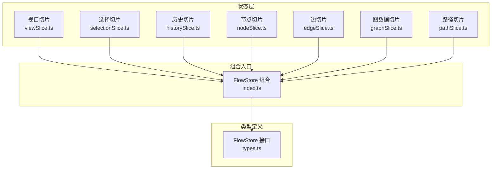
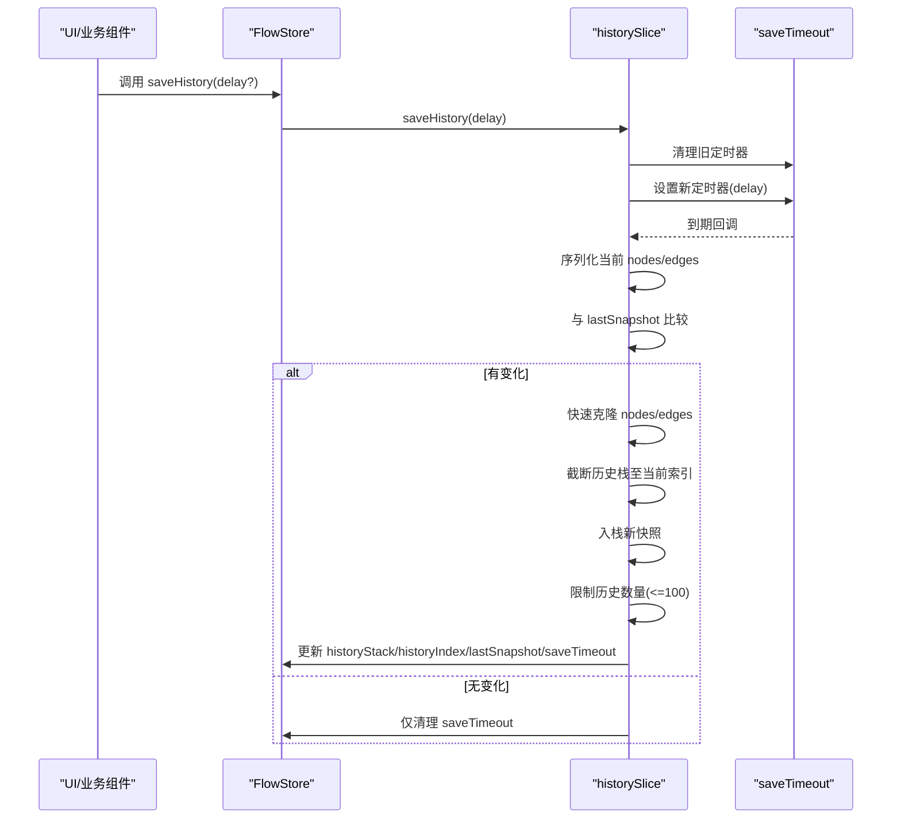
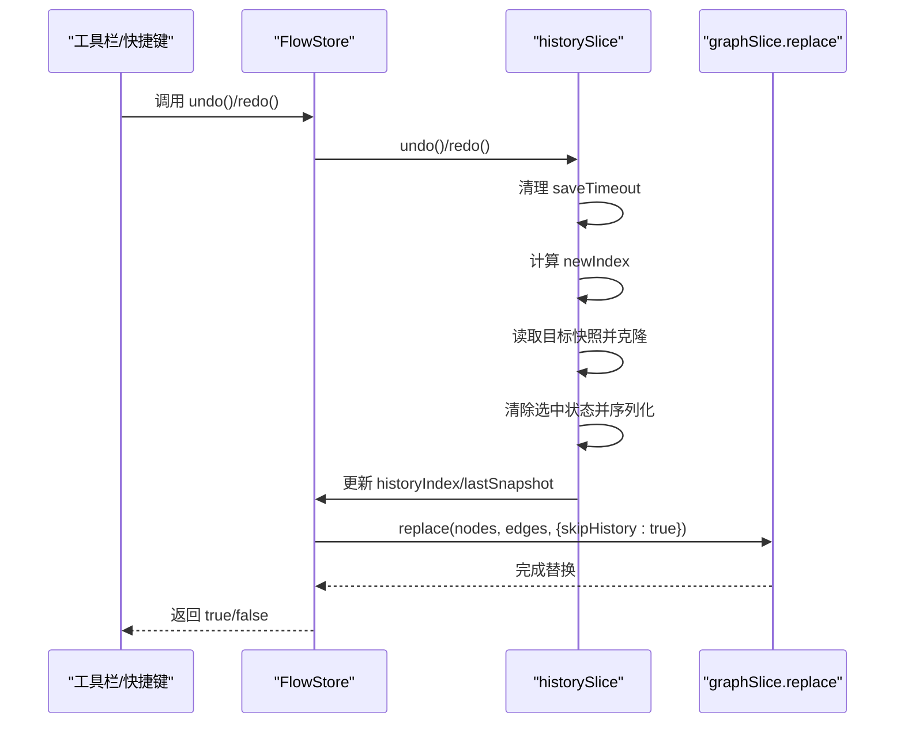
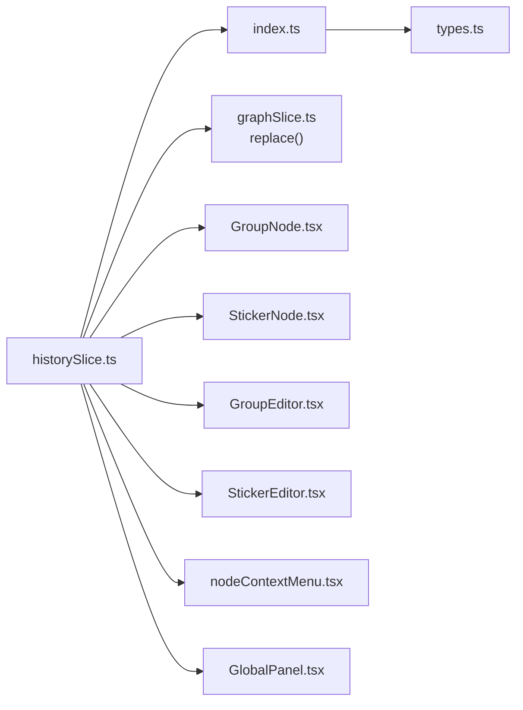

# 历史状态切片

<cite>
**本文引用的文件**
- [historySlice.ts](file://src/stores/flow/slices/historySlice.ts)
- [types.ts](file://src/stores/flow/types.ts)
- [index.ts](file://src/stores/flow/index.ts)
- [Flow.tsx](file://src/components/Flow.tsx)
- [GroupNode.tsx](file://src/components/flow/nodes/GroupNode.tsx)
- [StickerNode.tsx](file://src/components/flow/nodes/StickerNode.tsx)
- [nodeContextMenu.tsx](file://src/components/flow/nodes/nodeContextMenu.tsx)
- [GroupEditor.tsx](file://src/components/panels/node-editors/GroupEditor.tsx)
- [StickerEditor.tsx](file://src/components/panels/node-editors/StickerEditor.tsx)
- [GlobalPanel.tsx](file://src/components/panels/tools/GlobalPanel.tsx)
</cite>

## 目录
1. [简介](#简介)
2. [项目结构](#项目结构)
3. [核心组件](#核心组件)
4. [架构总览](#架构总览)
5. [详细组件分析](#详细组件分析)
6. [依赖关系分析](#依赖关系分析)
7. [性能考量](#性能考量)
8. [故障排查指南](#故障排查指南)
9. [结论](#结论)
10. [附录](#附录)

## 简介
本文件围绕 FlowHistoryState 接口及其历史状态切片（historySlice）进行系统化技术文档编写，重点涵盖：
- 历史栈管理与历史索引维护
- 快照保存与差异检测
- 撤销（undo）与重做（redo）机制
- 初始化与清空历史记录
- 存储策略与内存管理（saveTimeout 与 lastSnapshot）
- 在工作流编辑中的作用：用户操作记录与状态回滚
- 实际使用示例与性能优化建议

## 项目结构
历史状态切片位于前端状态管理模块中，采用 Zustand 的 slice 模式组织，与其他 slice（视口、选择、节点、边、图数据、路径）共同构成完整的 FlowStore。



图表来源
- [index.ts:16-24](file://src/stores/flow/index.ts#L16-L24)
- [types.ts:354-362](file://src/stores/flow/types.ts#L354-L362)

章节来源
- [index.ts:16-24](file://src/stores/flow/index.ts#L16-L24)
- [types.ts:354-362](file://src/stores/flow/types.ts#L354-L362)

## 核心组件
- FlowHistoryState 接口：定义历史状态的字段与方法，包括历史栈、索引、保存超时、最后快照以及 saveHistory、undo、redo、initHistory、clearHistory、getHistoryState。
- createHistorySlice：实现历史状态逻辑，负责快照生成、差异检测、历史栈增删与索引移动、撤销/重做的状态替换。

关键职责与行为
- 快速序列化：仅保留必要字段，避免 UI 状态污染，降低序列化成本。
- 快速克隆：优先使用结构化克隆，失败时回退到 JSON 克隆，保证深拷贝一致性。
- 延迟保存：通过 saveTimeout 将频繁变更合并为一次保存，减少历史栈膨胀。
- 差异检测：基于 lastSnapshot 与当前序列化结果比较，避免无变化的重复保存。
- 历史限制：固定上限（默认 100），超过时丢弃最早记录，保持内存可控。
- 撤销/重做：清除选中状态，替换图数据，跳过历史记录保存，确保回滚过程不产生额外历史。

章节来源
- [historySlice.ts:5-35](file://src/stores/flow/slices/historySlice.ts#L5-L35)
- [historySlice.ts:49-229](file://src/stores/flow/slices/historySlice.ts#L49-L229)
- [types.ts:271-283](file://src/stores/flow/types.ts#L271-L283)

## 架构总览
历史状态切片与 FlowStore 的关系如下：

```mermaid
classDiagram
class FlowStore {
<<合并接口>>
}
class FlowHistoryState {
+historyStack : Array<{nodes, edges}>
+historyIndex : number
+saveTimeout : number|null
+lastSnapshot : string|null
+saveHistory(delay)
+undo() boolean
+redo() boolean
+initHistory(nodes, edges)
+clearHistory()
+getHistoryState() {canUndo, canRedo}
}
class createHistorySlice {
+serializeState(nodes, edges) string
+fastClone(data) T
+saveHistory(delay)
+undo() boolean
+redo() boolean
+initHistory(nodes, edges)
+clearHistory()
+getHistoryState() {canUndo, canRedo}
}
FlowStore <|.. FlowHistoryState : "包含"
createHistorySlice --> FlowHistoryState : "实现"
```

图表来源
- [types.ts:271-283](file://src/stores/flow/types.ts#L271-L283)
- [historySlice.ts:37-42](file://src/stores/flow/slices/historySlice.ts#L37-L42)

## 详细组件分析

### FlowHistoryState 接口设计
- 字段
  - historyStack：历史快照数组，每个元素包含 nodes 与 edges 的快照。
  - historyIndex：当前历史索引，指向当前“已应用”的状态。
  - saveTimeout：延迟保存的定时器句柄，用于合并连续变更。
  - lastSnapshot：上次保存时的序列化字符串，用于差异检测。
- 方法
  - saveHistory(delay?)：延迟保存当前状态，delay 默认 500ms。
  - undo()：回退一步，返回是否成功。
  - redo()：前进一步，返回是否成功。
  - initHistory(nodes, edges)：初始化历史栈，通常在加载或重置时调用。
  - clearHistory()：清空历史，释放内存。
  - getHistoryState()：查询可否撤销/重做。

章节来源
- [types.ts:271-283](file://src/stores/flow/types.ts#L271-L283)

### 快速序列化与克隆
- serializeState：仅保留节点与边的关键字段（如 id、type、data、position、measured、source/target、attributes 等），避免 UI 状态污染，提升序列化效率与稳定性。
- fastClone：优先使用结构化克隆，失败时回退到 JSON 克隆，确保对象深拷贝。

章节来源
- [historySlice.ts:5-35](file://src/stores/flow/slices/historySlice.ts#L5-L35)

### 历史保存流程（saveHistory）


图表来源
- [historySlice.ts:50-108](file://src/stores/flow/slices/historySlice.ts#L50-L108)

章节来源
- [historySlice.ts:50-108](file://src/stores/flow/slices/historySlice.ts#L50-L108)

### 撤销（undo）与重做（redo）
- 撤销：索引减一，读取目标快照，清除选中状态，更新 lastSnapshot，并通过 replace 替换图数据（skipHistory=true，避免产生新历史）。
- 重做：索引加一，同撤销流程，但方向相反。
- getHistoryState：根据 historyIndex 与 historyStack 长度判断可否撤销/重做。



图表来源
- [historySlice.ts:110-188](file://src/stores/flow/slices/historySlice.ts#L110-L188)

章节来源
- [historySlice.ts:110-188](file://src/stores/flow/slices/historySlice.ts#L110-L188)

### 初始化与清空历史
- initHistory：以当前 nodes/edges 生成首个快照，historyIndex=0，lastSnapshot 为序列化结果。
- clearHistory：清理 saveTimeout，重置历史栈为空、索引为 -1、lastSnapshot 为 null。

章节来源
- [historySlice.ts:190-219](file://src/stores/flow/slices/historySlice.ts#L190-L219)

### 历史状态查询
- getHistoryState：返回 canUndo/canRedo，便于 UI 控件启用/禁用。

章节来源
- [historySlice.ts:221-229](file://src/stores/flow/slices/historySlice.ts#L221-L229)

### 历史状态在工作流编辑中的作用
- 用户操作记录：通过 saveHistory 将节点/边的变更按时间顺序记录，形成可回溯的历史链。
- 状态回滚：undo/redo 使用户能够快速回到之前的稳定状态，降低误操作风险。
- 与图数据更新协作：撤销/重做时通过 replace 并跳过历史记录，避免回滚过程产生额外历史。

章节来源
- [historySlice.ts:110-188](file://src/stores/flow/slices/historySlice.ts#L110-L188)

### 实际使用示例
以下为常见场景的调用方式（以路径代替具体代码内容）：
- 节点/边属性变更后保存历史
  - [GroupNode.tsx:60](file://src/components/flow/nodes/GroupNode.tsx#L60)
  - [StickerNode.tsx:63](file://src/components/flow/nodes/StickerNode.tsx#L63)
  - [GroupEditor.tsx:22](file://src/components/panels/node-editors/GroupEditor.tsx#L22)
  - [StickerEditor.tsx:23](file://src/components/panels/node-editors/StickerEditor.tsx#L23)
- 上下文菜单操作后保存历史
  - [nodeContextMenu.tsx:297](file://src/components/flow/nodes/nodeContextMenu.tsx#L297)
  - [nodeContextMenu.tsx:311](file://src/components/flow/nodes/nodeContextMenu.tsx#L311)
  - [nodeContextMenu.tsx:335](file://src/components/flow/nodes/nodeContextMenu.tsx#L335)
  - [nodeContextMenu.tsx:346](file://src/components/flow/nodes/nodeContextMenu.tsx#L346)
- 工具栏撤销/重做
  - [GlobalPanel.tsx:38](file://src/components/panels/tools/GlobalPanel.tsx#L38)
  - [GlobalPanel.tsx:109](file://src/components/panels/tools/GlobalPanel.tsx#L109)
  - [GlobalPanel.tsx:122](file://src/components/panels/tools/GlobalPanel.tsx#L122)

章节来源
- [GroupNode.tsx:60](file://src/components/flow/nodes/GroupNode.tsx#L60)
- [StickerNode.tsx:63](file://src/components/flow/nodes/StickerNode.tsx#L63)
- [GroupEditor.tsx:22](file://src/components/panels/node-editors/GroupEditor.tsx#L22)
- [StickerEditor.tsx:23](file://src/components/panels/node-editors/StickerEditor.tsx#L23)
- [nodeContextMenu.tsx:297](file://src/components/flow/nodes/nodeContextMenu.tsx#L297)
- [nodeContextMenu.tsx:311](file://src/components/flow/nodes/nodeContextMenu.tsx#L311)
- [nodeContextMenu.tsx:335](file://src/components/flow/nodes/nodeContextMenu.tsx#L335)
- [nodeContextMenu.tsx:346](file://src/components/flow/nodes/nodeContextMenu.tsx#L346)
- [GlobalPanel.tsx:38](file://src/components/panels/tools/GlobalPanel.tsx#L38)
- [GlobalPanel.tsx:109](file://src/components/panels/tools/GlobalPanel.tsx#L109)
- [GlobalPanel.tsx:122](file://src/components/panels/tools/GlobalPanel.tsx#L122)

## 依赖关系分析
- 组合关系：historySlice 通过 Zustand 的 StateCreator 注入到 FlowStore，与其他 slice 并列存在。
- 与 graphSlice 的协作：undo/redo 通过 replace 替换图数据，skipHistory=true 避免回滚产生新历史。
- 与 UI 组件的交互：多个节点编辑器与上下文菜单在关键变更后调用 saveHistory，工具栏按钮调用 undo/redo。



图表来源
- [index.ts:16-24](file://src/stores/flow/index.ts#L16-L24)
- [historySlice.ts:141-145](file://src/stores/flow/slices/historySlice.ts#L141-L145)
- [historySlice.ts:181-185](file://src/stores/flow/slices/historySlice.ts#L181-L185)

章节来源
- [index.ts:16-24](file://src/stores/flow/index.ts#L16-L24)
- [historySlice.ts:141-145](file://src/stores/flow/slices/historySlice.ts#L141-L145)
- [historySlice.ts:181-185](file://src/stores/flow/slices/historySlice.ts#L181-L185)

## 性能考量
- 延迟保存与差异检测
  - saveHistory 默认延迟 500ms，合并短时间内多次变更；通过 lastSnapshot 与序列化结果对比，避免无变化的重复保存。
- 历史栈上限控制
  - 固定上限（默认 100），超过时丢弃最早记录，防止内存持续增长。
- 快速克隆与序列化
  - 优先结构化克隆，失败回退 JSON 克隆；仅序列化必要字段，降低序列化与克隆开销。
- 撤销/重做时跳过历史
  - replace 时 skipHistory=true，避免回滚过程产生额外历史，减少不必要的状态写入。
- UI 层面的节流
  - Flow.tsx 中对视口与选择变更使用防抖保存，减少持久化压力。

章节来源
- [historySlice.ts:50-108](file://src/stores/flow/slices/historySlice.ts#L50-L108)
- [historySlice.ts:110-188](file://src/stores/flow/slices/historySlice.ts#L110-L188)
- [Flow.tsx:131-144](file://src/components/Flow.tsx#L131-L144)

## 故障排查指南
- 撤销/重做无效
  - 检查 historyIndex 与 historyStack 长度，确认是否处于边界（index<=0 或 index>=stack.length-1）。
  - 确认 saveTimeout 是否被清理，避免定时器冲突导致状态未更新。
- 历史记录过多或内存占用高
  - 确认 saveHistory 的调用频率与 delay 设置；适当提高 delay 以合并变更。
  - 确认历史上限是否生效（默认 100），必要时在业务侧触发 clearHistory 释放内存。
- 撤销后选中状态异常
  - 撤销/重做会清除选中状态，属于预期行为；如需保留，应在业务侧自行处理。
- 无法回滚到初始状态
  - 确保在初始化或重置时调用 initHistory，否则 historyIndex 为 -1，无法撤销。

章节来源
- [historySlice.ts:110-188](file://src/stores/flow/slices/historySlice.ts#L110-L188)
- [historySlice.ts:190-219](file://src/stores/flow/slices/historySlice.ts#L190-L219)

## 结论
历史状态切片通过延迟保存、差异检测、固定上限与快速克隆等策略，在保证用户体验的同时有效控制了内存与性能开销。其与 graphSlice 的协作使得撤销/重做具备即时性与一致性，配合 UI 组件在关键变更点调用 saveHistory，形成了完整的工作流编辑回滚闭环。

## 附录
- 相关类型与组合入口
  - FlowStore 接口与各 slice 的组合入口，便于理解历史状态在整个状态体系中的位置。
- 常见调用点
  - 节点编辑器、上下文菜单、工具栏等 UI 组件均在合适时机调用历史状态方法，确保用户操作可回溯。

章节来源
- [types.ts:354-362](file://src/stores/flow/types.ts#L354-L362)
- [index.ts:16-24](file://src/stores/flow/index.ts#L16-L24)