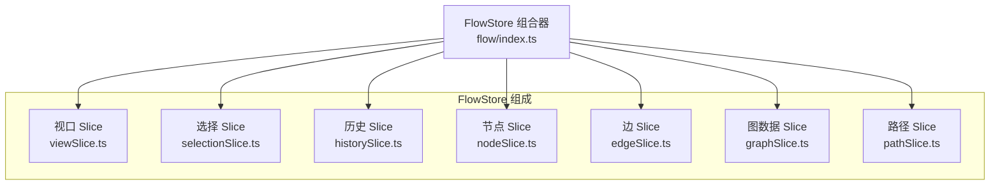
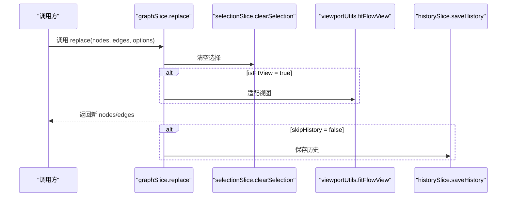
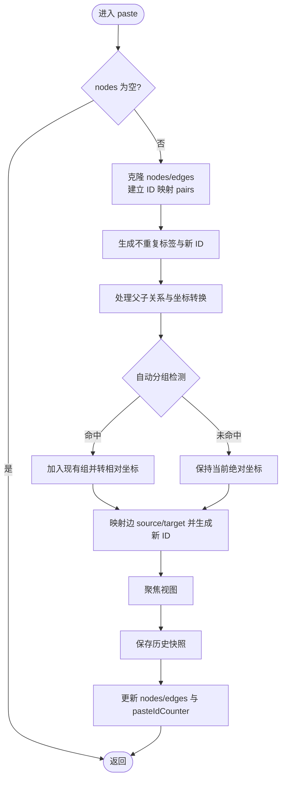
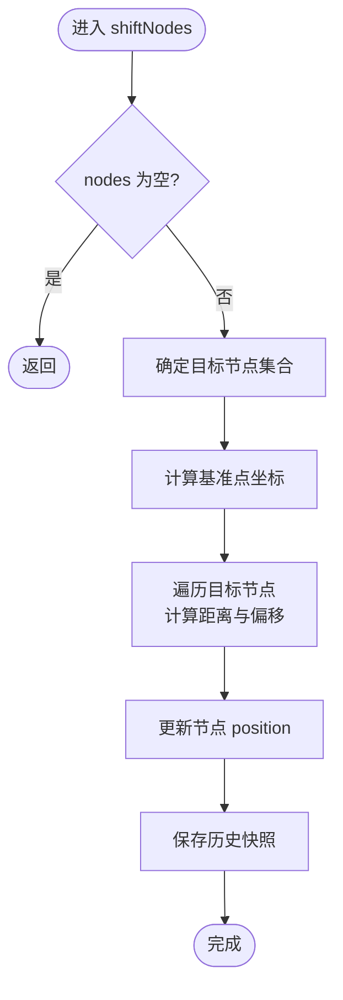
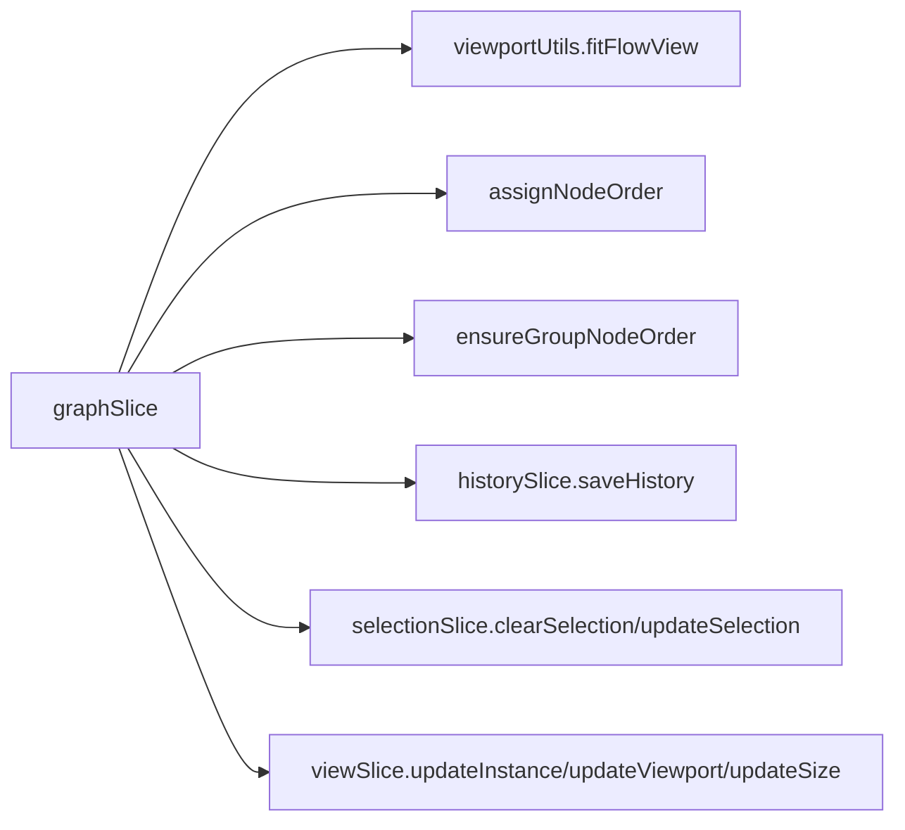

# 图数据状态切片

<cite>
**本文档引用的文件**
- [src/stores/flow/types.ts](file://src/stores/flow/types.ts)
- [src/stores/flow/slices/graphSlice.ts](file://src/stores/flow/slices/graphSlice.ts)
- [src/stores/flow/slices/historySlice.ts](file://src/stores/flow/slices/historySlice.ts)
- [src/stores/flow/slices/selectionSlice.ts](file://src/stores/flow/slices/selectionSlice.ts)
- [src/stores/flow/slices/viewSlice.ts](file://src/stores/flow/slices/viewSlice.ts)
- [src/stores/flow/index.ts](file://src/stores/flow/index.ts)
- [src/components/Flow.tsx](file://src/components/Flow.tsx)
- [src/stores/fileStore.ts](file://src/stores/fileStore.ts)
</cite>

## 目录
1. [简介](#简介)
2. [项目结构](#项目结构)
3. [核心组件](#核心组件)
4. [架构总览](#架构总览)
5. [详细组件分析](#详细组件分析)
6. [依赖分析](#依赖分析)
7. [性能考虑](#性能考虑)
8. [故障排查指南](#故障排查指南)
9. [结论](#结论)
10. [附录](#附录)

## 简介
本文件围绕“图数据状态切片”展开，重点解析 FlowGraphState 接口的设计与实现，涵盖以下能力：
- 图数据替换：完整工作流替换，支持视图适配与历史记录控制
- 批量粘贴：节点与边的复制粘贴，含去重命名、父子关系处理、自动分组检测
- 节点位移：按水平或垂直方向进行带比例的节点整体移动
- 选项参数：isFitView、skipHistory、skipSave 等配置项的作用与影响
- 工作流管理中的关键角色：如何通过 replace/paste/shiftNodes 构建高效的大规模工作流操作

## 项目结构
FlowGraphState 属于 FlowStore 的一部分，后者由多个 slice 组合而成，包括视口、选择、历史、节点、边、图数据、路径等。图数据状态切片位于 flow/slices/graphSlice.ts，类型定义位于 flow/types.ts。

图表来源
- [src/stores/flow/index.ts:15-24](file://src/stores/flow/index.ts#L15-L24)
- [src/stores/flow/slices/viewSlice.ts:1-28](file://src/stores/flow/slices/viewSlice.ts#L1-L28)
- [src/stores/flow/slices/selectionSlice.ts:1-100](file://src/stores/flow/slices/selectionSlice.ts#L1-L100)
- [src/stores/flow/slices/historySlice.ts:1-230](file://src/stores/flow/slices/historySlice.ts#L1-L230)
- [src/stores/flow/slices/nodeSlice.ts:1-691](file://src/stores/flow/slices/nodeSlice.ts#L1-L691)
- [src/stores/flow/slices/edgeSlice.ts:1-222](file://src/stores/flow/slices/edgeSlice.ts#L1-L222)
- [src/stores/flow/slices/graphSlice.ts:1-305](file://src/stores/flow/slices/graphSlice.ts#L1-L305)

章节来源
- [src/stores/flow/index.ts:15-24](file://src/stores/flow/index.ts#L15-L24)
- [src/stores/flow/types.ts:323-361](file://src/stores/flow/types.ts#L323-L361)

## 核心组件
- FlowGraphState 接口：定义图数据相关的方法与状态，包括 pasteIdCounter、replace、paste、resetPasteCounter、shiftNodes
- graphSlice 实现：提供上述方法的具体逻辑，负责节点/边的替换、粘贴、位移以及与历史记录、视口适配的协作
- 依赖的工具与状态：
  - 视口适配：fitFlowView
  - 节点顺序分配：assignNodeOrder
  - 组节点顺序保证：ensureGroupNodeOrder
  - 历史记录：saveHistory、undo/redo
  - 选择状态：clearSelection、updateSelection

章节来源
- [src/stores/flow/types.ts:323-338](file://src/stores/flow/types.ts#L323-L338)
- [src/stores/flow/slices/graphSlice.ts:18-303](file://src/stores/flow/slices/graphSlice.ts#L18-L303)

## 架构总览
FlowGraphState 在 FlowStore 中与其他 slice 协同工作，形成完整的图编辑状态管理。下图展示了图数据替换与历史记录的关系：

图表来源
- [src/stores/flow/slices/graphSlice.ts:19-50](file://src/stores/flow/slices/graphSlice.ts#L19-L50)
- [src/stores/flow/slices/selectionSlice.ts:81-98](file://src/stores/flow/slices/selectionSlice.ts#L81-L98)
- [src/stores/flow/slices/historySlice.ts:49-108](file://src/stores/flow/slices/historySlice.ts#L49-L108)

## 详细组件分析

### FlowGraphState 接口设计
- pasteIdCounter：粘贴计数器，用于生成唯一的粘贴节点 ID 与标签
- replace(nodes, edges, options)：完整替换图数据，支持视图适配与历史记录控制
- paste(nodes, edges)：批量粘贴，处理去重名、父子关系、自动分组检测与视图聚焦
- resetPasteCounter()：重置粘贴计数器
- shiftNodes(direction, delta, targetNodeIds?)：按方向与比例对节点进行整体位移

章节来源
- [src/stores/flow/types.ts:323-338](file://src/stores/flow/types.ts#L323-L338)

### replace 方法详解
- 输入参数
  - nodes/edges：待替换的节点与边数组
  - options：可选配置
    - isFitView：是否在替换后适配视图
    - skipHistory：是否跳过历史记录保存
    - skipSave：当前实现中未使用（保留扩展性）
- 处理流程
  - 深拷贝节点与边，确保不影响原始数据
  - 确保组节点排在子节点之前（保证渲染与交互正确）
  - 清空选择状态
  - 若启用视图适配，则调用适配函数
  - 更新 nodes/edges 状态
  - 根据 skipHistory 决定是否保存历史快照
- 与历史记录的协作
  - replace 本身不直接保存历史，而是通过 saveHistory 控制时机

章节来源
- [src/stores/flow/slices/graphSlice.ts:19-50](file://src/stores/flow/slices/graphSlice.ts#L19-L50)
- [src/stores/flow/slices/historySlice.ts:49-108](file://src/stores/flow/slices/historySlice.ts#L49-L108)
- [src/stores/flow/slices/selectionSlice.ts:81-98](file://src/stores/flow/slices/selectionSlice.ts#L81-L98)

### paste 方法详解
- 输入参数
  - nodes/edges：待粘贴的节点与边数组
- 处理流程
  - 取消当前选择，避免粘贴后残留选中状态
  - 克隆节点与边，建立原 ID 到新 ID 的映射 pairs
  - 生成不重复的新 ID 与标签（带粘贴计数器后缀）
  - 分配节点顺序号
  - 处理父子关系与坐标转换
    - 组内节点：将相对坐标转换为绝对坐标，再根据父节点是否存在决定是否保持组关系
    - 父节点不存在：清除 parentId，并在当前位置基础上偏移一定像素
  - 自动分组检测：若节点中心落入现有组内，则自动加入该组，并转换为相对坐标
  - 边映射：根据 pairs 映射 source/target，并重新生成边 ID
  - 更新选择状态，聚焦视图
  - 保证组节点顺序在子节点之前
  - 更新 pasteIdCounter
- 与历史记录的协作
  - 粘贴完成后统一保存历史快照

图表来源
- [src/stores/flow/slices/graphSlice.ts:53-247](file://src/stores/flow/slices/graphSlice.ts#L53-L247)

章节来源
- [src/stores/flow/slices/graphSlice.ts:53-247](file://src/stores/flow/slices/graphSlice.ts#L53-L247)

### resetPasteCounter 方法
- 作用：将粘贴计数器重置为初始值，避免后续粘贴产生重复标签
- 使用场景：批量导入或初始化工作流后，需要重新开始粘贴序列

章节来源
- [src/stores/flow/slices/graphSlice.ts:250-253](file://src/stores/flow/slices/graphSlice.ts#L250-L253)

### shiftNodes 方法详解
- 输入参数
  - direction：horizontal 或 vertical
  - delta：位移强度系数
  - targetNodeIds：可选的目标节点集合；未提供则对全部节点生效
- 处理流程
  - 确定目标节点集合
  - 计算基准点（最左上侧节点对应方向的最小坐标）
  - 对每个目标节点，计算其与基准点的距离，按比例（距离/100）乘以 delta 得到偏移量
  - 按方向累加偏移，更新节点位置
  - 保存历史快照
- 适用场景：对齐布局、批量微调、视觉优化

图表来源
- [src/stores/flow/slices/graphSlice.ts:255-303](file://src/stores/flow/slices/graphSlice.ts#L255-L303)

章节来源
- [src/stores/flow/slices/graphSlice.ts:255-303](file://src/stores/flow/slices/graphSlice.ts#L255-L303)

### 选项参数说明
- isFitView（replace）
  - true：替换后自动适配视图，使新工作流完全可见
  - false：保持当前视图不变
- skipHistory（replace）
  - false：替换后保存历史快照，支持撤销/重做
  - true：跳过历史保存，适合内部状态同步（如撤销/重做时的回放）
- skipSave（replace）
  - 当前实现中未使用，保留为未来扩展（如持久化策略）

章节来源
- [src/stores/flow/slices/graphSlice.ts:20-24](file://src/stores/flow/slices/graphSlice.ts#L20-L24)
- [src/stores/flow/slices/historySlice.ts:141-186](file://src/stores/flow/slices/historySlice.ts#L141-L186)

### 工作流管理中的关键作用
- 完整工作流替换
  - 通过 replace 实现，支持视图适配与历史记录控制，便于在不同工作流间切换
- 批量粘贴
  - paste 提供强大的复制粘贴能力，包括去重名、父子关系与自动分组检测，适合大规模工作流复用
- 节点整体移动
  - shiftNodes 提供基于比例的位移算法，适合对齐与布局优化

章节来源
- [src/stores/flow/slices/graphSlice.ts:19-303](file://src/stores/flow/slices/graphSlice.ts#L19-L303)
- [src/stores/flow/slices/historySlice.ts:141-186](file://src/stores/flow/slices/historySlice.ts#L141-L186)

### 实际使用示例与最佳实践
- 完整工作流替换
  - 场景：打开新文件或加载模板
  - 建议：isFitView=true，skipHistory=false；替换后自动聚焦视图，允许用户撤销
- 批量粘贴
  - 场景：复制一组节点到当前工作流
  - 建议：粘贴后统一保存历史；若需避免历史污染，可在业务层自行控制保存时机
- 节点整体移动
  - 场景：对齐一组节点的左侧边缘
  - 建议：先选择目标节点，再调用 shiftNodes(horizontal, delta)

章节来源
- [src/stores/flow/slices/graphSlice.ts:53-247](file://src/stores/flow/slices/graphSlice.ts#L53-L247)
- [src/stores/flow/slices/graphSlice.ts:255-303](file://src/stores/flow/slices/graphSlice.ts#L255-L303)

## 依赖分析
- graphSlice 依赖
  - 视口适配：fitFlowView
  - 节点顺序：assignNodeOrder
  - 组节点顺序：ensureGroupNodeOrder
  - 历史记录：saveHistory
  - 选择状态：clearSelection/updateSelection
- 与 FlowStore 的组合
  - graphSlice 与 viewSlice、selectionSlice、historySlice 等协同，共同维护图状态一致性

图表来源
- [src/stores/flow/slices/graphSlice.ts:1-7](file://src/stores/flow/slices/graphSlice.ts#L1-L7)
- [src/stores/flow/slices/historySlice.ts:49-108](file://src/stores/flow/slices/historySlice.ts#L49-L108)
- [src/stores/flow/slices/selectionSlice.ts:1-100](file://src/stores/flow/slices/selectionSlice.ts#L1-L100)
- [src/stores/flow/slices/viewSlice.ts:1-28](file://src/stores/flow/slices/viewSlice.ts#L1-L28)

章节来源
- [src/stores/flow/slices/graphSlice.ts:1-7](file://src/stores/flow/slices/graphSlice.ts#L1-L7)
- [src/stores/flow/index.ts:15-24](file://src/stores/flow/index.ts#L15-L24)

## 性能考虑
- 粘贴过程中的深拷贝与映射
  - cloneDeep 与 pairs 映射在节点/边较多时会产生额外开销，建议在大批量粘贴前进行节流或分批处理
- 历史记录保存
  - saveHistory 默认延迟保存，避免频繁写入；在 replace/paste/shiftNodes 中已合理控制保存时机
- 视口适配
  - fitFlowView 在节点较多时可能带来布局计算成本，建议仅在必要时触发

## 故障排查指南
- 粘贴后节点重名
  - 现象：标签重复导致校验失败
  - 处理：paste 已内置去重名逻辑；若仍出现，检查 pasteIdCounter 是否被意外重置
- 父子关系丢失
  - 现象：粘贴后组关系异常
  - 处理：确认父节点是否存在于原工作流；若父节点不存在，会自动清除 parentId 并偏移位置
- 自动分组未生效
  - 现象：节点应属于某组但未加入
  - 处理：检查节点中心是否落入组边界内；确认组尺寸与测量值有效
- 位移效果不符合预期
  - 现象：节点位移幅度不一致
  - 处理：确认基准点计算逻辑与方向参数；delta 与距离比例共同决定偏移量

章节来源
- [src/stores/flow/slices/graphSlice.ts:72-247](file://src/stores/flow/slices/graphSlice.ts#L72-L247)
- [src/stores/flow/slices/graphSlice.ts:255-303](file://src/stores/flow/slices/graphSlice.ts#L255-L303)

## 结论
FlowGraphState 通过 replace、paste、resetPasteCounter、shiftNodes 等方法，提供了完整的工作流图数据管理能力。配合视口适配、历史记录与选择状态，能够高效支撑大规模工作流的替换、粘贴与布局调整。在实际使用中，合理配置 isFitView 与 skipHistory，结合批量处理与延迟保存策略，可获得更佳的性能与用户体验。

## 附录
- 与 Flow 组件的集成
  - Flow 组件通过 useFlowStore 订阅 nodes/edges 等状态，graphSlice 的 replace/paste/shiftNodes 会驱动 UI 更新
- 与文件存储的同步
  - 文件存储通过同步函数将 FlowStore 的 nodes/edges 同步到文件配置，确保持久化与 UI 一致

章节来源
- [src/components/Flow.tsx:193-239](file://src/components/Flow.tsx#L193-L239)
- [src/stores/fileStore.ts:85-123](file://src/stores/fileStore.ts#L85-L123)